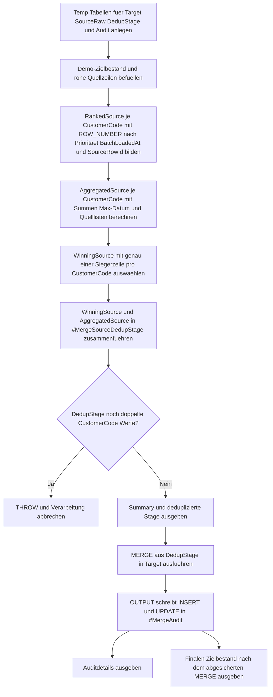

# MergeSourceDedupGuard.sql

Dieses Skript zeigt ein didaktisches Schutzmuster fuer `MERGE`, wenn die Quellmenge denselben Business Key mehrfach liefern kann. Vor dem eigentlichen `MERGE` werden die Rohzeilen je `CustomerCode` zuerst aggregiert, dann per Prioritaetsregel auf genau eine Stage-Zeile verdichtet und erst danach in den Zielbestand uebernommen.

## Uebersicht

<!-- SQLDOC:SUMMARY_TABLE:BEGIN -->
| Feld | Wert |
|---|---|
| Script | [MergeSourceDedupGuard.sql](MergeSourceDedupGuard.sql) |
| Version | `1.0` |
| Typ | `didactic-lab` |
| Kapitel | `13_Merge` |
| Sicherheit | `demo-write-tempdb` |
| Zweck | Verhindert Mehrfachtreffer im `MERGE` durch Voraggregation und Deduplizierung der Quellmenge. |
<!-- SQLDOC:SUMMARY_TABLE:END -->

## Annahmen

- Die Erstversion arbeitet ausschliesslich mit temporaeren Demo-Tabellen.
- Mehrere Quellzeilen je `CustomerCode` werden nicht verworfen, sondern fuer Mengenfelder voraggregiert und fuer Stammdaten ueber eine feste Prioritaetsregel verdichtet.
- Die Prioritaetsregel lautet: hoehere `SourcePriority`, danach juengeres `BatchLoadedAt`, danach groessere `SourceRowId`.

## Anwendungsfall

Das Skript eignet sich fuer folgende Leitfragen:

- Wie laesst sich eine MERGE-Quelle absichern, wenn ein Business Key mehrfach im Batch auftaucht?
- Welche Felder sollten aggregiert werden, und welche Felder muessen aus genau einer Siegerzeile kommen?
- Wie kann vor dem `MERGE` nachgewiesen werden, dass das Stage nur noch eine Zeile pro Join-Key enthaelt?

## Parameter

<!-- SQLDOC:PARAMETERS_TABLE:BEGIN -->
| Parameter | SQL-Typ | Pflicht | Beschreibung |
|---|---|---|---|
| `-` | `-` | `-` | Dieses Demoskript verwendet keine Laufzeitparameter. |
<!-- SQLDOC:PARAMETERS_TABLE:END -->

## Abhaengigkeiten

<!-- SQLDOC:DEPENDENCIES_LIST:BEGIN -->
- `MERGE`
- `OUTPUT $action`
- CTEs
- `ROW_NUMBER`
- `STRING_AGG`
- temporaere Tabellen in `tempdb`
- `THROW`
<!-- SQLDOC:DEPENDENCIES_LIST:END -->

## Hinweise

- `MergeSourceDedupSummary` zeigt, wie viele Rohzeilen pro `CustomerCode` in die deduplizierte Stage eingeflossen sind.
- `MergeSourceDedupStage` dokumentiert die finalen Stage-Werte mitsamt Siegerquelle, Quelllisten und aggregierten Mengen.
- `MergeSourceDedupAudit` macht sichtbar, welche `INSERT`- oder `UPDATE`-Aktionen aus der abgesicherten Stage im `MERGE` angekommen sind.
- Das Skript verwendet fuer `CustomerName`, `SegmentLabel` und `SourceSystemLabel` die Gewinnerzeile, fuer Mengen aber die aggregierten Werte aller Rohzeilen desselben Keys.

## Versionshistorie

<!-- SQLDOC:VERSION_HISTORY_TABLE:BEGIN -->
| Version | Datum | User | Beschreibung |
|---|---|---|---|
| `1.0` | `2026-04-18` | `ER` | Erstversion eines didaktischen Dedup-Guard-Musters fuer MERGE-Quellen |
<!-- SQLDOC:VERSION_HISTORY_TABLE:END -->

## Ablauf

<!-- SQLDOC:MERMAID:BEGIN -->

<!-- SQLDOC:MERMAID:END -->

## SQL-Code

<!-- SQLDOC:SQL_CODE:BEGIN -->
```sql
/*
BEGIN:SQL-HEADER v1
---
sql_header: v1
script_name: "MergeSourceDedupGuard.sql"
script_version: "1.0"
script_type: "didactic-lab"
chapter: "13_Merge"

purpose: >
  Verhindert Mehrfachtreffer in einem didaktischen MERGE-Szenario, indem
  eine absichtlich doppelte Quellmenge zuerst profiliert, dann per
  Voraggregation und ROW_NUMBER-Deduplizierung auf genau eine Stage-Zeile pro
  Business Key reduziert wird.

parameters: []

result_sets:
  - name: "MergeSourceDedupSummary"
    description: "Zeigt je Business Key die Zahl roher Source-Zeilen und die gewaehlt deduplizierte Stage-Zeile"
  - name: "MergeSourceDedupStage"
    description: "Dokumentiert die deduplizierte MERGE-Stage inklusive Prioritaets- und Aggregationsmerkmalen"
  - name: "MergeSourceDedupAudit"
    description: "Protokolliert die durch das MERGE ausgefuehrten INSERT- und UPDATE-Aktionen"
  - name: "MergeSourceDedupTargetAfter"
    description: "Zeigt den finalen Zielbestand nach dem abgesicherten MERGE"

dependencies:
  - "MERGE"
  - "OUTPUT $action"
  - "CTE"
  - "ROW_NUMBER"
  - "STRING_AGG"
  - "temporary tables"
  - "THROW"

safety:
  level: "demo-write-tempdb"
  writes_data: false

documentation:
  markdown_file: "T-SQL/13_Merge/SQLScripts/MergeSourceDedupGuard.md"
  sync_blocks:
    - "SUMMARY_TABLE"
    - "PARAMETERS_TABLE"
    - "DEPENDENCIES_LIST"
    - "VERSION_HISTORY_TABLE"
    - "SQL_CODE"
  mermaid:
    mode: "ai-agent-from-sql"
    source: "script-body"

main_responsible:
  name: "Erhard Rainer"
  initials: "ER"

version_history:
  - version: "1.0"
    date: "2026-04-18"
    user: "ER"
    description: "Erstversion eines didaktischen Dedup-Guard-Musters fuer MERGE-Quellen"

notes:
  - "Die Erstversion nutzt ausschliesslich temporaere Demo-Tabellen."
  - "Mehrere Source-Zeilen pro CustomerCode werden vor dem MERGE auf genau eine Stage-Zeile verdichtet."
  - "Mengen wie QuantityDelta und LastOrderAmount werden bewusst voraggregiert, waehrend Stammdaten per Prioritaetsregel dedupliziert werden."
---
END:SQL-HEADER v1
*/

SET NOCOUNT ON;

DROP TABLE IF EXISTS #MergeTarget;
DROP TABLE IF EXISTS #MergeSourceRaw;
DROP TABLE IF EXISTS #MergeSourceDedupStage;
DROP TABLE IF EXISTS #MergeAudit;

CREATE TABLE #MergeTarget
(
    CustomerCode         VARCHAR(10)   NOT NULL PRIMARY KEY,
    CustomerName         VARCHAR(100)  NOT NULL,
    SegmentLabel         VARCHAR(20)   NOT NULL,
    LastOrderDate        DATE          NOT NULL,
    LifetimeOrderAmount  DECIMAL(12,2) NOT NULL,
    OpenQuantity         INT           NOT NULL,
    SourceSystemLabel    VARCHAR(20)   NOT NULL
);

CREATE TABLE #MergeSourceRaw
(
    SourceRowId          INT           NOT NULL PRIMARY KEY,
    CustomerCode         VARCHAR(10)   NOT NULL,
    CustomerName         VARCHAR(100)  NOT NULL,
    SegmentLabel         VARCHAR(20)   NOT NULL,
    LastOrderDate        DATE          NOT NULL,
    QuantityDelta        INT           NOT NULL,
    LastOrderAmount      DECIMAL(12,2) NOT NULL,
    SourcePriority       INT           NOT NULL,
    BatchLoadedAt        DATETIME2(0)  NOT NULL,
    SourceSystemLabel    VARCHAR(20)   NOT NULL
);

CREATE TABLE #MergeSourceDedupStage
(
    CustomerCode             VARCHAR(10)   NOT NULL PRIMARY KEY,
    CustomerName             VARCHAR(100)  NOT NULL,
    SegmentLabel             VARCHAR(20)   NOT NULL,
    LatestOrderDate          DATE          NOT NULL,
    AggregatedOrderAmount    DECIMAL(12,2) NOT NULL,
    AggregatedQuantityDelta  INT           NOT NULL,
    SourcePriorityChosen     INT           NOT NULL,
    SourceRowsMerged         INT           NOT NULL,
    SourceRowIds             VARCHAR(200)  NOT NULL,
    SourceSystemsSeen        VARCHAR(200)  NOT NULL,
    WinnerLoadedAt           DATETIME2(0)  NOT NULL,
    WinnerSourceSystemLabel  VARCHAR(20)   NOT NULL
);

CREATE TABLE #MergeAudit
(
    AuditId                    INT IDENTITY(1,1) NOT NULL PRIMARY KEY,
    MergeAction                VARCHAR(10)       NOT NULL,
    CustomerCode               VARCHAR(10)       NOT NULL,
    SourceRowsMerged           INT               NOT NULL,
    AggregatedQuantityDelta    INT               NOT NULL,
    AggregatedOrderAmount      DECIMAL(12,2)     NOT NULL,
    OldOpenQuantity            INT               NULL,
    NewOpenQuantity            INT               NULL,
    OldLifetimeOrderAmount     DECIMAL(12,2)     NULL,
    NewLifetimeOrderAmount     DECIMAL(12,2)     NULL,
    OldLastOrderDate           DATE              NULL,
    NewLastOrderDate           DATE              NULL,
    WinnerSourceSystemLabel    VARCHAR(20)       NOT NULL
);

INSERT INTO #MergeTarget
(
    CustomerCode,
    CustomerName,
    SegmentLabel,
    LastOrderDate,
    LifetimeOrderAmount,
    OpenQuantity,
    SourceSystemLabel
)
VALUES
    ('C001', 'Alpine Retail',    'standard', '2026-04-10', 1800.00, 4, 'CRM'),
    ('C002', 'Baltic Foods',     'standard', '2026-04-12',  950.00, 2, 'ERP'),
    ('C003', 'City Logistics',   'priority', '2026-04-08', 1425.00, 6, 'CRM'),
    ('C005', 'Delta Services',   'legacy',   '2026-03-28',  610.00, 1, 'ERP');

INSERT INTO #MergeSourceRaw
(
    SourceRowId,
    CustomerCode,
    CustomerName,
    SegmentLabel,
    LastOrderDate,
    QuantityDelta,
    LastOrderAmount,
    SourcePriority,
    BatchLoadedAt,
    SourceSystemLabel
)
VALUES
    (101, 'C001', 'Alpine Retail GmbH', 'priority', '2026-04-16',  2, 320.00, 90, '2026-04-18T08:00:00', 'CRM'),
    (102, 'C001', 'Alpine Retail GmbH', 'priority', '2026-04-17',  1, 180.00, 95, '2026-04-18T08:05:00', 'Web'),
    (103, 'C002', 'Baltic Foods GmbH',  'standard', '2026-04-14',  3, 210.00, 80, '2026-04-18T08:02:00', 'ERP'),
    (104, 'C003', 'City Logistics',     'priority', '2026-04-18', -1,  75.00, 85, '2026-04-18T08:09:00', 'CRM'),
    (105, 'C003', 'City Logistics SE',  'priority', '2026-04-18',  4, 260.00, 88, '2026-04-18T08:11:00', 'Sales'),
    (106, 'C004', 'Elm Mobility',       'new',      '2026-04-18',  5, 540.00, 92, '2026-04-18T08:15:00', 'Web');

;WITH RankedSource AS
(
    SELECT
        sr.SourceRowId,
        sr.CustomerCode,
        sr.CustomerName,
        sr.SegmentLabel,
        sr.LastOrderDate,
        sr.QuantityDelta,
        sr.LastOrderAmount,
        sr.SourcePriority,
        sr.BatchLoadedAt,
        sr.SourceSystemLabel,
        ROW_NUMBER() OVER
        (
            PARTITION BY sr.CustomerCode
            ORDER BY
                sr.SourcePriority DESC,
                sr.BatchLoadedAt DESC,
                sr.SourceRowId DESC
        ) AS SourceRank
    FROM #MergeSourceRaw AS sr
),
AggregatedSource AS
(
    SELECT
        sr.CustomerCode,
        COUNT(*) AS SourceRowsMerged,
        SUM(sr.QuantityDelta) AS AggregatedQuantityDelta,
        SUM(sr.LastOrderAmount) AS AggregatedOrderAmount,
        MAX(sr.LastOrderDate) AS LatestOrderDate,
        STRING_AGG(CAST(sr.SourceRowId AS VARCHAR(20)), ', ') WITHIN GROUP (ORDER BY sr.SourceRowId) AS SourceRowIds,
        STRING_AGG(sr.SourceSystemLabel, ', ') WITHIN GROUP (ORDER BY sr.SourceRowId) AS SourceSystemsSeen
    FROM #MergeSourceRaw AS sr
    GROUP BY
        sr.CustomerCode
),
WinningSource AS
(
    SELECT
        rs.CustomerCode,
        rs.CustomerName,
        rs.SegmentLabel,
        rs.SourcePriority,
        rs.BatchLoadedAt,
        rs.SourceSystemLabel
    FROM RankedSource AS rs
    WHERE rs.SourceRank = 1
)
INSERT INTO #MergeSourceDedupStage
(
    CustomerCode,
    CustomerName,
    SegmentLabel,
    LatestOrderDate,
    AggregatedOrderAmount,
    AggregatedQuantityDelta,
    SourcePriorityChosen,
    SourceRowsMerged,
    SourceRowIds,
    SourceSystemsSeen,
    WinnerLoadedAt,
    WinnerSourceSystemLabel
)
SELECT
    ws.CustomerCode,
    ws.CustomerName,
    ws.SegmentLabel,
    agg.LatestOrderDate,
    agg.AggregatedOrderAmount,
    agg.AggregatedQuantityDelta,
    ws.SourcePriority,
    agg.SourceRowsMerged,
    agg.SourceRowIds,
    agg.SourceSystemsSeen,
    ws.BatchLoadedAt,
    ws.SourceSystemLabel
FROM WinningSource AS ws
INNER JOIN AggregatedSource AS agg
    ON agg.CustomerCode = ws.CustomerCode;

IF EXISTS
(
    SELECT
        ds.CustomerCode
    FROM #MergeSourceDedupStage AS ds
    GROUP BY
        ds.CustomerCode
    HAVING COUNT(*) > 1
)
BEGIN
    THROW 50051, 'MergeSourceDedupGuard produced duplicate CustomerCode values in #MergeSourceDedupStage.', 1;
END;

SELECT
    ds.CustomerCode,
    ds.SourceRowsMerged,
    ds.SourceRowIds,
    ds.SourceSystemsSeen,
    ds.SourcePriorityChosen,
    ds.WinnerSourceSystemLabel,
    ds.LatestOrderDate,
    ds.AggregatedQuantityDelta,
    ds.AggregatedOrderAmount
FROM #MergeSourceDedupStage AS ds
ORDER BY
    ds.CustomerCode;

SELECT
    ds.CustomerCode,
    ds.CustomerName,
    ds.SegmentLabel,
    ds.LatestOrderDate,
    ds.AggregatedQuantityDelta,
    ds.AggregatedOrderAmount,
    ds.SourceRowsMerged,
    ds.SourcePriorityChosen,
    ds.SourceRowIds,
    ds.SourceSystemsSeen,
    ds.WinnerLoadedAt
FROM #MergeSourceDedupStage AS ds
ORDER BY
    ds.CustomerCode;

MERGE INTO #MergeTarget AS tgt
USING #MergeSourceDedupStage AS src
    ON tgt.CustomerCode = src.CustomerCode
WHEN MATCHED THEN
    UPDATE SET
        tgt.CustomerName = src.CustomerName,
        tgt.SegmentLabel = src.SegmentLabel,
        tgt.LastOrderDate = CASE
            WHEN src.LatestOrderDate > tgt.LastOrderDate THEN src.LatestOrderDate
            ELSE tgt.LastOrderDate
        END,
        tgt.LifetimeOrderAmount = tgt.LifetimeOrderAmount + src.AggregatedOrderAmount,
        tgt.OpenQuantity = tgt.OpenQuantity + src.AggregatedQuantityDelta,
        tgt.SourceSystemLabel = src.WinnerSourceSystemLabel
WHEN NOT MATCHED BY TARGET THEN
    INSERT
    (
        CustomerCode,
        CustomerName,
        SegmentLabel,
        LastOrderDate,
        LifetimeOrderAmount,
        OpenQuantity,
        SourceSystemLabel
    )
    VALUES
    (
        src.CustomerCode,
        src.CustomerName,
        src.SegmentLabel,
        src.LatestOrderDate,
        src.AggregatedOrderAmount,
        src.AggregatedQuantityDelta,
        src.WinnerSourceSystemLabel
    )
OUTPUT
    $action AS MergeAction,
    inserted.CustomerCode,
    src.SourceRowsMerged,
    src.AggregatedQuantityDelta,
    src.AggregatedOrderAmount,
    deleted.OpenQuantity,
    inserted.OpenQuantity,
    deleted.LifetimeOrderAmount,
    inserted.LifetimeOrderAmount,
    deleted.LastOrderDate,
    inserted.LastOrderDate,
    src.WinnerSourceSystemLabel
INTO #MergeAudit
(
    MergeAction,
    CustomerCode,
    SourceRowsMerged,
    AggregatedQuantityDelta,
    AggregatedOrderAmount,
    OldOpenQuantity,
    NewOpenQuantity,
    OldLifetimeOrderAmount,
    NewLifetimeOrderAmount,
    OldLastOrderDate,
    NewLastOrderDate,
    WinnerSourceSystemLabel
);

SELECT
    ma.MergeAction,
    ma.CustomerCode,
    ma.SourceRowsMerged,
    ma.AggregatedQuantityDelta,
    ma.AggregatedOrderAmount,
    ma.OldOpenQuantity,
    ma.NewOpenQuantity,
    ma.OldLifetimeOrderAmount,
    ma.NewLifetimeOrderAmount,
    ma.OldLastOrderDate,
    ma.NewLastOrderDate,
    ma.WinnerSourceSystemLabel
FROM #MergeAudit AS ma
ORDER BY
    ma.AuditId;

SELECT
    tgt.CustomerCode,
    tgt.CustomerName,
    tgt.SegmentLabel,
    tgt.LastOrderDate,
    tgt.LifetimeOrderAmount,
    tgt.OpenQuantity,
    tgt.SourceSystemLabel
FROM #MergeTarget AS tgt
ORDER BY
    tgt.CustomerCode;
```
<!-- SQLDOC:SQL_CODE:END -->
