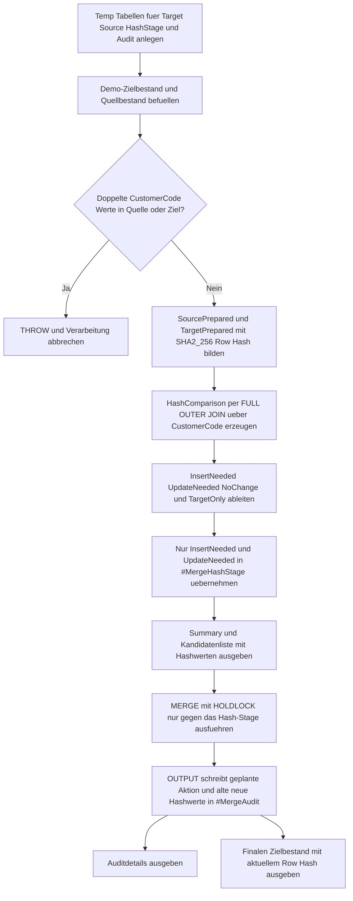

# MergeSourceHashChangeDetect.sql

Dieses Skript zeigt ein didaktisches `MERGE`-Muster, das Quell- und Zielzeilen zuerst ueber einen stabilen SHA2-256-Hash vergleicht. Nur Business Keys mit abweichendem Hash oder komplett neuen Quellzeilen gelangen in das eigentliche `MERGE`-Stage.

## Uebersicht

<!-- SQLDOC:SUMMARY_TABLE:BEGIN -->
| Feld | Wert |
|---|---|
| Script | [MergeSourceHashChangeDetect.sql](MergeSourceHashChangeDetect.sql) |
| Version | `1.0` |
| Typ | `didactic-lab` |
| Kapitel | `13_Merge` |
| Sicherheit | `demo-write-tempdb` |
| Zweck | Vergleicht Quell- und Zielzeilen per SHA2-256-Hash und fuehrt das `MERGE` nur fuer echte Hash-Deltas aus. |
<!-- SQLDOC:SUMMARY_TABLE:END -->

## Annahmen

- Die Erstversion arbeitet ausschliesslich mit temporaeren Demo-Tabellen.
- Der Zeilenhash wird aus `CustomerCode`, `CustomerName`, `SegmentLabel`, `CreditLimit`, `BillingCycle` und `LastReviewedDate` explizit zusammengesetzt.
- `TargetOnly`-Faelle bleiben sichtbar, werden in diesem Demoskript aber bewusst nicht geloescht.

## Anwendungsfall

Das Skript eignet sich fuer folgende Leitfragen:

- Wie laesst sich ein breiter Spaltenvergleich vor `MERGE` in einen kompakten Hash-Vergleich ueberfuehren?
- Welche Business Keys koennen bei identischem Hash vor dem `MERGE` sicher uebersprungen werden?
- Wie wird ein Delta-Stage dokumentiert, das nur `UPDATE`- und `INSERT`-Kandidaten enthaelt?

## Parameter

<!-- SQLDOC:PARAMETERS_TABLE:BEGIN -->
| Parameter | SQL-Typ | Pflicht | Beschreibung |
|---|---|---|---|
| `-` | `-` | `-` | Dieses Demoskript verwendet keine Laufzeitparameter. |
<!-- SQLDOC:PARAMETERS_TABLE:END -->

## Abhaengigkeiten

<!-- SQLDOC:DEPENDENCIES_LIST:BEGIN -->
- `MERGE`
- `OUTPUT $action`
- `HASHBYTES`
- `SHA2_256`
- `FULL OUTER JOIN`
- temporaere Tabellen in `tempdb`
- `THROW`
<!-- SQLDOC:DEPENDENCIES_LIST:END -->

## Hinweise

- `MergeSourceHashSummary` verdichtet die Business Keys nach `NoChange`, `UpdateNeeded`, `InsertNeeded` und `TargetOnly`.
- `MergeSourceHashCandidates` zeigt pro Business Key den Quell- und Zielhash samt didaktischer Interpretation.
- `MergeSourceHashAudit` protokolliert die tatsaechlich ausgefuehrten `MERGE`-Aktionen inklusive alter und neuer Hashwerte.

## Versionshistorie

<!-- SQLDOC:VERSION_HISTORY_TABLE:BEGIN -->
| Version | Datum | User | Beschreibung |
|---|---|---|---|
| `1.0` | `2026-04-18` | `ER` | Erstversion eines hash-basierten Delta-Musters fuer MERGE |
<!-- SQLDOC:VERSION_HISTORY_TABLE:END -->

## Ablauf

<!-- SQLDOC:MERMAID:BEGIN -->

<!-- SQLDOC:MERMAID:END -->

## SQL-Code

<!-- SQLDOC:SQL_CODE:BEGIN -->
```sql
/*
BEGIN:SQL-HEADER v1
---
sql_header: v1
script_name: "MergeSourceHashChangeDetect.sql"
script_version: "1.0"
script_type: "didactic-lab"
chapter: "13_Merge"

purpose: >
  Vergleicht Quell- und Zielzeilen ueber einen stabil gebildeten SHA2-256-Hash,
  klassifiziert dadurch No-Change-, Update- und Insert-Faelle vor dem MERGE
  und fuehrt das eigentliche MERGE nur fuer Business Keys mit abweichendem
  Hash aus.

parameters: []

result_sets:
  - name: "MergeSourceHashSummary"
    description: "Zeigt je Delta-Klasse die Zahl der Business Keys und deren Hash-Vergleichsstatus"
  - name: "MergeSourceHashCandidates"
    description: "Dokumentiert pro Business Key Quell- und Zielhash sowie die abgeleitete Merge-Aktion"
  - name: "MergeSourceHashAudit"
    description: "Protokolliert die tatsaechlich ausgefuehrten MERGE-Aktionen inklusive alter und neuer Hashwerte"
  - name: "MergeSourceHashTargetAfter"
    description: "Zeigt den finalen Zielbestand nach dem hash-gesteuerten MERGE"

dependencies:
  - "MERGE"
  - "OUTPUT $action"
  - "HASHBYTES"
  - "SHA2_256"
  - "FULL OUTER JOIN"
  - "temporary tables"
  - "THROW"

safety:
  level: "demo-write-tempdb"
  writes_data: false

documentation:
  markdown_file: "T-SQL/13_Merge/SQLScripts/MergeSourceHashChangeDetect.md"
  sync_blocks:
    - "SUMMARY_TABLE"
    - "PARAMETERS_TABLE"
    - "DEPENDENCIES_LIST"
    - "VERSION_HISTORY_TABLE"
    - "SQL_CODE"
  mermaid:
    mode: "ai-agent-from-sql"
    source: "script-body"

main_responsible:
  name: "Erhard Rainer"
  initials: "ER"

version_history:
  - version: "1.0"
    date: "2026-04-18"
    user: "ER"
    description: "Erstversion eines hash-basierten Delta-Musters fuer MERGE"

notes:
  - "Die Erstversion nutzt ausschliesslich temporaere Demo-Tabellen."
  - "Der Zeilenhash basiert auf einer expliziten Verkettung fachlicher Vergleichsspalten und dient als didaktisches Delta-Signal."
  - "TargetOnly-Faelle werden sichtbar gemacht, aber bewusst nicht geloescht, damit der Fokus auf Insert und Update bleibt."
---
END:SQL-HEADER v1
*/

SET NOCOUNT ON;

DROP TABLE IF EXISTS #MergeTarget;
DROP TABLE IF EXISTS #MergeSource;
DROP TABLE IF EXISTS #MergeHashStage;
DROP TABLE IF EXISTS #MergeAudit;

CREATE TABLE #MergeTarget
(
    CustomerCode      VARCHAR(10)    NOT NULL PRIMARY KEY,
    CustomerName      VARCHAR(100)   NOT NULL,
    SegmentLabel      VARCHAR(20)    NOT NULL,
    CreditLimit       DECIMAL(10,2)  NOT NULL,
    BillingCycle      VARCHAR(12)    NOT NULL,
    LastReviewedDate  DATE           NOT NULL
);

CREATE TABLE #MergeSource
(
    CustomerCode      VARCHAR(10)    NOT NULL,
    CustomerName      VARCHAR(100)   NOT NULL,
    SegmentLabel      VARCHAR(20)    NOT NULL,
    CreditLimit       DECIMAL(10,2)  NOT NULL,
    BillingCycle      VARCHAR(12)    NOT NULL,
    LastReviewedDate  DATE           NOT NULL
);

CREATE TABLE #MergeHashStage
(
    CustomerCode         VARCHAR(10)    NOT NULL PRIMARY KEY,
    MergeActionPlanned   VARCHAR(12)    NOT NULL,
    SourceRowHashHex     VARCHAR(64)    NOT NULL,
    TargetRowHashHex     VARCHAR(64)    NULL,
    ChangedBecause       VARCHAR(120)   NOT NULL,
    CustomerName         VARCHAR(100)   NOT NULL,
    SegmentLabel         VARCHAR(20)    NOT NULL,
    CreditLimit          DECIMAL(10,2)  NOT NULL,
    BillingCycle         VARCHAR(12)    NOT NULL,
    LastReviewedDate     DATE           NOT NULL
);

CREATE TABLE #MergeAudit
(
    AuditId              INT IDENTITY(1,1) NOT NULL PRIMARY KEY,
    MergeAction          VARCHAR(10)       NOT NULL,
    CustomerCode         VARCHAR(10)       NOT NULL,
    PlannedAction        VARCHAR(12)       NOT NULL,
    ChangedBecause       VARCHAR(120)      NOT NULL,
    OldRowHashHex        VARCHAR(64)       NULL,
    NewRowHashHex        VARCHAR(64)       NULL,
    OldCreditLimit       DECIMAL(10,2)     NULL,
    NewCreditLimit       DECIMAL(10,2)     NULL,
    OldSegmentLabel      VARCHAR(20)       NULL,
    NewSegmentLabel      VARCHAR(20)       NULL,
    OldBillingCycle      VARCHAR(12)       NULL,
    NewBillingCycle      VARCHAR(12)       NULL,
    OldLastReviewedDate  DATE              NULL,
    NewLastReviewedDate  DATE              NULL
);

INSERT INTO #MergeTarget
(
    CustomerCode,
    CustomerName,
    SegmentLabel,
    CreditLimit,
    BillingCycle,
    LastReviewedDate
)
VALUES
    ('C001', 'Alpine Retail',   'standard', 1200.00, 'monthly',   '2026-04-01'),
    ('C002', 'Baltic Foods',    'standard',  900.00, 'monthly',   '2026-03-15'),
    ('C003', 'City Logistics',  'priority', 1500.00, 'quarterly', '2026-03-30'),
    ('C004', 'Delta Services',  'legacy',    650.00, 'monthly',   '2026-02-28');

INSERT INTO #MergeSource
(
    CustomerCode,
    CustomerName,
    SegmentLabel,
    CreditLimit,
    BillingCycle,
    LastReviewedDate
)
VALUES
    ('C001', 'Alpine Retail',      'standard', 1200.00, 'monthly',   '2026-04-01'),
    ('C002', 'Baltic Foods GmbH',  'priority', 1350.00, 'monthly',   '2026-04-18'),
    ('C003', 'City Logistics',     'priority', 1500.00, 'quarterly', '2026-03-30'),
    ('C005', 'Elm Tech',           'new',       800.00, 'monthly',   '2026-04-18');

IF EXISTS
(
    SELECT
        s.CustomerCode
    FROM #MergeSource AS s
    GROUP BY
        s.CustomerCode
    HAVING COUNT(*) > 1
)
BEGIN
    THROW 50061, 'MergeSourceHashChangeDetect detected duplicate CustomerCode values in #MergeSource.', 1;
END;

IF EXISTS
(
    SELECT
        t.CustomerCode
    FROM #MergeTarget AS t
    GROUP BY
        t.CustomerCode
    HAVING COUNT(*) > 1
)
BEGIN
    THROW 50062, 'MergeSourceHashChangeDetect detected duplicate CustomerCode values in #MergeTarget.', 1;
END;

;WITH SourcePrepared AS
(
    SELECT
        s.CustomerCode,
        s.CustomerName,
        s.SegmentLabel,
        s.CreditLimit,
        s.BillingCycle,
        s.LastReviewedDate,
        CONVERT
        (
            VARCHAR(64),
            HASHBYTES
            (
                'SHA2_256',
                CONCAT
                (
                    s.CustomerCode, '|',
                    s.CustomerName, '|',
                    s.SegmentLabel, '|',
                    CONVERT(VARCHAR(30), s.CreditLimit), '|',
                    s.BillingCycle, '|',
                    CONVERT(VARCHAR(10), s.LastReviewedDate, 23)
                )
            ),
            2
        ) AS SourceRowHashHex
    FROM #MergeSource AS s
),
TargetPrepared AS
(
    SELECT
        t.CustomerCode,
        t.CustomerName,
        t.SegmentLabel,
        t.CreditLimit,
        t.BillingCycle,
        t.LastReviewedDate,
        CONVERT
        (
            VARCHAR(64),
            HASHBYTES
            (
                'SHA2_256',
                CONCAT
                (
                    t.CustomerCode, '|',
                    t.CustomerName, '|',
                    t.SegmentLabel, '|',
                    CONVERT(VARCHAR(30), t.CreditLimit), '|',
                    t.BillingCycle, '|',
                    CONVERT(VARCHAR(10), t.LastReviewedDate, 23)
                )
            ),
            2
        ) AS TargetRowHashHex
    FROM #MergeTarget AS t
),
HashComparison AS
(
    SELECT
        COALESCE(src.CustomerCode, tgt.CustomerCode) AS CustomerCode,
        src.CustomerName AS SourceCustomerName,
        tgt.CustomerName AS TargetCustomerName,
        src.SegmentLabel AS SourceSegmentLabel,
        tgt.SegmentLabel AS TargetSegmentLabel,
        src.CreditLimit AS SourceCreditLimit,
        tgt.CreditLimit AS TargetCreditLimit,
        src.BillingCycle AS SourceBillingCycle,
        tgt.BillingCycle AS TargetBillingCycle,
        src.LastReviewedDate AS SourceLastReviewedDate,
        tgt.LastReviewedDate AS TargetLastReviewedDate,
        src.SourceRowHashHex,
        tgt.TargetRowHashHex,
        CASE
            WHEN tgt.CustomerCode IS NULL THEN 'InsertNeeded'
            WHEN src.CustomerCode IS NULL THEN 'TargetOnly'
            WHEN src.SourceRowHashHex = tgt.TargetRowHashHex THEN 'NoChange'
            ELSE 'UpdateNeeded'
        END AS DeltaAction
    FROM SourcePrepared AS src
    FULL OUTER JOIN TargetPrepared AS tgt
        ON tgt.CustomerCode = src.CustomerCode
)
INSERT INTO #MergeHashStage
(
    CustomerCode,
    MergeActionPlanned,
    SourceRowHashHex,
    TargetRowHashHex,
    ChangedBecause,
    CustomerName,
    SegmentLabel,
    CreditLimit,
    BillingCycle,
    LastReviewedDate
)
SELECT
    hc.CustomerCode,
    hc.DeltaAction,
    hc.SourceRowHashHex,
    hc.TargetRowHashHex,
    CASE
        WHEN hc.DeltaAction = 'InsertNeeded' THEN 'Business Key only exists in source.'
        ELSE 'Source and target row hashes differ.'
    END AS ChangedBecause,
    hc.SourceCustomerName,
    hc.SourceSegmentLabel,
    hc.SourceCreditLimit,
    hc.SourceBillingCycle,
    hc.SourceLastReviewedDate
FROM HashComparison AS hc
WHERE hc.DeltaAction IN ('InsertNeeded', 'UpdateNeeded');

SELECT
    hc.DeltaAction,
    COUNT(*) AS BusinessKeyCount,
    STRING_AGG(hc.CustomerCode, ', ') WITHIN GROUP (ORDER BY hc.CustomerCode) AS CustomerCodes
FROM HashComparison AS hc
GROUP BY
    hc.DeltaAction
ORDER BY
    CASE hc.DeltaAction
        WHEN 'NoChange' THEN 1
        WHEN 'UpdateNeeded' THEN 2
        WHEN 'InsertNeeded' THEN 3
        WHEN 'TargetOnly' THEN 4
        ELSE 5
    END;

SELECT
    hc.CustomerCode,
    hc.DeltaAction,
    hc.SourceRowHashHex,
    hc.TargetRowHashHex,
    CASE
        WHEN hc.DeltaAction = 'NoChange' THEN 'Hashwerte identisch; das MERGE kann diesen Business Key ueberspringen.'
        WHEN hc.DeltaAction = 'UpdateNeeded' THEN 'Hashwerte weichen ab; der Business Key geht als Update in das Stage.'
        WHEN hc.DeltaAction = 'InsertNeeded' THEN 'Nur die Quelle enthaelt den Business Key; das Stage plant einen Insert.'
        ELSE 'Nur das Ziel enthaelt den Business Key; in diesem Demoskript erfolgt kein Delete.'
    END AS HashInterpretation
FROM HashComparison AS hc
ORDER BY
    CASE hc.DeltaAction
        WHEN 'NoChange' THEN 1
        WHEN 'UpdateNeeded' THEN 2
        WHEN 'InsertNeeded' THEN 3
        WHEN 'TargetOnly' THEN 4
        ELSE 5
    END,
    hc.CustomerCode;

MERGE INTO #MergeTarget WITH (HOLDLOCK) AS tgt
USING #MergeHashStage AS src
    ON tgt.CustomerCode = src.CustomerCode
WHEN MATCHED
 AND src.MergeActionPlanned = 'UpdateNeeded'
    THEN
        UPDATE SET
            tgt.CustomerName = src.CustomerName,
            tgt.SegmentLabel = src.SegmentLabel,
            tgt.CreditLimit = src.CreditLimit,
            tgt.BillingCycle = src.BillingCycle,
            tgt.LastReviewedDate = src.LastReviewedDate
WHEN NOT MATCHED BY TARGET
 AND src.MergeActionPlanned = 'InsertNeeded'
    THEN
        INSERT
        (
            CustomerCode,
            CustomerName,
            SegmentLabel,
            CreditLimit,
            BillingCycle,
            LastReviewedDate
        )
        VALUES
        (
            src.CustomerCode,
            src.CustomerName,
            src.SegmentLabel,
            src.CreditLimit,
            src.BillingCycle,
            src.LastReviewedDate
        )
OUTPUT
    $action,
    COALESCE(inserted.CustomerCode, deleted.CustomerCode),
    src.MergeActionPlanned,
    src.ChangedBecause,
    src.TargetRowHashHex,
    src.SourceRowHashHex,
    deleted.CreditLimit,
    inserted.CreditLimit,
    deleted.SegmentLabel,
    inserted.SegmentLabel,
    deleted.BillingCycle,
    inserted.BillingCycle,
    deleted.LastReviewedDate,
    inserted.LastReviewedDate
INTO #MergeAudit
(
    MergeAction,
    CustomerCode,
    PlannedAction,
    ChangedBecause,
    OldRowHashHex,
    NewRowHashHex,
    OldCreditLimit,
    NewCreditLimit,
    OldSegmentLabel,
    NewSegmentLabel,
    OldBillingCycle,
    NewBillingCycle,
    OldLastReviewedDate,
    NewLastReviewedDate
);

SELECT
    ma.AuditId,
    ma.MergeAction,
    ma.CustomerCode,
    ma.PlannedAction,
    ma.ChangedBecause,
    ma.OldRowHashHex,
    ma.NewRowHashHex,
    ma.OldCreditLimit,
    ma.NewCreditLimit,
    ma.OldSegmentLabel,
    ma.NewSegmentLabel,
    ma.OldBillingCycle,
    ma.NewBillingCycle,
    ma.OldLastReviewedDate,
    ma.NewLastReviewedDate,
    CASE
        WHEN ma.MergeAction = 'UPDATE' THEN 'Hash-Differenz fuehrte zu einem gezielten Update.'
        WHEN ma.MergeAction = 'INSERT' THEN 'Fehlender Zielkey wurde aus der Quelle eingefuegt.'
        ELSE 'Keine weitere Aktion vorgesehen.'
    END AS AuditInterpretation
FROM #MergeAudit AS ma
ORDER BY
    ma.AuditId;

SELECT
    t.CustomerCode,
    t.CustomerName,
    t.SegmentLabel,
    t.CreditLimit,
    t.BillingCycle,
    t.LastReviewedDate,
    CONVERT
    (
        VARCHAR(64),
        HASHBYTES
        (
            'SHA2_256',
            CONCAT
            (
                t.CustomerCode, '|',
                t.CustomerName, '|',
                t.SegmentLabel, '|',
                CONVERT(VARCHAR(30), t.CreditLimit), '|',
                t.BillingCycle, '|',
                CONVERT(VARCHAR(10), t.LastReviewedDate, 23)
            )
        ),
        2
    ) AS CurrentRowHashHex
FROM #MergeTarget AS t
ORDER BY
    t.CustomerCode;
```
<!-- SQLDOC:SQL_CODE:END -->
