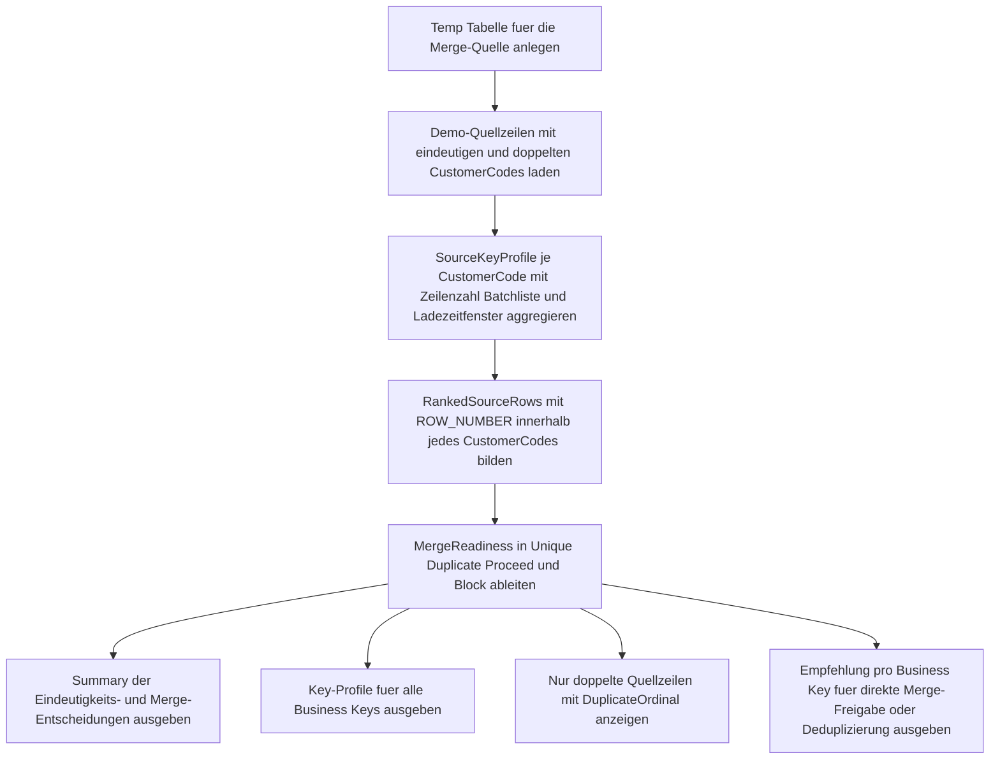

# MergeSourceRowUniqueness.sql

Dieses Skript prueft eine didaktische `MERGE`-Quellmenge auf Eindeutigkeit je Business Key. Es zeigt zuerst das Key-Profil der Quelle, listet nur die tatsaechlich doppelten Quellzeilen und leitet daraus eine klare `Proceed`- oder `Block`-Empfehlung fuer den naechsten `MERGE`-Schritt ab.

## Uebersicht

<!-- SQLDOC:SUMMARY_TABLE:BEGIN -->
| Feld | Wert |
|---|---|
| Script | [MergeSourceRowUniqueness.sql](MergeSourceRowUniqueness.sql) |
| Version | `1.0` |
| Typ | `didactic-lab` |
| Kapitel | `13_Merge` |
| Sicherheit | `read-only-tempdb` |
| Zweck | Prueft die Eindeutigkeit von Quellzeilen pro Business Key vor einem `MERGE`. |
<!-- SQLDOC:SUMMARY_TABLE:END -->

## Annahmen

- Die Erstversion arbeitet ausschliesslich mit temporaeren Demo-Tabellen.
- `CustomerCode` dient als didaktischer Business Key fuer die Eindeutigkeitspruefung.
- Das Skript fuehrt bewusst kein `MERGE` aus, sondern bewertet nur die Vorbedingung, dass pro Business Key genau eine Quellzeile vorhanden sein sollte.

## Anwendungsfall

Das Skript eignet sich fuer folgende Leitfragen:

- Welche Business Keys erscheinen in der Quellmenge mehrfach und blockieren damit einen sauberen `MERGE`-Join?
- Welche Zeilen gehoeren zu diesen Dubletten und aus welchen Batches stammen sie?
- Fuer welche Business Keys ist die Quelle bereits eindeutig genug, um ohne weitere Deduplizierung in ein `MERGE`-Stage uebernommen zu werden?

## Parameter

<!-- SQLDOC:PARAMETERS_TABLE:BEGIN -->
| Parameter | SQL-Typ | Pflicht | Beschreibung |
|---|---|---|---|
| `-` | `-` | `-` | Dieses Demoskript verwendet keine Laufzeitparameter. |
<!-- SQLDOC:PARAMETERS_TABLE:END -->

## Abhaengigkeiten

<!-- SQLDOC:DEPENDENCIES_LIST:BEGIN -->
- temporaere Tabellen in `tempdb`
- CTEs
- `ROW_NUMBER`
- `STRING_AGG`
<!-- SQLDOC:DEPENDENCIES_LIST:END -->

## Hinweise

- `MergeSourceUniquenessSummary` zeigt, wie viele Business Keys aktuell `Proceed` oder `Block` erhalten.
- `MergeSourceKeyProfile` verdichtet die Quellmenge pro `CustomerCode` inklusive Batch- und Ladezeitkontext.
- `MergeSourceDuplicateRows` zeigt nur die Zeilen fuer Keys mit mehrfacher Belegung.
- `MergeSourceMergeReadiness` leitet direkt eine Empfehlung fuer Freigabe oder Deduplizierung ab.

## Versionshistorie

<!-- SQLDOC:VERSION_HISTORY_TABLE:BEGIN -->
| Version | Datum | User | Beschreibung |
|---|---|---|---|
| `1.0` | `2026-04-18` | `ER` | Erstversion eines didaktischen Eindeutigkeitschecks fuer MERGE-Quellen |
<!-- SQLDOC:VERSION_HISTORY_TABLE:END -->

## Ablauf

<!-- SQLDOC:MERMAID:BEGIN -->

<!-- SQLDOC:MERMAID:END -->

## SQL-Code

<!-- SQLDOC:SQL_CODE:BEGIN -->
```sql
/*
BEGIN:SQL-HEADER v1
---
sql_header: v1
script_name: "MergeSourceRowUniqueness.sql"
script_version: "1.0"
script_type: "didactic-lab"
chapter: "13_Merge"

purpose: >
  Prueft eine didaktische MERGE-Quellmenge auf Eindeutigkeit je Business Key,
  macht Dubletten samt Zeilenkontext sichtbar und leitet daraus eine klare
  Merge-Readiness-Einschaetzung fuer den naechsten Verarbeitungsschritt ab.

parameters: []

result_sets:
  - name: "MergeSourceUniquenessSummary"
    description: "Verdichtet je Ergebnisstatus die Zahl der betroffenen Business Keys in der Quellmenge"
  - name: "MergeSourceKeyProfile"
    description: "Zeigt pro Business Key die Zahl der Source-Zeilen sowie Batch- und Zeitkontext"
  - name: "MergeSourceDuplicateRows"
    description: "Listet nur die doppelten Quellzeilen mit Ordnungszahl innerhalb des Business Keys"
  - name: "MergeSourceMergeReadiness"
    description: "Leitet pro Business Key ab, ob die Quelle fuer ein MERGE eindeutig genug vorbereitet ist"

dependencies:
  - "temporary tables"
  - "CTE"
  - "ROW_NUMBER"
  - "STRING_AGG"

safety:
  level: "read-only-tempdb"
  writes_data: false

documentation:
  markdown_file: "T-SQL/13_Merge/SQLScripts/MergeSourceRowUniqueness.md"
  sync_blocks:
    - "SUMMARY_TABLE"
    - "PARAMETERS_TABLE"
    - "DEPENDENCIES_LIST"
    - "VERSION_HISTORY_TABLE"
    - "SQL_CODE"
  mermaid:
    mode: "ai-agent-from-sql"
    source: "script-body"

main_responsible:
  name: "Erhard Rainer"
  initials: "ER"

version_history:
  - version: "1.0"
    date: "2026-04-18"
    user: "ER"
    description: "Erstversion eines didaktischen Eindeutigkeitschecks fuer MERGE-Quellen"

notes:
  - "Die Erstversion arbeitet ausschliesslich mit temporaeren Demo-Tabellen."
  - "Die Eindeutigkeit wird ueber CustomerCode als didaktischen Business Key bewertet."
  - "Das Skript fuehrt bewusst kein MERGE aus, sondern liefert nur eine diagnostische Vorpruefung."
---
END:SQL-HEADER v1
*/

SET NOCOUNT ON;

DROP TABLE IF EXISTS #MergeSourceRaw;

CREATE TABLE #MergeSourceRaw
(
    SourceRowId         INT           NOT NULL PRIMARY KEY,
    CustomerCode        VARCHAR(10)   NOT NULL,
    CustomerName        VARCHAR(100)  NOT NULL,
    ProposedSegment     VARCHAR(20)   NOT NULL,
    CreditLimit         DECIMAL(10,2) NOT NULL,
    EffectiveDate       DATE          NOT NULL,
    SourceBatchLabel    VARCHAR(20)   NOT NULL,
    LoadedAt            DATETIME2(0)  NOT NULL
);

INSERT INTO #MergeSourceRaw
(
    SourceRowId,
    CustomerCode,
    CustomerName,
    ProposedSegment,
    CreditLimit,
    EffectiveDate,
    SourceBatchLabel,
    LoadedAt
)
VALUES
    (101, 'C001', 'Alpine Retail',      'standard', 1200.00, '2026-04-17', 'Batch-A', '2026-04-18T08:00:00'),
    (102, 'C002', 'Baltic Foods GmbH',  'priority', 1350.00, '2026-04-18', 'Batch-A', '2026-04-18T08:03:00'),
    (103, 'C002', 'Baltic Foods GmbH',  'priority', 1350.00, '2026-04-18', 'Batch-B', '2026-04-18T08:05:00'),
    (104, 'C003', 'City Logistics',     'priority', 1500.00, '2026-04-16', 'Batch-A', '2026-04-18T08:07:00'),
    (105, 'C004', 'Delta Services',     'legacy',    650.00, '2026-04-10', 'Batch-A', '2026-04-18T08:11:00'),
    (106, 'C004', 'Delta Services GmbH','legacy',    650.00, '2026-04-10', 'Batch-C', '2026-04-18T08:14:00'),
    (107, 'C005', 'Elm Tech',           'new',       820.00, '2026-04-18', 'Batch-C', '2026-04-18T08:18:00');

;WITH SourceKeyProfile AS
(
    SELECT
        s.CustomerCode,
        COUNT(*) AS SourceRowCount,
        MIN(s.LoadedAt) AS FirstLoadedAt,
        MAX(s.LoadedAt) AS LastLoadedAt,
        STRING_AGG(CAST(s.SourceRowId AS VARCHAR(20)), ', ') WITHIN GROUP (ORDER BY s.SourceRowId) AS SourceRowIds,
        STRING_AGG(s.SourceBatchLabel, ', ') WITHIN GROUP (ORDER BY s.LoadedAt, s.SourceRowId) AS SourceBatches
    FROM #MergeSourceRaw AS s
    GROUP BY
        s.CustomerCode
),
RankedSourceRows AS
(
    SELECT
        s.SourceRowId,
        s.CustomerCode,
        s.CustomerName,
        s.ProposedSegment,
        s.CreditLimit,
        s.EffectiveDate,
        s.SourceBatchLabel,
        s.LoadedAt,
        ROW_NUMBER() OVER
        (
            PARTITION BY s.CustomerCode
            ORDER BY
                s.LoadedAt,
                s.SourceRowId
        ) AS DuplicateOrdinal
    FROM #MergeSourceRaw AS s
),
MergeReadiness AS
(
    SELECT
        skp.CustomerCode,
        skp.SourceRowCount,
        skp.SourceRowIds,
        skp.SourceBatches,
        skp.FirstLoadedAt,
        skp.LastLoadedAt,
        CASE
            WHEN skp.SourceRowCount = 1 THEN 'Unique'
            ELSE 'Duplicate'
        END AS UniquenessStatus,
        CASE
            WHEN skp.SourceRowCount = 1 THEN 'Proceed'
            ELSE 'Block'
        END AS MergeDecision,
        CASE
            WHEN skp.SourceRowCount = 1 THEN 'Genau eine Quellzeile pro Business Key; die Quelle ist fuer ein MERGE eindeutig vorbereitet.'
            ELSE 'Mehrere Quellzeilen teilen denselben Business Key; vor dem MERGE ist eine Bereinigung oder Deduplizierung noetig.'
        END AS DecisionReason
    FROM SourceKeyProfile AS skp
)
SELECT
    mr.UniquenessStatus,
    mr.MergeDecision,
    COUNT(*) AS BusinessKeyCount,
    SUM(mr.SourceRowCount) AS SourceRowsCovered
FROM MergeReadiness AS mr
GROUP BY
    mr.UniquenessStatus,
    mr.MergeDecision
ORDER BY
    CASE mr.MergeDecision
        WHEN 'Block' THEN 1
        ELSE 2
    END,
    mr.UniquenessStatus;

SELECT
    skp.CustomerCode,
    skp.SourceRowCount,
    skp.SourceRowIds,
    skp.SourceBatches,
    skp.FirstLoadedAt,
    skp.LastLoadedAt
FROM SourceKeyProfile AS skp
ORDER BY
    CASE
        WHEN skp.SourceRowCount > 1 THEN 1
        ELSE 2
    END,
    skp.CustomerCode;

SELECT
    rsr.CustomerCode,
    rsr.DuplicateOrdinal,
    rsr.SourceRowId,
    rsr.CustomerName,
    rsr.ProposedSegment,
    rsr.CreditLimit,
    rsr.EffectiveDate,
    rsr.SourceBatchLabel,
    rsr.LoadedAt
FROM RankedSourceRows AS rsr
WHERE EXISTS
(
    SELECT
        1
    FROM SourceKeyProfile AS skp
    WHERE skp.CustomerCode = rsr.CustomerCode
      AND skp.SourceRowCount > 1
)
ORDER BY
    rsr.CustomerCode,
    rsr.DuplicateOrdinal;

SELECT
    mr.CustomerCode,
    mr.SourceRowCount,
    mr.UniquenessStatus,
    mr.MergeDecision,
    mr.DecisionReason,
    CASE
        WHEN mr.MergeDecision = 'Proceed' THEN 'Business Key kann unveraendert in das Merge-Stage uebernommen werden.'
        ELSE 'Business Key zuerst auf genau eine Quellzeile reduzieren oder per Prioritaetsregel deduplizieren.'
    END AS RecommendedAction,
    mr.SourceRowIds,
    mr.SourceBatches,
    mr.FirstLoadedAt,
    mr.LastLoadedAt
FROM MergeReadiness AS mr
ORDER BY
    CASE mr.MergeDecision
        WHEN 'Block' THEN 1
        ELSE 2
    END,
    mr.CustomerCode;
```
<!-- SQLDOC:SQL_CODE:END -->
