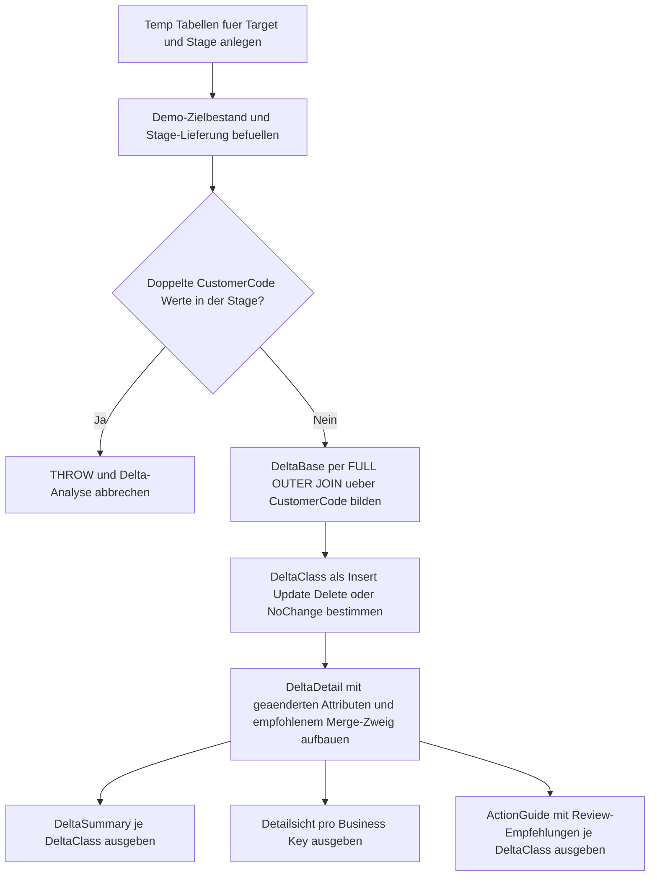

# MergeStagingDeltaClassifier.sql

Dieses Skript vergleicht einen didaktischen Zielbestand mit einer Stage-Lieferung, bevor ein eigentliches `MERGE` ausgefuehrt wird. Die Auswertung trennt neue, geaenderte, entfallene und unveraenderte Business Keys und erzeugt damit eine kompakte Entscheidungsgrundlage fuer die spaetere `MERGE`-Logik.

## Uebersicht

<!-- SQLDOC:SUMMARY_TABLE:BEGIN -->
| Feld | Wert |
|---|---|
| Script | [MergeStagingDeltaClassifier.sql](MergeStagingDeltaClassifier.sql) |
| Version | `1.0` |
| Typ | `didactic-lab` |
| Kapitel | `13_Merge` |
| Sicherheit | `read-only-tempdb` |
| Zweck | Klassifiziert Stage-Deltas vor dem eigentlichen MERGE und leitet passende Merge-Zweige ab. |
<!-- SQLDOC:SUMMARY_TABLE:END -->

## Annahmen

- Die Erstversion arbeitet ausschliesslich mit temporaeren Demo-Tabellen statt mit produktiven Stage- oder Zieltabellen.
- Der Vergleich erfolgt ueber den Business Key `CustomerCode`; fachliche Sonderregeln wie Soft-Delete oder SCD-Logik bleiben bewusst ausserhalb dieser Erstversion.
- `NoChange` wird explizit ausgewiesen, damit vor einem echten `MERGE` unnoetige Schreiboperationen aus der Quellmenge entfernt werden koennen.

## Anwendungsfall

Das Skript eignet sich fuer folgende Leitfragen:

- Welche Stage-Zeilen fuehren spaeter zu `INSERT`, `UPDATE` oder `DELETE`?
- Welche Attribute unterscheiden sich pro Business Key bereits vor dem eigentlichen `MERGE`?
- Wo lohnt es sich, unveraenderte Zeilen vorab herauszufiltern oder Delete-Kandidaten gesondert fachlich freizugeben?

## Parameter

<!-- SQLDOC:PARAMETERS_TABLE:BEGIN -->
| Parameter | SQL-Typ | Pflicht | Beschreibung |
|---|---|---|---|
| `-` | `-` | `-` | Dieses Demoskript verwendet keine Laufzeitparameter. |
<!-- SQLDOC:PARAMETERS_TABLE:END -->

## Abhaengigkeiten

<!-- SQLDOC:DEPENDENCIES_LIST:BEGIN -->
- temporaere Tabellen in `tempdb`
- CTEs
- `FULL OUTER JOIN`
- `CONCAT_WS`
- `THROW`
<!-- SQLDOC:DEPENDENCIES_LIST:END -->

## Hinweise

- `MergeStagingDeltaSummary` zeigt die Menge der Business Keys pro Delta-Klasse.
- `MergeStagingDeltaDetail` dokumentiert die betroffenen Attribute und den empfohlenen `MERGE`-Zweig pro Business Key.
- `MergeStagingDeltaActions` verdichtet die didaktische Folgerung je Delta-Klasse fuer Review und Implementierung.

## Versionshistorie

<!-- SQLDOC:VERSION_HISTORY_TABLE:BEGIN -->
| Version | Datum | User | Beschreibung |
|---|---|---|---|
| `1.0` | `2026-04-18` | `ER` | Erstversion eines didaktischen Delta-Klassifikators fuer Stage-Daten vor dem MERGE |
<!-- SQLDOC:VERSION_HISTORY_TABLE:END -->

## Ablauf

<!-- SQLDOC:MERMAID:BEGIN -->

<!-- SQLDOC:MERMAID:END -->

## SQL-Code

<!-- SQLDOC:SQL_CODE:BEGIN -->
```sql
/*
BEGIN:SQL-HEADER v1
---
sql_header: v1
script_name: "MergeStagingDeltaClassifier.sql"
script_version: "1.0"
script_type: "didactic-lab"
chapter: "13_Merge"

purpose: >
  Klassifiziert eine Stage-Lieferung vor einem didaktischen MERGE. Das
  Skript vergleicht Stage- und Zielbestand pro Business Key, erkennt
  Inserts, Updates, Deletes und unveraenderte Zeilen und liefert daraus
  eine Review-faehige Delta-Sicht fuer den eigentlichen Merge-Schritt.

parameters: []

result_sets:
  - name: "MergeStagingDeltaSummary"
    description: "Zaehlt Delta-Klassen und zeigt den ersten sowie letzten betroffenen Business Key"
  - name: "MergeStagingDeltaDetail"
    description: "Zeigt pro Business Key die erkannte Delta-Klasse, Feldaenderungen und den empfohlenen Merge-Zweig"
  - name: "MergeStagingDeltaActions"
    description: "Verdichtet didaktische Handlungsempfehlungen fuer jede Delta-Klasse"

dependencies:
  - "temporary tables"
  - "CTE"
  - "FULL OUTER JOIN"
  - "CONCAT_WS"
  - "THROW"

safety:
  level: "read-only-tempdb"
  writes_data: false

documentation:
  markdown_file: "T-SQL/13_Merge/SQLScripts/MergeStagingDeltaClassifier.md"
  sync_blocks:
    - "SUMMARY_TABLE"
    - "PARAMETERS_TABLE"
    - "DEPENDENCIES_LIST"
    - "VERSION_HISTORY_TABLE"
    - "SQL_CODE"
  mermaid:
    mode: "ai-agent-from-sql"
    source: "script-body"

main_responsible:
  name: "Erhard Rainer"
  initials: "ER"

version_history:
  - version: "1.0"
    date: "2026-04-18"
    user: "ER"
    description: "Erstversion eines didaktischen Delta-Klassifikators fuer Stage-Daten vor dem MERGE"

notes:
  - "Die Erstversion arbeitet ausschliesslich mit temporaeren Demo-Tabellen."
  - "Die Delta-Klassifikation trennt bewusst NoChange von Merge-relevanten Aktionen."
  - "Ein Guardrail blockiert doppelte Business Keys in der Stage vor der fachlichen Bewertung."
---
END:SQL-HEADER v1
*/

SET NOCOUNT ON;

DROP TABLE IF EXISTS #MergeTarget;
DROP TABLE IF EXISTS #StageSnapshot;

CREATE TABLE #MergeTarget
(
    CustomerCode       VARCHAR(10)   NOT NULL PRIMARY KEY,
    CustomerName       VARCHAR(100)  NOT NULL,
    CreditLimit        DECIMAL(10,2) NOT NULL,
    SegmentLabel       VARCHAR(20)   NOT NULL,
    PreferredRegion    VARCHAR(20)   NOT NULL
);

CREATE TABLE #StageSnapshot
(
    CustomerCode       VARCHAR(10)   NOT NULL,
    CustomerName       VARCHAR(100)  NOT NULL,
    CreditLimit        DECIMAL(10,2) NOT NULL,
    SegmentLabel       VARCHAR(20)   NOT NULL,
    PreferredRegion    VARCHAR(20)   NOT NULL
);

INSERT INTO #MergeTarget
(
    CustomerCode,
    CustomerName,
    CreditLimit,
    SegmentLabel,
    PreferredRegion
)
VALUES
    ('C001', 'Alpine Retail',   1200.00, 'standard', 'DACH'),
    ('C002', 'Baltic Foods',     900.00, 'standard', 'Nordics'),
    ('C003', 'City Logistics',  1500.00, 'priority', 'DACH'),
    ('C004', 'Delta Services',   650.00, 'legacy',   'France'),
    ('C006', 'Fjord Energy',    2100.00, 'priority', 'Nordics');

INSERT INTO #StageSnapshot
(
    CustomerCode,
    CustomerName,
    CreditLimit,
    SegmentLabel,
    PreferredRegion
)
VALUES
    ('C001', 'Alpine Retail',      1200.00, 'standard', 'DACH'),
    ('C002', 'Baltic Foods GmbH',  1350.00, 'priority', 'Nordics'),
    ('C003', 'City Logistics',     1500.00, 'priority', 'DACH'),
    ('C005', 'Elm Tech',            800.00, 'new',      'DACH'),
    ('C006', 'Fjord Energy',       2100.00, 'priority', 'Benelux');

IF EXISTS
(
    SELECT
        s.CustomerCode
    FROM #StageSnapshot AS s
    GROUP BY
        s.CustomerCode
    HAVING COUNT(*) > 1
)
BEGIN
    THROW 50031, 'MergeStagingDeltaClassifier detected duplicate CustomerCode values in #StageSnapshot.', 1;
END;

;WITH DeltaBase AS
(
    SELECT
        COALESCE(src.CustomerCode, tgt.CustomerCode) AS CustomerCode,
        tgt.CustomerName AS TargetCustomerName,
        src.CustomerName AS StageCustomerName,
        tgt.CreditLimit AS TargetCreditLimit,
        src.CreditLimit AS StageCreditLimit,
        tgt.SegmentLabel AS TargetSegmentLabel,
        src.SegmentLabel AS StageSegmentLabel,
        tgt.PreferredRegion AS TargetPreferredRegion,
        src.PreferredRegion AS StagePreferredRegion,
        CASE
            WHEN tgt.CustomerCode IS NULL THEN 'InsertCandidate'
            WHEN src.CustomerCode IS NULL THEN 'DeleteCandidate'
            WHEN tgt.CustomerName <> src.CustomerName
              OR tgt.CreditLimit <> src.CreditLimit
              OR tgt.SegmentLabel <> src.SegmentLabel
              OR tgt.PreferredRegion <> src.PreferredRegion
                THEN 'UpdateCandidate'
            ELSE 'NoChange'
        END AS DeltaClass
    FROM #MergeTarget AS tgt
    FULL OUTER JOIN #StageSnapshot AS src
        ON src.CustomerCode = tgt.CustomerCode
),
DeltaDetail AS
(
    SELECT
        db.CustomerCode,
        db.DeltaClass,
        CASE db.DeltaClass
            WHEN 'InsertCandidate' THEN 'WHEN NOT MATCHED BY TARGET THEN INSERT'
            WHEN 'UpdateCandidate' THEN 'WHEN MATCHED AND values changed THEN UPDATE'
            WHEN 'DeleteCandidate' THEN 'WHEN NOT MATCHED BY SOURCE THEN DELETE'
            ELSE 'Skip row because source and target are identical'
        END AS RecommendedMergeBranch,
        CONCAT_WS
        (
            '; ',
            CASE
                WHEN db.TargetCustomerName IS NULL THEN 'CustomerName: new stage row'
                WHEN db.StageCustomerName IS NULL THEN 'CustomerName: row missing in stage'
                WHEN db.TargetCustomerName <> db.StageCustomerName THEN CONCAT('CustomerName: ', db.TargetCustomerName, ' -> ', db.StageCustomerName)
            END,
            CASE
                WHEN db.TargetCreditLimit IS NULL THEN 'CreditLimit: new stage row'
                WHEN db.StageCreditLimit IS NULL THEN 'CreditLimit: row missing in stage'
                WHEN db.TargetCreditLimit <> db.StageCreditLimit THEN CONCAT('CreditLimit: ', CONVERT(VARCHAR(32), db.TargetCreditLimit), ' -> ', CONVERT(VARCHAR(32), db.StageCreditLimit))
            END,
            CASE
                WHEN db.TargetSegmentLabel IS NULL THEN 'SegmentLabel: new stage row'
                WHEN db.StageSegmentLabel IS NULL THEN 'SegmentLabel: row missing in stage'
                WHEN db.TargetSegmentLabel <> db.StageSegmentLabel THEN CONCAT('SegmentLabel: ', db.TargetSegmentLabel, ' -> ', db.StageSegmentLabel)
            END,
            CASE
                WHEN db.TargetPreferredRegion IS NULL THEN 'PreferredRegion: new stage row'
                WHEN db.StagePreferredRegion IS NULL THEN 'PreferredRegion: row missing in stage'
                WHEN db.TargetPreferredRegion <> db.StagePreferredRegion THEN CONCAT('PreferredRegion: ', db.TargetPreferredRegion, ' -> ', db.StagePreferredRegion)
            END
        ) AS ChangedAttributes,
        db.TargetCustomerName,
        db.StageCustomerName,
        db.TargetCreditLimit,
        db.StageCreditLimit,
        db.TargetSegmentLabel,
        db.StageSegmentLabel,
        db.TargetPreferredRegion,
        db.StagePreferredRegion
    FROM DeltaBase AS db
),
DeltaSummary AS
(
    SELECT
        dd.DeltaClass,
        COUNT(*) AS RowCount,
        MIN(dd.CustomerCode) AS FirstCustomerCode,
        MAX(dd.CustomerCode) AS LastCustomerCode
    FROM DeltaDetail AS dd
    GROUP BY
        dd.DeltaClass
),
ActionGuide AS
(
    SELECT
        dd.DeltaClass,
        COUNT(*) AS RowCount,
        CASE dd.DeltaClass
            WHEN 'InsertCandidate' THEN 'Insert branch vorbereiten und Pflichtattribute der neuen Stage-Zeilen pruefen.'
            WHEN 'UpdateCandidate' THEN 'Update branch auf echte Aenderungsspalten begrenzen und Audit-Spalten mitdenken.'
            WHEN 'DeleteCandidate' THEN 'Delete branch fachlich freigeben oder als Soft-Delete pruefen.'
            ELSE 'Diese Zeilen koennen vor dem MERGE aus der Quellmenge herausgefiltert werden.'
        END AS ReviewRecommendation
    FROM DeltaDetail AS dd
    GROUP BY
        dd.DeltaClass
)
SELECT
    ds.DeltaClass,
    ds.RowCount,
    ds.FirstCustomerCode,
    ds.LastCustomerCode
FROM DeltaSummary AS ds
ORDER BY
    CASE ds.DeltaClass
        WHEN 'UpdateCandidate' THEN 1
        WHEN 'InsertCandidate' THEN 2
        WHEN 'DeleteCandidate' THEN 3
        ELSE 4
    END;

SELECT
    dd.CustomerCode,
    dd.DeltaClass,
    dd.RecommendedMergeBranch,
    COALESCE(dd.ChangedAttributes, 'No attribute differences detected.') AS ChangedAttributes,
    dd.TargetCustomerName,
    dd.StageCustomerName,
    dd.TargetCreditLimit,
    dd.StageCreditLimit,
    dd.TargetSegmentLabel,
    dd.StageSegmentLabel,
    dd.TargetPreferredRegion,
    dd.StagePreferredRegion
FROM DeltaDetail AS dd
ORDER BY
    CASE dd.DeltaClass
        WHEN 'UpdateCandidate' THEN 1
        WHEN 'InsertCandidate' THEN 2
        WHEN 'DeleteCandidate' THEN 3
        ELSE 4
    END,
    dd.CustomerCode;

SELECT
    ag.DeltaClass,
    ag.RowCount,
    ag.ReviewRecommendation
FROM ActionGuide AS ag
ORDER BY
    CASE ag.DeltaClass
        WHEN 'UpdateCandidate' THEN 1
        WHEN 'InsertCandidate' THEN 2
        WHEN 'DeleteCandidate' THEN 3
        ELSE 4
    END;
```
<!-- SQLDOC:SQL_CODE:END -->
