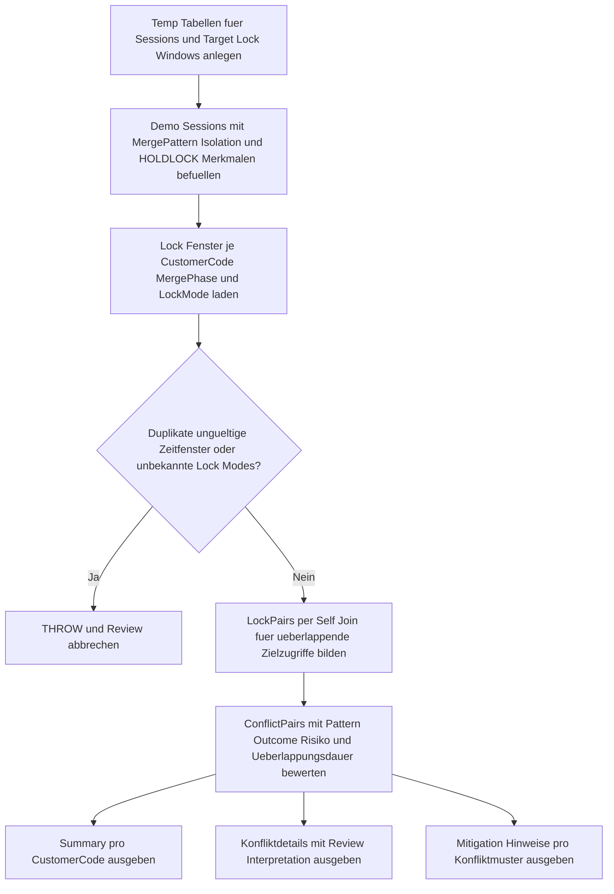

# MergeTargetLockWatch.sql

Dieses Skript simuliert parallele `MERGE`-Zielzugriffe und macht sichtbar, an welchen Business Keys sich Lock-Fenster auf dem Target ueberlappen. Die Umsetzung bleibt bewusst bei temporaeren Demo-Daten und dient als didaktisches Review-Werkzeug fuer Sperrverhalten, Session-Reihenfolge und Batch-Zuschnitt.

## Uebersicht

<!-- SQLDOC:SUMMARY_TABLE:BEGIN -->
| Feld | Wert |
|---|---|
| Script | [MergeTargetLockWatch.sql](MergeTargetLockWatch.sql) |
| Version | `1.0` |
| Typ | `didactic-lab` |
| Kapitel | `13_Merge` |
| Sicherheit | `read-only-tempdb` |
| Zweck | Beobachtet potenzielle Sperrkonflikte auf dem MERGE-Ziel pro Business Key und Lock-Modus. |
<!-- SQLDOC:SUMMARY_TABLE:END -->

## Annahmen

- Die Erstversion liest keine echten Lock-DMVs, sondern arbeitet mit simulierten Lock-Fenstern pro Session und Zielschluessel.
- Bewertet werden nur die didaktischen Lock-Modi `S`, `U` und `X`.
- Das Skript fuehrt kein echtes `MERGE` aus, sondern bereitet Reviews fuer Hot Keys, Session-Parallelitaet und Holdlock-Nutzung vor.

## Anwendungsfall

Das Skript eignet sich fuer folgende Leitfragen:

- Wo ueberlappen zwei `MERGE`-Sessions auf demselben Target-Key zeitlich?
- Welche Kombination aus `S`, `U` und `X` fuehrt nur zu Beobachtung, zu Wartezeit oder zu echter Blockierung?
- Welche Gegenmassnahmen sind fuer `HOLDLOCK`, Batch-Segmentierung oder kuerzere Write-Phasen plausibel?

## Parameter

<!-- SQLDOC:PARAMETERS_TABLE:BEGIN -->
| Parameter | SQL-Typ | Pflicht | Beschreibung |
|---|---|---|---|
| `-` | `-` | `-` | Dieses Demoskript verwendet keine Laufzeitparameter. |
<!-- SQLDOC:PARAMETERS_TABLE:END -->

## Abhaengigkeiten

<!-- SQLDOC:DEPENDENCIES_LIST:BEGIN -->
- temporaere Tabellen in `tempdb`
- CTEs
- Self Join
- `DATEDIFF`
- `CASE`
- `STRING_AGG`
- `THROW`
<!-- SQLDOC:DEPENDENCIES_LIST:END -->

## Hinweise

- `MergeTargetLockSummary` verdichtet Konfliktfenster, Gesamtdauer und hoechstes Risiko pro `CustomerCode`.
- `MergeTargetLockConflicts` zeigt die kollidierenden Session-Paare inklusive Lock-Modi, Merge-Phase und Review-Interpretation.
- `MergeTargetLockMitigations` uebersetzt das beobachtete Konfliktmuster in didaktische Gegenmassnahmen fuer Review und Schulung.

## Versionshistorie

<!-- SQLDOC:VERSION_HISTORY_TABLE:BEGIN -->
| Version | Datum | User | Beschreibung |
|---|---|---|---|
| `1.0` | `2026-04-18` | `ER` | Erstversion eines didaktischen Lock-Watch-Skripts fuer MERGE-Zielkonflikte |
<!-- SQLDOC:VERSION_HISTORY_TABLE:END -->

## Ablauf

<!-- SQLDOC:MERMAID:BEGIN -->

<!-- SQLDOC:MERMAID:END -->

## SQL-Code

<!-- SQLDOC:SQL_CODE:BEGIN -->
```sql
/*
BEGIN:SQL-HEADER v1
---
sql_header: v1
script_name: "MergeTargetLockWatch.sql"
script_version: "1.0"
script_type: "didactic-lab"
chapter: "13_Merge"

purpose: >
  Beobachtet in einem didaktischen MERGE-Szenario potenzielle Sperrkonflikte
  auf dem Ziel, indem parallele Session-Fenster, Lock-Modi und Zielaktionen
  pro Business Key simuliert und fuer Review-Zwecke ausgewertet werden.

parameters: []

result_sets:
  - name: "MergeTargetLockSummary"
    description: "Verdichtet pro Business Key die Zahl der Lock-Ueberlappungen und das hoechste Konfliktrisiko"
  - name: "MergeTargetLockConflicts"
    description: "Zeigt kollidierende Session-Paare mit Lock-Modi, Zielaktion und Konfliktursache"
  - name: "MergeTargetLockMitigations"
    description: "Leitet didaktische Gegenmassnahmen je Lock-Konfliktmuster ab"

dependencies:
  - "temporary tables"
  - "CTE"
  - "self join"
  - "DATEDIFF"
  - "CASE"
  - "STRING_AGG"
  - "THROW"

safety:
  level: "read-only-tempdb"
  writes_data: false

documentation:
  markdown_file: "T-SQL/13_Merge/SQLScripts/MergeTargetLockWatch.md"
  sync_blocks:
    - "SUMMARY_TABLE"
    - "PARAMETERS_TABLE"
    - "DEPENDENCIES_LIST"
    - "VERSION_HISTORY_TABLE"
    - "SQL_CODE"
  mermaid:
    mode: "ai-agent-from-sql"
    source: "script-body"

main_responsible:
  name: "Erhard Rainer"
  initials: "ER"

version_history:
  - version: "1.0"
    date: "2026-04-18"
    user: "ER"
    description: "Erstversion eines didaktischen Lock-Watch-Skripts fuer MERGE-Zielkonflikte"

notes:
  - "Die Erstversion simuliert Lock-Fenster statt echte DMVs oder Trace-Daten zu lesen."
  - "Lock-Kompatibilitaet wird didaktisch fuer S-, U- und X-Locks bewertet."
  - "Die Resultsets dienen der Vorbereitung von HOLDLOCK-, Batch- und Reihenfolge-Reviews."
---
END:SQL-HEADER v1
*/

SET NOCOUNT ON;

DROP TABLE IF EXISTS #MergeSessions;
DROP TABLE IF EXISTS #TargetLockWindows;

CREATE TABLE #MergeSessions
(
    SessionRunId      INT          NOT NULL PRIMARY KEY,
    SessionLabel      VARCHAR(20)  NOT NULL,
    BatchLabel        VARCHAR(20)  NOT NULL,
    MergePattern      VARCHAR(30)  NOT NULL,
    IsolationPattern  VARCHAR(30)  NOT NULL,
    UsesHoldlock      BIT          NOT NULL
);

CREATE TABLE #TargetLockWindows
(
    SessionRunId          INT          NOT NULL,
    CustomerCode          VARCHAR(10)  NOT NULL,
    MergePhase            VARCHAR(30)  NOT NULL,
    LockMode              VARCHAR(5)   NOT NULL,
    TargetAction          VARCHAR(12)  NOT NULL,
    WindowStart           DATETIME2(0) NOT NULL,
    WindowEnd             DATETIME2(0) NOT NULL,
    WaitSensitivity       VARCHAR(20)  NOT NULL,
    ExpectedEffect        VARCHAR(90)  NOT NULL,
    CONSTRAINT PK_TargetLockWindows PRIMARY KEY (SessionRunId, CustomerCode, MergePhase)
);

INSERT INTO #MergeSessions
(
    SessionRunId,
    SessionLabel,
    BatchLabel,
    MergePattern,
    IsolationPattern,
    UsesHoldlock
)
VALUES
    (201, 'Session-A', 'Batch-Alpha', 'UpsertCustomers', 'Read committed', 0),
    (202, 'Session-B', 'Batch-Beta', 'SyncCustomers',   'Read committed', 0),
    (203, 'Session-C', 'Batch-Gamma', 'RetrySegment',   'Serializable',   1);

INSERT INTO #TargetLockWindows
(
    SessionRunId,
    CustomerCode,
    MergePhase,
    LockMode,
    TargetAction,
    WindowStart,
    WindowEnd,
    WaitSensitivity,
    ExpectedEffect
)
VALUES
    (201, 'C002', 'MatchProbe',  'U', 'UPDATE', '2026-04-18T10:00:01', '2026-04-18T10:00:04', 'wait-prone', 'Existing row is probed before quantity and segment updates'),
    (201, 'C002', 'WritePhase',  'X', 'UPDATE', '2026-04-18T10:00:04', '2026-04-18T10:00:07', 'blocking',   'Final target row update persists a higher credit tier'),
    (201, 'C004', 'DeleteCheck', 'U', 'DELETE', '2026-04-18T10:00:07', '2026-04-18T10:00:10', 'wait-prone', 'Target row is evaluated for not matched by source cleanup'),
    (202, 'C002', 'MatchProbe',  'S', 'UPDATE', '2026-04-18T10:00:02', '2026-04-18T10:00:05', 'watch',      'Competing batch still reads the target row before write'),
    (202, 'C002', 'WritePhase',  'X', 'UPDATE', '2026-04-18T10:00:05', '2026-04-18T10:00:08', 'blocking',   'Second batch attempts to overwrite the same target row'),
    (202, 'C004', 'InsertReplay','X', 'INSERT', '2026-04-18T10:00:08', '2026-04-18T10:00:11', 'blocking',   'Late source row recreates a customer while delete review is still open'),
    (203, 'C002', 'MatchProbe',  'S', 'UPDATE', '2026-04-18T10:00:12', '2026-04-18T10:00:14', 'watch',      'Serialized retry validates the target row after earlier contention'),
    (203, 'C006', 'InsertPhase', 'X', 'INSERT', '2026-04-18T10:00:14', '2026-04-18T10:00:16', 'blocking',   'Isolated retry inserts a new customer after the hot key cooled down');

IF EXISTS
(
    SELECT
        tlw.SessionRunId,
        tlw.CustomerCode,
        tlw.MergePhase
    FROM #TargetLockWindows AS tlw
    GROUP BY
        tlw.SessionRunId,
        tlw.CustomerCode,
        tlw.MergePhase
    HAVING COUNT(*) > 1
)
BEGIN
    THROW 50061, 'MergeTargetLockWatch detected duplicate session-key-phase windows.', 1;
END;

IF EXISTS
(
    SELECT
        tlw.SessionRunId,
        tlw.CustomerCode,
        tlw.MergePhase
    FROM #TargetLockWindows AS tlw
    WHERE tlw.WindowEnd <= tlw.WindowStart
)
BEGIN
    THROW 50062, 'MergeTargetLockWatch detected an invalid window with non-positive duration.', 1;
END;

IF EXISTS
(
    SELECT
        tlw.SessionRunId,
        tlw.CustomerCode,
        tlw.MergePhase
    FROM #TargetLockWindows AS tlw
    WHERE tlw.LockMode NOT IN ('S', 'U', 'X')
)
BEGIN
    THROW 50063, 'MergeTargetLockWatch supports only S, U, and X lock modes in the didactic matrix.', 1;
END;

;WITH LockPairs AS
(
    SELECT
        leftWin.CustomerCode,
        leftSession.SessionRunId AS LeftSessionRunId,
        leftSession.SessionLabel AS LeftSessionLabel,
        leftSession.BatchLabel AS LeftBatchLabel,
        leftSession.MergePattern AS LeftMergePattern,
        leftSession.IsolationPattern AS LeftIsolationPattern,
        leftSession.UsesHoldlock AS LeftUsesHoldlock,
        leftWin.MergePhase AS LeftPhase,
        leftWin.LockMode AS LeftLockMode,
        leftWin.TargetAction AS LeftTargetAction,
        leftWin.WaitSensitivity AS LeftWaitSensitivity,
        leftWin.ExpectedEffect AS LeftExpectedEffect,
        rightSession.SessionRunId AS RightSessionRunId,
        rightSession.SessionLabel AS RightSessionLabel,
        rightSession.BatchLabel AS RightBatchLabel,
        rightSession.MergePattern AS RightMergePattern,
        rightSession.IsolationPattern AS RightIsolationPattern,
        rightSession.UsesHoldlock AS RightUsesHoldlock,
        rightWin.MergePhase AS RightPhase,
        rightWin.LockMode AS RightLockMode,
        rightWin.TargetAction AS RightTargetAction,
        rightWin.WaitSensitivity AS RightWaitSensitivity,
        rightWin.ExpectedEffect AS RightExpectedEffect,
        CASE
            WHEN leftWin.WindowStart > rightWin.WindowStart THEN leftWin.WindowStart
            ELSE rightWin.WindowStart
        END AS OverlapStart,
        CASE
            WHEN leftWin.WindowEnd < rightWin.WindowEnd THEN leftWin.WindowEnd
            ELSE rightWin.WindowEnd
        END AS OverlapEnd
    FROM #TargetLockWindows AS leftWin
    INNER JOIN #TargetLockWindows AS rightWin
        ON rightWin.CustomerCode = leftWin.CustomerCode
       AND rightWin.SessionRunId > leftWin.SessionRunId
       AND rightWin.WindowStart < leftWin.WindowEnd
       AND rightWin.WindowEnd > leftWin.WindowStart
    INNER JOIN #MergeSessions AS leftSession
        ON leftSession.SessionRunId = leftWin.SessionRunId
    INNER JOIN #MergeSessions AS rightSession
        ON rightSession.SessionRunId = rightWin.SessionRunId
),
ConflictPairs AS
(
    SELECT
        lp.CustomerCode,
        lp.LeftSessionRunId,
        lp.LeftSessionLabel,
        lp.LeftBatchLabel,
        lp.LeftMergePattern,
        lp.LeftIsolationPattern,
        lp.LeftUsesHoldlock,
        lp.LeftPhase,
        lp.LeftLockMode,
        lp.LeftTargetAction,
        lp.LeftWaitSensitivity,
        lp.LeftExpectedEffect,
        lp.RightSessionRunId,
        lp.RightSessionLabel,
        lp.RightBatchLabel,
        lp.RightMergePattern,
        lp.RightIsolationPattern,
        lp.RightUsesHoldlock,
        lp.RightPhase,
        lp.RightLockMode,
        lp.RightTargetAction,
        lp.RightWaitSensitivity,
        lp.RightExpectedEffect,
        lp.OverlapStart,
        lp.OverlapEnd,
        DATEDIFF(SECOND, lp.OverlapStart, lp.OverlapEnd) AS OverlapSeconds,
        CASE
            WHEN lp.LeftLockMode = 'S' AND lp.RightLockMode = 'S' THEN 'CompatibleRead'
            WHEN lp.LeftLockMode = 'U' AND lp.RightLockMode = 'U' THEN 'UpdateLockCollision'
            WHEN lp.LeftLockMode = 'X' OR lp.RightLockMode = 'X' THEN 'ExclusiveLockCollision'
            ELSE 'ReadWriteContention'
        END AS ConflictPattern,
        CASE
            WHEN lp.LeftLockMode = 'S' AND lp.RightLockMode = 'S' THEN 'Observe'
            WHEN lp.LeftLockMode = 'X' OR lp.RightLockMode = 'X' THEN 'Block'
            ELSE 'Wait'
        END AS ConflictOutcome,
        CASE
            WHEN lp.LeftLockMode = 'S' AND lp.RightLockMode = 'S' THEN 'Low'
            WHEN lp.LeftLockMode = 'X' OR lp.RightLockMode = 'X' THEN 'High'
            WHEN lp.LeftUsesHoldlock = 1 OR lp.RightUsesHoldlock = 1 THEN 'Medium'
            ELSE 'Medium'
        END AS RiskLevel
    FROM LockPairs AS lp
    WHERE lp.OverlapEnd > lp.OverlapStart
),
ConflictSummary AS
(
    SELECT
        cp.CustomerCode,
        COUNT(*) AS ConflictWindowCount,
        SUM(cp.OverlapSeconds) AS TotalOverlapSeconds,
        MAX
        (
            CASE cp.RiskLevel
                WHEN 'High' THEN 3
                WHEN 'Medium' THEN 2
                ELSE 1
            END
        ) AS MaxRiskRank,
        STRING_AGG
        (
            CONCAT(
                cp.LeftSessionLabel,
                ' ',
                cp.LeftLockMode,
                ' vs ',
                cp.RightSessionLabel,
                ' ',
                cp.RightLockMode,
                ' (',
                cp.ConflictPattern,
                ')'
            ),
            '; '
        ) WITHIN GROUP (ORDER BY cp.LeftSessionRunId, cp.RightSessionRunId, cp.OverlapStart) AS ConflictWindows
    FROM ConflictPairs AS cp
    GROUP BY
        cp.CustomerCode
)
SELECT
    cs.CustomerCode,
    cs.ConflictWindowCount,
    cs.TotalOverlapSeconds,
    CASE cs.MaxRiskRank
        WHEN 3 THEN 'High'
        WHEN 2 THEN 'Medium'
        ELSE 'Low'
    END AS HighestRiskLevel,
    cs.ConflictWindows
FROM ConflictSummary AS cs
ORDER BY
    CASE cs.MaxRiskRank
        WHEN 3 THEN 1
        WHEN 2 THEN 2
        ELSE 3
    END,
    cs.CustomerCode;

SELECT
    cp.CustomerCode,
    cp.LeftSessionLabel,
    cp.LeftBatchLabel,
    cp.LeftMergePattern,
    cp.LeftIsolationPattern,
    cp.LeftPhase,
    cp.LeftLockMode,
    cp.LeftTargetAction,
    cp.RightSessionLabel,
    cp.RightBatchLabel,
    cp.RightMergePattern,
    cp.RightIsolationPattern,
    cp.RightPhase,
    cp.RightLockMode,
    cp.RightTargetAction,
    cp.OverlapStart,
    cp.OverlapEnd,
    cp.OverlapSeconds,
    cp.ConflictPattern,
    cp.ConflictOutcome,
    cp.RiskLevel,
    CASE
        WHEN cp.ConflictPattern = 'ExclusiveLockCollision' THEN 'Eine Session haelt oder fordert bereits einen exklusiven Lock auf derselben Zielzeile.'
        WHEN cp.ConflictPattern = 'UpdateLockCollision' THEN 'Zwei MERGE-Laeufe konkurrieren mit Update Locks um denselben Business Key.'
        WHEN cp.ConflictPattern = 'ReadWriteContention' THEN 'Lesender und schreibender Zugriff ueberlappen auf derselben Zielzeile.'
        ELSE 'Nur lesende Sperren ueberlappen; das ist beobachtbar, aber nicht blockierend.'
    END AS ReviewInterpretation,
    cp.LeftExpectedEffect,
    cp.RightExpectedEffect
FROM ConflictPairs AS cp
ORDER BY
    cp.CustomerCode,
    cp.OverlapStart,
    cp.LeftSessionRunId,
    cp.RightSessionRunId;

SELECT DISTINCT
    cp.CustomerCode,
    cp.ConflictPattern,
    cp.ConflictOutcome,
    cp.RiskLevel,
    CASE
        WHEN cp.ConflictPattern = 'ExclusiveLockCollision' THEN 'Hot Keys batchen, Write-Phase verkuerzen oder HOLDLOCK bewusst auf wenige Schluessel begrenzen.'
        WHEN cp.ConflictPattern = 'UpdateLockCollision' THEN 'Quellmengen vor dem MERGE segmentieren und Business Keys eindeutig auf Sessions verteilen.'
        WHEN cp.ConflictPattern = 'ReadWriteContention' THEN 'Target-Probe und Write-Fenster trennen oder ein konsistentes Snapshot-/Retry-Muster dokumentieren.'
        ELSE 'Lesende Ueberlappungen nur beobachten und fuer Reviews von spaeteren Write-Phasen vormerken.'
    END AS SuggestedMitigation
FROM ConflictPairs AS cp
ORDER BY
    CASE cp.RiskLevel
        WHEN 'High' THEN 1
        WHEN 'Medium' THEN 2
        ELSE 3
    END,
    cp.CustomerCode,
    cp.ConflictPattern;
```
<!-- SQLDOC:SQL_CODE:END -->
