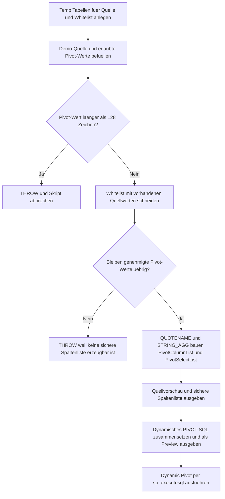

# DynamicPivotColumnListBuilder.sql

Dieses Skript zeigt, wie fuer ein dynamisches `PIVOT` eine sichere Spaltenliste aufgebaut wird. Statt Pivot-Werte direkt in SQL-Text zu uebernehmen, filtert es eine Demo-Quellmenge zuerst ueber eine Whitelist, quotet die erlaubten Werte mit `QUOTENAME` und baut daraus deterministisch sowohl die `IN (...)`-Liste als auch die Ergebnisprojektion.

## Uebersicht

<!-- SQLDOC:SUMMARY_TABLE:BEGIN -->
| Feld | Wert |
|---|---|
| Script | [DynamicPivotColumnListBuilder.sql](DynamicPivotColumnListBuilder.sql) |
| Version | `1.0` |
| Typ | `didactic-lab` |
| Kapitel | `14_Pivot_Unpivot` |
| Sicherheit | `read-only-tempdb` |
| Zweck | Baut fuer ein dynamisches PIVOT eine sichere Spalten- und Select-Liste aus erlaubten Pivot-Werten. |
<!-- SQLDOC:SUMMARY_TABLE:END -->

## Annahmen

- Die Erstversion verwendet ausschliesslich temporaere Demo-Tabellen und keine produktiven Reporting-Tabellen.
- Die Spaltenliste wird nur aus Werten aufgebaut, die sowohl in der Quelle vorkommen als auch in der Whitelist als aktiv markiert sind.
- Ein absichtlich problematischer Wert `Unsafe]]Name` bleibt in den Demodaten enthalten, wird aber durch die deaktivierte Whitelist-Zeile aus dem PIVOT ausgeschlossen.

## Anwendungsfall

Das Skript eignet sich fuer folgende Leitfragen:

- Wie wird eine dynamische Pivot-Spaltenliste mit `STRING_AGG` stabil sortiert aufgebaut?
- Warum ist `QUOTENAME` fuer Werte notwendig, die spaeter zu Spaltennamen werden?
- Wie kann eine fachliche Whitelist verhindern, dass beliebige Quellwerte ungeprueft in dynamisches SQL einfliessen?

## Parameter

<!-- SQLDOC:PARAMETERS_TABLE:BEGIN -->
| Parameter | SQL-Typ | Pflicht | Beschreibung |
|---|---|---|---|
| `-` | `-` | `-` | Dieses Demoskript verwendet keine Laufzeitparameter. |
<!-- SQLDOC:PARAMETERS_TABLE:END -->

## Abhaengigkeiten

<!-- SQLDOC:DEPENDENCIES_LIST:BEGIN -->
- `STRING_AGG`
- `QUOTENAME`
- `sp_executesql`
- temporaere Tabellen in `tempdb`
- `THROW`
<!-- SQLDOC:DEPENDENCIES_LIST:END -->

## Hinweise

- `PivotSourcePreview` zeigt die Rohdaten vor der Filterung fuer das dynamische `PIVOT`.
- `SafePivotColumnList` dokumentiert die genehmigten Werte inklusive `QUOTENAME`-Ergebnis sowie die daraus generierten Listen.
- `DynamicPivotStatementPreview` macht die fertige Anweisung sichtbar, bevor sie per `sp_executesql` ausgefuehrt wird.

## Versionshistorie

<!-- SQLDOC:VERSION_HISTORY_TABLE:BEGIN -->
| Version | Datum | User | Beschreibung |
|---|---|---|---|
| `1.0` | `2026-04-18` | `ER` | Erstversion eines didaktischen Builders fuer sichere Dynamic-Pivot-Spaltenlisten |
<!-- SQLDOC:VERSION_HISTORY_TABLE:END -->

## Ablauf

<!-- SQLDOC:MERMAID:BEGIN -->

<!-- SQLDOC:MERMAID:END -->

## SQL-Code

<!-- SQLDOC:SQL_CODE:BEGIN -->
```sql
/*
BEGIN:SQL-HEADER v1
---
sql_header: v1
script_name: "DynamicPivotColumnListBuilder.sql"
script_version: "1.0"
script_type: "didactic-lab"
chapter: "14_Pivot_Unpivot"

purpose: >
  Erstellt aus einer Demo-Quellmenge eine dynamische, sichere Spaltenliste
  fuer PIVOT-Abfragen. Das Skript zeigt, wie fachlich erlaubte Pivot-Werte
  ueber eine Whitelist, QUOTENAME und STRING_AGG in eine ausfuehrbare
  Spalten- und Select-Liste ueberfuehrt werden.

parameters: []

result_sets:
  - name: "PivotSourcePreview"
    description: "Zeigt die Demo-Quellmenge vor der dynamischen Spaltenlistenerstellung"
  - name: "SafePivotColumnList"
    description: "Listet die fachlich erlaubten Pivot-Werte samt sicher quotierter Spaltenliste"
  - name: "DynamicPivotStatementPreview"
    description: "Zeigt die generierte dynamische PIVOT-Anweisung als Vorschau"
  - name: "DynamicPivotResult"
    description: "Gibt das mit der sicheren Spaltenliste erzeugte Pivot-Ergebnis zurueck"

dependencies:
  - "STRING_AGG"
  - "QUOTENAME"
  - "sp_executesql"
  - "temporary tables"
  - "THROW"

safety:
  level: "read-only-tempdb"
  writes_data: false

documentation:
  markdown_file: "T-SQL/14_Pivot_Unpivot/SQLScripts/DynamicPivotColumnListBuilder.md"
  sync_blocks:
    - "SUMMARY_TABLE"
    - "PARAMETERS_TABLE"
    - "DEPENDENCIES_LIST"
    - "VERSION_HISTORY_TABLE"
    - "SQL_CODE"
  mermaid:
    mode: "ai-agent-from-sql"
    source: "script-body"

main_responsible:
  name: "Erhard Rainer"
  initials: "ER"

version_history:
  - version: "1.0"
    date: "2026-04-18"
    user: "ER"
    description: "Erstversion eines didaktischen Builders fuer sichere Dynamic-Pivot-Spaltenlisten"

notes:
  - "Die Erstversion arbeitet ausschliesslich mit temporaeren Demo-Tabellen."
  - "Nur Werte aus der expliziten Whitelist duerfen in die dynamische Spaltenliste einfliessen."
  - "Das Skript fuehrt das generierte PIVOT als Lehrbeispiel aus und zeigt die Anweisung vorab als Preview."
---
END:SQL-HEADER v1
*/

SET NOCOUNT ON;

DROP TABLE IF EXISTS #PivotSource;
DROP TABLE IF EXISTS #PivotWhitelist;
DROP TABLE IF EXISTS #ApprovedPivotValues;

CREATE TABLE #PivotSource
(
    SalesYear       INT             NOT NULL,
    RegionCode      VARCHAR(10)     NOT NULL,
    PivotMonthLabel NVARCHAR(40)    NOT NULL,
    RevenueAmount   DECIMAL(12,2)   NOT NULL
);

CREATE TABLE #PivotWhitelist
(
    PivotMonthLabel NVARCHAR(40)    NOT NULL PRIMARY KEY,
    DisplayOrder    TINYINT         NOT NULL,
    IsEnabled       BIT             NOT NULL
);

INSERT INTO #PivotSource
(
    SalesYear,
    RegionCode,
    PivotMonthLabel,
    RevenueAmount
)
VALUES
    (2026, 'NORTH', 'Jan',    12500.00),
    (2026, 'NORTH', 'Feb',    14100.00),
    (2026, 'NORTH', 'Mar',    13850.00),
    (2026, 'NORTH', 'Apr',    14990.00),
    (2026, 'SOUTH', 'Jan',    10400.00),
    (2026, 'SOUTH', 'Mar',    11250.00),
    (2026, 'SOUTH', 'Apr',    11780.00),
    (2026, 'WEST',  'Feb',     9600.00),
    (2026, 'WEST',  'Apr',    10240.00),
    (2026, 'WEST',  'May',    11050.00),
    (2026, 'EAST',  'Jan',     8800.00),
    (2026, 'EAST',  'Mar',     9300.00),
    (2026, 'EAST',  'Jun',     9750.00),
    (2026, 'EAST',  'Unsafe]]Name', 1234.00);

INSERT INTO #PivotWhitelist
(
    PivotMonthLabel,
    DisplayOrder,
    IsEnabled
)
VALUES
    ('Jan', 1, 1),
    ('Feb', 2, 1),
    ('Mar', 3, 1),
    ('Apr', 4, 1),
    ('May', 5, 1),
    ('Jun', 6, 1),
    ('Unsafe]]Name', 7, 0);

IF EXISTS
(
    SELECT
        src.PivotMonthLabel
    FROM #PivotSource AS src
    GROUP BY
        src.PivotMonthLabel
    HAVING LEN(src.PivotMonthLabel) > 128
)
BEGIN
    THROW 50021, 'DynamicPivotColumnListBuilder detected a pivot value longer than 128 characters.', 1;
END;

SELECT
    wl.PivotMonthLabel,
    wl.DisplayOrder,
    QUOTENAME(wl.PivotMonthLabel) AS SafeColumnName
INTO #ApprovedPivotValues
FROM #PivotWhitelist AS wl
WHERE wl.IsEnabled = 1
  AND EXISTS
(
    SELECT 1
    FROM #PivotSource AS src
    WHERE src.PivotMonthLabel = wl.PivotMonthLabel
);

IF NOT EXISTS
(
    SELECT 1
    FROM #ApprovedPivotValues
)
BEGIN
    THROW 50022, 'DynamicPivotColumnListBuilder found no approved pivot values after whitelist filtering.', 1;
END;

DECLARE @PivotColumnList NVARCHAR(MAX);
DECLARE @PivotSelectList NVARCHAR(MAX);
DECLARE @DynamicPivotSql NVARCHAR(MAX);

SELECT
    @PivotColumnList = STRING_AGG(apv.SafeColumnName, ', ')
        WITHIN GROUP (ORDER BY apv.DisplayOrder),
    @PivotSelectList = STRING_AGG
    (
        'COALESCE(' + apv.SafeColumnName + ', 0.00) AS ' + apv.SafeColumnName,
        ', '
    ) WITHIN GROUP (ORDER BY apv.DisplayOrder)
FROM #ApprovedPivotValues AS apv;

IF @PivotColumnList IS NULL OR @PivotSelectList IS NULL
BEGIN
    THROW 50023, 'DynamicPivotColumnListBuilder could not build the dynamic pivot column list.', 1;
END;

SET @DynamicPivotSql = N'
SELECT
    p.SalesYear,
    p.RegionCode,
    ' + @PivotSelectList + N'
FROM
(
    SELECT
        src.SalesYear,
        src.RegionCode,
        src.PivotMonthLabel,
        src.RevenueAmount
    FROM #PivotSource AS src
    INNER JOIN #ApprovedPivotValues AS apv
        ON apv.PivotMonthLabel = src.PivotMonthLabel
) AS base_data
PIVOT
(
    SUM(base_data.RevenueAmount)
    FOR base_data.PivotMonthLabel IN (' + @PivotColumnList + N')
) AS p
ORDER BY
    p.SalesYear,
    p.RegionCode;';

SELECT
    src.SalesYear,
    src.RegionCode,
    src.PivotMonthLabel,
    src.RevenueAmount
FROM #PivotSource AS src
ORDER BY
    src.SalesYear,
    src.RegionCode,
    CASE src.PivotMonthLabel
        WHEN 'Jan' THEN 1
        WHEN 'Feb' THEN 2
        WHEN 'Mar' THEN 3
        WHEN 'Apr' THEN 4
        WHEN 'May' THEN 5
        WHEN 'Jun' THEN 6
        ELSE 99
    END,
    src.PivotMonthLabel;

SELECT
    apv.DisplayOrder,
    apv.PivotMonthLabel,
    apv.SafeColumnName,
    @PivotColumnList AS PivotColumnList,
    @PivotSelectList AS PivotSelectList
FROM #ApprovedPivotValues AS apv
ORDER BY
    apv.DisplayOrder;

SELECT
    @DynamicPivotSql AS DynamicPivotSql;

EXEC sys.sp_executesql @DynamicPivotSql;
```
<!-- SQLDOC:SQL_CODE:END -->
