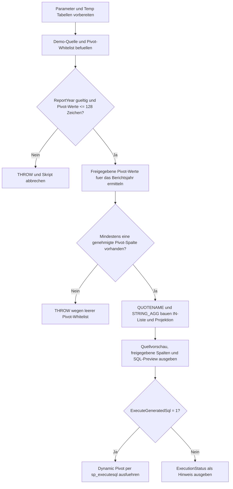

# DynamicPivotTemplate.sql

Dieses Skript liefert eine didaktische Vorlage fuer dynamische `PIVOT`-Abfragen. Es zeigt, wie eine Demo-Quelle ueber eine fachliche Whitelist, `QUOTENAME`, `STRING_AGG` und `sp_executesql` in ein kontrolliertes Dynamic-Pivot-Muster ueberfuehrt wird.

## Uebersicht

<!-- SQLDOC:SUMMARY_TABLE:BEGIN -->
| Feld | Wert |
|---|---|
| Script | [DynamicPivotTemplate.sql](DynamicPivotTemplate.sql) |
| Version | `1.0` |
| Typ | `template` |
| Kapitel | `14_Pivot_Unpivot` |
| Sicherheit | `read-only-tempdb` |
| Zweck | Vorlage fuer dynamische Pivot-Abfragen mit sicherer Spaltenlisten-Erzeugung. |
<!-- SQLDOC:SUMMARY_TABLE:END -->

## Annahmen

- Die Erstversion verwendet ausschliesslich temporaere Demo-Tabellen und keine produktiven Reporting-Objekte.
- Die dynamische Spaltenliste wird nur aus Werten aufgebaut, die in der Whitelist freigegeben und im gefilterten Berichtsjahr vorhanden sind.
- Der Beispielwert `Unsafe]]Label` bleibt in den Quelldaten sichtbar, wird aber nicht in das generierte Pivot uebernommen.

## Anwendungsfall

Die Vorlage eignet sich fuer folgende Leitfragen:

- Wie wird eine dynamische Pivot-Spaltenliste stabil und sicher erzeugt?
- Wie laesst sich die Ausfuehrung des generierten SQL getrennt von der Preview steuern?
- Wo muessen Fachfilter und Whitelist-Pruefungen in einem Dynamic-Pivot-Ablauf sitzen?

## Parameter

<!-- SQLDOC:PARAMETERS_TABLE:BEGIN -->
| Parameter | SQL-Typ | Pflicht | Beschreibung |
|---|---|---|---|
| `@ReportYear` | `int` | nein | Filtert die Demo-Quelle auf ein Berichtsjahr fuer die Pivot-Ausgabe. |
| `@ExecuteGeneratedSql` | `bit` | nein | Fuehrt die generierte Pivot-Anweisung aus, wenn der Wert `1` ist. |
<!-- SQLDOC:PARAMETERS_TABLE:END -->

## Abhaengigkeiten

<!-- SQLDOC:DEPENDENCIES_LIST:BEGIN -->
- `STRING_AGG`
- `QUOTENAME`
- `sp_executesql`
- temporaere Tabellen in `tempdb`
- `THROW`
<!-- SQLDOC:DEPENDENCIES_LIST:END -->

## Hinweise

- `TemplateSourcePreview` zeigt die Quellmenge nach dem Jahresfilter.
- `ApprovedPivotColumns` dokumentiert die sicher freigegebenen Pivot-Spalten inklusive `QUOTENAME`.
- `DynamicPivotStatementPreview` macht das generierte SQL sichtbar, bevor es optional ausgefuehrt wird.

## Versionshistorie

<!-- SQLDOC:VERSION_HISTORY_TABLE:BEGIN -->
| Version | Datum | User | Beschreibung |
|---|---|---|---|
| `1.0` | `2026-04-18` | `ER` | Erstversion einer sicheren Dynamic-Pivot-Vorlage mit Demo-Daten und Whitelist. |
<!-- SQLDOC:VERSION_HISTORY_TABLE:END -->

## Ablauf

<!-- SQLDOC:MERMAID:BEGIN -->

<!-- SQLDOC:MERMAID:END -->

## SQL-Code

<!-- SQLDOC:SQL_CODE:BEGIN -->
```sql
/*
BEGIN:SQL-HEADER v1
---
sql_header: v1
script_name: "DynamicPivotTemplate.sql"
script_version: "1.0"
script_type: "template"
chapter: "14_Pivot_Unpivot"

purpose: >
  Liefert eine didaktische Vorlage fuer dynamische Pivot-Abfragen mit
  sicherer Spaltenlisten-Erzeugung. Das Skript kombiniert Demo-Daten,
  eine fachliche Whitelist, QUOTENAME, STRING_AGG und sp_executesql,
  damit die dynamische PIVOT-Anweisung nachvollziehbar und kontrolliert
  aufgebaut werden kann.

parameters:
  - name: "@ReportYear"
    sql_type: "int"
    direction: "IN"
    required: false
    description: "Filtert die Demo-Quelle auf ein Berichtsjahr fuer die Pivot-Ausgabe."
  - name: "@ExecuteGeneratedSql"
    sql_type: "bit"
    direction: "IN"
    required: false
    description: "Fuehrt die generierte Pivot-Anweisung aus, wenn der Wert 1 ist."

result_sets:
  - name: "TemplateSourcePreview"
    description: "Zeigt die Demo-Quelldaten nach dem Berichtsjahresfilter."
  - name: "ApprovedPivotColumns"
    description: "Listet die freigegebenen Pivot-Werte inklusive sicherer Spaltennamen."
  - name: "DynamicPivotStatementPreview"
    description: "Zeigt die generierte dynamische Pivot-Anweisung vor der Ausfuehrung."
  - name: "DynamicPivotResult"
    description: "Gibt das fertige Pivot-Ergebnis aus, wenn die Ausfuehrung aktiviert ist."

dependencies:
  - "STRING_AGG"
  - "QUOTENAME"
  - "sp_executesql"
  - "temporary tables"
  - "THROW"

safety:
  level: "read-only-tempdb"
  writes_data: false

documentation:
  markdown_file: "T-SQL/14_Pivot_Unpivot/SQLScripts/DynamicPivotTemplate.md"
  sync_blocks:
    - "SUMMARY_TABLE"
    - "PARAMETERS_TABLE"
    - "DEPENDENCIES_LIST"
    - "VERSION_HISTORY_TABLE"
    - "SQL_CODE"
  mermaid:
    mode: "ai-agent-from-sql"
    source: "script-body"

main_responsible:
  name: "Erhard Rainer"
  initials: "ER"

version_history:
  - version: "1.0"
    date: "2026-04-18"
    user: "ER"
    description: "Erstversion einer sicheren Dynamic-Pivot-Vorlage mit Demo-Daten und Whitelist."

notes:
  - "Die Vorlage arbeitet ausschliesslich mit temporaeren Demo-Tabellen."
  - "Die dynamische Spaltenliste darf nur aus explizit freigegebenen Werten entstehen."
  - "Die generierte Anweisung wird immer als Preview angezeigt und nur optional ausgefuehrt."
---
END:SQL-HEADER v1
*/

SET NOCOUNT ON;

DECLARE @ReportYear INT = 2026;
DECLARE @ExecuteGeneratedSql BIT = 1;

DROP TABLE IF EXISTS #TemplateSource;
DROP TABLE IF EXISTS #PivotColumnWhitelist;
DROP TABLE IF EXISTS #ApprovedPivotColumns;

CREATE TABLE #TemplateSource
(
    ReportYear      INT             NOT NULL,
    SalesRegion     VARCHAR(20)     NOT NULL,
    PivotMonth      NVARCHAR(40)    NOT NULL,
    RevenueAmount   DECIMAL(12,2)   NOT NULL
);

CREATE TABLE #PivotColumnWhitelist
(
    PivotMonth      NVARCHAR(40)    NOT NULL PRIMARY KEY,
    DisplayOrder    TINYINT         NOT NULL,
    IsApproved      BIT             NOT NULL
);

INSERT INTO #TemplateSource
(
    ReportYear,
    SalesRegion,
    PivotMonth,
    RevenueAmount
)
VALUES
    (2025, 'Central', 'Jan', 11800.00),
    (2025, 'Central', 'Feb', 12150.00),
    (2025, 'Central', 'Mar', 12700.00),
    (2025, 'North',   'Jan', 14320.00),
    (2025, 'North',   'Mar', 15110.00),
    (2025, 'South',   'Feb', 10980.00),
    (2025, 'South',   'Apr', 11340.00),
    (2026, 'Central', 'Jan', 12440.00),
    (2026, 'Central', 'Feb', 12990.00),
    (2026, 'Central', 'Apr', 13450.00),
    (2026, 'North',   'Jan', 14925.00),
    (2026, 'North',   'Mar', 15680.00),
    (2026, 'North',   'May', 16110.00),
    (2026, 'South',   'Feb', 11420.00),
    (2026, 'South',   'Apr', 11865.00),
    (2026, 'South',   'Unsafe]]Label', 500.00);

INSERT INTO #PivotColumnWhitelist
(
    PivotMonth,
    DisplayOrder,
    IsApproved
)
VALUES
    ('Jan', 1, 1),
    ('Feb', 2, 1),
    ('Mar', 3, 1),
    ('Apr', 4, 1),
    ('May', 5, 1),
    ('Unsafe]]Label', 6, 0);

IF @ReportYear IS NULL
BEGIN
    THROW 50031, 'DynamicPivotTemplate requires a non-null @ReportYear value.', 1;
END;

IF EXISTS
(
    SELECT
        src.PivotMonth
    FROM #TemplateSource AS src
    WHERE src.ReportYear = @ReportYear
    GROUP BY
        src.PivotMonth
    HAVING LEN(src.PivotMonth) > 128
)
BEGIN
    THROW 50032, 'DynamicPivotTemplate detected a pivot value longer than 128 characters.', 1;
END;

SELECT
    wl.PivotMonth,
    wl.DisplayOrder,
    QUOTENAME(wl.PivotMonth) AS SafeColumnName
INTO #ApprovedPivotColumns
FROM #PivotColumnWhitelist AS wl
WHERE wl.IsApproved = 1
  AND EXISTS
(
    SELECT 1
    FROM #TemplateSource AS src
    WHERE src.ReportYear = @ReportYear
      AND src.PivotMonth = wl.PivotMonth
);

IF NOT EXISTS
(
    SELECT 1
    FROM #ApprovedPivotColumns
)
BEGIN
    THROW 50033, 'DynamicPivotTemplate found no approved pivot columns for the selected year.', 1;
END;

DECLARE @PivotColumnList NVARCHAR(MAX);
DECLARE @PivotSelectList NVARCHAR(MAX);
DECLARE @DynamicSql NVARCHAR(MAX);

SELECT
    @PivotColumnList = STRING_AGG(apc.SafeColumnName, ', ')
        WITHIN GROUP (ORDER BY apc.DisplayOrder),
    @PivotSelectList = STRING_AGG
    (
        'COALESCE(p.' + apc.SafeColumnName + ', 0.00) AS ' + apc.SafeColumnName,
        ', '
    ) WITHIN GROUP (ORDER BY apc.DisplayOrder)
FROM #ApprovedPivotColumns AS apc;

IF @PivotColumnList IS NULL OR @PivotSelectList IS NULL
BEGIN
    THROW 50034, 'DynamicPivotTemplate could not assemble the dynamic pivot projection.', 1;
END;

SET @DynamicSql = N'
SELECT
    p.ReportYear,
    p.SalesRegion,
    ' + @PivotSelectList + N'
FROM
(
    SELECT
        src.ReportYear,
        src.SalesRegion,
        src.PivotMonth,
        src.RevenueAmount
    FROM #TemplateSource AS src
    INNER JOIN #ApprovedPivotColumns AS apc
        ON apc.PivotMonth = src.PivotMonth
    WHERE src.ReportYear = @RuntimeReportYear
) AS filtered_source
PIVOT
(
    SUM(filtered_source.RevenueAmount)
    FOR filtered_source.PivotMonth IN (' + @PivotColumnList + N')
) AS p
ORDER BY
    p.ReportYear,
    p.SalesRegion;';

SELECT
    src.ReportYear,
    src.SalesRegion,
    src.PivotMonth,
    src.RevenueAmount
FROM #TemplateSource AS src
WHERE src.ReportYear = @ReportYear
ORDER BY
    src.ReportYear,
    src.SalesRegion,
    CASE src.PivotMonth
        WHEN 'Jan' THEN 1
        WHEN 'Feb' THEN 2
        WHEN 'Mar' THEN 3
        WHEN 'Apr' THEN 4
        WHEN 'May' THEN 5
        ELSE 99
    END,
    src.PivotMonth;

SELECT
    apc.DisplayOrder,
    apc.PivotMonth,
    apc.SafeColumnName,
    @PivotColumnList AS PivotColumnList,
    @PivotSelectList AS PivotSelectList
FROM #ApprovedPivotColumns AS apc
ORDER BY
    apc.DisplayOrder;

SELECT
    @DynamicSql AS DynamicPivotSql;

IF @ExecuteGeneratedSql = 1
BEGIN
    EXEC sys.sp_executesql
        @stmt = @DynamicSql,
        @params = N'@RuntimeReportYear INT',
        @RuntimeReportYear = @ReportYear;
END;
ELSE
BEGIN
    SELECT
        CAST('Execution skipped because @ExecuteGeneratedSql = 0.' AS NVARCHAR(100)) AS ExecutionStatus,
        @ReportYear AS ReportYear;
END;
```
<!-- SQLDOC:SQL_CODE:END -->
