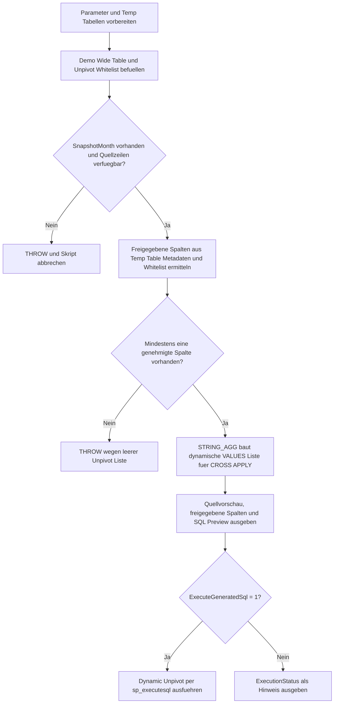

# DynamicUnpivotTemplate.sql

Dieses Skript liefert eine didaktische Vorlage fuer dynamische `UNPIVOT`-Abfragen. Es zeigt, wie eine Wide-Table ueber eine fachliche Whitelist, `QUOTENAME`, `STRING_AGG`, `CROSS APPLY (VALUES ...)` und `sp_executesql` kontrolliert in ein zeilenbasiertes Attributmuster ueberfuehrt wird.

## Uebersicht

<!-- SQLDOC:SUMMARY_TABLE:BEGIN -->
| Feld | Wert |
|---|---|
| Script | [DynamicUnpivotTemplate.sql](DynamicUnpivotTemplate.sql) |
| Version | `1.0` |
| Typ | `template` |
| Kapitel | `14_Pivot_Unpivot` |
| Sicherheit | `read-only-tempdb` |
| Zweck | Vorlage fuer dynamische Unpivot-Abfragen mit sicherer Spaltenlisten-Erzeugung. |
<!-- SQLDOC:SUMMARY_TABLE:END -->

## Annahmen

- Die Erstversion verwendet ausschliesslich temporaere Demo-Tabellen und keine produktiven Quellsysteme.
- Die dynamische Attributliste wird nur aus Whitelist-Spalten aufgebaut, die in `#WideSkillSnapshot` tatsaechlich vorhanden sind.
- `HiddenAuditFlag` bleibt bewusst in der Wide-Quelle sichtbar, wird aber nicht in das generierte Unpivot uebernommen.

## Anwendungsfall

Die Vorlage eignet sich fuer folgende Leitfragen:

- Wie wird eine variable Unpivot-Spaltenliste sicher aus Metadaten und Whitelist gebaut?
- Wann ist ein dynamisches `CROSS APPLY (VALUES ...)` einfacher als ein statisches `UNPIVOT`?
- Wo sollten Filter fuer Stichtag, Nullwerte und Freigaben im Ablauf sitzen?

## Parameter

<!-- SQLDOC:PARAMETERS_TABLE:BEGIN -->
| Parameter | SQL-Typ | Pflicht | Beschreibung |
|---|---|---|---|
| `@SnapshotMonth` | `date` | nein | Filtert die Demo-Quelle auf einen Stichtagsmonat fuer die Unpivot-Ausgabe. |
| `@SuppressZeroScores` | `bit` | nein | Blendet Null- und Nullwert-Ergebnisse aus, wenn der Wert `1` ist. |
| `@ExecuteGeneratedSql` | `bit` | nein | Fuehrt die generierte Unpivot-Anweisung aus, wenn der Wert `1` ist. |
<!-- SQLDOC:PARAMETERS_TABLE:END -->

## Abhaengigkeiten

<!-- SQLDOC:DEPENDENCIES_LIST:BEGIN -->
- `STRING_AGG`
- `QUOTENAME`
- `sp_executesql`
- temporaere Tabellen in `tempdb`
- `THROW`
<!-- SQLDOC:DEPENDENCIES_LIST:END -->

## Hinweise

- `TemplateSourcePreview` zeigt die Wide-Quelle nach dem Monatsfilter.
- `ApprovedAttributeColumns` dokumentiert die freigegebenen Spalten inklusive sicherer SQL-Fragmente.
- `DynamicUnpivotStatementPreview` macht das generierte SQL sichtbar, bevor es optional ausgefuehrt wird.

## Versionshistorie

<!-- SQLDOC:VERSION_HISTORY_TABLE:BEGIN -->
| Version | Datum | User | Beschreibung |
|---|---|---|---|
| `1.0` | `2026-04-18` | `ER` | Erstversion einer sicheren Dynamic-Unpivot-Vorlage mit Demo-Daten und Whitelist. |
<!-- SQLDOC:VERSION_HISTORY_TABLE:END -->

## Ablauf

<!-- SQLDOC:MERMAID:BEGIN -->

<!-- SQLDOC:MERMAID:END -->

## SQL-Code

<!-- SQLDOC:SQL_CODE:BEGIN -->
```sql
/*
BEGIN:SQL-HEADER v1
---
sql_header: v1
script_name: "DynamicUnpivotTemplate.sql"
script_version: "1.0"
script_type: "template"
chapter: "14_Pivot_Unpivot"

purpose: >
  Liefert eine didaktische Vorlage fuer dynamische UNPIVOT-Abfragen mit
  sicherer Spaltenlisten-Erzeugung. Das Skript kombiniert Demo-Daten,
  eine fachliche Whitelist, QUOTENAME, STRING_AGG und sp_executesql,
  damit variable Attributspalten kontrolliert in Zeilen ueberfuehrt
  werden koennen.

parameters:
  - name: "@SnapshotMonth"
    sql_type: "date"
    direction: "IN"
    required: false
    description: "Filtert die Demo-Quelle auf einen Stichtagsmonat fuer die Unpivot-Ausgabe."
  - name: "@SuppressZeroScores"
    sql_type: "bit"
    direction: "IN"
    required: false
    description: "Blendet Null- und Nullwert-Ergebnisse aus, wenn der Wert 1 ist."
  - name: "@ExecuteGeneratedSql"
    sql_type: "bit"
    direction: "IN"
    required: false
    description: "Fuehrt die generierte Unpivot-Anweisung aus, wenn der Wert 1 ist."

result_sets:
  - name: "TemplateSourcePreview"
    description: "Zeigt die Demo-Quelldaten nach dem Monatsfilter."
  - name: "ApprovedAttributeColumns"
    description: "Listet die freigegebenen Wide-Columns inklusive sicherer SQL-Fragmente."
  - name: "DynamicUnpivotStatementPreview"
    description: "Zeigt die generierte dynamische Unpivot-Anweisung vor der Ausfuehrung."
  - name: "DynamicUnpivotResult"
    description: "Gibt das fertige Unpivot-Ergebnis aus, wenn die Ausfuehrung aktiviert ist."

dependencies:
  - "STRING_AGG"
  - "QUOTENAME"
  - "sp_executesql"
  - "temporary tables"
  - "THROW"

safety:
  level: "read-only-tempdb"
  writes_data: false

documentation:
  markdown_file: "T-SQL/14_Pivot_Unpivot/SQLScripts/DynamicUnpivotTemplate.md"
  sync_blocks:
    - "SUMMARY_TABLE"
    - "PARAMETERS_TABLE"
    - "DEPENDENCIES_LIST"
    - "VERSION_HISTORY_TABLE"
    - "SQL_CODE"
  mermaid:
    mode: "ai-agent-from-sql"
    source: "script-body"

main_responsible:
  name: "Erhard Rainer"
  initials: "ER"

version_history:
  - version: "1.0"
    date: "2026-04-18"
    user: "ER"
    description: "Erstversion einer sicheren Dynamic-Unpivot-Vorlage mit Demo-Daten und Whitelist."

notes:
  - "Die Vorlage arbeitet ausschliesslich mit temporaeren Demo-Tabellen."
  - "Die dynamische Unpivot-Liste darf nur aus explizit freigegebenen Spalten entstehen."
  - "Die generierte Anweisung wird immer als Preview angezeigt und nur optional ausgefuehrt."
---
END:SQL-HEADER v1
*/

SET NOCOUNT ON;

DECLARE @SnapshotMonth DATE = '2026-03-01';
DECLARE @SuppressZeroScores BIT = 1;
DECLARE @ExecuteGeneratedSql BIT = 1;

DROP TABLE IF EXISTS #WideSkillSnapshot;
DROP TABLE IF EXISTS #UnpivotColumnWhitelist;
DROP TABLE IF EXISTS #ApprovedAttributeColumns;

CREATE TABLE #WideSkillSnapshot
(
    SnapshotMonth   DATE            NOT NULL,
    EmployeeId      INT             NOT NULL,
    EmployeeName    NVARCHAR(80)    NOT NULL,
    TeamName        NVARCHAR(40)    NOT NULL,
    SkillSql        TINYINT         NULL,
    SkillPython     TINYINT         NULL,
    SkillPowerBi    TINYINT         NULL,
    SkillFabric     TINYINT         NULL,
    SkillExcel      TINYINT         NULL,
    HiddenAuditFlag TINYINT         NULL
);

CREATE TABLE #UnpivotColumnWhitelist
(
    ColumnName      SYSNAME         NOT NULL PRIMARY KEY,
    AttributeLabel  NVARCHAR(80)    NOT NULL,
    DisplayOrder    TINYINT         NOT NULL,
    IsApproved      BIT             NOT NULL
);

INSERT INTO #WideSkillSnapshot
(
    SnapshotMonth,
    EmployeeId,
    EmployeeName,
    TeamName,
    SkillSql,
    SkillPython,
    SkillPowerBi,
    SkillFabric,
    SkillExcel,
    HiddenAuditFlag
)
VALUES
    ('2026-02-01', 101, N'Alex Meyer',   N'Data Platform', 4, 3, 5, 2, 4, 1),
    ('2026-02-01', 102, N'Banu Keller',  N'Analytics',     2, 4, 5, 3, 3, 0),
    ('2026-02-01', 103, N'Chris Novak',  N'Analytics',     5, 2, 3, 1, 4, 1),
    ('2026-03-01', 101, N'Alex Meyer',   N'Data Platform', 5, 4, 5, 3, 4, 1),
    ('2026-03-01', 102, N'Banu Keller',  N'Analytics',     2, 5, 5, 4, 3, 0),
    ('2026-03-01', 103, N'Chris Novak',  N'Analytics',     5, 3, 4, 2, 0, 1),
    ('2026-03-01', 104, N'Dana Ibrahim', N'Enablement',    1, 2, 3, NULL, 5, 0);

INSERT INTO #UnpivotColumnWhitelist
(
    ColumnName,
    AttributeLabel,
    DisplayOrder,
    IsApproved
)
VALUES
    ('SkillSql',        N'SQL',            1, 1),
    ('SkillPython',     N'Python',         2, 1),
    ('SkillPowerBi',    N'Power BI',       3, 1),
    ('SkillFabric',     N'Microsoft Fabric', 4, 1),
    ('SkillExcel',      N'Excel',          5, 1),
    ('HiddenAuditFlag', N'Internal Audit', 6, 0);

IF @SnapshotMonth IS NULL
BEGIN
    THROW 50041, 'DynamicUnpivotTemplate requires a non-null @SnapshotMonth value.', 1;
END;

IF NOT EXISTS
(
    SELECT 1
    FROM #WideSkillSnapshot AS src
    WHERE src.SnapshotMonth = @SnapshotMonth
)
BEGIN
    THROW 50042, 'DynamicUnpivotTemplate found no source rows for the selected @SnapshotMonth.', 1;
END;

SELECT
    wl.ColumnName,
    wl.AttributeLabel,
    wl.DisplayOrder,
    QUOTENAME(wl.ColumnName) AS SafeColumnName,
    REPLACE(wl.AttributeLabel, '''', '''''') AS EscapedAttributeLabel
INTO #ApprovedAttributeColumns
FROM #UnpivotColumnWhitelist AS wl
WHERE wl.IsApproved = 1
  AND EXISTS
(
    SELECT 1
    FROM tempdb.sys.columns AS c
    WHERE c.object_id = OBJECT_ID('tempdb..#WideSkillSnapshot')
      AND c.name = wl.ColumnName
);

IF NOT EXISTS
(
    SELECT 1
    FROM #ApprovedAttributeColumns
)
BEGIN
    THROW 50043, 'DynamicUnpivotTemplate found no approved wide columns to unpivot.', 1;
END;

DECLARE @ValuesList NVARCHAR(MAX);
DECLARE @DynamicSql NVARCHAR(MAX);

SELECT
    @ValuesList = STRING_AGG
    (
        '(N''' + apc.EscapedAttributeLabel + ''', TRY_CONVERT(decimal(10,2), src.' + apc.SafeColumnName + '))',
        ', '
    ) WITHIN GROUP (ORDER BY apc.DisplayOrder)
FROM #ApprovedAttributeColumns AS apc;

IF @ValuesList IS NULL
BEGIN
    THROW 50044, 'DynamicUnpivotTemplate could not assemble the dynamic VALUES list.', 1;
END;

SET @DynamicSql = N'
SELECT
    src.SnapshotMonth,
    src.EmployeeId,
    src.EmployeeName,
    src.TeamName,
    unp.AttributeName,
    unp.AttributeScore
FROM #WideSkillSnapshot AS src
CROSS APPLY
(
    VALUES ' + @ValuesList + N'
) AS unp
(
    AttributeName,
    AttributeScore
)
WHERE src.SnapshotMonth = @RuntimeSnapshotMonth
  AND
  (
      @RuntimeSuppressZeroScores = 0
      OR unp.AttributeScore IS NOT NULL AND unp.AttributeScore <> 0
  )
ORDER BY
    src.EmployeeId,
    unp.AttributeName;';

SELECT
    src.SnapshotMonth,
    src.EmployeeId,
    src.EmployeeName,
    src.TeamName,
    src.SkillSql,
    src.SkillPython,
    src.SkillPowerBi,
    src.SkillFabric,
    src.SkillExcel,
    src.HiddenAuditFlag
FROM #WideSkillSnapshot AS src
WHERE src.SnapshotMonth = @SnapshotMonth
ORDER BY
    src.EmployeeId;

SELECT
    apc.ColumnName,
    apc.AttributeLabel,
    apc.DisplayOrder,
    apc.SafeColumnName
FROM #ApprovedAttributeColumns AS apc
ORDER BY
    apc.DisplayOrder;

SELECT
    @DynamicSql AS GeneratedUnpivotSql;

IF @ExecuteGeneratedSql = 1
BEGIN
    EXEC sys.sp_executesql
        @DynamicSql,
        N'@RuntimeSnapshotMonth date, @RuntimeSuppressZeroScores bit',
        @RuntimeSnapshotMonth = @SnapshotMonth,
        @RuntimeSuppressZeroScores = @SuppressZeroScores;
END;
ELSE
BEGIN
    SELECT
        CAST('Execution skipped because @ExecuteGeneratedSql = 0.' AS NVARCHAR(200)) AS ExecutionStatus;
END;
```
<!-- SQLDOC:SQL_CODE:END -->
