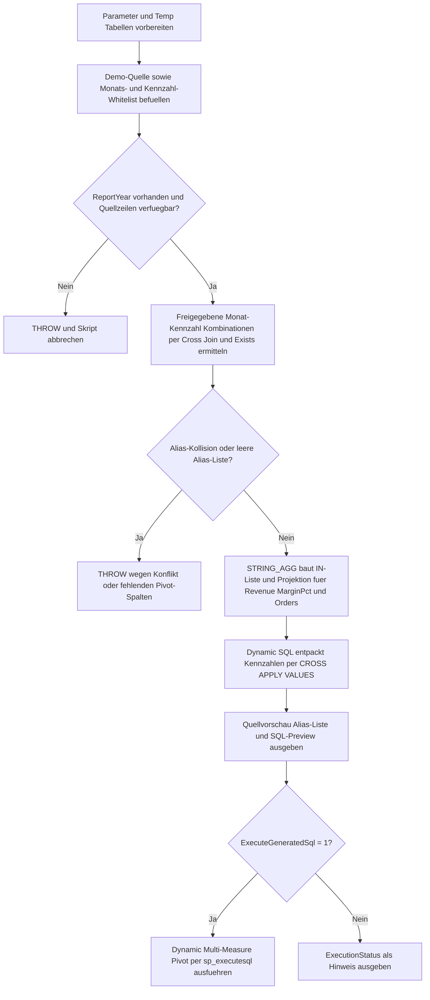

# MultiMeasurePivotTemplate.sql

Dieses Skript liefert eine didaktische Vorlage fuer `PIVOT`-Abfragen mit mehreren Kennzahlen. Es zeigt, wie Monats- und Kennzahl-Whitelist, Alias-Normalisierung, `STRING_AGG`, `QUOTENAME` und `sp_executesql` zusammenwirken, damit eine breite Ergebnis-Matrix mit stabilen Spaltennamen aufgebaut werden kann.

## Uebersicht

<!-- SQLDOC:SUMMARY_TABLE:BEGIN -->
| Feld | Wert |
|---|---|
| Script | [MultiMeasurePivotTemplate.sql](MultiMeasurePivotTemplate.sql) |
| Version | `1.0` |
| Typ | `template` |
| Kapitel | `14_Pivot_Unpivot` |
| Sicherheit | `read-only-tempdb` |
| Zweck | Vorlage fuer Pivot-Abfragen mit mehreren Kennzahlen und sauberem Alias-Schema. |
<!-- SQLDOC:SUMMARY_TABLE:END -->

## Annahmen

- Die Erstversion verwendet ausschliesslich temporaere Demo-Tabellen und keine produktiven Reporting-Objekte.
- Die Pivot-Spaltenliste entsteht nur aus Monats- und Kennzahl-Kombinationen, die in beiden Whitelists freigegeben sind und im gewaehlten Berichtsjahr tatsaechlich vorkommen.
- Der Beispielmonat `Unsafe Label` bleibt in den Quelldaten sichtbar, wird aber bewusst nicht in die generierte Pivot-Matrix uebernommen.

## Anwendungsfall

Die Vorlage eignet sich fuer folgende Leitfragen:

- Wie laesst sich eine Multi-Measure-Matrix in T-SQL aufbauen, obwohl `PIVOT` selbst nur eine Wertespalte verarbeitet?
- Wo sollten Whitelist, Alias-Normalisierung und Kollisionspruefung im Ablauf einer dynamischen Pivot-Vorlage sitzen?
- Wie bleiben Spaltennamen wie `Revenue_Jan`, `MarginPct_Jan` und `Orders_Jan` fuer Folgeabfragen stabil und lesbar?

## Parameter

<!-- SQLDOC:PARAMETERS_TABLE:BEGIN -->
| Parameter | SQL-Typ | Pflicht | Beschreibung |
|---|---|---|---|
| `@ReportYear` | `int` | nein | Filtert die Demo-Quelle auf ein Berichtsjahr fuer die Pivot-Ausgabe. |
| `@ExecuteGeneratedSql` | `bit` | nein | Fuehrt die generierte Multi-Measure-Pivot-Anweisung aus, wenn der Wert `1` ist. |
<!-- SQLDOC:PARAMETERS_TABLE:END -->

## Abhaengigkeiten

<!-- SQLDOC:DEPENDENCIES_LIST:BEGIN -->
- `STRING_AGG`
- `QUOTENAME`
- `sp_executesql`
- temporaere Tabellen in `tempdb`
- `THROW`
<!-- SQLDOC:DEPENDENCIES_LIST:END -->

## Hinweise

- `TemplateSourcePreview` zeigt die Quellmenge nach dem Jahresfilter inklusive aller drei Kennzahlen.
- `ApprovedPivotAliases` dokumentiert fuer jede freigegebene Kombination aus Monat und Kennzahl den stabilen Alias vor dem Dynamic Pivot.
- `DynamicPivotStatementPreview` macht das generierte SQL sichtbar, bevor es optional ausgefuehrt wird.

## Versionshistorie

<!-- SQLDOC:VERSION_HISTORY_TABLE:BEGIN -->
| Version | Datum | User | Beschreibung |
|---|---|---|---|
| `1.0` | `2026-04-18` | `ER` | Erstversion einer Multi-Measure-Pivot-Vorlage mit Alias-Normalisierung und Demo-Daten. |
<!-- SQLDOC:VERSION_HISTORY_TABLE:END -->

## Ablauf

<!-- SQLDOC:MERMAID:BEGIN -->

<!-- SQLDOC:MERMAID:END -->

## SQL-Code

<!-- SQLDOC:SQL_CODE:BEGIN -->
```sql
/*
BEGIN:SQL-HEADER v1
---
sql_header: v1
script_name: "MultiMeasurePivotTemplate.sql"
script_version: "1.0"
script_type: "template"
chapter: "14_Pivot_Unpivot"

purpose: >
  Liefert eine didaktische Vorlage fuer Pivot-Abfragen mit mehreren
  Kennzahlen und einem stabilen Alias-Schema. Das Skript kombiniert
  Demo-Daten, Monats- und Kennzahl-Whitelist, Alias-Normalisierung,
  STRING_AGG, QUOTENAME und sp_executesql, damit mehrwertige Pivot-
  Matrizen nachvollziehbar und kontrolliert aufgebaut werden koennen.

parameters:
  - name: "@ReportYear"
    sql_type: "int"
    direction: "IN"
    required: false
    description: "Filtert die Demo-Quelle auf ein Berichtsjahr fuer die Pivot-Ausgabe."
  - name: "@ExecuteGeneratedSql"
    sql_type: "bit"
    direction: "IN"
    required: false
    description: "Fuehrt die generierte Multi-Measure-Pivot-Anweisung aus, wenn der Wert 1 ist."

result_sets:
  - name: "TemplateSourcePreview"
    description: "Zeigt die Demo-Quelldaten nach dem Berichtsjahresfilter."
  - name: "ApprovedPivotAliases"
    description: "Listet die freigegebenen Alias-Spalten fuer Kennzahl und Monat."
  - name: "DynamicPivotStatementPreview"
    description: "Zeigt die generierte Multi-Measure-Pivot-Anweisung vor der Ausfuehrung."
  - name: "DynamicPivotResult"
    description: "Gibt die fertige Pivot-Matrix aus, wenn die Ausfuehrung aktiviert ist."

dependencies:
  - "STRING_AGG"
  - "QUOTENAME"
  - "sp_executesql"
  - "temporary tables"
  - "THROW"

safety:
  level: "read-only-tempdb"
  writes_data: false

documentation:
  markdown_file: "T-SQL/14_Pivot_Unpivot/SQLScripts/MultiMeasurePivotTemplate.md"
  sync_blocks:
    - "SUMMARY_TABLE"
    - "PARAMETERS_TABLE"
    - "DEPENDENCIES_LIST"
    - "VERSION_HISTORY_TABLE"
    - "SQL_CODE"
  mermaid:
    mode: "ai-agent-from-sql"
    source: "script-body"

main_responsible:
  name: "Erhard Rainer"
  initials: "ER"

version_history:
  - version: "1.0"
    date: "2026-04-18"
    user: "ER"
    description: "Erstversion einer Multi-Measure-Pivot-Vorlage mit Alias-Normalisierung und Demo-Daten."

notes:
  - "Die Vorlage arbeitet ausschliesslich mit temporaeren Demo-Tabellen."
  - "Pivot-Spalten entstehen nur aus freigegebenen Monats- und Kennzahl-Kombinationen."
  - "Unsichere Aliasnamen werden vor QUOTENAME auf ein stabiles ASCII-Schema normalisiert."
---
END:SQL-HEADER v1
*/

SET NOCOUNT ON;

DECLARE @ReportYear INT = 2026;
DECLARE @ExecuteGeneratedSql BIT = 1;

DROP TABLE IF EXISTS #TemplateSource;
DROP TABLE IF EXISTS #MonthWhitelist;
DROP TABLE IF EXISTS #MeasureWhitelist;
DROP TABLE IF EXISTS #ApprovedPivotAliases;

CREATE TABLE #TemplateSource
(
    ReportYear      INT             NOT NULL,
    SalesRegion     VARCHAR(20)     NOT NULL,
    PivotMonth      NVARCHAR(40)    NOT NULL,
    RevenueAmount   DECIMAL(12,2)   NOT NULL,
    MarginPercent   DECIMAL(5,2)    NOT NULL,
    OrderCount      INT             NOT NULL
);

CREATE TABLE #MonthWhitelist
(
    PivotMonth      NVARCHAR(40)    NOT NULL PRIMARY KEY,
    DisplayOrder    TINYINT         NOT NULL,
    IsApproved      BIT             NOT NULL
);

CREATE TABLE #MeasureWhitelist
(
    MeasureName     NVARCHAR(40)    NOT NULL PRIMARY KEY,
    AliasToken      VARCHAR(40)     NOT NULL,
    DisplayOrder    TINYINT         NOT NULL,
    IsApproved      BIT             NOT NULL
);

INSERT INTO #TemplateSource
(
    ReportYear,
    SalesRegion,
    PivotMonth,
    RevenueAmount,
    MarginPercent,
    OrderCount
)
VALUES
    (2025, 'Central', 'Jan', 11800.00, 31.40, 120),
    (2025, 'Central', 'Feb', 12150.00, 32.10, 125),
    (2025, 'North',   'Jan', 14320.00, 34.20, 132),
    (2025, 'North',   'Mar', 15110.00, 33.60, 138),
    (2025, 'South',   'Feb', 10980.00, 29.50, 110),
    (2026, 'Central', 'Jan', 12440.00, 32.60, 126),
    (2026, 'Central', 'Feb', 12990.00, 33.10, 128),
    (2026, 'Central', 'Apr', 13450.00, 34.40, 131),
    (2026, 'North',   'Jan', 14925.00, 35.20, 139),
    (2026, 'North',   'Mar', 15680.00, 35.80, 144),
    (2026, 'North',   'May', 16110.00, 36.10, 146),
    (2026, 'South',   'Feb', 11420.00, 30.10, 114),
    (2026, 'South',   'Apr', 11865.00, 30.80, 116),
    (2026, 'South',   'Unsafe Label', 500.00, 9.99, 2);

INSERT INTO #MonthWhitelist
(
    PivotMonth,
    DisplayOrder,
    IsApproved
)
VALUES
    ('Jan', 1, 1),
    ('Feb', 2, 1),
    ('Mar', 3, 1),
    ('Apr', 4, 1),
    ('May', 5, 1),
    ('Unsafe Label', 6, 0);

INSERT INTO #MeasureWhitelist
(
    MeasureName,
    AliasToken,
    DisplayOrder,
    IsApproved
)
VALUES
    ('RevenueAmount', 'Revenue', 1, 1),
    ('MarginPercent', 'MarginPct', 2, 1),
    ('OrderCount', 'Orders', 3, 1),
    ('InternalScore', 'InternalScore', 4, 0);

IF @ReportYear IS NULL
BEGIN
    THROW 50051, 'MultiMeasurePivotTemplate requires a non-null @ReportYear value.', 1;
END;

IF NOT EXISTS
(
    SELECT 1
    FROM #TemplateSource AS src
    WHERE src.ReportYear = @ReportYear
)
BEGIN
    THROW 50052, 'MultiMeasurePivotTemplate found no source rows for the selected @ReportYear.', 1;
END;

SELECT
    mw.PivotMonth,
    mw.DisplayOrder AS MonthDisplayOrder,
    vw.MeasureName,
    vw.AliasToken,
    vw.DisplayOrder AS MeasureDisplayOrder,
    vw.AliasToken + '_' +
        REPLACE(REPLACE(mw.PivotMonth, ' ', ''), '-', '') AS PivotAlias,
    QUOTENAME
    (
        vw.AliasToken + '_' +
        REPLACE(REPLACE(mw.PivotMonth, ' ', ''), '-', '')
    ) AS SafePivotAlias
INTO #ApprovedPivotAliases
FROM #MonthWhitelist AS mw
CROSS JOIN #MeasureWhitelist AS vw
WHERE mw.IsApproved = 1
  AND vw.IsApproved = 1
  AND EXISTS
(
    SELECT 1
    FROM #TemplateSource AS src
    WHERE src.ReportYear = @ReportYear
      AND src.PivotMonth = mw.PivotMonth
);

IF EXISTS
(
    SELECT
        apa.PivotAlias
    FROM #ApprovedPivotAliases AS apa
    GROUP BY
        apa.PivotAlias
    HAVING COUNT(*) > 1
)
BEGIN
    THROW 50053, 'MultiMeasurePivotTemplate detected duplicate normalized pivot aliases.', 1;
END;

IF NOT EXISTS
(
    SELECT 1
    FROM #ApprovedPivotAliases
)
BEGIN
    THROW 50054, 'MultiMeasurePivotTemplate found no approved pivot aliases for the selected year.', 1;
END;

DECLARE @PivotColumnList NVARCHAR(MAX);
DECLARE @PivotSelectList NVARCHAR(MAX);
DECLARE @DynamicSql NVARCHAR(MAX);

SELECT
    @PivotColumnList = STRING_AGG(apa.SafePivotAlias, ', ')
        WITHIN GROUP (ORDER BY apa.MonthDisplayOrder, apa.MeasureDisplayOrder),
    @PivotSelectList = STRING_AGG
    (
        'COALESCE(p.' + apa.SafePivotAlias + ', 0.00) AS ' + apa.SafePivotAlias,
        ', '
    ) WITHIN GROUP (ORDER BY apa.MonthDisplayOrder, apa.MeasureDisplayOrder)
FROM #ApprovedPivotAliases AS apa;

IF @PivotColumnList IS NULL OR @PivotSelectList IS NULL
BEGIN
    THROW 50055, 'MultiMeasurePivotTemplate could not assemble the dynamic multi-measure projection.', 1;
END;

SET @DynamicSql = N'
WITH normalized_source AS
(
    SELECT
        src.ReportYear,
        src.SalesRegion,
        src.PivotMonth,
        v.MeasureName,
        TRY_CONVERT(decimal(18,2), v.MeasureValue) AS MeasureValue
    FROM #TemplateSource AS src
    CROSS APPLY
    (
        VALUES
            (N''RevenueAmount'', TRY_CONVERT(sql_variant, src.RevenueAmount)),
            (N''MarginPercent'', TRY_CONVERT(sql_variant, src.MarginPercent)),
            (N''OrderCount'', TRY_CONVERT(sql_variant, src.OrderCount))
    ) AS v
    (
        MeasureName,
        MeasureValue
    )
    WHERE src.ReportYear = @RuntimeReportYear
),
filtered_source AS
(
    SELECT
        ns.ReportYear,
        ns.SalesRegion,
        apa.PivotAlias,
        ns.MeasureValue
    FROM normalized_source AS ns
    INNER JOIN #ApprovedPivotAliases AS apa
        ON apa.PivotMonth = ns.PivotMonth
       AND apa.MeasureName = ns.MeasureName
)
SELECT
    p.ReportYear,
    p.SalesRegion,
    ' + @PivotSelectList + N'
FROM filtered_source
PIVOT
(
    MAX(filtered_source.MeasureValue)
    FOR filtered_source.PivotAlias IN (' + @PivotColumnList + N')
) AS p
ORDER BY
    p.ReportYear,
    p.SalesRegion;';

SELECT
    src.ReportYear,
    src.SalesRegion,
    src.PivotMonth,
    src.RevenueAmount,
    src.MarginPercent,
    src.OrderCount
FROM #TemplateSource AS src
WHERE src.ReportYear = @ReportYear
ORDER BY
    src.ReportYear,
    src.SalesRegion,
    CASE src.PivotMonth
        WHEN 'Jan' THEN 1
        WHEN 'Feb' THEN 2
        WHEN 'Mar' THEN 3
        WHEN 'Apr' THEN 4
        WHEN 'May' THEN 5
        ELSE 99
    END,
    src.PivotMonth;

SELECT
    apa.MonthDisplayOrder,
    apa.MeasureDisplayOrder,
    apa.PivotMonth,
    apa.MeasureName,
    apa.AliasToken,
    apa.PivotAlias,
    apa.SafePivotAlias,
    @PivotColumnList AS PivotColumnList
FROM #ApprovedPivotAliases AS apa
ORDER BY
    apa.MonthDisplayOrder,
    apa.MeasureDisplayOrder;

SELECT
    @DynamicSql AS DynamicPivotSql;

IF @ExecuteGeneratedSql = 1
BEGIN
    EXEC sys.sp_executesql
        @stmt = @DynamicSql,
        @params = N'@RuntimeReportYear INT',
        @RuntimeReportYear = @ReportYear;
END;
ELSE
BEGIN
    SELECT
        CAST('Execution skipped because @ExecuteGeneratedSql = 0.' AS NVARCHAR(100)) AS ExecutionStatus,
        @ReportYear AS ReportYear;
END;
```
<!-- SQLDOC:SQL_CODE:END -->
