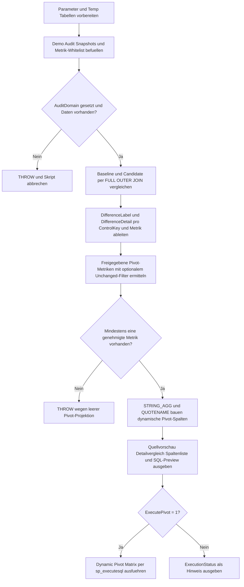

# PivotAuditDifferenceMatrix.sql

Dieses Skript zeigt, wie sich Unterschiede zwischen zwei Audit-Snapshots als auditierbare Pivot-Matrix darstellen lassen. Die Demo vergleicht Baseline- und Candidate-Werte, klassifiziert Abweichungen pro Metrik und verdichtet sie mit einem dynamischen `PIVOT` zu einer Review-Matrix.

## Uebersicht

<!-- SQLDOC:SUMMARY_TABLE:BEGIN -->
| Feld | Wert |
|---|---|
| Script | [PivotAuditDifferenceMatrix.sql](PivotAuditDifferenceMatrix.sql) |
| Version | `1.0` |
| Typ | `didactic-lab` |
| Kapitel | `14_Pivot_Unpivot` |
| Sicherheit | `read-only-tempdb` |
| Zweck | Audit-Differenzen zwischen Baseline und Candidate als Pivot-Matrix darstellen. |
<!-- SQLDOC:SUMMARY_TABLE:END -->

## Annahmen

- Die Erstversion verwendet ausschliesslich temporaere Demo-Tabellen und keine produktiven Audit- oder Compliance-Objekte.
- Die Vergleichslogik arbeitet mit genau zwei Snapshot-Labels: `Baseline` und `Candidate`.
- Nicht freigegebene Metriken bleiben fuer Diagnosezwecke in der Detailsicht moeglich, werden aber nicht in die Pivot-Matrix uebernommen.

## Anwendungsfall

Die Demo eignet sich fuer folgende Leitfragen:

- Wie lassen sich Audit-Abweichungen pro `ControlKey` und Metrik sichtbar klassifizieren?
- Wo sitzt die Trennung zwischen Detailvergleich und verdichteter Pivot-Matrix?
- Wie koennen unveraenderte Metriken optional ausgeblendet werden, ohne die Auditspur zu verlieren?

## Parameter

<!-- SQLDOC:PARAMETERS_TABLE:BEGIN -->
| Parameter | SQL-Typ | Pflicht | Beschreibung |
|---|---|---|---|
| `@AuditDomain` | `varchar(30)` | nein | Filtert die Demo-Auditdaten auf einen fachlichen Bereich wie `Pricing` oder `Inventory`. |
| `@IncludeUnchanged` | `bit` | nein | Nimmt auch unveraenderte Audit-Metriken in die Pivot-Matrix auf, wenn der Wert `1` ist. |
| `@ExecutePivot` | `bit` | nein | Fuehrt die generierte Pivot-Anweisung aus, wenn der Wert `1` ist. |
<!-- SQLDOC:PARAMETERS_TABLE:END -->

## Abhaengigkeiten

<!-- SQLDOC:DEPENDENCIES_LIST:BEGIN -->
- `STRING_AGG`
- `QUOTENAME`
- `sp_executesql`
- temporaere Tabellen in `tempdb`
- `FULL OUTER JOIN`
- `THROW`
<!-- SQLDOC:DEPENDENCIES_LIST:END -->

## Hinweise

- `AuditSourcePreview` zeigt die beiden Demo-Snapshots fuer den gewaehlten Audit-Bereich.
- `DifferenceDetailPreview` dokumentiert pro Metrik Baseline-, Candidate- und Difference-Detail.
- `AuditDifferenceMatrix` liefert die verdichtete Review-Sicht mit Statuswerten wie `Changed`, `Added` und `Removed`.

## Versionshistorie

<!-- SQLDOC:VERSION_HISTORY_TABLE:BEGIN -->
| Version | Datum | User | Beschreibung |
|---|---|---|---|
| `1.0` | `2026-04-18` | `ER` | Erstversion einer Audit-Differenzmatrix mit Snapshot-Vergleich und Dynamic Pivot. |
<!-- SQLDOC:VERSION_HISTORY_TABLE:END -->

## Ablauf

<!-- SQLDOC:MERMAID:BEGIN -->

<!-- SQLDOC:MERMAID:END -->

## SQL-Code

<!-- SQLDOC:SQL_CODE:BEGIN -->
```sql
/*
BEGIN:SQL-HEADER v1
---
sql_header: v1
script_name: "PivotAuditDifferenceMatrix.sql"
script_version: "1.0"
script_type: "didactic-lab"
chapter: "14_Pivot_Unpivot"

purpose: >
  Stellt Unterschiede zwischen zwei Audit-Snapshots als Pivot-Matrix dar.
  Das Skript baut eine didaktische Demo fuer Baseline- und Candidate-
  Messwerte auf, klassifiziert Aenderungen pro Audit-Metrik und erzeugt
  daraus eine auditierbare Matrix mit dynamischem PIVOT.

parameters:
  - name: "@AuditDomain"
    sql_type: "varchar(30)"
    direction: "IN"
    required: false
    description: "Filtert die Demo-Auditdaten auf einen fachlichen Bereich wie Pricing oder Inventory."
  - name: "@IncludeUnchanged"
    sql_type: "bit"
    direction: "IN"
    required: false
    description: "Nimmt auch unveraenderte Audit-Metriken in die Pivot-Matrix auf, wenn der Wert 1 ist."
  - name: "@ExecutePivot"
    sql_type: "bit"
    direction: "IN"
    required: false
    description: "Fuehrt die generierte Pivot-Anweisung aus, wenn der Wert 1 ist."

result_sets:
  - name: "AuditSourcePreview"
    description: "Zeigt die Demo-Snapshots fuer den gewaehlten Audit-Bereich."
  - name: "DifferenceDetailPreview"
    description: "Listet Baseline-, Candidate- und Difference-Status pro ControlKey und Audit-Metrik."
  - name: "DynamicPivotStatementPreview"
    description: "Zeigt die generierte Pivot-Anweisung fuer die Audit-Matrix."
  - name: "AuditDifferenceMatrix"
    description: "Gibt die auditierbare Pivot-Matrix mit Difference-Status pro Metrik aus."

dependencies:
  - "STRING_AGG"
  - "QUOTENAME"
  - "sp_executesql"
  - "temporary tables"
  - "FULL OUTER JOIN"
  - "THROW"

safety:
  level: "read-only-tempdb"
  writes_data: false

documentation:
  markdown_file: "T-SQL/14_Pivot_Unpivot/SQLScripts/PivotAuditDifferenceMatrix.md"
  sync_blocks:
    - "SUMMARY_TABLE"
    - "PARAMETERS_TABLE"
    - "DEPENDENCIES_LIST"
    - "VERSION_HISTORY_TABLE"
    - "SQL_CODE"
  mermaid:
    mode: "ai-agent-from-sql"
    source: "script-body"

main_responsible:
  name: "Erhard Rainer"
  initials: "ER"

version_history:
  - version: "1.0"
    date: "2026-04-18"
    user: "ER"
    description: "Erstversion einer Audit-Differenzmatrix mit Snapshot-Vergleich und Dynamic Pivot."

notes:
  - "Die Erstversion arbeitet ausschliesslich mit temporaeren Demo-Tabellen."
  - "Difference-Labels werden bewusst als auditierbare Textwerte statt als Farblogik modelliert."
  - "Nicht freigegebene Metriken bleiben in der Detailvorschau sichtbar, werden aber nicht in die Pivot-Matrix aufgenommen."
---
END:SQL-HEADER v1
*/

SET NOCOUNT ON;

DECLARE @AuditDomain VARCHAR(30) = 'Pricing';
DECLARE @IncludeUnchanged BIT = 0;
DECLARE @ExecutePivot BIT = 1;

DROP TABLE IF EXISTS #AuditSnapshot;
DROP TABLE IF EXISTS #MetricWhitelist;
DROP TABLE IF EXISTS #DifferenceDetails;
DROP TABLE IF EXISTS #ApprovedMetrics;

CREATE TABLE #AuditSnapshot
(
    AuditDomain         VARCHAR(30)     NOT NULL,
    SnapshotLabel       VARCHAR(20)     NOT NULL,
    ControlKey          VARCHAR(30)     NOT NULL,
    MetricName          NVARCHAR(50)    NOT NULL,
    MetricValue         NVARCHAR(100)   NULL,
    SnapshotCapturedAt  DATETIME2(0)    NOT NULL
);

CREATE TABLE #MetricWhitelist
(
    MetricName          NVARCHAR(50)    NOT NULL PRIMARY KEY,
    DisplayOrder        TINYINT         NOT NULL,
    IsApproved          BIT             NOT NULL
);

INSERT INTO #AuditSnapshot
(
    AuditDomain,
    SnapshotLabel,
    ControlKey,
    MetricName,
    MetricValue,
    SnapshotCapturedAt
)
VALUES
    ('Pricing',   'Baseline',  'CTRL-100', 'NetAmount',       '1250.00', '2026-04-18T08:00:00'),
    ('Pricing',   'Baseline',  'CTRL-100', 'TaxCode',         'A1',      '2026-04-18T08:00:00'),
    ('Pricing',   'Baseline',  'CTRL-100', 'ApprovalState',   'Approved','2026-04-18T08:00:00'),
    ('Pricing',   'Baseline',  'CTRL-101', 'NetAmount',       '830.00',  '2026-04-18T08:00:00'),
    ('Pricing',   'Baseline',  'CTRL-101', 'TaxCode',         'B1',      '2026-04-18T08:00:00'),
    ('Pricing',   'Baseline',  'CTRL-101', 'ApprovalState',   'Review',  '2026-04-18T08:00:00'),
    ('Pricing',   'Baseline',  'CTRL-102', 'NetAmount',       '410.00',  '2026-04-18T08:00:00'),
    ('Pricing',   'Baseline',  'CTRL-102', 'TaxCode',         'A1',      '2026-04-18T08:00:00'),
    ('Pricing',   'Candidate', 'CTRL-100', 'NetAmount',       '1250.00', '2026-04-18T08:30:00'),
    ('Pricing',   'Candidate', 'CTRL-100', 'TaxCode',         'A2',      '2026-04-18T08:30:00'),
    ('Pricing',   'Candidate', 'CTRL-100', 'ApprovalState',   'Approved','2026-04-18T08:30:00'),
    ('Pricing',   'Candidate', 'CTRL-101', 'NetAmount',       '815.00',  '2026-04-18T08:30:00'),
    ('Pricing',   'Candidate', 'CTRL-101', 'TaxCode',         'B1',      '2026-04-18T08:30:00'),
    ('Pricing',   'Candidate', 'CTRL-101', 'ApprovalState',   'Approved','2026-04-18T08:30:00'),
    ('Pricing',   'Candidate', 'CTRL-102', 'TaxCode',         'A1',      '2026-04-18T08:30:00'),
    ('Pricing',   'Candidate', 'CTRL-103', 'NetAmount',       '299.00',  '2026-04-18T08:30:00'),
    ('Pricing',   'Candidate', 'CTRL-103', 'TaxCode',         'C3',      '2026-04-18T08:30:00'),
    ('Pricing',   'Candidate', 'CTRL-103', 'ApprovalState',   'Draft',   '2026-04-18T08:30:00'),
    ('Inventory', 'Baseline',  'CTRL-200', 'StockLevel',      '42',      '2026-04-18T07:45:00'),
    ('Inventory', 'Baseline',  'CTRL-200', 'ReorderBand',     'Yellow',  '2026-04-18T07:45:00'),
    ('Inventory', 'Candidate', 'CTRL-200', 'StockLevel',      '38',      '2026-04-18T08:15:00'),
    ('Inventory', 'Candidate', 'CTRL-200', 'ReorderBand',     'Red',     '2026-04-18T08:15:00');

INSERT INTO #MetricWhitelist
(
    MetricName,
    DisplayOrder,
    IsApproved
)
VALUES
    ('NetAmount', 1, 1),
    ('TaxCode', 2, 1),
    ('ApprovalState', 3, 1),
    ('StockLevel', 4, 1),
    ('ReorderBand', 5, 1),
    ('InternalReviewerNote', 6, 0);

IF @AuditDomain IS NULL OR LTRIM(RTRIM(@AuditDomain)) = ''
BEGIN
    THROW 50061, 'PivotAuditDifferenceMatrix requires a non-empty @AuditDomain value.', 1;
END;

IF NOT EXISTS
(
    SELECT 1
    FROM #AuditSnapshot AS src
    WHERE src.AuditDomain = @AuditDomain
)
BEGIN
    THROW 50062, 'PivotAuditDifferenceMatrix found no audit rows for the selected @AuditDomain.', 1;
END;

WITH baseline_snapshot AS
(
    SELECT
        src.ControlKey,
        src.MetricName,
        src.MetricValue
    FROM #AuditSnapshot AS src
    WHERE src.AuditDomain = @AuditDomain
      AND src.SnapshotLabel = 'Baseline'
),
candidate_snapshot AS
(
    SELECT
        src.ControlKey,
        src.MetricName,
        src.MetricValue
    FROM #AuditSnapshot AS src
    WHERE src.AuditDomain = @AuditDomain
      AND src.SnapshotLabel = 'Candidate'
)
SELECT
    COALESCE(b.ControlKey, c.ControlKey) AS ControlKey,
    COALESCE(b.MetricName, c.MetricName) AS MetricName,
    b.MetricValue AS BaselineValue,
    c.MetricValue AS CandidateValue,
    CASE
        WHEN b.ControlKey IS NULL THEN 'Added'
        WHEN c.ControlKey IS NULL THEN 'Removed'
        WHEN ISNULL(b.MetricValue, '<NULL>') <> ISNULL(c.MetricValue, '<NULL>') THEN 'Changed'
        ELSE 'Unchanged'
    END AS DifferenceLabel,
    CASE
        WHEN b.ControlKey IS NULL THEN 'Only in candidate snapshot'
        WHEN c.ControlKey IS NULL THEN 'Only in baseline snapshot'
        WHEN ISNULL(b.MetricValue, '<NULL>') <> ISNULL(c.MetricValue, '<NULL>')
            THEN ISNULL(b.MetricValue, '<NULL>') + ' -> ' + ISNULL(c.MetricValue, '<NULL>')
        ELSE 'No difference'
    END AS DifferenceDetail
INTO #DifferenceDetails
FROM baseline_snapshot AS b
FULL OUTER JOIN candidate_snapshot AS c
    ON c.ControlKey = b.ControlKey
   AND c.MetricName = b.MetricName;

SELECT
    mw.MetricName,
    mw.DisplayOrder,
    QUOTENAME(mw.MetricName) AS SafeColumnName
INTO #ApprovedMetrics
FROM #MetricWhitelist AS mw
WHERE mw.IsApproved = 1
  AND EXISTS
(
    SELECT 1
    FROM #DifferenceDetails AS dd
    WHERE dd.MetricName = mw.MetricName
      AND (@IncludeUnchanged = 1 OR dd.DifferenceLabel <> 'Unchanged')
);

IF NOT EXISTS
(
    SELECT 1
    FROM #ApprovedMetrics
)
BEGIN
    THROW 50063, 'PivotAuditDifferenceMatrix found no approved metrics after difference filtering.', 1;
END;

DECLARE @PivotColumnList NVARCHAR(MAX);
DECLARE @PivotSelectList NVARCHAR(MAX);
DECLARE @DynamicSql NVARCHAR(MAX);

SELECT
    @PivotColumnList = STRING_AGG(am.SafeColumnName, ', ')
        WITHIN GROUP (ORDER BY am.DisplayOrder),
    @PivotSelectList = STRING_AGG
    (
        'COALESCE(p.' + am.SafeColumnName + ', ''n/a'') AS ' + am.SafeColumnName,
        ', '
    ) WITHIN GROUP (ORDER BY am.DisplayOrder)
FROM #ApprovedMetrics AS am;

IF @PivotColumnList IS NULL OR @PivotSelectList IS NULL
BEGIN
    THROW 50064, 'PivotAuditDifferenceMatrix could not assemble the pivot projection.', 1;
END;

SET @DynamicSql = N'
WITH filtered_details AS
(
    SELECT
        dd.ControlKey,
        dd.MetricName,
        dd.DifferenceLabel
    FROM #DifferenceDetails AS dd
    INNER JOIN #ApprovedMetrics AS am
        ON am.MetricName = dd.MetricName
    WHERE @RuntimeIncludeUnchanged = 1
       OR dd.DifferenceLabel <> N''Unchanged''
),
change_counts AS
(
    SELECT
        fd.ControlKey,
        SUM(CASE WHEN fd.DifferenceLabel = N''Changed'' THEN 1 ELSE 0 END) AS ChangedMetricCount,
        SUM(CASE WHEN fd.DifferenceLabel = N''Added'' THEN 1 ELSE 0 END) AS AddedMetricCount,
        SUM(CASE WHEN fd.DifferenceLabel = N''Removed'' THEN 1 ELSE 0 END) AS RemovedMetricCount
    FROM filtered_details AS fd
    GROUP BY
        fd.ControlKey
)
SELECT
    p.ControlKey,
    cc.ChangedMetricCount,
    cc.AddedMetricCount,
    cc.RemovedMetricCount,
    ' + @PivotSelectList + N'
FROM filtered_details AS src
PIVOT
(
    MAX(src.DifferenceLabel)
    FOR src.MetricName IN (' + @PivotColumnList + N')
) AS p
INNER JOIN change_counts AS cc
    ON cc.ControlKey = p.ControlKey
ORDER BY
    p.ControlKey;';

SELECT
    src.AuditDomain,
    src.SnapshotLabel,
    src.ControlKey,
    src.MetricName,
    src.MetricValue,
    src.SnapshotCapturedAt
FROM #AuditSnapshot AS src
WHERE src.AuditDomain = @AuditDomain
ORDER BY
    src.ControlKey,
    src.SnapshotLabel,
    src.MetricName;

SELECT
    dd.ControlKey,
    dd.MetricName,
    dd.BaselineValue,
    dd.CandidateValue,
    dd.DifferenceLabel,
    dd.DifferenceDetail
FROM #DifferenceDetails AS dd
ORDER BY
    dd.ControlKey,
    CASE dd.MetricName
        WHEN 'NetAmount' THEN 1
        WHEN 'TaxCode' THEN 2
        WHEN 'ApprovalState' THEN 3
        WHEN 'StockLevel' THEN 4
        WHEN 'ReorderBand' THEN 5
        ELSE 99
    END,
    dd.MetricName;

SELECT
    am.DisplayOrder,
    am.MetricName,
    am.SafeColumnName,
    @PivotColumnList AS PivotColumnList
FROM #ApprovedMetrics AS am
ORDER BY
    am.DisplayOrder;

SELECT
    @DynamicSql AS DynamicPivotSql;

IF @ExecutePivot = 1
BEGIN
    EXEC sys.sp_executesql
        @stmt = @DynamicSql,
        @params = N'@RuntimeIncludeUnchanged BIT',
        @RuntimeIncludeUnchanged = @IncludeUnchanged;
END;
ELSE
BEGIN
    SELECT
        CAST('Execution skipped because @ExecutePivot = 0.' AS NVARCHAR(100)) AS ExecutionStatus,
        @AuditDomain AS AuditDomain,
        @IncludeUnchanged AS IncludeUnchanged;
END;
```
<!-- SQLDOC:SQL_CODE:END -->
