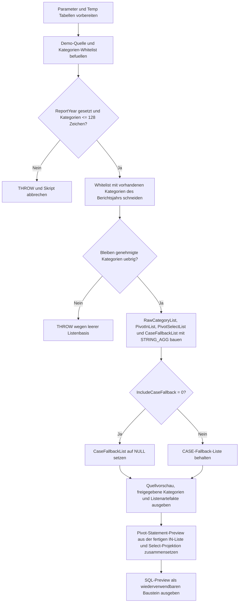

# PivotDynamicListBuilder.sql

Dieses Skript baut mehrere dynamische Listen, die haeufig vor einem `PIVOT` benoetigt werden: eine rohe Kategorienliste, eine sichere `IN (...)`-Liste fuer den Pivot-Operator, eine Ergebnisauswahl mit `COALESCE` sowie optional ein `CASE`-basiertes Fallback-Muster. Der Fokus liegt auf dem Listenbau selbst und nicht auf der Ausfuehrung eines kompletten Dynamic-Pivot-Statements.

## Uebersicht

<!-- SQLDOC:SUMMARY_TABLE:BEGIN -->
| Feld | Wert |
|---|---|
| Script | [PivotDynamicListBuilder.sql](PivotDynamicListBuilder.sql) |
| Version | `1.0` |
| Typ | `didactic-lab` |
| Kapitel | `14_Pivot_Unpivot` |
| Sicherheit | `read-only-tempdb` |
| Zweck | Baut dynamische Listen fuer Pivot-Abfragen und zeigt daraus eine wiederverwendbare SQL-Preview. |
<!-- SQLDOC:SUMMARY_TABLE:END -->

## Annahmen

- Die Erstversion verwendet ausschliesslich temporaere Demo-Tabellen und keine produktiven Reporting-Objekte.
- Nur Kategorien mit aktivem Whitelist-Eintrag und Vorkommen im gewaehlten Berichtsjahr fliessen in die fertigen Listen ein.
- Der problematische Wert `Unsafe]]Alias` bleibt in den Quelldaten sichtbar, wird aber durch die Whitelist bewusst von der Listenbildung ausgeschlossen.

## Anwendungsfall

Das Skript eignet sich fuer folgende Leitfragen:

- Welche Listen werden fuer ein sicheres Dynamic-Pivot typischerweise vorab erzeugt?
- Wie unterscheiden sich rohe Werte, `QUOTENAME`-Spaltennamen und lesbare Ausgabe-Aliase?
- Wann lohnt sich ein `CASE`-basiertes Fallback, wenn `PIVOT` fachlich oder technisch unpassend ist?

## Parameter

<!-- SQLDOC:PARAMETERS_TABLE:BEGIN -->
| Parameter | SQL-Typ | Pflicht | Beschreibung |
|---|---|---|---|
| `@ReportYear` | `int` | nein | Filtert die Demo-Quelle auf ein Berichtsjahr fuer die Listenbildung. |
| `@IncludeCaseFallback` | `bit` | nein | Erzeugt zusaetzlich eine CASE-basierte Fallback-Select-Liste, wenn der Wert `1` ist. |
<!-- SQLDOC:PARAMETERS_TABLE:END -->

## Abhaengigkeiten

<!-- SQLDOC:DEPENDENCIES_LIST:BEGIN -->
- `STRING_AGG`
- `QUOTENAME`
- `THROW`
- temporaere Tabellen in `tempdb`
<!-- SQLDOC:DEPENDENCIES_LIST:END -->

## Hinweise

- `SourcePreview` zeigt die Quellmenge nach Jahresfilter in einer fuer spaetere Pivot-Schritte stabil sortierten Reihenfolge.
- `ApprovedPivotCategories` trennt fachlich erlaubte Kategorien von den unsicheren oder deaktivierten Rohwerten.
- `DynamicListArtifacts` stellt die fertigen Listen gesammelt bereit, damit sie in Templates, Dynamic SQL oder CASE-Mustern weiterverwendet werden koennen.

## Versionshistorie

<!-- SQLDOC:VERSION_HISTORY_TABLE:BEGIN -->
| Version | Datum | User | Beschreibung |
|---|---|---|---|
| `1.0` | `2026-04-18` | `ER` | Erstversion eines didaktischen Builders fuer dynamische Pivot-Listen. |
<!-- SQLDOC:VERSION_HISTORY_TABLE:END -->

## Ablauf

<!-- SQLDOC:MERMAID:BEGIN -->

<!-- SQLDOC:MERMAID:END -->

## SQL-Code

<!-- SQLDOC:SQL_CODE:BEGIN -->
```sql
/*
BEGIN:SQL-HEADER v1
---
sql_header: v1
script_name: "PivotDynamicListBuilder.sql"
script_version: "1.0"
script_type: "didactic-lab"
chapter: "14_Pivot_Unpivot"

purpose: >
  Baut fuer Pivot-Abfragen mehrere dynamische Listen aus einer Demo-Quellmenge:
  eine rohe Kategorienliste, eine sicher quotierte PIVOT-IN-Liste, eine
  Ergebnisprojektion mit COALESCE und ein CASE-basiertes Fallback-Mapping.
  Das Skript zeigt den Listenbau isoliert, bevor ein eigentliches Dynamic-Pivot
  ausgefuehrt wird.

parameters:
  - name: "@ReportYear"
    sql_type: "int"
    direction: "IN"
    required: false
    description: "Filtert die Demo-Quelle auf ein Berichtsjahr fuer die Listenbildung."
  - name: "@IncludeCaseFallback"
    sql_type: "bit"
    direction: "IN"
    required: false
    description: "Erzeugt zusaetzlich eine CASE-basierte Fallback-Select-Liste, wenn der Wert 1 ist."

result_sets:
  - name: "SourcePreview"
    description: "Zeigt die Demo-Quelle nach Berichtsjahr und Kategoriepruefung."
  - name: "ApprovedPivotCategories"
    description: "Listet die erlaubten Pivot-Kategorien mit Anzeige-Reihenfolge und sicherem Spaltennamen."
  - name: "DynamicListArtifacts"
    description: "Zeigt die erzeugten Listen fuer PIVOT, Select-Projektion und optionales CASE-Fallback."
  - name: "PivotStatementPreview"
    description: "Zeigt eine beispielhafte Dynamic-Pivot-Anweisung, die die erzeugten Listen verwendet."

dependencies:
  - "STRING_AGG"
  - "QUOTENAME"
  - "THROW"
  - "temporary tables"

safety:
  level: "read-only-tempdb"
  writes_data: false

documentation:
  markdown_file: "T-SQL/14_Pivot_Unpivot/SQLScripts/PivotDynamicListBuilder.md"
  sync_blocks:
    - "SUMMARY_TABLE"
    - "PARAMETERS_TABLE"
    - "DEPENDENCIES_LIST"
    - "VERSION_HISTORY_TABLE"
    - "SQL_CODE"
  mermaid:
    mode: "ai-agent-from-sql"
    source: "script-body"

main_responsible:
  name: "Erhard Rainer"
  initials: "ER"

version_history:
  - version: "1.0"
    date: "2026-04-18"
    user: "ER"
    description: "Erstversion eines didaktischen Builders fuer dynamische Pivot-Listen."

notes:
  - "Die Erstversion arbeitet ausschliesslich mit temporaeren Demo-Tabellen."
  - "Nur erlaubte Kategorien mit aktivem Whitelist-Eintrag werden in die fertigen Listen uebernommen."
  - "Das Skript erzeugt Listen und eine SQL-Preview, fuehrt aber kein dynamisches PIVOT aus."
---
END:SQL-HEADER v1
*/

SET NOCOUNT ON;

DECLARE @ReportYear INT = 2026;
DECLARE @IncludeCaseFallback BIT = 1;

DROP TABLE IF EXISTS #PivotSalesSource;
DROP TABLE IF EXISTS #PivotCategoryWhitelist;
DROP TABLE IF EXISTS #ApprovedPivotCategories;

CREATE TABLE #PivotSalesSource
(
    ReportYear      INT             NOT NULL,
    SalesRegion     VARCHAR(20)     NOT NULL,
    MeasureName     NVARCHAR(40)    NOT NULL,
    RevenueAmount   DECIMAL(12,2)   NOT NULL
);

CREATE TABLE #PivotCategoryWhitelist
(
    MeasureName     NVARCHAR(40)    NOT NULL PRIMARY KEY,
    DisplayOrder    TINYINT         NOT NULL,
    IsApproved      BIT             NOT NULL
);

INSERT INTO #PivotSalesSource
(
    ReportYear,
    SalesRegion,
    MeasureName,
    RevenueAmount
)
VALUES
    (2025, 'North',   'Online',        15250.00),
    (2025, 'North',   'Store',         13820.00),
    (2025, 'North',   'Partner',        9640.00),
    (2025, 'Central', 'Online',        12840.00),
    (2025, 'Central', 'Store',         11760.00),
    (2025, 'South',   'Store',         10940.00),
    (2025, 'South',   'Support Fee',    820.00),
    (2026, 'North',   'Online',        16320.00),
    (2026, 'North',   'Store',         14610.00),
    (2026, 'North',   'Partner',       10120.00),
    (2026, 'Central', 'Online',        13570.00),
    (2026, 'Central', 'Store',         12290.00),
    (2026, 'Central', 'Support Fee',    910.00),
    (2026, 'South',   'Store',         11540.00),
    (2026, 'South',   'Partner',        8850.00),
    (2026, 'South',   'Unsafe]]Alias',  500.00);

INSERT INTO #PivotCategoryWhitelist
(
    MeasureName,
    DisplayOrder,
    IsApproved
)
VALUES
    ('Online', 1, 1),
    ('Store', 2, 1),
    ('Partner', 3, 1),
    ('Support Fee', 4, 1),
    ('Unsafe]]Alias', 5, 0);

IF @ReportYear IS NULL
BEGIN
    THROW 50041, 'PivotDynamicListBuilder requires a non-null @ReportYear value.', 1;
END;

IF EXISTS
(
    SELECT
        src.MeasureName
    FROM #PivotSalesSource AS src
    WHERE src.ReportYear = @ReportYear
    GROUP BY
        src.MeasureName
    HAVING LEN(src.MeasureName) > 128
)
BEGIN
    THROW 50042, 'PivotDynamicListBuilder detected a pivot category longer than 128 characters.', 1;
END;

SELECT
    wl.MeasureName,
    wl.DisplayOrder,
    QUOTENAME(wl.MeasureName) AS SafeColumnName,
    QUOTENAME(REPLACE(wl.MeasureName, ' ', '_') + '_Amount') AS SafeAliasName
INTO #ApprovedPivotCategories
FROM #PivotCategoryWhitelist AS wl
WHERE wl.IsApproved = 1
  AND EXISTS
(
    SELECT 1
    FROM #PivotSalesSource AS src
    WHERE src.ReportYear = @ReportYear
      AND src.MeasureName = wl.MeasureName
);

IF NOT EXISTS
(
    SELECT 1
    FROM #ApprovedPivotCategories
)
BEGIN
    THROW 50043, 'PivotDynamicListBuilder found no approved categories for the selected year.', 1;
END;

DECLARE @RawCategoryList NVARCHAR(MAX);
DECLARE @PivotInList NVARCHAR(MAX);
DECLARE @PivotSelectList NVARCHAR(MAX);
DECLARE @CaseFallbackList NVARCHAR(MAX);
DECLARE @PivotStatementPreview NVARCHAR(MAX);

SELECT
    @RawCategoryList = STRING_AGG
    (
        N'''' + REPLACE(apc.MeasureName, '''', '''''') + N'''',
        N', '
    ) WITHIN GROUP (ORDER BY apc.DisplayOrder),
    @PivotInList = STRING_AGG(apc.SafeColumnName, N', ')
        WITHIN GROUP (ORDER BY apc.DisplayOrder),
    @PivotSelectList = STRING_AGG
    (
        N'COALESCE(p.' + apc.SafeColumnName + N', 0.00) AS ' + apc.SafeAliasName,
        N', '
    ) WITHIN GROUP (ORDER BY apc.DisplayOrder),
    @CaseFallbackList = STRING_AGG
    (
        N'SUM(CASE WHEN src.MeasureName = N'''
        + REPLACE(apc.MeasureName, '''', '''''')
        + N''' THEN src.RevenueAmount ELSE 0 END) AS '
        + apc.SafeAliasName,
        N', '
    ) WITHIN GROUP (ORDER BY apc.DisplayOrder)
FROM #ApprovedPivotCategories AS apc;

IF @RawCategoryList IS NULL OR @PivotInList IS NULL OR @PivotSelectList IS NULL
BEGIN
    THROW 50044, 'PivotDynamicListBuilder could not build the requested dynamic lists.', 1;
END;

IF @IncludeCaseFallback = 0
BEGIN
    SET @CaseFallbackList = NULL;
END;

SET @PivotStatementPreview = N'
SELECT
    p.ReportYear,
    p.SalesRegion,
    ' + @PivotSelectList + N'
FROM
(
    SELECT
        src.ReportYear,
        src.SalesRegion,
        src.MeasureName,
        src.RevenueAmount
    FROM #PivotSalesSource AS src
    WHERE src.ReportYear = @RuntimeReportYear
) AS filtered_source
PIVOT
(
    SUM(filtered_source.RevenueAmount)
    FOR filtered_source.MeasureName IN (' + @PivotInList + N')
) AS p
ORDER BY
    p.ReportYear,
    p.SalesRegion;';

SELECT
    src.ReportYear,
    src.SalesRegion,
    src.MeasureName,
    src.RevenueAmount
FROM #PivotSalesSource AS src
WHERE src.ReportYear = @ReportYear
ORDER BY
    src.ReportYear,
    src.SalesRegion,
    CASE src.MeasureName
        WHEN 'Online' THEN 1
        WHEN 'Store' THEN 2
        WHEN 'Partner' THEN 3
        WHEN 'Support Fee' THEN 4
        ELSE 99
    END,
    src.MeasureName;

SELECT
    apc.DisplayOrder,
    apc.MeasureName,
    apc.SafeColumnName,
    apc.SafeAliasName
FROM #ApprovedPivotCategories AS apc
ORDER BY
    apc.DisplayOrder;

SELECT
    @ReportYear AS ReportYear,
    @RawCategoryList AS RawCategoryList,
    @PivotInList AS PivotInList,
    @PivotSelectList AS PivotSelectList,
    @CaseFallbackList AS CaseFallbackList;

SELECT
    @PivotStatementPreview AS PivotStatementPreview;
```
<!-- SQLDOC:SQL_CODE:END -->
