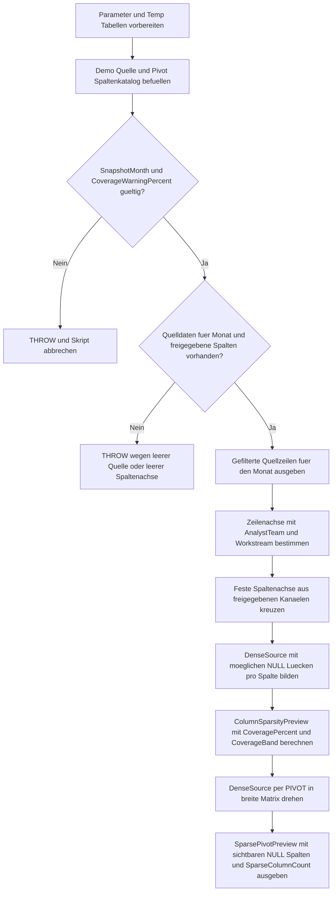

# PivotSparseColumnPreview.sql

Dieses Skript liefert eine didaktische Vorschau auf sparse Spaltenlandschaften in Pivot-Ergebnissen. Es kombiniert eine feste Kanalachse mit einer verdichteten Demo-Quelle, damit sichtbar wird, welche Pivot-Spalten im gewaehlten Monat regelmaessig belegt sind und welche weitgehend `NULL` bleiben.

## Uebersicht

<!-- SQLDOC:SUMMARY_TABLE:BEGIN -->
| Feld | Wert |
|---|---|
| Script | [PivotSparseColumnPreview.sql](PivotSparseColumnPreview.sql) |
| Version | `1.0` |
| Typ | `didactic-lab` |
| Kapitel | `14_Pivot_Unpivot` |
| Sicherheit | `read-only-tempdb` |
| Zweck | Vorschau auf sparse Pivot-Spalten mit Abdeckungsbewertung und finaler Matrix mit sichtbaren `NULL`-Luecken. |
<!-- SQLDOC:SUMMARY_TABLE:END -->

## Annahmen

- Die Erstversion verwendet ausschliesslich temporaere Demo-Tabellen und keine produktiven Contact-Center- oder Vorgangsdaten.
- Die Pivot-Spaltenachse bleibt ueber die freigegebenen Kanaele `Email`, `Phone`, `Chat`, `Portal` und `Partner` bewusst stabil.
- `NULL`-Werte in der finalen Pivot-Matrix werden absichtlich nicht durch `COALESCE` ersetzt, damit sparse Spaltenlandschaften direkt erkennbar bleiben.

## Anwendungsfall

Das Skript eignet sich fuer folgende Leitfragen:

- Wie laesst sich vor einer Pivot-Darstellung pruefen, welche Spalten im Zielmonat nur schwach belegt sein werden?
- Wie kann eine feste Spaltenachse aufgebaut werden, ohne duenn besetzte Pivot-Spalten aus der Matrix zu verlieren?
- Wann sollte eine Pivot-Ausgabe als Vorschau bewusst `NULL`-Werte sichtbar lassen, statt sie zu kaschieren?

## Parameter

<!-- SQLDOC:PARAMETERS_TABLE:BEGIN -->
| Parameter | SQL-Typ | Pflicht | Beschreibung |
|---|---|---|---|
| `@SnapshotMonth` | `tinyint` | nein | Filtert die Demo-Quelle auf einen Berichtsmonat fuer die Pivot-Vorschau. |
| `@CoverageWarningPercent` | `decimal(5,2)` | nein | Markiert Pivot-Spalten als sparse, wenn ihre Belegungsquote unter diesem Grenzwert liegt. |
<!-- SQLDOC:PARAMETERS_TABLE:END -->

## Abhaengigkeiten

<!-- SQLDOC:DEPENDENCIES_LIST:BEGIN -->
- `PIVOT`
- `CTEs`
- temporaere Tabellen in `tempdb`
- `THROW`
- `NULLIF`
<!-- SQLDOC:DEPENDENCIES_LIST:END -->

## Hinweise

- `ColumnSparsityPreview` bewertet jede freigegebene Pivot-Spalte anhand der belegten und unbelegten Zellen innerhalb der Zeilenachse des Monats.
- Die finale Matrix basiert auf einer densifizierten Kombination aus Zeilenachse und Kanalachse; dadurch bleiben auch komplett unbelegte Spalten im Ergebnis sichtbar.
- Der Grenzwert `@CoverageWarningPercent` dient nur der Preview-Klassifikation und veraendert die Pivot-Matrix selbst nicht.

## Versionshistorie

<!-- SQLDOC:VERSION_HISTORY_TABLE:BEGIN -->
| Version | Datum | User | Beschreibung |
|---|---|---|---|
| `1.0` | `2026-04-18` | `ER` | Erstversion einer didaktischen Vorschau auf sparse Pivot-Spalten und ihre Abdeckung. |
<!-- SQLDOC:VERSION_HISTORY_TABLE:END -->

## Ablauf

<!-- SQLDOC:MERMAID:BEGIN -->

<!-- SQLDOC:MERMAID:END -->

## SQL-Code

<!-- SQLDOC:SQL_CODE:BEGIN -->
```sql
/*
BEGIN:SQL-HEADER v1
---
sql_header: v1
script_name: "PivotSparseColumnPreview.sql"
script_version: "1.0"
script_type: "didactic-lab"
chapter: "14_Pivot_Unpivot"

purpose: >
  Preview fuer sparse Spaltenlandschaften in Pivot-Ergebnissen. Das Skript
  baut eine kleine Demo-Quelle fuer Workstream- und Team-Kombinationen auf,
  verdichtet sie gegen eine freigegebene Spaltenachse und zeigt danach sowohl
  die Spaltenabdeckung als auch eine finale Pivot-Matrix mit sichtbar
  gelassenen NULL-Luecken.

parameters:
  - name: "@SnapshotMonth"
    sql_type: "tinyint"
    direction: "IN"
    required: false
    description: "Filtert die Demo-Quelle auf einen Berichtsmonat fuer die Pivot-Vorschau."
  - name: "@CoverageWarningPercent"
    sql_type: "decimal(5,2)"
    direction: "IN"
    required: false
    description: "Markiert Pivot-Spalten als sparse, wenn ihre Belegungsquote unter diesem Grenzwert liegt."

result_sets:
  - name: "FilteredSourcePreview"
    description: "Zeigt die gefilterte Demo-Quelle fuer den gewaehlten Berichtsmonat."
  - name: "ColumnSparsityPreview"
    description: "Bewertet jede freigegebene Pivot-Spalte nach belegten, leeren und prozentualen Anteilen."
  - name: "SparsePivotPreview"
    description: "Gibt die finale Pivot-Matrix mit bewusst sichtbar gelassenen NULL-Spalten aus."

dependencies:
  - "PIVOT"
  - "CTEs"
  - "temporary tables"
  - "THROW"
  - "NULLIF"

safety:
  level: "read-only-tempdb"
  writes_data: false

documentation:
  markdown_file: "T-SQL/14_Pivot_Unpivot/SQLScripts/PivotSparseColumnPreview.md"
  sync_blocks:
    - "SUMMARY_TABLE"
    - "PARAMETERS_TABLE"
    - "DEPENDENCIES_LIST"
    - "VERSION_HISTORY_TABLE"
    - "SQL_CODE"
  mermaid:
    mode: "ai-agent-from-sql"
    source: "script-body"

main_responsible:
  name: "Erhard Rainer"
  initials: "ER"

version_history:
  - version: "1.0"
    date: "2026-04-18"
    user: "ER"
    description: "Erstversion einer didaktischen Vorschau auf sparse Pivot-Spalten und ihre Abdeckung."

notes:
  - "Die Erstversion arbeitet ausschliesslich mit temporaeren Demo-Tabellen."
  - "Eine explizite Kanalachse macht sichtbar, welche Pivot-Spalten im gewaehlten Monat komplett oder teilweise unbelegt bleiben."
  - "Die finale Pivot-Ausgabe laesst NULL-Werte absichtlich stehen, damit sparse Spalten nicht durch COALESCE kaschiert werden."
---
END:SQL-HEADER v1
*/

SET NOCOUNT ON;

DECLARE @SnapshotMonth TINYINT = 4;
DECLARE @CoverageWarningPercent DECIMAL(5,2) = 55.00;

DROP TABLE IF EXISTS #SparseColumnSource;
DROP TABLE IF EXISTS #PivotColumnCatalog;

CREATE TABLE #SparseColumnSource
(
    SnapshotDate        DATE            NOT NULL,
    AnalystTeam         VARCHAR(20)     NOT NULL,
    Workstream          VARCHAR(20)     NOT NULL,
    ChannelName         VARCHAR(20)     NOT NULL,
    OpenTicketCount     INT             NOT NULL
);

CREATE TABLE #PivotColumnCatalog
(
    ChannelName         VARCHAR(20)     NOT NULL PRIMARY KEY,
    DisplayOrder        TINYINT         NOT NULL,
    IsApproved          BIT             NOT NULL
);

INSERT INTO #SparseColumnSource
(
    SnapshotDate,
    AnalystTeam,
    Workstream,
    ChannelName,
    OpenTicketCount
)
VALUES
    ('2026-03-02', 'NorthOps',   'Billing',    'Email',   18),
    ('2026-03-02', 'NorthOps',   'Billing',    'Phone',   11),
    ('2026-03-02', 'CentralOps', 'Returns',    'Portal',   7),
    ('2026-03-02', 'CentralOps', 'Returns',    'Chat',     4),
    ('2026-03-02', 'WestOps',    'Wholesale',  'Email',   13),
    ('2026-03-02', 'WestOps',    'Wholesale',  'Partner',  3),
    ('2026-04-06', 'NorthOps',   'Billing',    'Email',   21),
    ('2026-04-06', 'NorthOps',   'Billing',    'Phone',   15),
    ('2026-04-06', 'NorthOps',   'Billing',    'Chat',     6),
    ('2026-04-06', 'CentralOps', 'Returns',    'Portal',   9),
    ('2026-04-06', 'CentralOps', 'Returns',    'Email',    5),
    ('2026-04-06', 'SouthOps',   'Onboarding', 'Email',   14),
    ('2026-04-06', 'SouthOps',   'Onboarding', 'Portal',   8),
    ('2026-04-06', 'WestOps',    'Wholesale',  'Email',   16),
    ('2026-04-06', 'WestOps',    'Wholesale',  'Partner',  4),
    ('2026-04-06', 'WestOps',    'Wholesale',  'Phone',    3),
    ('2026-05-04', 'NorthOps',   'Billing',    'Email',   19),
    ('2026-05-04', 'CentralOps', 'Returns',    'Portal',  10),
    ('2026-05-04', 'SouthOps',   'Onboarding', 'Chat',     5);

INSERT INTO #PivotColumnCatalog
(
    ChannelName,
    DisplayOrder,
    IsApproved
)
VALUES
    ('Email',   1, 1),
    ('Phone',   2, 1),
    ('Chat',    3, 1),
    ('Portal',  4, 1),
    ('Partner', 5, 1);

IF @SnapshotMonth NOT BETWEEN 1 AND 12
BEGIN
    THROW 50101, 'PivotSparseColumnPreview expects @SnapshotMonth between 1 and 12.', 1;
END;

IF @CoverageWarningPercent <= 0.00 OR @CoverageWarningPercent > 100.00
BEGIN
    THROW 50102, 'PivotSparseColumnPreview expects @CoverageWarningPercent between 0 and 100.', 1;
END;

IF NOT EXISTS
(
    SELECT 1
    FROM #SparseColumnSource AS src
    WHERE MONTH(src.SnapshotDate) = @SnapshotMonth
)
BEGIN
    THROW 50103, 'PivotSparseColumnPreview found no source rows for the selected @SnapshotMonth.', 1;
END;

IF NOT EXISTS
(
    SELECT 1
    FROM #PivotColumnCatalog AS col
    WHERE col.IsApproved = 1
)
BEGIN
    THROW 50104, 'PivotSparseColumnPreview found no approved pivot columns.', 1;
END;

SELECT
    src.SnapshotDate,
    src.AnalystTeam,
    src.Workstream,
    src.ChannelName,
    src.OpenTicketCount
FROM #SparseColumnSource AS src
WHERE MONTH(src.SnapshotDate) = @SnapshotMonth
ORDER BY
    src.AnalystTeam,
    src.Workstream,
    CASE src.ChannelName
        WHEN 'Email' THEN 1
        WHEN 'Phone' THEN 2
        WHEN 'Chat' THEN 3
        WHEN 'Portal' THEN 4
        WHEN 'Partner' THEN 5
        ELSE 99
    END;

;WITH FilteredSource AS
(
    SELECT
        src.AnalystTeam,
        src.Workstream,
        src.ChannelName,
        src.OpenTicketCount
    FROM #SparseColumnSource AS src
    WHERE MONTH(src.SnapshotDate) = @SnapshotMonth
),
RowAxis AS
(
    SELECT DISTINCT
        fs.AnalystTeam,
        fs.Workstream
    FROM FilteredSource AS fs
),
ApprovedColumns AS
(
    SELECT
        col.ChannelName,
        col.DisplayOrder
    FROM #PivotColumnCatalog AS col
    WHERE col.IsApproved = 1
),
DenseSource AS
(
    SELECT
        ra.AnalystTeam,
        ra.Workstream,
        ac.ChannelName,
        SUM(fs.OpenTicketCount) AS OpenTicketCount
    FROM RowAxis AS ra
    CROSS JOIN ApprovedColumns AS ac
    LEFT JOIN FilteredSource AS fs
        ON fs.AnalystTeam = ra.AnalystTeam
       AND fs.Workstream = ra.Workstream
       AND fs.ChannelName = ac.ChannelName
    GROUP BY
        ra.AnalystTeam,
        ra.Workstream,
        ac.ChannelName
)
SELECT
    ac.DisplayOrder,
    ds.ChannelName,
    COUNT(*) AS RowCountInPivotAxis,
    SUM(CASE WHEN ds.OpenTicketCount IS NULL THEN 1 ELSE 0 END) AS NullColumnCells,
    SUM(CASE WHEN ds.OpenTicketCount IS NOT NULL THEN 1 ELSE 0 END) AS PopulatedColumnCells,
    CAST(100.0 * SUM(CASE WHEN ds.OpenTicketCount IS NOT NULL THEN 1 ELSE 0 END) / NULLIF(COUNT(*), 0) AS DECIMAL(5,2)) AS CoveragePercent,
    CASE
        WHEN CAST(100.0 * SUM(CASE WHEN ds.OpenTicketCount IS NOT NULL THEN 1 ELSE 0 END) / NULLIF(COUNT(*), 0) AS DECIMAL(5,2)) < @CoverageWarningPercent
            THEN 'sparse-warning'
        ELSE 'well-covered'
    END AS CoverageBand
FROM DenseSource AS ds
INNER JOIN ApprovedColumns AS ac
    ON ac.ChannelName = ds.ChannelName
GROUP BY
    ac.DisplayOrder,
    ds.ChannelName
ORDER BY
    ac.DisplayOrder;

;WITH FilteredSource AS
(
    SELECT
        src.AnalystTeam,
        src.Workstream,
        src.ChannelName,
        src.OpenTicketCount
    FROM #SparseColumnSource AS src
    WHERE MONTH(src.SnapshotDate) = @SnapshotMonth
),
RowAxis AS
(
    SELECT DISTINCT
        fs.AnalystTeam,
        fs.Workstream
    FROM FilteredSource AS fs
),
ApprovedColumns AS
(
    SELECT
        col.ChannelName
    FROM #PivotColumnCatalog AS col
    WHERE col.IsApproved = 1
),
DenseSource AS
(
    SELECT
        ra.AnalystTeam,
        ra.Workstream,
        ac.ChannelName,
        SUM(fs.OpenTicketCount) AS OpenTicketCount
    FROM RowAxis AS ra
    CROSS JOIN ApprovedColumns AS ac
    LEFT JOIN FilteredSource AS fs
        ON fs.AnalystTeam = ra.AnalystTeam
       AND fs.Workstream = ra.Workstream
       AND fs.ChannelName = ac.ChannelName
    GROUP BY
        ra.AnalystTeam,
        ra.Workstream,
        ac.ChannelName
)
SELECT
    p.AnalystTeam,
    p.Workstream,
    p.[Email] AS Email,
    p.[Phone] AS Phone,
    p.[Chat] AS Chat,
    p.[Portal] AS Portal,
    p.[Partner] AS Partner,
    SUM(CASE WHEN ds.OpenTicketCount IS NULL THEN 1 ELSE 0 END) AS SparseColumnCount
FROM
(
    SELECT
        ds.AnalystTeam,
        ds.Workstream,
        ds.ChannelName,
        ds.OpenTicketCount
    FROM DenseSource AS ds
) AS src
PIVOT
(
    SUM(src.OpenTicketCount)
    FOR src.ChannelName IN ([Email], [Phone], [Chat], [Portal], [Partner])
) AS p
INNER JOIN DenseSource AS ds
    ON ds.AnalystTeam = p.AnalystTeam
   AND ds.Workstream = p.Workstream
GROUP BY
    p.AnalystTeam,
    p.Workstream,
    p.[Email],
    p.[Phone],
    p.[Chat],
    p.[Portal],
    p.[Partner]
ORDER BY
    p.AnalystTeam,
    p.Workstream;
```
<!-- SQLDOC:SQL_CODE:END -->
