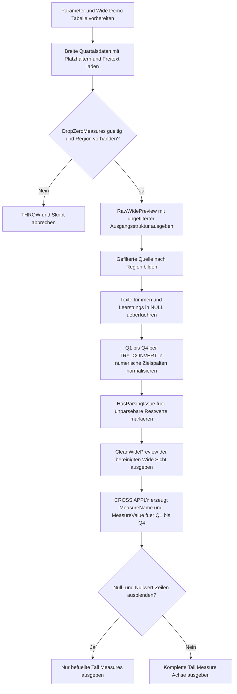

# PivotWideToTallCleanup.sql

Dieses Skript bereinigt eine breite Demo-Tabelle, bevor deren Quartalsmetriken in ein Tall-Format ueberfuehrt werden. Es macht typische Vorarbeiten fuer `UNPIVOT`-nahe Szenarien sichtbar: Leerwerte neutralisieren, Platzhalter entfernen, numerische Zielspalten vorbereiten und Parsing-Probleme markiert in die zeilenorientierte Ausgabe weiterreichen.

## Uebersicht

<!-- SQLDOC:SUMMARY_TABLE:BEGIN -->
| Feld | Wert |
|---|---|
| Script | [PivotWideToTallCleanup.sql](PivotWideToTallCleanup.sql) |
| Version | `1.0` |
| Typ | `didactic-lab` |
| Kapitel | `14_Pivot_Unpivot` |
| Sicherheit | `read-only-tempdb` |
| Zweck | Bereinigt breite Demo-Daten vor dem Entpivotisieren und gibt danach eine Tall-Sicht aus. |
<!-- SQLDOC:SUMMARY_TABLE:END -->

## Annahmen

- Die Erstversion arbeitet ausschliesslich mit temporaeren Demo-Daten und modelliert keine produktive Vertriebs- oder Forecast-Tabelle.
- Platzhalter wie `n/a`, `N/A`, `Pending` und leere Strings werden vor der Tall-Ausgabe bewusst in `NULL` ueberfuehrt.
- Unparsebare Restwerte wie `error` bleiben nicht im Zahlenfeld stehen, sondern werden ueber `HasParsingIssue` als Bereinigungsbedarf gekennzeichnet.

## Anwendungsfall

Das Skript eignet sich fuer folgende Leitfragen:

- Welche Bereinigungsschritte sollten vor einem Entpivotisieren breiter Quartalsspalten in eine Measure-Achse erfolgen?
- Wie lassen sich Text-Platzhalter in Wide-Quellen neutralisieren, ohne problematische Datensaetze stillschweigend zu verlieren?
- Wann ist es sinnvoll, Null- und Nullwert-Zeilen vor dem Tall-Output optional auszublenden?

## Parameter

<!-- SQLDOC:PARAMETERS_TABLE:BEGIN -->
| Parameter | SQL-Typ | Pflicht | Beschreibung |
|---|---|---|---|
| `@TargetRegion` | `varchar(20)` | nein | Optionaler Filter fuer eine Region innerhalb der Demo-Daten. |
| `@DropZeroMeasures` | `bit` | nein | Unterdrueckt Null- und Nullwert-Zeilen im Tall-Resultset, wenn der Wert `1` ist. |
<!-- SQLDOC:PARAMETERS_TABLE:END -->

## Abhaengigkeiten

<!-- SQLDOC:DEPENDENCIES_LIST:BEGIN -->
- temporaere Tabellen in `tempdb`
- `CTEs`
- `CROSS APPLY`
- `TRY_CONVERT`
- `NULLIF`
- `THROW`
<!-- SQLDOC:DEPENDENCIES_LIST:END -->

## Hinweise

- `RawWidePreview` zeigt die Wide-Quelle unveraendert, damit typische Problemstellen wie Leerstring, `n/a`, `Pending` oder freie Textfehler sichtbar bleiben.
- `CleanWidePreview` fuehrt die eigentliche Vorbereinigung durch und bildet daraus numerische Quartalsfelder plus das Flag `HasParsingIssue`.
- `TallMeasureOutput` erzeugt das zeilenorientierte Format ueber `CROSS APPLY`, nachdem die numerischen Zielspalten bereits bereinigt wurden.

## Versionshistorie

<!-- SQLDOC:VERSION_HISTORY_TABLE:BEGIN -->
| Version | Datum | User | Beschreibung |
|---|---|---|---|
| `1.0` | `2026-04-18` | `ER` | Erstversion fuer die Bereinigung breiter Demo-Daten vor dem Entpivotisieren. |
<!-- SQLDOC:VERSION_HISTORY_TABLE:END -->

## Ablauf

<!-- SQLDOC:MERMAID:BEGIN -->

<!-- SQLDOC:MERMAID:END -->

## SQL-Code

<!-- SQLDOC:SQL_CODE:BEGIN -->
```sql
/*
BEGIN:SQL-HEADER v1
---
sql_header: v1
script_name: "PivotWideToTallCleanup.sql"
script_version: "1.0"
script_type: "didactic-lab"
chapter: "14_Pivot_Unpivot"

purpose: >
  Bereitet eine breite Demo-Tabelle fuer ein spaeteres Entpivotisieren vor.
  Das Skript vereinheitlicht Platzhalterwerte, trimmt Text, normalisiert
  Quartalsmetriken in numerische Zielspalten und gibt danach sowohl die
  bereinigte Wide-Sicht als auch ein Tall-Resultset fuer die Weiterverarbeitung
  aus.

parameters:
  - name: "@TargetRegion"
    sql_type: "varchar(20)"
    direction: "IN"
    required: false
    description: "Optionaler Filter fuer eine Region innerhalb der Demo-Daten."
  - name: "@DropZeroMeasures"
    sql_type: "bit"
    direction: "IN"
    required: false
    description: "Unterdrueckt Null- und Nullwert-Zeilen im Tall-Resultset, wenn der Wert 1 ist."

result_sets:
  - name: "RawWidePreview"
    description: "Zeigt die unbehandelten Demo-Zeilen mit typischen Bereinigungsfaellen."
  - name: "CleanWidePreview"
    description: "Zeigt die bereinigte Wide-Sicht mit normalisierten Quartalswerten."
  - name: "TallMeasureOutput"
    description: "Gibt die bereinigten Quartalsmetriken als zeilenorientiertes Tall-Format aus."

dependencies:
  - "temporary tables"
  - "CTEs"
  - "CROSS APPLY"
  - "TRY_CONVERT"
  - "NULLIF"
  - "THROW"

safety:
  level: "read-only-tempdb"
  writes_data: false

documentation:
  markdown_file: "T-SQL/14_Pivot_Unpivot/SQLScripts/PivotWideToTallCleanup.md"
  sync_blocks:
    - "SUMMARY_TABLE"
    - "PARAMETERS_TABLE"
    - "DEPENDENCIES_LIST"
    - "VERSION_HISTORY_TABLE"
    - "SQL_CODE"
  mermaid:
    mode: "ai-agent-from-sql"
    source: "script-body"

main_responsible:
  name: "Erhard Rainer"
  initials: "ER"

version_history:
  - version: "1.0"
    date: "2026-04-18"
    user: "ER"
    description: "Erstversion fuer die Bereinigung breiter Demo-Daten vor dem Entpivotisieren."

notes:
  - "Die Erstversion arbeitet ausschliesslich mit temporaeren Demo-Tabellen."
  - "Platzhalter wie n/a, Pending oder Leerstring werden vor dem Tall-Output neutralisiert."
  - "Die Tall-Ausgabe basiert auf bereits bereinigten Quartalswerten und nicht auf den Rohspalten."
---
END:SQL-HEADER v1
*/

SET NOCOUNT ON;

DECLARE @TargetRegion VARCHAR(20) = NULL;
DECLARE @DropZeroMeasures BIT = 1;

DROP TABLE IF EXISTS #WidePivotSource;

CREATE TABLE #WidePivotSource
(
    SnapshotMonth       DATE            NOT NULL,
    RegionName          VARCHAR(20)     NOT NULL,
    ProductLine         VARCHAR(20)     NOT NULL,
    OwnerName           VARCHAR(40)     NOT NULL,
    Q1AmountText        VARCHAR(20)     NULL,
    Q2AmountText        VARCHAR(20)     NULL,
    Q3AmountText        VARCHAR(20)     NULL,
    Q4AmountText        VARCHAR(20)     NULL,
    CommentaryText      VARCHAR(40)     NULL
);

INSERT INTO #WidePivotSource
(
    SnapshotMonth,
    RegionName,
    ProductLine,
    OwnerName,
    Q1AmountText,
    Q2AmountText,
    Q3AmountText,
    Q4AmountText,
    CommentaryText
)
VALUES
    ('2026-01-01', 'North',   'Hardware', 'Ava King',    '120',   ' 130 ', 'n/a',   '150',    'Stable pipeline'),
    ('2026-01-01', 'North',   'Services', 'Ava King',    '0',     '',      '85',    ' 90',    'Backlog cleared'),
    ('2026-01-01', 'West',    'Hardware', 'Liam Shah',   '210',   '205',   'Pending','198',   'Awaiting Q3 signoff'),
    ('2026-01-01', 'West',    'Services', 'Liam Shah',   '75',    ' 80',   '82',    'N/A',    'Portfolio review'),
    ('2026-01-01', 'Central', 'Training', 'Mila Weber',  '45',    '47',    '49',    '51',     'Pilot cohort'),
    ('2026-01-01', 'Central', 'Support',  'Mila Weber',  NULL,    '18',    ' 18 ',  '18',     '   '),
    ('2026-01-01', 'South',   'Hardware', 'Noah Brandt', '160',   'error', '175',   '180',    'Manual correction needed');

IF @DropZeroMeasures NOT IN (0, 1)
BEGIN
    THROW 50201, 'PivotWideToTallCleanup expects @DropZeroMeasures to be 0 or 1.', 1;
END;

IF @TargetRegion IS NOT NULL
   AND NOT EXISTS
(
    SELECT 1
    FROM #WidePivotSource AS src
    WHERE src.RegionName = @TargetRegion
)
BEGIN
    THROW 50202, 'PivotWideToTallCleanup found no rows for the selected @TargetRegion.', 1;
END;

SELECT
    src.SnapshotMonth,
    src.RegionName,
    src.ProductLine,
    src.OwnerName,
    src.Q1AmountText,
    src.Q2AmountText,
    src.Q3AmountText,
    src.Q4AmountText,
    src.CommentaryText
FROM #WidePivotSource AS src
WHERE @TargetRegion IS NULL OR src.RegionName = @TargetRegion
ORDER BY
    src.RegionName,
    src.ProductLine;

;WITH FilteredSource AS
(
    SELECT
        src.SnapshotMonth,
        src.RegionName,
        src.ProductLine,
        src.OwnerName,
        src.Q1AmountText,
        src.Q2AmountText,
        src.Q3AmountText,
        src.Q4AmountText,
        src.CommentaryText
    FROM #WidePivotSource AS src
    WHERE @TargetRegion IS NULL OR src.RegionName = @TargetRegion
),
TrimmedSource AS
(
    SELECT
        fs.SnapshotMonth,
        fs.RegionName,
        fs.ProductLine,
        LTRIM(RTRIM(fs.OwnerName)) AS OwnerName,
        NULLIF(LTRIM(RTRIM(fs.Q1AmountText)), '') AS Q1Trimmed,
        NULLIF(LTRIM(RTRIM(fs.Q2AmountText)), '') AS Q2Trimmed,
        NULLIF(LTRIM(RTRIM(fs.Q3AmountText)), '') AS Q3Trimmed,
        NULLIF(LTRIM(RTRIM(fs.Q4AmountText)), '') AS Q4Trimmed,
        NULLIF(LTRIM(RTRIM(fs.CommentaryText)), '') AS CommentaryText
    FROM FilteredSource AS fs
),
CleanWideData AS
(
    SELECT
        ts.SnapshotMonth,
        ts.RegionName,
        ts.ProductLine,
        ts.OwnerName,
        TRY_CONVERT(DECIMAL(12,2), NULLIF(NULLIF(LOWER(ts.Q1Trimmed), 'n/a'), 'pending')) AS Q1Amount,
        TRY_CONVERT(DECIMAL(12,2), NULLIF(NULLIF(LOWER(ts.Q2Trimmed), 'n/a'), 'pending')) AS Q2Amount,
        TRY_CONVERT(DECIMAL(12,2), NULLIF(NULLIF(LOWER(ts.Q3Trimmed), 'n/a'), 'pending')) AS Q3Amount,
        TRY_CONVERT(DECIMAL(12,2), NULLIF(NULLIF(LOWER(ts.Q4Trimmed), 'n/a'), 'pending')) AS Q4Amount,
        ts.CommentaryText,
        CASE
            WHEN ts.Q1Trimmed IS NOT NULL AND TRY_CONVERT(DECIMAL(12,2), NULLIF(NULLIF(LOWER(ts.Q1Trimmed), 'n/a'), 'pending')) IS NULL THEN 1
            WHEN ts.Q2Trimmed IS NOT NULL AND TRY_CONVERT(DECIMAL(12,2), NULLIF(NULLIF(LOWER(ts.Q2Trimmed), 'n/a'), 'pending')) IS NULL THEN 1
            WHEN ts.Q3Trimmed IS NOT NULL AND TRY_CONVERT(DECIMAL(12,2), NULLIF(NULLIF(LOWER(ts.Q3Trimmed), 'n/a'), 'pending')) IS NULL THEN 1
            WHEN ts.Q4Trimmed IS NOT NULL AND TRY_CONVERT(DECIMAL(12,2), NULLIF(NULLIF(LOWER(ts.Q4Trimmed), 'n/a'), 'pending')) IS NULL THEN 1
            ELSE 0
        END AS HasParsingIssue
    FROM TrimmedSource AS ts
)
SELECT
    cwd.SnapshotMonth,
    cwd.RegionName,
    cwd.ProductLine,
    cwd.OwnerName,
    cwd.Q1Amount,
    cwd.Q2Amount,
    cwd.Q3Amount,
    cwd.Q4Amount,
    cwd.CommentaryText,
    cwd.HasParsingIssue
FROM CleanWideData AS cwd
ORDER BY
    cwd.RegionName,
    cwd.ProductLine;

;WITH FilteredSource AS
(
    SELECT
        src.SnapshotMonth,
        src.RegionName,
        src.ProductLine,
        src.OwnerName,
        src.Q1AmountText,
        src.Q2AmountText,
        src.Q3AmountText,
        src.Q4AmountText,
        src.CommentaryText
    FROM #WidePivotSource AS src
    WHERE @TargetRegion IS NULL OR src.RegionName = @TargetRegion
),
TrimmedSource AS
(
    SELECT
        fs.SnapshotMonth,
        fs.RegionName,
        fs.ProductLine,
        LTRIM(RTRIM(fs.OwnerName)) AS OwnerName,
        NULLIF(LTRIM(RTRIM(fs.Q1AmountText)), '') AS Q1Trimmed,
        NULLIF(LTRIM(RTRIM(fs.Q2AmountText)), '') AS Q2Trimmed,
        NULLIF(LTRIM(RTRIM(fs.Q3AmountText)), '') AS Q3Trimmed,
        NULLIF(LTRIM(RTRIM(fs.Q4AmountText)), '') AS Q4Trimmed,
        NULLIF(LTRIM(RTRIM(fs.CommentaryText)), '') AS CommentaryText
    FROM FilteredSource AS fs
    WHERE @TargetRegion IS NULL OR fs.RegionName = @TargetRegion
),
CleanWideData AS
(
    SELECT
        ts.SnapshotMonth,
        ts.RegionName,
        ts.ProductLine,
        ts.OwnerName,
        TRY_CONVERT(DECIMAL(12,2), NULLIF(NULLIF(LOWER(ts.Q1Trimmed), 'n/a'), 'pending')) AS Q1Amount,
        TRY_CONVERT(DECIMAL(12,2), NULLIF(NULLIF(LOWER(ts.Q2Trimmed), 'n/a'), 'pending')) AS Q2Amount,
        TRY_CONVERT(DECIMAL(12,2), NULLIF(NULLIF(LOWER(ts.Q3Trimmed), 'n/a'), 'pending')) AS Q3Amount,
        TRY_CONVERT(DECIMAL(12,2), NULLIF(NULLIF(LOWER(ts.Q4Trimmed), 'n/a'), 'pending')) AS Q4Amount,
        ts.CommentaryText,
        CASE
            WHEN ts.Q1Trimmed IS NOT NULL AND TRY_CONVERT(DECIMAL(12,2), NULLIF(NULLIF(LOWER(ts.Q1Trimmed), 'n/a'), 'pending')) IS NULL THEN 1
            WHEN ts.Q2Trimmed IS NOT NULL AND TRY_CONVERT(DECIMAL(12,2), NULLIF(NULLIF(LOWER(ts.Q2Trimmed), 'n/a'), 'pending')) IS NULL THEN 1
            WHEN ts.Q3Trimmed IS NOT NULL AND TRY_CONVERT(DECIMAL(12,2), NULLIF(NULLIF(LOWER(ts.Q3Trimmed), 'n/a'), 'pending')) IS NULL THEN 1
            WHEN ts.Q4Trimmed IS NOT NULL AND TRY_CONVERT(DECIMAL(12,2), NULLIF(NULLIF(LOWER(ts.Q4Trimmed), 'n/a'), 'pending')) IS NULL THEN 1
            ELSE 0
        END AS HasParsingIssue
    FROM TrimmedSource AS ts
),
TallMeasures AS
(
    SELECT
        cwd.SnapshotMonth,
        cwd.RegionName,
        cwd.ProductLine,
        cwd.OwnerName,
        measure.MeasureName,
        measure.MeasureValue,
        cwd.CommentaryText,
        cwd.HasParsingIssue
    FROM CleanWideData AS cwd
    CROSS APPLY
    (
        VALUES
            ('Q1Amount', cwd.Q1Amount),
            ('Q2Amount', cwd.Q2Amount),
            ('Q3Amount', cwd.Q3Amount),
            ('Q4Amount', cwd.Q4Amount)
    ) AS measure(MeasureName, MeasureValue)
)
SELECT
    tm.SnapshotMonth,
    tm.RegionName,
    tm.ProductLine,
    tm.OwnerName,
    tm.MeasureName,
    tm.MeasureValue,
    tm.CommentaryText,
    tm.HasParsingIssue
FROM TallMeasures AS tm
WHERE (@DropZeroMeasures = 0)
   OR (tm.MeasureValue IS NOT NULL AND tm.MeasureValue <> 0)
ORDER BY
    tm.RegionName,
    tm.ProductLine,
    CASE tm.MeasureName
        WHEN 'Q1Amount' THEN 1
        WHEN 'Q2Amount' THEN 2
        WHEN 'Q3Amount' THEN 3
        WHEN 'Q4Amount' THEN 4
        ELSE 99
    END;
```
<!-- SQLDOC:SQL_CODE:END -->
