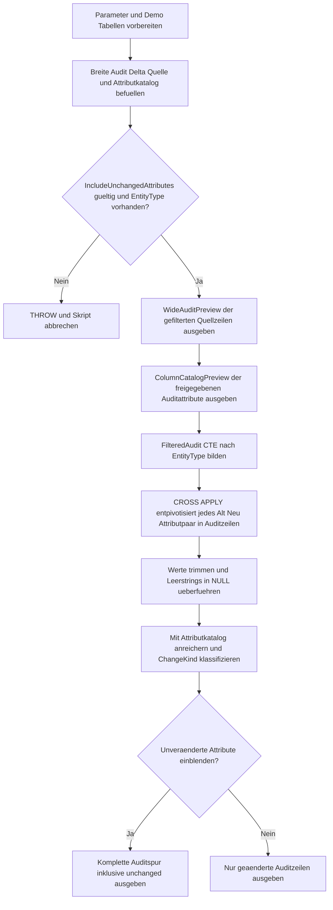

# UnpivotAuditTrailPattern.sql

Dieses Skript zeigt ein didaktisches Audit-Trail-Muster fuer breite Vorher-/Nachher-Tabellen. Die Demo-Quelle bleibt breit lesbar, wird aber fuer die eigentliche Analyse ueber `CROSS APPLY` in eine zeilenorientierte Aenderungsspur mit Attributname, Altwert, Neuwert und Aenderungsart ueberfuehrt.

## Uebersicht

<!-- SQLDOC:SUMMARY_TABLE:BEGIN -->
| Feld | Wert |
|---|---|
| Script | [UnpivotAuditTrailPattern.sql](UnpivotAuditTrailPattern.sql) |
| Version | `1.0` |
| Typ | `didactic-lab` |
| Kapitel | `14_Pivot_Unpivot` |
| Sicherheit | `read-only-tempdb` |
| Zweck | Wandelt breite Audit- oder Delta-Tabellen in ein zeilenorientiertes Aenderungsformat um. |
<!-- SQLDOC:SUMMARY_TABLE:END -->

## Annahmen

- Die Erstversion modelliert ein didaktisches Audit-Szenario ausschliesslich mit temporaeren Demo-Tabellen.
- Die breite Quelle enthaelt Vorher- und Nachher-Werte als feste Attributpaare; neue produktive Auditspalten werden hier nicht dynamisch aus Systemkatalogen gelesen.
- `NULL`, Leerstring, Zahlen, Datumswerte und Bit-Flags werden fuer die Auditspur bewusst auf ein gemeinsames `NVARCHAR`-Format vereinheitlicht.

## Anwendungsfall

Das Skript eignet sich fuer folgende Leitfragen:

- Wie laesst sich ein breites Delta-Layout mit `StatusOld`, `StatusNew`, `OwnerOld`, `OwnerNew` und aehnlichen Paaren in eine analysetaugliche Auditspur ueberfuehren?
- Wo ist `CROSS APPLY (VALUES ...)` einfacher und lesbarer als ein klassisches `UNPIVOT`, wenn Alt- und Neuwert zusammen ausgegeben werden sollen?
- Wie koennen unveraenderte Attribute optional sichtbar bleiben, ohne das Standardresultat mit No-Change-Zeilen zu ueberladen?

## Parameter

<!-- SQLDOC:PARAMETERS_TABLE:BEGIN -->
| Parameter | SQL-Typ | Pflicht | Beschreibung |
|---|---|---|---|
| `@TargetEntityType` | `varchar(30)` | nein | Optionaler Filter fuer einen Entity-Typ innerhalb der Demo-Auditdaten. |
| `@IncludeUnchangedAttributes` | `bit` | nein | Zeigt auch unveraenderte Attribute, wenn der Wert `1` ist. |
<!-- SQLDOC:PARAMETERS_TABLE:END -->

## Abhaengigkeiten

<!-- SQLDOC:DEPENDENCIES_LIST:BEGIN -->
- temporaere Tabellen in `tempdb`
- `CROSS APPLY`
- `CTEs`
- `THROW`
<!-- SQLDOC:DEPENDENCIES_LIST:END -->

## Hinweise

- `WideAuditPreview` zeigt die breite Auditquelle unveraendert und macht Vorher-/Nachher-Spaltenpaare direkt sichtbar.
- `ColumnCatalogPreview` dokumentiert die fachliche Reihenfolge und den Datentyp-Kontext der freigegebenen Auditattribute.
- `AuditTrailResult` reduziert standardmaessig auf geaenderte Attribute und kann ueber `@IncludeUnchangedAttributes = 1` auch No-Change-Zeilen einblenden.

## Versionshistorie

<!-- SQLDOC:VERSION_HISTORY_TABLE:BEGIN -->
| Version | Datum | User | Beschreibung |
|---|---|---|---|
| `1.0` | `2026-04-18` | `ER` | Erstversion fuer ein Audit-Trail-Muster mit breiten Vorher- und Nachher-Spalten. |
<!-- SQLDOC:VERSION_HISTORY_TABLE:END -->

## Ablauf

<!-- SQLDOC:MERMAID:BEGIN -->

<!-- SQLDOC:MERMAID:END -->

## SQL-Code

<!-- SQLDOC:SQL_CODE:BEGIN -->
```sql
/*
BEGIN:SQL-HEADER v1
---
sql_header: v1
script_name: "UnpivotAuditTrailPattern.sql"
script_version: "1.0"
script_type: "didactic-lab"
chapter: "14_Pivot_Unpivot"

purpose: >
  Wandelt eine breite Demo-Auditquelle mit Vorher- und Nachher-Werten in
  ein zeilenorientiertes Aenderungsformat um. Das Skript zeigt, wie sich
  fachliche Attributpaare ueber CROSS APPLY, eine Spalten-Metadatenliste
  und berechnete Flags in ein gut lesbares Audit-Trail-Resultset
  ueberfuehren lassen.

parameters:
  - name: "@TargetEntityType"
    sql_type: "varchar(30)"
    direction: "IN"
    required: false
    description: "Optionaler Filter fuer einen Entity-Typ innerhalb der Demo-Auditdaten."
  - name: "@IncludeUnchangedAttributes"
    sql_type: "bit"
    direction: "IN"
    required: false
    description: "Zeigt auch unveraenderte Attribute, wenn der Wert 1 ist."

result_sets:
  - name: "WideAuditPreview"
    description: "Zeigt die breite Demo-Auditquelle mit Vorher- und Nachher-Spalten."
  - name: "ColumnCatalogPreview"
    description: "Listet die fuer das Audit freigegebenen Attributpaare in fachlicher Reihenfolge."
  - name: "AuditTrailResult"
    description: "Gibt das zeilenorientierte Aenderungsformat mit alten und neuen Werten aus."

dependencies:
  - "temporary tables"
  - "CROSS APPLY"
  - "CTEs"
  - "THROW"

safety:
  level: "read-only-tempdb"
  writes_data: false

documentation:
  markdown_file: "T-SQL/14_Pivot_Unpivot/SQLScripts/UnpivotAuditTrailPattern.md"
  sync_blocks:
    - "SUMMARY_TABLE"
    - "PARAMETERS_TABLE"
    - "DEPENDENCIES_LIST"
    - "VERSION_HISTORY_TABLE"
    - "SQL_CODE"
  mermaid:
    mode: "ai-agent-from-sql"
    source: "script-body"

main_responsible:
  name: "Erhard Rainer"
  initials: "ER"

version_history:
  - version: "1.0"
    date: "2026-04-18"
    user: "ER"
    description: "Erstversion fuer ein Audit-Trail-Muster mit breiten Vorher- und Nachher-Spalten."

notes:
  - "Die Erstversion arbeitet ausschliesslich mit temporaeren Demo-Tabellen."
  - "Das Auditformat zeigt sowohl geaenderte als auch optional unveraenderte Attribute."
  - "NULL, Leerstring und Textwerte werden als NVARCHAR-Auditspur vereinheitlicht."
---
END:SQL-HEADER v1
*/

SET NOCOUNT ON;

DECLARE @TargetEntityType VARCHAR(30) = NULL;
DECLARE @IncludeUnchangedAttributes BIT = 0;

DROP TABLE IF EXISTS #WideAuditDelta;
DROP TABLE IF EXISTS #AuditColumnCatalog;

CREATE TABLE #WideAuditDelta
(
    AuditEventId         INT             NOT NULL PRIMARY KEY,
    ChangedAt            DATETIME2(0)    NOT NULL,
    ChangedBy            VARCHAR(40)     NOT NULL,
    EntityType           VARCHAR(30)     NOT NULL,
    EntityId             INT             NOT NULL,
    StatusOld            VARCHAR(20)     NULL,
    StatusNew            VARCHAR(20)     NULL,
    OwnerOld             VARCHAR(40)     NULL,
    OwnerNew             VARCHAR(40)     NULL,
    PriorityOld          TINYINT         NULL,
    PriorityNew          TINYINT         NULL,
    DueDateOld           DATE            NULL,
    DueDateNew           DATE            NULL,
    EscalationFlagOld    BIT             NULL,
    EscalationFlagNew    BIT             NULL
);

CREATE TABLE #AuditColumnCatalog
(
    AttributeName        VARCHAR(40)     NOT NULL PRIMARY KEY,
    DisplayLabel         VARCHAR(50)     NOT NULL,
    DisplayOrder         TINYINT         NOT NULL,
    ValueDomain          VARCHAR(20)     NOT NULL
);

INSERT INTO #WideAuditDelta
(
    AuditEventId,
    ChangedAt,
    ChangedBy,
    EntityType,
    EntityId,
    StatusOld,
    StatusNew,
    OwnerOld,
    OwnerNew,
    PriorityOld,
    PriorityNew,
    DueDateOld,
    DueDateNew,
    EscalationFlagOld,
    EscalationFlagNew
)
VALUES
    (1001, '2026-04-15T08:05:00', 'ava.king',    'Ticket',   501, 'Open',       'In Progress', 'Ops Queue',  'Noah Brandt', 2, 3, '2026-04-18', '2026-04-19', 0, 1),
    (1002, '2026-04-15T09:40:00', 'liam.shah',   'Ticket',   502, 'In Progress','In Progress', 'Noah Brandt','Noah Brandt', 3, 3, '2026-04-20', '2026-04-20', 1, 1),
    (1003, '2026-04-15T11:10:00', 'mila.weber',  'Order',    820, 'Released',   'Released',    'Warehouse',  'Warehouse',   1, 2, '2026-04-16', '2026-04-17', 0, 0),
    (1004, '2026-04-15T13:25:00', 'banu.keller', 'Order',    821, NULL,         'Queued',      NULL,         'Night Shift', NULL, 1, NULL,         '2026-04-18', NULL, 0),
    (1005, '2026-04-15T16:05:00', 'alex.meyer',  'Customer', 930, 'Active',     'Suspended',   'CS Team A',  'Risk Review', 2, 4, '2026-04-25', '2026-04-22', 0, 1);

INSERT INTO #AuditColumnCatalog
(
    AttributeName,
    DisplayLabel,
    DisplayOrder,
    ValueDomain
)
VALUES
    ('Status',         'Lifecycle Status', 1, 'text'),
    ('Owner',          'Assigned Owner',   2, 'text'),
    ('Priority',       'Priority Score',   3, 'numeric'),
    ('DueDate',        'Due Date',         4, 'date'),
    ('EscalationFlag', 'Escalation Flag',  5, 'bit');

IF @IncludeUnchangedAttributes NOT IN (0, 1)
BEGIN
    THROW 50301, 'UnpivotAuditTrailPattern expects @IncludeUnchangedAttributes to be 0 or 1.', 1;
END;

IF @TargetEntityType IS NOT NULL
   AND NOT EXISTS
(
    SELECT 1
    FROM #WideAuditDelta AS aud
    WHERE aud.EntityType = @TargetEntityType
)
BEGIN
    THROW 50302, 'UnpivotAuditTrailPattern found no rows for the selected @TargetEntityType.', 1;
END;

SELECT
    aud.AuditEventId,
    aud.ChangedAt,
    aud.ChangedBy,
    aud.EntityType,
    aud.EntityId,
    aud.StatusOld,
    aud.StatusNew,
    aud.OwnerOld,
    aud.OwnerNew,
    aud.PriorityOld,
    aud.PriorityNew,
    aud.DueDateOld,
    aud.DueDateNew,
    aud.EscalationFlagOld,
    aud.EscalationFlagNew
FROM #WideAuditDelta AS aud
WHERE @TargetEntityType IS NULL OR aud.EntityType = @TargetEntityType
ORDER BY
    aud.ChangedAt,
    aud.AuditEventId;

SELECT
    cat.AttributeName,
    cat.DisplayLabel,
    cat.DisplayOrder,
    cat.ValueDomain
FROM #AuditColumnCatalog AS cat
ORDER BY
    cat.DisplayOrder;

;WITH FilteredAudit AS
(
    SELECT
        aud.AuditEventId,
        aud.ChangedAt,
        aud.ChangedBy,
        aud.EntityType,
        aud.EntityId,
        aud.StatusOld,
        aud.StatusNew,
        aud.OwnerOld,
        aud.OwnerNew,
        aud.PriorityOld,
        aud.PriorityNew,
        aud.DueDateOld,
        aud.DueDateNew,
        aud.EscalationFlagOld,
        aud.EscalationFlagNew
    FROM #WideAuditDelta AS aud
    WHERE @TargetEntityType IS NULL OR aud.EntityType = @TargetEntityType
),
UnpivotedChanges AS
(
    SELECT
        fa.AuditEventId,
        fa.ChangedAt,
        fa.ChangedBy,
        fa.EntityType,
        fa.EntityId,
        change_row.AttributeName,
        change_row.OldValue,
        change_row.NewValue
    FROM FilteredAudit AS fa
    CROSS APPLY
    (
        VALUES
            ('Status',         CONVERT(NVARCHAR(100), fa.StatusOld),                                    CONVERT(NVARCHAR(100), fa.StatusNew)),
            ('Owner',          CONVERT(NVARCHAR(100), fa.OwnerOld),                                     CONVERT(NVARCHAR(100), fa.OwnerNew)),
            ('Priority',       CONVERT(NVARCHAR(100), fa.PriorityOld),                                  CONVERT(NVARCHAR(100), fa.PriorityNew)),
            ('DueDate',        CONVERT(NVARCHAR(30), fa.DueDateOld, 23),                               CONVERT(NVARCHAR(30), fa.DueDateNew, 23)),
            ('EscalationFlag', CASE WHEN fa.EscalationFlagOld IS NULL THEN NULL ELSE IIF(fa.EscalationFlagOld = 1, 'true', 'false') END,
                               CASE WHEN fa.EscalationFlagNew IS NULL THEN NULL ELSE IIF(fa.EscalationFlagNew = 1, 'true', 'false') END)
    ) AS change_row(AttributeName, OldValue, NewValue)
),
NormalizedChanges AS
(
    SELECT
        uc.AuditEventId,
        uc.ChangedAt,
        uc.ChangedBy,
        uc.EntityType,
        uc.EntityId,
        uc.AttributeName,
        NULLIF(LTRIM(RTRIM(uc.OldValue)), '') AS OldValue,
        NULLIF(LTRIM(RTRIM(uc.NewValue)), '') AS NewValue
    FROM UnpivotedChanges AS uc
),
ClassifiedChanges AS
(
    SELECT
        nc.AuditEventId,
        nc.ChangedAt,
        nc.ChangedBy,
        nc.EntityType,
        nc.EntityId,
        nc.AttributeName,
        cat.DisplayLabel,
        cat.DisplayOrder,
        cat.ValueDomain,
        nc.OldValue,
        nc.NewValue,
        CASE
            WHEN ISNULL(nc.OldValue, '<NULL>') = ISNULL(nc.NewValue, '<NULL>') THEN 0
            ELSE 1
        END AS HasChanged,
        CASE
            WHEN nc.OldValue IS NULL AND nc.NewValue IS NOT NULL THEN 'introduced'
            WHEN nc.OldValue IS NOT NULL AND nc.NewValue IS NULL THEN 'removed'
            WHEN ISNULL(nc.OldValue, '<NULL>') = ISNULL(nc.NewValue, '<NULL>') THEN 'unchanged'
            ELSE 'updated'
        END AS ChangeKind
    FROM NormalizedChanges AS nc
    INNER JOIN #AuditColumnCatalog AS cat
        ON cat.AttributeName = nc.AttributeName
)
SELECT
    cc.AuditEventId,
    cc.ChangedAt,
    cc.ChangedBy,
    cc.EntityType,
    cc.EntityId,
    cc.AttributeName,
    cc.DisplayLabel,
    cc.ValueDomain,
    cc.OldValue,
    cc.NewValue,
    cc.ChangeKind,
    cc.HasChanged
FROM ClassifiedChanges AS cc
WHERE @IncludeUnchangedAttributes = 1
   OR cc.HasChanged = 1
ORDER BY
    cc.ChangedAt,
    cc.AuditEventId,
    cc.DisplayOrder;
```
<!-- SQLDOC:SQL_CODE:END -->
