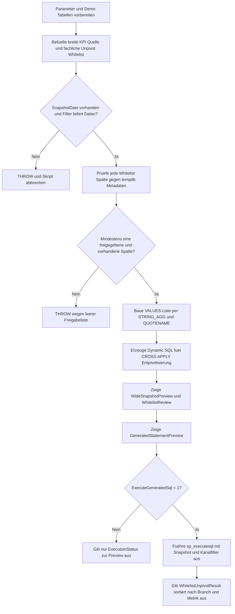

# UnpivotColumnWhitelist.sql

Dieses Skript zeigt ein whitelist-gesteuertes Entpivotisierungsmuster fuer breite KPI-Snapshots. Eine fachliche Freigabeliste bestimmt, welche Wide-Columns in das zeilenorientierte Ergebnis gelangen; ausgeschlossene oder fehlende Spalten bleiben nur im Review sichtbar.

## Uebersicht

<!-- SQLDOC:SUMMARY_TABLE:BEGIN -->
| Feld | Wert |
|---|---|
| Script | [UnpivotColumnWhitelist.sql](UnpivotColumnWhitelist.sql) |
| Version | `1.0` |
| Typ | `didactic-lab` |
| Kapitel | `14_Pivot_Unpivot` |
| Sicherheit | `read-only-tempdb` |
| Zweck | Entpivotisiert breite KPI-Snapshots nur fuer explizit freigegebene Spaltenlisten. |
<!-- SQLDOC:SUMMARY_TABLE:END -->

## Annahmen

- Die Erstversion verwendet ausschliesslich temporaere Demo-Tabellen in `tempdb`.
- Die Whitelist repraesentiert eine fachliche Freigabe; nur Eintraege mit `IsApproved = 1` und real vorhandener Quellspalte duerfen in die Dynamic-SQL-Liste einfliessen.
- Fehlende oder bewusst ausgeschlossene Spalten wie `GhostMetric` und `AuditOnlyFlag` werden transparent im Review gezeigt, aber nicht entpivotisiert.

## Anwendungsfall

Das Skript eignet sich fuer folgende Leitfragen:

- Wie laesst sich eine breite Kennzahlen-Tabelle sicher in ein zeilenorientiertes Reporting ueberfuehren, ohne alle numerischen Spalten blind freizugeben?
- Wie kann eine fachliche Whitelist mit `tempdb.sys.columns` abgeglichen werden, damit fehlende Spalten nicht in fehlerhafte Dynamic-SQL muenden?
- Wie bleibt die generierte Entpivotisierungsanweisung pruefbar, bevor sie optional ueber `sp_executesql` ausgefuehrt wird?

## Parameter

<!-- SQLDOC:PARAMETERS_TABLE:BEGIN -->
| Parameter | SQL-Typ | Pflicht | Beschreibung |
|---|---|---|---|
| `@SnapshotDate` | `date` | nein | Stichtag fuer die Demo-KPI-Zeilen, die entpivotisiert werden sollen. |
| `@ChannelGroup` | `varchar(20)` | nein | Optionaler Filter fuer eine Vertriebsgruppe innerhalb der Demo-Daten. |
| `@ExecuteGeneratedSql` | `bit` | nein | Fuehrt die generierte Entpivotisierungsabfrage aus, wenn der Wert `1` ist. |
<!-- SQLDOC:PARAMETERS_TABLE:END -->

## Abhaengigkeiten

<!-- SQLDOC:DEPENDENCIES_LIST:BEGIN -->
- temporaere Tabellen in `tempdb`
- `tempdb.sys.columns`
- `STRING_AGG`
- `QUOTENAME`
- `sp_executesql`
- `THROW`
<!-- SQLDOC:DEPENDENCIES_LIST:END -->

## Hinweise

- `WideSnapshotPreview` zeigt die breite KPI-Quelle fuer den gewaehlten Stichtag und optionalen Kanalfilter.
- `WhitelistReview` macht sichtbar, welche Spalten freigegeben, ausgeschlossen oder gar nicht in der Quelle vorhanden sind.
- `GeneratedStatementPreview` erlaubt eine fachliche und technische Kontrolle der Dynamic-SQL, bevor `WhitelistUnpivotResult` optional ausgegeben wird.

## Versionshistorie

<!-- SQLDOC:VERSION_HISTORY_TABLE:BEGIN -->
| Version | Datum | User | Beschreibung |
|---|---|---|---|
| `1.0` | `2026-04-18` | `ER` | Erstversion fuer whitelist-gesteuerte Entpivotisierung einer breiten Demo-KPI-Tabelle. |
<!-- SQLDOC:VERSION_HISTORY_TABLE:END -->

## Ablauf

<!-- SQLDOC:MERMAID:BEGIN -->

<!-- SQLDOC:MERMAID:END -->

## SQL-Code

<!-- SQLDOC:SQL_CODE:BEGIN -->
```sql
/*
BEGIN:SQL-HEADER v1
---
sql_header: v1
script_name: "UnpivotColumnWhitelist.sql"
script_version: "1.0"
script_type: "didactic-lab"
chapter: "14_Pivot_Unpivot"

purpose: >
  Entpivotisiert eine breite Demo-KPI-Tabelle nur fuer explizit
  freigegebene Spalten. Das Skript kombiniert eine fachliche Whitelist,
  sichere Spaltenpruefung gegen tempdb-Metadaten, STRING_AGG, QUOTENAME
  und sp_executesql, damit nur kontrollierte Attribute in ein
  zeilenorientiertes Analyseformat ueberfuehrt werden.

parameters:
  - name: "@SnapshotDate"
    sql_type: "date"
    direction: "IN"
    required: false
    description: "Stichtag fuer die Demo-KPI-Zeilen, die entpivotisiert werden sollen."
  - name: "@ChannelGroup"
    sql_type: "varchar(20)"
    direction: "IN"
    required: false
    description: "Optionaler Filter fuer eine Vertriebsgruppe innerhalb der Demo-Daten."
  - name: "@ExecuteGeneratedSql"
    sql_type: "bit"
    direction: "IN"
    required: false
    description: "Fuehrt die generierte Entpivotisierungsabfrage aus, wenn der Wert 1 ist."

result_sets:
  - name: "WideSnapshotPreview"
    description: "Zeigt die breite KPI-Quelle vor der Entpivotisierung."
  - name: "WhitelistReview"
    description: "Listet die freigegebenen und ausgeschlossenen Spalten der Whitelist."
  - name: "GeneratedStatementPreview"
    description: "Zeigt die generierte SQL-Anweisung fuer die whitelist-gesteuerte Entpivotisierung."
  - name: "WhitelistUnpivotResult"
    description: "Gibt die entpivotisierten KPI-Zeilen fuer die freigegebenen Spalten aus."

dependencies:
  - "temporary tables"
  - "tempdb metadata"
  - "STRING_AGG"
  - "QUOTENAME"
  - "sp_executesql"
  - "THROW"

safety:
  level: "read-only-tempdb"
  writes_data: false

documentation:
  markdown_file: "T-SQL/14_Pivot_Unpivot/SQLScripts/UnpivotColumnWhitelist.md"
  sync_blocks:
    - "SUMMARY_TABLE"
    - "PARAMETERS_TABLE"
    - "DEPENDENCIES_LIST"
    - "VERSION_HISTORY_TABLE"
    - "SQL_CODE"
  mermaid:
    mode: "ai-agent-from-sql"
    source: "script-body"

main_responsible:
  name: "Erhard Rainer"
  initials: "ER"

version_history:
  - version: "1.0"
    date: "2026-04-18"
    user: "ER"
    description: "Erstversion fuer whitelist-gesteuerte Entpivotisierung einer breiten Demo-KPI-Tabelle."

notes:
  - "Die Erstversion arbeitet ausschliesslich mit temporaeren Demo-Tabellen."
  - "Nur Whitelist-Eintraege mit IsApproved = 1 und real vorhandener Spalte duerfen in die Dynamic-SQL-Liste gelangen."
  - "Nicht freigegebene oder fehlende Spalten bleiben im Review sichtbar, werden aber nicht entpivotisiert."
---
END:SQL-HEADER v1
*/

SET NOCOUNT ON;

DECLARE @SnapshotDate DATE = '2026-03-31';
DECLARE @ChannelGroup VARCHAR(20) = NULL;
DECLARE @ExecuteGeneratedSql BIT = 1;

DROP TABLE IF EXISTS #WideBranchKpiSnapshot;
DROP TABLE IF EXISTS #UnpivotWhitelist;
DROP TABLE IF EXISTS #ApprovedColumns;

CREATE TABLE #WideBranchKpiSnapshot
(
    SnapshotDate        DATE            NOT NULL,
    BranchId            INT             NOT NULL,
    BranchName          NVARCHAR(60)    NOT NULL,
    ChannelGroup        VARCHAR(20)     NOT NULL,
    RevenueAmount       DECIMAL(12,2)   NULL,
    MarginAmount        DECIMAL(12,2)   NULL,
    TicketCount         INT             NULL,
    ReturnCount         INT             NULL,
    ActiveCustomers     INT             NULL,
    AuditOnlyFlag       BIT             NULL,
    PRIMARY KEY (SnapshotDate, BranchId)
);

CREATE TABLE #UnpivotWhitelist
(
    ColumnName          SYSNAME         NOT NULL PRIMARY KEY,
    MetricLabel         NVARCHAR(80)    NOT NULL,
    DisplayOrder        TINYINT         NOT NULL,
    IsApproved          BIT             NOT NULL,
    UnitLabel           VARCHAR(20)     NOT NULL
);

INSERT INTO #WideBranchKpiSnapshot
(
    SnapshotDate,
    BranchId,
    BranchName,
    ChannelGroup,
    RevenueAmount,
    MarginAmount,
    TicketCount,
    ReturnCount,
    ActiveCustomers,
    AuditOnlyFlag
)
VALUES
    ('2026-03-31', 11, N'Hamburg City',  'Retail',    184500.00, 42210.00, 1380, 24, 640, 1),
    ('2026-03-31', 12, N'Berlin North',  'Retail',    205900.00, 50120.00, 1515, 31, 710, 0),
    ('2026-03-31', 21, N'Leipzig B2B',   'Wholesale', 268400.00, 73450.00,  540, 12, 180, 1),
    ('2026-03-31', 22, N'Munich B2B',    'Wholesale', 312700.00, 84500.00,  615, 10, 205, 1),
    ('2026-04-30', 11, N'Hamburg City',  'Retail',    192200.00, 43980.00, 1415, 20, 655, 1),
    ('2026-04-30', 12, N'Berlin North',  'Retail',    214300.00, 51990.00, 1562, 28, 724, 0),
    ('2026-04-30', 21, N'Leipzig B2B',   'Wholesale', 274100.00, 74820.00,  553, 11, 184, 1),
    ('2026-04-30', 22, N'Munich B2B',    'Wholesale', 318950.00, 86110.00,  621,  9, 210, 1);

INSERT INTO #UnpivotWhitelist
(
    ColumnName,
    MetricLabel,
    DisplayOrder,
    IsApproved,
    UnitLabel
)
VALUES
    ('RevenueAmount',   N'Revenue',            1, 1, 'currency'),
    ('MarginAmount',    N'Margin',             2, 1, 'currency'),
    ('TicketCount',     N'Tickets',            3, 1, 'count'),
    ('ReturnCount',     N'Returns',            4, 1, 'count'),
    ('ActiveCustomers', N'Active Customers',   5, 1, 'count'),
    ('AuditOnlyFlag',   N'Internal Audit Flag',6, 0, 'flag'),
    ('GhostMetric',     N'Ghost Metric',       7, 1, 'count');

IF @SnapshotDate IS NULL
BEGIN
    THROW 50401, 'UnpivotColumnWhitelist requires a non-null @SnapshotDate value.', 1;
END;

IF @ExecuteGeneratedSql NOT IN (0, 1)
BEGIN
    THROW 50402, 'UnpivotColumnWhitelist expects @ExecuteGeneratedSql to be 0 or 1.', 1;
END;

IF NOT EXISTS
(
    SELECT 1
    FROM #WideBranchKpiSnapshot AS src
    WHERE src.SnapshotDate = @SnapshotDate
      AND (@ChannelGroup IS NULL OR src.ChannelGroup = @ChannelGroup)
)
BEGIN
    THROW 50403, 'UnpivotColumnWhitelist found no rows for the selected filter combination.', 1;
END;

SELECT
    wl.ColumnName,
    wl.MetricLabel,
    wl.DisplayOrder,
    wl.IsApproved,
    wl.UnitLabel,
    CASE
        WHEN EXISTS
        (
            SELECT 1
            FROM tempdb.sys.columns AS c
            WHERE c.object_id = OBJECT_ID('tempdb..#WideBranchKpiSnapshot')
              AND c.name = wl.ColumnName
        ) THEN CAST(1 AS bit)
        ELSE CAST(0 AS bit)
    END AS ColumnExists
INTO #ApprovedColumns
FROM #UnpivotWhitelist AS wl;

IF NOT EXISTS
(
    SELECT 1
    FROM #ApprovedColumns AS ac
    WHERE ac.IsApproved = 1
      AND ac.ColumnExists = 1
)
BEGIN
    THROW 50404, 'UnpivotColumnWhitelist found no approved columns that exist in the source snapshot.', 1;
END;

DECLARE @ValuesList NVARCHAR(MAX);
DECLARE @DynamicSql NVARCHAR(MAX);

SELECT
    @ValuesList = STRING_AGG
    (
        '(N''' + REPLACE(ac.MetricLabel, '''', '''''') + ''', N''' + ac.UnitLabel + ''', TRY_CONVERT(decimal(18,2), src.' + QUOTENAME(ac.ColumnName) + '))',
        ', '
    ) WITHIN GROUP (ORDER BY ac.DisplayOrder)
FROM #ApprovedColumns AS ac
WHERE ac.IsApproved = 1
  AND ac.ColumnExists = 1;

IF @ValuesList IS NULL
BEGIN
    THROW 50405, 'UnpivotColumnWhitelist could not build a VALUES list from the approved columns.', 1;
END;

SET @DynamicSql = N'
SELECT
    src.SnapshotDate,
    src.BranchId,
    src.BranchName,
    src.ChannelGroup,
    unp.MetricName,
    unp.UnitLabel,
    unp.MetricValue
FROM #WideBranchKpiSnapshot AS src
CROSS APPLY
(
    VALUES ' + @ValuesList + N'
) AS unp
(
    MetricName,
    UnitLabel,
    MetricValue
)
WHERE src.SnapshotDate = @RuntimeSnapshotDate
  AND (@RuntimeChannelGroup IS NULL OR src.ChannelGroup = @RuntimeChannelGroup)
ORDER BY
    src.BranchId,
    unp.MetricName;';

SELECT
    src.SnapshotDate,
    src.BranchId,
    src.BranchName,
    src.ChannelGroup,
    src.RevenueAmount,
    src.MarginAmount,
    src.TicketCount,
    src.ReturnCount,
    src.ActiveCustomers,
    src.AuditOnlyFlag
FROM #WideBranchKpiSnapshot AS src
WHERE src.SnapshotDate = @SnapshotDate
  AND (@ChannelGroup IS NULL OR src.ChannelGroup = @ChannelGroup)
ORDER BY
    src.BranchId;

SELECT
    ac.ColumnName,
    ac.MetricLabel,
    ac.DisplayOrder,
    ac.IsApproved,
    ac.UnitLabel,
    ac.ColumnExists
FROM #ApprovedColumns AS ac
ORDER BY
    ac.DisplayOrder;

SELECT
    @DynamicSql AS GeneratedUnpivotSql;

IF @ExecuteGeneratedSql = 1
BEGIN
    EXEC sys.sp_executesql
        @DynamicSql,
        N'@RuntimeSnapshotDate date, @RuntimeChannelGroup varchar(20)',
        @RuntimeSnapshotDate = @SnapshotDate,
        @RuntimeChannelGroup = @ChannelGroup;
END;
ELSE
BEGIN
    SELECT
        CAST('Execution skipped because @ExecuteGeneratedSql = 0.' AS NVARCHAR(200)) AS ExecutionStatus;
END;
```
<!-- SQLDOC:SQL_CODE:END -->
