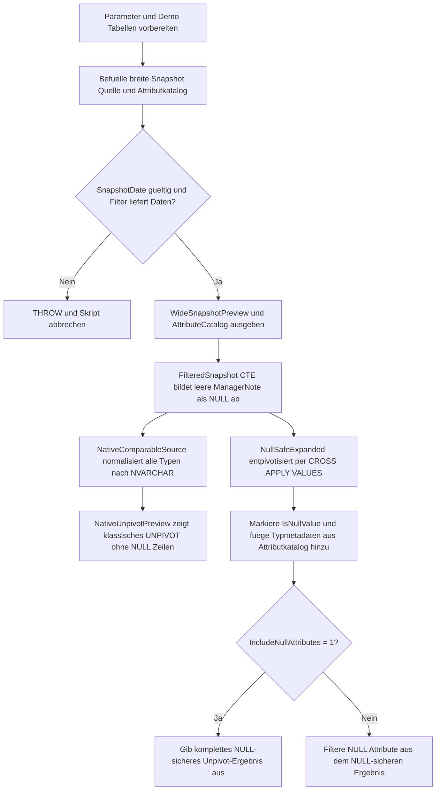

# UnpivotNullSafePattern.sql

Dieses Skript zeigt ein robustes Entpivotisierungsmuster fuer breite Demo-Snapshots mit gemischten Datentypen. Es kontrastiert ein klassisches `UNPIVOT` nach Vorab-Normalisierung mit einer `CROSS APPLY`-Variante, die `NULL`-Werte explizit sichtbar haelt.

## Uebersicht

<!-- SQLDOC:SUMMARY_TABLE:BEGIN -->
| Feld | Wert |
|---|---|
| Script | [UnpivotNullSafePattern.sql](UnpivotNullSafePattern.sql) |
| Version | `1.0` |
| Typ | `didactic-lab` |
| Kapitel | `14_Pivot_Unpivot` |
| Sicherheit | `read-only-tempdb` |
| Zweck | Zeigt NULL-sichere und typnormalisierte Entpivotisierung fuer breite Snapshot-Daten. |
<!-- SQLDOC:SUMMARY_TABLE:END -->

## Annahmen

- Die Erstversion arbeitet ausschliesslich mit temporaeren Demo-Tabellen in `tempdb`.
- Gemischte Quelltypen werden fuer die zeilenorientierte Ausgabe bewusst in ein gemeinsames `NVARCHAR`-Format ueberfuehrt.
- Leere Texte in `ManagerNote` werden vor der NULL-sicheren Ausgabe absichtlich zu `NULL` normalisiert, damit das Verhalten klar erkennbar bleibt.

## Anwendungsfall

Das Skript eignet sich fuer folgende Leitfragen:

- Warum verschwinden bei einem nativen `UNPIVOT` NULL-Werte aus dem Resultset, obwohl die fachliche Spalte existiert?
- Wie lassen sich `decimal`, `int`, `date`, `bit` und `nvarchar` in einem gemeinsamen Entpivotisierungsformat zusammenfuehren?
- Wann ist `CROSS APPLY (VALUES ...)` das robustere Muster, wenn fehlende Werte bewusst sichtbar bleiben sollen?

## Parameter

<!-- SQLDOC:PARAMETERS_TABLE:BEGIN -->
| Parameter | SQL-Typ | Pflicht | Beschreibung |
|---|---|---|---|
| `@SnapshotDate` | `date` | nein | Stichtag fuer die Demo-Snapshot-Zeilen, die entpivotisiert werden sollen. |
| `@ChannelGroup` | `varchar(20)` | nein | Optionaler Filter fuer eine Vertriebsgruppe innerhalb der Demo-Daten. |
| `@IncludeNullAttributes` | `bit` | nein | Zeigt NULL-Attribute im NULL-sicheren Ergebnis, wenn der Wert `1` ist. |
<!-- SQLDOC:PARAMETERS_TABLE:END -->

## Abhaengigkeiten

<!-- SQLDOC:DEPENDENCIES_LIST:BEGIN -->
- temporaere Tabellen in `tempdb`
- `CROSS APPLY`
- `UNPIVOT`
- `CTEs`
- `THROW`
<!-- SQLDOC:DEPENDENCIES_LIST:END -->

## Hinweise

- `WideSnapshotPreview` zeigt die breite Demo-Quelle inklusive bewusst fehlender Kennzahlen und optional leerer Texte.
- `NativeUnpivotPreview` demonstriert das Verhalten eines klassischen `UNPIVOT`, nachdem alle Quellwerte zuerst in Text umgewandelt wurden.
- `NullSafeUnpivotResult` behaelt dieselben Attribute auch dann sichtbar, wenn ihr Wert `NULL` ist, und markiert diese Faelle ueber `IsNullValue`.

## Versionshistorie

<!-- SQLDOC:VERSION_HISTORY_TABLE:BEGIN -->
| Version | Datum | User | Beschreibung |
|---|---|---|---|
| `1.0` | `2026-04-18` | `ER` | Erstversion fuer NULL-sichere und typnormalisierte Unpivot-Muster. |
<!-- SQLDOC:VERSION_HISTORY_TABLE:END -->

## Ablauf

<!-- SQLDOC:MERMAID:BEGIN -->

<!-- SQLDOC:MERMAID:END -->

## SQL-Code

<!-- SQLDOC:SQL_CODE:BEGIN -->
```sql
/*
BEGIN:SQL-HEADER v1
---
sql_header: v1
script_name: "UnpivotNullSafePattern.sql"
script_version: "1.0"
script_type: "didactic-lab"
chapter: "14_Pivot_Unpivot"

purpose: >
  Zeigt ein robustes UNPIVOT-Muster fuer breite Demo-Snapshots mit
  gemischten Datentypen und NULL-Werten. Das Skript kontrastiert ein
  natives UNPIVOT auf vorab normalisierten Textspalten mit einer
  NULL-sicheren CROSS-APPLY-Variante, die fehlende Werte sichtbar haelt
  und Datentypen bewusst in ein gemeinsames Anzeigeformat ueberfuehrt.

parameters:
  - name: "@SnapshotDate"
    sql_type: "date"
    direction: "IN"
    required: false
    description: "Stichtag fuer die Demo-Snapshot-Zeilen, die entpivotisiert werden sollen."
  - name: "@ChannelGroup"
    sql_type: "varchar(20)"
    direction: "IN"
    required: false
    description: "Optionaler Filter fuer eine Vertriebsgruppe innerhalb der Demo-Daten."
  - name: "@IncludeNullAttributes"
    sql_type: "bit"
    direction: "IN"
    required: false
    description: "Zeigt NULL-Attribute im NULL-sicheren Ergebnis, wenn der Wert 1 ist."

result_sets:
  - name: "WideSnapshotPreview"
    description: "Zeigt die breite Demo-Quelle vor der Entpivotisierung."
  - name: "AttributeCatalog"
    description: "Listet die fachliche Reihenfolge und Datentyp-Normalisierung der Zielattribute."
  - name: "NativeUnpivotPreview"
    description: "Zeigt, welche Zeilen ein natives UNPIVOT nach Typnormalisierung noch liefert."
  - name: "NullSafeUnpivotResult"
    description: "Gibt ein NULL-sicheres, typnormalisiertes Unpivot-Ergebnis mit Statusflag zurueck."

dependencies:
  - "temporary tables"
  - "CROSS APPLY"
  - "UNPIVOT"
  - "CTEs"
  - "THROW"

safety:
  level: "read-only-tempdb"
  writes_data: false

documentation:
  markdown_file: "T-SQL/14_Pivot_Unpivot/SQLScripts/UnpivotNullSafePattern.md"
  sync_blocks:
    - "SUMMARY_TABLE"
    - "PARAMETERS_TABLE"
    - "DEPENDENCIES_LIST"
    - "VERSION_HISTORY_TABLE"
    - "SQL_CODE"
  mermaid:
    mode: "ai-agent-from-sql"
    source: "script-body"

main_responsible:
  name: "Erhard Rainer"
  initials: "ER"

version_history:
  - version: "1.0"
    date: "2026-04-18"
    user: "ER"
    description: "Erstversion fuer NULL-sichere und typnormalisierte Unpivot-Muster."

notes:
  - "Die Erstversion arbeitet ausschliesslich mit temporaeren Demo-Tabellen."
  - "Das Skript zeigt bewusst den Unterschied zwischen nativer UNPIVOT-Sicht und NULL-sicherer CROSS-APPLY-Sicht."
  - "Gemischte Quelltypen werden fuer die zeilenorientierte Ausgabe in ein gemeinsames NVARCHAR-Format ueberfuehrt."
---
END:SQL-HEADER v1
*/

SET NOCOUNT ON;

DECLARE @SnapshotDate DATE = '2026-04-30';
DECLARE @ChannelGroup VARCHAR(20) = NULL;
DECLARE @IncludeNullAttributes BIT = 1;

DROP TABLE IF EXISTS #WideBranchHealthSnapshot;
DROP TABLE IF EXISTS #AttributeCatalog;

CREATE TABLE #WideBranchHealthSnapshot
(
    SnapshotDate        DATE            NOT NULL,
    BranchId            INT             NOT NULL,
    BranchName          NVARCHAR(60)    NOT NULL,
    ChannelGroup        VARCHAR(20)     NOT NULL,
    RevenueAmount       DECIMAL(12,2)   NULL,
    TicketCount         INT             NULL,
    LastSaleDate        DATE            NULL,
    IsPriorityBranch    BIT             NULL,
    ManagerNote         NVARCHAR(100)   NULL,
    PRIMARY KEY (SnapshotDate, BranchId)
);

CREATE TABLE #AttributeCatalog
(
    AttributeName       VARCHAR(30)     NOT NULL PRIMARY KEY,
    DisplayLabel        VARCHAR(40)     NOT NULL,
    DisplayOrder        TINYINT         NOT NULL,
    SourceSqlType       VARCHAR(30)     NOT NULL,
    NullHandling        VARCHAR(40)     NOT NULL
);

INSERT INTO #WideBranchHealthSnapshot
(
    SnapshotDate,
    BranchId,
    BranchName,
    ChannelGroup,
    RevenueAmount,
    TicketCount,
    LastSaleDate,
    IsPriorityBranch,
    ManagerNote
)
VALUES
    ('2026-03-31', 11, N'Hamburg City', 'Retail',    184500.00, 1380, '2026-03-30', 1, N'Stable quarter close'),
    ('2026-03-31', 12, N'Berlin North', 'Retail',    205900.00, 1515, '2026-03-31', 0, NULL),
    ('2026-03-31', 21, N'Leipzig B2B',  'Wholesale', 268400.00,  540, '2026-03-29', 1, N'Focus on renewals'),
    ('2026-04-30', 11, N'Hamburg City', 'Retail',    192200.00, 1415, '2026-04-29', 1, N'Stable quarter close'),
    ('2026-04-30', 12, N'Berlin North', 'Retail',    214300.00, NULL, '2026-04-30', 0, NULL),
    ('2026-04-30', 21, N'Leipzig B2B',  'Wholesale', NULL,       553, NULL,         1, N'Pending rebate review'),
    ('2026-04-30', 22, N'Munich B2B',   'Wholesale', 318950.00,  621, '2026-04-28', NULL, N'');

INSERT INTO #AttributeCatalog
(
    AttributeName,
    DisplayLabel,
    DisplayOrder,
    SourceSqlType,
    NullHandling
)
VALUES
    ('RevenueAmount',    'Revenue',         1, 'decimal(12,2)', 'NULL stays visible in CROSS APPLY result'),
    ('TicketCount',      'Tickets',         2, 'int',           'NULL stays visible in CROSS APPLY result'),
    ('LastSaleDate',     'Last Sale Date',  3, 'date',          'ISO date string or NULL'),
    ('IsPriorityBranch', 'Priority Branch', 4, 'bit',           'Rendered as true or false when present'),
    ('ManagerNote',      'Manager Note',    5, 'nvarchar(100)', 'Empty string normalized to NULL');

IF @SnapshotDate IS NULL
BEGIN
    THROW 50501, 'UnpivotNullSafePattern requires a non-null @SnapshotDate value.', 1;
END;

IF @IncludeNullAttributes NOT IN (0, 1)
BEGIN
    THROW 50502, 'UnpivotNullSafePattern expects @IncludeNullAttributes to be 0 or 1.', 1;
END;

IF NOT EXISTS
(
    SELECT 1
    FROM #WideBranchHealthSnapshot AS src
    WHERE src.SnapshotDate = @SnapshotDate
      AND (@ChannelGroup IS NULL OR src.ChannelGroup = @ChannelGroup)
)
BEGIN
    THROW 50503, 'UnpivotNullSafePattern found no rows for the selected filter combination.', 1;
END;

SELECT
    src.SnapshotDate,
    src.BranchId,
    src.BranchName,
    src.ChannelGroup,
    src.RevenueAmount,
    src.TicketCount,
    src.LastSaleDate,
    src.IsPriorityBranch,
    src.ManagerNote
FROM #WideBranchHealthSnapshot AS src
WHERE src.SnapshotDate = @SnapshotDate
  AND (@ChannelGroup IS NULL OR src.ChannelGroup = @ChannelGroup)
ORDER BY
    src.BranchId;

SELECT
    cat.AttributeName,
    cat.DisplayLabel,
    cat.DisplayOrder,
    cat.SourceSqlType,
    cat.NullHandling
FROM #AttributeCatalog AS cat
ORDER BY
    cat.DisplayOrder;

;WITH FilteredSnapshot AS
(
    SELECT
        src.SnapshotDate,
        src.BranchId,
        src.BranchName,
        src.ChannelGroup,
        src.RevenueAmount,
        src.TicketCount,
        src.LastSaleDate,
        src.IsPriorityBranch,
        NULLIF(LTRIM(RTRIM(src.ManagerNote)), '') AS ManagerNote
    FROM #WideBranchHealthSnapshot AS src
    WHERE src.SnapshotDate = @SnapshotDate
      AND (@ChannelGroup IS NULL OR src.ChannelGroup = @ChannelGroup)
),
NativeComparableSource AS
(
    SELECT
        fs.SnapshotDate,
        fs.BranchId,
        fs.BranchName,
        fs.ChannelGroup,
        CONVERT(NVARCHAR(50), fs.RevenueAmount) AS RevenueAmount,
        CONVERT(NVARCHAR(50), fs.TicketCount) AS TicketCount,
        CONVERT(NVARCHAR(30), fs.LastSaleDate, 23) AS LastSaleDate,
        CASE
            WHEN fs.IsPriorityBranch IS NULL THEN NULL
            WHEN fs.IsPriorityBranch = 1 THEN N'true'
            ELSE N'false'
        END AS IsPriorityBranch,
        fs.ManagerNote AS ManagerNote
    FROM FilteredSnapshot AS fs
),
NativeUnpivotPreview AS
(
    SELECT
        nus.SnapshotDate,
        nus.BranchId,
        nus.BranchName,
        nus.ChannelGroup,
        unp.AttributeName,
        unp.AttributeValue
    FROM NativeComparableSource AS nus
    UNPIVOT
    (
        AttributeValue FOR AttributeName IN
        (
            RevenueAmount,
            TicketCount,
            LastSaleDate,
            IsPriorityBranch,
            ManagerNote
        )
    ) AS unp
),
NullSafeExpanded AS
(
    SELECT
        fs.SnapshotDate,
        fs.BranchId,
        fs.BranchName,
        fs.ChannelGroup,
        row_data.AttributeName,
        row_data.AttributeValue,
        CASE
            WHEN row_data.AttributeValue IS NULL THEN CAST(1 AS bit)
            ELSE CAST(0 AS bit)
        END AS IsNullValue
    FROM FilteredSnapshot AS fs
    CROSS APPLY
    (
        VALUES
            ('RevenueAmount',    CONVERT(NVARCHAR(50), fs.RevenueAmount)),
            ('TicketCount',      CONVERT(NVARCHAR(50), fs.TicketCount)),
            ('LastSaleDate',     CONVERT(NVARCHAR(30), fs.LastSaleDate, 23)),
            ('IsPriorityBranch', CASE
                                     WHEN fs.IsPriorityBranch IS NULL THEN NULL
                                     WHEN fs.IsPriorityBranch = 1 THEN N'true'
                                     ELSE N'false'
                                 END),
            ('ManagerNote',      fs.ManagerNote)
    ) AS row_data(AttributeName, AttributeValue)
)
SELECT
    nup.SnapshotDate,
    nup.BranchId,
    nup.BranchName,
    nup.ChannelGroup,
    cat.DisplayLabel,
    nup.AttributeName,
    nup.AttributeValue
FROM NativeUnpivotPreview AS nup
INNER JOIN #AttributeCatalog AS cat
    ON cat.AttributeName = nup.AttributeName
ORDER BY
    nup.BranchId,
    cat.DisplayOrder;

SELECT
    nse.SnapshotDate,
    nse.BranchId,
    nse.BranchName,
    nse.ChannelGroup,
    cat.DisplayLabel,
    nse.AttributeName,
    cat.SourceSqlType,
    nse.AttributeValue,
    COALESCE(nse.AttributeValue, N'<NULL>') AS DisplayValue,
    nse.IsNullValue
FROM NullSafeExpanded AS nse
INNER JOIN #AttributeCatalog AS cat
    ON cat.AttributeName = nse.AttributeName
WHERE @IncludeNullAttributes = 1
   OR nse.IsNullValue = 0
ORDER BY
    nse.BranchId,
    cat.DisplayOrder;
```
<!-- SQLDOC:SQL_CODE:END -->
