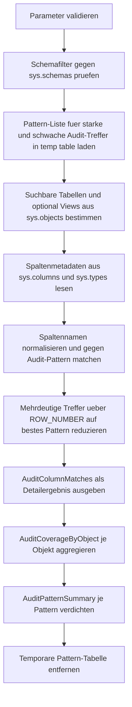

# SearchAuditColumns.sql

Dieses Skript durchsucht die Metadaten der aktuell verbundenen Datenbank nach typischen Audit-Spalten. Es bewertet Spaltennamen wie `CreatedAt`, `ModifiedBy`, `DeletedAt` oder `rowversion` gegen eine nachvollziehbare Pattern-Liste und verdichtet die Treffer je Objekt.

## Uebersicht

<!-- SQLDOC:SUMMARY_TABLE:BEGIN -->
| Feld | Wert |
|---|---|
| Script | [SearchAuditColumns.sql](SearchAuditColumns.sql) |
| Version | `1.0` |
| Typ | `diagnostic-query` |
| Kapitel | `15_SearchInTables` |
| Sicherheit | `read-only` |
| Zweck | Sucht typische Audit-Spalten in Tabellen- und optional View-Metadaten der aktuellen Datenbank. |
<!-- SQLDOC:SUMMARY_TABLE:END -->

## Einordnung

Das Artefakt passt zu Bestandsaufnahmen, Refactorings und Datenbank-Reviews, bei denen schnell sichtbar werden soll, welche Objekte bereits eine brauchbare Audit-Struktur besitzen. Statt direkt Produktionslogik zu unterstellen, arbeitet das Skript rein lesend auf Katalogsichten und liefert eine diagnostische Erstbewertung.

## Annahmen

- Die Erstversion arbeitet ausschliesslich auf `sys.objects`, `sys.schemas`, `sys.columns` und `sys.types` der aktuell verbundenen Datenbank.
- Audit-Relevanz wird ueber Namensmuster bewertet; fachliche Trigger, Historientabellen oder CDC-Konfigurationen werden bewusst nicht analysiert.
- `rowversion` und `timestamp` werden als technische Row-Tracking-Spalten mit hohem Audit-Bezug behandelt.
- Bei mehrdeutigen Spaltennamen gewinnt pro Spalte das staerkste und spezifischste Pattern.

## Anwendungsfall

Das Skript eignet sich fuer Inventuren vor Migrationen, Naming-Reviews, Governance-Checks oder als Einstieg in Kapitel zu Schema- und Metadatensuche. Die Trefferliste kann spaeter um Extended Properties, Default-Definitionen oder Trigger-Analysen erweitert werden.

## Parameter

<!-- SQLDOC:PARAMETERS_TABLE:BEGIN -->
| Parameter | SQL-Typ | Pflicht | Beschreibung |
|---|---|---|---|
| `@SchemaName` | `SYSNAME` | Nein | Optionaler Schemafilter; `NULL` durchsucht alle Schemas. |
| `@IncludeViews` | `BIT` | Nein | Bezieht bei `1` auch Views ein, sonst nur Benutzertabellen. |
| `@OnlyLikelyAuditColumns` | `BIT` | Nein | Zeigt bei `1` nur starke Audit-Treffer und technische Row-Tracking-Spalten. |
<!-- SQLDOC:PARAMETERS_TABLE:END -->

## Abhaengigkeiten

<!-- SQLDOC:DEPENDENCIES_LIST:BEGIN -->
- `sys.objects`
- `sys.schemas`
- `sys.columns`
- `sys.types`
- `STRING_SPLIT()`
- `CASE`
- `LIKE`
- `ROW_NUMBER()`
<!-- SQLDOC:DEPENDENCIES_LIST:END -->

## Hinweise

- `AuditColumnMatches` ist die Detailansicht je Spalte mit Audit-Kategorie, Trefferart und Vertrauensniveau.
- `AuditCoverageByObject` verdichtet je Tabelle oder View, wie breit eine Audit-Grundausstattung bereits vorhanden ist.
- `AuditPatternSummary` macht sichtbar, welche Pattern im Bestand besonders haeufig vorkommen.
- Mit `@OnlyLikelyAuditColumns = 0` lassen sich auch weichere Kandidaten wie `LastChange` oder generische `Audit`-Spalten mit ausgeben.

## Versionshistorie

<!-- SQLDOC:VERSION_HISTORY_TABLE:BEGIN -->
| Version | Datum | User | Beschreibung |
|---|---|---|---|
| `1.0` | `2026-04-18` | `ER` | Erstversion eines diagnostischen Metadaten-Skripts fuer typische Audit-Spalten |
<!-- SQLDOC:VERSION_HISTORY_TABLE:END -->

## Ablauf

<!-- SQLDOC:MERMAID:BEGIN -->

<!-- SQLDOC:MERMAID:END -->

## SQL-Code

<!-- SQLDOC:SQL_CODE:BEGIN -->
`sql
/*
BEGIN:SQL-HEADER v1
---
sql_header: v1
script_name: "SearchAuditColumns.sql"
script_version: "1.0"
script_type: "diagnostic-query"
chapter: "15_SearchInTables"

purpose: >
  Durchsucht Tabellen- und optional View-Metadaten nach typischen Audit-Spalten
  wie CreatedAt, ModifiedBy, DeletedAt oder verwandten Benennungsmustern.

parameters:
  - name: "@SchemaName"
    sql_type: "SYSNAME"
    direction: "IN"
    required: false
    description: "Optionaler Schemafilter; NULL durchsucht alle Schemas."
  - name: "@IncludeViews"
    sql_type: "BIT"
    direction: "IN"
    required: false
    description: "1 = Views einbeziehen, 0 = nur Benutzertabellen."
  - name: "@OnlyLikelyAuditColumns"
    sql_type: "BIT"
    direction: "IN"
    required: false
    description: "1 = nur starke Audit-Treffer zeigen, 0 = auch weiche Kandidaten."

result_sets:
  - name: "AuditColumnMatches"
    description: "Gefundene Spalten mit Audit-Kategorie, Pattern-Hit und Trefferguete."
  - name: "AuditCoverageByObject"
    description: "Verdichtete Sicht je Tabelle oder View auf vorhandene Audit-Spalten."
  - name: "AuditPatternSummary"
    description: "Zusammenfassung der gefundenen Audit-Muster und betroffenen Objekte."

dependencies:
  - "sys.objects"
  - "sys.schemas"
  - "sys.columns"
  - "sys.types"
  - "STRING_SPLIT()"
  - "CASE"
  - "LIKE"
  - "ROW_NUMBER()"

safety:
  level: "read-only"
  writes_data: false

documentation:
  markdown_file: "T-SQL/15_SearchInTables/SQLScripts/SearchAuditColumns.md"
  sync_blocks:
    - "SUMMARY_TABLE"
    - "PARAMETERS_TABLE"
    - "DEPENDENCIES_LIST"
    - "VERSION_HISTORY_TABLE"
    - "SQL_CODE"
  mermaid:
    mode: "ai-agent-from-sql"
    source: "script-body"

main_responsible:
  name: "Erhard Rainer"
  initials: "ER"

version_history:
  - version: "1.0"
    date: "2026-04-18"
    user: "ER"
    description: "Erstversion eines diagnostischen Metadaten-Skripts fuer typische Audit-Spalten."

notes:
  - "Die Erstversion arbeitet rein lesend auf Katalogsichten der aktuell verbundenen Datenbank."
  - "Audit-Muster werden ueber eine didaktische Pattern-Liste mit starken und weichen Treffern bewertet."
---
END:SQL-HEADER v1
*/

SET NOCOUNT ON;

DECLARE @SchemaName SYSNAME = NULL;
DECLARE @IncludeViews BIT = 0;
DECLARE @OnlyLikelyAuditColumns BIT = 1;

IF @IncludeViews NOT IN (0, 1)
BEGIN
    THROW 50000, '@IncludeViews muss 0 oder 1 sein.', 1;
END;

IF @OnlyLikelyAuditColumns NOT IN (0, 1)
BEGIN
    THROW 50001, '@OnlyLikelyAuditColumns muss 0 oder 1 sein.', 1;
END;

IF @SchemaName IS NOT NULL AND NOT EXISTS
(
    SELECT 1
    FROM sys.schemas AS s
    WHERE s.name = @SchemaName
)
BEGIN
    THROW 50002, '@SchemaName wurde in der aktuellen Datenbank nicht gefunden.', 1;
END;

DROP TABLE IF EXISTS #AuditPatterns;
CREATE TABLE #AuditPatterns
(
    PatternName NVARCHAR(128) NOT NULL PRIMARY KEY,
    AuditCategory NVARCHAR(30) NOT NULL,
    MatchStrength NVARCHAR(10) NOT NULL,
    PriorityRank INT NOT NULL
);

INSERT INTO #AuditPatterns (PatternName, AuditCategory, MatchStrength, PriorityRank)
SELECT value, N'created', N'strong', 10
FROM STRING_SPLIT(N'createdat|created_on|createddate|createdutc', N'|')
UNION ALL
SELECT value, N'created_by', N'strong', 11
FROM STRING_SPLIT(N'createdby|created_by', N'|')
UNION ALL
SELECT value, N'modified', N'strong', 20
FROM STRING_SPLIT(N'modifiedat|modified_on|modifieddate|modifiedutc|updatedat|updated_on|updateddate|updatedutc', N'|')
UNION ALL
SELECT value, N'modified_by', N'strong', 21
FROM STRING_SPLIT(N'modifiedby|modified_by|updatedby|updated_by', N'|')
UNION ALL
SELECT value, N'deleted', N'strong', 30
FROM STRING_SPLIT(N'deletedat|deleted_on|deleteddate|deletedutc', N'|')
UNION ALL
SELECT value, N'deleted_by', N'strong', 31
FROM STRING_SPLIT(N'deletedby|deleted_by', N'|')
UNION ALL
SELECT value, N'row_tracking', N'strong', 40
FROM STRING_SPLIT(N'rowversion|timestamp', N'|')
UNION ALL
SELECT value, N'created', N'weak', 110
FROM STRING_SPLIT(N'inserted|insert_date', N'|')
UNION ALL
SELECT value, N'created_by', N'weak', 111
FROM STRING_SPLIT(N'insert_user', N'|')
UNION ALL
SELECT value, N'modified', N'weak', 120
FROM STRING_SPLIT(N'changed|changed_at|change_date|lastchange|lastmodified|lastupdate', N'|')
UNION ALL
SELECT value, N'modified_by', N'weak', 121
FROM STRING_SPLIT(N'changedby', N'|')
UNION ALL
SELECT value, N'generic_audit', N'weak', 130
FROM STRING_SPLIT(N'audit|archivedat|archived_by|approvedby|approved_at', N'|');

WITH SearchableObjects AS
(
    SELECT
        o.object_id,
        s.name AS SchemaName,
        o.name AS ObjectName,
        o.type AS ObjectTypeCode,
        o.type_desc AS ObjectTypeDesc
    FROM sys.objects AS o
    INNER JOIN sys.schemas AS s
        ON s.schema_id = o.schema_id
    WHERE o.type IN (N'U', N'V')
      AND (@IncludeViews = 1 OR o.type = N'U')
      AND (@SchemaName IS NULL OR s.name = @SchemaName)
      AND OBJECTPROPERTY(o.object_id, 'IsMsShipped') = 0
),
CandidateColumns AS
(
    SELECT
        so.SchemaName,
        so.ObjectName,
        so.ObjectTypeCode,
        so.ObjectTypeDesc,
        c.column_id AS ColumnOrdinal,
        c.name AS ColumnName,
        t.name AS DataTypeName,
        c.max_length,
        c.precision,
        c.scale,
        c.is_nullable,
        c.is_identity,
        c.is_computed,
        CASE WHEN t.name = N'timestamp' THEN 1 ELSE 0 END AS IsRowVersionLike,
        LOWER(REPLACE(REPLACE(REPLACE(c.name, N' ', N''), N'-', N''), N'_', N'')) AS NormalizedColumnName
    FROM SearchableObjects AS so
    INNER JOIN sys.columns AS c
        ON c.object_id = so.object_id
    INNER JOIN sys.types AS t
        ON t.user_type_id = c.user_type_id
),
PatternMatches AS
(
    SELECT
        cc.SchemaName,
        cc.ObjectName,
        cc.ObjectTypeCode,
        cc.ObjectTypeDesc,
        cc.ColumnOrdinal,
        cc.ColumnName,
        cc.DataTypeName,
        cc.max_length,
        cc.precision,
        cc.scale,
        cc.is_nullable,
        cc.is_identity,
        cc.is_computed,
        cc.IsRowVersionLike,
        p.PatternName,
        p.AuditCategory,
        p.MatchStrength,
        p.PriorityRank,
        CASE
            WHEN cc.NormalizedColumnName = p.PatternName THEN N'exact'
            WHEN cc.NormalizedColumnName LIKE p.PatternName + N'%' THEN N'prefix'
            WHEN cc.NormalizedColumnName LIKE N'%' + p.PatternName THEN N'suffix'
            ELSE N'contains'
        END AS MatchType
    FROM CandidateColumns AS cc
    INNER JOIN #AuditPatterns AS p
        ON cc.NormalizedColumnName LIKE N'%' + p.PatternName + N'%'
),
RankedMatches AS
(
    SELECT
        pm.*,
        ROW_NUMBER() OVER
        (
            PARTITION BY pm.SchemaName, pm.ObjectName, pm.ColumnName
            ORDER BY
                CASE pm.MatchStrength WHEN N'strong' THEN 0 ELSE 1 END,
                CASE pm.MatchType WHEN N'exact' THEN 0 WHEN N'prefix' THEN 1 WHEN N'suffix' THEN 2 ELSE 3 END,
                pm.PriorityRank,
                LEN(pm.PatternName) DESC
        ) AS MatchRank
    FROM PatternMatches AS pm
)
SELECT
    rm.SchemaName,
    rm.ObjectName,
    rm.ObjectTypeCode,
    rm.ObjectTypeDesc,
    rm.ColumnOrdinal,
    rm.ColumnName,
    rm.DataTypeName,
    rm.max_length,
    rm.precision,
    rm.scale,
    rm.is_nullable,
    rm.is_identity,
    rm.is_computed,
    rm.IsRowVersionLike,
    rm.PatternName,
    rm.AuditCategory,
    rm.MatchStrength,
    rm.MatchType,
    CASE
        WHEN rm.MatchStrength = N'strong' AND rm.MatchType = N'exact' THEN N'high'
        WHEN rm.MatchStrength = N'strong' THEN N'medium'
        ELSE N'low'
    END AS ConfidenceLevel
INTO #BestMatches
FROM RankedMatches AS rm
WHERE rm.MatchRank = 1;

SELECT
    bm.SchemaName,
    bm.ObjectName,
    bm.ObjectTypeCode,
    bm.ObjectTypeDesc,
    bm.ColumnOrdinal,
    bm.ColumnName,
    CASE
        WHEN bm.DataTypeName IN (N'nvarchar', N'varchar', N'nchar', N'char')
            THEN CONCAT(bm.DataTypeName, N'(', CASE WHEN bm.max_length = -1 THEN N'max' ELSE CONVERT(NVARCHAR(10), bm.max_length / CASE WHEN bm.DataTypeName LIKE N'n%' THEN 2 ELSE 1 END) END, N')')
        WHEN bm.DataTypeName IN (N'decimal', N'numeric')
            THEN CONCAT(bm.DataTypeName, N'(', CONVERT(NVARCHAR(10), bm.precision), N',', CONVERT(NVARCHAR(10), bm.scale), N')')
        WHEN bm.DataTypeName IN (N'datetime2', N'datetimeoffset', N'time')
            THEN CONCAT(bm.DataTypeName, N'(', CONVERT(NVARCHAR(10), bm.scale), N')')
        ELSE bm.DataTypeName
    END AS DataTypeDisplay,
    bm.is_nullable AS IsNullable,
    bm.is_identity AS IsIdentity,
    bm.is_computed AS IsComputed,
    bm.IsRowVersionLike,
    bm.AuditCategory,
    bm.PatternName AS MatchedPattern,
    bm.MatchStrength,
    bm.MatchType,
    bm.ConfidenceLevel
FROM #BestMatches AS bm
WHERE @OnlyLikelyAuditColumns = 0
   OR bm.MatchStrength = N'strong'
   OR bm.IsRowVersionLike = 1
ORDER BY
    bm.SchemaName,
    bm.ObjectName,
    bm.ColumnOrdinal;

SELECT
    bm.SchemaName,
    bm.ObjectName,
    bm.ObjectTypeDesc,
    COUNT(*) AS AuditColumnCount,
    SUM(CASE WHEN bm.MatchStrength = N'strong' THEN 1 ELSE 0 END) AS StrongMatchCount,
    SUM(CASE WHEN bm.AuditCategory = N'created' THEN 1 ELSE 0 END) AS CreatedColumns,
    SUM(CASE WHEN bm.AuditCategory = N'created_by' THEN 1 ELSE 0 END) AS CreatedByColumns,
    SUM(CASE WHEN bm.AuditCategory = N'modified' THEN 1 ELSE 0 END) AS ModifiedColumns,
    SUM(CASE WHEN bm.AuditCategory = N'modified_by' THEN 1 ELSE 0 END) AS ModifiedByColumns,
    SUM(CASE WHEN bm.AuditCategory = N'deleted' THEN 1 ELSE 0 END) AS DeletedColumns,
    SUM(CASE WHEN bm.AuditCategory = N'deleted_by' THEN 1 ELSE 0 END) AS DeletedByColumns,
    SUM(CASE WHEN bm.IsRowVersionLike = 1 THEN 1 ELSE 0 END) AS RowTrackingColumns,
    CASE
        WHEN SUM(CASE WHEN bm.AuditCategory = N'created' THEN 1 ELSE 0 END) > 0
         AND SUM(CASE WHEN bm.AuditCategory = N'modified' THEN 1 ELSE 0 END) > 0
            THEN N'baseline_audit_pair_present'
        WHEN COUNT(*) >= 3
            THEN N'partial_audit_footprint'
        ELSE N'single_or_sparse_audit_columns'
    END AS AuditFootprintLevel
FROM #BestMatches AS bm
WHERE @OnlyLikelyAuditColumns = 0
   OR bm.MatchStrength = N'strong'
   OR bm.IsRowVersionLike = 1
GROUP BY
    bm.SchemaName,
    bm.ObjectName,
    bm.ObjectTypeDesc
ORDER BY
    AuditColumnCount DESC,
    bm.SchemaName,
    bm.ObjectName;

SELECT
    bm.AuditCategory,
    bm.MatchStrength,
    bm.PatternName,
    COUNT(*) AS MatchedColumns,
    COUNT(DISTINCT CONCAT(bm.SchemaName, N'.', bm.ObjectName)) AS DistinctObjects,
    MIN(CONCAT(bm.SchemaName, N'.', bm.ObjectName, N'.', bm.ColumnName)) AS ExampleMatch
FROM #BestMatches AS bm
WHERE @OnlyLikelyAuditColumns = 0
   OR bm.MatchStrength = N'strong'
GROUP BY
    bm.AuditCategory,
    bm.MatchStrength,
    bm.PatternName
ORDER BY
    CASE bm.MatchStrength WHEN N'strong' THEN 0 ELSE 1 END,
    MatchedColumns DESC,
    bm.AuditCategory,
    bm.PatternName;

DROP TABLE IF EXISTS #BestMatches;
DROP TABLE IF EXISTS #AuditPatterns;

`
<!-- SQLDOC:SQL_CODE:END -->

