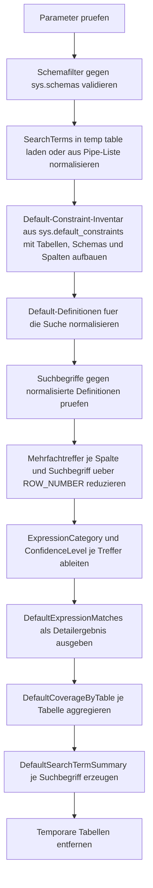

# SearchDefaultExpressions.sql

Dieses Skript durchsucht Default-Definitionen der aktuell verbundenen Datenbank nach frei definierbaren Suchbegriffen. Der Schwerpunkt liegt auf typischen Zeit-, Identifier- und Literal-Ausdruecken wie `GETDATE()`, `SYSUTCDATETIME()`, `NEWID()` oder statischen Kennwerten.

## Uebersicht

<!-- SQLDOC:SUMMARY_TABLE:BEGIN -->
| Feld | Wert |
|---|---|
| Script | [SearchDefaultExpressions.sql](SearchDefaultExpressions.sql) |
| Version | `1.0` |
| Typ | `diagnostic-query` |
| Kapitel | `15_SearchInTables` |
| Sicherheit | `read-only` |
| Zweck | Sucht gezielt nach Suchbegriffen in Default-Ausdruecken und verdichtet die Treffer je Tabelle. |
<!-- SQLDOC:SUMMARY_TABLE:END -->

## Einordnung

Das Artefakt ist als diagnostische Erstversion fuer Schema-Reviews, Refactorings und Governance-Pruefungen gedacht. Statt Constraints oder Daten zu aendern, arbeitet das Skript rein lesend auf Katalogsichten und macht sichtbar, welche Tabellen bereits bestimmte Default-Muster verwenden.

## Annahmen

- Die Erstversion analysiert nur die aktuell verbundene Datenbank ueber `sys.default_constraints`, `sys.tables`, `sys.schemas` und `sys.columns`.
- Fuer die Suche werden Default-Definitionen normalisiert, damit Unterschiede bei Leerzeichen und Zeilenumbruechen den Treffer nicht verhindern.
- Ohne Eingabe fuer `@SearchTerms` verwendet das Skript ein didaktisches Standardset aus Zeitfunktionen, Identifier-Funktionen und einfachen Literalen.
- Die Kategorisierung in `utc_time`, `local_time`, `identifier_generation`, `user_context` und `static_literal` dient der diagnostischen Einordnung und nicht einer vollstaendigen SQL-Semantik.

## Anwendungsfall

Das Skript eignet sich fuer Inventuren vor Standardisierungen, fuer Reviews von Audit-Defaults, fuer die Suche nach veralteten Literal-Standards und fuer die Vorbereitung von Migrations- oder Naming-Aufgaben. Mit benutzerdefinierten Suchbegriffen wie `original_login|tenant|pending` laesst sich der Fokus schnell auf eine bestimmte Domane eingrenzen.

## Parameter

<!-- SQLDOC:PARAMETERS_TABLE:BEGIN -->
| Parameter | SQL-Typ | Pflicht | Beschreibung |
|---|---|---|---|
| `@SearchTerms` | `NVARCHAR(MAX)` | Nein | Pipe-separierte Suchbegriffe wie `getdate|sysutcdatetime|newid|0`; `NULL` verwendet ein didaktisches Standardset. |
| `@SchemaName` | `SYSNAME` | Nein | Optionaler Schemafilter; `NULL` durchsucht alle Schemas. |
| `@MatchMode` | `NVARCHAR(10)` | Nein | Verwendet `contains` oder `exact` fuer die Suche im normalisierten Default-Ausdruck. |
| `@IncludeSystemNamed` | `BIT` | Nein | Bezieht bei `1` auch systembenannte Default-Constraints ein, sonst nur benutzerbenannte. |
<!-- SQLDOC:PARAMETERS_TABLE:END -->

## Abhaengigkeiten

<!-- SQLDOC:DEPENDENCIES_LIST:BEGIN -->
- `sys.default_constraints`
- `sys.tables`
- `sys.schemas`
- `sys.columns`
- `STRING_SPLIT()`
- `ROW_NUMBER()`
- `CASE`
- `LIKE`
- `REPLACE()`
<!-- SQLDOC:DEPENDENCIES_LIST:END -->

## Hinweise

- `DefaultExpressionMatches` zeigt je Treffer die betroffene Tabelle, Spalte, den Suchbegriff, die Ausdruckskategorie und einen gekuerzten Definitionsauszug.
- `DefaultCoverageByTable` verdichtet die Treffer je Tabelle und macht sichtbar, ob eher Zeit-, Identifier-, User- oder Literal-Defaults dominieren.
- `DefaultSearchTermSummary` listet auch Suchbegriffe ohne Treffer und eignet sich dadurch fuer das Review des verwendeten Suchsets.
- Mit `@MatchMode = 'exact'` laesst sich gezielt nach einem exakt normalisierten Default-Ausdruck suchen.

## Versionshistorie

<!-- SQLDOC:VERSION_HISTORY_TABLE:BEGIN -->
| Version | Datum | User | Beschreibung |
|---|---|---|---|
| `1.0` | `2026-04-18` | `ER` | Erstversion eines diagnostischen Metadaten-Skripts fuer Default-Ausdruecke |
<!-- SQLDOC:VERSION_HISTORY_TABLE:END -->

## Ablauf

<!-- SQLDOC:MERMAID:BEGIN -->

<!-- SQLDOC:MERMAID:END -->

## SQL-Code

<!-- SQLDOC:SQL_CODE:BEGIN -->
```sql
/*
BEGIN:SQL-HEADER v1
---
sql_header: v1
script_name: "SearchDefaultExpressions.sql"
script_version: "1.0"
script_type: "diagnostic-query"
chapter: "15_SearchInTables"

purpose: >
  Sucht gezielt in Default-Definitionen der aktuell verbundenen Datenbank nach
  Suchbegriffen, Mustern und typischen Ausdrucksarten wie GETDATE, SYSUTCDATETIME
  oder statischen Kennwerten.

parameters:
  - name: "@SearchTerms"
    sql_type: "NVARCHAR(MAX)"
    direction: "IN"
    required: false
    description: "Pipe-separierte Suchbegriffe wie getdate|sysutcdatetime|newid|0; NULL verwendet ein didaktisches Standardset."
  - name: "@SchemaName"
    sql_type: "SYSNAME"
    direction: "IN"
    required: false
    description: "Optionaler Schemafilter; NULL durchsucht alle Schemas."
  - name: "@MatchMode"
    sql_type: "NVARCHAR(10)"
    direction: "IN"
    required: false
    description: "contains oder exact fuer die Suche im normalisierten Default-Ausdruck."
  - name: "@IncludeSystemNamed"
    sql_type: "BIT"
    direction: "IN"
    required: false
    description: "1 = auch systembenannte Default-Constraints ausgeben, 0 = nur benutzerbenannte."

result_sets:
  - name: "DefaultExpressionMatches"
    description: "Detailtreffer je Default-Constraint mit Suchbegriff, Ausdruckstyp und gekuerztem Definitionsauszug."
  - name: "DefaultCoverageByTable"
    description: "Verdichtete Sicht je Tabelle auf Trefferanzahl, Ausdrucksarten und betroffene Spalten."
  - name: "DefaultSearchTermSummary"
    description: "Zusammenfassung der Suchbegriffe inklusive Trefferanzahl und Beispiel-Constraint."

dependencies:
  - "sys.default_constraints"
  - "sys.tables"
  - "sys.schemas"
  - "sys.columns"
  - "STRING_SPLIT()"
  - "ROW_NUMBER()"
  - "CASE"
  - "LIKE"
  - "REPLACE()"

safety:
  level: "read-only"
  writes_data: false

documentation:
  markdown_file: "T-SQL/15_SearchInTables/SQLScripts/SearchDefaultExpressions.md"
  sync_blocks:
    - "SUMMARY_TABLE"
    - "PARAMETERS_TABLE"
    - "DEPENDENCIES_LIST"
    - "VERSION_HISTORY_TABLE"
    - "SQL_CODE"
  mermaid:
    mode: "ai-agent-from-sql"
    source: "script-body"

main_responsible:
  name: "Erhard Rainer"
  initials: "ER"

version_history:
  - version: "1.0"
    date: "2026-04-18"
    user: "ER"
    description: "Erstversion eines diagnostischen Metadaten-Skripts fuer Default-Ausdruecke."

notes:
  - "Die Erstversion arbeitet rein lesend auf Default-Constraint-Metadaten der aktuell verbundenen Datenbank."
  - "Default-Ausdruecke werden fuer die Suche normalisiert, aber im Ergebnis als lesbarer Auszug dargestellt."
---
END:SQL-HEADER v1
*/

SET NOCOUNT ON;

DECLARE @SearchTerms NVARCHAR(MAX) = NULL;
DECLARE @SchemaName SYSNAME = NULL;
DECLARE @MatchMode NVARCHAR(10) = N'contains';
DECLARE @IncludeSystemNamed BIT = 1;

SET @MatchMode = LOWER(COALESCE(@MatchMode, N'contains'));

IF @MatchMode NOT IN (N'contains', N'exact')
BEGIN
    THROW 50000, '@MatchMode muss contains oder exact sein.', 1;
END;

IF @IncludeSystemNamed NOT IN (0, 1)
BEGIN
    THROW 50001, '@IncludeSystemNamed muss 0 oder 1 sein.', 1;
END;

IF @SchemaName IS NOT NULL AND NOT EXISTS
(
    SELECT 1
    FROM sys.schemas AS s
    WHERE s.name = @SchemaName
)
BEGIN
    THROW 50002, '@SchemaName wurde in der aktuellen Datenbank nicht gefunden.', 1;
END;

DROP TABLE IF EXISTS #SearchTerms;
CREATE TABLE #SearchTerms
(
    SearchTerm NVARCHAR(128) NOT NULL PRIMARY KEY,
    SearchCategory NVARCHAR(30) NOT NULL,
    PriorityRank INT NOT NULL
);

IF NULLIF(LTRIM(RTRIM(COALESCE(@SearchTerms, N''))), N'') IS NULL
BEGIN
    INSERT INTO #SearchTerms (SearchTerm, SearchCategory, PriorityRank)
    VALUES
        (N'getdate', N'time_function', 10),
        (N'sysdatetime', N'time_function', 11),
        (N'sysutcdatetime', N'time_function', 12),
        (N'newid', N'identifier_function', 20),
        (N'newsequentialid', N'identifier_function', 21),
        (N'0', N'static_literal', 30),
        (N'1', N'static_literal', 31),
        (N'''active''', N'static_literal', 32);
END;
ELSE
BEGIN
    INSERT INTO #SearchTerms (SearchTerm, SearchCategory, PriorityRank)
    SELECT
        src.SearchTerm,
        CASE
            WHEN src.SearchTerm IN (N'getdate', N'getutcdate', N'sysdatetime', N'sysutcdatetime', N'current_timestamp') THEN N'time_function'
            WHEN src.SearchTerm IN (N'newid', N'newsequentialid') THEN N'identifier_function'
            WHEN src.SearchTerm LIKE N'%user%' OR src.SearchTerm LIKE N'%login%' THEN N'context_function'
            WHEN src.SearchTerm LIKE N'''%''' OR src.SearchTerm LIKE N'[0-9]%' THEN N'static_literal'
            ELSE N'custom_pattern'
        END AS SearchCategory,
        100 + ROW_NUMBER() OVER (ORDER BY src.SearchTerm) AS PriorityRank
    FROM
    (
        SELECT DISTINCT
            LOWER(LTRIM(RTRIM(value))) AS SearchTerm
        FROM STRING_SPLIT(@SearchTerms, N'|')
        WHERE NULLIF(LTRIM(RTRIM(value)), N'') IS NOT NULL
    ) AS src;
END;

IF NOT EXISTS (SELECT 1 FROM #SearchTerms)
BEGIN
    THROW 50003, 'Es wurde kein gueltiger Suchbegriff fuer @SearchTerms ermittelt.', 1;
END;

WITH DefaultInventory AS
(
    SELECT
        s.name AS SchemaName,
        t.name AS TableName,
        c.column_id AS ColumnOrdinal,
        c.name AS ColumnName,
        dc.name AS DefaultConstraintName,
        dc.is_system_named AS IsSystemNamed,
        dc.definition AS DefaultDefinition,
        LOWER(
            REPLACE(
                REPLACE(
                    REPLACE(
                        REPLACE(COALESCE(dc.definition, N''), N' ', N''),
                        CHAR(9),
                        N''
                    ),
                    CHAR(13),
                    N''
                ),
                CHAR(10),
                N''
            )
        ) AS NormalizedDefinition
    FROM sys.default_constraints AS dc
    INNER JOIN sys.tables AS t
        ON t.object_id = dc.parent_object_id
    INNER JOIN sys.schemas AS s
        ON s.schema_id = t.schema_id
    INNER JOIN sys.columns AS c
        ON c.object_id = dc.parent_object_id
       AND c.column_id = dc.parent_column_id
    WHERE (@SchemaName IS NULL OR s.name = @SchemaName)
      AND (@IncludeSystemNamed = 1 OR dc.is_system_named = 0)
),
PatternMatches AS
(
    SELECT
        di.SchemaName,
        di.TableName,
        di.ColumnOrdinal,
        di.ColumnName,
        di.DefaultConstraintName,
        di.IsSystemNamed,
        di.DefaultDefinition,
        st.SearchTerm,
        st.SearchCategory,
        st.PriorityRank,
        CASE
            WHEN @MatchMode = N'exact' AND di.NormalizedDefinition = st.SearchTerm THEN N'exact_definition'
            WHEN @MatchMode = N'contains' AND di.NormalizedDefinition LIKE N'%' + st.SearchTerm + N'%' THEN N'contains_definition'
        END AS MatchType
    FROM DefaultInventory AS di
    INNER JOIN #SearchTerms AS st
        ON
            (@MatchMode = N'exact' AND di.NormalizedDefinition = st.SearchTerm)
            OR
            (@MatchMode = N'contains' AND di.NormalizedDefinition LIKE N'%' + st.SearchTerm + N'%')
),
RankedMatches AS
(
    SELECT
        pm.*,
        ROW_NUMBER() OVER
        (
            PARTITION BY pm.SchemaName, pm.TableName, pm.ColumnName, pm.SearchTerm
            ORDER BY
                CASE pm.MatchType WHEN N'exact_definition' THEN 0 ELSE 1 END,
                pm.PriorityRank
        ) AS MatchRank
    FROM PatternMatches AS pm
),
BestMatches AS
(
    SELECT
        rm.SchemaName,
        rm.TableName,
        rm.ColumnOrdinal,
        rm.ColumnName,
        rm.DefaultConstraintName,
        rm.IsSystemNamed,
        rm.DefaultDefinition,
        rm.SearchTerm,
        rm.SearchCategory,
        rm.MatchType,
        CASE
            WHEN rm.DefaultDefinition LIKE N'%sysutcdatetime(%' OR rm.DefaultDefinition LIKE N'%getutcdate(%' THEN N'utc_time'
            WHEN rm.DefaultDefinition LIKE N'%sysdatetime(%' OR rm.DefaultDefinition LIKE N'%getdate(%' OR rm.DefaultDefinition LIKE N'%current_timestamp%' THEN N'local_time'
            WHEN rm.DefaultDefinition LIKE N'%newsequentialid(%' OR rm.DefaultDefinition LIKE N'%newid(%' THEN N'identifier_generation'
            WHEN rm.DefaultDefinition LIKE N'%suser_sname(%' OR rm.DefaultDefinition LIKE N'%original_login(%' OR rm.DefaultDefinition LIKE N'%system_user%' THEN N'user_context'
            WHEN rm.DefaultDefinition LIKE N'%''%''%' OR rm.DefaultDefinition LIKE N'%(0)%' OR rm.DefaultDefinition LIKE N'%(1)%' THEN N'static_literal'
            ELSE N'custom_expression'
        END AS ExpressionCategory,
        CASE
            WHEN rm.MatchType = N'exact_definition' THEN N'high'
            ELSE N'medium'
        END AS ConfidenceLevel
    FROM RankedMatches AS rm
    WHERE rm.MatchRank = 1
)
SELECT
    bm.SchemaName,
    bm.TableName,
    bm.ColumnOrdinal,
    bm.ColumnName,
    bm.DefaultConstraintName,
    bm.IsSystemNamed,
    bm.SearchTerm,
    bm.SearchCategory,
    bm.MatchType,
    bm.ExpressionCategory,
    bm.ConfidenceLevel,
    LEFT(REPLACE(REPLACE(COALESCE(bm.DefaultDefinition, N''), CHAR(13), N' '), CHAR(10), N' '), 240) AS DefinitionExcerpt
INTO #BestMatches
FROM BestMatches AS bm;

SELECT
    bm.SchemaName,
    bm.TableName,
    bm.ColumnOrdinal,
    bm.ColumnName,
    bm.DefaultConstraintName,
    bm.IsSystemNamed,
    bm.SearchTerm,
    bm.SearchCategory,
    bm.MatchType,
    bm.ExpressionCategory,
    bm.ConfidenceLevel,
    bm.DefinitionExcerpt
FROM #BestMatches AS bm
ORDER BY
    bm.SchemaName,
    bm.TableName,
    bm.ColumnOrdinal,
    bm.SearchTerm;

SELECT
    bm.SchemaName,
    bm.TableName,
    COUNT(*) AS MatchCount,
    COUNT(DISTINCT bm.ColumnName) AS MatchedColumns,
    SUM(CASE WHEN bm.IsSystemNamed = 1 THEN 1 ELSE 0 END) AS SystemNamedMatches,
    SUM(CASE WHEN bm.ExpressionCategory = N'utc_time' THEN 1 ELSE 0 END) AS UtcDefaults,
    SUM(CASE WHEN bm.ExpressionCategory = N'local_time' THEN 1 ELSE 0 END) AS LocalTimeDefaults,
    SUM(CASE WHEN bm.ExpressionCategory = N'identifier_generation' THEN 1 ELSE 0 END) AS IdentifierDefaults,
    SUM(CASE WHEN bm.ExpressionCategory = N'user_context' THEN 1 ELSE 0 END) AS UserContextDefaults,
    SUM(CASE WHEN bm.ExpressionCategory = N'static_literal' THEN 1 ELSE 0 END) AS StaticLiteralDefaults,
    MIN(bm.SearchTerm) AS FirstMatchedSearchTerm,
    CASE
        WHEN SUM(CASE WHEN bm.ExpressionCategory IN (N'utc_time', N'local_time') THEN 1 ELSE 0 END) > 0
         AND SUM(CASE WHEN bm.ExpressionCategory = N'identifier_generation' THEN 1 ELSE 0 END) > 0
            THEN N'mixed_time_and_identifier_defaults'
        WHEN COUNT(DISTINCT bm.ColumnName) >= 3
            THEN N'wide_default_coverage'
        ELSE N'focused_default_usage'
    END AS CoverageLevel
FROM #BestMatches AS bm
GROUP BY
    bm.SchemaName,
    bm.TableName
ORDER BY
    MatchCount DESC,
    bm.SchemaName,
    bm.TableName;

SELECT
    st.SearchTerm,
    st.SearchCategory,
    COUNT(bm.SearchTerm) AS MatchedDefaults,
    COUNT(DISTINCT CONCAT(bm.SchemaName, N'.', bm.TableName)) AS DistinctTables,
    MIN(CONCAT(bm.SchemaName, N'.', bm.TableName, N'.', bm.ColumnName)) AS ExampleColumn
FROM #SearchTerms AS st
LEFT JOIN #BestMatches AS bm
    ON bm.SearchTerm = st.SearchTerm
GROUP BY
    st.SearchTerm,
    st.SearchCategory,
    st.PriorityRank
ORDER BY
    st.PriorityRank,
    st.SearchTerm;

DROP TABLE IF EXISTS #BestMatches;
DROP TABLE IF EXISTS #SearchTerms;
```
<!-- SQLDOC:SQL_CODE:END -->
