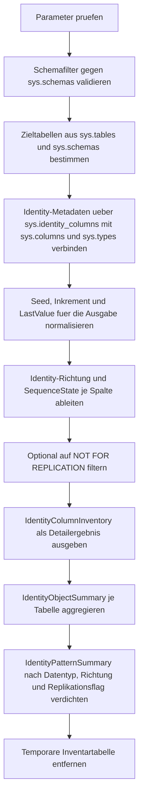

# SearchIdentityColumns.sql

Dieses Skript durchsucht die Metadaten der aktuell verbundenen Datenbank nach Identity-Spalten. Es zeigt pro Treffer Datentyp, Seed, Inkrement, den zuletzt bekannten Identity-Wert sowie Hinweise auf `NOT FOR REPLICATION`.

## Uebersicht

<!-- SQLDOC:SUMMARY_TABLE:BEGIN -->
| Feld | Wert |
|---|---|
| Script | [SearchIdentityColumns.sql](SearchIdentityColumns.sql) |
| Version | `1.0` |
| Typ | `diagnostic-query` |
| Kapitel | `15_SearchInTables` |
| Sicherheit | `read-only` |
| Zweck | Findet Identity-Spalten im gesamten Schema und verdichtet deren technische Eigenschaften. |
<!-- SQLDOC:SUMMARY_TABLE:END -->

## Einordnung

Das Artefakt eignet sich fuer Schema-Inventuren, Migrationsvorbereitung und technische Reviews, bei denen schnell sichtbar werden soll, welche Tabellen Identity-Spalten einsetzen. Statt produktive Insert-Logik zu unterstellen, arbeitet das Skript rein lesend auf Katalogsichten und stellt die technische Metadatenlage dar.

## Annahmen

- Die Erstversion analysiert nur die aktuell verbundene Datenbank ueber `sys.identity_columns`, `sys.columns`, `sys.tables`, `sys.schemas` und `sys.types`.
- `last_value` wird so ausgegeben, wie ihn die Metadaten aktuell liefern; bei unbenutzten oder nicht lesbaren Faellen bleibt der Zustand bewusst als Review-Hinweis markiert.
- Die Ausgabe ist auf Tabellen fokussiert, weil Identity-Spalten in SQL Server an Tabellenmetadaten gebunden sind.
- `SeedValue`, `IncrementValue` und `LastValue` werden fuer die Darstellung zusaetzlich als Text normalisiert, damit verschiedene numerische Basistypen einheitlich lesbar bleiben.

## Anwendungsfall

Das Skript eignet sich fuer Bestandsaufnahmen vor Datenmigrationen, fuer Reviews von Replikationsszenarien oder als Einstieg in Kapitel zu Metadaten- und Schema-Suche. Die Detailansicht zeigt schnell, ob Identity-Generierung aufsteigend, absteigend oder mit Replikationsausnahmen konfiguriert wurde.

## Parameter

<!-- SQLDOC:PARAMETERS_TABLE:BEGIN -->
| Parameter | SQL-Typ | Pflicht | Beschreibung |
|---|---|---|---|
| `@SchemaName` | `SYSNAME` | Nein | Optionaler Schemafilter; `NULL` durchsucht alle Benutzerschemas. |
| `@IncludeSystemShipped` | `BIT` | Nein | Bezieht bei `1` auch systemnahe Tabellen ein. |
| `@OnlyNotForReplication` | `BIT` | Nein | Zeigt bei `1` nur Identity-Spalten mit `NOT FOR REPLICATION`. |
<!-- SQLDOC:PARAMETERS_TABLE:END -->

## Abhaengigkeiten

<!-- SQLDOC:DEPENDENCIES_LIST:BEGIN -->
- `sys.identity_columns`
- `sys.columns`
- `sys.tables`
- `sys.schemas`
- `sys.types`
- `OBJECTPROPERTY()`
- `CASE`
- `TRY_CONVERT()`
<!-- SQLDOC:DEPENDENCIES_LIST:END -->

## Hinweise

- `IdentityColumnInventory` ist die Detailansicht je Identity-Spalte mit Seed, Inkrement, letztem Wert und technischer Richtung.
- `IdentityObjectSummary` verdichtet pro Tabelle, ob Standardmuster, Replikationsausnahmen oder auffaellige Mehrfach-Identity-Situationen vorliegen.
- `IdentityPatternSummary` gruppiert nach Datentyp, Richtung und Replikationsverhalten und eignet sich fuer Querschnittsanalysen.
- Mit `@OnlyNotForReplication = 1` laesst sich der Fokus gezielt auf Identity-Spalten fuer Replikationsszenarien legen.

## Versionshistorie

<!-- SQLDOC:VERSION_HISTORY_TABLE:BEGIN -->
| Version | Datum | User | Beschreibung |
|---|---|---|---|
| `1.0` | `2026-04-18` | `ER` | Erstversion eines diagnostischen Metadaten-Skripts fuer Identity-Spalten |
<!-- SQLDOC:VERSION_HISTORY_TABLE:END -->

## Ablauf

<!-- SQLDOC:MERMAID:BEGIN -->

<!-- SQLDOC:MERMAID:END -->

## SQL-Code

<!-- SQLDOC:SQL_CODE:BEGIN -->
```sql
/*
BEGIN:SQL-HEADER v1
---
sql_header: v1
script_name: "SearchIdentityColumns.sql"
script_version: "1.0"
script_type: "diagnostic-query"
chapter: "15_SearchInTables"

purpose: >
  Findet Identity-Spalten im gesamten Schema und zeigt Seeds, Inkremente,
  Replikationsverhalten sowie den zuletzt bekannten Identity-Wert.

parameters:
  - name: "@SchemaName"
    sql_type: "SYSNAME"
    direction: "IN"
    required: false
    description: "Optionaler Schemafilter; NULL durchsucht alle Benutzerschemas."
  - name: "@IncludeSystemShipped"
    sql_type: "BIT"
    direction: "IN"
    required: false
    description: "1 = systemnahe Objekte einbeziehen, 0 = nur nicht systemversandte Tabellen."
  - name: "@OnlyNotForReplication"
    sql_type: "BIT"
    direction: "IN"
    required: false
    description: "1 = nur Identity-Spalten mit NOT FOR REPLICATION zeigen, 0 = alle Identity-Spalten."

result_sets:
  - name: "IdentityColumnInventory"
    description: "Detailansicht aller gefundenen Identity-Spalten mit Datentyp, Seed, Inkrement und letztem Wert."
  - name: "IdentityObjectSummary"
    description: "Verdichtete Sicht je Tabelle auf Anzahl und Eigenschaften der Identity-Spalten."
  - name: "IdentityPatternSummary"
    description: "Zusammenfassung nach Datentyp, Inkrement-Richtung und Replikationsverhalten."

dependencies:
  - "sys.identity_columns"
  - "sys.columns"
  - "sys.tables"
  - "sys.schemas"
  - "sys.types"
  - "OBJECTPROPERTY()"
  - "CASE"
  - "TRY_CONVERT()"

safety:
  level: "read-only"
  writes_data: false

documentation:
  markdown_file: "T-SQL/15_SearchInTables/SQLScripts/SearchIdentityColumns.md"
  sync_blocks:
    - "SUMMARY_TABLE"
    - "PARAMETERS_TABLE"
    - "DEPENDENCIES_LIST"
    - "VERSION_HISTORY_TABLE"
    - "SQL_CODE"
  mermaid:
    mode: "ai-agent-from-sql"
    source: "script-body"

main_responsible:
  name: "Erhard Rainer"
  initials: "ER"

version_history:
  - version: "1.0"
    date: "2026-04-18"
    user: "ER"
    description: "Erstversion eines diagnostischen Metadaten-Skripts fuer Identity-Spalten."

notes:
  - "Die Erstversion arbeitet rein lesend auf den Katalogsichten der aktuell verbundenen Datenbank."
  - "Seed-, Increment- und LastValue-Werte werden fuer die Ausgabe zusaetzlich als Text normalisiert."
---
END:SQL-HEADER v1
*/

SET NOCOUNT ON;

DECLARE @SchemaName SYSNAME = NULL;
DECLARE @IncludeSystemShipped BIT = 0;
DECLARE @OnlyNotForReplication BIT = 0;

IF @IncludeSystemShipped NOT IN (0, 1)
BEGIN
    THROW 50000, '@IncludeSystemShipped muss 0 oder 1 sein.', 1;
END;

IF @OnlyNotForReplication NOT IN (0, 1)
BEGIN
    THROW 50001, '@OnlyNotForReplication muss 0 oder 1 sein.', 1;
END;

IF @SchemaName IS NOT NULL AND NOT EXISTS
(
    SELECT 1
    FROM sys.schemas AS s
    WHERE s.name = @SchemaName
)
BEGIN
    THROW 50002, '@SchemaName wurde in der aktuellen Datenbank nicht gefunden.', 1;
END;

WITH TargetTables AS
(
    SELECT
        t.object_id,
        s.name AS SchemaName,
        t.name AS TableName,
        t.create_date,
        t.modify_date
    FROM sys.tables AS t
    INNER JOIN sys.schemas AS s
        ON s.schema_id = t.schema_id
    WHERE (@SchemaName IS NULL OR s.name = @SchemaName)
      AND (@IncludeSystemShipped = 1 OR OBJECTPROPERTY(t.object_id, 'IsMsShipped') = 0)
),
IdentityColumns AS
(
    SELECT
        tt.SchemaName,
        tt.TableName,
        c.column_id AS ColumnOrdinal,
        c.name AS ColumnName,
        ty.name AS DataTypeName,
        c.max_length,
        c.precision,
        c.scale,
        c.is_nullable,
        c.is_computed,
        ic.is_not_for_replication,
        CONVERT(NVARCHAR(100), ic.seed_value) AS SeedValueText,
        CONVERT(NVARCHAR(100), ic.increment_value) AS IncrementValueText,
        CONVERT(NVARCHAR(100), ic.last_value) AS LastValueText,
        TRY_CONVERT(DECIMAL(38, 10), CONVERT(NVARCHAR(100), ic.seed_value)) AS SeedValueDecimal,
        TRY_CONVERT(DECIMAL(38, 10), CONVERT(NVARCHAR(100), ic.increment_value)) AS IncrementValueDecimal,
        TRY_CONVERT(DECIMAL(38, 10), CONVERT(NVARCHAR(100), ic.last_value)) AS LastValueDecimal,
        tt.create_date,
        tt.modify_date
    FROM TargetTables AS tt
    INNER JOIN sys.identity_columns AS ic
        ON ic.object_id = tt.object_id
    INNER JOIN sys.columns AS c
        ON c.object_id = ic.object_id
       AND c.column_id = ic.column_id
    INNER JOIN sys.types AS ty
        ON ty.user_type_id = c.user_type_id
),
PreparedInventory AS
(
    SELECT
        ic.SchemaName,
        ic.TableName,
        ic.ColumnOrdinal,
        ic.ColumnName,
        CASE
            WHEN ic.DataTypeName IN (N'nvarchar', N'varchar', N'nchar', N'char')
                THEN CONCAT(ic.DataTypeName, N'(', CASE WHEN ic.max_length = -1 THEN N'max' ELSE CONVERT(NVARCHAR(10), ic.max_length / CASE WHEN ic.DataTypeName LIKE N'n%' THEN 2 ELSE 1 END) END, N')')
            WHEN ic.DataTypeName IN (N'decimal', N'numeric')
                THEN CONCAT(ic.DataTypeName, N'(', CONVERT(NVARCHAR(10), ic.precision), N',', CONVERT(NVARCHAR(10), ic.scale), N')')
            WHEN ic.DataTypeName IN (N'datetime2', N'datetimeoffset', N'time')
                THEN CONCAT(ic.DataTypeName, N'(', CONVERT(NVARCHAR(10), ic.scale), N')')
            ELSE ic.DataTypeName
        END AS DataTypeDisplay,
        ic.is_nullable AS IsNullable,
        ic.is_computed AS IsComputed,
        ic.is_not_for_replication AS IsNotForReplication,
        ic.SeedValueText,
        ic.IncrementValueText,
        ic.LastValueText,
        ic.SeedValueDecimal,
        ic.IncrementValueDecimal,
        ic.LastValueDecimal,
        CASE
            WHEN ic.IncrementValueDecimal > 0 THEN N'ascending'
            WHEN ic.IncrementValueDecimal < 0 THEN N'descending'
            ELSE N'static_or_unknown'
        END AS IdentityDirection,
        CASE
            WHEN ic.LastValueDecimal IS NULL THEN N'not_yet_materialized_or_unreadable'
            WHEN ic.IncrementValueDecimal > 0 AND ic.LastValueDecimal >= ic.SeedValueDecimal THEN N'active_sequence'
            WHEN ic.IncrementValueDecimal < 0 AND ic.LastValueDecimal <= ic.SeedValueDecimal THEN N'active_sequence'
            ELSE N'review_sequence_state'
        END AS SequenceState,
        ic.create_date,
        ic.modify_date
    FROM IdentityColumns AS ic
)
SELECT
    pi.SchemaName,
    pi.TableName,
    pi.ColumnOrdinal,
    pi.ColumnName,
    pi.DataTypeDisplay,
    pi.IsNullable,
    pi.IsComputed,
    pi.IsNotForReplication,
    pi.SeedValueText,
    pi.IncrementValueText,
    pi.LastValueText,
    pi.IdentityDirection,
    pi.SequenceState,
    pi.create_date AS TableCreatedAt,
    pi.modify_date AS TableModifiedAt
INTO #IdentityInventory
FROM PreparedInventory AS pi
WHERE @OnlyNotForReplication = 0
   OR pi.IsNotForReplication = 1;

SELECT
    ii.SchemaName,
    ii.TableName,
    ii.ColumnOrdinal,
    ii.ColumnName,
    ii.DataTypeDisplay,
    ii.IsNullable,
    ii.IsComputed,
    ii.IsNotForReplication,
    ii.SeedValueText,
    ii.IncrementValueText,
    ii.LastValueText,
    ii.IdentityDirection,
    ii.SequenceState,
    ii.TableCreatedAt,
    ii.TableModifiedAt
FROM #IdentityInventory AS ii
ORDER BY
    ii.SchemaName,
    ii.TableName,
    ii.ColumnOrdinal;

SELECT
    ii.SchemaName,
    ii.TableName,
    COUNT(*) AS IdentityColumnCount,
    SUM(CASE WHEN ii.IsNotForReplication = 1 THEN 1 ELSE 0 END) AS NotForReplicationCount,
    SUM(CASE WHEN ii.IdentityDirection = N'ascending' THEN 1 ELSE 0 END) AS AscendingIdentityCount,
    SUM(CASE WHEN ii.IdentityDirection = N'descending' THEN 1 ELSE 0 END) AS DescendingIdentityCount,
    SUM(CASE WHEN ii.SequenceState = N'not_yet_materialized_or_unreadable' THEN 1 ELSE 0 END) AS UnreadableOrUnusedCount,
    MIN(ii.ColumnName) AS FirstIdentityColumn,
    CASE
        WHEN COUNT(*) > 1 THEN N'multiple_identity_columns_review_needed'
        WHEN SUM(CASE WHEN ii.IsNotForReplication = 1 THEN 1 ELSE 0 END) > 0 THEN N'identity_with_replication_override'
        WHEN SUM(CASE WHEN ii.IdentityDirection = N'descending' THEN 1 ELSE 0 END) > 0 THEN N'descending_identity_pattern'
        ELSE N'standard_single_identity'
    END AS IdentityFootprint
FROM #IdentityInventory AS ii
GROUP BY
    ii.SchemaName,
    ii.TableName
ORDER BY
    IdentityColumnCount DESC,
    ii.SchemaName,
    ii.TableName;

SELECT
    ii.DataTypeDisplay,
    ii.IdentityDirection,
    ii.IsNotForReplication,
    COUNT(*) AS IdentityColumnCount,
    COUNT(DISTINCT CONCAT(ii.SchemaName, N'.', ii.TableName)) AS DistinctTables,
    MIN(CONCAT(ii.SchemaName, N'.', ii.TableName, N'.', ii.ColumnName)) AS ExampleIdentityColumn
FROM #IdentityInventory AS ii
GROUP BY
    ii.DataTypeDisplay,
    ii.IdentityDirection,
    ii.IsNotForReplication
ORDER BY
    IdentityColumnCount DESC,
    ii.DataTypeDisplay,
    ii.IdentityDirection,
    ii.IsNotForReplication;

DROP TABLE IF EXISTS #IdentityInventory;
```
<!-- SQLDOC:SQL_CODE:END -->
