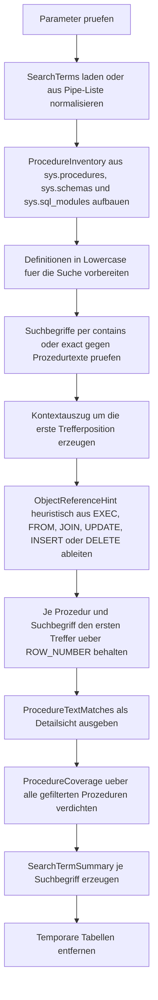

# SearchProcedureText.sql

Dieses Skript durchsucht Prozedurdefinitionen der aktuell verbundenen Datenbank nach frei definierbaren Textmustern. Die Erstversion bleibt bewusst rein lesend, liefert pro Treffer einen kompakten Kontextauszug und markiert heuristisch, ob der Treffer eher wie ein Objektverweis in `EXEC`, `FROM`, `JOIN`, `UPDATE`, `INSERT` oder `DELETE` wirkt.

## Uebersicht

<!-- SQLDOC:SUMMARY_TABLE:BEGIN -->
| Feld | Wert |
|---|---|
| Script | [SearchProcedureText.sql](SearchProcedureText.sql) |
| Version | `1.0` |
| Typ | `diagnostic-query` |
| Kapitel | `15_SearchInTables` |
| Sicherheit | `read-only` |
| Zweck | Durchsucht Prozedurdefinitionen nach Textmustern oder vermuteten Objektverweisen und verdichtet die Treffer pro Prozedur. |
<!-- SQLDOC:SUMMARY_TABLE:END -->

## Einordnung

Das Artefakt eignet sich fuer Refactoring-Reviews, Impact-Analysen und die Suche nach impliziten Objektbeziehungen in gespeicherten Prozeduren. Statt Abhaengigkeiten produktiv zu veraendern, analysiert das Skript ausschliesslich Metadaten und Quelltexte aus der aktuell verbundenen Datenbank.

## Annahmen

- Die Erstversion arbeitet nur mit `sys.procedures`, `sys.schemas` und `sys.sql_modules` der aktuellen Datenbank.
- Verschluesselte oder anderweitig nicht verfuegbare Definitionen werden nicht als Texttreffer durchsucht und in der Coverage-Sicht als `definition_unavailable` markiert.
- `ObjectReferenceHint` ist bewusst heuristisch und leitet sich nur aus dem unmittelbaren Textumfeld des ersten Treffers je Prozedur und Suchbegriff ab.
- Ohne explizite `@SearchTerms` verwendet das Skript ein didaktisches Standardset aus Referenz-, Lifecycle-, Audit- und Flow-Begriffen.

## Anwendungsfall

Das Skript ist hilfreich, wenn vor Umbenennungen, Archivierungsprojekten oder Datenmodell-Anpassungen schnell sichtbar werden soll, welche Prozeduren bestimmte Begriffe, Tabellen- oder Objektbezeichnungen im Code verwenden. Mit `@SchemaName` und `@ProcedureNamePattern` laesst sich die Suche auf Teilbereiche eingrenzen.

## Parameter

<!-- SQLDOC:PARAMETERS_TABLE:BEGIN -->
| Parameter | SQL-Typ | Pflicht | Beschreibung |
|---|---|---|---|
| `@SearchTerms` | `NVARCHAR(MAX)` | Nein | Pipe-separierte Suchbegriffe wie `Customer|usp_Audit|Archive`; `NULL` verwendet ein didaktisches Standardset. |
| `@SchemaName` | `SYSNAME` | Nein | Optionaler Schemafilter; `NULL` durchsucht alle Schemas. |
| `@ProcedureNamePattern` | `NVARCHAR(256)` | Nein | Optionales `LIKE`-Muster fuer Prozedurnamen wie `uspSales%`. |
| `@MatchMode` | `NVARCHAR(10)` | Nein | Verwendet `contains` oder `exact` fuer die Suche innerhalb der Definition. |
<!-- SQLDOC:PARAMETERS_TABLE:END -->

## Abhaengigkeiten

<!-- SQLDOC:DEPENDENCIES_LIST:BEGIN -->
- `sys.procedures`
- `sys.schemas`
- `sys.sql_modules`
- `STRING_SPLIT()`
- `ROW_NUMBER()`
- `CHARINDEX()`
- `LIKE`
- `SUBSTRING()`
- `REPLACE()`
<!-- SQLDOC:DEPENDENCIES_LIST:END -->

## Hinweise

- `ProcedureTextMatches` liefert pro Prozedur und Suchbegriff genau den ersten Treffer mit Position, Kontextklassifikation und Textauszug.
- `ProcedureCoverage` zeigt auch Prozeduren ohne Treffer oder ohne verfuegbare Definition und eignet sich damit fuer Vollstaendigkeits-Reviews.
- `SearchTermSummary` macht sichtbar, welche Suchbegriffe Treffer liefern und welches Beispiel den Suchbegriff zuerst repraesentiert.
- Mit `@MatchMode = 'exact'` wird ein Treffer nur gewertet, wenn direkt vor und nach dem Begriff kein alphanumerisches oder `_`-Zeichen steht.

## Versionshistorie

<!-- SQLDOC:VERSION_HISTORY_TABLE:BEGIN -->
| Version | Datum | User | Beschreibung |
|---|---|---|---|
| `1.0` | `2026-04-18` | `ER` | Erstversion eines diagnostischen Suchskripts fuer Prozedurdefinitionen. |
<!-- SQLDOC:VERSION_HISTORY_TABLE:END -->

## Ablauf

<!-- SQLDOC:MERMAID:BEGIN -->

<!-- SQLDOC:MERMAID:END -->

## SQL-Code

<!-- SQLDOC:SQL_CODE:BEGIN -->
```sql
/*
BEGIN:SQL-HEADER v1
---
sql_header: v1
script_name: "SearchProcedureText.sql"
script_version: "1.0"
script_type: "diagnostic-query"
chapter: "15_SearchInTables"

purpose: >
  Durchsucht Prozedurdefinitionen der aktuell verbundenen Datenbank nach frei
  definierbaren Textmustern oder vermuteten Objektverweisen und zeigt
  Detailtreffer mit Kontextauszug sowie verdichtete Treffermengen pro Prozedur.

parameters:
  - name: "@SearchTerms"
    sql_type: "NVARCHAR(MAX)"
    direction: "IN"
    required: false
    description: "Pipe-separierte Suchbegriffe wie Customer|usp_Audit|Archive; NULL verwendet ein didaktisches Standardset."
  - name: "@SchemaName"
    sql_type: "SYSNAME"
    direction: "IN"
    required: false
    description: "Optionaler Schemafilter; NULL durchsucht alle Schemas."
  - name: "@ProcedureNamePattern"
    sql_type: "NVARCHAR(256)"
    direction: "IN"
    required: false
    description: "Optionales LIKE-Muster fuer Prozedurnamen wie uspSales%."
  - name: "@MatchMode"
    sql_type: "NVARCHAR(10)"
    direction: "IN"
    required: false
    description: "contains oder exact fuer Suchbegriffe innerhalb der Definition."

result_sets:
  - name: "ProcedureTextMatches"
    description: "Detailtreffer je Prozedur inklusive Suchbegriff, Trefferposition, Kontexthinweis und Auszug."
  - name: "ProcedureCoverage"
    description: "Verdichtete Sicht pro Prozedur mit Trefferanzahl, Suchbegriffen und Status der Definition."
  - name: "SearchTermSummary"
    description: "Zusammenfassung je Suchbegriff ueber betroffene Prozeduren und Beispieltreffer."

dependencies:
  - "sys.procedures"
  - "sys.schemas"
  - "sys.sql_modules"
  - "STRING_SPLIT()"
  - "ROW_NUMBER()"
  - "CHARINDEX()"
  - "LIKE"
  - "SUBSTRING()"
  - "REPLACE()"

safety:
  level: "read-only"
  writes_data: false

documentation:
  markdown_file: "T-SQL/15_SearchInTables/SQLScripts/SearchProcedureText.md"
  sync_blocks:
    - "SUMMARY_TABLE"
    - "PARAMETERS_TABLE"
    - "DEPENDENCIES_LIST"
    - "VERSION_HISTORY_TABLE"
    - "SQL_CODE"
  mermaid:
    mode: "ai-agent-from-sql"
    source: "script-body"

main_responsible:
  name: "Erhard Rainer"
  initials: "ER"

version_history:
  - version: "1.0"
    date: "2026-04-18"
    user: "ER"
    description: "Erstversion eines diagnostischen Suchskripts fuer Prozedurdefinitionen."

notes:
  - "Die Erstversion arbeitet rein lesend auf sys.procedures, sys.schemas und sys.sql_modules."
  - "ObjectReferenceHint ist eine heuristische Kontextklassifikation aus dem Textumfeld des Treffers."
---
END:SQL-HEADER v1
*/

SET NOCOUNT ON;

DECLARE @SearchTerms NVARCHAR(MAX) = NULL;
DECLARE @SchemaName SYSNAME = NULL;
DECLARE @ProcedureNamePattern NVARCHAR(256) = NULL;
DECLARE @MatchMode NVARCHAR(10) = N'contains';

SET @MatchMode = LOWER(COALESCE(@MatchMode, N'contains'));

IF @MatchMode NOT IN (N'contains', N'exact')
BEGIN
    THROW 50000, '@MatchMode muss contains oder exact sein.', 1;
END;

IF @SchemaName IS NOT NULL
   AND NOT EXISTS
(
    SELECT 1
    FROM sys.schemas AS s
    WHERE s.name = @SchemaName
)
BEGIN
    THROW 50001, '@SchemaName wurde in der aktuellen Datenbank nicht gefunden.', 1;
END;

DROP TABLE IF EXISTS #SearchTerms;
CREATE TABLE #SearchTerms
(
    SearchTerm NVARCHAR(256) NOT NULL PRIMARY KEY,
    SearchCategory NVARCHAR(30) NOT NULL,
    PriorityRank INT NOT NULL
);

IF NULLIF(LTRIM(RTRIM(COALESCE(@SearchTerms, N''))), N'') IS NULL
BEGIN
    INSERT INTO #SearchTerms (SearchTerm, SearchCategory, PriorityRank)
    VALUES
        (N'customer', N'reference_term', 10),
        (N'order', N'reference_term', 11),
        (N'archive', N'lifecycle_term', 12),
        (N'audit', N'audit_term', 13),
        (N'execute', N'flow_term', 14),
        (N'join', N'flow_term', 15);
END;
ELSE
BEGIN
    INSERT INTO #SearchTerms (SearchTerm, SearchCategory, PriorityRank)
    SELECT
        src.SearchTerm,
        CASE
            WHEN src.SearchTerm IN (N'audit', N'created', N'updated', N'modified') THEN N'audit_term'
            WHEN src.SearchTerm IN (N'archive', N'archived', N'deleted', N'purge') THEN N'lifecycle_term'
            WHEN src.SearchTerm IN (N'execute', N'exec', N'join', N'from', N'update', N'insert', N'delete') THEN N'flow_term'
            ELSE N'reference_term'
        END AS SearchCategory,
        100 + ROW_NUMBER() OVER (ORDER BY src.SearchTerm) AS PriorityRank
    FROM
    (
        SELECT DISTINCT
            LOWER(LTRIM(RTRIM(value))) AS SearchTerm
        FROM STRING_SPLIT(@SearchTerms, N'|')
        WHERE NULLIF(LTRIM(RTRIM(value)), N'') IS NOT NULL
    ) AS src;
END;

IF NOT EXISTS (SELECT 1 FROM #SearchTerms)
BEGIN
    THROW 50002, 'Es wurde kein gueltiger Suchbegriff fuer @SearchTerms ermittelt.', 1;
END;

DROP TABLE IF EXISTS #ProcedureInventory;
SELECT
    p.object_id AS ProcedureObjectId,
    s.name AS SchemaName,
    p.name AS ProcedureName,
    QUOTENAME(s.name) + N'.' + QUOTENAME(p.name) AS FullProcedureName,
    m.definition AS ProcedureDefinition,
    CASE WHEN m.definition IS NULL THEN 1 ELSE 0 END AS DefinitionUnavailable,
    LOWER(COALESCE(m.definition, N'')) AS LowerDefinition
INTO #ProcedureInventory
FROM sys.procedures AS p
INNER JOIN sys.schemas AS s
    ON s.schema_id = p.schema_id
LEFT JOIN sys.sql_modules AS m
    ON m.object_id = p.object_id
WHERE (@SchemaName IS NULL OR s.name = @SchemaName)
  AND (@ProcedureNamePattern IS NULL OR p.name LIKE @ProcedureNamePattern);

;WITH RawMatches AS
(
    SELECT
        np.SchemaName,
        np.ProcedureName,
        np.FullProcedureName,
        np.DefinitionUnavailable,
        st.SearchTerm,
        st.SearchCategory,
        st.PriorityRank,
        CHARINDEX(st.SearchTerm, np.LowerDefinition) AS MatchPosition,
        np.ProcedureDefinition
    FROM #ProcedureInventory AS np
    INNER JOIN #SearchTerms AS st
        ON np.DefinitionUnavailable = 0
       AND
       (
            (@MatchMode = N'contains' AND CHARINDEX(st.SearchTerm, np.LowerDefinition) > 0)
            OR
            (
                @MatchMode = N'exact'
                AND CHARINDEX(st.SearchTerm, np.LowerDefinition) > 0
                AND
                (
                    CHARINDEX(st.SearchTerm, np.LowerDefinition) = 1
                    OR SUBSTRING(np.LowerDefinition, CHARINDEX(st.SearchTerm, np.LowerDefinition) - 1, 1) LIKE N'[^a-z0-9_]'
                )
                AND
                (
                    CHARINDEX(st.SearchTerm, np.LowerDefinition) + LEN(st.SearchTerm) > LEN(np.LowerDefinition)
                    OR SUBSTRING(np.LowerDefinition, CHARINDEX(st.SearchTerm, np.LowerDefinition) + LEN(st.SearchTerm), 1) LIKE N'[^a-z0-9_]'
                )
            )
       )
),
ContextMatches AS
(
    SELECT
        rm.SchemaName,
        rm.ProcedureName,
        rm.FullProcedureName,
        rm.SearchTerm,
        rm.SearchCategory,
        rm.PriorityRank,
        rm.MatchPosition,
        LTRIM(RTRIM(REPLACE(REPLACE(
            SUBSTRING(
                rm.ProcedureDefinition,
                CASE WHEN rm.MatchPosition > 60 THEN rm.MatchPosition - 60 ELSE 1 END,
                LEN(rm.SearchTerm) + 120
            ),
            CHAR(13), N' '
        ), CHAR(10), N' '))) AS DefinitionExcerpt
    FROM RawMatches AS rm
),
RankedMatches AS
(
    SELECT
        cm.*,
        CASE
            WHEN LOWER(cm.DefinitionExcerpt) LIKE N'% execute %' OR LOWER(cm.DefinitionExcerpt) LIKE N'% exec %' THEN N'exec_context'
            WHEN LOWER(cm.DefinitionExcerpt) LIKE N'% join %' THEN N'join_context'
            WHEN LOWER(cm.DefinitionExcerpt) LIKE N'% from %' THEN N'from_context'
            WHEN LOWER(cm.DefinitionExcerpt) LIKE N'% update %' THEN N'update_context'
            WHEN LOWER(cm.DefinitionExcerpt) LIKE N'% insert into %' THEN N'insert_context'
            WHEN LOWER(cm.DefinitionExcerpt) LIKE N'% delete from %' THEN N'delete_context'
            ELSE N'general_text_context'
        END AS ObjectReferenceHint,
        ROW_NUMBER() OVER
        (
            PARTITION BY cm.SchemaName, cm.ProcedureName, cm.SearchTerm
            ORDER BY cm.MatchPosition, cm.PriorityRank
        ) AS MatchRank
    FROM ContextMatches AS cm
),
BestMatches AS
(
    SELECT
        rm.SchemaName,
        rm.ProcedureName,
        rm.FullProcedureName,
        rm.SearchTerm,
        rm.SearchCategory,
        rm.MatchPosition,
        rm.ObjectReferenceHint,
        rm.DefinitionExcerpt
    FROM RankedMatches AS rm
    WHERE rm.MatchRank = 1
)
SELECT
    bm.SchemaName,
    bm.ProcedureName,
    bm.FullProcedureName,
    bm.SearchTerm,
    bm.SearchCategory,
    bm.MatchPosition,
    bm.ObjectReferenceHint,
    bm.DefinitionExcerpt
INTO #BestMatches
FROM BestMatches AS bm;

SELECT
    bm.SchemaName,
    bm.ProcedureName,
    bm.FullProcedureName,
    bm.SearchTerm,
    bm.SearchCategory,
    bm.MatchPosition,
    bm.ObjectReferenceHint,
    bm.DefinitionExcerpt
FROM #BestMatches AS bm
ORDER BY
    bm.SchemaName,
    bm.ProcedureName,
    bm.SearchTerm;

SELECT
    pi.SchemaName,
    pi.ProcedureName,
    pi.FullProcedureName,
    CASE
        WHEN pi.DefinitionUnavailable = 1 THEN N'definition_unavailable'
        WHEN EXISTS
        (
            SELECT 1
            FROM #BestMatches AS bm
            WHERE bm.FullProcedureName = pi.FullProcedureName
        ) THEN N'match_found'
        ELSE N'no_match'
    END AS CoverageStatus,
    COUNT(DISTINCT bm.SearchTerm) AS MatchedSearchTerms,
    MIN(bm.SearchTerm) AS FirstMatchedSearchTerm,
    MIN(bm.ObjectReferenceHint) AS FirstReferenceHint
FROM #ProcedureInventory AS pi
LEFT JOIN #BestMatches AS bm
    ON bm.FullProcedureName = pi.FullProcedureName
GROUP BY
    pi.SchemaName,
    pi.ProcedureName,
    pi.FullProcedureName,
    pi.DefinitionUnavailable
ORDER BY
    CASE
        WHEN pi.DefinitionUnavailable = 1 THEN 1
        WHEN COUNT(DISTINCT bm.SearchTerm) > 0 THEN 2
        ELSE 3
    END,
    MatchedSearchTerms DESC,
    pi.SchemaName,
    pi.ProcedureName;

SELECT
    st.SearchTerm,
    st.SearchCategory,
    COUNT(DISTINCT bm.FullProcedureName) AS MatchedProcedures,
    COUNT(DISTINCT CASE WHEN pi.DefinitionUnavailable = 0 THEN pi.FullProcedureName END) AS SearchableProcedures,
    MIN(bm.FullProcedureName) AS ExampleProcedure,
    MIN(bm.ObjectReferenceHint) AS ExampleReferenceHint
FROM #SearchTerms AS st
CROSS JOIN #ProcedureInventory AS pi
LEFT JOIN #BestMatches AS bm
    ON bm.SearchTerm = st.SearchTerm
   AND bm.FullProcedureName = pi.FullProcedureName
GROUP BY
    st.SearchTerm,
    st.SearchCategory,
    st.PriorityRank
ORDER BY
    st.PriorityRank,
    st.SearchTerm;

DROP TABLE IF EXISTS #BestMatches;
DROP TABLE IF EXISTS #ProcedureInventory;
DROP TABLE IF EXISTS #SearchTerms;
```
<!-- SQLDOC:SQL_CODE:END -->
