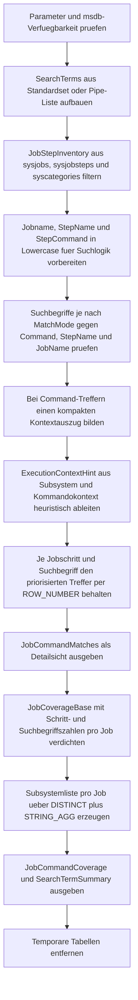

# SearchSqlAgentJobCommands.sql

Dieses Skript durchsucht SQL-Agent-Jobschritte in `msdb` nach frei definierbaren Text-, Objekt- oder Ablaufmustern. Die Erstversion bleibt rein lesend und verdichtet Treffer sowohl auf Schritt- als auch auf Job-Ebene, damit Wartungs-, Betriebs- oder Refactoring-Reviews schnell einen belastbaren Einstiegspunkt erhalten.

## Uebersicht

<!-- SQLDOC:SUMMARY_TABLE:BEGIN -->
| Feld | Wert |
|---|---|
| Script | [SearchSqlAgentJobCommands.sql](SearchSqlAgentJobCommands.sql) |
| Version | `1.0` |
| Typ | `diagnostic-query` |
| Kapitel | `15_SearchInTables` |
| Sicherheit | `read-only` |
| Zweck | Durchsucht SQL-Agent-Jobschritte in `msdb` nach Text- und Objektmustern und liefert Detail- sowie Coverage-Sichten. |
<!-- SQLDOC:SUMMARY_TABLE:END -->

## Einordnung

Das Artefakt eignet sich fuer Impact-Analysen rund um Wartungsjobs, ETL-Ketten, Archivierungslaeufe oder technische Betriebsaufgaben. Statt Jobdefinitionen zu aendern, analysiert das Skript ausschliesslich Metadaten aus `msdb.dbo.sysjobs`, `msdb.dbo.sysjobsteps` und den zugeordneten Kategorien.

## Annahmen

- Die Erstversion liest ausschliesslich aus `msdb` und setzt voraus, dass SQL-Agent-Metadaten auf der Zielinstanz verfuegbar sind.
- Suchbegriffe werden standardmaessig mit einem didaktischen Set aus Betriebs-, Lifecycle-, Objekt- und Subsystem-Begriffen vorbelegt, wenn `@SearchTerms` leer bleibt.
- `ExecutionContextHint` ist heuristisch und leitet sich nur aus `StepSubsystem` und dem sichtbaren Kommandokontext des ersten relevanten Treffers ab.
- Die Coverage-Sicht verdichtet pro Job nur die im aktuellen Filter liegenden Schritte; deaktivierte Jobs erscheinen nur bei `@EnabledOnly = 0`.

## Anwendungsfall

Das Skript hilft, wenn vor Migrationen, Objektumbenennungen, Backup-/Archivierungs-Aenderungen oder Agent-Haertungen sichtbar werden soll, welche Jobs und Jobschritte bestimmte Befehle, Objektpraefixe oder Textmuster verwenden. Mit `@JobNamePattern`, `@StepSubsystem` und `@EnabledOnly` laesst sich der Suchraum gezielt eingrenzen.

## Parameter

<!-- SQLDOC:PARAMETERS_TABLE:BEGIN -->
| Parameter | SQL-Typ | Pflicht | Beschreibung |
|---|---|---|---|
| `@SearchTerms` | `NVARCHAR(MAX)` | Nein | Pipe-separierte Suchbegriffe wie `Customer|usp_LoadSales|Archive`; `NULL` verwendet ein didaktisches Standardset. |
| `@JobNamePattern` | `NVARCHAR(256)` | Nein | Optionales `LIKE`-Muster fuer Jobnamen wie `ETL%` oder `%Archive%`. |
| `@StepSubsystem` | `NVARCHAR(20)` | Nein | `ALL` oder ein konkretes Subsystem wie `TSQL`, `POWERSHELL`, `CMDEXEC` oder `SSIS`. |
| `@EnabledOnly` | `BIT` | Nein | `1` zeigt nur aktivierte Jobs; `0` schliesst deaktivierte Jobs mit ein. |
| `@MatchMode` | `NVARCHAR(10)` | Nein | Verwendet `contains` oder `exact` fuer die Suche in Jobname, StepName und StepCommand. |
<!-- SQLDOC:PARAMETERS_TABLE:END -->

## Abhaengigkeiten

<!-- SQLDOC:DEPENDENCIES_LIST:BEGIN -->
- `msdb.dbo.sysjobs`
- `msdb.dbo.sysjobsteps`
- `msdb.dbo.syscategories`
- `STRING_SPLIT()`
- `ROW_NUMBER()`
- `CHARINDEX()`
- `LIKE`
- `SUBSTRING()`
- `REPLACE()`
<!-- SQLDOC:DEPENDENCIES_LIST:END -->

## Hinweise

- `JobCommandMatches` liefert pro Jobschritt und Suchbegriff genau den priorisierten Treffer mit Trefferort, Subsystem und kompaktem Kommandoauszug.
- `JobCommandCoverage` verdichtet den aktuellen Suchraum pro Job und zeigt, wie viele Schritte, Suchbegriffe und Subsysteme betroffen sind.
- `SearchTermSummary` macht sichtbar, welche Suchbegriffe ueberhaupt Jobs treffen und liefert einen Beispielschritt fuer Reviews.
- Mit `@MatchMode = 'exact'` werden in `StepCommand` nur Wortgrenzen akzeptiert; fuer `JobName` und `StepName` ist exact ein Gleichheitsvergleich.

## Versionshistorie

<!-- SQLDOC:VERSION_HISTORY_TABLE:BEGIN -->
| Version | Datum | User | Beschreibung |
|---|---|---|---|
| `1.0` | `2026-04-18` | `ER` | Erstversion eines diagnostischen Suchskripts fuer SQL-Agent-Jobkommandos. |
<!-- SQLDOC:VERSION_HISTORY_TABLE:END -->

## Ablauf

<!-- SQLDOC:MERMAID:BEGIN -->

<!-- SQLDOC:MERMAID:END -->

## SQL-Code

<!-- SQLDOC:SQL_CODE:BEGIN -->
```sql
/*
BEGIN:SQL-HEADER v1
---
sql_header: v1
script_name: "SearchSqlAgentJobCommands.sql"
script_version: "1.0"
script_type: "diagnostic-query"
chapter: "15_SearchInTables"

purpose: >
  Durchsucht SQL-Agent-Jobschritte in msdb nach frei definierbaren Objekt-
  oder Textmustern und zeigt sowohl Detailtreffer als auch verdichtete
  Job- und Suchbegriff-Sichten.

parameters:
  - name: "@SearchTerms"
    sql_type: "NVARCHAR(MAX)"
    direction: "IN"
    required: false
    description: "Pipe-separierte Suchbegriffe wie Customer|usp_LoadSales|Archive; NULL verwendet ein didaktisches Standardset."
  - name: "@JobNamePattern"
    sql_type: "NVARCHAR(256)"
    direction: "IN"
    required: false
    description: "Optionales LIKE-Muster fuer Jobnamen wie ETL% oder %Archive%."
  - name: "@StepSubsystem"
    sql_type: "NVARCHAR(20)"
    direction: "IN"
    required: false
    description: "ALL oder ein konkretes Subsystem wie TSQL, POWERSHELL, CMDEXEC oder SSIS."
  - name: "@EnabledOnly"
    sql_type: "BIT"
    direction: "IN"
    required: false
    description: "1 zeigt nur aktivierte Jobs; 0 schliesst deaktivierte Jobs mit ein."
  - name: "@MatchMode"
    sql_type: "NVARCHAR(10)"
    direction: "IN"
    required: false
    description: "contains oder exact fuer die Suche in Jobname, StepName und StepCommand."

result_sets:
  - name: "JobCommandMatches"
    description: "Detailtreffer je Jobschritt inklusive Trefferort, Kontextklassifikation und Kommandokontext."
  - name: "JobCommandCoverage"
    description: "Verdichtete Sicht je Job mit betroffenen Schritten, Suchbegriffen und Subsystemen."
  - name: "SearchTermSummary"
    description: "Zusammenfassung je Suchbegriff ueber betroffene Jobs, Schritte und Beispieltreffer."

dependencies:
  - "msdb.dbo.sysjobs"
  - "msdb.dbo.sysjobsteps"
  - "msdb.dbo.syscategories"
  - "STRING_SPLIT()"
  - "ROW_NUMBER()"
  - "CHARINDEX()"
  - "LIKE"
  - "SUBSTRING()"
  - "REPLACE()"

safety:
  level: "read-only"
  writes_data: false

documentation:
  markdown_file: "T-SQL/15_SearchInTables/SQLScripts/SearchSqlAgentJobCommands.md"
  sync_blocks:
    - "SUMMARY_TABLE"
    - "PARAMETERS_TABLE"
    - "DEPENDENCIES_LIST"
    - "VERSION_HISTORY_TABLE"
    - "SQL_CODE"
  mermaid:
    mode: "ai-agent-from-sql"
    source: "script-body"

main_responsible:
  name: "Erhard Rainer"
  initials: "ER"

version_history:
  - version: "1.0"
    date: "2026-04-18"
    user: "ER"
    description: "Erstversion eines diagnostischen Suchskripts fuer SQL-Agent-Jobkommandos."

notes:
  - "Die Erstversion arbeitet rein lesend auf msdb-Metadaten von Jobs und Jobschritten."
  - "ExecutionContextHint wird heuristisch aus Subsystem und Kommandotext des Schritts abgeleitet."
---
END:SQL-HEADER v1
*/

SET NOCOUNT ON;

DECLARE @SearchTerms NVARCHAR(MAX) = NULL;
DECLARE @JobNamePattern NVARCHAR(256) = NULL;
DECLARE @StepSubsystem NVARCHAR(20) = N'ALL';
DECLARE @EnabledOnly BIT = 1;
DECLARE @MatchMode NVARCHAR(10) = N'contains';

SET @StepSubsystem = UPPER(COALESCE(@StepSubsystem, N'ALL'));
SET @MatchMode = LOWER(COALESCE(@MatchMode, N'contains'));
SET @EnabledOnly = COALESCE(@EnabledOnly, 1);

IF DB_ID(N'msdb') IS NULL
BEGIN
    THROW 50000, 'Die Systemdatenbank msdb ist in dieser SQL-Server-Instanz nicht verfuegbar.', 1;
END;

IF @MatchMode NOT IN (N'contains', N'exact')
BEGIN
    THROW 50001, '@MatchMode muss contains oder exact sein.', 1;
END;

IF @EnabledOnly NOT IN (0, 1)
BEGIN
    THROW 50002, '@EnabledOnly muss 0 oder 1 sein.', 1;
END;

IF @StepSubsystem <> N'ALL'
   AND NOT EXISTS
(
    SELECT 1
    FROM msdb.dbo.sysjobsteps AS sjs
    WHERE UPPER(sjs.subsystem) = @StepSubsystem
)
BEGIN
    THROW 50003, '@StepSubsystem wurde in msdb.dbo.sysjobsteps nicht gefunden.', 1;
END;

DROP TABLE IF EXISTS #SearchTerms;
CREATE TABLE #SearchTerms
(
    SearchTerm NVARCHAR(256) NOT NULL PRIMARY KEY,
    SearchCategory NVARCHAR(30) NOT NULL,
    PriorityRank INT NOT NULL
);

IF NULLIF(LTRIM(RTRIM(COALESCE(@SearchTerms, N''))), N'') IS NULL
BEGIN
    INSERT INTO #SearchTerms (SearchTerm, SearchCategory, PriorityRank)
    VALUES
        (N'backup', N'admin_term', 10),
        (N'archive', N'lifecycle_term', 11),
        (N'customer', N'reference_term', 12),
        (N'usp_', N'object_term', 13),
        (N'exec', N'flow_term', 14),
        (N'powershell', N'subsystem_term', 15);
END;
ELSE
BEGIN
    INSERT INTO #SearchTerms (SearchTerm, SearchCategory, PriorityRank)
    SELECT
        src.SearchTerm,
        CASE
            WHEN src.SearchTerm IN (N'exec', N'execute', N'select', N'update', N'delete', N'insert') THEN N'flow_term'
            WHEN src.SearchTerm IN (N'backup', N'restore', N'reindex', N'checkdb') THEN N'admin_term'
            WHEN src.SearchTerm IN (N'archive', N'archived', N'purge', N'deleted') THEN N'lifecycle_term'
            WHEN src.SearchTerm IN (N'powershell', N'cmdexec', N'ssis', N'tsql') THEN N'subsystem_term'
            WHEN src.SearchTerm LIKE N'usp[_]%' OR src.SearchTerm LIKE N'vw[_]%' OR src.SearchTerm LIKE N'fn[_]%' THEN N'object_term'
            ELSE N'reference_term'
        END AS SearchCategory,
        100 + ROW_NUMBER() OVER (ORDER BY src.SearchTerm) AS PriorityRank
    FROM
    (
        SELECT DISTINCT
            LOWER(LTRIM(RTRIM(value))) AS SearchTerm
        FROM STRING_SPLIT(@SearchTerms, N'|')
        WHERE NULLIF(LTRIM(RTRIM(value)), N'') IS NOT NULL
    ) AS src;
END;

IF NOT EXISTS (SELECT 1 FROM #SearchTerms)
BEGIN
    THROW 50004, 'Es wurde kein gueltiger Suchbegriff fuer @SearchTerms ermittelt.', 1;
END;

DROP TABLE IF EXISTS #JobStepInventory;
SELECT
    j.job_id AS JobId,
    j.name AS JobName,
    j.enabled AS JobEnabled,
    c.name AS CategoryName,
    sjs.step_id AS StepId,
    sjs.step_name AS StepName,
    sjs.subsystem AS StepSubsystem,
    sjs.database_name AS DatabaseName,
    sjs.proxy_id AS ProxyId,
    sjs.command AS StepCommand,
    LOWER(j.name) AS LowerJobName,
    LOWER(sjs.step_name) AS LowerStepName,
    LOWER(COALESCE(sjs.command, N'')) AS LowerStepCommand
INTO #JobStepInventory
FROM msdb.dbo.sysjobs AS j
INNER JOIN msdb.dbo.sysjobsteps AS sjs
    ON sjs.job_id = j.job_id
LEFT JOIN msdb.dbo.syscategories AS c
    ON c.category_id = j.category_id
WHERE (@EnabledOnly = 0 OR j.enabled = 1)
  AND (@JobNamePattern IS NULL OR j.name LIKE @JobNamePattern)
  AND (@StepSubsystem = N'ALL' OR UPPER(sjs.subsystem) = @StepSubsystem);

;WITH RawMatches AS
(
    SELECT
        ji.JobName,
        ji.JobEnabled,
        ji.CategoryName,
        ji.StepId,
        ji.StepName,
        ji.StepSubsystem,
        ji.DatabaseName,
        ji.ProxyId,
        st.SearchTerm,
        st.SearchCategory,
        st.PriorityRank,
        CASE
            WHEN
                (
                    (@MatchMode = N'contains' AND CHARINDEX(st.SearchTerm, ji.LowerStepCommand) > 0)
                    OR
                    (
                        @MatchMode = N'exact'
                        AND CHARINDEX(st.SearchTerm, ji.LowerStepCommand) > 0
                        AND
                        (
                            CHARINDEX(st.SearchTerm, ji.LowerStepCommand) = 1
                            OR SUBSTRING(ji.LowerStepCommand, CHARINDEX(st.SearchTerm, ji.LowerStepCommand) - 1, 1) LIKE N'[^a-z0-9_]'
                        )
                        AND
                        (
                            CHARINDEX(st.SearchTerm, ji.LowerStepCommand) + LEN(st.SearchTerm) > LEN(ji.LowerStepCommand)
                            OR SUBSTRING(ji.LowerStepCommand, CHARINDEX(st.SearchTerm, ji.LowerStepCommand) + LEN(st.SearchTerm), 1) LIKE N'[^a-z0-9_]'
                        )
                    )
                ) THEN N'step_command'
            WHEN
                (
                    (@MatchMode = N'contains' AND CHARINDEX(st.SearchTerm, ji.LowerStepName) > 0)
                    OR (@MatchMode = N'exact' AND ji.LowerStepName = st.SearchTerm)
                ) THEN N'step_name'
            WHEN
                (
                    (@MatchMode = N'contains' AND CHARINDEX(st.SearchTerm, ji.LowerJobName) > 0)
                    OR (@MatchMode = N'exact' AND ji.LowerJobName = st.SearchTerm)
                ) THEN N'job_name'
        END AS MatchLocation,
        CHARINDEX(st.SearchTerm, ji.LowerStepCommand) AS CommandMatchPosition,
        ji.StepCommand
    FROM #JobStepInventory AS ji
    INNER JOIN #SearchTerms AS st
        ON
        (
            (@MatchMode = N'contains' AND
                (
                    CHARINDEX(st.SearchTerm, ji.LowerStepCommand) > 0
                    OR CHARINDEX(st.SearchTerm, ji.LowerStepName) > 0
                    OR CHARINDEX(st.SearchTerm, ji.LowerJobName) > 0
                )
            )
            OR
            (
                @MatchMode = N'exact'
                AND
                (
                    ji.LowerStepName = st.SearchTerm
                    OR ji.LowerJobName = st.SearchTerm
                    OR
                    (
                        CHARINDEX(st.SearchTerm, ji.LowerStepCommand) > 0
                        AND
                        (
                            CHARINDEX(st.SearchTerm, ji.LowerStepCommand) = 1
                            OR SUBSTRING(ji.LowerStepCommand, CHARINDEX(st.SearchTerm, ji.LowerStepCommand) - 1, 1) LIKE N'[^a-z0-9_]'
                        )
                        AND
                        (
                            CHARINDEX(st.SearchTerm, ji.LowerStepCommand) + LEN(st.SearchTerm) > LEN(ji.LowerStepCommand)
                            OR SUBSTRING(ji.LowerStepCommand, CHARINDEX(st.SearchTerm, ji.LowerStepCommand) + LEN(st.SearchTerm), 1) LIKE N'[^a-z0-9_]'
                        )
                    )
                )
            )
        )
),
ContextMatches AS
(
    SELECT
        rm.JobName,
        rm.JobEnabled,
        rm.CategoryName,
        rm.StepId,
        rm.StepName,
        rm.StepSubsystem,
        rm.DatabaseName,
        rm.ProxyId,
        rm.SearchTerm,
        rm.SearchCategory,
        rm.PriorityRank,
        rm.MatchLocation,
        rm.CommandMatchPosition,
        CASE
            WHEN rm.MatchLocation = N'step_command' AND rm.CommandMatchPosition > 0 THEN
                LTRIM(RTRIM(REPLACE(REPLACE(
                    SUBSTRING(
                        rm.StepCommand,
                        CASE WHEN rm.CommandMatchPosition > 70 THEN rm.CommandMatchPosition - 70 ELSE 1 END,
                        LEN(rm.SearchTerm) + 140
                    ),
                    CHAR(13), N' '
                ), CHAR(10), N' ')))
            ELSE LEFT(REPLACE(REPLACE(COALESCE(rm.StepCommand, N''), CHAR(13), N' '), CHAR(10), N' '), 220)
        END AS CommandExcerpt
    FROM RawMatches AS rm
),
RankedMatches AS
(
    SELECT
        cm.*,
        CASE
            WHEN UPPER(cm.StepSubsystem) = N'POWERSHELL' THEN N'powershell_script'
            WHEN UPPER(cm.StepSubsystem) = N'CMDEXEC' THEN N'cmd_exec'
            WHEN UPPER(cm.StepSubsystem) IN (N'SSIS', N'SSISPACKAGE') THEN N'ssis_package'
            WHEN LOWER(cm.CommandExcerpt) LIKE N'%sp_start_job%' THEN N'agent_orchestration'
            WHEN LOWER(cm.CommandExcerpt) LIKE N'%backup %' OR LOWER(cm.CommandExcerpt) LIKE N'%restore %' THEN N'backup_restore'
            WHEN LOWER(cm.CommandExcerpt) LIKE N'%exec %' OR LOWER(cm.CommandExcerpt) LIKE N'%execute %' THEN N'proc_or_batch_exec'
            ELSE N'generic_job_command'
        END AS ExecutionContextHint,
        ROW_NUMBER() OVER
        (
            PARTITION BY cm.JobName, cm.StepId, cm.SearchTerm
            ORDER BY
                CASE cm.MatchLocation
                    WHEN N'step_command' THEN 0
                    WHEN N'step_name' THEN 1
                    ELSE 2
                END,
                cm.PriorityRank
        ) AS MatchRank
    FROM ContextMatches AS cm
),
BestMatches AS
(
    SELECT
        rm.JobName,
        rm.JobEnabled,
        rm.CategoryName,
        rm.StepId,
        rm.StepName,
        rm.StepSubsystem,
        rm.DatabaseName,
        rm.ProxyId,
        rm.SearchTerm,
        rm.SearchCategory,
        rm.MatchLocation,
        rm.ExecutionContextHint,
        rm.CommandExcerpt
    FROM RankedMatches AS rm
    WHERE rm.MatchRank = 1
)
SELECT
    bm.JobName,
    CASE WHEN bm.JobEnabled = 1 THEN N'enabled' ELSE N'disabled' END AS JobStatus,
    COALESCE(bm.CategoryName, N'(uncategorized)') AS CategoryName,
    bm.StepId,
    bm.StepName,
    bm.StepSubsystem,
    COALESCE(NULLIF(bm.DatabaseName, N''), N'(not set)') AS DatabaseName,
    COALESCE(CONVERT(NVARCHAR(20), bm.ProxyId), N'(none)') AS ProxyId,
    bm.SearchTerm,
    bm.SearchCategory,
    bm.MatchLocation,
    bm.ExecutionContextHint,
    bm.CommandExcerpt
INTO #BestMatches
FROM BestMatches AS bm;

SELECT
    bm.JobName,
    bm.JobStatus,
    bm.CategoryName,
    bm.StepId,
    bm.StepName,
    bm.StepSubsystem,
    bm.DatabaseName,
    bm.ProxyId,
    bm.SearchTerm,
    bm.SearchCategory,
    bm.MatchLocation,
    bm.ExecutionContextHint,
    bm.CommandExcerpt
FROM #BestMatches AS bm
ORDER BY
    bm.JobName,
    bm.StepId,
    bm.SearchTerm;

WITH JobCoverageBase AS
(
    SELECT
        ji.JobName,
        CASE WHEN MAX(ji.JobEnabled) = 1 THEN N'enabled' ELSE N'disabled' END AS JobStatus,
        COALESCE(MAX(ji.CategoryName), N'(uncategorized)') AS CategoryName,
        COUNT(DISTINCT ji.StepId) AS TotalStepsInScope,
        COUNT(DISTINCT bm.StepId) AS MatchedSteps,
        COUNT(DISTINCT bm.SearchTerm) AS DistinctSearchTerms,
        MIN(bm.SearchTerm) AS FirstMatchedSearchTerm
    FROM #JobStepInventory AS ji
    LEFT JOIN #BestMatches AS bm
        ON bm.JobName = ji.JobName
       AND bm.StepId = ji.StepId
    GROUP BY
        ji.JobName
)
SELECT
    jcb.JobName,
    jcb.JobStatus,
    jcb.CategoryName,
    jcb.TotalStepsInScope,
    jcb.MatchedSteps,
    jcb.DistinctSearchTerms,
    agg.MatchedSubsystems,
    jcb.FirstMatchedSearchTerm
FROM JobCoverageBase AS jcb
OUTER APPLY
(
    SELECT STRING_AGG(src.StepSubsystem, N', ') WITHIN GROUP (ORDER BY src.StepSubsystem) AS MatchedSubsystems
    FROM
    (
        SELECT DISTINCT bm.StepSubsystem
        FROM #BestMatches AS bm
        WHERE bm.JobName = jcb.JobName
    ) AS src
) AS agg
ORDER BY
    MatchedSteps DESC,
    DistinctSearchTerms DESC,
    jcb.JobName;

SELECT
    st.SearchTerm,
    st.SearchCategory,
    COUNT(DISTINCT bm.JobName) AS MatchedJobs,
    COUNT(DISTINCT CONCAT(bm.JobName, N'#', bm.StepId)) AS MatchedSteps,
    MIN(CONCAT(bm.JobName, N' / Step ', bm.StepId, N' - ', bm.StepName)) AS ExampleStep,
    MIN(bm.ExecutionContextHint) AS ExampleContextHint
FROM #SearchTerms AS st
LEFT JOIN #BestMatches AS bm
    ON bm.SearchTerm = st.SearchTerm
GROUP BY
    st.SearchTerm,
    st.SearchCategory,
    st.PriorityRank
ORDER BY
    st.PriorityRank,
    st.SearchTerm;

DROP TABLE IF EXISTS #BestMatches;
DROP TABLE IF EXISTS #JobStepInventory;
DROP TABLE IF EXISTS #SearchTerms;
```
<!-- SQLDOC:SQL_CODE:END -->
