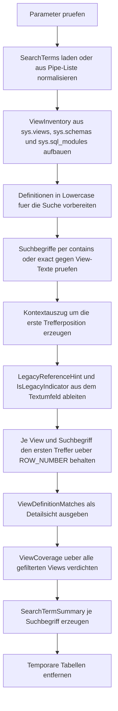

# SearchViewDefinitions.sql

Dieses Skript durchsucht View-Definitionen der aktuell verbundenen Datenbank nach frei definierbaren Suchbegriffen. Die Erstversion bleibt bewusst rein lesend, liefert pro Treffer einen kompakten Kontextauszug und markiert heuristisch, ob ein Treffer eher auf eine veraltete Referenz oder auf einen typischen `FROM`-, `JOIN`- oder `APPLY`-Kontext hinweist.

## Uebersicht

<!-- SQLDOC:SUMMARY_TABLE:BEGIN -->
| Feld | Wert |
|---|---|
| Script | [SearchViewDefinitions.sql](SearchViewDefinitions.sql) |
| Version | `1.0` |
| Typ | `diagnostic-query` |
| Kapitel | `15_SearchInTables` |
| Sicherheit | `read-only` |
| Zweck | Durchsucht View-Definitionen nach Suchbegriffen, Legacy-Hinweisen und verdichtet die Treffer pro View. |
<!-- SQLDOC:SUMMARY_TABLE:END -->

## Einordnung

Das Artefakt eignet sich fuer Refactoring-Reviews, Migrationsvorhaben und Inventuren vor dem Rueckbau alter Tabellen- oder View-Namen. Statt produktive Objekte zu aendern, analysiert das Skript ausschliesslich Metadaten und Quelltexte der aktuell verbundenen Datenbank.

## Annahmen

- Die Erstversion arbeitet nur mit `sys.views`, `sys.schemas` und `sys.sql_modules` der aktuellen Datenbank.
- Verschluesselte oder anderweitig nicht verfuegbare Definitionen werden nicht als Texttreffer durchsucht und in der Coverage-Sicht als `definition_unavailable` markiert.
- `LegacyReferenceHint` ist bewusst heuristisch und leitet sich nur aus dem unmittelbaren Textumfeld des ersten Treffers je View und Suchbegriff ab.
- Ohne explizite `@SearchTerms` verwendet das Skript ein didaktisches Standardset fuer Legacy-, Lifecycle- und Referenzbegriffe.

## Anwendungsfall

Das Skript ist hilfreich, wenn vor Umbenennungen oder Aufraeumarbeiten sichtbar werden soll, welche Views noch auf alte Begriffe, Legacy-Namensmuster oder veraltete Fachobjekte verweisen. Mit `@SchemaName` und `@ViewNamePattern` laesst sich die Suche auf Teilbereiche eingrenzen.

## Parameter

<!-- SQLDOC:PARAMETERS_TABLE:BEGIN -->
| Parameter | SQL-Typ | Pflicht | Beschreibung |
|---|---|---|---|
| `@SearchTerms` | `NVARCHAR(MAX)` | Nein | Pipe-separierte Suchbegriffe wie `legacy|archive|customer`; `NULL` verwendet ein didaktisches Standardset. |
| `@SchemaName` | `SYSNAME` | Nein | Optionaler Schemafilter; `NULL` durchsucht alle Schemas. |
| `@ViewNamePattern` | `NVARCHAR(256)` | Nein | Optionales `LIKE`-Muster fuer View-Namen wie `vwSales%`. |
| `@MatchMode` | `NVARCHAR(10)` | Nein | Verwendet `contains` oder `exact` fuer die Suche innerhalb der View-Definition. |
<!-- SQLDOC:PARAMETERS_TABLE:END -->

## Abhaengigkeiten

<!-- SQLDOC:DEPENDENCIES_LIST:BEGIN -->
- `sys.views`
- `sys.schemas`
- `sys.sql_modules`
- `STRING_SPLIT()`
- `ROW_NUMBER()`
- `CHARINDEX()`
- `SUBSTRING()`
- `REPLACE()`
- `LIKE`
- `CASE`
<!-- SQLDOC:DEPENDENCIES_LIST:END -->

## Hinweise

- `ViewDefinitionMatches` liefert pro View und Suchbegriff genau den ersten Treffer mit Position, Kontextklassifikation und Textauszug.
- `ViewCoverage` zeigt auch Views ohne Treffer oder ohne verfuegbare Definition und eignet sich damit fuer Vollstaendigkeits- und Legacy-Reviews.
- `SearchTermSummary` macht sichtbar, welche Suchbegriffe Legacy-Hinweise erzeugen und welche View als Beispiel zuerst auftaucht.
- Mit `@MatchMode = 'exact'` wird ein Treffer nur gewertet, wenn direkt vor und nach dem Begriff kein alphanumerisches oder `_`-Zeichen steht.

## Versionshistorie

<!-- SQLDOC:VERSION_HISTORY_TABLE:BEGIN -->
| Version | Datum | User | Beschreibung |
|---|---|---|---|
| `1.0` | `2026-04-18` | `ER` | Erstversion eines diagnostischen Suchskripts fuer View-Definitionen. |
<!-- SQLDOC:VERSION_HISTORY_TABLE:END -->

## Ablauf

<!-- SQLDOC:MERMAID:BEGIN -->

<!-- SQLDOC:MERMAID:END -->

## SQL-Code

<!-- SQLDOC:SQL_CODE:BEGIN -->
```sql
/*
BEGIN:SQL-HEADER v1
---
sql_header: v1
script_name: "SearchViewDefinitions.sql"
script_version: "1.0"
script_type: "diagnostic-query"
chapter: "15_SearchInTables"

purpose: >
  Durchsucht View-Definitionen der aktuell verbundenen Datenbank nach frei
  definierbaren Suchbegriffen, markiert vermutete veraltete Referenzen und
  liefert sowohl Detailtreffer als auch verdichtete Trefferbilder pro View.

parameters:
  - name: "@SearchTerms"
    sql_type: "NVARCHAR(MAX)"
    direction: "IN"
    required: false
    description: "Pipe-separierte Suchbegriffe wie legacy|archive|customer; NULL verwendet ein didaktisches Standardset."
  - name: "@SchemaName"
    sql_type: "SYSNAME"
    direction: "IN"
    required: false
    description: "Optionaler Schemafilter; NULL durchsucht alle Schemas."
  - name: "@ViewNamePattern"
    sql_type: "NVARCHAR(256)"
    direction: "IN"
    required: false
    description: "Optionales LIKE-Muster fuer View-Namen wie vwSales%."
  - name: "@MatchMode"
    sql_type: "NVARCHAR(10)"
    direction: "IN"
    required: false
    description: "contains oder exact fuer die Suche innerhalb der View-Definition."

result_sets:
  - name: "ViewDefinitionMatches"
    description: "Detailtreffer je View inklusive Suchbegriff, Kontextauszug und Heuristik fuer den Referenztyp."
  - name: "ViewCoverage"
    description: "Verdichtete Sicht pro View mit Trefferanzahl, Legacy-Hinweis und Definitionstatus."
  - name: "SearchTermSummary"
    description: "Zusammenfassung je Suchbegriff ueber betroffene Views und typische Referenzhinweise."

dependencies:
  - "sys.views"
  - "sys.schemas"
  - "sys.sql_modules"
  - "STRING_SPLIT()"
  - "ROW_NUMBER()"
  - "CHARINDEX()"
  - "SUBSTRING()"
  - "REPLACE()"
  - "LIKE"
  - "CASE"

safety:
  level: "read-only"
  writes_data: false

documentation:
  markdown_file: "T-SQL/15_SearchInTables/SQLScripts/SearchViewDefinitions.md"
  sync_blocks:
    - "SUMMARY_TABLE"
    - "PARAMETERS_TABLE"
    - "DEPENDENCIES_LIST"
    - "VERSION_HISTORY_TABLE"
    - "SQL_CODE"
  mermaid:
    mode: "ai-agent-from-sql"
    source: "script-body"

main_responsible:
  name: "Erhard Rainer"
  initials: "ER"

version_history:
  - version: "1.0"
    date: "2026-04-18"
    user: "ER"
    description: "Erstversion eines diagnostischen Suchskripts fuer View-Definitionen."

notes:
  - "Die Erstversion arbeitet rein lesend auf sys.views, sys.schemas und sys.sql_modules."
  - "LegacyReferenceHint ist eine Heuristik aus dem Textumfeld und ersetzt keine vollstaendige Impact-Analyse."
---
END:SQL-HEADER v1
*/

SET NOCOUNT ON;

DECLARE @SearchTerms NVARCHAR(MAX) = NULL;
DECLARE @SchemaName SYSNAME = NULL;
DECLARE @ViewNamePattern NVARCHAR(256) = NULL;
DECLARE @MatchMode NVARCHAR(10) = N'contains';

SET @MatchMode = LOWER(COALESCE(@MatchMode, N'contains'));

IF @MatchMode NOT IN (N'contains', N'exact')
BEGIN
    THROW 50000, '@MatchMode muss contains oder exact sein.', 1;
END;

IF @SchemaName IS NOT NULL
   AND NOT EXISTS
(
    SELECT 1
    FROM sys.schemas AS s
    WHERE s.name = @SchemaName
)
BEGIN
    THROW 50001, '@SchemaName wurde in der aktuellen Datenbank nicht gefunden.', 1;
END;

DROP TABLE IF EXISTS #SearchTerms;
CREATE TABLE #SearchTerms
(
    SearchTerm NVARCHAR(128) NOT NULL PRIMARY KEY,
    SearchCategory NVARCHAR(30) NOT NULL,
    PriorityRank INT NOT NULL
);

IF NULLIF(LTRIM(RTRIM(COALESCE(@SearchTerms, N''))), N'') IS NULL
BEGIN
    INSERT INTO #SearchTerms (SearchTerm, SearchCategory, PriorityRank)
    VALUES
        (N'legacy', N'legacy_term', 10),
        (N'archive', N'lifecycle_term', 11),
        (N'customer', N'reference_term', 12),
        (N'order', N'reference_term', 13),
        (N'deprecated', N'legacy_term', 14),
        (N'obsolete', N'legacy_term', 15),
        (N'old_', N'legacy_term', 16),
        (N'vwlegacy', N'legacy_term', 17);
END;
ELSE
BEGIN
    INSERT INTO #SearchTerms (SearchTerm, SearchCategory, PriorityRank)
    SELECT
        src.SearchTerm,
        CASE
            WHEN src.SearchTerm LIKE N'%legacy%' OR src.SearchTerm IN (N'deprecated', N'obsolete', N'old_', N'old') THEN N'legacy_term'
            WHEN src.SearchTerm IN (N'archive', N'archived', N'deleted', N'purge') THEN N'lifecycle_term'
            WHEN src.SearchTerm IN (N'customer', N'order', N'product', N'tenant', N'region') THEN N'reference_term'
            ELSE N'general_term'
        END AS SearchCategory,
        100 + ROW_NUMBER() OVER (ORDER BY src.SearchTerm) AS PriorityRank
    FROM
    (
        SELECT DISTINCT
            LOWER(LTRIM(RTRIM(value))) AS SearchTerm
        FROM STRING_SPLIT(@SearchTerms, N'|')
        WHERE NULLIF(LTRIM(RTRIM(value)), N'') IS NOT NULL
    ) AS src;
END;

IF NOT EXISTS (SELECT 1 FROM #SearchTerms)
BEGIN
    THROW 50002, 'Es wurde kein gueltiger Suchbegriff fuer @SearchTerms ermittelt.', 1;
END;

DROP TABLE IF EXISTS #ViewInventory;
SELECT
    v.object_id AS ViewObjectId,
    s.name AS SchemaName,
    v.name AS ViewName,
    QUOTENAME(s.name) + N'.' + QUOTENAME(v.name) AS FullViewName,
    m.definition AS ViewDefinition,
    CASE WHEN m.definition IS NULL THEN 1 ELSE 0 END AS DefinitionUnavailable,
    LOWER(COALESCE(m.definition, N'')) AS LowerDefinition
INTO #ViewInventory
FROM sys.views AS v
INNER JOIN sys.schemas AS s
    ON s.schema_id = v.schema_id
LEFT JOIN sys.sql_modules AS m
    ON m.object_id = v.object_id
WHERE (@SchemaName IS NULL OR s.name = @SchemaName)
  AND (@ViewNamePattern IS NULL OR v.name LIKE @ViewNamePattern);

;WITH RawMatches AS
(
    SELECT
        vi.SchemaName,
        vi.ViewName,
        vi.FullViewName,
        vi.DefinitionUnavailable,
        st.SearchTerm,
        st.SearchCategory,
        st.PriorityRank,
        CHARINDEX(st.SearchTerm, vi.LowerDefinition) AS MatchPosition,
        vi.ViewDefinition
    FROM #ViewInventory AS vi
    INNER JOIN #SearchTerms AS st
        ON vi.DefinitionUnavailable = 0
       AND
       (
            (@MatchMode = N'contains' AND CHARINDEX(st.SearchTerm, vi.LowerDefinition) > 0)
            OR
            (
                @MatchMode = N'exact'
                AND CHARINDEX(st.SearchTerm, vi.LowerDefinition) > 0
                AND
                (
                    CHARINDEX(st.SearchTerm, vi.LowerDefinition) = 1
                    OR SUBSTRING(vi.LowerDefinition, CHARINDEX(st.SearchTerm, vi.LowerDefinition) - 1, 1) LIKE N'[^a-z0-9_]'
                )
                AND
                (
                    CHARINDEX(st.SearchTerm, vi.LowerDefinition) + LEN(st.SearchTerm) > LEN(vi.LowerDefinition)
                    OR SUBSTRING(vi.LowerDefinition, CHARINDEX(st.SearchTerm, vi.LowerDefinition) + LEN(st.SearchTerm), 1) LIKE N'[^a-z0-9_]'
                )
            )
       )
),
ContextMatches AS
(
    SELECT
        rm.SchemaName,
        rm.ViewName,
        rm.FullViewName,
        rm.SearchTerm,
        rm.SearchCategory,
        rm.PriorityRank,
        rm.MatchPosition,
        LTRIM(RTRIM(REPLACE(REPLACE(
            SUBSTRING(
                rm.ViewDefinition,
                CASE WHEN rm.MatchPosition > 70 THEN rm.MatchPosition - 70 ELSE 1 END,
                LEN(rm.SearchTerm) + 140
            ),
            CHAR(13), N' '
        ), CHAR(10), N' '))) AS DefinitionExcerpt
    FROM RawMatches AS rm
),
RankedMatches AS
(
    SELECT
        cm.*,
        CASE
            WHEN LOWER(cm.DefinitionExcerpt) LIKE N'% from %' THEN N'from_reference'
            WHEN LOWER(cm.DefinitionExcerpt) LIKE N'% join %' THEN N'join_reference'
            WHEN LOWER(cm.DefinitionExcerpt) LIKE N'% cross apply %' OR LOWER(cm.DefinitionExcerpt) LIKE N'% outer apply %' THEN N'apply_reference'
            WHEN LOWER(cm.DefinitionExcerpt) LIKE N'% openquery %' THEN N'remote_reference'
            WHEN LOWER(cm.DefinitionExcerpt) LIKE N'% old_%'
              OR LOWER(cm.DefinitionExcerpt) LIKE N'% legacy %'
              OR LOWER(cm.DefinitionExcerpt) LIKE N'% deprecated %'
              OR LOWER(cm.DefinitionExcerpt) LIKE N'% obsolete %' THEN N'legacy_reference_hint'
            ELSE N'general_text_context'
        END AS LegacyReferenceHint,
        CASE
            WHEN cm.SearchCategory = N'legacy_term' THEN 1
            WHEN LOWER(cm.DefinitionExcerpt) LIKE N'% old_%'
              OR LOWER(cm.DefinitionExcerpt) LIKE N'% legacy %'
              OR LOWER(cm.DefinitionExcerpt) LIKE N'% deprecated %'
              OR LOWER(cm.DefinitionExcerpt) LIKE N'% obsolete %' THEN 1
            ELSE 0
        END AS IsLegacyIndicator,
        ROW_NUMBER() OVER
        (
            PARTITION BY cm.SchemaName, cm.ViewName, cm.SearchTerm
            ORDER BY cm.MatchPosition, cm.PriorityRank
        ) AS MatchRank
    FROM ContextMatches AS cm
),
BestMatches AS
(
    SELECT
        rm.SchemaName,
        rm.ViewName,
        rm.FullViewName,
        rm.SearchTerm,
        rm.SearchCategory,
        rm.MatchPosition,
        rm.LegacyReferenceHint,
        rm.IsLegacyIndicator,
        rm.DefinitionExcerpt
    FROM RankedMatches AS rm
    WHERE rm.MatchRank = 1
)
SELECT
    bm.SchemaName,
    bm.ViewName,
    bm.FullViewName,
    bm.SearchTerm,
    bm.SearchCategory,
    bm.MatchPosition,
    bm.LegacyReferenceHint,
    bm.IsLegacyIndicator,
    bm.DefinitionExcerpt
INTO #BestMatches
FROM BestMatches AS bm;

SELECT
    bm.SchemaName,
    bm.ViewName,
    bm.FullViewName,
    bm.SearchTerm,
    bm.SearchCategory,
    bm.MatchPosition,
    bm.LegacyReferenceHint,
    bm.IsLegacyIndicator,
    bm.DefinitionExcerpt
FROM #BestMatches AS bm
ORDER BY
    bm.SchemaName,
    bm.ViewName,
    bm.SearchTerm;

SELECT
    vi.SchemaName,
    vi.ViewName,
    vi.FullViewName,
    CASE
        WHEN vi.DefinitionUnavailable = 1 THEN N'definition_unavailable'
        WHEN EXISTS
        (
            SELECT 1
            FROM #BestMatches AS bm
            WHERE bm.FullViewName = vi.FullViewName
        ) THEN N'match_found'
        ELSE N'no_match'
    END AS CoverageStatus,
    COUNT(DISTINCT bm.SearchTerm) AS MatchedSearchTerms,
    SUM(COALESCE(bm.IsLegacyIndicator, 0)) AS LegacyIndicatorCount,
    MIN(bm.SearchTerm) AS FirstMatchedSearchTerm,
    MIN(bm.LegacyReferenceHint) AS FirstReferenceHint
FROM #ViewInventory AS vi
LEFT JOIN #BestMatches AS bm
    ON bm.FullViewName = vi.FullViewName
GROUP BY
    vi.SchemaName,
    vi.ViewName,
    vi.FullViewName,
    vi.DefinitionUnavailable
ORDER BY
    CASE
        WHEN vi.DefinitionUnavailable = 1 THEN 1
        WHEN COUNT(DISTINCT bm.SearchTerm) > 0 THEN 2
        ELSE 3
    END,
    LegacyIndicatorCount DESC,
    MatchedSearchTerms DESC,
    vi.SchemaName,
    vi.ViewName;

SELECT
    st.SearchTerm,
    st.SearchCategory,
    COUNT(DISTINCT bm.FullViewName) AS MatchedViews,
    COUNT(DISTINCT CASE WHEN vi.DefinitionUnavailable = 0 THEN vi.FullViewName END) AS SearchableViews,
    SUM(COALESCE(bm.IsLegacyIndicator, 0)) AS LegacyIndicators,
    MIN(bm.FullViewName) AS ExampleView,
    MIN(bm.LegacyReferenceHint) AS ExampleReferenceHint
FROM #SearchTerms AS st
CROSS JOIN #ViewInventory AS vi
LEFT JOIN #BestMatches AS bm
    ON bm.SearchTerm = st.SearchTerm
   AND bm.FullViewName = vi.FullViewName
GROUP BY
    st.SearchTerm,
    st.SearchCategory,
    st.PriorityRank
ORDER BY
    st.PriorityRank,
    st.SearchTerm;

DROP TABLE IF EXISTS #BestMatches;
DROP TABLE IF EXISTS #ViewInventory;
DROP TABLE IF EXISTS #SearchTerms;
```
<!-- SQLDOC:SQL_CODE:END -->
