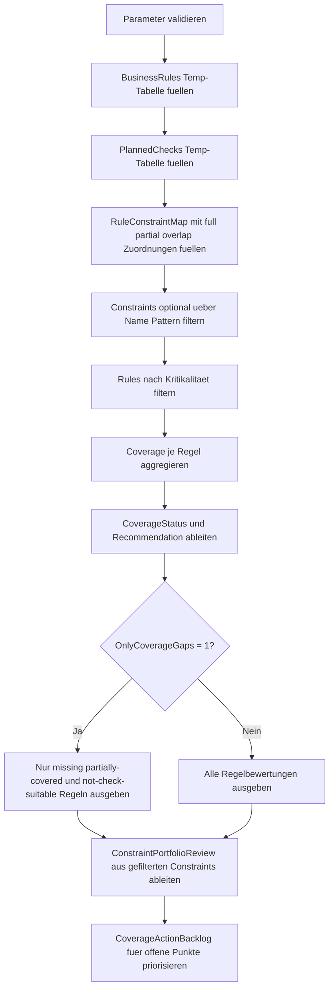

# CheckPredicateCoverageReview.sql

Dieses Skript bewertet in einem didaktischen Review, ob geplante `CHECK`-Constraints die relevanten Fachregeln einer Order-Line-Struktur vollstaendig abdecken. Die Erstversion arbeitet ausschliesslich mit Temp-Tabellen und unterscheidet bewusst zwischen voll per `CHECK` erzwingbaren Regeln, nur teilweise abgedeckten Regeln und Regeln, die eher ueber Trigger, Prozesslogik oder Audits abgesichert werden muessen.

## Uebersicht

<!-- SQLDOC:SUMMARY_TABLE:BEGIN -->
| Feld | Wert |
|---|---|
| Script | [CheckPredicateCoverageReview.sql](CheckPredicateCoverageReview.sql) |
| Version | `1.0` |
| Typ | `diagnostic-query` |
| Kapitel | `16_DataIntegrity_Constraints` |
| Sicherheit | `read-only-tempdb` |
| Zweck | Reviewt, ob geplante CHECK-Constraints die relevanten Regeln voll, teilweise oder gar nicht abdecken. |
<!-- SQLDOC:SUMMARY_TABLE:END -->

## Einordnung

Das Artefakt eignet sich fuer Design-Reviews vor dem Einbau neuer Constraints oder vor einem Refactoring bestehender Prueflogik. Statt echte Metadaten zu erwarten, modelliert das Skript einen kompakten Fachregelkatalog, geplante Constraint-Kandidaten und deren Zuordnungen und macht damit Coverage-Luecken explizit sichtbar.

## Annahmen

- Die Erstversion ist ein didaktisches Review und liest keine produktiven Constraint-Metadaten.
- Fachregeln werden in einem lokalen Regelkatalog modelliert, damit Coverage und Luecken transparent diskutiert werden koennen.
- Mehrzeilige oder tabellenuebergreifende Regeln gelten bewusst als nicht sinnvoll direkt per `CHECK` erzwingbar.
- Teilabdeckung bedeutet hier, dass ein Constraint nur einen Ausschnitt der Fachregel prueft, aber nicht deren gesamte Semantik.
- Ein doppeltes Mengen-Constraint illustriert absichtlich Ueberschneidungen und moegliche Redundanz im Constraint-Portfolio.

## Anwendungsfall

Das Muster passt zu Reviews, in denen geprueft werden soll, ob fachliche Regeln bereits sauber in `CHECK`-Praedikate uebersetzt wurden oder ob noch Trigger, ETL-Guards oder Audits benoetigt werden. In spaeteren produktionsnahen Varianten kann der didaktische Regelkatalog durch Katalogsicht, Naming-Standards oder Governance-Tabellen ersetzt werden.

## Parameter

<!-- SQLDOC:PARAMETERS_TABLE:BEGIN -->
| Parameter | SQL-Typ | Pflicht | Beschreibung |
|---|---|---|---|
| `@OnlyCoverageGaps` | `BIT` | Nein | Zeigt bei `1` nur Regeln mit fehlender oder teilweiser Abdeckung. |
| `@MinCriticality` | `TINYINT` | Nein | Filtert Regeln nach Kritikalitaet von `1` bis `3`. |
| `@ConstraintNamePattern` | `NVARCHAR(128)` | Nein | Begrenzt die Bewertung optional auf ein LIKE-Muster fuer Constraint-Namen. |
<!-- SQLDOC:PARAMETERS_TABLE:END -->

## Abhaengigkeiten

<!-- SQLDOC:DEPENDENCIES_LIST:BEGIN -->
- `tempdb`
- `DROP TABLE IF EXISTS`
- `STRING_AGG()`
- `CASE`
- `LIKE`
- `CTE`
<!-- SQLDOC:DEPENDENCIES_LIST:END -->

## Hinweise

- `#BusinessRules` sammelt den fachlichen Sollzustand inklusive Kritikalitaet und Durchsetzbarkeit per `CHECK`.
- `#PlannedChecks` repraesentiert geplante oder diskutierte Constraint-Kandidaten mit Designnotizen.
- `#RuleConstraintMap` dokumentiert bewusst, ob eine Zuordnung vollstaendig, teilweise oder nur ueberlappend ist.
- Die erste Ausgabe ist die eigentliche Coverage-Sicht; danach folgt die Constraint-Perspektive und zuletzt ein priorisierter Aktions-Backlog.

## Versionshistorie

<!-- SQLDOC:VERSION_HISTORY_TABLE:BEGIN -->
| Version | Datum | User | Beschreibung |
|---|---|---|---|
| `1.0` | `2026-04-18` | `ER` | Erstversion eines diagnostischen Coverage-Reviews fuer geplante CHECK-Constraints. |
<!-- SQLDOC:VERSION_HISTORY_TABLE:END -->

## Ablauf

<!-- SQLDOC:MERMAID:BEGIN -->

<!-- SQLDOC:MERMAID:END -->

## SQL-Code

<!-- SQLDOC:SQL_CODE:BEGIN -->
```sql
/*
BEGIN:SQL-HEADER v1
---
sql_header: v1
script_name: "CheckPredicateCoverageReview.sql"
script_version: "1.0"
script_type: "diagnostic-query"
chapter: "16_DataIntegrity_Constraints"

purpose: >
  Bewertet in einem didaktischen Review, ob geplante CHECK-Constraints die
  relevanten fachlichen Regeln einer Order-Line-Struktur vollstaendig,
  teilweise oder gar nicht abdecken, und markiert Luecken fuer den
  Constraint-Backlog.

parameters:
  - name: "@OnlyCoverageGaps"
    sql_type: "BIT"
    direction: "IN"
    required: false
    description: "1 zeigt nur Regeln mit fehlender oder teilweiser Abdeckung; 0 zeigt alle Regeln."
  - name: "@MinCriticality"
    sql_type: "TINYINT"
    direction: "IN"
    required: false
    description: "Mindestkritikalitaet 1 bis 3 fuer die Regelbewertung."
  - name: "@ConstraintNamePattern"
    sql_type: "NVARCHAR(128)"
    direction: "IN"
    required: false
    description: "Optionales LIKE-Muster, um nur bestimmte geplante Constraints in die Bewertung einzubeziehen."

result_sets:
  - name: "RuleCoverageReview"
    description: "Bewertung je Fachregel mit Coverage-Status, Enforceability und zugeordneten Constraints."
  - name: "ConstraintPortfolioReview"
    description: "Sicht je geplantem CHECK-Constraint mit abgedeckten Regeln, Restluecken und Einsatznotiz."
  - name: "CoverageActionBacklog"
    description: "Priorisierte Backlog-Sicht fuer fehlende oder nur teilweise abgedeckte Regeln."

dependencies:
  - "tempdb"
  - "DROP TABLE IF EXISTS"
  - "STRING_AGG()"
  - "CASE"
  - "LIKE"
  - "CTE"

safety:
  level: "read-only-tempdb"
  writes_data: false

documentation:
  markdown_file: "T-SQL/16_DataIntegrity_Constraints/SQLScripts/CheckPredicateCoverageReview.md"
  sync_blocks:
    - "SUMMARY_TABLE"
    - "PARAMETERS_TABLE"
    - "DEPENDENCIES_LIST"
    - "VERSION_HISTORY_TABLE"
    - "SQL_CODE"
  mermaid:
    mode: "ai-agent-from-sql"
    source: "script-body"

main_responsible:
  name: "Erhard Rainer"
  initials: "ER"

version_history:
  - version: "1.0"
    date: "2026-04-18"
    user: "ER"
    description: "Erstversion eines diagnostischen Coverage-Reviews fuer geplante CHECK-Constraints."

notes:
  - "Die Erstversion nutzt ausschliesslich Temp-Tabellen und einen didaktischen Regelkatalog."
  - "Mehrzeilige oder tabellenuebergreifende Regeln werden bewusst als nur teilweise oder nicht per CHECK erzwingbar markiert."
---
END:SQL-HEADER v1
*/

SET NOCOUNT ON;

DECLARE @OnlyCoverageGaps BIT = 0;
DECLARE @MinCriticality TINYINT = 1;
DECLARE @ConstraintNamePattern NVARCHAR(128) = NULL;

IF @OnlyCoverageGaps NOT IN (0, 1)
BEGIN
    THROW 50000, '@OnlyCoverageGaps muss 0 oder 1 sein.', 1;
END;

IF @MinCriticality NOT BETWEEN 1 AND 3
BEGIN
    THROW 50001, '@MinCriticality muss zwischen 1 und 3 liegen.', 1;
END;

DROP TABLE IF EXISTS #BusinessRules;
CREATE TABLE #BusinessRules
(
    RuleID INT NOT NULL PRIMARY KEY,
    RuleName SYSNAME NOT NULL,
    Criticality TINYINT NOT NULL,
    RuleScope NVARCHAR(20) NOT NULL,
    TargetColumns NVARCHAR(200) NOT NULL,
    IntendedPredicate NVARCHAR(300) NOT NULL,
    RuleDescription NVARCHAR(300) NOT NULL,
    CheckEnforceability NVARCHAR(20) NOT NULL,
    EnforcementNote NVARCHAR(300) NOT NULL
);

INSERT INTO #BusinessRules
(
    RuleID,
    RuleName,
    Criticality,
    RuleScope,
    TargetColumns,
    IntendedPredicate,
    RuleDescription,
    CheckEnforceability,
    EnforcementNote
)
VALUES
    (1, N'QuantityPositive', 3, N'row', N'Quantity', N'Quantity >= 1', N'Bestellpositionen muessen mindestens Menge 1 haben.', N'full', N'Reine Zeilenregel, direkt als CHECK ausdrueckbar.'),
    (2, N'UnitPriceNonNegative', 3, N'row', N'UnitPrice', N'UnitPrice >= 0.00', N'Einzelpreis darf nicht negativ werden.', N'full', N'Reine Zeilenregel, direkt als CHECK ausdrueckbar.'),
    (3, N'DiscountWithinApprovalBand', 2, N'DiscountPct, ApprovalCode', N'DiscountPct <= 0.15 OR ApprovalCode IS NOT NULL', N'Hoehere Rabatte brauchen eine Freigabekennung.', N'full', N'Mehrspaltige Regel innerhalb derselben Zeile, per CHECK moeglich.'),
    (4, N'ShipDateAfterOrderDate', 3, N'row', N'ShipDate, OrderDate', N'ShipDate IS NULL OR ShipDate >= OrderDate', N'Versanddatum darf nicht vor dem Bestelldatum liegen.', N'full', N'Zeileninterne Datumsregel, per CHECK direkt abbildbar.'),
    (5, N'ShippedNeedsShipDate', 2, N'row', N'FulfillmentStatus, ShipDate', N'FulfillmentStatus <> ''Shipped'' OR ShipDate IS NOT NULL', N'Der Status Shipped verlangt ein Versanddatum.', N'full', N'Zeileninterne Konsistenzregel, per CHECK direkt abbildbar.'),
    (6, N'CurrencyCodeIsoLike', 2, N'row', N'CurrencyCode', N'CurrencyCode LIKE ''[A-Z][A-Z][A-Z]''', N'Waehrungscode soll aus drei Grossbuchstaben bestehen.', N'full', N'Formatpruefung auf einer Spalte, per CHECK geeignet.'),
    (7, N'OpenAmountMatchesLines', 3, N'aggregate', N'OrderID, OpenAmount', N'OpenAmount = SUM(LineAmount WHERE Status <> ''Cancelled'')', N'Gespeicherte Summen muessen zu den Detailzeilen passen.', N'none', N'Aggregat ueber mehrere Zeilen; dafuer braucht es Trigger, Prozesslogik oder periodische Audits.'),
    (8, N'CustomerNotBlocked', 3, N'reference', N'CustomerID', N'CustomerID NOT IN blocked customers', N'Gesperrte Kunden duerfen keine neuen Positionen erhalten.', N'none', N'Tabellenuebergreifende Referenzregel, nicht sinnvoll per CHECK derselben Zeile erzwingbar.'),
    (9, N'PriorityRequiresExpediteReason', 1, N'row', N'PriorityCode, ExpediteReason', N'PriorityCode <> ''EXP'' OR ExpediteReason IS NOT NULL', N'Expedite-Prioritaet braucht einen Begruendungstext.', N'full', N'Zeileninterne Pflichtfeldregel, per CHECK moeglich.');

DROP TABLE IF EXISTS #PlannedChecks;
CREATE TABLE #PlannedChecks
(
    ConstraintName SYSNAME NOT NULL PRIMARY KEY,
    CoverageIntent NVARCHAR(20) NOT NULL,
    TargetColumns NVARCHAR(200) NOT NULL,
    PlannedPredicate NVARCHAR(300) NOT NULL,
    DesignNote NVARCHAR(300) NOT NULL
);

INSERT INTO #PlannedChecks
(
    ConstraintName,
    CoverageIntent,
    TargetColumns,
    PlannedPredicate,
    DesignNote
)
VALUES
    (N'CK_OrderLine_Quantity_Positive', N'full', N'Quantity', N'Quantity >= 1', N'Deckt die Mindestmenge vollstaendig ab.'),
    (N'CK_OrderLine_UnitPrice_NonNegative', N'full', N'UnitPrice', N'UnitPrice >= 0.00', N'Negative Preise werden sauber abgefangen.'),
    (N'CK_OrderLine_Discount_Cap', N'partial', N'DiscountPct', N'DiscountPct BETWEEN 0.00 AND 0.30', N'Kappt nur den Rabattwert, beruecksichtigt aber keine Freigabekennung.'),
    (N'CK_OrderLine_ShipDate_NotBeforeOrderDate', N'full', N'ShipDate, OrderDate', N'ShipDate IS NULL OR ShipDate >= OrderDate', N'Zeitliche Reihenfolge ist direkt als CHECK modelliert.'),
    (N'CK_OrderLine_StatusShipDate_Consistency', N'full', N'FulfillmentStatus, ShipDate', N'FulfillmentStatus <> ''Shipped'' OR ShipDate IS NOT NULL', N'Status und Versanddatum werden konsistent gehalten.'),
    (N'CK_OrderLine_CurrencyCode_Format', N'full', N'CurrencyCode', N'CurrencyCode LIKE ''[A-Z][A-Z][A-Z]''', N'Formale ISO-aehnliche Schreibweise wird geprueft.'),
    (N'CK_OrderLine_Quantity_Positive_Duplicate', N'overlap', N'Quantity', N'Quantity > 0', N'Didaktisches Beispiel fuer ueberschneidende Constraint-Logik.'),
    (N'CK_OrderLine_PriorityCode_Known', N'partial', N'PriorityCode', N'PriorityCode IN (''STD'',''EXP'',''VIP'')', N'Prueft nur gueltige Werte, nicht aber die Begruendung fuer EXP.');

DROP TABLE IF EXISTS #RuleConstraintMap;
CREATE TABLE #RuleConstraintMap
(
    RuleID INT NOT NULL,
    ConstraintName SYSNAME NOT NULL,
    CoverageLevel NVARCHAR(20) NOT NULL,
    MappingReason NVARCHAR(300) NOT NULL,
    PRIMARY KEY (RuleID, ConstraintName)
);

INSERT INTO #RuleConstraintMap
(
    RuleID,
    ConstraintName,
    CoverageLevel,
    MappingReason
)
VALUES
    (1, N'CK_OrderLine_Quantity_Positive', N'full', N'Praedikat entspricht der Zielregel.'),
    (1, N'CK_OrderLine_Quantity_Positive_Duplicate', N'overlap', N'Zweite nahezu identische Mengenregel erzeugt redundante Logik.'),
    (2, N'CK_OrderLine_UnitPrice_NonNegative', N'full', N'Preisuntergrenze wird direkt abgedeckt.'),
    (3, N'CK_OrderLine_Discount_Cap', N'partial', N'Rabattobergrenze ist enthalten, aber die Freigabekennung fehlt.'),
    (4, N'CK_OrderLine_ShipDate_NotBeforeOrderDate', N'full', N'Die Datumsregel entspricht dem Sollpraedikat.'),
    (5, N'CK_OrderLine_StatusShipDate_Consistency', N'full', N'Status- und Datumsabhaengigkeit ist vollstaendig abgebildet.'),
    (6, N'CK_OrderLine_CurrencyCode_Format', N'full', N'Die gewuenschte Formatpruefung ist direkt vorhanden.'),
    (9, N'CK_OrderLine_PriorityCode_Known', N'partial', N'Wertedomane ist geprueft, die Pflicht fuer ExpediteReason aber nicht.');

DROP TABLE IF EXISTS #FilteredConstraints;
SELECT
    pc.ConstraintName,
    pc.CoverageIntent,
    pc.TargetColumns,
    pc.PlannedPredicate,
    pc.DesignNote
INTO #FilteredConstraints
FROM #PlannedChecks AS pc
WHERE @ConstraintNamePattern IS NULL
   OR pc.ConstraintName LIKE @ConstraintNamePattern;

DROP TABLE IF EXISTS #FilteredRuleMap;
SELECT
    map.RuleID,
    map.ConstraintName,
    map.CoverageLevel,
    map.MappingReason
INTO #FilteredRuleMap
FROM #RuleConstraintMap AS map
INNER JOIN #FilteredConstraints AS fc
    ON fc.ConstraintName = map.ConstraintName;

DROP TABLE IF EXISTS #RuleCoverageReview;
WITH RuleCoverage AS
(
    SELECT
        br.RuleID,
        br.RuleName,
        br.Criticality,
        br.RuleScope,
        br.TargetColumns,
        br.IntendedPredicate,
        br.RuleDescription,
        br.CheckEnforceability,
        br.EnforcementNote,
        SUM(CASE WHEN frm.CoverageLevel = N'full' THEN 1 ELSE 0 END) AS FullMatches,
        SUM(CASE WHEN frm.CoverageLevel = N'partial' THEN 1 ELSE 0 END) AS PartialMatches,
        SUM(CASE WHEN frm.CoverageLevel = N'overlap' THEN 1 ELSE 0 END) AS OverlapMatches,
        STRING_AGG(frm.ConstraintName, N', ') WITHIN GROUP (ORDER BY frm.ConstraintName) AS ConstraintList,
        STRING_AGG(frm.MappingReason, N' | ') WITHIN GROUP (ORDER BY frm.ConstraintName) AS MappingNotes
    FROM #BusinessRules AS br
    LEFT JOIN #FilteredRuleMap AS frm
        ON frm.RuleID = br.RuleID
    WHERE br.Criticality >= @MinCriticality
    GROUP BY
        br.RuleID,
        br.RuleName,
        br.Criticality,
        br.RuleScope,
        br.TargetColumns,
        br.IntendedPredicate,
        br.RuleDescription,
        br.CheckEnforceability,
        br.EnforcementNote
)
SELECT
    rc.RuleID,
    rc.RuleName,
    rc.Criticality,
    rc.RuleScope,
    rc.TargetColumns,
    rc.IntendedPredicate,
    CASE
        WHEN rc.CheckEnforceability = N'none' THEN N'not-check-suitable'
        WHEN rc.FullMatches > 0 THEN N'covered'
        WHEN rc.PartialMatches > 0 THEN N'partially-covered'
        ELSE N'missing'
    END AS CoverageStatus,
    CASE
        WHEN rc.OverlapMatches > 0 AND rc.FullMatches > 0 THEN N'redundant-full'
        WHEN rc.OverlapMatches > 0 THEN N'redundant-overlap'
        WHEN rc.PartialMatches > 0 AND rc.FullMatches = 0 THEN N'needs-refinement'
        WHEN rc.CheckEnforceability = N'none' THEN N'use-trigger-or-audit'
        WHEN rc.FullMatches > 0 THEN N'constraint-ready'
        ELSE N'add-check-constraint'
    END AS Recommendation,
    rc.ConstraintList,
    rc.MappingNotes,
    rc.EnforcementNote
INTO #RuleCoverageReview
FROM RuleCoverage AS rc;

SELECT
    RuleID,
    RuleName,
    Criticality,
    RuleScope,
    TargetColumns,
    IntendedPredicate,
    CoverageStatus,
    Recommendation,
    ISNULL(ConstraintList, N'(keine)') AS Constraints,
    ISNULL(MappingNotes, N'(keine Zuordnung)') AS ReviewNotes,
    EnforcementNote
FROM #RuleCoverageReview
WHERE @OnlyCoverageGaps = 0
   OR CoverageStatus IN (N'missing', N'partially-covered', N'not-check-suitable')
ORDER BY
    Criticality DESC,
    RuleID;

SELECT
    fc.ConstraintName,
    fc.CoverageIntent,
    fc.TargetColumns,
    fc.PlannedPredicate,
    ISNULL(STRING_AGG(CONCAT(br.RuleName, N' [', map.CoverageLevel, N']'), N'; ') WITHIN GROUP (ORDER BY br.RuleID), N'(keine Regelzuordnung)') AS CoveredRules,
    CASE
        WHEN COUNT(map.RuleID) = 0 THEN N'Noch keinem fachlichen Review-Ziel zugeordnet.'
        WHEN SUM(CASE WHEN map.CoverageLevel = N'partial' THEN 1 ELSE 0 END) > 0 THEN N'Mindestens eine Regel wird nur teilweise abgedeckt.'
        WHEN SUM(CASE WHEN map.CoverageLevel = N'overlap' THEN 1 ELSE 0 END) > 0 THEN N'Ueberschneidung mit bestehender Constraint-Logik pruefen.'
        ELSE N'Constraint passt zu den zugeordneten Review-Regeln.'
    END AS PortfolioAssessment,
    fc.DesignNote
FROM #FilteredConstraints AS fc
LEFT JOIN #RuleConstraintMap AS map
    ON map.ConstraintName = fc.ConstraintName
LEFT JOIN #BusinessRules AS br
    ON br.RuleID = map.RuleID
GROUP BY
    fc.ConstraintName,
    fc.CoverageIntent,
    fc.TargetColumns,
    fc.PlannedPredicate,
    fc.DesignNote
ORDER BY
    fc.ConstraintName;

SELECT
    RuleID,
    RuleName,
    Criticality,
    CoverageStatus,
    Recommendation,
    CASE
        WHEN CoverageStatus = N'not-check-suitable' THEN N'Alternative Durchsetzung ausserhalb von CHECK planen.'
        WHEN CoverageStatus = N'missing' THEN N'Neuen CHECK-Kandidaten mit praezisem Praedikat ergaenzen.'
        WHEN CoverageStatus = N'partially-covered' THEN N'Bestehenden Constraint um fehlende Spaltenlogik erweitern.'
        ELSE N'Keine Aktion erforderlich.'
    END AS NextAction,
    EnforcementNote
FROM #RuleCoverageReview
WHERE CoverageStatus <> N'covered'
ORDER BY
    Criticality DESC,
    RuleID;
```
<!-- SQLDOC:SQL_CODE:END -->


