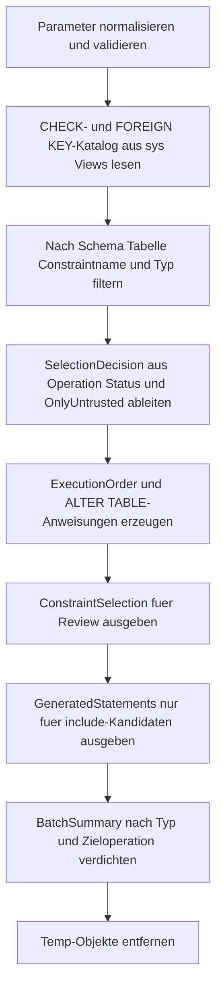

# ConstraintDisableEnableBatch.sql

Dieses Skript erzeugt fuer `CHECK`- und `FOREIGN KEY`-Constraints einen kontrollierten Disable-, Enable- oder Revalidation-Batch. Die Erstversion bleibt absichtlich sicher: Sie liest nur Katalogmetadaten, bewertet den aktuellen Constraint-Status und gibt die passenden `ALTER TABLE`-Anweisungen als Review- und Ausfuehrungsvorlage aus.

## Uebersicht

<!-- SQLDOC:SUMMARY_TABLE:BEGIN -->
| Feld | Wert |
|---|---|
| Script | [ConstraintDisableEnableBatch.sql](ConstraintDisableEnableBatch.sql) |
| Version | `1.0` |
| Typ | `template` |
| Kapitel | `16_DataIntegrity_Constraints` |
| Sicherheit | `read-only` |
| Zweck | Generiert einen kontrollierten Batch zum Deaktivieren, Reaktivieren oder Revalidieren von CHECK- und FOREIGN KEY-Constraints. |
<!-- SQLDOC:SUMMARY_TABLE:END -->

## Einordnung

Das Artefakt passt zu Wartungsfenstern, Datenkorrekturen und Nacharbeiten nach Bulk Loads. Statt Constraints blind zu schalten, wird zuerst sichtbar gemacht, welche Objekte betroffen sind, welche Anweisung pro Constraint noetig waere und welche Kandidaten wegen bereits passendem Status uebersprungen werden koennen.

## Annahmen

- Die Erstversion fuehrt keine generierten `ALTER TABLE`-Anweisungen aus und eignet sich daher als sichere Review- oder Freigabevorlage.
- Die Batch-Generierung fokussiert auf `CHECK`- und `FOREIGN KEY`-Constraints, weil diese in SQL Server gezielt deaktiviert, aktiviert und revalidiert werden koennen.
- `ENABLE_WITH_CHECK` steht hier bewusst fuer `WITH CHECK CHECK CONSTRAINT`, damit bestehende Daten erneut validiert und der Trusted-Status wiederhergestellt werden koennen.
- Die Ausfuehrungsreihenfolge priorisiert `FOREIGN KEY` vor `CHECK`, damit referenzielle Abhaengigkeiten in Review-Listen frueh sichtbar werden.

## Anwendungsfall

Typisch ist die Verwendung vor einem geplanten Datenimport oder nach einer Bereinigung ungueltiger Bestandsdaten. Das Team kann den generierten Batch pruefen, einzelne Anweisungen uebernehmen und den letzten Ausfuehrungsschritt nur nach fachlicher Freigabe ausserhalb dieses Templates durchfuehren.

## Parameter

<!-- SQLDOC:PARAMETERS_TABLE:BEGIN -->
| Parameter | SQL-Typ | Pflicht | Beschreibung |
|---|---|---|---|
| `@TargetSchema` | `SYSNAME` | Nein | Begrenzt die Auswahl optional auf genau ein Schema. |
| `@TargetTablePattern` | `NVARCHAR(128)` | Nein | Filtert Tabellen ueber ein `LIKE`-Muster. |
| `@ConstraintNamePattern` | `NVARCHAR(128)` | Nein | Filtert Constraints optional ueber ein `LIKE`-Muster. |
| `@ConstraintType` | `NVARCHAR(20)` | Nein | Erlaubt `CHECK`, `FOREIGN KEY` oder `ALL`. |
| `@Operation` | `NVARCHAR(20)` | Nein | Waehlt `DISABLE`, `ENABLE` oder `ENABLE_WITH_CHECK`. |
| `@OnlyUntrusted` | `BIT` | Nein | Beschraenkt die Auswahl bei `1` auf nicht vertrauenswuerdige Constraints. |
| `@IncludeAlreadyDisabled` | `BIT` | Nein | Behaelt bei `DISABLE` auf Wunsch auch bereits deaktivierte Constraints in der Sicht. |
<!-- SQLDOC:PARAMETERS_TABLE:END -->

## Abhaengigkeiten

<!-- SQLDOC:DEPENDENCIES_LIST:BEGIN -->
- `sys.tables`
- `sys.schemas`
- `sys.check_constraints`
- `sys.foreign_keys`
- `STRING_AGG()`
- `QUOTENAME()`
- `CASE`
- `LIKE`
<!-- SQLDOC:DEPENDENCIES_LIST:END -->

## Hinweise

- `ConstraintSelection` ist die primaere Review-Sicht und zeigt Status, Zieloperation, Auswahlentscheidung und Kontext je Constraint.
- `GeneratedStatements` liefert nur die wirklich einbezogenen `ALTER TABLE`-Anweisungen in stabiler Reihenfolge.
- `BatchSummary` verdichtet, wie viele Constraints in die Batch-Liste aufgenommen oder bewusst uebersprungen wurden.
- `ENABLE` generiert `CHECK CONSTRAINT`, waehrend `ENABLE_WITH_CHECK` bewusst `WITH CHECK CHECK CONSTRAINT` erzeugt, um bestehende Daten zu validieren.

## Versionshistorie

<!-- SQLDOC:VERSION_HISTORY_TABLE:BEGIN -->
| Version | Datum | User | Beschreibung |
|---|---|---|---|
| `1.0` | `2026-04-18` | `ER` | Erstversion einer sicheren Batch-Vorlage fuer Constraint Disable und Enable. |
<!-- SQLDOC:VERSION_HISTORY_TABLE:END -->

## Ablauf

<!-- SQLDOC:MERMAID:BEGIN -->

<!-- SQLDOC:MERMAID:END -->

## SQL-Code

<!-- SQLDOC:SQL_CODE:BEGIN -->
```sql
/*
BEGIN:SQL-HEADER v1
---
sql_header: v1
script_name: "ConstraintDisableEnableBatch.sql"
script_version: "1.0"
script_type: "template"
chapter: "16_DataIntegrity_Constraints"

purpose: >
  Erstellt fuer ausgewaehlte CHECK- und FOREIGN KEY-Constraints einen
  kontrollierten Batch zum Deaktivieren, Reaktivieren oder Revalidieren,
  ohne die generierten ALTER TABLE-Anweisungen selbst auszufuehren.

parameters:
  - name: "@TargetSchema"
    sql_type: "SYSNAME"
    direction: "IN"
    required: false
    description: "Optionales Schema fuer die Constraint-Auswahl."
  - name: "@TargetTablePattern"
    sql_type: "NVARCHAR(128)"
    direction: "IN"
    required: false
    description: "Optionales LIKE-Muster fuer Tabellennamen."
  - name: "@ConstraintNamePattern"
    sql_type: "NVARCHAR(128)"
    direction: "IN"
    required: false
    description: "Optionales LIKE-Muster fuer Constraint-Namen."
  - name: "@ConstraintType"
    sql_type: "NVARCHAR(20)"
    direction: "IN"
    required: false
    description: "CHECK, FOREIGN KEY oder ALL fuer die Constraint-Auswahl."
  - name: "@Operation"
    sql_type: "NVARCHAR(20)"
    direction: "IN"
    required: false
    description: "DISABLE, ENABLE oder ENABLE_WITH_CHECK fuer die Batch-Generierung."
  - name: "@OnlyUntrusted"
    sql_type: "BIT"
    direction: "IN"
    required: false
    description: "1 beschraenkt die Auswahl auf nicht vertrauenswuerdige Constraints."
  - name: "@IncludeAlreadyDisabled"
    sql_type: "BIT"
    direction: "IN"
    required: false
    description: "1 laesst bereits deaktivierte Constraints bei DISABLE im Resultset stehen."

result_sets:
  - name: "ConstraintSelection"
    description: "Zeigt die ausgewaehlten Constraints mit Status, Zieloperation und Begruendung."
  - name: "GeneratedStatements"
    description: "Liefert pro Constraint die generierte ALTER TABLE-Anweisung in Ausfuehrungsreihenfolge."
  - name: "BatchSummary"
    description: "Verdichtet die Batch-Zusammenstellung nach Constraint-Typ und Zieloperation."

dependencies:
  - "sys.tables"
  - "sys.schemas"
  - "sys.check_constraints"
  - "sys.foreign_keys"
  - "STRING_AGG()"
  - "QUOTENAME()"
  - "CASE"
  - "LIKE"

safety:
  level: "read-only"
  writes_data: false

documentation:
  markdown_file: "T-SQL/16_DataIntegrity_Constraints/SQLScripts/ConstraintDisableEnableBatch.md"
  sync_blocks:
    - "SUMMARY_TABLE"
    - "PARAMETERS_TABLE"
    - "DEPENDENCIES_LIST"
    - "VERSION_HISTORY_TABLE"
    - "SQL_CODE"
  mermaid:
    mode: "ai-agent-from-sql"
    source: "script-body"

main_responsible:
  name: "Erhard Rainer"
  initials: "ER"

version_history:
  - version: "1.0"
    date: "2026-04-18"
    user: "ER"
    description: "Erstversion einer sicheren Batch-Vorlage fuer Constraint Disable und Enable."

notes:
  - "Die Erstversion generiert ALTER TABLE-Anweisungen nur als Ausgabe und fuehrt sie nicht aus."
  - "Die Vorlage konzentriert sich auf CHECK- und FOREIGN KEY-Constraints, weil diese in SQL Server gezielt deaktiviert oder revalidiert werden koennen."
---
END:SQL-HEADER v1
*/

SET NOCOUNT ON;

DECLARE @TargetSchema SYSNAME = NULL;
DECLARE @TargetTablePattern NVARCHAR(128) = NULL;
DECLARE @ConstraintNamePattern NVARCHAR(128) = NULL;
DECLARE @ConstraintType NVARCHAR(20) = N'ALL';
DECLARE @Operation NVARCHAR(20) = N'ENABLE_WITH_CHECK';
DECLARE @OnlyUntrusted BIT = 0;
DECLARE @IncludeAlreadyDisabled BIT = 0;

SET @ConstraintType = UPPER(@ConstraintType);
SET @Operation = UPPER(@Operation);

IF @ConstraintType NOT IN (N'ALL', N'CHECK', N'FOREIGN KEY')
BEGIN
    THROW 50000, '@ConstraintType muss ALL, CHECK oder FOREIGN KEY sein.', 1;
END;

IF @Operation NOT IN (N'DISABLE', N'ENABLE', N'ENABLE_WITH_CHECK')
BEGIN
    THROW 50001, '@Operation muss DISABLE, ENABLE oder ENABLE_WITH_CHECK sein.', 1;
END;

IF @OnlyUntrusted NOT IN (0, 1)
BEGIN
    THROW 50002, '@OnlyUntrusted muss 0 oder 1 sein.', 1;
END;

IF @IncludeAlreadyDisabled NOT IN (0, 1)
BEGIN
    THROW 50003, '@IncludeAlreadyDisabled muss 0 oder 1 sein.', 1;
END;

DROP TABLE IF EXISTS #ConstraintCatalog;
WITH ConstraintCatalog AS
(
    SELECT
        s.name AS SchemaName,
        t.name AS TableName,
        c.name AS ConstraintName,
        CAST(N'CHECK' AS NVARCHAR(20)) AS ConstraintType,
        c.is_disabled AS IsDisabled,
        c.is_not_trusted AS IsNotTrusted,
        c.definition AS ConstraintDefinition
    FROM sys.check_constraints AS c
    INNER JOIN sys.tables AS t
        ON t.object_id = c.parent_object_id
    INNER JOIN sys.schemas AS s
        ON s.schema_id = t.schema_id
    WHERE @ConstraintType IN (N'ALL', N'CHECK')

    UNION ALL

    SELECT
        s.name AS SchemaName,
        t.name AS TableName,
        fk.name AS ConstraintName,
        CAST(N'FOREIGN KEY' AS NVARCHAR(20)) AS ConstraintType,
        fk.is_disabled AS IsDisabled,
        fk.is_not_trusted AS IsNotTrusted,
        CAST(NULL AS NVARCHAR(MAX)) AS ConstraintDefinition
    FROM sys.foreign_keys AS fk
    INNER JOIN sys.tables AS t
        ON t.object_id = fk.parent_object_id
    INNER JOIN sys.schemas AS s
        ON s.schema_id = t.schema_id
    WHERE @ConstraintType IN (N'ALL', N'FOREIGN KEY')
)
SELECT
    cc.SchemaName,
    cc.TableName,
    cc.ConstraintName,
    cc.ConstraintType,
    cc.IsDisabled,
    cc.IsNotTrusted,
    cc.ConstraintDefinition,
    CASE
        WHEN @Operation = N'DISABLE' THEN N'DISABLE'
        WHEN @Operation = N'ENABLE' THEN N'ENABLE'
        ELSE N'ENABLE_WITH_CHECK'
    END AS TargetOperation,
    CASE
        WHEN @Operation = N'DISABLE' AND cc.IsDisabled = 1 AND @IncludeAlreadyDisabled = 0 THEN N'skip_already_disabled'
        WHEN @Operation IN (N'ENABLE', N'ENABLE_WITH_CHECK') AND cc.IsDisabled = 0 AND cc.IsNotTrusted = 0 AND @Operation = N'ENABLE_WITH_CHECK' THEN N'skip_already_enabled_and_trusted'
        WHEN @OnlyUntrusted = 1 AND cc.IsNotTrusted = 0 THEN N'skip_trusted_constraint'
        ELSE N'include'
    END AS SelectionDecision
INTO #ConstraintCatalog
FROM ConstraintCatalog AS cc
WHERE (@TargetSchema IS NULL OR cc.SchemaName = @TargetSchema)
  AND (@TargetTablePattern IS NULL OR cc.TableName LIKE @TargetTablePattern)
  AND (@ConstraintNamePattern IS NULL OR cc.ConstraintName LIKE @ConstraintNamePattern);

DROP TABLE IF EXISTS #SelectedConstraints;
SELECT
    ROW_NUMBER() OVER
    (
        ORDER BY
            CASE WHEN cc.ConstraintType = N'FOREIGN KEY' THEN 1 ELSE 2 END,
            cc.SchemaName,
            cc.TableName,
            cc.ConstraintName
    ) AS ExecutionOrder,
    cc.SchemaName,
    cc.TableName,
    cc.ConstraintName,
    cc.ConstraintType,
    cc.IsDisabled,
    cc.IsNotTrusted,
    cc.ConstraintDefinition,
    cc.TargetOperation,
    cc.SelectionDecision,
    CASE
        WHEN cc.SelectionDecision <> N'include' THEN NULL
        WHEN cc.TargetOperation = N'DISABLE' THEN
            N'ALTER TABLE '
            + QUOTENAME(cc.SchemaName) + N'.' + QUOTENAME(cc.TableName)
            + N' NOCHECK CONSTRAINT ' + QUOTENAME(cc.ConstraintName) + N';'
        WHEN cc.TargetOperation = N'ENABLE' THEN
            N'ALTER TABLE '
            + QUOTENAME(cc.SchemaName) + N'.' + QUOTENAME(cc.TableName)
            + N' CHECK CONSTRAINT ' + QUOTENAME(cc.ConstraintName) + N';'
        ELSE
            N'ALTER TABLE '
            + QUOTENAME(cc.SchemaName) + N'.' + QUOTENAME(cc.TableName)
            + N' WITH CHECK CHECK CONSTRAINT ' + QUOTENAME(cc.ConstraintName) + N';'
    END AS GeneratedStatement,
    CASE
        WHEN cc.SelectionDecision = N'skip_already_disabled' THEN N'Constraint ist bereits deaktiviert und wurde wegen @IncludeAlreadyDisabled = 0 ausgeschlossen.'
        WHEN cc.SelectionDecision = N'skip_already_enabled_and_trusted' THEN N'Constraint ist bereits aktiviert und vertrauenswuerdig; eine Revalidierung waere redundant.'
        WHEN cc.SelectionDecision = N'skip_trusted_constraint' THEN N'Constraint ist vertrauenswuerdig und wurde wegen @OnlyUntrusted = 1 ausgeschlossen.'
        WHEN cc.TargetOperation = N'DISABLE' THEN N'Batch fuer kontrolliertes Deaktivieren vor Wartung oder Datenkorrektur.'
        WHEN cc.TargetOperation = N'ENABLE' THEN N'Batch fuer Reaktivierung ohne erneute Vollpruefung vorhandener Daten.'
        ELSE N'Batch fuer Revalidierung mit WITH CHECK CHECK und anschliessend vertrauenswuerdigem Status.'
    END AS ReviewNote
INTO #SelectedConstraints
FROM #ConstraintCatalog AS cc;

SELECT
    sc.ExecutionOrder,
    sc.SchemaName,
    sc.TableName,
    sc.ConstraintName,
    sc.ConstraintType,
    sc.IsDisabled,
    sc.IsNotTrusted,
    sc.TargetOperation,
    sc.SelectionDecision,
    sc.ReviewNote,
    sc.ConstraintDefinition
FROM #SelectedConstraints AS sc
ORDER BY
    sc.ExecutionOrder;

SELECT
    sc.ExecutionOrder,
    sc.SchemaName,
    sc.TableName,
    sc.ConstraintName,
    sc.ConstraintType,
    sc.TargetOperation,
    sc.GeneratedStatement
FROM #SelectedConstraints AS sc
WHERE sc.SelectionDecision = N'include'
ORDER BY
    sc.ExecutionOrder;

SELECT
    sc.TargetOperation,
    sc.ConstraintType,
    COUNT(*) AS CandidateConstraints,
    SUM(CASE WHEN sc.SelectionDecision = N'include' THEN 1 ELSE 0 END) AS IncludedConstraints,
    SUM(CASE WHEN sc.SelectionDecision <> N'include' THEN 1 ELSE 0 END) AS SkippedConstraints,
    STRING_AGG(
        CASE
            WHEN sc.SelectionDecision = N'include' THEN CONCAT(sc.SchemaName, N'.', sc.TableName, N'.', sc.ConstraintName)
        END,
        N'; '
    ) WITHIN GROUP (ORDER BY sc.ExecutionOrder) AS IncludedConstraintList
FROM #SelectedConstraints AS sc
GROUP BY
    sc.TargetOperation,
    sc.ConstraintType
ORDER BY
    sc.ConstraintType;

DROP TABLE IF EXISTS #SelectedConstraints;
DROP TABLE IF EXISTS #ConstraintCatalog;
```
<!-- SQLDOC:SQL_CODE:END -->
