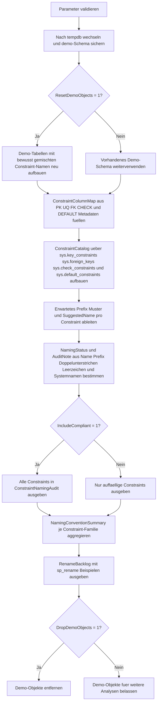

# ConstraintNamingConventionAudit.sql

Dieses Skript bewertet Constraint-Namen in einem kleinen `tempdb`-Demo-Schema gegen eine einfache, konsistente Benennungsregel. Neben der Detailpruefung liefert es auch eine Verdichtung je Constraint-Familie und einen kleinen Rename-Backlog mit Beispiel-DDL.

## Uebersicht

<!-- SQLDOC:SUMMARY_TABLE:BEGIN -->
| Feld | Wert |
|---|---|
| Script | [ConstraintNamingConventionAudit.sql](ConstraintNamingConventionAudit.sql) |
| Version | `1.0` |
| Typ | `didactic-lab` |
| Kapitel | `16_DataIntegrity_Constraints` |
| Sicherheit | `demo-write-tempdb` |
| Zweck | Prueft Constraint-Namen gegen Prefix-Regeln und leitet Rename-Vorschlaege fuer Abweichungen ab. |
<!-- SQLDOC:SUMMARY_TABLE:END -->

## Einordnung

Das Artefakt eignet sich fuer Naming-Guidelines, Review-Workshops und erste Governance-Checks rund um Constraints. Statt sofort gegen eine produktive Datenbank zu laufen, baut die Erstversion absichtlich ein kontrolliertes Demo-Schema mit gemischten guten und schlechten Namen auf, damit typische Abweichungen reproduzierbar sichtbar werden.

## Annahmen

- Die Erstversion arbeitet didaktisch in `tempdb` und erzeugt dort ein kleines Demo-Schema.
- Als Grundregel gilt ein Prefix je Constraint-Familie mit Tabellenbezug, zum Beispiel `PK_<Tabelle>` oder `FK_<Tabelle>_<Referenz>`.
- Fuer `CHECK`- und `DEFAULT`-Constraints wird ein kompakter Regel- oder Spaltenbezug im Namen erwartet; die Vorschlaege sind bewusst konservativ und leicht lesbar.
- Rename-Vorschlaege werden nur ausgegeben und nicht automatisch ausgefuehrt.
- Doppelte Unterstriche, Leerzeichen oder rein praefixnahe Namen gelten als Hinweis auf eine nachschaerfungsbeduerftige Benennung.

## Anwendungsfall

Das Muster passt zu Reviews vor Refactorings, zu Datenbank-Standards oder zu Unterrichtseinheiten, in denen aus Metadaten konkrete Verbesserungsmassnahmen abgeleitet werden sollen. Spaeter kann dieselbe Logik von `tempdb` auf echte Schemas umgestellt werden, indem der Demo-Aufbau durch Filter auf Zielobjekte ersetzt wird.

## Parameter

<!-- SQLDOC:PARAMETERS_TABLE:BEGIN -->
| Parameter | SQL-Typ | Pflicht | Beschreibung |
|---|---|---|---|
| `@IncludeCompliant` | `BIT` | Nein | `1` zeigt alle Constraints; `0` blendet bereits konforme Namen in der Detailsicht aus. |
| `@ResetDemoObjects` | `BIT` | Nein | `1` erstellt das Demo-Schema in `tempdb` vor dem Audit neu. |
| `@DropDemoObjects` | `BIT` | Nein | `1` entfernt die Demo-Objekte am Ende wieder aus `tempdb`. |
<!-- SQLDOC:PARAMETERS_TABLE:END -->

## Abhaengigkeiten

<!-- SQLDOC:DEPENDENCIES_LIST:BEGIN -->
- `tempdb`
- `sys.schemas`
- `sys.tables`
- `sys.columns`
- `sys.key_constraints`
- `sys.foreign_keys`
- `sys.foreign_key_columns`
- `sys.check_constraints`
- `sys.default_constraints`
- `STRING_AGG()`
- `DROP TABLE IF EXISTS`
<!-- SQLDOC:DEPENDENCIES_LIST:END -->

## Hinweise

- Das Demo-Schema kombiniert absichtlich konforme und nicht konforme Namen, damit alle Audit-Zustaende im selben Lauf sichtbar werden.
- `ConstraintNamingAudit` ist die Detailsicht mit Status, Muster, Audit-Hinweis und Rename-Vorschlag.
- `NamingConventionSummary` zeigt, welche Constraint-Familien besonders konsistent oder auffaellig sind.
- `RenameBacklog` ist als direkte Arbeitsliste fuer ein Governance-Backlog gedacht.

## Versionshistorie

<!-- SQLDOC:VERSION_HISTORY_TABLE:BEGIN -->
| Version | Datum | User | Beschreibung |
|---|---|---|---|
| `1.0` | `2026-04-18` | `ER` | Erstversion eines didaktischen Audits fuer Constraint-Benennungskonventionen. |
<!-- SQLDOC:VERSION_HISTORY_TABLE:END -->

## Ablauf

<!-- SQLDOC:MERMAID:BEGIN -->

<!-- SQLDOC:MERMAID:END -->

## SQL-Code

<!-- SQLDOC:SQL_CODE:BEGIN -->
```sql
/*
BEGIN:SQL-HEADER v1
---
sql_header: v1
script_name: "ConstraintNamingConventionAudit.sql"
script_version: "1.0"
script_type: "didactic-lab"
chapter: "16_DataIntegrity_Constraints"

purpose: >
  Bewertet Constraint-Namen in einem kleinen tempdb-Demo-Schema gegen eine
  konsistente Benennungsregel und leitet fuer Abweichungen konkrete
  Rename-Vorschlaege ab.

parameters:
  - name: "@IncludeCompliant"
    sql_type: "BIT"
    direction: "IN"
    required: false
    description: "1 zeigt alle Constraints; 0 blendet bereits konforme Namen in der Detailsicht aus."
  - name: "@ResetDemoObjects"
    sql_type: "BIT"
    direction: "IN"
    required: false
    description: "1 erstellt das Demo-Schema in tempdb vor dem Audit neu."
  - name: "@DropDemoObjects"
    sql_type: "BIT"
    direction: "IN"
    required: false
    description: "1 entfernt die Demo-Objekte am Ende wieder aus tempdb."

result_sets:
  - name: "ConstraintNamingAudit"
    description: "Detailsicht je Constraint mit Regelverletzungen, Zielmuster und Rename-Vorschlag."
  - name: "NamingConventionSummary"
    description: "Verdichtung je Constraint-Familie mit Anzahl konformer und auffaelliger Namen."
  - name: "RenameBacklog"
    description: "Priorisierte Liste der umzubenennenden Constraints inklusive Beispiel-DDL."

dependencies:
  - "tempdb"
  - "sys.schemas"
  - "sys.tables"
  - "sys.columns"
  - "sys.key_constraints"
  - "sys.foreign_keys"
  - "sys.foreign_key_columns"
  - "sys.check_constraints"
  - "sys.default_constraints"
  - "STRING_AGG()"
  - "DROP TABLE IF EXISTS"

safety:
  level: "demo-write-tempdb"
  writes_data: true

documentation:
  markdown_file: "T-SQL/16_DataIntegrity_Constraints/SQLScripts/ConstraintNamingConventionAudit.md"
  sync_blocks:
    - "SUMMARY_TABLE"
    - "PARAMETERS_TABLE"
    - "DEPENDENCIES_LIST"
    - "VERSION_HISTORY_TABLE"
    - "SQL_CODE"
  mermaid:
    mode: "ai-agent-from-sql"
    source: "script-body"

main_responsible:
  name: "Erhard Rainer"
  initials: "ER"

version_history:
  - version: "1.0"
    date: "2026-04-18"
    user: "ER"
    description: "Erstversion eines didaktischen Audits fuer Constraint-Benennungskonventionen."

notes:
  - "Die Erstversion baut absichtlich ein kleines Demo-Schema mit gemischten guten und schlechten Constraint-Namen auf."
  - "Rename-Vorschlaege sind didaktische Empfehlungen und werden nicht automatisch ausgefuehrt."
---
END:SQL-HEADER v1
*/

SET NOCOUNT ON;

DECLARE @IncludeCompliant BIT = 1;
DECLARE @ResetDemoObjects BIT = 1;
DECLARE @DropDemoObjects BIT = 1;

IF @IncludeCompliant NOT IN (0, 1)
BEGIN
    THROW 50000, '@IncludeCompliant muss 0 oder 1 sein.', 1;
END;

IF @ResetDemoObjects NOT IN (0, 1)
BEGIN
    THROW 50001, '@ResetDemoObjects muss 0 oder 1 sein.', 1;
END;

IF @DropDemoObjects NOT IN (0, 1)
BEGIN
    THROW 50002, '@DropDemoObjects muss 0 oder 1 sein.', 1;
END;

USE tempdb;

IF NOT EXISTS
(
    SELECT 1
    FROM sys.schemas
    WHERE name = N'demo'
)
BEGIN
    EXEC(N'CREATE SCHEMA demo AUTHORIZATION dbo;');
END;

IF @ResetDemoObjects = 1
BEGIN
    DROP TABLE IF EXISTS demo.NamingAuditLine;
    DROP TABLE IF EXISTS demo.NamingAuditOrder;
    DROP TABLE IF EXISTS demo.NamingAuditCustomer;

    CREATE TABLE demo.NamingAuditCustomer
    (
        CustomerID INT NOT NULL,
        CustomerCode NVARCHAR(20) NOT NULL,
        CustomerStatus NVARCHAR(20) NOT NULL
            CONSTRAINT DF_NamingAuditCustomer_CustomerStatus DEFAULT (N'active'),
        CreatedAtUtc DATETIME2(0) NOT NULL
            CONSTRAINT DF_NamingAuditCustomer_CreatedAtUtc DEFAULT (SYSUTCDATETIME()),
        CONSTRAINT PK_NamingAuditCustomer PRIMARY KEY CLUSTERED (CustomerID),
        CONSTRAINT UQ_NamingAuditCustomer_CustomerCode UNIQUE (CustomerCode),
        CONSTRAINT CK_NamingAuditCustomer_CustomerStatus CHECK (CustomerStatus IN (N'active', N'hold'))
    );

    CREATE TABLE demo.NamingAuditOrder
    (
        OrderID INT NOT NULL,
        CustomerID INT NOT NULL,
        OrderDate DATE NOT NULL,
        OrderStatus NVARCHAR(20) NOT NULL
            CONSTRAINT DF_NamingAuditOrder_OrderStatus DEFAULT (N'open'),
        TotalAmount DECIMAL(10, 2) NOT NULL,
        CONSTRAINT OrderHeaderPK PRIMARY KEY CLUSTERED (OrderID),
        CONSTRAINT FK_NamingAuditOrder_NamingAuditCustomer FOREIGN KEY (CustomerID)
            REFERENCES demo.NamingAuditCustomer (CustomerID),
        CONSTRAINT UQ__NamingAuditOrder__OrderDate UNIQUE (CustomerID, OrderDate),
        CONSTRAINT CK_Order_Status CHECK (OrderStatus IN (N'open', N'closed')),
        CONSTRAINT DF_Order_TotalAmount DEFAULT (0.00) FOR TotalAmount
    );

    CREATE TABLE demo.NamingAuditLine
    (
        OrderLineID INT NOT NULL,
        OrderID INT NOT NULL,
        LineNo INT NOT NULL,
        Quantity INT NOT NULL
            CONSTRAINT DF_NamingAuditLine_Quantity DEFAULT (1),
        DiscountPct DECIMAL(5, 2) NOT NULL
            CONSTRAINT DF_NamingAuditLine_DiscountPct DEFAULT (0.00),
        CONSTRAINT PK_NamingAuditLine PRIMARY KEY CLUSTERED (OrderLineID),
        CONSTRAINT FK_Line_Order FOREIGN KEY (OrderID)
            REFERENCES demo.NamingAuditOrder (OrderID),
        CONSTRAINT UQ_NamingAuditLine_OrderID_LineNo UNIQUE (OrderID, LineNo),
        CONSTRAINT CHK_NamingAuditLine_Quantity CHECK (Quantity > 0),
        CONSTRAINT CK_NamingAuditLine_DiscountPct CHECK (DiscountPct BETWEEN 0.00 AND 1.00)
    );
END;

DROP TABLE IF EXISTS #ConstraintColumnMap;
CREATE TABLE #ConstraintColumnMap
(
    ConstraintObjectID INT NOT NULL PRIMARY KEY,
    ColumnList NVARCHAR(400) NULL,
    ReferencedObjectName SYSNAME NULL
);

INSERT INTO #ConstraintColumnMap
(
    ConstraintObjectID,
    ColumnList,
    ReferencedObjectName
)
SELECT
    kc.object_id,
    STRING_AGG(col.name, N'_') WITHIN GROUP (ORDER BY ic.key_ordinal),
    CAST(NULL AS SYSNAME)
FROM sys.key_constraints AS kc
INNER JOIN sys.index_columns AS ic
    ON ic.object_id = kc.parent_object_id
   AND ic.index_id = kc.unique_index_id
INNER JOIN sys.columns AS col
    ON col.object_id = ic.object_id
   AND col.column_id = ic.column_id
WHERE kc.parent_object_id IN
(
    OBJECT_ID(N'demo.NamingAuditCustomer', N'U'),
    OBJECT_ID(N'demo.NamingAuditOrder', N'U'),
    OBJECT_ID(N'demo.NamingAuditLine', N'U')
)
GROUP BY
    kc.object_id;

INSERT INTO #ConstraintColumnMap
(
    ConstraintObjectID,
    ColumnList,
    ReferencedObjectName
)
SELECT
    fk.object_id,
    STRING_AGG(parent_col.name, N'_') WITHIN GROUP (ORDER BY fkc.constraint_column_id),
    ref_obj.name
FROM sys.foreign_keys AS fk
INNER JOIN sys.foreign_key_columns AS fkc
    ON fkc.constraint_object_id = fk.object_id
INNER JOIN sys.columns AS parent_col
    ON parent_col.object_id = fkc.parent_object_id
   AND parent_col.column_id = fkc.parent_column_id
INNER JOIN sys.objects AS ref_obj
    ON ref_obj.object_id = fk.referenced_object_id
WHERE fk.parent_object_id IN
(
    OBJECT_ID(N'demo.NamingAuditOrder', N'U'),
    OBJECT_ID(N'demo.NamingAuditLine', N'U')
)
GROUP BY
    fk.object_id,
    ref_obj.name;

INSERT INTO #ConstraintColumnMap
(
    ConstraintObjectID,
    ColumnList,
    ReferencedObjectName
)
SELECT
    cc.object_id,
    CASE
        WHEN cc.parent_column_id = 0 THEN N'TableRule'
        ELSE col.name
    END,
    CAST(NULL AS SYSNAME)
FROM sys.check_constraints AS cc
LEFT JOIN sys.columns AS col
    ON col.object_id = cc.parent_object_id
   AND col.column_id = cc.parent_column_id
WHERE cc.parent_object_id IN
(
    OBJECT_ID(N'demo.NamingAuditCustomer', N'U'),
    OBJECT_ID(N'demo.NamingAuditOrder', N'U'),
    OBJECT_ID(N'demo.NamingAuditLine', N'U')
);

INSERT INTO #ConstraintColumnMap
(
    ConstraintObjectID,
    ColumnList,
    ReferencedObjectName
)
SELECT
    dc.object_id,
    col.name,
    CAST(NULL AS SYSNAME)
FROM sys.default_constraints AS dc
INNER JOIN sys.columns AS col
    ON col.object_id = dc.parent_object_id
   AND col.column_id = dc.parent_column_id
WHERE dc.parent_object_id IN
(
    OBJECT_ID(N'demo.NamingAuditCustomer', N'U'),
    OBJECT_ID(N'demo.NamingAuditOrder', N'U'),
    OBJECT_ID(N'demo.NamingAuditLine', N'U')
);

DROP TABLE IF EXISTS #ConstraintAudit;
WITH ConstraintCatalog AS
(
    SELECT
        kc.object_id AS ConstraintObjectID,
        kc.name AS ConstraintName,
        parent_obj.name AS TableName,
        N'PRIMARY_KEY' AS ConstraintType,
        N'PK' AS ExpectedPrefix,
        ISNULL(colmap.ColumnList, N'(key)') AS ColumnList,
        CAST(NULL AS SYSNAME) AS ReferencedObjectName,
        kc.is_system_named AS IsSystemNamed,
        CAST(NULL AS NVARCHAR(4000)) AS ConstraintDefinition
    FROM sys.key_constraints AS kc
    INNER JOIN sys.objects AS parent_obj
        ON parent_obj.object_id = kc.parent_object_id
    LEFT JOIN #ConstraintColumnMap AS colmap
        ON colmap.ConstraintObjectID = kc.object_id
    WHERE kc.type = 'PK'
      AND kc.parent_object_id IN
      (
          OBJECT_ID(N'demo.NamingAuditCustomer', N'U'),
          OBJECT_ID(N'demo.NamingAuditOrder', N'U'),
          OBJECT_ID(N'demo.NamingAuditLine', N'U')
      )

    UNION ALL

    SELECT
        kc.object_id,
        kc.name,
        parent_obj.name,
        N'UNIQUE',
        N'UQ',
        ISNULL(colmap.ColumnList, N'(unique-columns)'),
        CAST(NULL AS SYSNAME),
        kc.is_system_named,
        CAST(NULL AS NVARCHAR(4000))
    FROM sys.key_constraints AS kc
    INNER JOIN sys.objects AS parent_obj
        ON parent_obj.object_id = kc.parent_object_id
    LEFT JOIN #ConstraintColumnMap AS colmap
        ON colmap.ConstraintObjectID = kc.object_id
    WHERE kc.type = 'UQ'
      AND kc.parent_object_id IN
      (
          OBJECT_ID(N'demo.NamingAuditCustomer', N'U'),
          OBJECT_ID(N'demo.NamingAuditOrder', N'U'),
          OBJECT_ID(N'demo.NamingAuditLine', N'U')
      )

    UNION ALL

    SELECT
        fk.object_id,
        fk.name,
        parent_obj.name,
        N'FOREIGN_KEY',
        N'FK',
        ISNULL(colmap.ColumnList, N'(fk-columns)'),
        colmap.ReferencedObjectName,
        fk.is_system_named,
        CAST(NULL AS NVARCHAR(4000))
    FROM sys.foreign_keys AS fk
    INNER JOIN sys.objects AS parent_obj
        ON parent_obj.object_id = fk.parent_object_id
    LEFT JOIN #ConstraintColumnMap AS colmap
        ON colmap.ConstraintObjectID = fk.object_id
    WHERE fk.parent_object_id IN
      (
          OBJECT_ID(N'demo.NamingAuditOrder', N'U'),
          OBJECT_ID(N'demo.NamingAuditLine', N'U')
      )

    UNION ALL

    SELECT
        cc.object_id,
        cc.name,
        parent_obj.name,
        N'CHECK',
        N'CK',
        ISNULL(colmap.ColumnList, N'TableRule'),
        CAST(NULL AS SYSNAME),
        cc.is_system_named,
        cc.definition
    FROM sys.check_constraints AS cc
    INNER JOIN sys.objects AS parent_obj
        ON parent_obj.object_id = cc.parent_object_id
    LEFT JOIN #ConstraintColumnMap AS colmap
        ON colmap.ConstraintObjectID = cc.object_id
    WHERE cc.parent_object_id IN
      (
          OBJECT_ID(N'demo.NamingAuditCustomer', N'U'),
          OBJECT_ID(N'demo.NamingAuditOrder', N'U'),
          OBJECT_ID(N'demo.NamingAuditLine', N'U')
      )

    UNION ALL

    SELECT
        dc.object_id,
        dc.name,
        parent_obj.name,
        N'DEFAULT',
        N'DF',
        ISNULL(colmap.ColumnList, N'(default-column)'),
        CAST(NULL AS SYSNAME),
        dc.is_system_named,
        dc.definition
    FROM sys.default_constraints AS dc
    INNER JOIN sys.objects AS parent_obj
        ON parent_obj.object_id = dc.parent_object_id
    LEFT JOIN #ConstraintColumnMap AS colmap
        ON colmap.ConstraintObjectID = dc.object_id
    WHERE dc.parent_object_id IN
      (
          OBJECT_ID(N'demo.NamingAuditCustomer', N'U'),
          OBJECT_ID(N'demo.NamingAuditOrder', N'U'),
          OBJECT_ID(N'demo.NamingAuditLine', N'U')
      )
),
AuditRules AS
(
    SELECT
        cc.ConstraintObjectID,
        cc.ConstraintName,
        cc.TableName,
        cc.ConstraintType,
        cc.ExpectedPrefix,
        cc.ColumnList,
        cc.ReferencedObjectName,
        cc.IsSystemNamed,
        cc.ConstraintDefinition,
        CASE cc.ConstraintType
            WHEN N'PRIMARY_KEY' THEN CONCAT(N'PK_', cc.TableName)
            WHEN N'UNIQUE' THEN CONCAT(N'UQ_', cc.TableName, N'_', cc.ColumnList)
            WHEN N'FOREIGN_KEY' THEN CONCAT(N'FK_', cc.TableName, N'_', cc.ReferencedObjectName)
            WHEN N'CHECK' THEN CONCAT(N'CK_', cc.TableName, N'_', cc.ColumnList)
            WHEN N'DEFAULT' THEN CONCAT(N'DF_', cc.TableName, N'_', cc.ColumnList)
        END AS SuggestedName,
        CASE cc.ConstraintType
            WHEN N'PRIMARY_KEY' THEN CONCAT(N'PK_', cc.TableName)
            WHEN N'UNIQUE' THEN CONCAT(N'UQ_', cc.TableName, N'_<ColumnList>')
            WHEN N'FOREIGN_KEY' THEN CONCAT(N'FK_', cc.TableName, N'_<ReferencedTable>')
            WHEN N'CHECK' THEN CONCAT(N'CK_', cc.TableName, N'_<RuleOrColumn>')
            WHEN N'DEFAULT' THEN CONCAT(N'DF_', cc.TableName, N'_<Column>')
        END AS ExpectedPattern
    FROM ConstraintCatalog AS cc
)
SELECT
    ar.ConstraintType,
    ar.TableName,
    ar.ConstraintName,
    ar.ExpectedPrefix,
    ar.ExpectedPattern,
    ar.ColumnList,
    ar.ReferencedObjectName,
    ar.IsSystemNamed,
    ar.SuggestedName,
    CASE
        WHEN ar.ConstraintType = N'PRIMARY_KEY' AND ar.ConstraintName = ar.SuggestedName THEN N'compliant'
        WHEN ar.ConstraintType <> N'PRIMARY_KEY'
             AND LEFT(ar.ConstraintName, LEN(ar.ExpectedPrefix) + LEN(ar.TableName) + 2) = CONCAT(ar.ExpectedPrefix, N'_', ar.TableName, N'_')
             AND CHARINDEX(N' ', ar.ConstraintName) = 0
             AND CHARINDEX(N'__', ar.ConstraintName) = 0
             THEN N'compliant'
        WHEN LEFT(ar.ConstraintName, LEN(ar.ExpectedPrefix) + 1) = CONCAT(ar.ExpectedPrefix, N'_')
             THEN N'prefix-only'
        ELSE N'noncompliant'
    END AS NamingStatus,
    CONCAT(
        CASE WHEN LEFT(ar.ConstraintName, LEN(ar.ExpectedPrefix) + 1) = CONCAT(ar.ExpectedPrefix, N'_') THEN N'' ELSE N'Prefix weicht ab. ' END,
        CASE WHEN CHARINDEX(N'__', ar.ConstraintName) > 0 THEN N'Doppelte Unterstriche erkannt. ' ELSE N'' END,
        CASE WHEN CHARINDEX(N' ', ar.ConstraintName) > 0 THEN N'Leerzeichen erkannt. ' ELSE N'' END,
        CASE WHEN ar.IsSystemNamed = 1 THEN N'Systembenannter Constraint. ' ELSE N'' END
    ) AS AuditNote,
    CONCAT(N'EXEC sys.sp_rename N''demo.', ar.ConstraintName, N''', N''', ar.SuggestedName, N''', N''OBJECT'';') AS RenameCommand
INTO #ConstraintAudit
FROM AuditRules AS ar;

SELECT
    ConstraintType,
    TableName,
    ConstraintName,
    ExpectedPrefix,
    ExpectedPattern,
    ColumnList,
    ReferencedObjectName,
    IsSystemNamed,
    NamingStatus,
    NULLIF(AuditNote, N'') AS AuditNote,
    SuggestedName,
    RenameCommand
FROM #ConstraintAudit
WHERE @IncludeCompliant = 1
   OR NamingStatus <> N'compliant'
ORDER BY
    TableName,
    ConstraintType,
    ConstraintName;

SELECT
    ConstraintType,
    COUNT(*) AS ConstraintCount,
    SUM(CASE WHEN NamingStatus = N'compliant' THEN 1 ELSE 0 END) AS CompliantCount,
    SUM(CASE WHEN NamingStatus = N'prefix-only' THEN 1 ELSE 0 END) AS PrefixOnlyCount,
    SUM(CASE WHEN NamingStatus = N'noncompliant' THEN 1 ELSE 0 END) AS NonCompliantCount,
    STRING_AGG(
        CASE WHEN NamingStatus <> N'compliant' THEN ConstraintName END,
        N', '
    ) WITHIN GROUP (ORDER BY ConstraintName) AS OffendingConstraints
FROM #ConstraintAudit
GROUP BY
    ConstraintType
ORDER BY
    ConstraintType;

SELECT
    TableName,
    ConstraintType,
    ConstraintName AS CurrentName,
    SuggestedName,
    NamingStatus,
    ISNULL(NULLIF(AuditNote, N''), N'Benennungsregel angleichen.') AS RenameReason,
    RenameCommand
FROM #ConstraintAudit
WHERE NamingStatus <> N'compliant'
ORDER BY
    CASE NamingStatus
        WHEN N'noncompliant' THEN 1
        WHEN N'prefix-only' THEN 2
        ELSE 3
    END,
    TableName,
    ConstraintType,
    ConstraintName;

DROP TABLE IF EXISTS #ConstraintAudit;
DROP TABLE IF EXISTS #ConstraintColumnMap;

IF @DropDemoObjects = 1
BEGIN
    DROP TABLE IF EXISTS demo.NamingAuditLine;
    DROP TABLE IF EXISTS demo.NamingAuditOrder;
    DROP TABLE IF EXISTS demo.NamingAuditCustomer;
END;
```
<!-- SQLDOC:SQL_CODE:END -->
