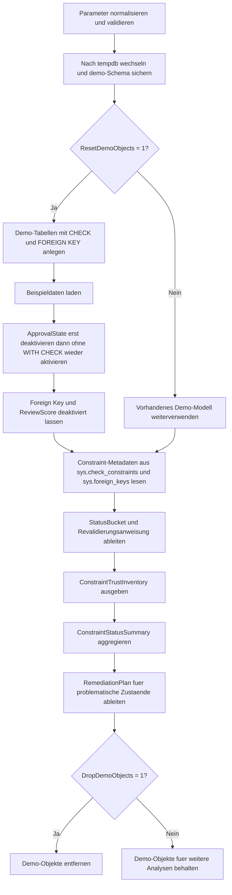

# ConstraintTrustStatusInventory.sql

Dieses Skript baut in `tempdb` ein kleines Demo-Modell mit bewusst unterschiedlichen Constraint-Zustaenden auf und inventarisiert anschliessend, welche `CHECK`- und `FOREIGN KEY`-Constraints trusted, enabled oder deaktiviert sind.

## Uebersicht

<!-- SQLDOC:SUMMARY_TABLE:BEGIN -->
| Feld | Wert |
|---|---|
| Script | [ConstraintTrustStatusInventory.sql](ConstraintTrustStatusInventory.sql) |
| Version | `1.0` |
| Typ | `didactic-lab` |
| Kapitel | `16_DataIntegrity_Constraints` |
| Sicherheit | `demo-write-tempdb` |
| Zweck | Inventarisiert Trust- und Aktivierungsstatus von Constraints und zeigt passende Revalidierungsbefehle. |
<!-- SQLDOC:SUMMARY_TABLE:END -->

## Einordnung

Das Artefakt eignet sich fuer Trainings zu Constraint-Wartung, Bulk-Load-Nacharbeiten und Metadaten-Reviews. Statt den Unterschied zwischen `CHECK CONSTRAINT`, `WITH CHECK CHECK CONSTRAINT`, Trusted-Status und deaktivierten Regeln nur theoretisch zu beschreiben, erzeugt das Skript diese Zustaende in einem kontrollierten Demo-Bestand und liest sie anschliessend direkt aus den Katalogsichten.

## Annahmen

- Die Erstversion verwendet ausschliesslich Objekte im Schema `demo` innerhalb von `tempdb`.
- Trusted-, enabled-not-trusted- und disabled-not-trusted-Zustaende werden absichtlich ueber `ALTER TABLE ... NOCHECK` und anschliessende Reaktivierung ohne `WITH CHECK` erzeugt.
- Die Remediation-Anweisungen werden nur als Resultset ausgegeben und nicht automatisch ausgefuehrt.
- Das Inventar konzentriert sich auf `CHECK`- und `FOREIGN KEY`-Constraints, weil gerade dort Trusted-Status und Revalidierung im Alltag relevant sind.

## Anwendungsfall

Typisch ist die Nutzung nach Datenimports oder Wartungsarbeiten, wenn Constraints zeitweise abgeschaltet oder ohne Vollpruefung wieder aktiviert wurden. Das Skript zeigt in einer didaktischen Erstversion, welche Katalogspalten fuer die Bewertung relevant sind und welche `ALTER TABLE`-Anweisung denselben Zustand wieder in einen trusted Zustand ueberfuehren wuerde.

## Parameter

<!-- SQLDOC:PARAMETERS_TABLE:BEGIN -->
| Parameter | SQL-Typ | Pflicht | Beschreibung |
|---|---|---|---|
| `@ConstraintType` | `NVARCHAR(20)` | Nein | Waehlt `ALL`, `CHECK` oder `FOREIGN KEY` fuer die Inventur. |
| `@StatusBucket` | `NVARCHAR(40)` | Nein | Filtert auf `ALL`, `TRUSTED_ENABLED`, `ENABLED_NOT_TRUSTED` oder `DISABLED_NOT_TRUSTED`. |
| `@ResetDemoObjects` | `BIT` | Nein | Baut bei `1` das Demo-Modell vor der Inventur neu auf. |
| `@DropDemoObjects` | `BIT` | Nein | Entfernt bei `1` die Demo-Objekte am Ende wieder aus `tempdb`. |
<!-- SQLDOC:PARAMETERS_TABLE:END -->

## Abhaengigkeiten

<!-- SQLDOC:DEPENDENCIES_LIST:BEGIN -->
- `tempdb`
- `sys.schemas`
- `sys.tables`
- `sys.check_constraints`
- `sys.foreign_keys`
- `STRING_AGG()`
- `QUOTENAME()`
- `CASE`
- `DROP TABLE IF EXISTS`
<!-- SQLDOC:DEPENDENCIES_LIST:END -->

## Hinweise

- `ConstraintTrustInventory` ist die Detailsicht mit Status-Bucket, Trust-Flags und empfohlener Folgeaktion je Constraint.
- `ConstraintStatusSummary` verdichtet, welche Constraint-Arten in welchem Zustand im Demo-Bestand vorkommen.
- `RemediationPlan` priorisiert deaktivierte und nicht trusted Regeln und liefert direkt den passenden `WITH CHECK CHECK CONSTRAINT`-Befehl.
- `CK_ConstraintTrustChild_ApprovalState` wird absichtlich wieder aktiviert, aber nicht trusted gelassen, damit der Unterschied zwischen aktiv und trusted sichtbar bleibt.

## Versionshistorie

<!-- SQLDOC:VERSION_HISTORY_TABLE:BEGIN -->
| Version | Datum | User | Beschreibung |
|---|---|---|---|
| `1.0` | `2026-04-18` | `ER` | Erstversion eines didaktischen Inventars fuer Trust- und Aktivierungsstatus von Constraints. |
<!-- SQLDOC:VERSION_HISTORY_TABLE:END -->

## Ablauf

<!-- SQLDOC:MERMAID:BEGIN -->

<!-- SQLDOC:MERMAID:END -->

## SQL-Code

<!-- SQLDOC:SQL_CODE:BEGIN -->
```sql
/*
BEGIN:SQL-HEADER v1
---
sql_header: v1
script_name: "ConstraintTrustStatusInventory.sql"
script_version: "1.0"
script_type: "didactic-lab"
chapter: "16_DataIntegrity_Constraints"

purpose: >
  Baut in tempdb ein kleines Constraint-Demo-Modell mit bewusst
  unterschiedlichen Trust- und Aktivierungszustaenden auf und inventarisiert
  danach, welche CHECK- und FOREIGN KEY-Constraints trusted, enabled oder
  deaktiviert sind.

parameters:
  - name: "@ConstraintType"
    sql_type: "NVARCHAR(20)"
    direction: "IN"
    required: false
    description: "ALL, CHECK oder FOREIGN KEY fuer die Inventur."
  - name: "@StatusBucket"
    sql_type: "NVARCHAR(40)"
    direction: "IN"
    required: false
    description: "ALL, TRUSTED_ENABLED, ENABLED_NOT_TRUSTED oder DISABLED_NOT_TRUSTED."
  - name: "@ResetDemoObjects"
    sql_type: "BIT"
    direction: "IN"
    required: false
    description: "1 baut das Demo-Modell in tempdb vor der Inventur neu auf."
  - name: "@DropDemoObjects"
    sql_type: "BIT"
    direction: "IN"
    required: false
    description: "1 entfernt die Demo-Objekte am Ende wieder aus tempdb."

result_sets:
  - name: "ConstraintTrustInventory"
    description: "Detailinventar je CHECK- oder FOREIGN KEY-Constraint mit Trust-Status, Aktivierung und empfohlener Folgeaktion."
  - name: "ConstraintStatusSummary"
    description: "Verdichtung nach Constraint-Typ und Status-Bucket mit Anzahl und betroffenen Objekten."
  - name: "RemediationPlan"
    description: "Vorschlaege fuer ALTER TABLE-Befehle, um deaktivierte oder nicht trusted Constraints wieder zu pruefen."

dependencies:
  - "tempdb"
  - "sys.schemas"
  - "sys.tables"
  - "sys.check_constraints"
  - "sys.foreign_keys"
  - "STRING_AGG()"
  - "QUOTENAME()"
  - "CASE"
  - "DROP TABLE IF EXISTS"

safety:
  level: "demo-write-tempdb"
  writes_data: true

documentation:
  markdown_file: "T-SQL/16_DataIntegrity_Constraints/SQLScripts/ConstraintTrustStatusInventory.md"
  sync_blocks:
    - "SUMMARY_TABLE"
    - "PARAMETERS_TABLE"
    - "DEPENDENCIES_LIST"
    - "VERSION_HISTORY_TABLE"
    - "SQL_CODE"
  mermaid:
    mode: "ai-agent-from-sql"
    source: "script-body"

main_responsible:
  name: "Erhard Rainer"
  initials: "ER"

version_history:
  - version: "1.0"
    date: "2026-04-18"
    user: "ER"
    description: "Erstversion eines didaktischen Inventars fuer Trust- und Aktivierungsstatus von Constraints."

notes:
  - "Die Erstversion erzeugt bewusst trusted, enabled-not-trusted und disabled-not-trusted Zustaende in tempdb."
  - "Alle vorgeschlagenen Remediation-Befehle werden nur als Resultset ausgegeben und nicht automatisch ausgefuehrt."
---
END:SQL-HEADER v1
*/

SET NOCOUNT ON;

DECLARE @ConstraintType NVARCHAR(20) = N'ALL';
DECLARE @StatusBucket NVARCHAR(40) = N'ALL';
DECLARE @ResetDemoObjects BIT = 1;
DECLARE @DropDemoObjects BIT = 1;

SET @ConstraintType = UPPER(@ConstraintType);
SET @StatusBucket = UPPER(@StatusBucket);

IF @ConstraintType NOT IN (N'ALL', N'CHECK', N'FOREIGN KEY')
BEGIN
    THROW 50000, '@ConstraintType muss ALL, CHECK oder FOREIGN KEY sein.', 1;
END;

IF @StatusBucket NOT IN (N'ALL', N'TRUSTED_ENABLED', N'ENABLED_NOT_TRUSTED', N'DISABLED_NOT_TRUSTED')
BEGIN
    THROW 50001, '@StatusBucket muss ALL, TRUSTED_ENABLED, ENABLED_NOT_TRUSTED oder DISABLED_NOT_TRUSTED sein.', 1;
END;

IF @ResetDemoObjects NOT IN (0, 1)
BEGIN
    THROW 50002, '@ResetDemoObjects muss 0 oder 1 sein.', 1;
END;

IF @DropDemoObjects NOT IN (0, 1)
BEGIN
    THROW 50003, '@DropDemoObjects muss 0 oder 1 sein.', 1;
END;

USE tempdb;

IF NOT EXISTS
(
    SELECT 1
    FROM sys.schemas
    WHERE name = N'demo'
)
BEGIN
    EXEC(N'CREATE SCHEMA demo AUTHORIZATION dbo;');
END;

IF @ResetDemoObjects = 1
BEGIN
    DROP TABLE IF EXISTS demo.ConstraintTrustChild;
    DROP TABLE IF EXISTS demo.ConstraintTrustParent;

    CREATE TABLE demo.ConstraintTrustParent
    (
        ParentID INT NOT NULL,
        ParentCode NVARCHAR(20) NOT NULL,
        CreditLimit DECIMAL(10, 2) NOT NULL,
        ParentStatus NVARCHAR(20) NOT NULL,
        CONSTRAINT PK_ConstraintTrustParent PRIMARY KEY CLUSTERED (ParentID),
        CONSTRAINT UQ_ConstraintTrustParent_Code UNIQUE (ParentCode),
        CONSTRAINT CK_ConstraintTrustParent_CreditLimit CHECK (CreditLimit >= 0.00),
        CONSTRAINT CK_ConstraintTrustParent_Status CHECK (ParentStatus IN (N'active', N'hold'))
    );

    CREATE TABLE demo.ConstraintTrustChild
    (
        ChildID INT NOT NULL,
        ParentID INT NOT NULL,
        BatchCode NVARCHAR(20) NOT NULL,
        ApprovalState NVARCHAR(20) NOT NULL,
        Quantity INT NOT NULL,
        ReviewScore TINYINT NOT NULL,
        CONSTRAINT PK_ConstraintTrustChild PRIMARY KEY CLUSTERED (ChildID),
        CONSTRAINT FK_ConstraintTrustChild_Parent FOREIGN KEY (ParentID)
            REFERENCES demo.ConstraintTrustParent (ParentID),
        CONSTRAINT UQ_ConstraintTrustChild_BatchCode UNIQUE (BatchCode),
        CONSTRAINT CK_ConstraintTrustChild_Quantity CHECK (Quantity BETWEEN 1 AND 500),
        CONSTRAINT CK_ConstraintTrustChild_ApprovalState CHECK (ApprovalState IN (N'queued', N'approved', N'rejected')),
        CONSTRAINT CK_ConstraintTrustChild_ReviewScore CHECK (ReviewScore BETWEEN 1 AND 10)
    );

    INSERT INTO demo.ConstraintTrustParent
    (
        ParentID,
        ParentCode,
        CreditLimit,
        ParentStatus
    )
    VALUES
        (1, N'P-100', 1200.00, N'active'),
        (2, N'P-200', 500.00, N'hold'),
        (3, N'P-300', 250.00, N'active');

    INSERT INTO demo.ConstraintTrustChild
    (
        ChildID,
        ParentID,
        BatchCode,
        ApprovalState,
        Quantity,
        ReviewScore
    )
    VALUES
        (101, 1, N'B-101', N'approved', 15, 9),
        (102, 1, N'B-102', N'queued', 4, 6),
        (103, 2, N'B-103', N'rejected', 2, 3),
        (104, 3, N'B-104', N'approved', 8, 10);

    ALTER TABLE demo.ConstraintTrustChild NOCHECK CONSTRAINT CK_ConstraintTrustChild_ApprovalState;
    ALTER TABLE demo.ConstraintTrustChild CHECK CONSTRAINT CK_ConstraintTrustChild_ApprovalState;

    ALTER TABLE demo.ConstraintTrustChild NOCHECK CONSTRAINT FK_ConstraintTrustChild_Parent;

    ALTER TABLE demo.ConstraintTrustChild NOCHECK CONSTRAINT CK_ConstraintTrustChild_ReviewScore;
END;

DROP TABLE IF EXISTS #ConstraintTrustInventory;
WITH ConstraintInventory AS
(
    SELECT
        s.name AS SchemaName,
        t.name AS TableName,
        cc.name AS ConstraintName,
        CAST(N'CHECK' AS NVARCHAR(20)) AS ConstraintType,
        cc.is_disabled AS IsDisabled,
        cc.is_not_trusted AS IsNotTrusted,
        CAST(cc.is_not_for_replication AS BIT) AS IsNotForReplication,
        cc.definition AS ConstraintDefinition
    FROM sys.check_constraints AS cc
    INNER JOIN sys.tables AS t
        ON t.object_id = cc.parent_object_id
    INNER JOIN sys.schemas AS s
        ON s.schema_id = t.schema_id
    WHERE t.object_id IN
    (
        OBJECT_ID(N'demo.ConstraintTrustParent', N'U'),
        OBJECT_ID(N'demo.ConstraintTrustChild', N'U')
    )
      AND @ConstraintType IN (N'ALL', N'CHECK')

    UNION ALL

    SELECT
        s.name AS SchemaName,
        t.name AS TableName,
        fk.name AS ConstraintName,
        CAST(N'FOREIGN KEY' AS NVARCHAR(20)) AS ConstraintType,
        fk.is_disabled AS IsDisabled,
        fk.is_not_trusted AS IsNotTrusted,
        CAST(fk.is_not_for_replication AS BIT) AS IsNotForReplication,
        CAST(NULL AS NVARCHAR(MAX)) AS ConstraintDefinition
    FROM sys.foreign_keys AS fk
    INNER JOIN sys.tables AS t
        ON t.object_id = fk.parent_object_id
    INNER JOIN sys.schemas AS s
        ON s.schema_id = t.schema_id
    WHERE t.object_id IN
    (
        OBJECT_ID(N'demo.ConstraintTrustParent', N'U'),
        OBJECT_ID(N'demo.ConstraintTrustChild', N'U')
    )
      AND @ConstraintType IN (N'ALL', N'FOREIGN KEY')
)
SELECT
    ci.SchemaName,
    ci.TableName,
    ci.ConstraintName,
    ci.ConstraintType,
    ci.IsDisabled,
    ci.IsNotTrusted,
    ci.IsNotForReplication,
    CASE
        WHEN ci.IsDisabled = 0 AND ci.IsNotTrusted = 0 THEN N'TRUSTED_ENABLED'
        WHEN ci.IsDisabled = 0 AND ci.IsNotTrusted = 1 THEN N'ENABLED_NOT_TRUSTED'
        WHEN ci.IsDisabled = 1 AND ci.IsNotTrusted = 1 THEN N'DISABLED_NOT_TRUSTED'
        ELSE N'OTHER_STATE'
    END AS StatusBucket,
    CASE
        WHEN ci.IsDisabled = 0 AND ci.IsNotTrusted = 0 THEN N'Keine Aktion notwendig.'
        WHEN ci.IsDisabled = 0 AND ci.IsNotTrusted = 1 THEN N'WITH CHECK CHECK CONSTRAINT erneut ausfuehren, um den Trusted-Status wiederherzustellen.'
        WHEN ci.IsDisabled = 1 AND ci.IsNotTrusted = 1 THEN N'Constraint zuerst aktivieren und dabei mit WITH CHECK neu validieren.'
        ELSE N'Sonderfall pruefen.'
    END AS RecommendedAction,
    CASE
        WHEN ci.ConstraintType = N'CHECK' THEN
            N'ALTER TABLE '
            + QUOTENAME(ci.SchemaName) + N'.' + QUOTENAME(ci.TableName)
            + N' WITH CHECK CHECK CONSTRAINT ' + QUOTENAME(ci.ConstraintName) + N';'
        WHEN ci.ConstraintType = N'FOREIGN KEY' THEN
            N'ALTER TABLE '
            + QUOTENAME(ci.SchemaName) + N'.' + QUOTENAME(ci.TableName)
            + N' WITH CHECK CHECK CONSTRAINT ' + QUOTENAME(ci.ConstraintName) + N';'
        ELSE NULL
    END AS RevalidationStatement,
    ci.ConstraintDefinition
INTO #ConstraintTrustInventory
FROM ConstraintInventory AS ci
WHERE @StatusBucket = N'ALL'
   OR (
        @StatusBucket = N'TRUSTED_ENABLED'
        AND ci.IsDisabled = 0
        AND ci.IsNotTrusted = 0
      )
   OR (
        @StatusBucket = N'ENABLED_NOT_TRUSTED'
        AND ci.IsDisabled = 0
        AND ci.IsNotTrusted = 1
      )
   OR (
        @StatusBucket = N'DISABLED_NOT_TRUSTED'
        AND ci.IsDisabled = 1
        AND ci.IsNotTrusted = 1
      );

SELECT
    cti.SchemaName,
    cti.TableName,
    cti.ConstraintName,
    cti.ConstraintType,
    cti.StatusBucket,
    cti.IsDisabled,
    cti.IsNotTrusted,
    cti.IsNotForReplication,
    cti.RecommendedAction,
    cti.RevalidationStatement,
    cti.ConstraintDefinition
FROM #ConstraintTrustInventory AS cti
ORDER BY
    cti.ConstraintType,
    cti.StatusBucket,
    cti.SchemaName,
    cti.TableName,
    cti.ConstraintName;

SELECT
    cti.ConstraintType,
    cti.StatusBucket,
    COUNT(*) AS ConstraintCount,
    STRING_AGG(CONCAT(cti.SchemaName, N'.', cti.TableName, N'.', cti.ConstraintName), N'; ')
        WITHIN GROUP (ORDER BY cti.SchemaName, cti.TableName, cti.ConstraintName) AS ConstraintList
FROM #ConstraintTrustInventory AS cti
GROUP BY
    cti.ConstraintType,
    cti.StatusBucket
ORDER BY
    cti.ConstraintType,
    cti.StatusBucket;

SELECT
    ROW_NUMBER() OVER
    (
        ORDER BY
            CASE cti.StatusBucket
                WHEN N'DISABLED_NOT_TRUSTED' THEN 1
                WHEN N'ENABLED_NOT_TRUSTED' THEN 2
                ELSE 3
            END,
            cti.ConstraintType,
            cti.SchemaName,
            cti.TableName,
            cti.ConstraintName
    ) AS ExecutionOrder,
    cti.SchemaName,
    cti.TableName,
    cti.ConstraintName,
    cti.ConstraintType,
    cti.StatusBucket,
    cti.RecommendedAction,
    cti.RevalidationStatement
FROM #ConstraintTrustInventory AS cti
WHERE cti.StatusBucket IN (N'ENABLED_NOT_TRUSTED', N'DISABLED_NOT_TRUSTED')
ORDER BY
    ExecutionOrder;

DROP TABLE IF EXISTS #ConstraintTrustInventory;

IF @DropDemoObjects = 1
BEGIN
    DROP TABLE IF EXISTS demo.ConstraintTrustChild;
    DROP TABLE IF EXISTS demo.ConstraintTrustParent;
END;
```
<!-- SQLDOC:SQL_CODE:END -->
