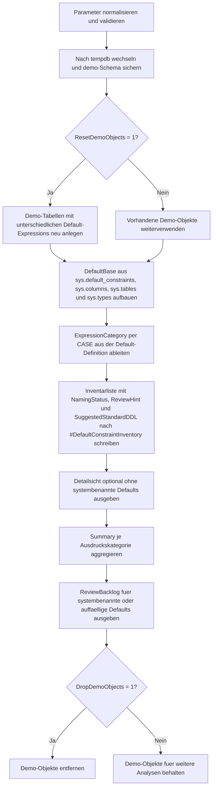

# DefaultConstraintInventory.sql

Dieses Skript baut in `tempdb` ein kleines Demo-Schema mit unterschiedlichen `DEFAULT`-Expressions auf und inventarisiert danach, welche Defaults je Tabelle und Spalte definiert sind, wie sie benannt wurden und welche Ausdrucksmuster sich dahinter verbergen.

## Uebersicht

<!-- SQLDOC:SUMMARY_TABLE:BEGIN -->
| Feld | Wert |
|---|---|
| Script | [DefaultConstraintInventory.sql](DefaultConstraintInventory.sql) |
| Version | `1.0` |
| Typ | `didactic-lab` |
| Kapitel | `16_DataIntegrity_Constraints` |
| Sicherheit | `demo-write-tempdb` |
| Zweck | Inventarisiert Default Constraints, klassifiziert ihre Expressions und markiert uneinheitliche Benennungen. |
<!-- SQLDOC:SUMMARY_TABLE:END -->

## Einordnung

Das Artefakt eignet sich fuer Unterricht, Reviews und Metadaten-Checks rund um `DEFAULT`-Constraints. Statt nur allgemein zu beschreiben, welche Informationen in `sys.default_constraints` stecken, erzeugt die Erstversion einen kontrollierten Bestand in `tempdb` mit literalen, funktionsbasierten und bewusst uneinheitlichen Ausdruecken.

## Annahmen

- Die Erstversion arbeitet didaktisch in `tempdb` und erstellt dort das Schema `demo`.
- Default-Ausdruecke werden in vier Kategorien eingeteilt: `LITERAL`, `FUNCTION`, `NULL_COERCION` und `EXPRESSION`.
- Systembenannte Defaults werden absichtlich zugelassen, damit ein typischer Review-Fall sichtbar bleibt.
- Die vorgeschlagenen `ALTER TABLE`-Anweisungen werden nur als Resultset ausgegeben und nicht automatisch ausgefuehrt.
- Die Kategorisierung ist bewusst heuristisch und soll vor allem typische Review-Fragen fuer Schulungszwecke sichtbar machen.

## Anwendungsfall

Das Muster passt zu Governance-Checks, Refactoring-Vorbereitung und Trainings zu Datenintegritaet. In einem echten Zielsystem kann spaeter der Demo-Aufbau entfallen und die Inventur direkt auf produktive Schemas ausgeweitet werden, waehrend die Resultsets fuer Review, Standardisierung und technische Dokumentation erhalten bleiben.

## Parameter

<!-- SQLDOC:PARAMETERS_TABLE:BEGIN -->
| Parameter | SQL-Typ | Pflicht | Beschreibung |
|---|---|---|---|
| `@ExpressionCategory` | `NVARCHAR(30)` | Nein | Filtert auf `ALL`, `LITERAL`, `FUNCTION`, `NULL_COERCION` oder `EXPRESSION`. |
| `@IncludeSystemNamed` | `BIT` | Nein | `1` zeigt auch systembenannte Defaults; `0` blendet sie in der Detailsicht aus. |
| `@ResetDemoObjects` | `BIT` | Nein | `1` erstellt das Demo-Schema in `tempdb` vor der Inventur neu. |
| `@DropDemoObjects` | `BIT` | Nein | `1` entfernt die Demo-Objekte am Ende wieder aus `tempdb`. |
<!-- SQLDOC:PARAMETERS_TABLE:END -->

## Abhaengigkeiten

<!-- SQLDOC:DEPENDENCIES_LIST:BEGIN -->
- `tempdb`
- `sys.schemas`
- `sys.tables`
- `sys.columns`
- `sys.types`
- `sys.default_constraints`
- `STRING_AGG()`
- `QUOTENAME()`
- `CASE`
- `DROP TABLE IF EXISTS`
<!-- SQLDOC:DEPENDENCIES_LIST:END -->

## Hinweise

- `DefaultConstraintInventory` ist die Detailsicht mit Tabelle, Spalte, Ausdruck, Namensstatus und Vorschlags-DDL.
- `DefaultExpressionSummary` zeigt, welche Ausdruckskategorien im Demo-Bestand vorkommen und in wie vielen Faellen systembenannte Defaults beteiligt sind.
- `ReviewBacklog` priorisiert umbenennungsbeduerftige oder fachlich auffaellige Defaults.
- Die Heuristik behandelt `SYSUTCDATETIME`, `NEWID`, `DATEADD` und `CONVERT` als funktionsbasierte Defaults; rein numerische oder textuelle Werte landen in `LITERAL`.

## Versionshistorie

<!-- SQLDOC:VERSION_HISTORY_TABLE:BEGIN -->
| Version | Datum | User | Beschreibung |
|---|---|---|---|
| `1.0` | `2026-04-18` | `ER` | Erstversion eines didaktischen Inventars fuer Default Constraints und ihre Expressions. |
<!-- SQLDOC:VERSION_HISTORY_TABLE:END -->

## Ablauf

<!-- SQLDOC:MERMAID:BEGIN -->

<!-- SQLDOC:MERMAID:END -->

## SQL-Code

<!-- SQLDOC:SQL_CODE:BEGIN -->
```sql
/*
BEGIN:SQL-HEADER v1
---
sql_header: v1
script_name: "DefaultConstraintInventory.sql"
script_version: "1.0"
script_type: "didactic-lab"
chapter: "16_DataIntegrity_Constraints"

purpose: >
  Baut in tempdb ein kleines Demo-Schema mit unterschiedlichen DEFAULT-
  Expressions auf und inventarisiert anschliessend, welche Defaults je Tabelle
  und Spalte definiert sind, wie sie benannt wurden und welche Ausdrucksmuster
  dabei verwendet werden.

parameters:
  - name: "@ExpressionCategory"
    sql_type: "NVARCHAR(30)"
    direction: "IN"
    required: false
    description: "ALL, LITERAL, FUNCTION, NULL_COERCION oder EXPRESSION fuer den Filter auf Ausdrucksmuster."
  - name: "@IncludeSystemNamed"
    sql_type: "BIT"
    direction: "IN"
    required: false
    description: "1 zeigt auch systembenannte Defaults; 0 blendet sie in der Detailsicht aus."
  - name: "@ResetDemoObjects"
    sql_type: "BIT"
    direction: "IN"
    required: false
    description: "1 erstellt das Demo-Schema in tempdb vor der Inventur neu."
  - name: "@DropDemoObjects"
    sql_type: "BIT"
    direction: "IN"
    required: false
    description: "1 entfernt die Demo-Objekte am Ende wieder aus tempdb."

result_sets:
  - name: "DefaultConstraintInventory"
    description: "Detailsicht je Default Constraint mit Tabelle, Spalte, Ausdruck, Namensqualitaet und Review-Hinweis."
  - name: "DefaultExpressionSummary"
    description: "Verdichtung nach Ausdruckskategorie mit Anzahl, betroffenen Tabellen und Anteil systembenannter Defaults."
  - name: "ReviewBacklog"
    description: "Priorisierte Review-Liste fuer systembenannte oder uneinheitliche Default-Ausdruecke inklusive Vorschlags-DDL."

dependencies:
  - "tempdb"
  - "sys.schemas"
  - "sys.tables"
  - "sys.columns"
  - "sys.types"
  - "sys.default_constraints"
  - "STRING_AGG()"
  - "QUOTENAME()"
  - "CASE"
  - "DROP TABLE IF EXISTS"

safety:
  level: "demo-write-tempdb"
  writes_data: true

documentation:
  markdown_file: "T-SQL/16_DataIntegrity_Constraints/SQLScripts/DefaultConstraintInventory.md"
  sync_blocks:
    - "SUMMARY_TABLE"
    - "PARAMETERS_TABLE"
    - "DEPENDENCIES_LIST"
    - "VERSION_HISTORY_TABLE"
    - "SQL_CODE"
  mermaid:
    mode: "ai-agent-from-sql"
    source: "script-body"

main_responsible:
  name: "Erhard Rainer"
  initials: "ER"

version_history:
  - version: "1.0"
    date: "2026-04-18"
    user: "ER"
    description: "Erstversion eines didaktischen Inventars fuer Default Constraints und ihre Expressions."

notes:
  - "Die Erstversion erzeugt absichtlich literalbasierte, funktionsbasierte und uneinheitlich benannte Defaults in tempdb."
  - "Review-DDL wird nur als Ergebnis ausgegeben und nicht automatisch ausgefuehrt."
---
END:SQL-HEADER v1
*/

SET NOCOUNT ON;

DECLARE @ExpressionCategory NVARCHAR(30) = N'ALL';
DECLARE @IncludeSystemNamed BIT = 1;
DECLARE @ResetDemoObjects BIT = 1;
DECLARE @DropDemoObjects BIT = 1;

SET @ExpressionCategory = UPPER(@ExpressionCategory);

IF @ExpressionCategory NOT IN (N'ALL', N'LITERAL', N'FUNCTION', N'NULL_COERCION', N'EXPRESSION')
BEGIN
    THROW 50000, '@ExpressionCategory muss ALL, LITERAL, FUNCTION, NULL_COERCION oder EXPRESSION sein.', 1;
END;

IF @IncludeSystemNamed NOT IN (0, 1)
BEGIN
    THROW 50001, '@IncludeSystemNamed muss 0 oder 1 sein.', 1;
END;

IF @ResetDemoObjects NOT IN (0, 1)
BEGIN
    THROW 50002, '@ResetDemoObjects muss 0 oder 1 sein.', 1;
END;

IF @DropDemoObjects NOT IN (0, 1)
BEGIN
    THROW 50003, '@DropDemoObjects muss 0 oder 1 sein.', 1;
END;

USE tempdb;

IF NOT EXISTS
(
    SELECT 1
    FROM sys.schemas
    WHERE name = N'demo'
)
BEGIN
    EXEC(N'CREATE SCHEMA demo AUTHORIZATION dbo;');
END;

IF @ResetDemoObjects = 1
BEGIN
    DROP TABLE IF EXISTS demo.DefaultInventoryShipment;
    DROP TABLE IF EXISTS demo.DefaultInventoryOrder;
    DROP TABLE IF EXISTS demo.DefaultInventoryCustomer;

    CREATE TABLE demo.DefaultInventoryCustomer
    (
        CustomerID INT NOT NULL,
        CustomerCode NVARCHAR(20) NOT NULL,
        LifecycleState NVARCHAR(20) NOT NULL
            CONSTRAINT DF_DefaultInventoryCustomer_LifecycleState DEFAULT (N'prospect'),
        CreditLimit DECIMAL(10, 2) NOT NULL
            CONSTRAINT DF_DefaultInventoryCustomer_CreditLimit DEFAULT ((0.00)),
        CreatedAtUtc DATETIME2(0) NOT NULL
            CONSTRAINT DF_DefaultInventoryCustomer_CreatedAtUtc DEFAULT (SYSUTCDATETIME()),
        IsPreferred BIT NOT NULL DEFAULT ((0)),
        CONSTRAINT PK_DefaultInventoryCustomer PRIMARY KEY CLUSTERED (CustomerID)
    );

    CREATE TABLE demo.DefaultInventoryOrder
    (
        OrderID INT NOT NULL,
        CustomerID INT NOT NULL,
        OrderDate DATE NOT NULL
            CONSTRAINT DF_DefaultInventoryOrder_OrderDate DEFAULT (CONVERT(date, SYSUTCDATETIME())),
        OrderStatus NVARCHAR(20) NOT NULL
            CONSTRAINT DF_DefaultInventoryOrder_OrderStatus DEFAULT (N'open'),
        CurrencyCode CHAR(3) NOT NULL
            CONSTRAINT DF_DefaultInventoryOrder_CurrencyCode DEFAULT (N'EUR'),
        ReviewComment NVARCHAR(200) NULL
            CONSTRAINT DF_DefaultInventoryOrder_ReviewComment DEFAULT (NULL),
        RetryCounter INT NOT NULL
            CONSTRAINT DF_DefaultInventoryOrder_RetryCounter DEFAULT ((1 + 0)),
        CONSTRAINT PK_DefaultInventoryOrder PRIMARY KEY CLUSTERED (OrderID),
        CONSTRAINT FK_DefaultInventoryOrder_Customer FOREIGN KEY (CustomerID)
            REFERENCES demo.DefaultInventoryCustomer (CustomerID)
    );

    CREATE TABLE demo.DefaultInventoryShipment
    (
        ShipmentID INT NOT NULL,
        OrderID INT NOT NULL,
        DispatchState NVARCHAR(20) NOT NULL
            CONSTRAINT DF_DefaultInventoryShipment_DispatchState DEFAULT (N'queued'),
        DispatchPriority TINYINT NOT NULL
            CONSTRAINT DF_DefaultInventoryShipment_DispatchPriority DEFAULT ((5)),
        PlannedDispatchAt DATETIME2(0) NULL
            CONSTRAINT DF_DefaultInventoryShipment_PlannedDispatchAt DEFAULT (DATEADD(HOUR, 4, SYSUTCDATETIME())),
        TrackingToken UNIQUEIDENTIFIER NOT NULL
            CONSTRAINT DF_DefaultInventoryShipment_TrackingToken DEFAULT (NEWID()),
        CarrierNote NVARCHAR(100) NULL
            CONSTRAINT DF_DefaultInventoryShipment_CarrierNote DEFAULT (N''),
        CONSTRAINT PK_DefaultInventoryShipment PRIMARY KEY CLUSTERED (ShipmentID),
        CONSTRAINT FK_DefaultInventoryShipment_Order FOREIGN KEY (OrderID)
            REFERENCES demo.DefaultInventoryOrder (OrderID)
    );
END;

DROP TABLE IF EXISTS #DefaultConstraintInventory;
WITH DefaultBase AS
(
    SELECT
        s.name AS SchemaName,
        t.name AS TableName,
        c.column_id AS ColumnID,
        c.name AS ColumnName,
        ty.name AS DataTypeName,
        dc.name AS ConstraintName,
        dc.is_system_named AS IsSystemNamed,
        dc.definition AS DefaultExpression,
        CASE
            WHEN dc.definition LIKE N'%SYSUTCDATETIME(%'
              OR dc.definition LIKE N'%GETDATE(%'
              OR dc.definition LIKE N'%NEWID(%'
              OR dc.definition LIKE N'%DATEADD(%'
              OR dc.definition LIKE N'%CONVERT(%'
                THEN N'FUNCTION'
            WHEN dc.definition LIKE N'%(NULL)%'
              OR dc.definition = N'NULL'
                THEN N'NULL_COERCION'
            WHEN dc.definition LIKE N'%+%'
              OR dc.definition LIKE N'%-%'
              OR dc.definition LIKE N'%/%'
              OR dc.definition LIKE N'%*%'
                THEN N'EXPRESSION'
            ELSE N'LITERAL'
        END AS ExpressionCategory
    FROM sys.default_constraints AS dc
    INNER JOIN sys.tables AS t
        ON t.object_id = dc.parent_object_id
    INNER JOIN sys.schemas AS s
        ON s.schema_id = t.schema_id
    INNER JOIN sys.columns AS c
        ON c.object_id = dc.parent_object_id
       AND c.column_id = dc.parent_column_id
    INNER JOIN sys.types AS ty
        ON ty.user_type_id = c.user_type_id
    WHERE t.object_id IN
    (
        OBJECT_ID(N'demo.DefaultInventoryCustomer', N'U'),
        OBJECT_ID(N'demo.DefaultInventoryOrder', N'U'),
        OBJECT_ID(N'demo.DefaultInventoryShipment', N'U')
    )
)
SELECT
    db.SchemaName,
    db.TableName,
    db.ColumnID,
    db.ColumnName,
    db.DataTypeName,
    db.ConstraintName,
    db.IsSystemNamed,
    db.DefaultExpression,
    db.ExpressionCategory,
    CASE
        WHEN db.ConstraintName LIKE N'DF_' + db.TableName + N'_%' THEN N'CONVENTION_OK'
        WHEN db.IsSystemNamed = 1 THEN N'SYSTEM_NAMED'
        ELSE N'REVIEW_NAME'
    END AS NamingStatus,
    CASE
        WHEN db.ExpressionCategory = N'FUNCTION' THEN N'Zeit- oder Identitaetsfunktion pruefen'
        WHEN db.ExpressionCategory = N'NULL_COERCION' THEN N'NULL-Default auf Notwendigkeit pruefen'
        WHEN db.ExpressionCategory = N'EXPRESSION' THEN N'Berechneten Default auf Lesbarkeit pruefen'
        ELSE N'Statischer Literalwert'
    END AS ReviewHint,
    N'ALTER TABLE '
        + QUOTENAME(db.SchemaName) + N'.' + QUOTENAME(db.TableName)
        + N' DROP CONSTRAINT ' + QUOTENAME(db.ConstraintName)
        + N'; ALTER TABLE '
        + QUOTENAME(db.SchemaName) + N'.' + QUOTENAME(db.TableName)
        + N' ADD CONSTRAINT '
        + QUOTENAME(N'DF_' + db.TableName + N'_' + db.ColumnName)
        + N' DEFAULT ' + db.DefaultExpression + N' FOR ' + QUOTENAME(db.ColumnName) + N';' AS SuggestedStandardDDL
INTO #DefaultConstraintInventory
FROM DefaultBase AS db
WHERE @ExpressionCategory = N'ALL'
   OR db.ExpressionCategory = @ExpressionCategory;

SELECT
    dci.SchemaName,
    dci.TableName,
    dci.ColumnID,
    dci.ColumnName,
    dci.DataTypeName,
    dci.ConstraintName,
    dci.IsSystemNamed,
    dci.ExpressionCategory,
    dci.DefaultExpression,
    dci.NamingStatus,
    dci.ReviewHint,
    dci.SuggestedStandardDDL
FROM #DefaultConstraintInventory AS dci
WHERE @IncludeSystemNamed = 1
   OR dci.IsSystemNamed = 0
ORDER BY
    dci.TableName,
    dci.ColumnID;

SELECT
    dci.ExpressionCategory,
    COUNT(*) AS DefaultConstraintCount,
    SUM(CASE WHEN dci.IsSystemNamed = 1 THEN 1 ELSE 0 END) AS SystemNamedCount,
    summary_tables.TablesCovered
FROM #DefaultConstraintInventory AS dci
OUTER APPLY
(
    SELECT STRING_AGG(table_list.TableName, N', ') WITHIN GROUP (ORDER BY table_list.TableName) AS TablesCovered
    FROM
    (
        SELECT DISTINCT inner_dci.TableName
        FROM #DefaultConstraintInventory AS inner_dci
        WHERE inner_dci.ExpressionCategory = dci.ExpressionCategory
    ) AS table_list
) AS summary_tables
GROUP BY
    dci.ExpressionCategory,
    summary_tables.TablesCovered
ORDER BY
    dci.ExpressionCategory;

SELECT
    dci.TableName,
    dci.ColumnName,
    dci.ConstraintName,
    dci.ExpressionCategory,
    dci.NamingStatus,
    dci.ReviewHint,
    dci.SuggestedStandardDDL
FROM #DefaultConstraintInventory AS dci
WHERE dci.IsSystemNamed = 1
   OR dci.NamingStatus <> N'CONVENTION_OK'
   OR dci.ExpressionCategory IN (N'NULL_COERCION', N'EXPRESSION')
ORDER BY
    CASE
        WHEN dci.IsSystemNamed = 1 THEN 1
        WHEN dci.ExpressionCategory = N'EXPRESSION' THEN 2
        WHEN dci.ExpressionCategory = N'NULL_COERCION' THEN 3
        ELSE 4
    END,
    dci.TableName,
    dci.ColumnID;

IF @DropDemoObjects = 1
BEGIN
    DROP TABLE IF EXISTS demo.DefaultInventoryShipment;
    DROP TABLE IF EXISTS demo.DefaultInventoryOrder;
    DROP TABLE IF EXISTS demo.DefaultInventoryCustomer;
END;
```
<!-- SQLDOC:SQL_CODE:END -->
