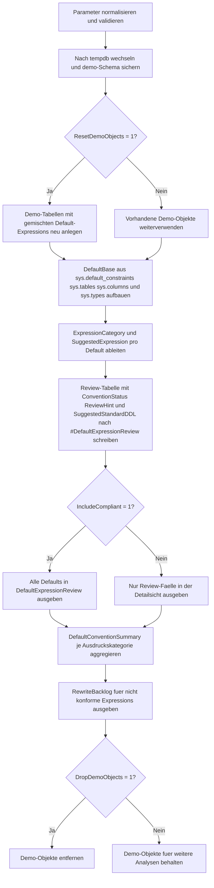

# DefaultExpressionStandardizer.sql

Dieses Skript erstellt in `tempdb` ein kleines Demo-Schema mit unterschiedlich formulierten `DEFAULT`-Expressions und prueft danach, welche Schreibweisen bereits einer einfachen Zielkonvention folgen. Fuer auffaellige Faelle liefert es nur Review-Hinweise und standardisierte Ersatz-Ausdruecke als Vorschlag.

## Uebersicht

<!-- SQLDOC:SUMMARY_TABLE:BEGIN -->
| Feld | Wert |
|---|---|
| Script | [DefaultExpressionStandardizer.sql](DefaultExpressionStandardizer.sql) |
| Version | `1.0` |
| Typ | `didactic-lab` |
| Kapitel | `16_DataIntegrity_Constraints` |
| Sicherheit | `demo-write-tempdb` |
| Zweck | Bewertet Default-Expressions gegen einfache Konventionen und leitet standardisierte Ersatz-Ausdruecke fuer Reviews ab. |
<!-- SQLDOC:SUMMARY_TABLE:END -->

## Einordnung

Das Artefakt passt zu Review-Workshops, Governance-Checks und Unterrichtseinheiten rund um `DEFAULT`-Constraints. Statt produktive Tabellen direkt umzuschreiben, baut die Erstversion bewusst reproduzierbare Demo-Objekte in `tempdb` auf und zeigt daran, wie uneinheitliche Literale, Funktionen und konstante Ausdruecke erkannt und vereinheitlicht werden koennen.

## Annahmen

- Die Erstversion arbeitet didaktisch in `tempdb` und erstellt dort das Schema `demo`.
- Die Zielkonvention bevorzugt einfache Klammerung, Unicode-Literale fuer Textwerte und grossgeschriebene Funktionsnamen.
- Konstante Rechenausdruecke wie `((1 + 0))` werden als Review-Fall behandelt und auf einen direkten Zielwert vereinfacht.
- Leere Zeichenketten und `NULL`-Defaults werden nicht verhindert, aber explizit als Stilthema markiert.
- Die vorgeschlagenen `ALTER TABLE`-Anweisungen werden nur als Resultset ausgegeben und nicht automatisch ausgefuehrt.

## Anwendungsfall

Das Muster eignet sich fuer technische Schulungen, Datenbank-Guidelines und Refactoring-Vorbereitung. In spaeteren Ausbaustufen kann der Demo-Aufbau entfallen und dieselbe Review-Logik direkt auf Zielschemata angewendet werden, waehrend die Resultsets als Backlog fuer Standardisierung und Dokumentation erhalten bleiben.

## Parameter

<!-- SQLDOC:PARAMETERS_TABLE:BEGIN -->
| Parameter | SQL-Typ | Pflicht | Beschreibung |
|---|---|---|---|
| `@IncludeCompliant` | `BIT` | Nein | `1` zeigt auch bereits konforme Defaults; `0` beschraenkt die Detailsicht auf Review-Faelle. |
| `@TargetCategory` | `NVARCHAR(30)` | Nein | Filtert auf `ALL`, `LITERAL`, `FUNCTION`, `NULL_STYLE`, `EXPRESSION` oder `EMPTY_STRING`. |
| `@ResetDemoObjects` | `BIT` | Nein | `1` erstellt das Demo-Schema in `tempdb` vor dem Review neu. |
| `@DropDemoObjects` | `BIT` | Nein | `1` entfernt die Demo-Objekte am Ende wieder aus `tempdb`. |
<!-- SQLDOC:PARAMETERS_TABLE:END -->

## Abhaengigkeiten

<!-- SQLDOC:DEPENDENCIES_LIST:BEGIN -->
- `tempdb`
- `sys.schemas`
- `sys.tables`
- `sys.columns`
- `sys.types`
- `sys.default_constraints`
- `STRING_AGG()`
- `REPLACE()`
- `UPPER()`
- `DROP TABLE IF EXISTS`
<!-- SQLDOC:DEPENDENCIES_LIST:END -->

## Hinweise

- `DefaultExpressionReview` zeigt pro Default Constraint Original-Ausdruck, Zielausdruck, Status und Vorschlags-DDL.
- `DefaultConventionSummary` verdichtet die Review-Ergebnisse je Ausdruckskategorie.
- `RewriteBacklog` priorisiert nur die Defaults, deren Ausdruck noch nicht der Zielkonvention entspricht.
- Funktionsaufrufe wie `sysutcdatetime()` oder `newid()` werden fuer das Review auf grossgeschriebene Schreibweise mit expliziten Klammern normalisiert.

## Versionshistorie

<!-- SQLDOC:VERSION_HISTORY_TABLE:BEGIN -->
| Version | Datum | User | Beschreibung |
|---|---|---|---|
| `1.0` | `2026-04-18` | `ER` | Erstversion eines didaktischen Reviews fuer Default-Expressions und ihre Standardisierung. |
<!-- SQLDOC:VERSION_HISTORY_TABLE:END -->

## Ablauf

<!-- SQLDOC:MERMAID:BEGIN -->

<!-- SQLDOC:MERMAID:END -->


## SQL-Code

<!-- SQLDOC:SQL_CODE:BEGIN -->
```sql
/*
BEGIN:SQL-HEADER v1
---
sql_header: v1
script_name: "DefaultExpressionStandardizer.sql"
script_version: "1.0"
script_type: "didactic-lab"
chapter: "16_DataIntegrity_Constraints"

purpose: >
  Erstellt in tempdb ein kleines Demo-Schema mit unterschiedlich formulierten
  DEFAULT-Expressions, bewertet sie gegen einfache Konventionen und leitet
  standardisierte Ersatz-Ausdruecke fuer ein technisches Review ab.

parameters:
  - name: "@IncludeCompliant"
    sql_type: "BIT"
    direction: "IN"
    required: false
    description: "1 zeigt auch bereits konforme Defaults; 0 beschraenkt die Detailsicht auf Review-Faelle."
  - name: "@TargetCategory"
    sql_type: "NVARCHAR(30)"
    direction: "IN"
    required: false
    description: "ALL, LITERAL, FUNCTION, NULL_STYLE, EXPRESSION oder EMPTY_STRING fuer den Filter auf Default-Arten."
  - name: "@ResetDemoObjects"
    sql_type: "BIT"
    direction: "IN"
    required: false
    description: "1 erstellt das Demo-Schema in tempdb vor dem Review neu."
  - name: "@DropDemoObjects"
    sql_type: "BIT"
    direction: "IN"
    required: false
    description: "1 entfernt die Demo-Objekte am Ende wieder aus tempdb."

result_sets:
  - name: "DefaultExpressionReview"
    description: "Detailsicht je Default Constraint mit Kategorie, Konventionsstatus, Review-Hinweis und standardisiertem Vorschlag."
  - name: "DefaultConventionSummary"
    description: "Verdichtung je Ausdruckskategorie mit Anzahl konformer und review-pflichtiger Defaults."
  - name: "RewriteBacklog"
    description: "Priorisierte Arbeitsliste fuer Default-Expressions, die an die Zielkonvention angepasst werden sollten."

dependencies:
  - "tempdb"
  - "sys.schemas"
  - "sys.tables"
  - "sys.columns"
  - "sys.types"
  - "sys.default_constraints"
  - "STRING_AGG()"
  - "REPLACE()"
  - "UPPER()"
  - "DROP TABLE IF EXISTS"

safety:
  level: "demo-write-tempdb"
  writes_data: true

documentation:
  markdown_file: "T-SQL/16_DataIntegrity_Constraints/SQLScripts/DefaultExpressionStandardizer.md"
  sync_blocks:
    - "SUMMARY_TABLE"
    - "PARAMETERS_TABLE"
    - "DEPENDENCIES_LIST"
    - "VERSION_HISTORY_TABLE"
    - "SQL_CODE"
  mermaid:
    mode: "ai-agent-from-sql"
    source: "script-body"

main_responsible:
  name: "Erhard Rainer"
  initials: "ER"

version_history:
  - version: "1.0"
    date: "2026-04-18"
    user: "ER"
    description: "Erstversion eines didaktischen Reviews fuer Default-Expressions und ihre Standardisierung."

notes:
  - "Die Erstversion arbeitet nur mit Demo-Objekten in tempdb und fuehrt keine produktiven DDL-Aenderungen aus."
  - "Standardisierte Ersatz-Ausdruecke werden als Vorschlag ausgegeben, nicht automatisch angewendet."
---
END:SQL-HEADER v1
*/

SET NOCOUNT ON;

DECLARE @IncludeCompliant BIT = 1;
DECLARE @TargetCategory NVARCHAR(30) = N'ALL';
DECLARE @ResetDemoObjects BIT = 1;
DECLARE @DropDemoObjects BIT = 1;

SET @TargetCategory = UPPER(@TargetCategory);

IF @IncludeCompliant NOT IN (0, 1)
BEGIN
    THROW 50000, '@IncludeCompliant muss 0 oder 1 sein.', 1;
END;

IF @TargetCategory NOT IN (N'ALL', N'LITERAL', N'FUNCTION', N'NULL_STYLE', N'EXPRESSION', N'EMPTY_STRING')
BEGIN
    THROW 50001, '@TargetCategory muss ALL, LITERAL, FUNCTION, NULL_STYLE, EXPRESSION oder EMPTY_STRING sein.', 1;
END;

IF @ResetDemoObjects NOT IN (0, 1)
BEGIN
    THROW 50002, '@ResetDemoObjects muss 0 oder 1 sein.', 1;
END;

IF @DropDemoObjects NOT IN (0, 1)
BEGIN
    THROW 50003, '@DropDemoObjects muss 0 oder 1 sein.', 1;
END;

USE tempdb;

IF NOT EXISTS
(
    SELECT 1
    FROM sys.schemas
    WHERE name = N'demo'
)
BEGIN
    EXEC(N'CREATE SCHEMA demo AUTHORIZATION dbo;');
END;

IF @ResetDemoObjects = 1
BEGIN
    DROP TABLE IF EXISTS demo.DefaultConventionShipment;
    DROP TABLE IF EXISTS demo.DefaultConventionOrder;
    DROP TABLE IF EXISTS demo.DefaultConventionCustomer;

    CREATE TABLE demo.DefaultConventionCustomer
    (
        CustomerID INT NOT NULL,
        CustomerCode NVARCHAR(20) NOT NULL,
        CustomerState NVARCHAR(20) NOT NULL
            CONSTRAINT DF_DefaultConventionCustomer_CustomerState DEFAULT (N'active'),
        PreferredLanguage NVARCHAR(10) NOT NULL
            CONSTRAINT DF_DefaultConventionCustomer_PreferredLanguage DEFAULT ('de'),
        CreatedAtUtc DATETIME2(0) NOT NULL
            CONSTRAINT DF_DefaultConventionCustomer_CreatedAtUtc DEFAULT (sysutcdatetime()),
        CreditLimit DECIMAL(10, 2) NOT NULL
            CONSTRAINT DF_DefaultConventionCustomer_CreditLimit DEFAULT ((0.00)),
        LifecycleComment NVARCHAR(100) NULL
            CONSTRAINT DF_DefaultConventionCustomer_LifecycleComment DEFAULT (NULL),
        CONSTRAINT PK_DefaultConventionCustomer PRIMARY KEY CLUSTERED (CustomerID)
    );

    CREATE TABLE demo.DefaultConventionOrder
    (
        OrderID INT NOT NULL,
        CustomerID INT NOT NULL,
        OrderState NVARCHAR(20) NOT NULL
            CONSTRAINT DF_DefaultConventionOrder_OrderState DEFAULT (N'open'),
        PriorityCode CHAR(1) NOT NULL
            CONSTRAINT DF_DefaultConventionOrder_PriorityCode DEFAULT ('N'),
        RetryCounter INT NOT NULL
            CONSTRAINT DF_DefaultConventionOrder_RetryCounter DEFAULT ((1 + 0)),
        RequestedShipDate DATE NOT NULL
            CONSTRAINT DF_DefaultConventionOrder_RequestedShipDate DEFAULT (convert(date, sysutcdatetime())),
        InternalNote NVARCHAR(200) NOT NULL
            CONSTRAINT DF_DefaultConventionOrder_InternalNote DEFAULT (N''),
        CONSTRAINT PK_DefaultConventionOrder PRIMARY KEY CLUSTERED (OrderID),
        CONSTRAINT FK_DefaultConventionOrder_Customer FOREIGN KEY (CustomerID)
            REFERENCES demo.DefaultConventionCustomer (CustomerID)
    );

    CREATE TABLE demo.DefaultConventionShipment
    (
        ShipmentID INT NOT NULL,
        OrderID INT NOT NULL,
        DispatchState NVARCHAR(20) NOT NULL
            CONSTRAINT DF_DefaultConventionShipment_DispatchState DEFAULT ('queued'),
        DispatchBucket NVARCHAR(20) NOT NULL
            CONSTRAINT DF_DefaultConventionShipment_DispatchBucket DEFAULT ((N'standard')),
        TrackingToken UNIQUEIDENTIFIER NOT NULL
            CONSTRAINT DF_DefaultConventionShipment_TrackingToken DEFAULT (newid()),
        PlannedDispatchAt DATETIME2(0) NULL
            CONSTRAINT DF_DefaultConventionShipment_PlannedDispatchAt DEFAULT (dateadd(hour, 4, sysutcdatetime())),
        AuditComment NVARCHAR(100) NULL
            CONSTRAINT DF_DefaultConventionShipment_AuditComment DEFAULT (''),
        CONSTRAINT PK_DefaultConventionShipment PRIMARY KEY CLUSTERED (ShipmentID),
        CONSTRAINT FK_DefaultConventionShipment_Order FOREIGN KEY (OrderID)
            REFERENCES demo.DefaultConventionOrder (OrderID)
    );
END;

DROP TABLE IF EXISTS #DefaultExpressionReview;
WITH DefaultBase AS
(
    SELECT
        s.name AS SchemaName,
        t.name AS TableName,
        c.column_id AS ColumnID,
        c.name AS ColumnName,
        ty.name AS DataTypeName,
        dc.name AS ConstraintName,
        dc.definition AS OriginalExpression,
        UPPER(REPLACE(REPLACE(dc.definition, N' ', N''), N'(', N''))) AS UpperNoSpaceExpression,
        dc.is_system_named AS IsSystemNamed
    FROM sys.default_constraints AS dc
    INNER JOIN sys.tables AS t
        ON t.object_id = dc.parent_object_id
    INNER JOIN sys.schemas AS s
        ON s.schema_id = t.schema_id
    INNER JOIN sys.columns AS c
        ON c.object_id = dc.parent_object_id
       AND c.column_id = dc.parent_column_id
    INNER JOIN sys.types AS ty
        ON ty.user_type_id = c.user_type_id
    WHERE t.object_id IN
    (
        OBJECT_ID(N'demo.DefaultConventionCustomer', N'U'),
        OBJECT_ID(N'demo.DefaultConventionOrder', N'U'),
        OBJECT_ID(N'demo.DefaultConventionShipment', N'U')
    )
),
ConventionAudit AS
(
    SELECT
        db.SchemaName,
        db.TableName,
        db.ColumnID,
        db.ColumnName,
        db.DataTypeName,
        db.ConstraintName,
        db.OriginalExpression,
        db.IsSystemNamed,
        CASE
            WHEN db.OriginalExpression IN (N'(NULL)', N'NULL', N'((NULL))') THEN N'NULL_STYLE'
            WHEN db.OriginalExpression IN (N'(N'''')', N'(N'''' )') THEN N'EMPTY_STRING'
            WHEN db.OriginalExpression IN (N'('''')', N'('''' )') THEN N'EMPTY_STRING'
            WHEN db.UpperNoSpaceExpression LIKE N'%SYSUTCDATETIME)%'
              OR db.UpperNoSpaceExpression LIKE N'%NEWID)%'
              OR db.UpperNoSpaceExpression LIKE N'%DATEADD%'
              OR db.UpperNoSpaceExpression LIKE N'%CONVERT%'
                THEN N'FUNCTION'
            WHEN db.OriginalExpression LIKE N'%+%'
              OR db.OriginalExpression LIKE N'%-%'
              OR db.OriginalExpression LIKE N'%/%'
              OR db.OriginalExpression LIKE N'%*%'
                THEN N'EXPRESSION'
            ELSE N'LITERAL'
        END AS ExpressionCategory,
        CASE
            WHEN db.OriginalExpression = N'(N''active'')' THEN N'(N''active'')'
            WHEN db.OriginalExpression = N'(N''open'')' THEN N'(N''open'')'
            WHEN db.OriginalExpression = N'(N''queued'')' THEN N'(N''queued'')'
            WHEN db.OriginalExpression = N'(N'''')' THEN N'(N'''')'
            WHEN db.OriginalExpression = N'(NULL)' THEN N'(NULL)'
            WHEN db.UpperNoSpaceExpression = N'SYSUTCDATETIME)' THEN N'(SYSUTCDATETIME())'
            WHEN db.UpperNoSpaceExpression = N'NEWID)' THEN N'(NEWID())'
            WHEN db.UpperNoSpaceExpression = N'CONVERTDATE,SYSUTCDATETIME))' THEN N'(CONVERT(date, SYSUTCDATETIME()))'
            WHEN db.UpperNoSpaceExpression = N'DATEADDHOUR,4,SYSUTCDATETIME)))' THEN N'(DATEADD(HOUR, 4, SYSUTCDATETIME()))'
            WHEN db.OriginalExpression = N'(''de'')' THEN N'(N''de'')'
            WHEN db.OriginalExpression = N'(''N'')' THEN N'(N''N'')'
            WHEN db.OriginalExpression = N'(''queued'')' THEN N'(N''queued'')'
            WHEN db.OriginalExpression = N'('''')' THEN N'(N'''')'
            WHEN db.OriginalExpression = N'((N''standard''))' THEN N'(N''standard'')'
            WHEN db.OriginalExpression = N'((0.00))' THEN N'(0.00)'
            WHEN db.OriginalExpression = N'((1 + 0))' THEN N'(1)'
            ELSE db.OriginalExpression
        END AS SuggestedExpression
    FROM DefaultBase AS db
)
SELECT
    ca.SchemaName,
    ca.TableName,
    ca.ColumnID,
    ca.ColumnName,
    ca.DataTypeName,
    ca.ConstraintName,
    ca.IsSystemNamed,
    ca.ExpressionCategory,
    ca.OriginalExpression,
    ca.SuggestedExpression,
    CASE
        WHEN ca.OriginalExpression = ca.SuggestedExpression THEN N'CONVENTION_OK'
        WHEN ca.ExpressionCategory = N'FUNCTION' AND ca.OriginalExpression <> ca.SuggestedExpression THEN N'REVIEW_FUNCTION_FORMAT'
        WHEN ca.ExpressionCategory = N'EMPTY_STRING' THEN N'REVIEW_EMPTY_STRING'
        WHEN ca.ExpressionCategory = N'NULL_STYLE' THEN N'REVIEW_NULL_STYLE'
        WHEN ca.ExpressionCategory = N'EXPRESSION' THEN N'REVIEW_SIMPLIFY'
        ELSE N'REVIEW_LITERAL_FORMAT'
    END AS ConventionStatus,
    CASE
        WHEN ca.OriginalExpression = ca.SuggestedExpression THEN N'Ausdruck folgt bereits der Zielkonvention.'
        WHEN ca.ExpressionCategory = N'FUNCTION' THEN N'Funktionsaufruf auf Grossschreibung und konsistente Klammerung angleichen.'
        WHEN ca.ExpressionCategory = N'EMPTY_STRING' THEN N'Leere Zeichenketten als Unicode-Literal mit einfacher Klammerung ausdruecken.'
        WHEN ca.ExpressionCategory = N'NULL_STYLE' THEN N'NULL-Default nur mit einfacher Klammerung dokumentieren.'
        WHEN ca.ExpressionCategory = N'EXPRESSION' THEN N'Konstante Rechenausdruecke auf einen direkten Zielwert vereinfachen.'
        ELSE N'Literal-Konvention auf Unicode-Praefix und einfache Klammerung angleichen.'
    END AS ReviewHint,
    N'ALTER TABLE '
        + QUOTENAME(ca.SchemaName) + N'.' + QUOTENAME(ca.TableName)
        + N' DROP CONSTRAINT ' + QUOTENAME(ca.ConstraintName)
        + N'; ALTER TABLE '
        + QUOTENAME(ca.SchemaName) + N'.' + QUOTENAME(ca.TableName)
        + N' ADD CONSTRAINT ' + QUOTENAME(ca.ConstraintName)
        + N' DEFAULT ' + ca.SuggestedExpression + N' FOR ' + QUOTENAME(ca.ColumnName) + N';' AS SuggestedStandardDDL
INTO #DefaultExpressionReview
FROM ConventionAudit AS ca
WHERE @TargetCategory = N'ALL'
   OR ca.ExpressionCategory = @TargetCategory;

SELECT
    der.SchemaName,
    der.TableName,
    der.ColumnID,
    der.ColumnName,
    der.DataTypeName,
    der.ConstraintName,
    der.IsSystemNamed,
    der.ExpressionCategory,
    der.OriginalExpression,
    der.SuggestedExpression,
    der.ConventionStatus,
    der.ReviewHint,
    der.SuggestedStandardDDL
FROM #DefaultExpressionReview AS der
WHERE @IncludeCompliant = 1
   OR der.ConventionStatus <> N'CONVENTION_OK'
ORDER BY
    der.TableName,
    der.ColumnID;

SELECT
    der.ExpressionCategory,
    COUNT(*) AS DefaultConstraintCount,
    SUM(CASE WHEN der.ConventionStatus = N'CONVENTION_OK' THEN 1 ELSE 0 END) AS ConventionOkCount,
    SUM(CASE WHEN der.ConventionStatus <> N'CONVENTION_OK' THEN 1 ELSE 0 END) AS ReviewCount,
    STRING_AGG(
        CASE WHEN der.ConventionStatus <> N'CONVENTION_OK' THEN der.TableName + N'.' + der.ColumnName END,
        N', '
    ) WITHIN GROUP (ORDER BY der.TableName, der.ColumnName) AS ReviewColumns
FROM #DefaultExpressionReview AS der
GROUP BY
    der.ExpressionCategory
ORDER BY
    der.ExpressionCategory;

SELECT
    der.TableName,
    der.ColumnName,
    der.ConstraintName,
    der.ExpressionCategory,
    der.OriginalExpression,
    der.SuggestedExpression,
    der.ConventionStatus,
    der.ReviewHint,
    der.SuggestedStandardDDL
FROM #DefaultExpressionReview AS der
WHERE der.ConventionStatus <> N'CONVENTION_OK'
ORDER BY
    CASE der.ConventionStatus
        WHEN N'REVIEW_FUNCTION_FORMAT' THEN 1
        WHEN N'REVIEW_SIMPLIFY' THEN 2
        WHEN N'REVIEW_LITERAL_FORMAT' THEN 3
        WHEN N'REVIEW_EMPTY_STRING' THEN 4
        WHEN N'REVIEW_NULL_STYLE' THEN 5
        ELSE 6
    END,
    der.TableName,
    der.ColumnID;

IF @DropDemoObjects = 1
BEGIN
    DROP TABLE IF EXISTS demo.DefaultConventionShipment;
    DROP TABLE IF EXISTS demo.DefaultConventionOrder;
    DROP TABLE IF EXISTS demo.DefaultConventionCustomer;
END;

```
<!-- SQLDOC:SQL_CODE:END -->


