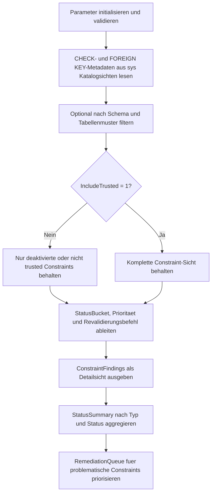

# FindUntrustedConstraints.sql

Dieses Skript durchsucht die aktuelle Datenbank nach deaktivierten oder nicht vertrauenswuerdigen `CHECK`- und `FOREIGN KEY`-Constraints und erzeugt daraus eine priorisierte Diagnoseausgabe mit Revalidierungsbefehlen.

## Uebersicht

<!-- SQLDOC:SUMMARY_TABLE:BEGIN -->
| Feld | Wert |
|---|---|
| Script | [FindUntrustedConstraints.sql](FindUntrustedConstraints.sql) |
| Version | `1.0` |
| Typ | `diagnostic-query` |
| Kapitel | `16_DataIntegrity_Constraints` |
| Sicherheit | `read-only` |
| Zweck | Findet deaktivierte oder nicht vertrauenswuerdige Constraints und priorisiert deren Revalidierung. |
<!-- SQLDOC:SUMMARY_TABLE:END -->

## Einordnung

Das Artefakt eignet sich fuer Reviews nach Bulk Loads, Migrationsfenstern oder manuellen Wartungen, bei denen Constraints zeitweise deaktiviert oder ohne vollstaendige Datenpruefung wieder aktiviert wurden. Die Auswertung arbeitet ausschliesslich mit Katalogsichten der aktuellen Datenbank und fuehrt keine Korrekturen aus.

## Annahmen

- Die Erstversion betrachtet nur `CHECK`- und `FOREIGN KEY`-Constraints, weil diese in SQL Server einen klaren Trusted-Status besitzen.
- Die Diagnose ist datenbankspezifisch und liest keine fremden Datenbanken ueber `sys.databases` oder dynamisches SQL an.
- `DISABLED_TRUSTED_METADATA` wird als seltener Sonderfall mit niedrigerer Prioritaet markiert, damit dieser Zustand separat geprueft werden kann.
- Revalidierungsbefehle werden ausschliesslich als Text ausgegeben und nicht automatisch ausgefuehrt.

## Anwendungsfall

Typisch ist die Nutzung als schneller Health Check vor Releases, nach Ladefenstern oder vor einer gezielten Constraint-Reaktivierung. Das Skript zeigt sowohl die Detailfunde als auch eine kompakte Zusammenfassung und eine priorisierte Queue fuer naechste Schritte.

## Parameter

<!-- SQLDOC:PARAMETERS_TABLE:BEGIN -->
| Parameter | SQL-Typ | Pflicht | Beschreibung |
|---|---|---|---|
| `@ConstraintType` | `NVARCHAR(20)` | Nein | Waehlt `ALL`, `CHECK` oder `FOREIGN KEY` fuer die Diagnose. |
| `@SchemaName` | `SYSNAME` | Nein | Optionales Schema fuer die Constraint-Auswahl. |
| `@TableNamePattern` | `NVARCHAR(128)` | Nein | Optionales `LIKE`-Muster fuer Tabellennamen. |
| `@IncludeTrusted` | `BIT` | Nein | `1` zeigt auch trusted Constraints, `0` fokussiert auf Abweichungen. |
<!-- SQLDOC:PARAMETERS_TABLE:END -->

## Abhaengigkeiten

<!-- SQLDOC:DEPENDENCIES_LIST:BEGIN -->
- `sys.schemas`
- `sys.tables`
- `sys.check_constraints`
- `sys.foreign_keys`
- `DB_NAME()`
- `QUOTENAME()`
- `STRING_AGG()`
- `CASE`
<!-- SQLDOC:DEPENDENCIES_LIST:END -->

## Hinweise

- `ConstraintFindings` ist die Detailsicht mit Status-Bucket, Prioritaet und passender Revalidierungsanweisung.
- `StatusSummary` verdichtet die Funde nach Constraint-Art und Abweichungszustand.
- `RemediationQueue` priorisiert problematische Constraints, damit sich eine Bearbeitungsliste direkt aus dem Resultset ableiten laesst.
- Der Standardfilter blendet bereits trusted und aktivierte Constraints aus, kann aber fuer Vollsichten ueber `@IncludeTrusted = 1` erweitert werden.

## Versionshistorie

<!-- SQLDOC:VERSION_HISTORY_TABLE:BEGIN -->
| Version | Datum | User | Beschreibung |
|---|---|---|---|
| `1.0` | `2026-04-18` | `ER` | Erstversion einer Diagnose fuer deaktivierte oder nicht vertrauenswuerdige Constraints. |
<!-- SQLDOC:VERSION_HISTORY_TABLE:END -->

## Ablauf

<!-- SQLDOC:MERMAID:BEGIN -->

<!-- SQLDOC:MERMAID:END -->

## SQL-Code

<!-- SQLDOC:SQL_CODE:BEGIN -->
```sql
/*
BEGIN:SQL-HEADER v1
---
sql_header: v1
script_name: "FindUntrustedConstraints.sql"
script_version: "1.0"
script_type: "diagnostic-query"
chapter: "16_DataIntegrity_Constraints"

purpose: >
  Findet deaktivierte oder nicht vertrauenswuerdige CHECK- und FOREIGN KEY-
  Constraints in der aktuellen Datenbank, priorisiert den Handlungsbedarf und
  liefert passende Revalidierungsbefehle nur als Diagnoseausgabe.

parameters:
  - name: "@ConstraintType"
    sql_type: "NVARCHAR(20)"
    direction: "IN"
    required: false
    description: "ALL, CHECK oder FOREIGN KEY fuer die Constraint-Auswahl."
  - name: "@SchemaName"
    sql_type: "SYSNAME"
    direction: "IN"
    required: false
    description: "Optionales Schema fuer die Constraint-Auswahl."
  - name: "@TableNamePattern"
    sql_type: "NVARCHAR(128)"
    direction: "IN"
    required: false
    description: "Optionales LIKE-Muster fuer Tabellennamen."
  - name: "@IncludeTrusted"
    sql_type: "BIT"
    direction: "IN"
    required: false
    description: "1 zeigt auch bereits trusted und aktive Constraints, 0 fokussiert auf Problemfaelle."

result_sets:
  - name: "ConstraintFindings"
    description: "Detailsicht je Constraint mit Status, Prioritaet und Revalidierungsanweisung."
  - name: "StatusSummary"
    description: "Verdichtung nach Constraint-Typ und Status-Bucket fuer die aktuelle Datenbank."
  - name: "RemediationQueue"
    description: "Priorisierte Queue fuer deaktivierte oder nicht trusted Constraints mit empfohlenem Folgekommando."

dependencies:
  - "sys.schemas"
  - "sys.tables"
  - "sys.check_constraints"
  - "sys.foreign_keys"
  - "DB_NAME()"
  - "QUOTENAME()"
  - "STRING_AGG()"
  - "CASE"

safety:
  level: "read-only"
  writes_data: false

documentation:
  markdown_file: "T-SQL/16_DataIntegrity_Constraints/SQLScripts/FindUntrustedConstraints.md"
  sync_blocks:
    - "SUMMARY_TABLE"
    - "PARAMETERS_TABLE"
    - "DEPENDENCIES_LIST"
    - "VERSION_HISTORY_TABLE"
    - "SQL_CODE"
  mermaid:
    mode: "ai-agent-from-sql"
    source: "script-body"

main_responsible:
  name: "Erhard Rainer"
  initials: "ER"

version_history:
  - version: "1.0"
    date: "2026-04-18"
    user: "ER"
    description: "Erstversion einer Diagnose fuer deaktivierte oder nicht vertrauenswuerdige Constraints."

notes:
  - "Die Erstversion liest nur Metadaten der aktuellen Datenbank und fuehrt keine ALTER TABLE-Anweisungen aus."
  - "Trusted Constraints koennen optional zur Vollsicht eingeblendet werden, der Standard fokussiert aber auf Abweichungen."
---
END:SQL-HEADER v1
*/

SET NOCOUNT ON;

DECLARE @ConstraintType NVARCHAR(20) = N'ALL';
DECLARE @SchemaName SYSNAME = NULL;
DECLARE @TableNamePattern NVARCHAR(128) = NULL;
DECLARE @IncludeTrusted BIT = 0;

SET @ConstraintType = UPPER(@ConstraintType);

IF @ConstraintType NOT IN (N'ALL', N'CHECK', N'FOREIGN KEY')
BEGIN
    THROW 50000, '@ConstraintType muss ALL, CHECK oder FOREIGN KEY sein.', 1;
END;

IF @IncludeTrusted NOT IN (0, 1)
BEGIN
    THROW 50001, '@IncludeTrusted muss 0 oder 1 sein.', 1;
END;

DROP TABLE IF EXISTS #ConstraintFindings;
WITH ConstraintCatalog AS
(
    SELECT
        DB_NAME() AS DatabaseName,
        s.name AS SchemaName,
        t.name AS TableName,
        cc.name AS ConstraintName,
        CAST(N'CHECK' AS NVARCHAR(20)) AS ConstraintType,
        cc.is_disabled AS IsDisabled,
        cc.is_not_trusted AS IsNotTrusted,
        CAST(cc.is_not_for_replication AS BIT) AS IsNotForReplication,
        cc.definition AS ConstraintDefinition
    FROM sys.check_constraints AS cc
    INNER JOIN sys.tables AS t
        ON t.object_id = cc.parent_object_id
    INNER JOIN sys.schemas AS s
        ON s.schema_id = t.schema_id
    WHERE @ConstraintType IN (N'ALL', N'CHECK')

    UNION ALL

    SELECT
        DB_NAME() AS DatabaseName,
        s.name AS SchemaName,
        t.name AS TableName,
        fk.name AS ConstraintName,
        CAST(N'FOREIGN KEY' AS NVARCHAR(20)) AS ConstraintType,
        fk.is_disabled AS IsDisabled,
        fk.is_not_trusted AS IsNotTrusted,
        CAST(fk.is_not_for_replication AS BIT) AS IsNotForReplication,
        CAST(NULL AS NVARCHAR(MAX)) AS ConstraintDefinition
    FROM sys.foreign_keys AS fk
    INNER JOIN sys.tables AS t
        ON t.object_id = fk.parent_object_id
    INNER JOIN sys.schemas AS s
        ON s.schema_id = t.schema_id
    WHERE @ConstraintType IN (N'ALL', N'FOREIGN KEY')
)
SELECT
    cc.DatabaseName,
    cc.SchemaName,
    cc.TableName,
    cc.ConstraintName,
    cc.ConstraintType,
    cc.IsDisabled,
    cc.IsNotTrusted,
    cc.IsNotForReplication,
    CASE
        WHEN cc.IsDisabled = 1 AND cc.IsNotTrusted = 1 THEN N'DISABLED_NOT_TRUSTED'
        WHEN cc.IsDisabled = 1 AND cc.IsNotTrusted = 0 THEN N'DISABLED_TRUSTED_METADATA'
        WHEN cc.IsDisabled = 0 AND cc.IsNotTrusted = 1 THEN N'ENABLED_NOT_TRUSTED'
        ELSE N'TRUSTED_ENABLED'
    END AS StatusBucket,
    CASE
        WHEN cc.IsDisabled = 1 AND cc.IsNotTrusted = 1 THEN 1
        WHEN cc.IsDisabled = 0 AND cc.IsNotTrusted = 1 THEN 2
        WHEN cc.IsDisabled = 1 AND cc.IsNotTrusted = 0 THEN 3
        ELSE 4
    END AS RemediationPriority,
    CASE
        WHEN cc.IsDisabled = 1 AND cc.IsNotTrusted = 1 THEN N'Constraint ist deaktiviert und nicht trusted; vor dem Produktiveinsatz zuerst WITH CHECK CHECK ausfuehren.'
        WHEN cc.IsDisabled = 0 AND cc.IsNotTrusted = 1 THEN N'Constraint ist aktiv, aber nicht trusted; vorhandene Daten wurden nicht voll validiert.'
        WHEN cc.IsDisabled = 1 AND cc.IsNotTrusted = 0 THEN N'Metadaten zeigen deaktiviert, aber trusted; Zustand gezielt pruefen.'
        ELSE N'Constraint ist aktiv und trusted.'
    END AS DiagnosticNote,
    N'ALTER TABLE '
    + QUOTENAME(cc.SchemaName) + N'.' + QUOTENAME(cc.TableName)
    + N' WITH CHECK CHECK CONSTRAINT ' + QUOTENAME(cc.ConstraintName) + N';' AS RevalidationStatement,
    cc.ConstraintDefinition
INTO #ConstraintFindings
FROM ConstraintCatalog AS cc
WHERE (@SchemaName IS NULL OR cc.SchemaName = @SchemaName)
  AND (@TableNamePattern IS NULL OR cc.TableName LIKE @TableNamePattern)
  AND (
        @IncludeTrusted = 1
        OR cc.IsDisabled = 1
        OR cc.IsNotTrusted = 1
      );

SELECT
    cf.DatabaseName,
    cf.SchemaName,
    cf.TableName,
    cf.ConstraintName,
    cf.ConstraintType,
    cf.StatusBucket,
    cf.RemediationPriority,
    cf.IsDisabled,
    cf.IsNotTrusted,
    cf.IsNotForReplication,
    cf.DiagnosticNote,
    cf.RevalidationStatement,
    cf.ConstraintDefinition
FROM #ConstraintFindings AS cf
ORDER BY
    cf.RemediationPriority,
    cf.ConstraintType,
    cf.SchemaName,
    cf.TableName,
    cf.ConstraintName;

SELECT
    cf.ConstraintType,
    cf.StatusBucket,
    COUNT(*) AS ConstraintCount,
    STRING_AGG(CONCAT(cf.SchemaName, N'.', cf.TableName, N'.', cf.ConstraintName), N'; ')
        WITHIN GROUP (ORDER BY cf.SchemaName, cf.TableName, cf.ConstraintName) AS ConstraintList
FROM #ConstraintFindings AS cf
GROUP BY
    cf.ConstraintType,
    cf.StatusBucket
ORDER BY
    MIN(cf.RemediationPriority),
    cf.ConstraintType,
    cf.StatusBucket;

SELECT
    ROW_NUMBER() OVER
    (
        ORDER BY
            cf.RemediationPriority,
            CASE cf.ConstraintType
                WHEN N'FOREIGN KEY' THEN 1
                ELSE 2
            END,
            cf.SchemaName,
            cf.TableName,
            cf.ConstraintName
    ) AS QueuePosition,
    cf.DatabaseName,
    cf.SchemaName,
    cf.TableName,
    cf.ConstraintName,
    cf.ConstraintType,
    cf.StatusBucket,
    cf.DiagnosticNote,
    cf.RevalidationStatement
FROM #ConstraintFindings AS cf
WHERE cf.StatusBucket <> N'TRUSTED_ENABLED'
ORDER BY
    QueuePosition;

DROP TABLE IF EXISTS #ConstraintFindings;
```
<!-- SQLDOC:SQL_CODE:END -->
