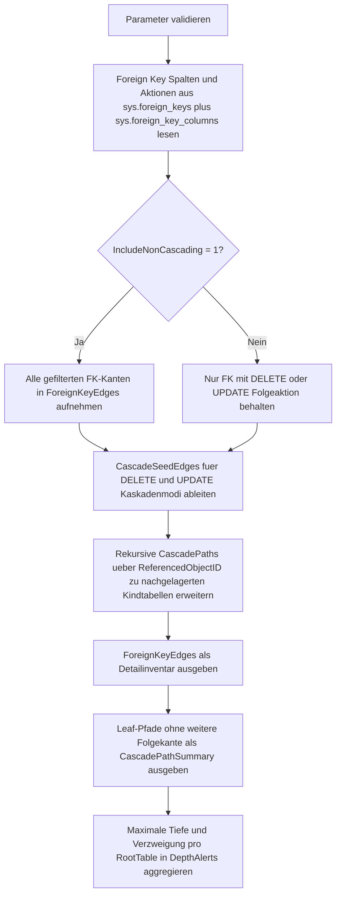

# ForeignKeyCascadeDepthScan.sql

Dieses Skript analysiert die aktuelle Datenbank auf `FOREIGN KEY`-Beziehungen mit referenziellen Folgeaktionen und berechnet daraus, wie tief sich `DELETE`- oder `UPDATE`-Kaskaden ueber mehrere Tabellen fortsetzen koennen.

## Uebersicht

<!-- SQLDOC:SUMMARY_TABLE:BEGIN -->
| Feld | Wert |
|---|---|
| Script | [ForeignKeyCascadeDepthScan.sql](ForeignKeyCascadeDepthScan.sql) |
| Version | `1.0` |
| Typ | `diagnostic-query` |
| Kapitel | `16_DataIntegrity_Constraints` |
| Sicherheit | `read-only` |
| Zweck | Scannt Kaskadenpfade in Foreign-Key-Ketten und markiert tiefe oder verzweigte Abhaengigkeiten. |
<!-- SQLDOC:SUMMARY_TABLE:END -->

## Einordnung

Das Artefakt eignet sich fuer Schema-Reviews, Migrationsvorbereitung und Impact-Analysen rund um referenzielle Integritaet. Es bewertet keine Zeilenmengen und fuehrt keine Testtransaktionen aus, sondern liest ausschliesslich die im SQL-Server-Katalog hinterlegten Foreign-Key-Metadaten.

## Annahmen

- Die Erstversion betrachtet nur die aktuelle Datenbank und erzeugt keine datenbankuebergreifenden Pfade.
- Als kaskadenrelevant gelten `CASCADE`, `SET_NULL` und `SET_DEFAULT`, weil alle drei Aktionen eine Folgeveraenderung auf der referenzierenden Tabelle ausloesen.
- Zyklen werden in der rekursiven Pfadsuche ueber besuchte Objekt-IDs unterbunden, damit selbstreferenzielle oder ringfoermige Muster die Analyse nicht endlos fortsetzen.
- Das Warn-Resultset interpretiert eine grosse Tiefe oder mehrere Leaf-Pfade als Review-Signal, nicht als automatischen Fehler.

## Anwendungsfall

Vor grossen Loesch- oder Aenderungsvorgaengen zeigt das Skript, welche Tabellen von einer Kaskade ausgehend von einer Referenztabelle betroffen sein koennen. Das ist besonders nuetzlich, wenn mehrere Foreign Keys kombiniert auftreten und aus einzelnen Regeln erst im Zusammenspiel ein tiefer Pfad entsteht.

## Parameter

<!-- SQLDOC:PARAMETERS_TABLE:BEGIN -->
| Parameter | SQL-Typ | Pflicht | Beschreibung |
|---|---|---|---|
| `@SchemaName` | `SYSNAME` | Nein | Optionales Schema fuer die FK-Auswahl. |
| `@TableNamePattern` | `NVARCHAR(128)` | Nein | Optionales `LIKE`-Muster fuer referenzierte oder referenzierende Tabellennamen. |
| `@MaxDepthWarning` | `INT` | Nein | Ab dieser Tiefe wird ein Kaskadenpfad im Warn-Resultset hervorgehoben. |
| `@IncludeNonCascading` | `BIT` | Nein | `1` zeigt auch Foreign Keys ohne Kaskadenaktion in der Kantenliste. |
<!-- SQLDOC:PARAMETERS_TABLE:END -->

## Abhaengigkeiten

<!-- SQLDOC:DEPENDENCIES_LIST:BEGIN -->
- `sys.schemas`
- `sys.tables`
- `sys.foreign_keys`
- `sys.foreign_key_columns`
- `sys.columns`
- `DB_NAME()`
- `STRING_AGG()`
- `DROP TABLE IF EXISTS`
<!-- SQLDOC:DEPENDENCIES_LIST:END -->

## Hinweise

- `ForeignKeyEdges` listet alle relevanten Foreign Keys mit Delete- und Update-Aktion und zeigt, ob ueberhaupt eine Kaskadenwirkung vorliegt.
- `CascadePathSummary` zeigt nur Leaf-Pfade, damit die reale maximale Tiefe je Starttabelle gut lesbar bleibt.
- `DepthAlerts` aggregiert pro Starttabelle und Modus (`DELETE` oder `UPDATE`), ob die Kette tief oder verzweigt genug fuer ein Review ist.
- Mit `@IncludeNonCascading = 1` laesst sich die Kantenliste fuer Vollstaendigkeit erweitern, ohne dass die rekursive Pfadsuche an rein blockierenden `NO_ACTION`-Kanten weiterlaeuft.

## Versionshistorie

<!-- SQLDOC:VERSION_HISTORY_TABLE:BEGIN -->
| Version | Datum | User | Beschreibung |
|---|---|---|---|
| `1.0` | `2026-04-19` | `ER` | Erstversion eines Diagnose-Skripts fuer die Tiefe von Foreign-Key-Kaskaden. |
<!-- SQLDOC:VERSION_HISTORY_TABLE:END -->

## Ablauf

<!-- SQLDOC:MERMAID:BEGIN -->

<!-- SQLDOC:MERMAID:END -->

## SQL-Code

<!-- SQLDOC:SQL_CODE:BEGIN -->
```sql
/*
BEGIN:SQL-HEADER v1
---
sql_header: v1
script_name: "ForeignKeyCascadeDepthScan.sql"
script_version: "1.0"
script_type: "diagnostic-query"
chapter: "16_DataIntegrity_Constraints"

purpose: >
  Scannt die aktuelle Datenbank nach FOREIGN KEY-Ketten mit CASCADE- oder
  SET-NULL- beziehungsweise SET-DEFAULT-Aktionen, berechnet die erreichbare
  Tiefe je Starttabelle und markiert tiefe oder verzweigte Kaskadenpfade.

parameters:
  - name: "@SchemaName"
    sql_type: "SYSNAME"
    direction: "IN"
    required: false
    description: "Optionales Schema fuer die FK-Auswahl."
  - name: "@TableNamePattern"
    sql_type: "NVARCHAR(128)"
    direction: "IN"
    required: false
    description: "Optionales LIKE-Muster fuer referenzierte oder referenzierende Tabellennamen."
  - name: "@MaxDepthWarning"
    sql_type: "INT"
    direction: "IN"
    required: false
    description: "Ab dieser Tiefe wird ein Kaskadenpfad im Warn-Resultset hervorgehoben."
  - name: "@IncludeNonCascading"
    sql_type: "BIT"
    direction: "IN"
    required: false
    description: "1 zeigt auch Foreign Keys ohne Kaskadenaktion in der Kantenliste; 0 fokussiert auf potenzielle Kaskaden."

result_sets:
  - name: "ForeignKeyEdges"
    description: "Katalogsicht je Foreign Key mit Delete- und Update-Aktion sowie Markierung fuer Kaskadenrelevanz."
  - name: "CascadePathSummary"
    description: "Leaf-Pfade je Starttabelle und Kaskadenmodus mit berechneter Tiefe und Pfadtext."
  - name: "DepthAlerts"
    description: "Zusammenfassung je Starttabelle fuer tiefe oder verzweigte Kaskadenketten."

dependencies:
  - "sys.schemas"
  - "sys.tables"
  - "sys.foreign_keys"
  - "sys.foreign_key_columns"
  - "sys.columns"
  - "DB_NAME()"
  - "STRING_AGG()"
  - "DROP TABLE IF EXISTS"

safety:
  level: "read-only"
  writes_data: false

documentation:
  markdown_file: "T-SQL/16_DataIntegrity_Constraints/SQLScripts/ForeignKeyCascadeDepthScan.md"
  sync_blocks:
    - "SUMMARY_TABLE"
    - "PARAMETERS_TABLE"
    - "DEPENDENCIES_LIST"
    - "VERSION_HISTORY_TABLE"
    - "SQL_CODE"
  mermaid:
    mode: "ai-agent-from-sql"
    source: "script-body"

main_responsible:
  name: "Erhard Rainer"
  initials: "ER"

version_history:
  - version: "1.0"
    date: "2026-04-19"
    user: "ER"
    description: "Erstversion eines Diagnose-Skripts fuer die Tiefe von Foreign-Key-Kaskaden."

notes:
  - "Die Analyse arbeitet nur mit Metadaten der aktuellen Datenbank und fuehrt keine DELETE- oder UPDATE-Statements aus."
  - "Als Kaskadenpfade gelten sowohl CASCADE als auch SET_NULL und SET_DEFAULT, weil diese referenzielle Folgeaktionen ausloesen."
---
END:SQL-HEADER v1
*/

SET NOCOUNT ON;

DECLARE @SchemaName SYSNAME = NULL;
DECLARE @TableNamePattern NVARCHAR(128) = NULL;
DECLARE @MaxDepthWarning INT = 3;
DECLARE @IncludeNonCascading BIT = 0;

IF @MaxDepthWarning < 1
BEGIN
    THROW 50000, '@MaxDepthWarning muss groesser oder gleich 1 sein.', 1;
END;

IF @IncludeNonCascading NOT IN (0, 1)
BEGIN
    THROW 50001, '@IncludeNonCascading muss 0 oder 1 sein.', 1;
END;

DROP TABLE IF EXISTS #ForeignKeyEdges;
WITH ForeignKeyColumnMap AS
(
    SELECT
        fk.object_id AS ForeignKeyObjectID,
        STRING_AGG(child_col.name, N', ') WITHIN GROUP (ORDER BY fkc.constraint_column_id) AS ReferencingColumns,
        STRING_AGG(parent_col.name, N', ') WITHIN GROUP (ORDER BY fkc.constraint_column_id) AS ReferencedColumns
    FROM sys.foreign_keys AS fk
    INNER JOIN sys.foreign_key_columns AS fkc
        ON fkc.constraint_object_id = fk.object_id
    INNER JOIN sys.columns AS child_col
        ON child_col.object_id = fkc.parent_object_id
       AND child_col.column_id = fkc.parent_column_id
    INNER JOIN sys.columns AS parent_col
        ON parent_col.object_id = fkc.referenced_object_id
       AND parent_col.column_id = fkc.referenced_column_id
    GROUP BY
        fk.object_id
)
SELECT
    DB_NAME() AS DatabaseName,
    fk.object_id AS ForeignKeyObjectID,
    fk.name AS ForeignKeyName,
    child_schema.name AS ReferencingSchemaName,
    child_table.name AS ReferencingTableName,
    fk.parent_object_id AS ReferencingObjectID,
    parent_schema.name AS ReferencedSchemaName,
    parent_table.name AS ReferencedTableName,
    fk.referenced_object_id AS ReferencedObjectID,
    colmap.ReferencingColumns,
    colmap.ReferencedColumns,
    fk.delete_referential_action_desc AS DeleteActionDesc,
    fk.update_referential_action_desc AS UpdateActionDesc,
    fk.is_disabled AS IsDisabled,
    fk.is_not_trusted AS IsNotTrusted,
    CAST
    (
        CASE
            WHEN fk.delete_referential_action_desc <> N'NO_ACTION'
              OR fk.update_referential_action_desc <> N'NO_ACTION'
                THEN 1
            ELSE 0
        END AS BIT
    ) AS HasCascadeBehavior
INTO #ForeignKeyEdges
FROM sys.foreign_keys AS fk
INNER JOIN sys.tables AS child_table
    ON child_table.object_id = fk.parent_object_id
INNER JOIN sys.schemas AS child_schema
    ON child_schema.schema_id = child_table.schema_id
INNER JOIN sys.tables AS parent_table
    ON parent_table.object_id = fk.referenced_object_id
INNER JOIN sys.schemas AS parent_schema
    ON parent_schema.schema_id = parent_table.schema_id
INNER JOIN ForeignKeyColumnMap AS colmap
    ON colmap.ForeignKeyObjectID = fk.object_id
WHERE (@SchemaName IS NULL OR child_schema.name = @SchemaName OR parent_schema.name = @SchemaName)
  AND (
        @TableNamePattern IS NULL
        OR child_table.name LIKE @TableNamePattern
        OR parent_table.name LIKE @TableNamePattern
      )
  AND (
        @IncludeNonCascading = 1
        OR fk.delete_referential_action_desc <> N'NO_ACTION'
        OR fk.update_referential_action_desc <> N'NO_ACTION'
      );

SELECT
    DatabaseName,
    ReferencedSchemaName,
    ReferencedTableName,
    ReferencingSchemaName,
    ReferencingTableName,
    ForeignKeyName,
    ReferencedColumns,
    ReferencingColumns,
    DeleteActionDesc,
    UpdateActionDesc,
    IsDisabled,
    IsNotTrusted,
    HasCascadeBehavior
FROM #ForeignKeyEdges
ORDER BY
    ReferencedSchemaName,
    ReferencedTableName,
    ReferencingSchemaName,
    ReferencingTableName,
    ForeignKeyName;

DROP TABLE IF EXISTS #CascadePaths;
WITH CascadeSeedEdges AS
(
    SELECT
        ForeignKeyObjectID,
        ForeignKeyName,
        ReferencedObjectID,
        ReferencingObjectID,
        CONCAT(ReferencedSchemaName, N'.', ReferencedTableName) AS ReferencedTable,
        CONCAT(ReferencingSchemaName, N'.', ReferencingTableName) AS ReferencingTable,
        CAST(N'DELETE' AS NVARCHAR(10)) AS CascadeMode,
        DeleteActionDesc AS CascadeAction
    FROM #ForeignKeyEdges
    WHERE DeleteActionDesc <> N'NO_ACTION'

    UNION ALL

    SELECT
        ForeignKeyObjectID,
        ForeignKeyName,
        ReferencedObjectID,
        ReferencingObjectID,
        CONCAT(ReferencedSchemaName, N'.', ReferencedTableName),
        CONCAT(ReferencingSchemaName, N'.', ReferencingTableName),
        CAST(N'UPDATE' AS NVARCHAR(10)),
        UpdateActionDesc
    FROM #ForeignKeyEdges
    WHERE UpdateActionDesc <> N'NO_ACTION'
),
CascadePaths AS
(
    SELECT
        seed.CascadeMode,
        seed.CascadeAction,
        seed.ForeignKeyObjectID,
        seed.ForeignKeyName,
        seed.ReferencedObjectID AS RootObjectID,
        seed.ReferencedTable AS RootTable,
        seed.ReferencingObjectID AS CurrentObjectID,
        seed.ReferencingTable AS CurrentTable,
        CAST(1 AS INT) AS CascadeDepth,
        CAST(seed.ReferencedTable + N' -> ' + seed.ReferencingTable AS NVARCHAR(MAX)) AS TablePath,
        CAST(seed.ForeignKeyName AS NVARCHAR(MAX)) AS ForeignKeyPath,
        CAST(N'|' + CAST(seed.ReferencedObjectID AS NVARCHAR(20)) + N'|' + CAST(seed.ReferencingObjectID AS NVARCHAR(20)) + N'|' AS NVARCHAR(MAX)) AS VisitedObjectIDs
    FROM CascadeSeedEdges AS seed

    UNION ALL

    SELECT
        path.CascadeMode,
        next_edge.CascadeAction,
        next_edge.ForeignKeyObjectID,
        next_edge.ForeignKeyName,
        path.RootObjectID,
        path.RootTable,
        next_edge.ReferencingObjectID,
        next_edge.ReferencingTable,
        path.CascadeDepth + 1,
        CAST(path.TablePath + N' -> ' + next_edge.ReferencingTable AS NVARCHAR(MAX)),
        CAST(path.ForeignKeyPath + N' -> ' + next_edge.ForeignKeyName AS NVARCHAR(MAX)),
        CAST(path.VisitedObjectIDs + CAST(next_edge.ReferencingObjectID AS NVARCHAR(20)) + N'|' AS NVARCHAR(MAX))
    FROM CascadePaths AS path
    INNER JOIN CascadeSeedEdges AS next_edge
        ON next_edge.ReferencedObjectID = path.CurrentObjectID
       AND next_edge.CascadeMode = path.CascadeMode
    WHERE path.VisitedObjectIDs NOT LIKE N'%|' + CAST(next_edge.ReferencingObjectID AS NVARCHAR(20)) + N'|%'
)
SELECT
    path.CascadeMode,
    path.RootTable,
    path.CurrentTable AS LeafTable,
    path.CascadeDepth,
    path.CascadeAction,
    path.TablePath,
    path.ForeignKeyPath
INTO #CascadePaths
FROM CascadePaths AS path
OPTION (MAXRECURSION 100);

WITH LeafPaths AS
(
    SELECT
        cp.CascadeMode,
        cp.RootTable,
        cp.LeafTable,
        cp.CascadeDepth,
        cp.CascadeAction,
        cp.TablePath,
        cp.ForeignKeyPath,
        CASE
            WHEN EXISTS
            (
                SELECT 1
                FROM #CascadePaths AS next_level
                WHERE next_level.CascadeMode = cp.CascadeMode
                  AND next_level.RootTable = cp.RootTable
                  AND LEFT(next_level.TablePath, LEN(cp.TablePath) + 4) = cp.TablePath + N' -> '
            )
                THEN 0
            ELSE 1
        END AS IsLeaf
    FROM #CascadePaths AS cp
)
SELECT
    CascadeMode,
    RootTable,
    LeafTable,
    CascadeDepth,
    CascadeAction,
    TablePath,
    ForeignKeyPath
FROM LeafPaths
WHERE IsLeaf = 1
ORDER BY
    CascadeMode,
    RootTable,
    CascadeDepth DESC,
    LeafTable;

WITH LeafPaths AS
(
    SELECT
        cp.CascadeMode,
        cp.RootTable,
        cp.LeafTable,
        cp.CascadeDepth,
        cp.TablePath,
        CASE
            WHEN EXISTS
            (
                SELECT 1
                FROM #CascadePaths AS next_level
                WHERE next_level.CascadeMode = cp.CascadeMode
                  AND next_level.RootTable = cp.RootTable
                  AND LEFT(next_level.TablePath, LEN(cp.TablePath) + 4) = cp.TablePath + N' -> '
            )
                THEN 0
            ELSE 1
        END AS IsLeaf
    FROM #CascadePaths AS cp
)
SELECT
    CascadeMode,
    RootTable,
    MAX(CascadeDepth) AS MaxCascadeDepth,
    COUNT(*) AS LeafPathCount,
    COUNT(DISTINCT LeafTable) AS DistinctLeafTables,
    CASE
        WHEN MAX(CascadeDepth) >= @MaxDepthWarning THEN N'REVIEW_DEPTH'
        WHEN COUNT(*) > 1 THEN N'REVIEW_BRANCHING'
        ELSE N'INFO'
    END AS AlertLevel,
    STRING_AGG(TablePath, N' || ') WITHIN GROUP (ORDER BY CascadeDepth DESC, TablePath) AS SamplePaths
FROM LeafPaths
WHERE IsLeaf = 1
GROUP BY
    CascadeMode,
    RootTable
HAVING MAX(CascadeDepth) >= @MaxDepthWarning
    OR COUNT(*) > 1
ORDER BY
    MaxCascadeDepth DESC,
    LeafPathCount DESC,
    CascadeMode,
    RootTable;

DROP TABLE IF EXISTS #CascadePaths;
DROP TABLE IF EXISTS #ForeignKeyEdges;
```
<!-- SQLDOC:SQL_CODE:END -->
