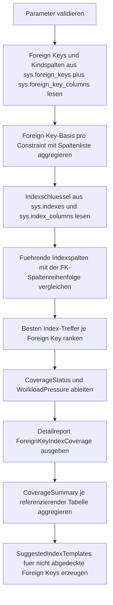

# ForeignKeyIndexCoverage.sql

Dieses Skript liest die Katalogmetadaten der aktuellen Datenbank und bewertet fuer jede referenzierende Tabelle, ob die Foreign-Key-Spalten durch einen passenden Indexpraefix gestuetzt werden. Damit werden Integritaetspruefungen, Delete-Kaskaden und Join-Pfade nicht nur fachlich, sondern auch hinsichtlich ihrer operativen Zugriffsunterstuetzung sichtbar.

## Uebersicht

<!-- SQLDOC:SUMMARY_TABLE:BEGIN -->
| Feld | Wert |
|---|---|
| Script | [ForeignKeyIndexCoverage.sql](ForeignKeyIndexCoverage.sql) |
| Version | `1.0` |
| Typ | `diagnostic-query` |
| Kapitel | `16_DataIntegrity_Constraints` |
| Sicherheit | `read-only` |
| Zweck | Prueft, ob Foreign-Key-Spalten durch passende Indexpraefixe auf der Kindtabelle abgedeckt werden. |
<!-- SQLDOC:SUMMARY_TABLE:END -->

## Einordnung

Das Artefakt eignet sich fuer Performance-Reviews, Integritaets-Audits und Refactoring-Vorbereitungen. Ein fehlender Index auf Foreign-Key-Spalten ist kein fachlicher Fehler im Modell, fuehrt aber bei Loeschungen, Updates oder Kindtabellen-Joins haeufig zu vermeidbaren Scans. Der Report bleibt rein lesend und markiert nur, wo ein didaktisch plausibler Handlungsbedarf besteht.

## Annahmen

- Die Erstversion bewertet nur Indexschluesselspalten und behandelt einen Index als passend, wenn seine fuehrenden Schluesselspalten exakt mit der Foreign-Key-Spaltenreihenfolge beginnen.
- Gefilterte Indizes werden separat als `covered-filtered` markiert, weil ihre Eignung vom konkreten Filter und Workload abhaengt.
- Die erzeugten `CREATE INDEX`-Zeilen sind Templates fuer Reviews und nicht als automatische Aenderung freigegeben.
- Deaktivierte oder nicht vertrauenswuerdige Foreign Keys koennen optional ausgeblendet werden, bleiben standardmaessig aber sichtbar, damit Governance-Luecken nicht verloren gehen.

## Anwendungsfall

Vor groesseren Datenbereinigungen, Migrationsprojekten oder Constraint-Aktivierungen laesst sich mit einem Lauf schnell erkennen, welche Kindtabellen wahrscheinlich vom Index-Nachziehen profitieren. Besonders interessant sind Foreign Keys mit `CASCADE` oder `SET_*`, weil dort sowohl Integritaetspruefungen als auch Folgeoperationen auf der Kindseite Druck erzeugen koennen.

## Parameter

<!-- SQLDOC:PARAMETERS_TABLE:BEGIN -->
| Parameter | SQL-Typ | Pflicht | Beschreibung |
|---|---|---|---|
| `@SchemaName` | `SYSNAME` | Nein | Optionales Schema fuer referenzierende oder referenzierte Tabellen. |
| `@TableNamePattern` | `NVARCHAR(128)` | Nein | Optionales `LIKE`-Muster fuer beteiligte Tabellennamen. |
| `@IncludeTrustedOnly` | `BIT` | Nein | `1` blendet deaktivierte oder nicht vertrauenswuerdige Foreign Keys aus; `0` zeigt alle. |
<!-- SQLDOC:PARAMETERS_TABLE:END -->

## Abhaengigkeiten

<!-- SQLDOC:DEPENDENCIES_LIST:BEGIN -->
- `sys.schemas`
- `sys.tables`
- `sys.foreign_keys`
- `sys.foreign_key_columns`
- `sys.columns`
- `sys.indexes`
- `sys.index_columns`
- `DB_NAME()`
- `STRING_AGG()`
<!-- SQLDOC:DEPENDENCIES_LIST:END -->

## Hinweise

- `ForeignKeyIndexCoverage` liefert die Detailsicht je Foreign Key inklusive bestem Index-Treffer, Coverage-Status und Kaskadendruck.
- `CoverageSummary` verdichtet die Lage je referenzierender Tabelle, damit Hotspots schnell priorisiert werden koennen.
- `SuggestedIndexTemplates` zeigt nur die Foreign Keys ohne passenden Indexpraefix und liefert dafuer eine konservative `CREATE INDEX`-Vorlage.
- `partial-prefix-only` bedeutet, dass nur ein Teil der FK-Spalten als fuehrende Indexspalten getroffen wurde; typische Ursache ist ein mehrspaltiger Foreign Key bei anders sortiertem Index.

## Versionshistorie

<!-- SQLDOC:VERSION_HISTORY_TABLE:BEGIN -->
| Version | Datum | User | Beschreibung |
|---|---|---|---|
| `1.0` | `2026-04-19` | `ER` | Erstversion eines Index-Coverage-Checks fuer Foreign-Key-Spalten. |
<!-- SQLDOC:VERSION_HISTORY_TABLE:END -->

## Ablauf

<!-- SQLDOC:MERMAID:BEGIN -->

<!-- SQLDOC:MERMAID:END -->

## SQL-Code

<!-- SQLDOC:SQL_CODE:BEGIN -->
```sql
/*
BEGIN:SQL-HEADER v1
---
sql_header: v1
script_name: "ForeignKeyIndexCoverage.sql"
script_version: "1.0"
script_type: "diagnostic-query"
chapter: "16_DataIntegrity_Constraints"

purpose: >
  Prueft fuer die aktuelle Datenbank, ob Foreign-Key-Spalten durch einen
  passenden Indexpraefix auf der referenzierenden Tabelle abgedeckt werden
  und leitet daraus Handlungsbedarf fuer Integritaets- und Delete-Workloads ab.

parameters:
  - name: "@SchemaName"
    sql_type: "SYSNAME"
    direction: "IN"
    required: false
    description: "Optionales Schema fuer referenzierende oder referenzierte Tabellen."
  - name: "@TableNamePattern"
    sql_type: "NVARCHAR(128)"
    direction: "IN"
    required: false
    description: "Optionales LIKE-Muster fuer beteiligte Tabellennamen."
  - name: "@IncludeTrustedOnly"
    sql_type: "BIT"
    direction: "IN"
    required: false
    description: "1 blendet deaktivierte oder nicht vertrauenswuerdige Foreign Keys aus; 0 zeigt alle."

result_sets:
  - name: "ForeignKeyIndexCoverage"
    description: "Detailreport je Foreign Key mit Spaltenliste, passendem Index und Coverage-Bewertung."
  - name: "CoverageSummary"
    description: "Verdichtung je referenzierender Tabelle mit Anteil abgedeckter und kritischer Foreign Keys."
  - name: "SuggestedIndexTemplates"
    description: "Didaktische CREATE INDEX-Vorlagen fuer Foreign Keys ohne passenden Indexpraefix."

dependencies:
  - "sys.schemas"
  - "sys.tables"
  - "sys.foreign_keys"
  - "sys.foreign_key_columns"
  - "sys.columns"
  - "sys.indexes"
  - "sys.index_columns"
  - "DB_NAME()"
  - "STRING_AGG()"

safety:
  level: "read-only"
  writes_data: false

documentation:
  markdown_file: "T-SQL/16_DataIntegrity_Constraints/SQLScripts/ForeignKeyIndexCoverage.md"
  sync_blocks:
    - "SUMMARY_TABLE"
    - "PARAMETERS_TABLE"
    - "DEPENDENCIES_LIST"
    - "VERSION_HISTORY_TABLE"
    - "SQL_CODE"
  mermaid:
    mode: "ai-agent-from-sql"
    source: "script-body"

main_responsible:
  name: "Erhard Rainer"
  initials: "ER"

version_history:
  - version: "1.0"
    date: "2026-04-19"
    user: "ER"
    description: "Erstversion eines Index-Coverage-Checks fuer Foreign-Key-Spalten."

notes:
  - "Der Report bewertet einen Index als passend, wenn seine fuehrenden Schluesselspalten exakt mit der Foreign-Key-Spaltenreihenfolge beginnen."
  - "Die Ausgabe ist diagnostisch; erzeugte CREATE INDEX-Statements sind Templates und werden nicht automatisch ausgefuehrt."
---
END:SQL-HEADER v1
*/

SET NOCOUNT ON;

DECLARE @SchemaName SYSNAME = NULL;
DECLARE @TableNamePattern NVARCHAR(128) = NULL;
DECLARE @IncludeTrustedOnly BIT = 0;

IF @IncludeTrustedOnly NOT IN (0, 1)
BEGIN
    THROW 50000, '@IncludeTrustedOnly muss 0 oder 1 sein.', 1;
END;

DROP TABLE IF EXISTS #ForeignKeyIndexCoverage;

WITH ForeignKeyColumns AS
(
    SELECT
        fk.object_id AS ForeignKeyObjectID,
        fk.name AS ForeignKeyName,
        child_schema.name AS ReferencingSchemaName,
        child_table.name AS ReferencingTableName,
        parent_schema.name AS ReferencedSchemaName,
        parent_table.name AS ReferencedTableName,
        fk.is_disabled AS IsDisabled,
        fk.is_not_trusted AS IsNotTrusted,
        fk.delete_referential_action_desc AS DeleteActionDesc,
        fk.update_referential_action_desc AS UpdateActionDesc,
        fkc.constraint_column_id AS ForeignKeyColumnOrder,
        child_col.column_id AS ReferencingColumnID,
        child_col.name AS ReferencingColumnName
    FROM sys.foreign_keys AS fk
    INNER JOIN sys.tables AS child_table
        ON child_table.object_id = fk.parent_object_id
    INNER JOIN sys.schemas AS child_schema
        ON child_schema.schema_id = child_table.schema_id
    INNER JOIN sys.tables AS parent_table
        ON parent_table.object_id = fk.referenced_object_id
    INNER JOIN sys.schemas AS parent_schema
        ON parent_schema.schema_id = parent_table.schema_id
    INNER JOIN sys.foreign_key_columns AS fkc
        ON fkc.constraint_object_id = fk.object_id
    INNER JOIN sys.columns AS child_col
        ON child_col.object_id = fkc.parent_object_id
       AND child_col.column_id = fkc.parent_column_id
    WHERE (@SchemaName IS NULL OR child_schema.name = @SchemaName OR parent_schema.name = @SchemaName)
      AND (
            @TableNamePattern IS NULL
            OR child_table.name LIKE @TableNamePattern
            OR parent_table.name LIKE @TableNamePattern
          )
      AND (
            @IncludeTrustedOnly = 0
            OR (fk.is_disabled = 0 AND fk.is_not_trusted = 0)
          )
),
ForeignKeyBase AS
(
    SELECT
        ForeignKeyObjectID,
        ForeignKeyName,
        ReferencingSchemaName,
        ReferencingTableName,
        ReferencedSchemaName,
        ReferencedTableName,
        IsDisabled,
        IsNotTrusted,
        DeleteActionDesc,
        UpdateActionDesc,
        COUNT(*) AS ForeignKeyColumnCount,
        STRING_AGG(ReferencingColumnName, N', ') WITHIN GROUP (ORDER BY ForeignKeyColumnOrder) AS ForeignKeyColumns
    FROM ForeignKeyColumns
    GROUP BY
        ForeignKeyObjectID,
        ForeignKeyName,
        ReferencingSchemaName,
        ReferencingTableName,
        ReferencedSchemaName,
        ReferencedTableName,
        IsDisabled,
        IsNotTrusted,
        DeleteActionDesc,
        UpdateActionDesc
),
IndexKeyColumns AS
(
    SELECT
        idx.object_id AS TableObjectID,
        idx.index_id AS IndexID,
        idx.name AS IndexName,
        idx.type_desc AS IndexTypeDesc,
        idx.is_unique AS IsUnique,
        idx.is_primary_key AS IsPrimaryKey,
        idx.is_unique_constraint AS IsUniqueConstraint,
        idx.has_filter AS HasFilter,
        idx.filter_definition AS FilterDefinition,
        ic.key_ordinal AS KeyOrdinal,
        col.column_id AS ColumnID,
        col.name AS ColumnName
    FROM sys.indexes AS idx
    INNER JOIN sys.index_columns AS ic
        ON ic.object_id = idx.object_id
       AND ic.index_id = idx.index_id
       AND ic.key_ordinal > 0
    INNER JOIN sys.columns AS col
        ON col.object_id = ic.object_id
       AND col.column_id = ic.column_id
    WHERE idx.index_id > 0
      AND idx.is_hypothetical = 0
),
IndexBase AS
(
    SELECT
        TableObjectID,
        IndexID,
        IndexName,
        IndexTypeDesc,
        IsUnique,
        IsPrimaryKey,
        IsUniqueConstraint,
        HasFilter,
        FilterDefinition,
        COUNT(*) AS IndexKeyCount,
        STRING_AGG(ColumnName, N', ') WITHIN GROUP (ORDER BY KeyOrdinal) AS IndexKeyColumns
    FROM IndexKeyColumns
    GROUP BY
        TableObjectID,
        IndexID,
        IndexName,
        IndexTypeDesc,
        IsUnique,
        IsPrimaryKey,
        IsUniqueConstraint,
        HasFilter,
        FilterDefinition
),
IndexCoverage AS
(
    SELECT
        fkb.ForeignKeyObjectID,
        ib.IndexID,
        ib.IndexName,
        ib.IndexTypeDesc,
        ib.IsUnique,
        ib.IsPrimaryKey,
        ib.IsUniqueConstraint,
        ib.HasFilter,
        ib.FilterDefinition,
        ib.IndexKeyColumns,
        COUNT(*) AS MatchedLeadingColumns
    FROM ForeignKeyColumns AS fkc
    INNER JOIN ForeignKeyBase AS fkb
        ON fkb.ForeignKeyObjectID = fkc.ForeignKeyObjectID
    INNER JOIN IndexKeyColumns AS ikc
        ON ikc.TableObjectID = OBJECT_ID(QUOTENAME(fkc.ReferencingSchemaName) + N'.' + QUOTENAME(fkc.ReferencingTableName), N'U')
       AND ikc.KeyOrdinal = fkc.ForeignKeyColumnOrder
       AND ikc.ColumnID = fkc.ReferencingColumnID
    INNER JOIN IndexBase AS ib
        ON ib.TableObjectID = ikc.TableObjectID
       AND ib.IndexID = ikc.IndexID
    GROUP BY
        fkb.ForeignKeyObjectID,
        ib.IndexID,
        ib.IndexName,
        ib.IndexTypeDesc,
        ib.IsUnique,
        ib.IsPrimaryKey,
        ib.IsUniqueConstraint,
        ib.HasFilter,
        ib.FilterDefinition,
        ib.IndexKeyColumns
),
RankedCoverage AS
(
    SELECT
        fkb.ForeignKeyObjectID,
        fkb.ForeignKeyName,
        fkb.ReferencingSchemaName,
        fkb.ReferencingTableName,
        fkb.ReferencedSchemaName,
        fkb.ReferencedTableName,
        fkb.ForeignKeyColumnCount,
        fkb.ForeignKeyColumns,
        fkb.IsDisabled,
        fkb.IsNotTrusted,
        fkb.DeleteActionDesc,
        fkb.UpdateActionDesc,
        ic.IndexName,
        ic.IndexTypeDesc,
        ic.IndexKeyColumns,
        ic.IsUnique,
        ic.IsPrimaryKey,
        ic.IsUniqueConstraint,
        ic.HasFilter,
        ic.FilterDefinition,
        ic.MatchedLeadingColumns,
        ROW_NUMBER() OVER
        (
            PARTITION BY fkb.ForeignKeyObjectID
            ORDER BY
                CASE WHEN ic.MatchedLeadingColumns = fkb.ForeignKeyColumnCount THEN 0 ELSE 1 END,
                ic.MatchedLeadingColumns DESC,
                CASE WHEN ic.HasFilter = 1 THEN 1 ELSE 0 END,
                ic.IndexName
        ) AS CoverageRank
    FROM ForeignKeyBase AS fkb
    LEFT JOIN IndexCoverage AS ic
        ON ic.ForeignKeyObjectID = fkb.ForeignKeyObjectID
)
SELECT
    DB_NAME() AS DatabaseName,
    ForeignKeyName,
    CONCAT(ReferencingSchemaName, N'.', ReferencingTableName) AS ReferencingTable,
    CONCAT(ReferencedSchemaName, N'.', ReferencedTableName) AS ReferencedTable,
    ForeignKeyColumns,
    ForeignKeyColumnCount,
    ISNULL(IndexName, N'(kein passender Indexpraefix)') AS BestMatchingIndex,
    ISNULL(IndexTypeDesc, N'(none)') AS BestMatchingIndexType,
    ISNULL(IndexKeyColumns, N'(none)') AS BestMatchingIndexColumns,
    ISNULL(MatchedLeadingColumns, 0) AS MatchedLeadingColumns,
    CAST(CASE WHEN ISNULL(MatchedLeadingColumns, 0) = ForeignKeyColumnCount THEN 1 ELSE 0 END AS BIT) AS HasCoveringIndexPrefix,
    CASE
        WHEN ISNULL(MatchedLeadingColumns, 0) = ForeignKeyColumnCount AND HasFilter = 0 THEN N'covered'
        WHEN ISNULL(MatchedLeadingColumns, 0) = ForeignKeyColumnCount AND HasFilter = 1 THEN N'covered-filtered'
        WHEN ISNULL(MatchedLeadingColumns, 0) > 0 THEN N'partial-prefix-only'
        ELSE N'missing-prefix'
    END AS CoverageStatus,
    CASE
        WHEN DeleteActionDesc = N'CASCADE' OR UpdateActionDesc = N'CASCADE' THEN N'high'
        WHEN DeleteActionDesc IN (N'SET_NULL', N'SET_DEFAULT') OR UpdateActionDesc IN (N'SET_NULL', N'SET_DEFAULT') THEN N'medium'
        ELSE N'normal'
    END AS WorkloadPressure,
    IsDisabled,
    IsNotTrusted,
    DeleteActionDesc,
    UpdateActionDesc,
    HasFilter,
    FilterDefinition,
    IsUnique,
    IsPrimaryKey,
    IsUniqueConstraint,
    CONCAT(
        N'CREATE INDEX IX_',
        REPLACE(ReferencingTableName, N']', N''),
        N'_',
        REPLACE(ForeignKeyName, N']', N''),
        N'_FK ON ',
        QUOTENAME(ReferencingSchemaName),
        N'.',
        QUOTENAME(ReferencingTableName),
        N' (',
        (
            SELECT STRING_AGG(QUOTENAME(inner_fkc.ReferencingColumnName), N', ')
                   WITHIN GROUP (ORDER BY inner_fkc.ForeignKeyColumnOrder)
            FROM ForeignKeyColumns AS inner_fkc
            WHERE inner_fkc.ForeignKeyObjectID = RankedCoverage.ForeignKeyObjectID
        ),
        N');'
    ) AS SuggestedCreateIndex
INTO #ForeignKeyIndexCoverage
FROM RankedCoverage
WHERE CoverageRank = 1;

SELECT
    DatabaseName,
    ReferencingTable,
    ReferencedTable,
    ForeignKeyName,
    ForeignKeyColumns,
    ForeignKeyColumnCount,
    BestMatchingIndex,
    BestMatchingIndexType,
    BestMatchingIndexColumns,
    MatchedLeadingColumns,
    HasCoveringIndexPrefix,
    CoverageStatus,
    WorkloadPressure,
    DeleteActionDesc,
    UpdateActionDesc,
    IsDisabled,
    IsNotTrusted,
    HasFilter,
    FilterDefinition,
    IsUnique,
    IsPrimaryKey,
    IsUniqueConstraint
FROM #ForeignKeyIndexCoverage
ORDER BY
    CASE CoverageStatus
        WHEN N'missing-prefix' THEN 1
        WHEN N'partial-prefix-only' THEN 2
        WHEN N'covered-filtered' THEN 3
        ELSE 4
    END,
    ReferencingTable,
    ForeignKeyName;

SELECT
    ReferencingTable,
    COUNT(*) AS ForeignKeyCount,
    SUM(CASE WHEN HasCoveringIndexPrefix = 1 THEN 1 ELSE 0 END) AS CoveredForeignKeyCount,
    SUM(CASE WHEN CoverageStatus = N'missing-prefix' THEN 1 ELSE 0 END) AS MissingPrefixCount,
    SUM(CASE WHEN CoverageStatus = N'partial-prefix-only' THEN 1 ELSE 0 END) AS PartialPrefixCount,
    SUM(CASE WHEN WorkloadPressure = N'high' AND HasCoveringIndexPrefix = 0 THEN 1 ELSE 0 END) AS HighPressureUncoveredCount,
    STRING_AGG(
        CONCAT(ForeignKeyName, N' [', CoverageStatus, N']'),
        N' || '
    ) WITHIN GROUP
    (
        ORDER BY
            CASE CoverageStatus
                WHEN N'missing-prefix' THEN 1
                WHEN N'partial-prefix-only' THEN 2
                WHEN N'covered-filtered' THEN 3
                ELSE 4
            END,
            ForeignKeyName
    ) AS CoverageMap
FROM #ForeignKeyIndexCoverage
GROUP BY
    ReferencingTable
ORDER BY
    MissingPrefixCount DESC,
    PartialPrefixCount DESC,
    ReferencingTable;

SELECT
    ReferencingTable,
    ReferencedTable,
    ForeignKeyName,
    CoverageStatus,
    WorkloadPressure,
    SuggestedCreateIndex
FROM #ForeignKeyIndexCoverage
WHERE HasCoveringIndexPrefix = 0
ORDER BY
    CASE WorkloadPressure
        WHEN N'high' THEN 1
        WHEN N'medium' THEN 2
        ELSE 3
    END,
    ReferencingTable,
    ForeignKeyName;

DROP TABLE IF EXISTS #ForeignKeyIndexCoverage;
```
<!-- SQLDOC:SQL_CODE:END -->
