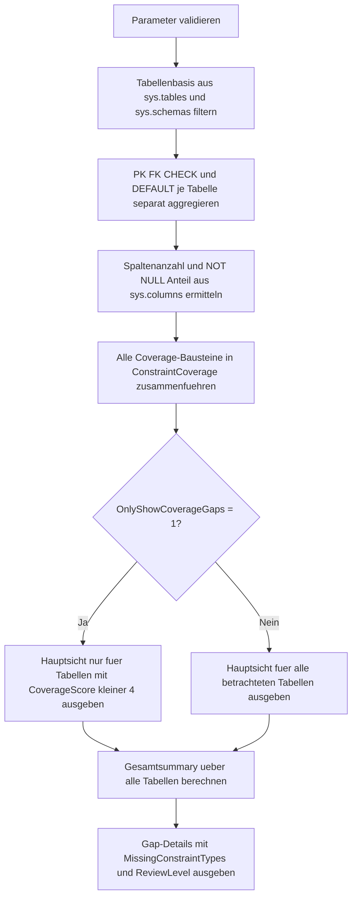

# ListConstraintCoverage.sql

Dieses Skript erstellt einen read-only Report ueber die Constraint-Abdeckung je Tabelle in der aktuellen Datenbank. Im Fokus stehen `PRIMARY KEY`, `FOREIGN KEY`, `CHECK` und `DEFAULT`, damit Luecken in der Integritaetsabsicherung schnell sichtbar werden.

## Uebersicht

<!-- SQLDOC:SUMMARY_TABLE:BEGIN -->
| Feld | Wert |
|---|---|
| Script | [ListConstraintCoverage.sql](ListConstraintCoverage.sql) |
| Version | `1.0` |
| Typ | `diagnostic-query` |
| Kapitel | `16_DataIntegrity_Constraints` |
| Sicherheit | `read-only` |
| Zweck | Erstellt eine tabellenweise Uebersicht ueber PK-, FK-, CHECK- und DEFAULT-Abdeckung und markiert fehlende Constraint-Typen. |
<!-- SQLDOC:SUMMARY_TABLE:END -->

## Einordnung

Das Artefakt eignet sich fuer Schema-Reviews, Migrationsvorbereitung und Governance-Checks. Statt DDL zu veraendern, liest es ausschliesslich Katalogsichten aus und verdichtet daraus, welche Tabellen bereits breit abgesichert sind und wo noch diagnostische Luecken bestehen.

## Annahmen

- Die Analyse arbeitet nur auf der aktuellen Datenbank und beruecksichtigt keine datenbankuebergreifenden Regeln oder externe Governance-Tabellen.
- Eine fehlende Constraint-Art ist ein Review-Hinweis, aber nicht automatisch ein Modellierungsfehler. Manche Tabellen brauchen bewusst keine Foreign Keys oder Defaults.
- `DEFAULT`-Abdeckung wird tabellenweise ueber vorhandene Default Constraints bewertet und nicht als Vollstaendigkeitsbeweis fuer jede einzelne Spalte interpretiert.
- Die Hauptsicht kann optional auf Tabellen mit Coverage-Gaps eingeschraenkt werden, damit Review-Szenarien schneller fokussiert werden.

## Anwendungsfall

Vor Refactorings, Datenqualitaetsinitiativen oder Architektur-Reviews kann schnell geprueft werden, ob Tabellen ueberhaupt einen Primary Key haben, ob referenzielle Beziehungen modelliert wurden und ob Validierungs- oder Voreinstellungsregeln vorhanden sind. Die Lueckenliste eignet sich als Startpunkt fuer manuelle Folgepruefungen.

## Parameter

<!-- SQLDOC:PARAMETERS_TABLE:BEGIN -->
| Parameter | SQL-Typ | Pflicht | Beschreibung |
|---|---|---|---|
| `@SchemaName` | `SYSNAME` | Nein | Optionales Schema fuer die Auswertung. |
| `@TableNamePattern` | `NVARCHAR(128)` | Nein | Optionales `LIKE`-Muster fuer Tabellennamen. |
| `@IncludeMsShipped` | `BIT` | Nein | `1` schliesst systemnahe Tabellen mit ein; `0` fokussiert auf benutzerdefinierte Tabellen. |
| `@OnlyShowCoverageGaps` | `BIT` | Nein | `1` zeigt in der Hauptsicht nur Tabellen mit mindestens einer Constraint-Luecke. |
<!-- SQLDOC:PARAMETERS_TABLE:END -->

## Abhaengigkeiten

<!-- SQLDOC:DEPENDENCIES_LIST:BEGIN -->
- `sys.tables`
- `sys.schemas`
- `sys.key_constraints`
- `sys.foreign_keys`
- `sys.check_constraints`
- `sys.default_constraints`
- `sys.columns`
- `DB_NAME()`
- `STRING_AGG()`
- `DROP TABLE IF EXISTS`
<!-- SQLDOC:DEPENDENCIES_LIST:END -->

## Hinweise

- `ConstraintCoverageByTable` zeigt pro Tabelle die Anzahl der relevanten Constraint-Typen, die Coverage-Stufe und die fehlenden Typen.
- `ConstraintCoverageSummary` verdichtet die betrachtete Datenbank auf einen Blick und zeigt auch einen durchschnittlichen Coverage-Score.
- `ConstraintGapDetails` fokussiert nur Tabellen mit Luecken und vergibt ein einfaches `ReviewLevel` fuer Nacharbeit.
- Die Namenslisten fuer PK-, FK-, CHECK- und DEFAULT-Constraints helfen dabei, nach einem Gap-Scan direkt in die Detailanalyse einzusteigen.

## Versionshistorie

<!-- SQLDOC:VERSION_HISTORY_TABLE:BEGIN -->
| Version | Datum | User | Beschreibung |
|---|---|---|---|
| `1.0` | `2026-04-19` | `ER` | Erstversion eines read-only Coverage-Reports fuer PK-, FK-, CHECK- und DEFAULT-Constraints. |
<!-- SQLDOC:VERSION_HISTORY_TABLE:END -->

## Ablauf

<!-- SQLDOC:MERMAID:BEGIN -->

<!-- SQLDOC:MERMAID:END -->

## SQL-Code

<!-- SQLDOC:SQL_CODE:BEGIN -->
```sql
/*
BEGIN:SQL-HEADER v1
---
sql_header: v1
script_name: "ListConstraintCoverage.sql"
script_version: "1.0"
script_type: "diagnostic-query"
chapter: "16_DataIntegrity_Constraints"

purpose: >
  Erstellt eine tabellenweise Uebersicht ueber die Abdeckung mit PRIMARY KEY,
  FOREIGN KEY, CHECK- und DEFAULT-Constraints und markiert dabei Luecken fuer
  Review- oder Nachpflegezwecke.

parameters:
  - name: "@SchemaName"
    sql_type: "SYSNAME"
    direction: "IN"
    required: false
    description: "Optionales Schema fuer die Auswertung."
  - name: "@TableNamePattern"
    sql_type: "NVARCHAR(128)"
    direction: "IN"
    required: false
    description: "Optionales LIKE-Muster fuer Tabellennamen."
  - name: "@IncludeMsShipped"
    sql_type: "BIT"
    direction: "IN"
    required: false
    description: "1 schliesst systemnahe Tabellen mit ein; 0 fokussiert auf benutzerdefinierte Tabellen."
  - name: "@OnlyShowCoverageGaps"
    sql_type: "BIT"
    direction: "IN"
    required: false
    description: "1 zeigt in der Hauptsicht nur Tabellen mit mindestens einer Constraint-Luecke."

result_sets:
  - name: "ConstraintCoverageByTable"
    description: "Tabellenweise Coverage fuer PK, FK, CHECK und DEFAULT samt Lueckenprofil."
  - name: "ConstraintCoverageSummary"
    description: "Verdichtung ueber alle betrachteten Tabellen mit Anteil je Constraint-Typ."
  - name: "ConstraintGapDetails"
    description: "Nur Tabellen mit fehlenden Constraint-Typen inklusive Gap-Liste und Review-Level."

dependencies:
  - "sys.tables"
  - "sys.schemas"
  - "sys.key_constraints"
  - "sys.foreign_keys"
  - "sys.check_constraints"
  - "sys.default_constraints"
  - "sys.columns"
  - "DB_NAME()"
  - "STRING_AGG()"
  - "DROP TABLE IF EXISTS"

safety:
  level: "read-only"
  writes_data: false

documentation:
  markdown_file: "T-SQL/16_DataIntegrity_Constraints/SQLScripts/ListConstraintCoverage.md"
  sync_blocks:
    - "SUMMARY_TABLE"
    - "PARAMETERS_TABLE"
    - "DEPENDENCIES_LIST"
    - "VERSION_HISTORY_TABLE"
    - "SQL_CODE"
  mermaid:
    mode: "ai-agent-from-sql"
    source: "script-body"

main_responsible:
  name: "Erhard Rainer"
  initials: "ER"

version_history:
  - version: "1.0"
    date: "2026-04-19"
    user: "ER"
    description: "Erstversion eines read-only Coverage-Reports fuer PK-, FK-, CHECK- und DEFAULT-Constraints."

notes:
  - "Die Auswertung liest nur SQL-Server-Katalogsichten der aktuellen Datenbank."
  - "Fehlende Constraint-Typen sind Diagnosehinweise und muessen fachlich bewertet werden."
---
END:SQL-HEADER v1
*/

SET NOCOUNT ON;

DECLARE @SchemaName SYSNAME = NULL;
DECLARE @TableNamePattern NVARCHAR(128) = NULL;
DECLARE @IncludeMsShipped BIT = 0;
DECLARE @OnlyShowCoverageGaps BIT = 0;

IF @IncludeMsShipped NOT IN (0, 1)
BEGIN
    THROW 50000, '@IncludeMsShipped muss 0 oder 1 sein.', 1;
END;

IF @OnlyShowCoverageGaps NOT IN (0, 1)
BEGIN
    THROW 50001, '@OnlyShowCoverageGaps muss 0 oder 1 sein.', 1;
END;

DROP TABLE IF EXISTS #ConstraintCoverage;

WITH TableBase AS
(
    SELECT
        t.object_id AS TableObjectID,
        s.name AS SchemaName,
        t.name AS TableName,
        t.create_date AS TableCreateDate,
        t.modify_date AS TableModifyDate,
        t.is_ms_shipped
    FROM sys.tables AS t
    INNER JOIN sys.schemas AS s
        ON s.schema_id = t.schema_id
    WHERE (@SchemaName IS NULL OR s.name = @SchemaName)
      AND (@TableNamePattern IS NULL OR t.name LIKE @TableNamePattern)
      AND (@IncludeMsShipped = 1 OR t.is_ms_shipped = 0)
),
PrimaryKeyCoverage AS
(
    SELECT
        kc.parent_object_id AS TableObjectID,
        COUNT(*) AS PrimaryKeyCount,
        STRING_AGG(kc.name, N', ') WITHIN GROUP (ORDER BY kc.name) AS PrimaryKeyNames
    FROM sys.key_constraints AS kc
    WHERE kc.type = 'PK'
    GROUP BY
        kc.parent_object_id
),
ForeignKeyCoverage AS
(
    SELECT
        fk.parent_object_id AS TableObjectID,
        COUNT(*) AS ForeignKeyCount,
        STRING_AGG(fk.name, N', ') WITHIN GROUP (ORDER BY fk.name) AS ForeignKeyNames
    FROM sys.foreign_keys AS fk
    GROUP BY
        fk.parent_object_id
),
CheckCoverage AS
(
    SELECT
        cc.parent_object_id AS TableObjectID,
        COUNT(*) AS CheckConstraintCount,
        STRING_AGG(cc.name, N', ') WITHIN GROUP (ORDER BY cc.name) AS CheckConstraintNames
    FROM sys.check_constraints AS cc
    GROUP BY
        cc.parent_object_id
),
DefaultCoverage AS
(
    SELECT
        dc.parent_object_id AS TableObjectID,
        COUNT(*) AS DefaultConstraintCount,
        STRING_AGG(dc.name, N', ') WITHIN GROUP (ORDER BY dc.name) AS DefaultConstraintNames,
        COUNT(DISTINCT dc.parent_column_id) AS ColumnsWithDefaultCount
    FROM sys.default_constraints AS dc
    GROUP BY
        dc.parent_object_id
),
ColumnCoverage AS
(
    SELECT
        c.object_id AS TableObjectID,
        COUNT(*) AS ColumnCount,
        SUM(CASE WHEN c.is_nullable = 0 THEN 1 ELSE 0 END) AS NotNullColumnCount
    FROM sys.columns AS c
    GROUP BY
        c.object_id
)
SELECT
    DB_NAME() AS DatabaseName,
    tb.SchemaName,
    tb.TableName,
    CONCAT(tb.SchemaName, N'.', tb.TableName) AS FullTableName,
    tb.TableCreateDate,
    tb.TableModifyDate,
    col.ColumnCount,
    col.NotNullColumnCount,
    ISNULL(pk.PrimaryKeyCount, 0) AS PrimaryKeyCount,
    ISNULL(fk.ForeignKeyCount, 0) AS ForeignKeyCount,
    ISNULL(ck.CheckConstraintCount, 0) AS CheckConstraintCount,
    ISNULL(dc.DefaultConstraintCount, 0) AS DefaultConstraintCount,
    ISNULL(dc.ColumnsWithDefaultCount, 0) AS ColumnsWithDefaultCount,
    CAST(CASE WHEN ISNULL(pk.PrimaryKeyCount, 0) > 0 THEN 1 ELSE 0 END AS BIT) AS HasPrimaryKey,
    CAST(CASE WHEN ISNULL(fk.ForeignKeyCount, 0) > 0 THEN 1 ELSE 0 END AS BIT) AS HasForeignKey,
    CAST(CASE WHEN ISNULL(ck.CheckConstraintCount, 0) > 0 THEN 1 ELSE 0 END AS BIT) AS HasCheckConstraint,
    CAST(CASE WHEN ISNULL(dc.DefaultConstraintCount, 0) > 0 THEN 1 ELSE 0 END AS BIT) AS HasDefaultConstraint,
    CAST(
        (CASE WHEN ISNULL(pk.PrimaryKeyCount, 0) > 0 THEN 1 ELSE 0 END)
        + (CASE WHEN ISNULL(fk.ForeignKeyCount, 0) > 0 THEN 1 ELSE 0 END)
        + (CASE WHEN ISNULL(ck.CheckConstraintCount, 0) > 0 THEN 1 ELSE 0 END)
        + (CASE WHEN ISNULL(dc.DefaultConstraintCount, 0) > 0 THEN 1 ELSE 0 END)
        AS TINYINT
    ) AS CoverageScore,
    pk.PrimaryKeyNames,
    fk.ForeignKeyNames,
    ck.CheckConstraintNames,
    dc.DefaultConstraintNames,
    LTRIM(
        STUFF(
            CASE WHEN ISNULL(pk.PrimaryKeyCount, 0) = 0 THEN N', PRIMARY_KEY' ELSE N'' END
            + CASE WHEN ISNULL(fk.ForeignKeyCount, 0) = 0 THEN N', FOREIGN_KEY' ELSE N'' END
            + CASE WHEN ISNULL(ck.CheckConstraintCount, 0) = 0 THEN N', CHECK' ELSE N'' END
            + CASE WHEN ISNULL(dc.DefaultConstraintCount, 0) = 0 THEN N', DEFAULT' ELSE N'' END,
            1,
            1,
            N''
        )
    ) AS MissingConstraintTypes,
    CASE
        WHEN ISNULL(pk.PrimaryKeyCount, 0) > 0
         AND ISNULL(fk.ForeignKeyCount, 0) > 0
         AND ISNULL(ck.CheckConstraintCount, 0) > 0
         AND ISNULL(dc.DefaultConstraintCount, 0) > 0 THEN N'FULL_COVERAGE'
        WHEN ISNULL(pk.PrimaryKeyCount, 0) = 0
         AND ISNULL(fk.ForeignKeyCount, 0) = 0
         AND ISNULL(ck.CheckConstraintCount, 0) = 0
         AND ISNULL(dc.DefaultConstraintCount, 0) = 0 THEN N'NO_COVERAGE'
        WHEN ISNULL(pk.PrimaryKeyCount, 0) = 0 THEN N'MISSING_PRIMARY_KEY'
        WHEN ISNULL(fk.ForeignKeyCount, 0) = 0
         AND ISNULL(ck.CheckConstraintCount, 0) = 0
         AND ISNULL(dc.DefaultConstraintCount, 0) = 0 THEN N'PRIMARY_KEY_ONLY'
        ELSE N'PARTIAL_COVERAGE'
    END AS CoverageProfile
INTO #ConstraintCoverage
FROM TableBase AS tb
LEFT JOIN PrimaryKeyCoverage AS pk
    ON pk.TableObjectID = tb.TableObjectID
LEFT JOIN ForeignKeyCoverage AS fk
    ON fk.TableObjectID = tb.TableObjectID
LEFT JOIN CheckCoverage AS ck
    ON ck.TableObjectID = tb.TableObjectID
LEFT JOIN DefaultCoverage AS dc
    ON dc.TableObjectID = tb.TableObjectID
LEFT JOIN ColumnCoverage AS col
    ON col.TableObjectID = tb.TableObjectID;

SELECT
    DatabaseName,
    SchemaName,
    TableName,
    FullTableName,
    ColumnCount,
    NotNullColumnCount,
    PrimaryKeyCount,
    ForeignKeyCount,
    CheckConstraintCount,
    DefaultConstraintCount,
    ColumnsWithDefaultCount,
    HasPrimaryKey,
    HasForeignKey,
    HasCheckConstraint,
    HasDefaultConstraint,
    CoverageScore,
    CoverageProfile,
    MissingConstraintTypes,
    PrimaryKeyNames,
    ForeignKeyNames,
    CheckConstraintNames,
    DefaultConstraintNames,
    TableCreateDate,
    TableModifyDate
FROM #ConstraintCoverage
WHERE @OnlyShowCoverageGaps = 0
   OR CoverageScore < 4
ORDER BY
    CoverageScore ASC,
    SchemaName,
    TableName;

SELECT
    COUNT(*) AS TableCount,
    SUM(CASE WHEN HasPrimaryKey = 1 THEN 1 ELSE 0 END) AS TablesWithPrimaryKey,
    SUM(CASE WHEN HasForeignKey = 1 THEN 1 ELSE 0 END) AS TablesWithForeignKey,
    SUM(CASE WHEN HasCheckConstraint = 1 THEN 1 ELSE 0 END) AS TablesWithCheckConstraint,
    SUM(CASE WHEN HasDefaultConstraint = 1 THEN 1 ELSE 0 END) AS TablesWithDefaultConstraint,
    SUM(CASE WHEN CoverageScore = 4 THEN 1 ELSE 0 END) AS FullyCoveredTables,
    SUM(CASE WHEN CoverageScore = 0 THEN 1 ELSE 0 END) AS TablesWithoutTrackedConstraints,
    CAST(AVG(CAST(CoverageScore AS DECIMAL(5, 2))) AS DECIMAL(5, 2)) AS AverageCoverageScore
FROM #ConstraintCoverage;

SELECT
    SchemaName,
    TableName,
    FullTableName,
    CoverageScore,
    MissingConstraintTypes,
    CASE
        WHEN CoverageScore <= 1 THEN N'REVIEW_HIGH'
        WHEN CoverageScore = 2 THEN N'REVIEW_MEDIUM'
        ELSE N'REVIEW_LOW'
    END AS ReviewLevel,
    PrimaryKeyCount,
    ForeignKeyCount,
    CheckConstraintCount,
    DefaultConstraintCount,
    ColumnsWithDefaultCount,
    PrimaryKeyNames,
    ForeignKeyNames,
    CheckConstraintNames,
    DefaultConstraintNames
FROM #ConstraintCoverage
WHERE CoverageScore < 4
ORDER BY
    CoverageScore ASC,
    SchemaName,
    TableName;

DROP TABLE IF EXISTS #ConstraintCoverage;
```
<!-- SQLDOC:SQL_CODE:END -->
