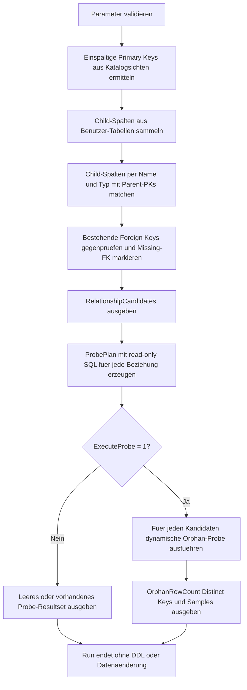

# OrphanCandidateFromMissingFk.sql

Dieses Skript sucht nach moeglichen Child-Parent-Beziehungen, fuer die in der aktuellen Datenbank kein `FOREIGN KEY` definiert ist, obwohl Spaltenname und Datentyp auf eine Beziehung hindeuten. Optional kann es die gefundenen Kandidaten direkt mit read-only Orphan-Probes nachzaehlen.

## Uebersicht

<!-- SQLDOC:SUMMARY_TABLE:BEGIN -->
| Feld | Wert |
|---|---|
| Script | [OrphanCandidateFromMissingFk.sql](OrphanCandidateFromMissingFk.sql) |
| Version | `1.0` |
| Typ | `diagnostic-query` |
| Kapitel | `16_DataIntegrity_Constraints` |
| Sicherheit | `read-only` |
| Zweck | Leitet fehlende FK-Kandidaten heuristisch ab und kann dazu Orphan-Counts per Probe berechnen. |
<!-- SQLDOC:SUMMARY_TABLE:END -->

## Einordnung

Das Artefakt ist fuer Reviews in Datenbanken gedacht, in denen Beziehungen historisch nur implizit modelliert wurden. Statt sofort DDL vorzuschlagen, verbindet das Skript Metadatenheuristiken mit optionalen Probeabfragen, damit potenzielle Integritaetsluecken zuerst sichtbar werden.

## Annahmen

- Die Erstversion betrachtet nur Parent-Tabellen mit einspaltigem `PRIMARY KEY`, weil dafuer die Heuristik stabil und gut erklaerbar bleibt.
- Ein Kandidat entsteht nur bei gleichem Spaltennamen und kompatibler Typ-Signatur zwischen Child-Spalte und Parent-PK.
- Mehrspaltige Schluessel, freie Benennungskonventionen und komplexe Businessregeln werden bewusst nicht erraten.
- Die optionale Probe fuehrt nur dynamische `SELECT`-Statements aus und erzeugt keine `ALTER TABLE`- oder Datenaenderungen.

## Anwendungsfall

Nutzbar ist das Skript vor Integritaetsinitiativen, beim Aufraeumen gewachsener Alt-Schemata oder als Review-Schritt vor dem spaeteren Einfuehren echter `FOREIGN KEY`-Constraints. Zuerst werden heuristische Kandidaten und Probe-SQL ausgegeben; bei Bedarf kann `@ExecuteProbe = 1` aktiviert werden, um Orphan-Counts und Beispielschluessel direkt zu sehen.

## Parameter

<!-- SQLDOC:PARAMETERS_TABLE:BEGIN -->
| Parameter | SQL-Typ | Pflicht | Beschreibung |
|---|---|---|---|
| `@SchemaName` | `SYSNAME` | Nein | Optionales Schema fuer Child- und Parent-Tabellen. |
| `@OnlyMissingForeignKeys` | `BIT` | Nein | `1` zeigt nur Kandidaten ohne bestehende `FOREIGN KEY`-Definition. |
| `@ExecuteProbe` | `BIT` | Nein | `1` fuehrt fuer die Kandidaten dynamische read-only Orphan-Probes aus. |
| `@MaxSampleRows` | `INT` | Nein | Begrenzt die Zahl der Beispielschluessel in der Probeausgabe. |
<!-- SQLDOC:PARAMETERS_TABLE:END -->

## Abhaengigkeiten

<!-- SQLDOC:DEPENDENCIES_LIST:BEGIN -->
- `sys.tables`
- `sys.schemas`
- `sys.columns`
- `sys.types`
- `sys.key_constraints`
- `sys.index_columns`
- `sys.foreign_key_columns`
- `DB_NAME()`
- `QUOTENAME()`
- `sp_executesql`
- `STRING_AGG()`
- `DROP TABLE IF EXISTS`
<!-- SQLDOC:DEPENDENCIES_LIST:END -->

## Hinweise

- `RelationshipCandidates` ist die Hauptsicht mit Child- und Parent-Tabelle, Missing-FK-Flag und einer knappen Heuristikbegruendung.
- `ProbePlan` zeigt fuer jeden Kandidaten das read-only Statement, das bei Bedarf separat oder ueber `@ExecuteProbe = 1` verwendet werden kann.
- `OrphanProbeResults` bleibt leer, solange die Probe nicht aktiviert wird.
- Nullable Child-Spalten werden nicht als Fehler bewertet; `NULL` wird in der Probe bewusst nicht als Orphan gezaehlt.

## Versionshistorie

<!-- SQLDOC:VERSION_HISTORY_TABLE:BEGIN -->
| Version | Datum | User | Beschreibung |
|---|---|---|---|
| `1.0` | `2026-04-19` | `ER` | Erstversion einer read-only Diagnose fuer Orphan-Kandidaten ohne definierte `FOREIGN KEY`s. |
<!-- SQLDOC:VERSION_HISTORY_TABLE:END -->

## Ablauf

<!-- SQLDOC:MERMAID:BEGIN -->

<!-- SQLDOC:MERMAID:END -->

## SQL-Code

<!-- SQLDOC:SQL_CODE:BEGIN -->
```sql
/*
BEGIN:SQL-HEADER v1
---
sql_header: v1
script_name: "OrphanCandidateFromMissingFk.sql"
script_version: "1.0"
script_type: "diagnostic-query"
chapter: "16_DataIntegrity_Constraints"

purpose: >
  Leitet potenzielle Child-Parent-Beziehungen ohne definierte FOREIGN KEYs aus
  SQL-Server-Katalogsichten ab und kann fuer diese Kandidaten optional
  Orphan-Counts per read-only Probe berechnen.

parameters:
  - name: "@SchemaName"
    sql_type: "SYSNAME"
    direction: "IN"
    required: false
    description: "Optionales Schema fuer Child- und Parent-Tabellen."
  - name: "@OnlyMissingForeignKeys"
    sql_type: "BIT"
    direction: "IN"
    required: false
    description: "1 zeigt nur Kandidaten ohne bestehende FOREIGN KEY-Definition."
  - name: "@ExecuteProbe"
    sql_type: "BIT"
    direction: "IN"
    required: false
    description: "1 fuehrt fuer die Kandidaten dynamische read-only Orphan-Probes aus."
  - name: "@MaxSampleRows"
    sql_type: "INT"
    direction: "IN"
    required: false
    description: "Begrenzt die Zahl der Beispielschluessel in der Probeausgabe."

result_sets:
  - name: "RelationshipCandidates"
    description: "Heuristisch abgeleitete Child-Parent-Beziehungen inklusive Missing-FK-Markierung."
  - name: "ProbePlan"
    description: "Read-only Probe-Statements fuer die gefundenen Kandidaten."
  - name: "OrphanProbeResults"
    description: "Optionale Orphan-Counts und Beispielschluessel aus den ausgefuehrten Probes."

dependencies:
  - "sys.tables"
  - "sys.schemas"
  - "sys.columns"
  - "sys.types"
  - "sys.key_constraints"
  - "sys.index_columns"
  - "sys.foreign_key_columns"
  - "DB_NAME()"
  - "QUOTENAME()"
  - "sp_executesql"
  - "STRING_AGG()"
  - "DROP TABLE IF EXISTS"

safety:
  level: "read-only"
  writes_data: false

documentation:
  markdown_file: "T-SQL/16_DataIntegrity_Constraints/SQLScripts/OrphanCandidateFromMissingFk.md"
  sync_blocks:
    - "SUMMARY_TABLE"
    - "PARAMETERS_TABLE"
    - "DEPENDENCIES_LIST"
    - "VERSION_HISTORY_TABLE"
    - "SQL_CODE"
  mermaid:
    mode: "ai-agent-from-sql"
    source: "script-body"

main_responsible:
  name: "Erhard Rainer"
  initials: "ER"

version_history:
  - version: "1.0"
    date: "2026-04-19"
    user: "ER"
    description: "Erstversion einer read-only Diagnose fuer Orphan-Kandidaten ohne definierte FOREIGN KEYs."

notes:
  - "Die Heuristik betrachtet nur Tabellen mit einspaltigem Primary Key."
  - "Kandidaten entstehen nur bei gleicher Spaltenbenennung und kompatibler Datentyp-Signatur."
  - "Die optionale Probe verwendet dynamisches SQL ausschliesslich fuer SELECT-Auswertungen."
---
END:SQL-HEADER v1
*/

SET NOCOUNT ON;

DECLARE @SchemaName SYSNAME = NULL;
DECLARE @OnlyMissingForeignKeys BIT = 1;
DECLARE @ExecuteProbe BIT = 0;
DECLARE @MaxSampleRows INT = 10;

IF @OnlyMissingForeignKeys NOT IN (0, 1)
BEGIN
    THROW 50000, '@OnlyMissingForeignKeys muss 0 oder 1 sein.', 1;
END;

IF @ExecuteProbe NOT IN (0, 1)
BEGIN
    THROW 50001, '@ExecuteProbe muss 0 oder 1 sein.', 1;
END;

IF @MaxSampleRows IS NULL OR @MaxSampleRows < 1 OR @MaxSampleRows > 100
BEGIN
    THROW 50002, '@MaxSampleRows muss zwischen 1 und 100 liegen.', 1;
END;

DROP TABLE IF EXISTS #RelationshipCandidates;
DROP TABLE IF EXISTS #ProbePlan;
DROP TABLE IF EXISTS #OrphanProbeResults;

WITH SingleColumnPrimaryKeys AS
(
    SELECT
        kc.parent_object_id AS ParentObjectID,
        kc.name AS PrimaryKeyName,
        s.name AS ParentSchemaName,
        t.name AS ParentTableName,
        c.column_id AS ParentColumnID,
        c.name AS ParentColumnName,
        ty.name AS ParentTypeName,
        c.max_length AS ParentMaxLength,
        c.precision AS ParentPrecision,
        c.scale AS ParentScale,
        COUNT(*) OVER (PARTITION BY kc.parent_object_id) AS PrimaryKeyColumnCount
    FROM sys.key_constraints AS kc
    INNER JOIN sys.tables AS t
        ON t.object_id = kc.parent_object_id
    INNER JOIN sys.schemas AS s
        ON s.schema_id = t.schema_id
    INNER JOIN sys.index_columns AS ic
        ON ic.object_id = kc.parent_object_id
       AND ic.index_id = kc.unique_index_id
    INNER JOIN sys.columns AS c
        ON c.object_id = ic.object_id
       AND c.column_id = ic.column_id
    INNER JOIN sys.types AS ty
        ON ty.user_type_id = c.user_type_id
    WHERE kc.type = 'PK'
      AND (@SchemaName IS NULL OR s.name = @SchemaName)
      AND t.is_ms_shipped = 0
),
EligiblePrimaryKeys AS
(
    SELECT
        pk.ParentObjectID,
        pk.PrimaryKeyName,
        pk.ParentSchemaName,
        pk.ParentTableName,
        pk.ParentColumnID,
        pk.ParentColumnName,
        pk.ParentTypeName,
        pk.ParentMaxLength,
        pk.ParentPrecision,
        pk.ParentScale
    FROM SingleColumnPrimaryKeys AS pk
    WHERE pk.PrimaryKeyColumnCount = 1
),
ChildColumns AS
(
    SELECT
        t.object_id AS ChildObjectID,
        s.name AS ChildSchemaName,
        t.name AS ChildTableName,
        c.column_id AS ChildColumnID,
        c.name AS ChildColumnName,
        ty.name AS ChildTypeName,
        c.max_length AS ChildMaxLength,
        c.precision AS ChildPrecision,
        c.scale AS ChildScale,
        c.is_nullable AS ChildIsNullable
    FROM sys.tables AS t
    INNER JOIN sys.schemas AS s
        ON s.schema_id = t.schema_id
    INNER JOIN sys.columns AS c
        ON c.object_id = t.object_id
    INNER JOIN sys.types AS ty
        ON ty.user_type_id = c.user_type_id
    WHERE (@SchemaName IS NULL OR s.name = @SchemaName)
      AND t.is_ms_shipped = 0
),
ForeignKeyCoverage AS
(
    SELECT DISTINCT
        fkc.parent_object_id AS ChildObjectID,
        fkc.parent_column_id AS ChildColumnID,
        fkc.referenced_object_id AS ParentObjectID,
        fkc.referenced_column_id AS ParentColumnID
    FROM sys.foreign_key_columns AS fkc
),
RelationshipCandidates AS
(
    SELECT
        ROW_NUMBER() OVER
        (
            ORDER BY
                cc.ChildSchemaName,
                cc.ChildTableName,
                cc.ChildColumnName,
                pk.ParentSchemaName,
                pk.ParentTableName
        ) AS CandidateID,
        DB_NAME() AS DatabaseName,
        cc.ChildSchemaName,
        cc.ChildTableName,
        cc.ChildColumnName,
        pk.ParentSchemaName,
        pk.ParentTableName,
        pk.ParentColumnName,
        pk.PrimaryKeyName,
        cc.ChildTypeName,
        cc.ChildMaxLength,
        cc.ChildPrecision,
        cc.ChildScale,
        cc.ChildIsNullable,
        CAST(CASE WHEN fkc.ChildObjectID IS NULL THEN 1 ELSE 0 END AS BIT) AS IsMissingForeignKey,
        CASE
            WHEN cc.ChildSchemaName = pk.ParentSchemaName THEN N'HIGH'
            ELSE N'MEDIUM'
        END AS ConfidenceLevel,
        CASE
            WHEN cc.ChildSchemaName = pk.ParentSchemaName THEN N'Gleicher Schemaname, gleicher Spaltenname und kompatibler Datentyp.'
            ELSE N'Gleicher Spaltenname und kompatibler Datentyp, aber schemauebergreifend.'
        END AS HeuristicReason
    FROM ChildColumns AS cc
    INNER JOIN EligiblePrimaryKeys AS pk
        ON pk.ParentObjectID <> cc.ChildObjectID
       AND pk.ParentColumnName = cc.ChildColumnName
       AND pk.ParentTypeName = cc.ChildTypeName
       AND pk.ParentMaxLength = cc.ChildMaxLength
       AND pk.ParentPrecision = cc.ChildPrecision
       AND pk.ParentScale = cc.ChildScale
    LEFT JOIN ForeignKeyCoverage AS fkc
        ON fkc.ChildObjectID = cc.ChildObjectID
       AND fkc.ChildColumnID = cc.ChildColumnID
       AND fkc.ParentObjectID = pk.ParentObjectID
       AND fkc.ParentColumnID = pk.ParentColumnID
)
SELECT
    CandidateID,
    DatabaseName,
    ChildSchemaName,
    ChildTableName,
    ChildColumnName,
    ParentSchemaName,
    ParentTableName,
    ParentColumnName,
    PrimaryKeyName,
    ChildTypeName,
    ChildMaxLength,
    ChildPrecision,
    ChildScale,
    ChildIsNullable,
    IsMissingForeignKey,
    ConfidenceLevel,
    HeuristicReason
INTO #RelationshipCandidates
FROM RelationshipCandidates
WHERE @OnlyMissingForeignKeys = 0
   OR IsMissingForeignKey = 1;

SELECT
    rc.CandidateID,
    rc.DatabaseName,
    rc.ChildSchemaName,
    rc.ChildTableName,
    rc.ChildColumnName,
    rc.ParentSchemaName,
    rc.ParentTableName,
    rc.ParentColumnName,
    rc.PrimaryKeyName,
    rc.IsMissingForeignKey,
    rc.ConfidenceLevel,
    rc.HeuristicReason,
    CASE
        WHEN rc.ChildIsNullable = 1 THEN N'Nullable Child-Spalte; NULL-Werte werden spaeter nicht als Orphans gezaehlt.'
        ELSE N'NOT NULL Child-Spalte; fehlende Parent-Treffer sind besonders auffaellig.'
    END AS DiagnosticNote
FROM #RelationshipCandidates AS rc
ORDER BY
    rc.IsMissingForeignKey DESC,
    rc.ConfidenceLevel DESC,
    rc.ChildSchemaName,
    rc.ChildTableName,
    rc.ChildColumnName,
    rc.ParentSchemaName,
    rc.ParentTableName;

SELECT
    rc.CandidateID,
    CONCAT(rc.ChildSchemaName, N'.', rc.ChildTableName) AS ChildTable,
    rc.ChildColumnName,
    CONCAT(rc.ParentSchemaName, N'.', rc.ParentTableName) AS ParentTable,
    rc.ParentColumnName,
    rc.IsMissingForeignKey,
    CAST(
        N'SELECT COUNT(*) AS OrphanRowCount '
        + N'FROM ' + QUOTENAME(rc.ChildSchemaName) + N'.' + QUOTENAME(rc.ChildTableName) + N' AS c '
        + N'LEFT JOIN ' + QUOTENAME(rc.ParentSchemaName) + N'.' + QUOTENAME(rc.ParentTableName) + N' AS p '
        + N'ON p.' + QUOTENAME(rc.ParentColumnName) + N' = c.' + QUOTENAME(rc.ChildColumnName) + N' '
        + N'WHERE c.' + QUOTENAME(rc.ChildColumnName) + N' IS NOT NULL '
        + N'AND p.' + QUOTENAME(rc.ParentColumnName) + N' IS NULL;'
        AS NVARCHAR(MAX)
    ) AS ProbeSqlPreview
INTO #ProbePlan
FROM #RelationshipCandidates AS rc;

SELECT
    pp.CandidateID,
    pp.ChildTable,
    pp.ChildColumnName,
    pp.ParentTable,
    pp.ParentColumnName,
    pp.IsMissingForeignKey,
    pp.ProbeSqlPreview
FROM #ProbePlan AS pp
ORDER BY
    pp.IsMissingForeignKey DESC,
    pp.CandidateID;

CREATE TABLE #OrphanProbeResults
(
    CandidateID INT NOT NULL,
    ChildTable NVARCHAR(257) NOT NULL,
    ChildColumnName SYSNAME NOT NULL,
    ParentTable NVARCHAR(257) NOT NULL,
    ParentColumnName SYSNAME NOT NULL,
    OrphanRowCount BIGINT NOT NULL,
    DistinctOrphanKeyCount INT NOT NULL,
    SampleOrphanKeys NVARCHAR(MAX) NULL
);

IF @ExecuteProbe = 1
BEGIN
    DECLARE
        @CandidateID INT,
        @ChildSchemaName SYSNAME,
        @ChildTableName SYSNAME,
        @ChildColumnName SYSNAME,
        @ParentSchemaName SYSNAME,
        @ParentTableName SYSNAME,
        @ParentColumnName SYSNAME,
        @DynamicSql NVARCHAR(MAX);

    DECLARE CandidateCursor CURSOR LOCAL FAST_FORWARD FOR
        SELECT
            rc.CandidateID,
            rc.ChildSchemaName,
            rc.ChildTableName,
            rc.ChildColumnName,
            rc.ParentSchemaName,
            rc.ParentTableName,
            rc.ParentColumnName
        FROM #RelationshipCandidates AS rc
        ORDER BY
            rc.IsMissingForeignKey DESC,
            rc.CandidateID;

    OPEN CandidateCursor;

    FETCH NEXT FROM CandidateCursor
    INTO
        @CandidateID,
        @ChildSchemaName,
        @ChildTableName,
        @ChildColumnName,
        @ParentSchemaName,
        @ParentTableName,
        @ParentColumnName;

    WHILE @@FETCH_STATUS = 0
    BEGIN
        SET @DynamicSql =
            N'INSERT INTO #OrphanProbeResults ' +
            N'(' +
            N'CandidateID, ChildTable, ChildColumnName, ParentTable, ParentColumnName, ' +
            N'OrphanRowCount, DistinctOrphanKeyCount, SampleOrphanKeys' +
            N') ' +
            N'SELECT ' +
            CAST(@CandidateID AS NVARCHAR(20)) + N', ' +
            N'N''' + REPLACE(@ChildSchemaName + N'.' + @ChildTableName, N'''', N'''''') + N''', ' +
            N'N''' + REPLACE(@ChildColumnName, N'''', N'''''') + N''', ' +
            N'N''' + REPLACE(@ParentSchemaName + N'.' + @ParentTableName, N'''', N'''''') + N''', ' +
            N'N''' + REPLACE(@ParentColumnName, N'''', N'''''') + N''', ' +
            N'COUNT_BIG(*), ' +
            N'COUNT(DISTINCT CONVERT(NVARCHAR(4000), c.' + QUOTENAME(@ChildColumnName) + N')), ' +
            N'(' +
            N'    SELECT STRING_AGG(s.OrphanKey, N'', '') ' +
            N'    FROM (' +
            N'        SELECT TOP (' + CAST(@MaxSampleRows AS NVARCHAR(20)) + N') ' +
            N'            CONVERT(NVARCHAR(4000), c2.' + QUOTENAME(@ChildColumnName) + N') AS OrphanKey ' +
            N'        FROM ' + QUOTENAME(@ChildSchemaName) + N'.' + QUOTENAME(@ChildTableName) + N' AS c2 ' +
            N'        LEFT JOIN ' + QUOTENAME(@ParentSchemaName) + N'.' + QUOTENAME(@ParentTableName) + N' AS p2 ' +
            N'            ON p2.' + QUOTENAME(@ParentColumnName) + N' = c2.' + QUOTENAME(@ChildColumnName) + N' ' +
            N'        WHERE c2.' + QUOTENAME(@ChildColumnName) + N' IS NOT NULL ' +
            N'          AND p2.' + QUOTENAME(@ParentColumnName) + N' IS NULL ' +
            N'        GROUP BY CONVERT(NVARCHAR(4000), c2.' + QUOTENAME(@ChildColumnName) + N') ' +
            N'        ORDER BY CONVERT(NVARCHAR(4000), c2.' + QUOTENAME(@ChildColumnName) + N') ' +
            N'    ) AS s' +
            N') ' +
            N'FROM ' + QUOTENAME(@ChildSchemaName) + N'.' + QUOTENAME(@ChildTableName) + N' AS c ' +
            N'LEFT JOIN ' + QUOTENAME(@ParentSchemaName) + N'.' + QUOTENAME(@ParentTableName) + N' AS p ' +
            N'    ON p.' + QUOTENAME(@ParentColumnName) + N' = c.' + QUOTENAME(@ChildColumnName) + N' ' +
            N'WHERE c.' + QUOTENAME(@ChildColumnName) + N' IS NOT NULL ' +
            N'  AND p.' + QUOTENAME(@ParentColumnName) + N' IS NULL;';

        EXEC sys.sp_executesql @DynamicSql;

        FETCH NEXT FROM CandidateCursor
        INTO
            @CandidateID,
            @ChildSchemaName,
            @ChildTableName,
            @ChildColumnName,
            @ParentSchemaName,
            @ParentTableName,
            @ParentColumnName;
    END;

    CLOSE CandidateCursor;
    DEALLOCATE CandidateCursor;
END;

SELECT
    opr.CandidateID,
    opr.ChildTable,
    opr.ChildColumnName,
    opr.ParentTable,
    opr.ParentColumnName,
    opr.OrphanRowCount,
    opr.DistinctOrphanKeyCount,
    opr.SampleOrphanKeys
FROM #OrphanProbeResults AS opr
ORDER BY
    opr.OrphanRowCount DESC,
    opr.CandidateID;

DROP TABLE IF EXISTS #RelationshipCandidates;
DROP TABLE IF EXISTS #ProbePlan;
DROP TABLE IF EXISTS #OrphanProbeResults;
```
<!-- SQLDOC:SQL_CODE:END -->
