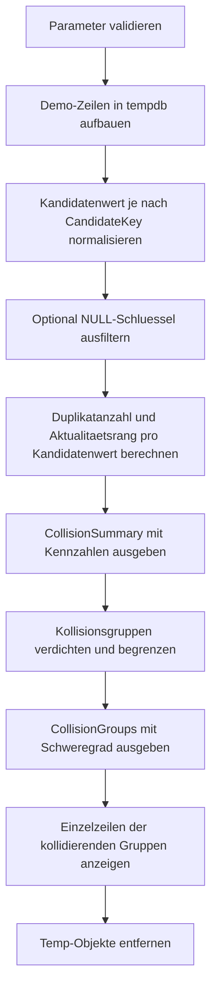

# UniqueConstraintCollisionPreview.sql

Dieses Skript zeigt an einem eingebetteten Demo-Datensatz, welche Schluesselkandidaten vor dem Einfuehren eines `UNIQUE`-Constraints kollidieren. Die Ausgabe verdichtet erst die Zahl der Konflikte und zeigt danach die einzelnen Zeilen, die in einer spaeteren Constraint-Pruefung scheitern wuerden.

## Uebersicht

<!-- SQLDOC:SUMMARY_TABLE:BEGIN -->
| Feld | Wert |
|---|---|
| Script | [UniqueConstraintCollisionPreview.sql](UniqueConstraintCollisionPreview.sql) |
| Version | `1.0` |
| Typ | `didactic-lab` |
| Kapitel | `16_DataIntegrity_Constraints` |
| Sicherheit | `read-only-tempdb` |
| Zweck | Zeigt kollidierende Schluesselkandidaten vor einer spaeteren `UNIQUE`-Constraint-Einfuehrung an. |
<!-- SQLDOC:SUMMARY_TABLE:END -->

## Einordnung

Die Vorpruefung richtet sich an Lern- und Review-Situationen, in denen zuerst sichtbar werden soll, ob ein geplanter Schluessel bereits doppelte Werte enthaelt. Statt direkt DDL auszufuehren, normalisiert das Skript typische Kandidatenwerte, gruppiert Kollisionen und zeigt die betroffenen Zeilen in einer nachvollziehbaren Reihenfolge.

## Annahmen

- Die Erstversion arbeitet mit Demo-Daten in einer Temp-Tabelle und nicht mit produktiven Fachtabellen.
- Fuer `EmailAddress` wird zur Kollisionssuche auf Kleinbuchstaben, fuer `ExternalReference` auf Grossbuchstaben normalisiert; fuehrende und nachgestellte Leerzeichen werden entfernt.
- `NULL` kann optional in die Auswertung einbezogen werden, wird standardmaessig aber ausgefiltert, weil `UNIQUE`-Strategien fuer `NULL` im Review oft gesondert entschieden werden.
- Das Skript liefert nur eine Diagnose und erzeugt weder `ALTER TABLE` noch Datenkorrekturen.

## Anwendungsfall

Nutzbar ist das Artefakt vor Datenbereinigungen, vor dem Einfuehren eines `UNIQUE`-Constraints oder als Unterrichtsbeispiel fuer die Frage, warum ein scheinbar eindeutiges Business-Merkmal in der Praxis doch kollidieren kann. Mit `@CandidateKey` laesst sich zwischen mehreren Schluesselkandidaten umschalten, ohne den eigentlichen Analyseablauf zu veraendern.

## Parameter

<!-- SQLDOC:PARAMETERS_TABLE:BEGIN -->
| Parameter | SQL-Typ | Pflicht | Beschreibung |
|---|---|---|---|
| `@CandidateKey` | `NVARCHAR(30)` | Nein | Waehlt den Schluesselkandidaten aus: `CustomerCode`, `EmailAddress` oder `ExternalReference`. |
| `@IncludeNullKeys` | `BIT` | Nein | `1` bezieht `NULL`-Schluesselwerte in die Vorpruefung ein, `0` filtert sie aus. |
| `@TopDuplicateGroups` | `INT` | Nein | Begrenzt die Zahl der ausgegebenen Kollisionsgruppen. |
<!-- SQLDOC:PARAMETERS_TABLE:END -->

## Abhaengigkeiten

<!-- SQLDOC:DEPENDENCIES_LIST:BEGIN -->
- `VALUES`
- `ROW_NUMBER()`
- `COUNT() OVER`
- `STRING_AGG()`
- `SYSUTCDATETIME()`
- `DROP TABLE IF EXISTS`
<!-- SQLDOC:DEPENDENCIES_LIST:END -->

## Hinweise

- `CollisionSummary` gibt die groben Kennzahlen aus, darunter die Zahl der Kollisionsgruppen und die groesste Gruppengroesse.
- `CollisionGroups` konzentriert sich auf die problematischen Schluesselwerte und zeigt dabei auch, aus wie vielen Batches die Kollision stammt.
- `CollisionRows` ordnet die betroffenen Zeilen pro Schluesselwert nach Aktualitaet, damit eine spaetere fachliche Bereinigung vorbereitet werden kann.
- Der Demo-Datensatz enthaelt bewusst unterschiedliche Kollisionsmuster: exakte Duplikate, nur durch Leerzeichen oder Gross-/Kleinschreibung abweichende Werte sowie `NULL`-Faelle.

## Versionshistorie

<!-- SQLDOC:VERSION_HISTORY_TABLE:BEGIN -->
| Version | Datum | User | Beschreibung |
|---|---|---|---|
| `1.0` | `2026-04-19` | `ER` | Erstversion einer didaktischen Vorpruefung fuer moegliche `UNIQUE`-Kollisionen. |
<!-- SQLDOC:VERSION_HISTORY_TABLE:END -->

## Ablauf

<!-- SQLDOC:MERMAID:BEGIN -->

<!-- SQLDOC:MERMAID:END -->

## SQL-Code

<!-- SQLDOC:SQL_CODE:BEGIN -->
```sql
/*
BEGIN:SQL-HEADER v1
---
sql_header: v1
script_name: "UniqueConstraintCollisionPreview.sql"
script_version: "1.0"
script_type: "didactic-lab"
chapter: "16_DataIntegrity_Constraints"

purpose: >
  Zeigt an einer read-only Demo-Vorpruefung, welche Schluesselkandidaten vor
  dem Einfuehren eines UNIQUE-Constraints kollidieren, wie stark die
  Kollisionen ausgepraegt sind und welche Zeilen pro Kandidat betroffen
  waeren.

parameters:
  - name: "@CandidateKey"
    sql_type: "NVARCHAR(30)"
    direction: "IN"
    required: false
    description: "Waehlt den zu pruefenden Schluesselkandidaten aus: CustomerCode, EmailAddress oder ExternalReference."
  - name: "@IncludeNullKeys"
    sql_type: "BIT"
    direction: "IN"
    required: false
    description: "1 bezieht NULL-Schluesselwerte in die Vorpruefung ein, 0 filtert sie aus."
  - name: "@TopDuplicateGroups"
    sql_type: "INT"
    direction: "IN"
    required: false
    description: "Begrenzt die ausgegebenen Kollisionsgruppen."

result_sets:
  - name: "CollisionSummary"
    description: "Verdichtete Kennzahlen zum gewaehlten Schluesselkandidaten."
  - name: "CollisionGroups"
    description: "Kollidierende Schluesselwerte inklusive betroffener Zeilenanzahl und letzter Aenderung."
  - name: "CollisionRows"
    description: "Betroffene Einzelzeilen je kollidierendem Schluesselwert."

dependencies:
  - "VALUES"
  - "ROW_NUMBER()"
  - "COUNT() OVER"
  - "STRING_AGG()"
  - "SYSUTCDATETIME()"
  - "DROP TABLE IF EXISTS"

safety:
  level: "read-only-tempdb"
  writes_data: false

documentation:
  markdown_file: "T-SQL/16_DataIntegrity_Constraints/SQLScripts/UniqueConstraintCollisionPreview.md"
  sync_blocks:
    - "SUMMARY_TABLE"
    - "PARAMETERS_TABLE"
    - "DEPENDENCIES_LIST"
    - "VERSION_HISTORY_TABLE"
    - "SQL_CODE"
  mermaid:
    mode: "ai-agent-from-sql"
    source: "script-body"

main_responsible:
  name: "Erhard Rainer"
  initials: "ER"

version_history:
  - version: "1.0"
    date: "2026-04-19"
    user: "ER"
    description: "Erstversion einer didaktischen Vorpruefung fuer moegliche UNIQUE-Kollisionen."

notes:
  - "Die Erstversion verwendet einen eingebetteten Demo-Datensatz statt produktiver Tabellen."
  - "Gross-Kleinschreibung und Leerzeichen werden fuer Email und Referenz bewusst normalisiert."
  - "Das Skript fuehrt keine DDL aus und dient nur zur Vorpruefung vor einer spaeteren Constraint-Einfuehrung."
---
END:SQL-HEADER v1
*/

SET NOCOUNT ON;

DECLARE @CandidateKey NVARCHAR(30) = N'EmailAddress';
DECLARE @IncludeNullKeys BIT = 0;
DECLARE @TopDuplicateGroups INT = 10;

IF @CandidateKey NOT IN (N'CustomerCode', N'EmailAddress', N'ExternalReference')
BEGIN
    THROW 50000, '@CandidateKey muss CustomerCode, EmailAddress oder ExternalReference sein.', 1;
END;

IF @IncludeNullKeys NOT IN (0, 1)
BEGIN
    THROW 50001, '@IncludeNullKeys muss 0 oder 1 sein.', 1;
END;

IF @TopDuplicateGroups IS NULL OR @TopDuplicateGroups < 1 OR @TopDuplicateGroups > 100
BEGIN
    THROW 50002, '@TopDuplicateGroups muss zwischen 1 und 100 liegen.', 1;
END;

DROP TABLE IF EXISTS #CustomerLoadPreview;
DROP TABLE IF EXISTS #CollisionGroups;

CREATE TABLE #CustomerLoadPreview
(
    LoadRowID INT IDENTITY(1,1) PRIMARY KEY,
    SourceBatch NVARCHAR(20) NOT NULL,
    CustomerCode NVARCHAR(20) NULL,
    EmailAddress NVARCHAR(200) NULL,
    ExternalReference NVARCHAR(30) NULL,
    CustomerName NVARCHAR(100) NOT NULL,
    StatusCode NVARCHAR(20) NOT NULL,
    LastModifiedAt DATETIME2(0) NOT NULL
);

INSERT INTO #CustomerLoadPreview
(
    SourceBatch,
    CustomerCode,
    EmailAddress,
    ExternalReference,
    CustomerName,
    StatusCode,
    LastModifiedAt
)
VALUES
    (N'Batch-2026-04-A', N'C-1001', N'sales@example.com', N'CRM-2001', N'Contoso Retail GmbH', N'active',  '2026-04-17T09:15:00'),
    (N'Batch-2026-04-A', N'C-1002', N'ops@example.com',   N'CRM-2002', N'Northwind Logistics', N'active',  '2026-04-17T09:20:00'),
    (N'Batch-2026-04-A', N'C-1003', N'sales@example.com', N'CRM-2003', N'Contoso Stores West', N'pending', '2026-04-17T09:24:00'),
    (N'Batch-2026-04-B', N'C-1004', N' finance@example.com ', N'CRM-2004', N'Fabrikam Finance', N'active',  '2026-04-18T08:05:00'),
    (N'Batch-2026-04-B', N'C-1005', N'FINANCE@example.com',   N'CRM-2005', N'Fabrikam Treasury', N'active', '2026-04-18T08:11:00'),
    (N'Batch-2026-04-B', N'C-1002', N'ops-emea@example.com',  N'CRM-2006', N'Northwind Logistics EMEA', N'active', '2026-04-18T08:16:00'),
    (N'Batch-2026-04-C', N'C-1006', NULL,                     N'ERP-9001', N'Adventure Works Bikes', N'draft', '2026-04-18T11:02:00'),
    (N'Batch-2026-04-C', N'C-1007', NULL,                     N'ERP-9001', N'Adventure Works Parts', N'draft', '2026-04-18T11:04:00'),
    (N'Batch-2026-04-C', NULL,      N'service@example.com',   N'CRM-2007', N'Tailspin Service Hub', N'pending', '2026-04-18T11:07:00'),
    (N'Batch-2026-04-C', NULL,      N'service@example.com',   N'CRM-2008', N'Tailspin Service Hub East', N'pending', '2026-04-18T11:09:00'),
    (N'Batch-2026-04-D', N'C-1008', N'legal@example.com',     NULL,        N'Graphic Design Institute', N'active', '2026-04-18T15:25:00'),
    (N'Batch-2026-04-D', N'C-1009', N'legal@example.com',     NULL,        N'Graphic Design Institute Austria', N'active', '2026-04-18T15:29:00');

WITH NormalizedCandidates AS
(
    SELECT
        clp.LoadRowID,
        clp.SourceBatch,
        clp.CustomerCode,
        clp.EmailAddress,
        clp.ExternalReference,
        clp.CustomerName,
        clp.StatusCode,
        clp.LastModifiedAt,
        CASE @CandidateKey
            WHEN N'CustomerCode' THEN NULLIF(LTRIM(RTRIM(clp.CustomerCode)), N'')
            WHEN N'EmailAddress' THEN NULLIF(LOWER(LTRIM(RTRIM(clp.EmailAddress))), N'')
            WHEN N'ExternalReference' THEN NULLIF(UPPER(LTRIM(RTRIM(clp.ExternalReference))), N'')
        END AS CandidateValue
    FROM #CustomerLoadPreview AS clp
),
FilteredCandidates AS
(
    SELECT
        nc.LoadRowID,
        nc.SourceBatch,
        nc.CustomerCode,
        nc.EmailAddress,
        nc.ExternalReference,
        nc.CustomerName,
        nc.StatusCode,
        nc.LastModifiedAt,
        nc.CandidateValue
    FROM NormalizedCandidates AS nc
    WHERE @IncludeNullKeys = 1
       OR nc.CandidateValue IS NOT NULL
),
CollisionBase AS
(
    SELECT
        fc.LoadRowID,
        fc.SourceBatch,
        fc.CustomerCode,
        fc.EmailAddress,
        fc.ExternalReference,
        fc.CustomerName,
        fc.StatusCode,
        fc.LastModifiedAt,
        fc.CandidateValue,
        COUNT(*) OVER (PARTITION BY fc.CandidateValue) AS DuplicateCount,
        ROW_NUMBER() OVER
        (
            PARTITION BY fc.CandidateValue
            ORDER BY
                fc.LastModifiedAt DESC,
                fc.LoadRowID DESC
        ) AS RecencyRank
    FROM FilteredCandidates AS fc
),
CollisionGroups AS
(
    SELECT
        cb.CandidateValue,
        COUNT(*) AS DuplicateCount,
        COUNT(DISTINCT cb.SourceBatch) AS BatchCount,
        MAX(cb.LastModifiedAt) AS LatestChangeAt,
        STRING_AGG(cb.CustomerName, N'; ') AS CustomerNames
    FROM CollisionBase AS cb
    WHERE cb.DuplicateCount > 1
    GROUP BY
        cb.CandidateValue
)
SELECT
    @CandidateKey AS CandidateKey,
    COUNT(*) AS InputRowCount,
    SUM(CASE WHEN CandidateValue IS NULL THEN 1 ELSE 0 END) AS NullCandidateRows,
    COUNT(DISTINCT CandidateValue) AS DistinctCandidateValues,
    SUM(CASE WHEN DuplicateCount > 1 THEN 1 ELSE 0 END) AS RowsInCollision,
    COUNT(DISTINCT CASE WHEN DuplicateCount > 1 THEN CandidateValue END) AS CollisionGroupCount,
    MAX(CASE WHEN DuplicateCount > 1 THEN DuplicateCount END) AS LargestCollisionGroup,
    SYSUTCDATETIME() AS PreviewGeneratedAtUtc
FROM CollisionBase;

SELECT TOP (@TopDuplicateGroups)
    cg.CandidateValue,
    cg.DuplicateCount,
    cg.BatchCount,
    cg.LatestChangeAt,
    cg.CustomerNames,
    CASE
        WHEN cg.DuplicateCount >= 3 THEN N'Constraint blockiert sicher'
        ELSE N'Constraint blockiert wahrscheinlich'
    END AS CollisionSeverity
INTO #CollisionGroups
FROM CollisionGroups AS cg
ORDER BY
    cg.DuplicateCount DESC,
    cg.LatestChangeAt DESC,
    cg.CandidateValue;

SELECT
    cg.CandidateValue,
    cg.DuplicateCount,
    cg.BatchCount,
    cg.LatestChangeAt,
    cg.CustomerNames,
    cg.CollisionSeverity
FROM #CollisionGroups AS cg
ORDER BY
    cg.DuplicateCount DESC,
    cg.LatestChangeAt DESC,
    cg.CandidateValue;

SELECT
    cb.CandidateValue,
    cb.LoadRowID,
    cb.SourceBatch,
    cb.CustomerCode,
    cb.EmailAddress,
    cb.ExternalReference,
    cb.CustomerName,
    cb.StatusCode,
    cb.LastModifiedAt,
    cb.RecencyRank,
    CASE
        WHEN cb.RecencyRank = 1 THEN N'Neueste Zeile der Kollisionsgruppe'
        ELSE N'Aeltere konkurrierende Zeile'
    END AS CollisionRole
FROM CollisionBase AS cb
INNER JOIN #CollisionGroups AS cg
    ON cg.CandidateValue = cb.CandidateValue
ORDER BY
    cb.CandidateValue,
    cb.RecencyRank,
    cb.LastModifiedAt DESC,
    cb.LoadRowID DESC;

DROP TABLE IF EXISTS #CollisionGroups;
DROP TABLE IF EXISTS #CustomerLoadPreview;
```
<!-- SQLDOC:SQL_CODE:END -->
