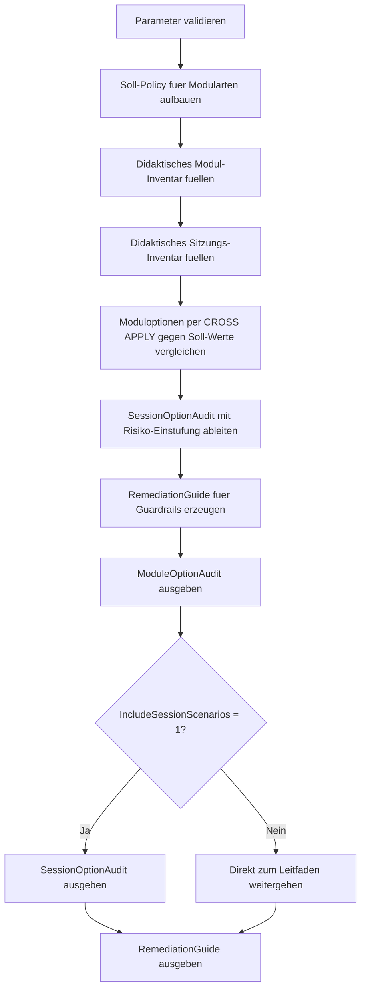

# AnsiOptionMismatchDetector.sql

Dieses Skript baut ein didaktisches Inventar fuer Module und Sitzungen mit unterschiedlichen ANSI-Optionen auf. Anschliessend vergleicht es beobachtete Optionen gegen eine einfache Soll-Policy, um typische Mismatches fuer Reviews, Deployments und Fehlersuche sichtbar zu machen.

## Uebersicht

<!-- SQLDOC:SUMMARY_TABLE:BEGIN -->
| Feld | Wert |
|---|---|
| Script | [AnsiOptionMismatchDetector.sql](AnsiOptionMismatchDetector.sql) |
| Version | `1.0` |
| Typ | `didactic-lab` |
| Kapitel | `17_ANSI_NULL & Co` |
| Sicherheit | `read-only-tempdb` |
| Zweck | Sucht in didaktischen Modul- und Sitzungsinventaren nach problematischen oder inkonsistenten ANSI-Optionen. |
<!-- SQLDOC:SUMMARY_TABLE:END -->

## Einordnung

Im Kapitel zu `ANSI_NULL` und verwandten SET-Optionen ist nicht nur die einzelne Option relevant, sondern auch ihre Kombination mit `QUOTED_IDENTIFIER`, `ANSI_WARNINGS` und `ARITHABORT`. Das Skript bildet diesen Review-Fokus mit nachvollziehbaren Demo-Datensaetzen ab, ohne produktive Metadaten oder laufende Sitzungen vorauszusetzen.

## Annahmen

- Es handelt sich um eine didaktische Erstversion ohne produktive DMV-Abfragen oder Eingriffe in reale Module.
- Die Soll-Policy fuer Views, Procedures und Funktionen ist bewusst konservativ auf eine konsistente ON-Kombination ausgerichtet.
- Sitzungen werden als typische Tool- und Einsatzszenarien modelliert, damit Unterschiede zwischen Deployment-, Support- und Lernkontext sichtbar werden.

## Anwendungsfall

Das Skript eignet sich fuer Unterricht, Code-Reviews und Teamabsprachen rund um stabile SET-Optionen. Es zeigt, wie sich Moduldefinition und Laufzeitkontext getrennt betrachten lassen und welche Guardrails fuer reproduzierbare Deployments sinnvoll sind.

## Parameter

<!-- SQLDOC:PARAMETERS_TABLE:BEGIN -->
| Parameter | SQL-Typ | Pflicht | Beschreibung |
|---|---|---|---|
| `@FlagOnlyMismatches` | `BIT` | Nein | Zeigt bei `1` nur Abweichungen und auffaellige Kombinationen. |
| `@IncludeSessionScenarios` | `BIT` | Nein | Gibt bei `1` zusaetzlich das Sitzungs-Audit aus. |
<!-- SQLDOC:PARAMETERS_TABLE:END -->

## Abhaengigkeiten

<!-- SQLDOC:DEPENDENCIES_LIST:BEGIN -->
- `tempdb` fuer temporaere Tabellen
- `VALUES`
- `CASE`
- `CROSS APPLY`
- `ORDER BY`
<!-- SQLDOC:DEPENDENCIES_LIST:END -->

## Hinweise

- `ModuleOptionAudit` vergleicht pro Modul und Option den beobachteten Zustand mit einer didaktischen Soll-Policy.
- `SessionOptionAudit` zeigt den Laufzeitkontext typischer Clients und markiert riskante Kombinationen separat.
- Der Leitfaden am Ende uebersetzt die gefundenen Mismatches direkt in Review- und Deployment-Guardrails.

## Versionshistorie

<!-- SQLDOC:VERSION_HISTORY_TABLE:BEGIN -->
| Version | Datum | User | Beschreibung |
|---|---|---|---|
| `1.0` | `2026-04-19` | `ER` | Erstversion des didaktischen ANSI-Options-Audits fuer Module und Sitzungen |
<!-- SQLDOC:VERSION_HISTORY_TABLE:END -->

## Ablauf

<!-- SQLDOC:MERMAID:BEGIN -->

<!-- SQLDOC:MERMAID:END -->

## SQL-Code

<!-- SQLDOC:SQL_CODE:BEGIN -->
```sql
/*
BEGIN:SQL-HEADER v1
---
sql_header: v1
script_name: "AnsiOptionMismatchDetector.sql"
script_version: "1.0"
script_type: "didactic-lab"
chapter: "17_ANSI_NULL & Co"

purpose: >
  Baut ein didaktisches Inventar fuer Module und Sitzungen mit
  ANSI-Optionen auf und markiert Kombinationen, die fuer Deployments,
  Vergleiche oder Laufzeitverhalten problematisch sein koennen.

parameters:
  - name: "@FlagOnlyMismatches"
    sql_type: "BIT"
    direction: "IN"
    required: false
    description: "1 = nur Abweichungen und auffaellige Kombinationen ausgeben"
  - name: "@IncludeSessionScenarios"
    sql_type: "BIT"
    direction: "IN"
    required: false
    description: "1 = zusaetzlich ein didaktisches Sitzungs-Audit ausgeben"

result_sets:
  - name: "ModuleOptionAudit"
    description: "Vergleicht beobachtete Moduloptionen mit einer didaktischen Soll-Policy"
  - name: "SessionOptionAudit"
    description: "Markiert Sitzungen mit potentiell problematischen ANSI-Optionen"
  - name: "RemediationGuide"
    description: "Leitet Guardrails fuer konsistente SET-Optionen ab"

dependencies:
  - "tempdb temporary tables"
  - "VALUES"
  - "CASE"
  - "CROSS APPLY"
  - "ORDER BY"

safety:
  level: "read-only-tempdb"
  writes_data: false

documentation:
  markdown_file: "T-SQL/17_ANSI_NULL & Co/SQLScripts/AnsiOptionMismatchDetector.md"
  sync_blocks:
    - "SUMMARY_TABLE"
    - "PARAMETERS_TABLE"
    - "DEPENDENCIES_LIST"
    - "VERSION_HISTORY_TABLE"
    - "SQL_CODE"
  mermaid:
    mode: "ai-agent-from-sql"
    source: "script-body"

main_responsible:
  name: "Erhard Rainer"
  initials: "ER"

version_history:
  - version: "1.0"
    date: "2026-04-19"
    user: "ER"
    description: "Erstversion des didaktischen ANSI-Options-Audits fuer Module und Sitzungen"

notes:
  - "Die Umsetzung verwendet bewusst Demo-Inventare statt produktive DMV- oder Metadatenabfragen vorauszusetzen"
  - "ANSI_WARNINGS, ARITHABORT und QUOTED_IDENTIFIER werden als typische Review-Punkte mit ANSI_NULLS kombiniert"
---
END:SQL-HEADER v1
*/

SET NOCOUNT ON;

-- 1. Parameter vorbereiten
DECLARE @FlagOnlyMismatches BIT = 0;
DECLARE @IncludeSessionScenarios BIT = 1;

IF @FlagOnlyMismatches NOT IN (0, 1)
BEGIN
    THROW 50000, '@FlagOnlyMismatches muss 0 oder 1 sein.', 1;
END;

IF @IncludeSessionScenarios NOT IN (0, 1)
BEGIN
    THROW 50001, '@IncludeSessionScenarios muss 0 oder 1 sein.', 1;
END;

DROP TABLE IF EXISTS #ExpectedModulePolicy;
DROP TABLE IF EXISTS #ObservedModules;
DROP TABLE IF EXISTS #ObservedSessions;
DROP TABLE IF EXISTS #ModuleOptionAudit;
DROP TABLE IF EXISTS #SessionOptionAudit;
DROP TABLE IF EXISTS #RemediationGuide;

-- 2. Didaktische Soll-Policy fuer typische Modularten beschreiben
CREATE TABLE #ExpectedModulePolicy
(
    ObjectType                   VARCHAR(30)   NOT NULL PRIMARY KEY,
    ExpectedAnsiNulls            BIT           NOT NULL,
    ExpectedQuotedIdentifier     BIT           NOT NULL,
    ExpectedAnsiWarnings         BIT           NOT NULL,
    ExpectedArithAbort           BIT           NOT NULL,
    PolicyReason                 VARCHAR(220)  NOT NULL
);

INSERT INTO #ExpectedModulePolicy
(
    ObjectType,
    ExpectedAnsiNulls,
    ExpectedQuotedIdentifier,
    ExpectedAnsiWarnings,
    ExpectedArithAbort,
    PolicyReason
)
VALUES
    (
        'VIEW',
        1,
        1,
        1,
        1,
        'Views profitieren von konsistenten ANSI-Einstellungen fuer stabile Abfragen und spaetere Erweiterungen.'
    ),
    (
        'PROCEDURE',
        1,
        1,
        1,
        1,
        'Stored Procedures sollen mit denselben Guardrails deployt werden wie die uebrige Datenbanklogik.'
    ),
    (
        'FUNCTION',
        1,
        1,
        1,
        1,
        'Funktionen sind besonders sensibel gegen inkonsistente SET-Optionen und sollten streng standardisiert bleiben.'
    );

-- 3. Beobachtete Module in didaktischer Form inventarisieren
CREATE TABLE #ObservedModules
(
    ModuleName                   VARCHAR(128)  NOT NULL,
    ObjectType                   VARCHAR(30)   NOT NULL,
    UsesAnsiNulls                BIT           NOT NULL,
    UsesQuotedIdentifier         BIT           NOT NULL,
    SessionAnsiWarnings          BIT           NOT NULL,
    SessionArithAbort            BIT           NOT NULL,
    DeploymentTool               VARCHAR(50)   NOT NULL,
    RiskFocus                    VARCHAR(220)  NOT NULL
);

INSERT INTO #ObservedModules
(
    ModuleName,
    ObjectType,
    UsesAnsiNulls,
    UsesQuotedIdentifier,
    SessionAnsiWarnings,
    SessionArithAbort,
    DeploymentTool,
    RiskFocus
)
VALUES
    (
        'dbo.v_CourseAttendanceNormalized',
        'VIEW',
        1,
        1,
        1,
        1,
        'CI pipeline',
        'Baseline fuer konsistente Deployment-Einstellungen.'
    ),
    (
        'dbo.usp_LoadAttendanceSnapshot',
        'PROCEDURE',
        0,
        1,
        1,
        0,
        'Legacy SSMS tab',
        'ANSI_NULLS OFF und ARITHABORT OFF erschweren reproduzierbare Reviews.'
    ),
    (
        'dbo.ufn_AttendanceRiskBand',
        'FUNCTION',
        1,
        0,
        1,
        1,
        'Scripted migration',
        'QUOTED_IDENTIFIER OFF passt schlecht zu standardisierten Funktions-Deployments.'
    ),
    (
        'dbo.usp_RebuildTeachingCache',
        'PROCEDURE',
        1,
        1,
        0,
        1,
        'Manual hotfix',
        'ANSI_WARNINGS OFF kann Fehlersignale und Konvertierungsprobleme verdecken.'
    );

-- 4. Sitzungen mit moeglichen Options-Mismatches modellieren
CREATE TABLE #ObservedSessions
(
    SessionLabel                 VARCHAR(80)   NOT NULL,
    ClientTool                   VARCHAR(50)   NOT NULL,
    AnsiNulls                    BIT           NOT NULL,
    QuotedIdentifier             BIT           NOT NULL,
    AnsiWarnings                 BIT           NOT NULL,
    ArithAbort                   BIT           NOT NULL,
    TypicalAction                VARCHAR(120)  NOT NULL,
    ReviewNote                   VARCHAR(220)  NOT NULL
);

INSERT INTO #ObservedSessions
(
    SessionLabel,
    ClientTool,
    AnsiNulls,
    QuotedIdentifier,
    AnsiWarnings,
    ArithAbort,
    TypicalAction,
    ReviewNote
)
VALUES
    (
        'CI deployment',
        'sqlcmd in pipeline',
        1,
        1,
        1,
        1,
        'Automated release',
        'Referenz fuer reproduzierbare Standardsitzungen.'
    ),
    (
        'Ad-hoc support window',
        'Legacy app connection',
        0,
        1,
        1,
        0,
        'Hotfix execution',
        'Abweichende Session-Optionen koennen Verhalten gegenueber Standard-Modulen kippen.'
    ),
    (
        'Training lab',
        'SSMS query window',
        1,
        1,
        0,
        1,
        'Interactive exploration',
        'Fehlende ANSI_WARNINGS sind fuer Demos erklaerbar, sollten aber sichtbar markiert werden.'
    ),
    (
        'Migration smoke test',
        'ORM connection',
        1,
        0,
        1,
        1,
        'Schema verification',
        'QUOTED_IDENTIFIER OFF kann bei Skriptvergleich und DDL-Pruefungen stoeren.'
    );

-- 5. Modul-Audit mit Soll-Ist-Vergleich erzeugen
CREATE TABLE #ModuleOptionAudit
(
    ModuleName                   VARCHAR(128)  NOT NULL,
    ObjectType                   VARCHAR(30)   NOT NULL,
    OptionName                   VARCHAR(30)   NOT NULL,
    ExpectedValue                VARCHAR(3)    NOT NULL,
    ObservedValue                VARCHAR(3)    NOT NULL,
    AuditStatus                  VARCHAR(20)   NOT NULL,
    DeploymentTool               VARCHAR(50)   NOT NULL,
    ImpactSummary                VARCHAR(220)  NOT NULL
);

INSERT INTO #ModuleOptionAudit
(
    ModuleName,
    ObjectType,
    OptionName,
    ExpectedValue,
    ObservedValue,
    AuditStatus,
    DeploymentTool,
    ImpactSummary
)
SELECT
    m.ModuleName,
    m.ObjectType,
    v.OptionName,
    ExpectedValue = CASE v.ExpectedBit WHEN 1 THEN 'ON' ELSE 'OFF' END,
    ObservedValue = CASE v.ObservedBit WHEN 1 THEN 'ON' ELSE 'OFF' END,
    AuditStatus =
        CASE
            WHEN v.ExpectedBit = v.ObservedBit THEN 'ok'
            ELSE 'mismatch'
        END,
    m.DeploymentTool,
    ImpactSummary =
        CASE
            WHEN v.ExpectedBit = v.ObservedBit THEN 'Option entspricht der didaktischen Soll-Policy.'
            WHEN v.OptionName = 'ANSI_NULLS' THEN 'Ungleiche NULL-Semantik kann Vergleiche und Objektverhalten unklar machen.'
            WHEN v.OptionName = 'QUOTED_IDENTIFIER' THEN 'Abweichende Identifier-Regeln erschweren konsistente DDL-Deployments.'
            WHEN v.OptionName = 'ANSI_WARNINGS' THEN 'Warnungen und Konvertierungshinweise werden nicht konsistent signalisiert.'
            ELSE 'Unterschiedliche ARITHABORT-Einstellungen koennen Verhalten und Performance-Diagnosen verfremden.'
        END
FROM #ObservedModules AS m
INNER JOIN #ExpectedModulePolicy AS p
    ON p.ObjectType = m.ObjectType
CROSS APPLY
(
    VALUES
        ('ANSI_NULLS', p.ExpectedAnsiNulls, m.UsesAnsiNulls),
        ('QUOTED_IDENTIFIER', p.ExpectedQuotedIdentifier, m.UsesQuotedIdentifier),
        ('ANSI_WARNINGS', p.ExpectedAnsiWarnings, m.SessionAnsiWarnings),
        ('ARITHABORT', p.ExpectedArithAbort, m.SessionArithAbort)
) AS v(OptionName, ExpectedBit, ObservedBit)
WHERE @FlagOnlyMismatches = 0
   OR v.ExpectedBit <> v.ObservedBit;

-- 6. Sitzungs-Audit fuer Laufzeitkontext ableiten
CREATE TABLE #SessionOptionAudit
(
    SessionLabel                 VARCHAR(80)   NOT NULL,
    ClientTool                   VARCHAR(50)   NOT NULL,
    OptionProfile                VARCHAR(80)   NOT NULL,
    RiskLevel                    VARCHAR(20)   NOT NULL,
    WhyFlagged                   VARCHAR(220)  NOT NULL,
    TypicalAction                VARCHAR(120)  NOT NULL
);

INSERT INTO #SessionOptionAudit
(
    SessionLabel,
    ClientTool,
    OptionProfile,
    RiskLevel,
    WhyFlagged,
    TypicalAction
)
SELECT
    s.SessionLabel,
    s.ClientTool,
    OptionProfile =
        CONCAT(
            'ANSI_NULLS=', CASE s.AnsiNulls WHEN 1 THEN 'ON' ELSE 'OFF' END,
            ', QUOTED_IDENTIFIER=', CASE s.QuotedIdentifier WHEN 1 THEN 'ON' ELSE 'OFF' END,
            ', ANSI_WARNINGS=', CASE s.AnsiWarnings WHEN 1 THEN 'ON' ELSE 'OFF' END,
            ', ARITHABORT=', CASE s.ArithAbort WHEN 1 THEN 'ON' ELSE 'OFF' END
        ),
    RiskLevel =
        CASE
            WHEN s.AnsiNulls = 0 OR s.QuotedIdentifier = 0 THEN 'high'
            WHEN s.AnsiWarnings = 0 OR s.ArithAbort = 0 THEN 'medium'
            ELSE 'low'
        END,
    WhyFlagged =
        CASE
            WHEN s.AnsiNulls = 0 THEN 'ANSI_NULLS OFF kann zu inkonsistenten Vergleichsregeln gegenueber Standard-Modulen fuehren.'
            WHEN s.QuotedIdentifier = 0 THEN 'QUOTED_IDENTIFIER OFF weicht von typischen DDL- und Review-Erwartungen ab.'
            WHEN s.AnsiWarnings = 0 THEN 'ANSI_WARNINGS OFF blendet Hinweise aus, die in Debugging und Schulung wichtig sind.'
            WHEN s.ArithAbort = 0 THEN 'ARITHABORT OFF sollte gegen Deployment- und Troubleshooting-Standards abgeglichen werden.'
            ELSE 'Die Sitzung entspricht der Referenzkombination und dient als Vergleichsbasis.'
        END,
    s.TypicalAction
FROM #ObservedSessions AS s
WHERE @FlagOnlyMismatches = 0
   OR s.AnsiNulls = 0
   OR s.QuotedIdentifier = 0
   OR s.AnsiWarnings = 0
   OR s.ArithAbort = 0;

-- 7. Guardrails fuer Review und Remediation formulieren
CREATE TABLE #RemediationGuide
(
    StepNo                       TINYINT       NOT NULL,
    FocusArea                    VARCHAR(40)   NOT NULL,
    Recommendation               VARCHAR(220)  NOT NULL,
    WhyItHelps                   VARCHAR(220)  NOT NULL
);

INSERT INTO #RemediationGuide
(
    StepNo,
    FocusArea,
    Recommendation,
    WhyItHelps
)
VALUES
    (
        1,
        'Deployment scripts',
        'SET ANSI_NULLS ON und SET QUOTED_IDENTIFIER ON in objektnahe Skripte konsistent aufnehmen.',
        'Damit wird die Moduldefinition nicht vom aktuellen Query-Fenster oder Tool abhaengig.'
    ),
    (
        2,
        'Session baseline',
        'Deployment-, Smoke-Test- und Support-Sitzungen gegen eine dokumentierte Referenzkombination pruefen.',
        'Gleiche SET-Optionen erleichtern reproduzierbare Fehleranalysen.'
    ),
    (
        3,
        'Review workflow',
        'Mismatches fuer ANSI_WARNINGS und ARITHABORT im Review explizit markieren statt still zu tolerieren.',
        'So bleiben Warnungs- und Fehlerverhalten zwischen Teams nachvollziehbar.'
    ),
    (
        4,
        'Teaching labs',
        'Abweichende Session-Szenarien nur als bewusst markierte Demo oder Gegenbeispiel einsetzen.',
        'Lernende erkennen dadurch den Unterschied zwischen Standardfall und Ausnahme.'
    );

-- 8. Ergebnisse ausgeben
SELECT
    ModuleName,
    ObjectType,
    OptionName,
    ExpectedValue,
    ObservedValue,
    AuditStatus,
    DeploymentTool,
    ImpactSummary
FROM #ModuleOptionAudit
ORDER BY
    ModuleName,
    OptionName;

IF @IncludeSessionScenarios = 1
BEGIN
    SELECT
        SessionLabel,
        ClientTool,
        OptionProfile,
        RiskLevel,
        WhyFlagged,
        TypicalAction
    FROM #SessionOptionAudit
    ORDER BY
        CASE RiskLevel
            WHEN 'high' THEN 1
            WHEN 'medium' THEN 2
            ELSE 3
        END,
        SessionLabel;
END;

SELECT
    StepNo,
    FocusArea,
    Recommendation,
    WhyItHelps
FROM #RemediationGuide
ORDER BY
    StepNo;
```
<!-- SQLDOC:SQL_CODE:END -->
