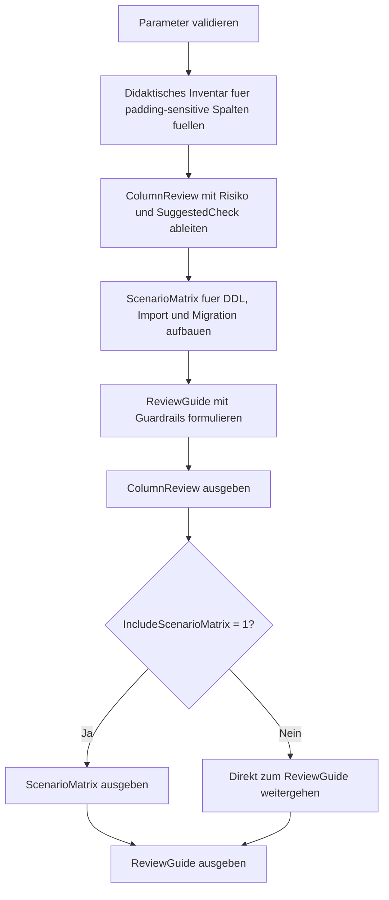

# AnsiPaddingColumnReview.sql

Dieses Skript baut ein didaktisches Review fuer Spalten auf, bei denen `ANSI_PADDING` und verwandte Padding-Fragen fuer Design, Migration oder Vergleiche relevant sein koennen. Statt produktive Metadaten vorauszusetzen, arbeitet die SQL-Datei mit einem nachvollziehbaren Inventar aus typischen Spalten- und Szenarioarten.

## Uebersicht

<!-- SQLDOC:SUMMARY_TABLE:BEGIN -->
| Feld | Wert |
|---|---|
| Script | [AnsiPaddingColumnReview.sql](AnsiPaddingColumnReview.sql) |
| Version | `1.0` |
| Typ | `didactic-lab` |
| Kapitel | `17_ANSI_NULL & Co` |
| Sicherheit | `read-only-tempdb` |
| Zweck | Reviewt padding-sensitive Spalten und typische DDL- oder Migrationsszenarien rund um ANSI_PADDING. |
<!-- SQLDOC:SUMMARY_TABLE:END -->

## Einordnung

`ANSI_PADDING` ist selten nur eine abstrakte SET-Option. In der Praxis haengt daran, wie variable und fixlaengige Zeichen- oder Binary-Spalten im Review wahrgenommen werden, welche Importpfade auffallen und wo trailing blanks oder byte-genaue Unterschiede spaeter zu Ueberraschungen fuehren.

## Annahmen

- Es handelt sich um eine didaktische Erstversion ohne produktive Katalogabfragen oder Schemaaenderungen.
- Das Spalteninventar modelliert typische Faelle wie Importschluessel, UI-Texte, fixlaengige Legacy-Codes und Binary-Signaturen.
- Der Fokus liegt auf Review- und Design-Fragen, nicht auf einer produktiven Rekonstruktion historischer `ANSI_PADDING`-Metadaten.

## Anwendungsfall

Das Skript eignet sich fuer Unterricht, Team-Reviews und Migrationsvorbereitung. Es hilft dabei, padding-sensitive Spalten frueh zu markieren und daraus konkrete Guardrails fuer Importstrecken, Typwechsel und Vergleichslogik abzuleiten.

## Parameter

<!-- SQLDOC:PARAMETERS_TABLE:BEGIN -->
| Parameter | SQL-Typ | Pflicht | Beschreibung |
|---|---|---|---|
| `@FlagOnlyHighRisk` | `BIT` | Nein | Zeigt bei `1` nur hoch priorisierte Review-Kandidaten. |
| `@IncludeScenarioMatrix` | `BIT` | Nein | Gibt bei `1` zusaetzlich didaktische DDL- und Vergleichsszenarien aus. |
<!-- SQLDOC:PARAMETERS_TABLE:END -->

## Abhaengigkeiten

<!-- SQLDOC:DEPENDENCIES_LIST:BEGIN -->
- `tempdb` fuer temporaere Tabellen
- `VALUES`
- `CASE`
- `ORDER BY`
<!-- SQLDOC:DEPENDENCIES_LIST:END -->

## Hinweise

- `ColumnReview` priorisiert variable Zeichen- und Binary-Spalten, bei denen trailing blanks oder byte-genaue Vergleiche schnell relevant werden.
- `ScenarioMatrix` uebersetzt die Spaltentypen in typische Review-Kontexte wie Import, Migration, UI-Bereinigung und Legacy-Integration.
- Der Leitfaden am Ende komprimiert die wichtigsten Guardrails fuer Design, Datentransfer und Code-Review.

## Versionshistorie

<!-- SQLDOC:VERSION_HISTORY_TABLE:BEGIN -->
| Version | Datum | User | Beschreibung |
|---|---|---|---|
| `1.0` | `2026-04-19` | `ER` | Erstversion des didaktischen ANSI_PADDING-Spaltenreviews |
<!-- SQLDOC:VERSION_HISTORY_TABLE:END -->

## Ablauf

<!-- SQLDOC:MERMAID:BEGIN -->

<!-- SQLDOC:MERMAID:END -->

## SQL-Code

<!-- SQLDOC:SQL_CODE:BEGIN -->
```sql
/*
BEGIN:SQL-HEADER v1
---
sql_header: v1
script_name: "AnsiPaddingColumnReview.sql"
script_version: "1.0"
script_type: "didactic-lab"
chapter: "17_ANSI_NULL & Co"

purpose: >
  Baut ein didaktisches Review fuer Spalten und DDL-Szenarien auf, bei
  denen ANSI_PADDING relevante Auswirkungen auf Speicherverhalten,
  Vergleichbarkeit und Schema-Konsistenz haben kann.

parameters:
  - name: "@FlagOnlyHighRisk"
    sql_type: "BIT"
    direction: "IN"
    required: false
    description: "1 = nur hoch priorisierte Review-Kandidaten ausgeben"
  - name: "@IncludeScenarioMatrix"
    sql_type: "BIT"
    direction: "IN"
    required: false
    description: "1 = zusaetzlich didaktische DDL- und Vergleichsszenarien ausgeben"

result_sets:
  - name: "ColumnReview"
    description: "Markiert didaktische Spaltenkandidaten mit ANSI_PADDING-Relevanz, Risiko und Review-Hinweis"
  - name: "ScenarioMatrix"
    description: "Zeigt typische DDL-, Insert- und Vergleichsszenarien rund um ANSI_PADDING"
  - name: "ReviewGuide"
    description: "Leitet Guardrails fuer Design, Migration und Code-Review ab"

dependencies:
  - "tempdb temporary tables"
  - "VALUES"
  - "CASE"
  - "ORDER BY"

safety:
  level: "read-only-tempdb"
  writes_data: false

documentation:
  markdown_file: "T-SQL/17_ANSI_NULL & Co/SQLScripts/AnsiPaddingColumnReview.md"
  sync_blocks:
    - "SUMMARY_TABLE"
    - "PARAMETERS_TABLE"
    - "DEPENDENCIES_LIST"
    - "VERSION_HISTORY_TABLE"
    - "SQL_CODE"
  mermaid:
    mode: "ai-agent-from-sql"
    source: "script-body"

main_responsible:
  name: "Erhard Rainer"
  initials: "ER"

version_history:
  - version: "1.0"
    date: "2026-04-19"
    user: "ER"
    description: "Erstversion des didaktischen ANSI_PADDING-Spaltenreviews"

notes:
  - "Die Umsetzung verwendet ein didaktisches Spalteninventar statt produktive Katalogabfragen vorauszusetzen"
  - "Variable Zeichen- und Binary-Typen werden als typische Review-Punkte fuer Trailing-Blanks und Storage-Verhalten hervorgehoben"
---
END:SQL-HEADER v1
*/

SET NOCOUNT ON;

-- 1. Parameter vorbereiten
DECLARE @FlagOnlyHighRisk BIT = 0;
DECLARE @IncludeScenarioMatrix BIT = 1;

IF @FlagOnlyHighRisk NOT IN (0, 1)
BEGIN
    THROW 50000, '@FlagOnlyHighRisk muss 0 oder 1 sein.', 1;
END;

IF @IncludeScenarioMatrix NOT IN (0, 1)
BEGIN
    THROW 50001, '@IncludeScenarioMatrix muss 0 oder 1 sein.', 1;
END;

DROP TABLE IF EXISTS #ObservedColumns;
DROP TABLE IF EXISTS #ColumnReview;
DROP TABLE IF EXISTS #ScenarioMatrix;
DROP TABLE IF EXISTS #ReviewGuide;

-- 2. Didaktisches Inventar fuer ANSI_PADDING-sensitive Spalten aufbauen
CREATE TABLE #ObservedColumns
(
    ColumnName                 VARCHAR(128)  NOT NULL,
    TableName                  VARCHAR(128)  NOT NULL,
    DataType                   VARCHAR(30)   NOT NULL,
    MaxLength                  SMALLINT      NOT NULL,
    Nullability                VARCHAR(10)   NOT NULL,
    TypicalContent             VARCHAR(120)  NOT NULL,
    TrailingBlankSensitivity   VARCHAR(20)   NOT NULL,
    StoragePattern             VARCHAR(40)   NOT NULL,
    ReviewContext              VARCHAR(220)  NOT NULL
);

INSERT INTO #ObservedColumns
(
    ColumnName,
    TableName,
    DataType,
    MaxLength,
    Nullability,
    TypicalContent,
    TrailingBlankSensitivity,
    StoragePattern,
    ReviewContext
)
VALUES
    (
        'CustomerCode',
        'dbo.CustomerImportStage',
        'VARCHAR',
        20,
        'NOT NULL',
        'Schluessel aus Flatfile-Importen',
        'high',
        'trim-sensitive',
        'Importdaten enthalten haeufig nachlaufende Leerzeichen und muessen vor Vergleich oder Persistierung bewusst bewertet werden.'
    ),
    (
        'DisplayName',
        'dbo.CourseCatalog',
        'NVARCHAR',
        120,
        'NULL',
        'Freitext fuer Anzeige und Suche',
        'medium',
        'ui-text',
        'Anzeige- und Suchfelder vertragen meist keine uneinheitlichen Padding-Annahmen zwischen Import und UI.'
    ),
    (
        'LegacyFixedCode',
        'dbo.LegacyContractMirror',
        'CHAR',
        12,
        'NOT NULL',
        'Historisch fixlaengiger Fremdcode',
        'high',
        'fixed-width',
        'Fixlaengige Codes sind fachlich stabil, muessen aber bei Join- und Vergleichslogik bewusst von variablen Typen getrennt betrachtet werden.'
    ),
    (
        'AttachmentHash',
        'dbo.DocumentDigest',
        'VARBINARY',
        64,
        'NOT NULL',
        'Hash- oder Signaturwerte',
        'high',
        'binary-exact',
        'Binary-Spalten sollten als byte-genaue Werte behandelt werden; unklare Padding-Annahmen sind hier besonders kritisch.'
    ),
    (
        'OptionalComment',
        'dbo.CourseReview',
        'VARCHAR',
        500,
        'NULL',
        'Freitext mit moeglichen Leerzeichen am Ende',
        'medium',
        'free-text',
        'Freitextfelder sind oft unkritischer fuer Business-Schluessel, koennen aber bei Bereinigung und Exporten fuer Ueberraschungen sorgen.'
    );

-- 3. Review-Bewertung fuer die Spaltenkandidaten ableiten
CREATE TABLE #ColumnReview
(
    TableName                  VARCHAR(128)  NOT NULL,
    ColumnName                 VARCHAR(128)  NOT NULL,
    DataType                   VARCHAR(30)   NOT NULL,
    ReviewStatus               VARCHAR(20)   NOT NULL,
    RiskLevel                  VARCHAR(20)   NOT NULL,
    WhyRelevant                VARCHAR(220)  NOT NULL,
    SuggestedCheck             VARCHAR(220)  NOT NULL
);

INSERT INTO #ColumnReview
(
    TableName,
    ColumnName,
    DataType,
    ReviewStatus,
    RiskLevel,
    WhyRelevant,
    SuggestedCheck
)
SELECT
    oc.TableName,
    oc.ColumnName,
    oc.DataType,
    ReviewStatus =
        CASE
            WHEN oc.DataType IN ('VARCHAR', 'VARBINARY', 'CHAR') THEN 'review-first'
            ELSE 'review'
        END,
    RiskLevel =
        CASE
            WHEN oc.TrailingBlankSensitivity = 'high'
             AND oc.DataType IN ('VARCHAR', 'VARBINARY', 'CHAR') THEN 'high'
            WHEN oc.TrailingBlankSensitivity = 'medium' THEN 'medium'
            ELSE 'low'
        END,
    WhyRelevant =
        CASE
            WHEN oc.DataType = 'VARBINARY' THEN 'Binary-Spalten brauchen byte-genaue Erwartungen; ANSI_PADDING-nahe Migrationen duerfen keine stillen Formatannahmen verstecken.'
            WHEN oc.DataType = 'CHAR' THEN 'Fixlaengige Typen machen Padding sichtbar und sollten getrennt von variablen Import- oder UI-Feldern reviewt werden.'
            WHEN oc.StoragePattern = 'trim-sensitive' THEN 'Variable Zeichentypen aus Importen koennen bei Trailing-Blanks, Join-Logik und Normalisierung besonders auffallen.'
            ELSE 'Der Spaltentyp sollte gegen Such-, Vergleichs- und Bereinigungslogik explizit bewertet werden.'
        END,
    SuggestedCheck =
        CASE
            WHEN oc.DataType IN ('VARCHAR', 'NVARCHAR') THEN 'Vergleiche Importpfade, Trim-Regeln und Downstream-Joins auf konsistente Behandlung nachlaufender Leerzeichen.'
            WHEN oc.DataType = 'VARBINARY' THEN 'Pruefe, ob Hash- oder Signaturspalten in Migrationen und Exports byte-identisch behandelt werden.'
            ELSE 'Dokumentiere bewusst, warum der Typ fixlaengig bleibt und wie Vergleichslogik mit Padding umgeht.'
        END
FROM #ObservedColumns AS oc
WHERE @FlagOnlyHighRisk = 0
   OR (
        oc.TrailingBlankSensitivity = 'high'
        AND oc.DataType IN ('VARCHAR', 'VARBINARY', 'CHAR')
      );

-- 4. DDL- und Vergleichsszenarien fuer ANSI_PADDING zusammenstellen
CREATE TABLE #ScenarioMatrix
(
    ScenarioStep               TINYINT       NOT NULL,
    ScenarioName               VARCHAR(100)  NOT NULL,
    FocusArea                  VARCHAR(50)   NOT NULL,
    ExamplePattern             VARCHAR(220)  NOT NULL,
    PotentialImpact            VARCHAR(220)  NOT NULL,
    ReviewHint                 VARCHAR(220)  NOT NULL
);

INSERT INTO #ScenarioMatrix
(
    ScenarioStep,
    ScenarioName,
    FocusArea,
    ExamplePattern,
    PotentialImpact,
    ReviewHint
)
VALUES
    (
        1,
        'Legacy import with VARCHAR keys',
        'DDL and import',
        'Stage-Tabellen laden Codes mit nachlaufenden Leerzeichen in VARCHAR-Spalten.',
        'Spaetere Vergleiche, DISTINCT-Auswertungen und Bereinigungen koennen schwer nachvollziehbare Unterschiede zeigen.',
        'Importstrecke und Bereinigungsregeln zusammen reviewen und Trim-Entscheidungen nicht implizit lassen.'
    ),
    (
        2,
        'Fixed-width integration code',
        'Schema design',
        'CHAR-Spalten werden fuer externe Dateiformate oder Alt-Systeme bewusst fixlaengig gehalten.',
        'Padding gehoert hier oft zum technischen Vertrag, darf aber nicht unbemerkt in variable Zielspalten auslaufen.',
        'Join- und Mapping-Regeln zwischen CHAR und VARCHAR explizit dokumentieren.'
    ),
    (
        3,
        'Binary signature migration',
        'Migration',
        'VARBINARY-Werte werden zwischen Staging, Export und Zielsystem uebertragen.',
        'Schon kleine Formatannahmen koennen Hash-Pruefungen oder Signaturvergleiche kippen.',
        'Byte-genaue Vergleichsregeln und Exportformate frueh verifizieren.'
    ),
    (
        4,
        'UI text cleanup',
        'Application behavior',
        'Freitextfelder werden fuer Anzeige, Suche und Export nachbearbeitet.',
        'Nachlaufende Leerzeichen sind fachlich selten kritisch, erzeugen aber inkonsistente Such- und Exportbilder.',
        'Klare Regeln fuer Bereinigung vor Anzeige oder Persistierung definieren.'
    );

-- 5. Guardrails fuer Review und Design ableiten
CREATE TABLE #ReviewGuide
(
    StepNo                     TINYINT       NOT NULL,
    FocusArea                  VARCHAR(40)   NOT NULL,
    Recommendation             VARCHAR(220)  NOT NULL,
    WhyItHelps                 VARCHAR(220)  NOT NULL
);

INSERT INTO #ReviewGuide
(
    StepNo,
    FocusArea,
    Recommendation,
    WhyItHelps
)
VALUES
    (
        1,
        'Column design',
        'Variable und fixlaengige Zeichen- oder Binary-Spalten im Review getrennt betrachten.',
        'So wird sichtbar, ob Padding Teil des fachlichen Vertrags oder nur technisches Beiwerk ist.'
    ),
    (
        2,
        'Import and cleanup',
        'Trim-, Normalisierungs- und Vergleichsregeln an der Systemgrenze explizit festhalten.',
        'Dadurch entstehen weniger implizite Unterschiede zwischen Stage, Core und Export.'
    ),
    (
        3,
        'Migration scripts',
        'ANSI_PADDING-nahe DDL und Datentypwechsel immer zusammen mit Beispielwerten reviewen.',
        'Beispielwerte machen Trailing-Blanks und byte-genaue Unterschiede schneller nachvollziehbar.'
    ),
    (
        4,
        'Code review',
        'Joins, DISTINCTs und Hash-Vergleiche fuer padding-sensitive Spalten gesondert markieren.',
        'Diese Stellen reagieren besonders empfindlich auf uneinheitliche Normalisierung.'
    );

-- 6. Ergebnisse ausgeben
SELECT
    cr.TableName,
    cr.ColumnName,
    cr.DataType,
    cr.ReviewStatus,
    cr.RiskLevel,
    cr.WhyRelevant,
    cr.SuggestedCheck
FROM #ColumnReview AS cr
ORDER BY
    CASE cr.RiskLevel
        WHEN 'high' THEN 1
        WHEN 'medium' THEN 2
        ELSE 3
    END,
    cr.TableName,
    cr.ColumnName;

IF @IncludeScenarioMatrix = 1
BEGIN
    SELECT
        sm.ScenarioStep,
        sm.ScenarioName,
        sm.FocusArea,
        sm.ExamplePattern,
        sm.PotentialImpact,
        sm.ReviewHint
    FROM #ScenarioMatrix AS sm
    ORDER BY
        sm.ScenarioStep;
END;

SELECT
    rg.StepNo,
    rg.FocusArea,
    rg.Recommendation,
    rg.WhyItHelps
FROM #ReviewGuide AS rg
ORDER BY
    rg.StepNo;
```
<!-- SQLDOC:SQL_CODE:END -->
