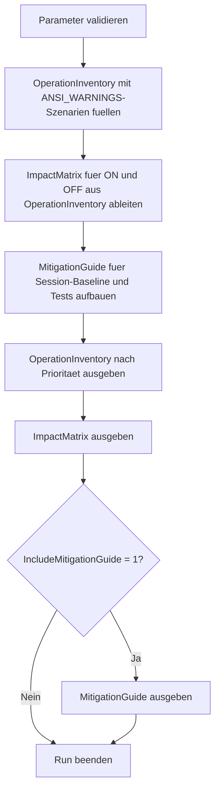

# AnsiWarningsImpactDemo.sql

Dieses Skript sammelt typische Operationen, bei denen `ANSI_WARNINGS` fuer Warnhinweise, Fehlersignale und Team-Standards relevant ist. Statt produktive Tabellen oder laufende Sessions vorauszusetzen, arbeitet die Erstversion mit didaktischen Szenarien und einer Impact-Matrix fuer Reviews, Troubleshooting und Unterricht.

## Uebersicht

<!-- SQLDOC:SUMMARY_TABLE:BEGIN -->
| Feld | Wert |
|---|---|
| Script | [AnsiWarningsImpactDemo.sql](AnsiWarningsImpactDemo.sql) |
| Version | `1.0` |
| Typ | `didactic-lab` |
| Kapitel | `17_ANSI_NULL & Co` |
| Sicherheit | `read-only-tempdb` |
| Zweck | Zeigt typische Auswirkungen von `ANSI_WARNINGS` auf Warnsichtbarkeit, Grenzfaelle und Review-Guardrails. |
<!-- SQLDOC:SUMMARY_TABLE:END -->

## Einordnung

`ANSI_WARNINGS` ist selten isoliert relevant. In der Praxis beeinflusst die Option vor allem, wie deutlich Datenqualitaets-, Konvertierungs- und Arithmetic-Grenzfaelle im Team sichtbar werden. Das Skript stellt deshalb typische Operationen zusammen und lenkt den Blick auf reproduzierbare Tests sowie auf die Kombination mit weiteren SET-Optionen.

## Annahmen

- Es handelt sich um eine didaktische Erstversion mit modellierten Szenarien statt produktiver Session-Umschaltung.
- Arithmetic-Faelle werden bewusst als Review- und Testthema zusammen mit `ARITHABORT` beschrieben.
- Der Fokus liegt auf Signalwirkung und Guardrails, nicht auf einer vollstaendigen Produktsimulation aller Engine-Varianten.

## Anwendungsfall

Das Skript eignet sich fuer Schulung, Code-Review und Diagnose-Workshops. Es hilft dabei, Warn- und Fehlerverhalten nicht nur anhand des Resultsets zu bewerten, sondern als Bestandteil von Deployment-Standards und Regressionstests zu behandeln.

## Parameter

<!-- SQLDOC:PARAMETERS_TABLE:BEGIN -->
| Parameter | SQL-Typ | Pflicht | Beschreibung |
|---|---|---|---|
| `@OnlyHighPriority` | `BIT` | Nein | Zeigt bei `1` nur Szenarien mit hoher Review-Prioritaet. |
| `@IncludeMitigationGuide` | `BIT` | Nein | Gibt bei `1` zusaetzlich den Guardrail- und Mitigation-Guide aus. |
<!-- SQLDOC:PARAMETERS_TABLE:END -->

## Abhaengigkeiten

<!-- SQLDOC:DEPENDENCIES_LIST:BEGIN -->
- `tempdb` fuer temporaere Tabellen
- `VALUES`
- `CASE`
- `ORDER BY`
<!-- SQLDOC:DEPENDENCIES_LIST:END -->

## Hinweise

- `OperationInventory` fasst typische ANSI_WARNINGS-bezogene Problemklassen fuer Unterricht und Reviews zusammen.
- `ImpactMatrix` stellt gegenueber, wie sich der Fokus bei `ANSI_WARNINGS ON` und `ANSI_WARNINGS OFF` verschiebt.
- Der Mitigation-Guide uebersetzt die Szenarien in konkrete Guardrails fuer Session-Baselines und Grenzfalltests.

## Versionshistorie

<!-- SQLDOC:VERSION_HISTORY_TABLE:BEGIN -->
| Version | Datum | User | Beschreibung |
|---|---|---|---|
| `1.0` | `2026-04-19` | `ER` | Erstversion des didaktischen ANSI_WARNINGS-Impact-Labs |
<!-- SQLDOC:VERSION_HISTORY_TABLE:END -->

## Ablauf

<!-- SQLDOC:MERMAID:BEGIN -->

<!-- SQLDOC:MERMAID:END -->

## SQL-Code

<!-- SQLDOC:SQL_CODE:BEGIN -->
```sql
/*
BEGIN:SQL-HEADER v1
---
sql_header: v1
script_name: "AnsiWarningsImpactDemo.sql"
script_version: "1.0"
script_type: "didactic-lab"
chapter: "17_ANSI_NULL & Co"

purpose: >
  Stellt typische Operationen zusammen, bei denen ANSI_WARNINGS fuer
  Fehlersignale, Warnhinweise und Review-Entscheidungen relevant ist.
  Das Skript arbeitet mit didaktischen Szenarien und leitet daraus eine
  Impact-Matrix sowie Guardrails fuer Lern- und Review-Kontexte ab.

parameters:
  - name: "@OnlyHighPriority"
    sql_type: "BIT"
    direction: "IN"
    required: false
    description: "1 = nur Szenarien mit hoher Review-Prioritaet ausgeben"
  - name: "@IncludeMitigationGuide"
    sql_type: "BIT"
    direction: "IN"
    required: false
    description: "1 = zusaetzlich einen Guardrail- und Mitigation-Guide ausgeben"

result_sets:
  - name: "OperationInventory"
    description: "Inventarisiert typische ANSI_WARNINGS-relevante Operationen"
  - name: "ImpactMatrix"
    description: "Vergleicht didaktisch den Fokus bei ANSI_WARNINGS ON und OFF"
  - name: "MitigationGuide"
    description: "Leitet Guardrails fuer Tests, Reviews und Session-Standards ab"

dependencies:
  - "tempdb temporary tables"
  - "VALUES"
  - "CASE"
  - "ORDER BY"

safety:
  level: "read-only-tempdb"
  writes_data: false

documentation:
  markdown_file: "T-SQL/17_ANSI_NULL & Co/SQLScripts/AnsiWarningsImpactDemo.md"
  sync_blocks:
    - "SUMMARY_TABLE"
    - "PARAMETERS_TABLE"
    - "DEPENDENCIES_LIST"
    - "VERSION_HISTORY_TABLE"
    - "SQL_CODE"
  mermaid:
    mode: "ai-agent-from-sql"
    source: "script-body"

main_responsible:
  name: "Erhard Rainer"
  initials: "ER"

version_history:
  - version: "1.0"
    date: "2026-04-19"
    user: "ER"
    description: "Erstversion des didaktischen ANSI_WARNINGS-Impact-Labs"

notes:
  - "Die Szenarien modellieren Review- und Diagnosefaelle statt produktive Tabellen oder echte Sitzungen vorauszusetzen"
  - "Arithmetic-Faelle werden bewusst zusammen mit dem Hinweis auf ARITHABORT und Testpflicht dokumentiert"
---
END:SQL-HEADER v1
*/

SET NOCOUNT ON;

-- 1. Parameter vorbereiten
DECLARE @OnlyHighPriority BIT = 0;
DECLARE @IncludeMitigationGuide BIT = 1;

IF @OnlyHighPriority NOT IN (0, 1)
BEGIN
    THROW 50000, '@OnlyHighPriority muss 0 oder 1 sein.', 1;
END;

IF @IncludeMitigationGuide NOT IN (0, 1)
BEGIN
    THROW 50001, '@IncludeMitigationGuide muss 0 oder 1 sein.', 1;
END;

DROP TABLE IF EXISTS #OperationInventory;
DROP TABLE IF EXISTS #ImpactMatrix;
DROP TABLE IF EXISTS #MitigationGuide;

-- 2. Typische ANSI_WARNINGS-Szenarien inventarisieren
CREATE TABLE #OperationInventory
(
    ScenarioStep                 TINYINT       NOT NULL,
    OperationGroup               VARCHAR(40)   NOT NULL,
    ExampleOperation             VARCHAR(220)  NOT NULL,
    ReviewPriority               VARCHAR(20)   NOT NULL,
    WhyRelevant                  VARCHAR(220)  NOT NULL,
    MainRisk                     VARCHAR(220)  NOT NULL
);

INSERT INTO #OperationInventory
(
    ScenarioStep,
    OperationGroup,
    ExampleOperation,
    ReviewPriority,
    WhyRelevant,
    MainRisk
)
VALUES
    (
        1,
        'Aggregates with NULL',
        'AVG(BonusPoints) ueber Datensaetze mit NULL-Werten',
        'medium',
        'ANSI_WARNINGS ist ein typischer Einstieg, um sichtbare Warnhinweise bei NULL-Eliminierung zu besprechen.',
        'Analysen wirken ruhiger als beabsichtigt, wenn Warnsignale im Team oder in Lernumgebungen fehlen.'
    ),
    (
        2,
        'String reduction',
        'INSERT in schmalere VARCHAR-Spalte oder explizite Konvertierung',
        'high',
        'Warnungen oder Fehler rund um kuerzere Zieltypen gehoeren in Reviews und Migrationstests explizit auf die Checkliste.',
        'Datenverlust oder unklare Testaussagen werden zu spaet erkannt, wenn Session-Einstellungen nicht mitgedacht werden.'
    ),
    (
        3,
        'Arithmetic edge case',
        'Division mit moeglichem Null-Divisor oder enger Numerik',
        'high',
        'Arithmetic-Szenarien sollten immer zusammen mit ARITHABORT und reproduzierbaren Testbedingungen betrachtet werden.',
        'Fehlerverhalten und Diagnosepfade werden missverstanden, wenn SET-Kombinationen zwischen Tools variieren.'
    ),
    (
        4,
        'Data quality staging',
        'CAST oder CONVERT von Freitext in numerische Zielspalten',
        'high',
        'ETL- und Staging-Strecken profitieren von klaren Warn- und Abbruchsignalen fuer problematische Eingaben.',
        'Problemwerte laufen sonst als scheinbar normale Daten weiter und erschweren spaetere Ursachenanalyse.'
    ),
    (
        5,
        'Teaching exploration',
        'Vergleich eines Query-Fensters mit Demo-Daten unter verschiedenen SET-Kombinationen',
        'medium',
        'Das Thema eignet sich gut, um Unterschiede zwischen still tolerierten und sichtbar markierten Problemen zu diskutieren.',
        'Lernende uebertragen sonst lokale Query-Fenster-Effekte ungeprueft auf Deployments und Jobs.'
    );

-- 3. Impact-Matrix fuer ANSI_WARNINGS ON und OFF ableiten
CREATE TABLE #ImpactMatrix
(
    ScenarioStep                 TINYINT       NOT NULL,
    OperationGroup               VARCHAR(40)   NOT NULL,
    FocusWhenOn                  VARCHAR(220)  NOT NULL,
    FocusWhenOff                 VARCHAR(220)  NOT NULL,
    ReviewAngle                  VARCHAR(220)  NOT NULL,
    RecommendedAction            VARCHAR(220)  NOT NULL
);

INSERT INTO #ImpactMatrix
(
    ScenarioStep,
    OperationGroup,
    FocusWhenOn,
    FocusWhenOff,
    ReviewAngle,
    RecommendedAction
)
SELECT
    oi.ScenarioStep,
    oi.OperationGroup,
    FocusWhenOn =
        CASE oi.OperationGroup
            WHEN 'Aggregates with NULL' THEN 'Warnhinweise zu eliminierter NULL-Teilnahme bleiben in der Analyse sichtbar.'
            WHEN 'String reduction' THEN 'Reduktions- und Konvertierungsprobleme werden frueher als Test- oder Review-Thema sichtbar.'
            WHEN 'Arithmetic edge case' THEN 'Arithmetic-Probleme werden strenger bewertet und muessen mit SET-Kombinationen reproduzierbar getestet werden.'
            WHEN 'Data quality staging' THEN 'Konvertierungsprobleme lassen sich frueher als Datenqualitaetsrisiko markieren.'
            ELSE 'Lernende sehen klarer, an welchen Stellen die Session aktiv Signale liefert.'
        END,
    FocusWhenOff =
        CASE oi.OperationGroup
            WHEN 'Aggregates with NULL' THEN 'Die Query wirkt ruhiger, obwohl fachlich weiterhin NULL-Werte aus Aggregaten herausfallen.'
            WHEN 'String reduction' THEN 'Reviews muessen staerker pruefen, ob stillere Sessions problematische Datenpfade verdecken.'
            WHEN 'Arithmetic edge case' THEN 'Ohne explizite Teststrategie werden Unterschiede zwischen Tools und Folgeschritten leichter uebersehen.'
            WHEN 'Data quality staging' THEN 'Bereinigungs- und Fehlerpfade muessen ausserhalb der Session-Option deutlicher dokumentiert werden.'
            ELSE 'Didaktische Demos brauchen eine klare Kennzeichnung, damit OFF nicht als allgemeiner Standard missverstanden wird.'
        END,
    ReviewAngle =
        CASE
            WHEN oi.ReviewPriority = 'high' THEN 'Vor produktiver Nutzung Session-Standard, Testfaelle und erwartete Fehlersignale gemeinsam reviewen.'
            ELSE 'Als Schulungs- und Diagnosebeispiel die Unterschiede zwischen Sichtbarkeit und stiller Toleranz markieren.'
        END,
    RecommendedAction =
        CASE oi.OperationGroup
            WHEN 'Aggregates with NULL' THEN 'Warnhinweise in Schulung und Datenqualitaetsanalyse bewusst dokumentieren.'
            WHEN 'String reduction' THEN 'Grenzfaelle mit schmaleren Zieltypen in Regressionstests und Import-Checks aufnehmen.'
            WHEN 'Arithmetic edge case' THEN 'ANSI_WARNINGS und ARITHABORT gemeinsam testen und im Troubleshooting nicht getrennt denken.'
            WHEN 'Data quality staging' THEN 'Schwach formatierte Eingaben vor Persistierung isolieren und mit Guardrails absichern.'
            ELSE 'Session-Defaults im Demo-Code explizit machen und Gegenbeispiele klar beschriften.'
        END
FROM #OperationInventory AS oi
WHERE @OnlyHighPriority = 0
   OR oi.ReviewPriority = 'high';

-- 4. Guardrails und Mitigation-Guide formulieren
CREATE TABLE #MitigationGuide
(
    StepNo                       TINYINT       NOT NULL,
    FocusArea                    VARCHAR(40)   NOT NULL,
    Recommendation               VARCHAR(220)  NOT NULL,
    WhyItHelps                   VARCHAR(220)  NOT NULL
);

INSERT INTO #MitigationGuide
(
    StepNo,
    FocusArea,
    Recommendation,
    WhyItHelps
)
VALUES
    (
        1,
        'Session baseline',
        'Deployment-, ETL- und Troubleshooting-Sessions mit einer dokumentierten SET-Baseline starten.',
        'So werden Unterschiede zwischen Query-Fenstern, Jobs und Pipelines nicht erst im Fehlerfall sichtbar.'
    ),
    (
        2,
        'Edge-case tests',
        'Grenzfaelle fuer NULL-Aggregate, schmale Zieltypen und Arithmetic-Szenarien gezielt in Tests aufnehmen.',
        'Die Wirkung von ANSI_WARNINGS bleibt damit reproduzierbar statt implizit.'
    ),
    (
        3,
        'Review workflow',
        'Warnungs- und Fehlerverhalten als eigenen Review-Punkt behandeln, nicht nur das Resultset.',
        'Viele Risiken liegen im Diagnosepfad und nicht allein in den Enddaten.'
    ),
    (
        4,
        'Teaching labs',
        'ANSI_WARNINGS OFF nur als bewusst markiertes Gegenbeispiel und nie als stillen Standard verwenden.',
        'Lernende erkennen dadurch die Differenz zwischen didaktischer Variation und Team-Default.'
    );

-- 5. Ergebnisse ausgeben
SELECT
    oi.ScenarioStep,
    oi.OperationGroup,
    oi.ExampleOperation,
    oi.ReviewPriority,
    oi.WhyRelevant,
    oi.MainRisk
FROM #OperationInventory AS oi
WHERE @OnlyHighPriority = 0
   OR oi.ReviewPriority = 'high'
ORDER BY
    oi.ScenarioStep;

SELECT
    im.ScenarioStep,
    im.OperationGroup,
    im.FocusWhenOn,
    im.FocusWhenOff,
    im.ReviewAngle,
    im.RecommendedAction
FROM #ImpactMatrix AS im
ORDER BY
    im.ScenarioStep;

IF @IncludeMitigationGuide = 1
BEGIN
    SELECT
        mg.StepNo,
        mg.FocusArea,
        mg.Recommendation,
        mg.WhyItHelps
    FROM #MitigationGuide AS mg
    ORDER BY
        mg.StepNo;
END;
```
<!-- SQLDOC:SQL_CODE:END -->
