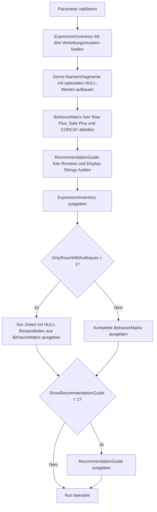

# ConcatNullYieldsNullCheck.sql

Dieses Skript macht die Wirkung nullable String-Bestandteile auf zusammengesetzte Anzeigenamen sichtbar. Die Demo-Daten werden mit roher `+`-Verkettung, einer abgesicherten `COALESCE`-Variante und `CONCAT()` verglichen, damit Review- und Unterrichtssituationen rund um `CONCAT_NULL_YIELDS_NULL` konkret besprochen werden koennen.

## Uebersicht

<!-- SQLDOC:SUMMARY_TABLE:BEGIN -->
| Feld | Wert |
|---|---|
| Script | [ConcatNullYieldsNullCheck.sql](ConcatNullYieldsNullCheck.sql) |
| Version | `1.0` |
| Typ | `didactic-lab` |
| Kapitel | `17_ANSI_NULL & Co` |
| Sicherheit | `read-only-tempdb` |
| Zweck | Vergleicht null-sensitive und null-robuste String-Verkettung fuer didaktische Anzeige- und Review-Faelle. |
<!-- SQLDOC:SUMMARY_TABLE:END -->

## Einordnung

Bei String-Ausdruecken mit optionalen Namens- oder Label-Bestandteilen reicht es nicht, nur das Endresultat im Erfolgsfall anzuschauen. Entscheidend ist, wie sich fehlende Werte auf die gesamte Verkettung auswirken. Das Skript arbeitet deshalb mit denselben Demo-Zeilen und stellt drei Muster gegenueber: rohe `+`-Verkettung, explizite Absicherung mit `COALESCE` und eine `CONCAT()`-Variante.

## Annahmen

- Es handelt sich um eine didaktische Erstversion mit Demo-Daten in `tempdb`.
- Der Fokus liegt auf beobachtbarem Null-Verhalten in Ausdruecken, nicht auf produktiven Tabellen oder Session-Umschaltung.
- `CONCAT()` wird hier als robuste Alternative fuer typische Display-Strings und Berichtslabel behandelt.
- Bei manueller `COALESCE`-Absicherung bleiben Leerzeichen- und Delimiter-Regeln ein eigenstaendiges Review-Thema.

## Anwendungsfall

Das Skript eignet sich fuer Unterricht, Code-Review und Troubleshooting von Berichten oder Exporten mit optionalen Namensbestandteilen. Besonders nuetzlich ist es, wenn Teams nachvollziehen wollen, warum rohe `+`-Verkettung bei `NULL` fragil ist und welche Ausdrucksmuster fuer robuste Anzeigenamen besser geeignet sind.

## Parameter

<!-- SQLDOC:PARAMETERS_TABLE:BEGIN -->
| Parameter | SQL-Typ | Pflicht | Beschreibung |
|---|---|---|---|
| `@OnlyRowsWithNullInputs` | `BIT` | Nein | Zeigt bei `1` nur Demo-Zeilen mit mindestens einem `NULL`-Bestandteil. |
| `@ShowRecommendationGuide` | `BIT` | Nein | Gibt bei `1` zusaetzlich den Entscheidungs- und Review-Guide aus. |
<!-- SQLDOC:PARAMETERS_TABLE:END -->

## Abhaengigkeiten

<!-- SQLDOC:DEPENDENCIES_LIST:BEGIN -->
- `tempdb` fuer temporaere Tabellen
- `CONCAT`
- `COALESCE`
- `CASE`
- `ORDER BY`
<!-- SQLDOC:DEPENDENCIES_LIST:END -->

## Hinweise

- `ExpressionInventory` beschreibt die verglichenen Ausdrucksmuster und ihren didaktischen Fokus.
- `BehaviorMatrix` zeigt pro Demo-Zeile direkt den Unterschied zwischen null-sensitiver und null-robuster Verkettung.
- Der Guide uebersetzt die Beobachtungen in konkrete Review-Regeln fuer Labels, Anzeigenamen und Exportspalten.

## Versionshistorie

<!-- SQLDOC:VERSION_HISTORY_TABLE:BEGIN -->
| Version | Datum | User | Beschreibung |
|---|---|---|---|
| `1.0` | `2026-04-19` | `ER` | Erstversion des didaktischen Labs fuer NULL-sensitive String-Verkettung |
<!-- SQLDOC:VERSION_HISTORY_TABLE:END -->

## Ablauf

<!-- SQLDOC:MERMAID:BEGIN -->

<!-- SQLDOC:MERMAID:END -->

## SQL-Code

<!-- SQLDOC:SQL_CODE:BEGIN -->
```sql
/*
BEGIN:SQL-HEADER v1
---
sql_header: v1
script_name: "ConcatNullYieldsNullCheck.sql"
script_version: "1.0"
script_type: "didactic-lab"
chapter: "17_ANSI_NULL & Co"

purpose: >
  Macht das Null-Verhalten bei String-Verkettungen anschaulich, indem
  dieselben Demo-Daten mit roh verkettendem Plus-Operator, abgesicherter
  COALESCE-Variante und CONCAT()-Variante verglichen werden. Das Skript
  unterstuetzt so Reviews rund um CONCAT_NULL_YIELDS_NULL und robuste
  Alternativen fuer lesbare Ausgaben.

parameters:
  - name: "@OnlyRowsWithNullInputs"
    sql_type: "BIT"
    direction: "IN"
    required: false
    description: "1 = nur Demo-Zeilen mit mindestens einem NULL-Bestandteil ausgeben"
  - name: "@ShowRecommendationGuide"
    sql_type: "BIT"
    direction: "IN"
    required: false
    description: "1 = zusaetzlich einen kompakten Entscheidungs- und Review-Guide ausgeben"

result_sets:
  - name: "ExpressionInventory"
    description: "Beschreibt die verglichenen Verkettungsmuster und ihren didaktischen Fokus"
  - name: "BehaviorMatrix"
    description: "Vergleicht die Resultate derselben Demo-Zeilen fuer rohe, abgesicherte und CONCAT()-Verkettung"
  - name: "RecommendationGuide"
    description: "Leitet robuste Muster fuer Reviews, Reports und Anzeigenamen ab"

dependencies:
  - "tempdb temporary tables"
  - "CONCAT"
  - "COALESCE"
  - "CASE"
  - "ORDER BY"

safety:
  level: "read-only-tempdb"
  writes_data: false

documentation:
  markdown_file: "T-SQL/17_ANSI_NULL & Co/SQLScripts/ConcatNullYieldsNullCheck.md"
  sync_blocks:
    - "SUMMARY_TABLE"
    - "PARAMETERS_TABLE"
    - "DEPENDENCIES_LIST"
    - "VERSION_HISTORY_TABLE"
    - "SQL_CODE"
  mermaid:
    mode: "ai-agent-from-sql"
    source: "script-body"

main_responsible:
  name: "Erhard Rainer"
  initials: "ER"

version_history:
  - version: "1.0"
    date: "2026-04-19"
    user: "ER"
    description: "Erstversion des didaktischen Labs fuer NULL-sensitive String-Verkettung"

notes:
  - "Das Skript vergleicht robuste Verkettungsmuster ohne produktive Tabellen oder Session-Umschaltungen vorauszusetzen"
  - "Der Fokus liegt auf beobachtbaren Resultaten und Review-Guardrails fuer nullable String-Bestandteile"
---
END:SQL-HEADER v1
*/

SET NOCOUNT ON;

-- 1. Parameter vorbereiten
DECLARE @OnlyRowsWithNullInputs BIT = 0;
DECLARE @ShowRecommendationGuide BIT = 1;

IF @OnlyRowsWithNullInputs NOT IN (0, 1)
BEGIN
    THROW 50000, '@OnlyRowsWithNullInputs muss 0 oder 1 sein.', 1;
END;

IF @ShowRecommendationGuide NOT IN (0, 1)
BEGIN
    THROW 50001, '@ShowRecommendationGuide muss 0 oder 1 sein.', 1;
END;

DROP TABLE IF EXISTS #ExpressionInventory;
DROP TABLE IF EXISTS #NameSamples;
DROP TABLE IF EXISTS #BehaviorMatrix;
DROP TABLE IF EXISTS #RecommendationGuide;

-- 2. Verkettungsmuster inventarisieren
CREATE TABLE #ExpressionInventory
(
    PatternOrder               TINYINT       NOT NULL,
    PatternName                VARCHAR(40)   NOT NULL,
    ExampleExpression          VARCHAR(220)  NOT NULL,
    NullHandling               VARCHAR(40)   NOT NULL,
    ReviewFocus                VARCHAR(220)  NOT NULL,
    TypicalUse                 VARCHAR(220)  NOT NULL
);

INSERT INTO #ExpressionInventory
(
    PatternOrder,
    PatternName,
    ExampleExpression,
    NullHandling,
    ReviewFocus,
    TypicalUse
)
VALUES
    (
        1,
        'Raw plus operator',
        'FirstName + '' '' + MiddleName + '' '' + LastName',
        'null-sensitive',
        'Zeigt, wie ein fehlender Bestandteil die gesamte Anzeige kippen kann.',
        'Legacy-Ausdruecke, schnelle Ad-hoc-Reports und Code-Review-Faelle'
    ),
    (
        2,
        'Plus with COALESCE',
        'COALESCE(FirstName, '''') + '' '' + COALESCE(MiddleName, '''') + '' '' + COALESCE(LastName, '''')',
        'manual fallback',
        'Macht Null-Behandlung explizit, verlangt aber saubere Leerzeichen- und Trim-Regeln.',
        'Berichte oder Exporte mit kontrollierter Formatlogik'
    ),
    (
        3,
        'CONCAT function',
        'CONCAT(FirstName, '' '', MiddleName, '' '', LastName)',
        'null-safe per argument',
        'Zeigt eine lesbare Alternative, bei der NULL-Bestandteile nicht den Gesamtausdruck vernichten.',
        'Didaktische Gegenueberstellung und robuste Display-Strings'
    );

-- 3. Demo-Daten fuer nullable Namensfragmente vorbereiten
CREATE TABLE #NameSamples
(
    SampleID                   INT           NOT NULL,
    ScenarioName               VARCHAR(80)   NOT NULL,
    FirstName                  VARCHAR(50)   NULL,
    MiddleName                 VARCHAR(50)   NULL,
    LastName                   VARCHAR(50)   NULL,
    Suffix                     VARCHAR(20)   NULL,
    WhyRelevant                VARCHAR(220)  NOT NULL
);

INSERT INTO #NameSamples
(
    SampleID,
    ScenarioName,
    FirstName,
    MiddleName,
    LastName,
    Suffix,
    WhyRelevant
)
VALUES
    (
        1,
        'Complete name',
        'Anna',
        'Maria',
        'Berger',
        'MBA',
        'Baseline ohne NULL-Werte, damit alle Muster auf derselben Vollbelegung verglichen werden koennen.'
    ),
    (
        2,
        'Missing middle name',
        'Boris',
        NULL,
        'Klein',
        NULL,
        'Typischer Anzeige- oder Reporting-Fall mit optionalem Mittelteil.'
    ),
    (
        3,
        'Missing last name',
        'Cem',
        'Ali',
        NULL,
        NULL,
        'Zeigt, wie rohe Verkettung bei spaet fehlendem Bestandteil kippt.'
    ),
    (
        4,
        'Only surname known',
        NULL,
        NULL,
        'Nowak',
        NULL,
        'Didaktischer Randfall fuer Suchtreffer oder unvollstaendige Importzeilen.'
    ),
    (
        5,
        'Suffix without middle name',
        'Dina',
        NULL,
        'Maurer',
        'PhD',
        'Hilft, Leerzeichen- und Optionalteil-Logik bei zusammengesetzten Labels zu diskutieren.'
    );

-- 4. Vergleichsmatrix fuer verschiedene Verkettungsmuster aufbauen
CREATE TABLE #BehaviorMatrix
(
    SampleID                   INT           NOT NULL,
    ScenarioName               VARCHAR(80)   NOT NULL,
    HasNullInput               BIT           NOT NULL,
    RawPlusDisplay             VARCHAR(220)  NULL,
    SafePlusDisplay            VARCHAR(220)  NOT NULL,
    ConcatDisplay              VARCHAR(220)  NOT NULL,
    NullImpactSummary          VARCHAR(220)  NOT NULL,
    ReviewRecommendation       VARCHAR(220)  NOT NULL
);

INSERT INTO #BehaviorMatrix
(
    SampleID,
    ScenarioName,
    HasNullInput,
    RawPlusDisplay,
    SafePlusDisplay,
    ConcatDisplay,
    NullImpactSummary,
    ReviewRecommendation
)
SELECT
    ns.SampleID,
    ns.ScenarioName,
    CASE
        WHEN ns.FirstName IS NULL
          OR ns.MiddleName IS NULL
          OR ns.LastName IS NULL
          OR ns.Suffix IS NULL THEN 1
        ELSE 0
    END AS HasNullInput,
    ns.FirstName + ' ' + ns.MiddleName + ' ' + ns.LastName
        + CASE
              WHEN ns.Suffix IS NULL THEN ''
              ELSE ', ' + ns.Suffix
          END AS RawPlusDisplay,
    LTRIM(RTRIM(
        COALESCE(ns.FirstName, '')
        + CASE
              WHEN ns.FirstName IS NOT NULL
               AND (ns.MiddleName IS NOT NULL OR ns.LastName IS NOT NULL) THEN ' '
              ELSE ''
          END
        + COALESCE(ns.MiddleName, '')
        + CASE
              WHEN ns.MiddleName IS NOT NULL AND ns.LastName IS NOT NULL THEN ' '
              ELSE ''
          END
        + COALESCE(ns.LastName, '')
        + CASE
              WHEN ns.Suffix IS NOT NULL
               AND (ns.FirstName IS NOT NULL OR ns.MiddleName IS NOT NULL OR ns.LastName IS NOT NULL) THEN ', '
              WHEN ns.Suffix IS NOT NULL THEN ''
              ELSE ''
          END
        + COALESCE(ns.Suffix, '')
    )) AS SafePlusDisplay,
    LTRIM(RTRIM(
        CONCAT(
            COALESCE(ns.FirstName + ' ', ''),
            COALESCE(ns.MiddleName + ' ', ''),
            COALESCE(ns.LastName, ''),
            CASE
                WHEN ns.Suffix IS NOT NULL
                 AND (ns.FirstName IS NOT NULL OR ns.MiddleName IS NOT NULL OR ns.LastName IS NOT NULL) THEN CONCAT(', ', ns.Suffix)
                ELSE COALESCE(ns.Suffix, '')
            END
        )
    )) AS ConcatDisplay,
    CASE
        WHEN ns.FirstName IS NULL
          OR ns.MiddleName IS NULL
          OR ns.LastName IS NULL
          OR ns.Suffix IS NULL THEN 'Mindestens ein Bestandteil ist NULL; rohe Plus-Verkettung wird dadurch fragil oder komplett NULL.'
        ELSE 'Ohne NULL-Werte liefern alle Varianten einen lesbaren Anzeigenamen.'
    END AS NullImpactSummary,
    CASE
        WHEN ns.MiddleName IS NULL OR ns.Suffix IS NULL THEN 'Optionale Bestandteile explizit abfedern und Leerzeichen-Regeln bewusst testen.'
        WHEN ns.FirstName IS NULL OR ns.LastName IS NULL THEN 'Unvollstaendige Kerndaten markieren statt rohe Verkettung als Anzeigeformat zu vertrauen.'
        ELSE 'Volle Datenbelegung eignet sich als Baseline fuer Regressionstests.'
    END AS ReviewRecommendation
FROM #NameSamples AS ns;

-- 5. Entscheidungs- und Review-Guide formulieren
CREATE TABLE #RecommendationGuide
(
    GuideStep                  TINYINT       NOT NULL,
    FocusArea                  VARCHAR(60)   NOT NULL,
    Recommendation             VARCHAR(220)  NOT NULL,
    WhyItHelps                 VARCHAR(220)  NOT NULL
);

INSERT INTO #RecommendationGuide
(
    GuideStep,
    FocusArea,
    Recommendation,
    WhyItHelps
)
VALUES
    (
        1,
        'Nullable display parts',
        'Optionale String-Bestandteile nie ungeprueft mit rohem Plus-Operator zusammenbauen.',
        'Schon ein einzelnes NULL kann die Anzeige unbrauchbar machen oder Folgefehler in Reports kaschieren.'
    ),
    (
        2,
        'Formatting control',
        'Bei COALESCE-Varianten Leerzeichen, Trennzeichen und leere Resultate explizit testen.',
        'Null-Sicherheit allein reicht nicht; ohne Formatregeln entstehen doppelte Leerzeichen oder irritierende Delimiter.'
    ),
    (
        3,
        'Readable defaults',
        'CONCAT() fuer robuste Anzeigenamen oder Labels bevorzugen, wenn mehrere optionale Bestandteile kombiniert werden.',
        'Die Funktion bleibt bei NULL-Bestandteilen lesbar und reduziert den Review-Aufwand fuer Standardfaelle.'
    ),
    (
        4,
        'Review checklist',
        'Bei CONCAT_NULL_YIELDS_NULL-bezogenen Diskussionen immer den Ausdruck selbst und nicht nur die Session-Option bewerten.',
        'So bleiben robuste Alternativen sichtbar, auch wenn Verbindungs- oder Tool-Kontext spaeter wechselt.'
    );

-- 6. Ergebnisse ausgeben
SELECT
    ei.PatternOrder,
    ei.PatternName,
    ei.ExampleExpression,
    ei.NullHandling,
    ei.ReviewFocus,
    ei.TypicalUse
FROM #ExpressionInventory AS ei
ORDER BY
    ei.PatternOrder;

SELECT
    bm.SampleID,
    bm.ScenarioName,
    bm.HasNullInput,
    bm.RawPlusDisplay,
    bm.SafePlusDisplay,
    bm.ConcatDisplay,
    bm.NullImpactSummary,
    bm.ReviewRecommendation
FROM #BehaviorMatrix AS bm
WHERE @OnlyRowsWithNullInputs = 0
   OR bm.HasNullInput = 1
ORDER BY
    bm.SampleID;

IF @ShowRecommendationGuide = 1
BEGIN
    SELECT
        rg.GuideStep,
        rg.FocusArea,
        rg.Recommendation,
        rg.WhyItHelps
    FROM #RecommendationGuide AS rg
    ORDER BY
        rg.GuideStep;
END;
```
<!-- SQLDOC:SQL_CODE:END -->
