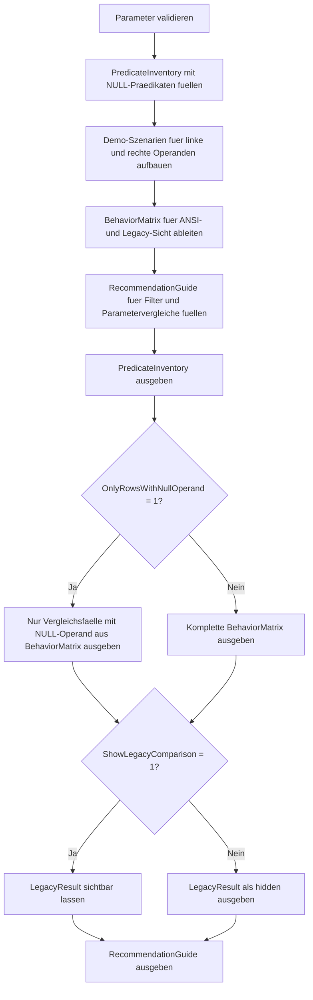

# NullComparisonBehaviorLab.sql

Dieses Skript demonstriert die Vergleichslogik mit `NULL` an einem kleinen Demo-Datensatz. Es stellt typische Praedikate fuer dieselben Operanden gegenueber, kontrastiert ANSI-konformes Verhalten mit einer didaktischen Legacy-Sicht auf `ANSI_NULLS OFF` und leitet robuste Review-Muster fuer Filter und optionale Parameter ab.

## Uebersicht

<!-- SQLDOC:SUMMARY_TABLE:BEGIN -->
| Feld | Wert |
|---|---|
| Script | [NullComparisonBehaviorLab.sql](NullComparisonBehaviorLab.sql) |
| Version | `1.0` |
| Typ | `didactic-lab` |
| Kapitel | `17_ANSI_NULL & Co` |
| Sicherheit | `read-only-tempdb` |
| Zweck | Zeigt, warum `= NULL` und `<> NULL` fragil sind und welche stabilen Alternativen fuer Vergleichslogik verwendet werden sollten. |
<!-- SQLDOC:SUMMARY_TABLE:END -->

## Einordnung

Der didaktische Mehrwert liegt darin, dieselben Vergleichsfaelle parallel zu betrachten: einmal aus ANSI-konformer Sicht und einmal aus einer Legacy-Sicht, wie sie in aelterem Code mit `ANSI_NULLS OFF` mitgedacht wurde. So wird sichtbar, warum robuste Skripte ihre Absicht lieber mit `IS NULL`, `IS NOT NULL` oder expliziter Normalisierung ausdruecken.

## Annahmen

- Es handelt sich um eine didaktische Erstversion mit Demo-Faellen in `tempdb`.
- Die Legacy-Spalte modelliert `ANSI_NULLS OFF` als Vergleichsreferenz; das Skript schaltet keine produktiven Sessions um.
- Im Fokus stehen Filter, `CASE`-Ausdruecke und optionale Parameter, nicht produktive Tabellen oder Deployment-Skripte.
- `COALESCE(..., '<NULL>')` wird als explizites Vergleichsmuster gezeigt, wenn `NULL` fachlich wie ein eigener Wert behandelt werden soll.

## Anwendungsfall

Das Skript eignet sich fuer Unterricht, Review und Troubleshooting, wenn unklare WHERE-Bedingungen oder Parametervergleiche mit `NULL` untersucht werden muessen. Besonders hilfreich ist es, um Altcode mit `= NULL` oder `<> NULL` schnell als Risiko zu identifizieren und in stabile Muster zu ueberfuehren.

## Parameter

<!-- SQLDOC:PARAMETERS_TABLE:BEGIN -->
| Parameter | SQL-Typ | Pflicht | Beschreibung |
|---|---|---|---|
| `@OnlyRowsWithNullOperand` | `BIT` | Nein | Zeigt bei `1` nur Vergleichsfaelle mit mindestens einem `NULL`-Operand. |
| `@ShowLegacyComparison` | `BIT` | Nein | Gibt bei `1` zusaetzlich die didaktische Legacy-Sicht fuer `ANSI_NULLS OFF` aus. |
<!-- SQLDOC:PARAMETERS_TABLE:END -->

## Abhaengigkeiten

<!-- SQLDOC:DEPENDENCIES_LIST:BEGIN -->
- `tempdb` fuer temporaere Tabellen
- `CASE`
- `COALESCE`
- `CROSS JOIN`
- `ORDER BY`
<!-- SQLDOC:DEPENDENCIES_LIST:END -->

## Hinweise

- `PredicateInventory` beschreibt die zentralen Praedikate und deren empfohlene Verwendung.
- `BehaviorMatrix` zeigt pro Demo-Fall die Auswertung unter ANSI-Logik und optional die Legacy-Sicht.
- Der Guide uebersetzt die Beobachtungen direkt in Review-Regeln fuer Filter und optionale Parameter.

## Versionshistorie

<!-- SQLDOC:VERSION_HISTORY_TABLE:BEGIN -->
| Version | Datum | User | Beschreibung |
|---|---|---|---|
| `1.0` | `2026-04-19` | `ER` | Erstversion des didaktischen Labs fuer NULL-Vergleichslogik |
<!-- SQLDOC:VERSION_HISTORY_TABLE:END -->

## Ablauf

<!-- SQLDOC:MERMAID:BEGIN -->

<!-- SQLDOC:MERMAID:END -->

## SQL-Code

<!-- SQLDOC:SQL_CODE:BEGIN -->
```sql
/*
BEGIN:SQL-HEADER v1
---
sql_header: v1
script_name: "NullComparisonBehaviorLab.sql"
script_version: "1.0"
script_type: "didactic-lab"
chapter: "17_ANSI_NULL & Co"

purpose: >
  Demonstriert die Vergleichslogik mit NULL, indem typische Praedikate
  fuer denselben Demo-Datensatz gegenuebergestellt werden. Das Skript
  kontrastiert ANSI-konformes Verhalten mit einer Legacy-Sicht auf
  ANSI_NULLS OFF und leitet robuste Vergleichsmuster fuer Reviews und
  Fehlersuche ab.

parameters:
  - name: "@OnlyRowsWithNullOperand"
    sql_type: "BIT"
    direction: "IN"
    required: false
    description: "1 = nur Vergleichsfaelle mit mindestens einem NULL-Operand ausgeben"
  - name: "@ShowLegacyComparison"
    sql_type: "BIT"
    direction: "IN"
    required: false
    description: "1 = zusaetzlich die didaktische Legacy-Sicht fuer ANSI_NULLS OFF ausgeben"

result_sets:
  - name: "PredicateInventory"
    description: "Beschreibt die verglichenen NULL-Praedikate und ihre empfohlene Verwendung"
  - name: "BehaviorMatrix"
    description: "Zeigt pro Demo-Fall die Auswertung unter ANSI-konformer und Legacy-Logik"
  - name: "RecommendationGuide"
    description: "Leitet robuste Vergleichsmuster fuer Filter, CASE-Ausdruecke und Reviews ab"

dependencies:
  - "tempdb temporary tables"
  - "CASE"
  - "COALESCE"
  - "CROSS JOIN"
  - "ORDER BY"

safety:
  level: "read-only-tempdb"
  writes_data: false

documentation:
  markdown_file: "T-SQL/17_ANSI_NULL & Co/SQLScripts/NullComparisonBehaviorLab.md"
  sync_blocks:
    - "SUMMARY_TABLE"
    - "PARAMETERS_TABLE"
    - "DEPENDENCIES_LIST"
    - "VERSION_HISTORY_TABLE"
    - "SQL_CODE"
  mermaid:
    mode: "ai-agent-from-sql"
    source: "script-body"

main_responsible:
  name: "Erhard Rainer"
  initials: "ER"

version_history:
  - version: "1.0"
    date: "2026-04-19"
    user: "ER"
    description: "Erstversion des didaktischen Labs fuer NULL-Vergleichslogik"

notes:
  - "Die Legacy-Spalte modelliert ANSI_NULLS OFF didaktisch als Vergleichsreferenz statt produktive Sessions umzuschalten"
  - "Der Fokus liegt auf beobachtbaren Vergleichsmustern und robusten Alternativen fuer NULL-sensitive Filter"
---
END:SQL-HEADER v1
*/

SET NOCOUNT ON;

-- 1. Parameter vorbereiten
DECLARE @OnlyRowsWithNullOperand BIT = 0;
DECLARE @ShowLegacyComparison BIT = 1;

IF @OnlyRowsWithNullOperand NOT IN (0, 1)
BEGIN
    THROW 50000, '@OnlyRowsWithNullOperand muss 0 oder 1 sein.', 1;
END;

IF @ShowLegacyComparison NOT IN (0, 1)
BEGIN
    THROW 50001, '@ShowLegacyComparison muss 0 oder 1 sein.', 1;
END;

DROP TABLE IF EXISTS #PredicateInventory;
DROP TABLE IF EXISTS #SampleInputs;
DROP TABLE IF EXISTS #BehaviorMatrix;
DROP TABLE IF EXISTS #RecommendationGuide;

-- 2. Relevante Praedikate fuer NULL-Vergleiche inventarisieren
CREATE TABLE #PredicateInventory
(
    PredicateOrder           TINYINT       NOT NULL,
    PredicateLabel           VARCHAR(60)   NOT NULL,
    ExamplePredicate         VARCHAR(120)  NOT NULL,
    NullSensitivity          VARCHAR(40)   NOT NULL,
    AnsiNullsOnBehavior      VARCHAR(120)  NOT NULL,
    LegacyBehavior           VARCHAR(120)  NOT NULL,
    RecommendedUse           VARCHAR(220)  NOT NULL
);

INSERT INTO #PredicateInventory
(
    PredicateOrder,
    PredicateLabel,
    ExamplePredicate,
    NullSensitivity,
    AnsiNullsOnBehavior,
    LegacyBehavior,
    RecommendedUse
)
VALUES
    (
        1,
        'Equals NULL',
        'Value = NULL',
        'null-sensitive',
        'liefert nie TRUE, sondern UNKNOWN',
        'kann bei NULL = NULL zu TRUE werden',
        'Nicht fuer NULL-Pruefungen verwenden; stattdessen IS NULL einsetzen.'
    ),
    (
        2,
        'Not equals NULL',
        'Value <> NULL',
        'null-sensitive',
        'liefert nie TRUE, sondern UNKNOWN',
        'kann bei nicht-NULL-Werten TRUE liefern',
        'Nicht fuer NULL-Filter verwenden; stattdessen IS NOT NULL einsetzen.'
    ),
    (
        3,
        'IS NULL',
        'Value IS NULL',
        'null-aware',
        'erkennt NULL-Werte stabil',
        'erkennt NULL-Werte stabil',
        'Standardmuster fuer fehlende Werte in Filtern und CASE-Ausdruecken.'
    ),
    (
        4,
        'IS NOT NULL',
        'Value IS NOT NULL',
        'null-aware',
        'erkennt belegte Werte stabil',
        'erkennt belegte Werte stabil',
        'Standardmuster fuer vorhandene Werte und Guardrails.'
    ),
    (
        5,
        'Normalized equality',
        'COALESCE(Value, ''<NULL>'') = COALESCE(Probe, ''<NULL>'')',
        'explicit fallback',
        'macht Vergleichsabsicht fuer NULL und Nicht-NULL explizit',
        'macht Vergleichsabsicht fuer NULL und Nicht-NULL explizit',
        'Geeignet, wenn NULL fachlich als eigener Vergleichswert modelliert werden soll.'
    );

-- 3. Demo-Faelle fuer linke und rechte Operanden vorbereiten
CREATE TABLE #SampleInputs
(
    ScenarioOrder            TINYINT       NOT NULL,
    ScenarioName             VARCHAR(80)   NOT NULL,
    LeftValue                VARCHAR(20)   NULL,
    RightValue               VARCHAR(20)   NULL,
    LeftIsNull               BIT           NOT NULL,
    RightIsNull              BIT           NOT NULL,
    WhyRelevant              VARCHAR(220)  NOT NULL
);

INSERT INTO #SampleInputs
(
    ScenarioOrder,
    ScenarioName,
    LeftValue,
    RightValue,
    LeftIsNull,
    RightIsNull,
    WhyRelevant
)
VALUES
    (
        1,
        'Both operands are NULL',
        NULL,
        NULL,
        1,
        1,
        'Klassischer Grenzfall fuer NULL = NULL und NULL <> NULL.'
    ),
    (
        2,
        'Left operand NULL, right operand filled',
        NULL,
        'A',
        1,
        0,
        'Zeigt, wie ein einzelner NULL-Operand den Vergleich kippt.'
    ),
    (
        3,
        'Left operand filled, right operand NULL',
        'A',
        NULL,
        0,
        1,
        'Typischer Filterfall mit Parameter oder Suchwert gleich NULL.'
    ),
    (
        4,
        'Both operands equal and filled',
        'A',
        'A',
        0,
        0,
        'Baseline fuer gewoehnliche Gleichheitsvergleiche ohne NULL.'
    ),
    (
        5,
        'Operands differ and are filled',
        'A',
        'B',
        0,
        0,
        'Zeigt das normale Ungleichheitsverhalten ohne NULL.'
    );

-- 4. Vergleichsmatrix unter ANSI-konformer und Legacy-Sicht ableiten
CREATE TABLE #BehaviorMatrix
(
    ScenarioOrder            TINYINT       NOT NULL,
    PredicateOrder           TINYINT       NOT NULL,
    ScenarioName             VARCHAR(80)   NOT NULL,
    PredicateLabel           VARCHAR(60)   NOT NULL,
    LeftDisplay              VARCHAR(20)   NOT NULL,
    RightDisplay             VARCHAR(20)   NOT NULL,
    IncludesNullOperand      BIT           NOT NULL,
    AnsiNullsOnResult        VARCHAR(20)   NOT NULL,
    LegacyResult             VARCHAR(20)   NOT NULL,
    RecommendedPattern       VARCHAR(120)  NOT NULL,
    WhyItMatters             VARCHAR(220)  NOT NULL
);

INSERT INTO #BehaviorMatrix
(
    ScenarioOrder,
    PredicateOrder,
    ScenarioName,
    PredicateLabel,
    LeftDisplay,
    RightDisplay,
    IncludesNullOperand,
    AnsiNullsOnResult,
    LegacyResult,
    RecommendedPattern,
    WhyItMatters
)
SELECT
    si.ScenarioOrder,
    pi.PredicateOrder,
    si.ScenarioName,
    pi.PredicateLabel,
    COALESCE(si.LeftValue, '<NULL>') AS LeftDisplay,
    COALESCE(si.RightValue, '<NULL>') AS RightDisplay,
    CASE
        WHEN si.LeftIsNull = 1 OR si.RightIsNull = 1 THEN 1
        ELSE 0
    END AS IncludesNullOperand,
    CASE pi.PredicateLabel
        WHEN 'Equals NULL' THEN
            CASE
                WHEN si.RightIsNull = 1 THEN 'UNKNOWN'
                WHEN si.LeftIsNull = 1 THEN 'UNKNOWN'
                WHEN si.LeftValue = si.RightValue THEN 'FALSE'
                ELSE 'FALSE'
            END
        WHEN 'Not equals NULL' THEN
            CASE
                WHEN si.RightIsNull = 1 THEN 'UNKNOWN'
                WHEN si.LeftIsNull = 1 THEN 'UNKNOWN'
                WHEN si.LeftValue <> si.RightValue THEN 'FALSE'
                ELSE 'FALSE'
            END
        WHEN 'IS NULL' THEN
            CASE
                WHEN si.LeftIsNull = 1 THEN 'TRUE'
                ELSE 'FALSE'
            END
        WHEN 'IS NOT NULL' THEN
            CASE
                WHEN si.LeftIsNull = 1 THEN 'FALSE'
                ELSE 'TRUE'
            END
        WHEN 'Normalized equality' THEN
            CASE
                WHEN COALESCE(si.LeftValue, '<NULL>') = COALESCE(si.RightValue, '<NULL>') THEN 'TRUE'
                ELSE 'FALSE'
            END
    END AS AnsiNullsOnResult,
    CASE pi.PredicateLabel
        WHEN 'Equals NULL' THEN
            CASE
                WHEN si.RightIsNull = 1 AND si.LeftIsNull = 1 THEN 'TRUE'
                WHEN si.RightIsNull = 1 OR si.LeftIsNull = 1 THEN 'FALSE'
                WHEN si.LeftValue = si.RightValue THEN 'FALSE'
                ELSE 'FALSE'
            END
        WHEN 'Not equals NULL' THEN
            CASE
                WHEN si.RightIsNull = 1 AND si.LeftIsNull = 1 THEN 'FALSE'
                WHEN si.RightIsNull = 1 AND si.LeftIsNull = 0 THEN 'TRUE'
                WHEN si.RightIsNull = 0 AND si.LeftIsNull = 1 THEN 'TRUE'
                WHEN si.LeftValue <> si.RightValue THEN 'FALSE'
                ELSE 'FALSE'
            END
        WHEN 'IS NULL' THEN
            CASE
                WHEN si.LeftIsNull = 1 THEN 'TRUE'
                ELSE 'FALSE'
            END
        WHEN 'IS NOT NULL' THEN
            CASE
                WHEN si.LeftIsNull = 1 THEN 'FALSE'
                ELSE 'TRUE'
            END
        WHEN 'Normalized equality' THEN
            CASE
                WHEN COALESCE(si.LeftValue, '<NULL>') = COALESCE(si.RightValue, '<NULL>') THEN 'TRUE'
                ELSE 'FALSE'
            END
    END AS LegacyResult,
    CASE pi.PredicateLabel
        WHEN 'Equals NULL' THEN 'Use IS NULL'
        WHEN 'Not equals NULL' THEN 'Use IS NOT NULL'
        WHEN 'IS NULL' THEN 'Keep IS NULL'
        WHEN 'IS NOT NULL' THEN 'Keep IS NOT NULL'
        WHEN 'Normalized equality' THEN 'Keep explicit normalization'
    END AS RecommendedPattern,
    CASE pi.PredicateLabel
        WHEN 'Equals NULL' THEN 'Gleichheitsvergleiche mit NULL sind unter ANSI-Logik nie TRUE und erzeugen dadurch fragilen Filtercode.'
        WHEN 'Not equals NULL' THEN 'Ungleichheitsvergleiche mit NULL sind ebenso fragil und verdecken haeufig fehlende Parameterbehandlung.'
        WHEN 'IS NULL' THEN 'IS NULL macht die Absicht fuer fehlende Werte direkt sichtbar und bleibt ueber Settings hinweg stabil.'
        WHEN 'IS NOT NULL' THEN 'IS NOT NULL eignet sich fuer Guardrails, Pflichtfelder und vorangestellte Datenqualitaetspruefungen.'
        WHEN 'Normalized equality' THEN 'Explizite Normalisierung eignet sich, wenn NULL fachlich wie ein eigener Vergleichswert behandelt werden soll.'
    END AS WhyItMatters
FROM #SampleInputs AS si
CROSS JOIN #PredicateInventory AS pi;

-- 5. Review- und Troubleshooting-Guide aufbauen
CREATE TABLE #RecommendationGuide
(
    GuideOrder                TINYINT       NOT NULL,
    Concern                   VARCHAR(100)  NOT NULL,
    FragilePattern            VARCHAR(140)  NOT NULL,
    StableAlternative         VARCHAR(160)  NOT NULL,
    Rationale                 VARCHAR(220)  NOT NULL
);

INSERT INTO #RecommendationGuide
(
    GuideOrder,
    Concern,
    FragilePattern,
    StableAlternative,
    Rationale
)
VALUES
    (
        1,
        'Filter on missing values',
        'WHERE Value = NULL',
        'WHERE Value IS NULL',
        'Das stabile Praedikat fuer fehlende Werte ist IS NULL, nicht Gleichheit gegen NULL.'
    ),
    (
        2,
        'Filter on present values',
        'WHERE Value <> NULL',
        'WHERE Value IS NOT NULL',
        'IS NOT NULL trennt belegte Werte klar von fehlenden Werten und funktioniert konsistent.'
    ),
    (
        3,
        'Optional search parameter',
        'WHERE Column = @Parameter when @Parameter may be NULL',
        'Parameter zuerst pruefen oder COALESCE/CASE bewusst modellieren',
        'Sonst kippt die Vergleichslogik bei NULL-Parametern in UNKNOWN statt in eine klar definierte Absicht.'
    ),
    (
        4,
        'Legacy code review',
        'Verlassen auf ANSI_NULLS OFF fuer richtige Resultate',
        'Abhaengigkeit entfernen und IS NULL oder explizite Normalisierung verwenden',
        'Legacy-Settings erschweren Reviews, Migrationen und konsistentes Verhalten zwischen Umgebungen.'
    );

-- 6. Resultsets ausgeben
SELECT
    pi.PredicateOrder,
    pi.PredicateLabel,
    pi.ExamplePredicate,
    pi.NullSensitivity,
    pi.AnsiNullsOnBehavior,
    pi.LegacyBehavior,
    pi.RecommendedUse
FROM #PredicateInventory AS pi
ORDER BY
    pi.PredicateOrder;

SELECT
    bm.ScenarioOrder,
    bm.PredicateOrder,
    bm.ScenarioName,
    bm.PredicateLabel,
    bm.LeftDisplay,
    bm.RightDisplay,
    bm.AnsiNullsOnResult,
    CASE
        WHEN @ShowLegacyComparison = 1 THEN bm.LegacyResult
        ELSE 'hidden'
    END AS LegacyResult,
    bm.RecommendedPattern,
    bm.WhyItMatters
FROM #BehaviorMatrix AS bm
WHERE
    @OnlyRowsWithNullOperand = 0
    OR bm.IncludesNullOperand = 1
ORDER BY
    bm.ScenarioOrder,
    bm.PredicateOrder;

SELECT
    rg.GuideOrder,
    rg.Concern,
    rg.FragilePattern,
    rg.StableAlternative,
    rg.Rationale
FROM #RecommendationGuide AS rg
ORDER BY
    rg.GuideOrder;
```
<!-- SQLDOC:SQL_CODE:END -->
