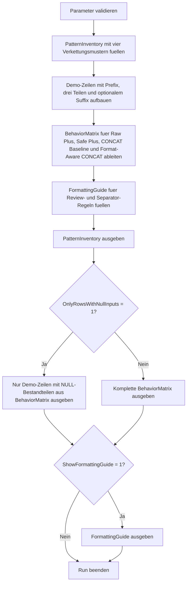

# NullConcatBehaviorLab.sql

Dieses Skript untersucht String-Verkettung mit `NULL` an einem kleinen Demo-Datensatz. Dieselben Zeilen werden mit roher `+`-Verkettung, expliziten `COALESCE`-Fallbacks, einer einfachen `CONCAT()`-Variante und einer formatbewussten `CONCAT()`-Variante verglichen.

## Uebersicht

<!-- SQLDOC:SUMMARY_TABLE:BEGIN -->
| Feld | Wert |
|---|---|
| Script | [NullConcatBehaviorLab.sql](NullConcatBehaviorLab.sql) |
| Version | `1.0` |
| Typ | `didactic-lab` |
| Kapitel | `17_ANSI_NULL & Co` |
| Sicherheit | `read-only-tempdb` |
| Zweck | Vergleicht mehrere Verkettungsvarianten fuer nullable String-Bestandteile und leitet robuste Formatmuster ab. |
<!-- SQLDOC:SUMMARY_TABLE:END -->

## Einordnung

Der fachliche Fokus liegt nicht nur auf der Frage, ob eine Verkettung bei `NULL` ueberhaupt einen Wert liefert. Genauso wichtig ist, ob das Resultat danach noch lesbar formatiert ist. Deshalb kontrastiert das Lab null-sensitive und null-robuste Varianten mit und ohne bewusste Separator-Logik.

## Annahmen

- Es handelt sich um eine didaktische Erstversion mit Demo-Daten in `tempdb`.
- Die Demo-Zeilen modellieren Anzeigenamen und Labels mit optionalen Bestandteilen statt produktiver Fachtabellen.
- `CONCAT()` wird als robuste Grundfunktion gezeigt, waehrend saubere Leerzeichen- und Delimiter-Steuerung weiterhin explizite Ausdruckslogik braucht.
- Die formatbewusste `CONCAT()`-Variante dient als bevorzugtes Review-Muster fuer lesbare Ausgaben mit mehreren optionalen Teilen.

## Anwendungsfall

Das Skript eignet sich fuer Unterricht, Code-Review und Troubleshooting, wenn Reports, Exporte oder UI-Labels bei fehlenden String-Bestandteilen unerwartete Resultate liefern. Besonders hilfreich ist es, um zwischen echter Null-Sicherheit und sauberer Ausgabeformatierung zu unterscheiden.

## Parameter

<!-- SQLDOC:PARAMETERS_TABLE:BEGIN -->
| Parameter | SQL-Typ | Pflicht | Beschreibung |
|---|---|---|---|
| `@OnlyRowsWithNullInputs` | `BIT` | Nein | Zeigt bei `1` nur Demo-Zeilen mit mindestens einem `NULL`-Bestandteil. |
| `@ShowFormattingGuide` | `BIT` | Nein | Gibt bei `1` zusaetzlich den Guide fuer Format- und Review-Entscheidungen aus. |
<!-- SQLDOC:PARAMETERS_TABLE:END -->

## Abhaengigkeiten

<!-- SQLDOC:DEPENDENCIES_LIST:BEGIN -->
- `tempdb` fuer temporaere Tabellen
- `CONCAT`
- `COALESCE`
- `CASE`
- `LTRIM/RTRIM`
<!-- SQLDOC:DEPENDENCIES_LIST:END -->

## Hinweise

- `PatternInventory` beschreibt die vier verglichenen Verkettungsmuster und ihren didaktischen Nutzen.
- `BehaviorMatrix` zeigt pro Demo-Zeile den Unterschied zwischen NULL-Durchschlag, NULL-sicherer Verkettung und sauberer Separator-Steuerung.
- Der optionale Guide uebersetzt die Beobachtungen in konkrete Review-Regeln fuer Anzeige- und Exportspalten.

## Versionshistorie

<!-- SQLDOC:VERSION_HISTORY_TABLE:BEGIN -->
| Version | Datum | User | Beschreibung |
|---|---|---|---|
| `1.0` | `2026-04-19` | `ER` | Erstversion des didaktischen Labs fuer NULL-Verhalten bei String-Verkettung |
<!-- SQLDOC:VERSION_HISTORY_TABLE:END -->

## Ablauf

<!-- SQLDOC:MERMAID:BEGIN -->

<!-- SQLDOC:MERMAID:END -->

## SQL-Code

<!-- SQLDOC:SQL_CODE:BEGIN -->
```sql
/*
BEGIN:SQL-HEADER v1
---
sql_header: v1
script_name: "NullConcatBehaviorLab.sql"
script_version: "1.0"
script_type: "didactic-lab"
chapter: "17_ANSI_NULL & Co"

purpose: >
  Vergleicht mehrere Verkettungsvarianten mit NULL-Bestandteilen anhand
  desselben Demo-Datensatzes. Das Skript zeigt, wann rohe Plus-Verkettung
  komplett kippt, wie explizite Fallbacks die Ausgabe stabilisieren und
  welche Muster sich fuer lesbare Labels und Reviews eignen.

parameters:
  - name: "@OnlyRowsWithNullInputs"
    sql_type: "BIT"
    direction: "IN"
    required: false
    description: "1 = nur Demo-Zeilen mit mindestens einem NULL-Bestandteil ausgeben"
  - name: "@ShowFormattingGuide"
    sql_type: "BIT"
    direction: "IN"
    required: false
    description: "1 = zusaetzlich einen Guide fuer Format- und Review-Entscheidungen ausgeben"

result_sets:
  - name: "PatternInventory"
    description: "Beschreibt die verglichenen Verkettungsmuster und ihren Umgang mit NULL"
  - name: "BehaviorMatrix"
    description: "Zeigt pro Demo-Zeile die Resultate fuer rohe, abgesicherte und formatbewusste Verkettung"
  - name: "FormattingGuide"
    description: "Leitet konkrete Review- und Formatregeln fuer nullable String-Bestandteile ab"

dependencies:
  - "tempdb temporary tables"
  - "CONCAT"
  - "COALESCE"
  - "CASE"
  - "LTRIM/RTRIM"

safety:
  level: "read-only-tempdb"
  writes_data: false

documentation:
  markdown_file: "T-SQL/17_ANSI_NULL & Co/SQLScripts/NullConcatBehaviorLab.md"
  sync_blocks:
    - "SUMMARY_TABLE"
    - "PARAMETERS_TABLE"
    - "DEPENDENCIES_LIST"
    - "VERSION_HISTORY_TABLE"
    - "SQL_CODE"
  mermaid:
    mode: "ai-agent-from-sql"
    source: "script-body"

main_responsible:
  name: "Erhard Rainer"
  initials: "ER"

version_history:
  - version: "1.0"
    date: "2026-04-19"
    user: "ER"
    description: "Erstversion des didaktischen Labs fuer NULL-Verhalten bei String-Verkettung"

notes:
  - "Die Demo-Daten modellieren Anzeige- und Label-Faelle mit optionalen Bestandteilen statt produktiver Tabellen"
  - "Das Skript kontrastiert rohe Plus-Verkettung mit expliziten Fallbacks und einer formatbewussten CONCAT-Variante"
---
END:SQL-HEADER v1
*/

SET NOCOUNT ON;

-- 1. Parameter vorbereiten
DECLARE @OnlyRowsWithNullInputs BIT = 0;
DECLARE @ShowFormattingGuide BIT = 1;

IF @OnlyRowsWithNullInputs NOT IN (0, 1)
BEGIN
    THROW 50000, '@OnlyRowsWithNullInputs muss 0 oder 1 sein.', 1;
END;

IF @ShowFormattingGuide NOT IN (0, 1)
BEGIN
    THROW 50001, '@ShowFormattingGuide muss 0 oder 1 sein.', 1;
END;

DROP TABLE IF EXISTS #PatternInventory;
DROP TABLE IF EXISTS #ConcatSamples;
DROP TABLE IF EXISTS #BehaviorMatrix;
DROP TABLE IF EXISTS #FormattingGuide;

-- 2. Verkettungsmuster inventarisieren
CREATE TABLE #PatternInventory
(
    PatternOrder         TINYINT       NOT NULL,
    PatternName          VARCHAR(50)   NOT NULL,
    ExampleExpression    VARCHAR(220)  NOT NULL,
    NullHandling         VARCHAR(40)   NOT NULL,
    Strength             VARCHAR(220)  NOT NULL,
    TypicalRisk          VARCHAR(220)  NOT NULL
);

INSERT INTO #PatternInventory
(
    PatternOrder,
    PatternName,
    ExampleExpression,
    NullHandling,
    Strength,
    TypicalRisk
)
VALUES
    (
        1,
        'Raw plus operator',
        'Prefix + FirstPart + '' '' + SecondPart + '' '' + ThirdPart',
        'null-sensitive',
        'Macht Legacy-Verhalten und komplette NULL-Durchschlaege sichtbar.',
        'Ein einzelner NULL-Bestandteil kann den gesamten Ausdruck unbrauchbar machen.'
    ),
    (
        2,
        'Plus with COALESCE',
        'COALESCE(FirstPart, '''') + '' '' + COALESCE(SecondPart, '''')',
        'manual fallback',
        'Explizite Null-Behandlung bleibt auch ohne spezielle String-Funktionen lesbar.',
        'Ohne bewusste Trennzeichenlogik entstehen doppelte Leerzeichen oder fuehrende Delimiter.'
    ),
    (
        3,
        'CONCAT baseline',
        'CONCAT(Prefix, FirstPart, '' '', SecondPart, '' '', ThirdPart)',
        'null-safe per argument',
        'NULL-Bestandteile kippen nicht den Gesamtausdruck.',
        'Feste Trennzeichen koennen trotz NULL-Sicherheit unsaubere Formatierung hinterlassen.'
    ),
    (
        4,
        'Format-aware CONCAT',
        'CONCAT(Prefix, CASE..., FirstPart, CASE..., Suffix)',
        'null-safe with separators',
        'Kombiniert Null-Sicherheit mit bewusst gesetzten Leerzeichen und Delimitern.',
        'Etwas mehr Ausdruckslogik, dafuer am besten fuer robuste Anzeigenamen geeignet.'
    );

-- 3. Demo-Daten fuer unterschiedliche Verkettungsfaelle aufbauen
CREATE TABLE #ConcatSamples
(
    SampleID              INT           NOT NULL,
    ScenarioName          VARCHAR(80)   NOT NULL,
    Prefix                VARCHAR(20)   NULL,
    FirstPart             VARCHAR(40)   NULL,
    SecondPart            VARCHAR(40)   NULL,
    ThirdPart             VARCHAR(40)   NULL,
    Suffix                VARCHAR(20)   NULL,
    WhyRelevant           VARCHAR(220)  NOT NULL
);

INSERT INTO #ConcatSamples
(
    SampleID,
    ScenarioName,
    Prefix,
    FirstPart,
    SecondPart,
    ThirdPart,
    Suffix,
    WhyRelevant
)
VALUES
    (
        1,
        'Fully populated display label',
        'ID:',
        'Anna',
        'Maria',
        'Berger',
        'MBA',
        'Baseline ohne NULL-Werte, damit alle Verkettungsmuster sauber verglichen werden koennen.'
    ),
    (
        2,
        'Missing middle part',
        'ID:',
        'Boris',
        NULL,
        'Klein',
        NULL,
        'Typischer Reporting-Fall mit optionalem Mittelteil und fehlendem Zusatz.'
    ),
    (
        3,
        'Missing leading content after prefix',
        'ID:',
        NULL,
        'Cem',
        'Yilmaz',
        NULL,
        'Zeigt, wie rohe Verkettung trotz vorhandener Restdaten komplett kippen kann.'
    ),
    (
        4,
        'Only final part known',
        NULL,
        NULL,
        NULL,
        'Nowak',
        NULL,
        'Didaktischer Randfall fuer Import- oder Suchtreffer mit stark unvollstaendigen Daten.'
    ),
    (
        5,
        'Suffix without second part',
        'Code:',
        'Dina',
        NULL,
        'Maurer',
        'PhD',
        'Hilft, Komma- und Leerzeichenlogik bei optionalen Bestandteilen zu diskutieren.'
    );

-- 4. Vergleichsmatrix fuer die Verkettungsvarianten ableiten
CREATE TABLE #BehaviorMatrix
(
    SampleID                  INT           NOT NULL,
    ScenarioName              VARCHAR(80)   NOT NULL,
    HasNullInput              BIT           NOT NULL,
    RawPlusDisplay            VARCHAR(220)  NULL,
    SafePlusDisplay           VARCHAR(220)  NOT NULL,
    ConcatBaselineDisplay     VARCHAR(220)  NOT NULL,
    FormatAwareConcatDisplay  VARCHAR(220)  NOT NULL,
    NullImpactSummary         VARCHAR(220)  NOT NULL,
    Recommendation            VARCHAR(220)  NOT NULL
);

INSERT INTO #BehaviorMatrix
(
    SampleID,
    ScenarioName,
    HasNullInput,
    RawPlusDisplay,
    SafePlusDisplay,
    ConcatBaselineDisplay,
    FormatAwareConcatDisplay,
    NullImpactSummary,
    Recommendation
)
SELECT
    cs.SampleID,
    cs.ScenarioName,
    CASE
        WHEN cs.Prefix IS NULL
          OR cs.FirstPart IS NULL
          OR cs.SecondPart IS NULL
          OR cs.ThirdPart IS NULL
          OR cs.Suffix IS NULL THEN 1
        ELSE 0
    END AS HasNullInput,
    cs.Prefix + ' ' + cs.FirstPart + ' ' + cs.SecondPart + ' ' + cs.ThirdPart
        + CASE
              WHEN cs.Suffix IS NULL THEN ''
              ELSE ', ' + cs.Suffix
          END AS RawPlusDisplay,
    LTRIM(RTRIM(
        COALESCE(cs.Prefix, '')
        + CASE
              WHEN cs.Prefix IS NOT NULL
               AND (cs.FirstPart IS NOT NULL OR cs.SecondPart IS NOT NULL OR cs.ThirdPart IS NOT NULL) THEN ' '
              ELSE ''
          END
        + COALESCE(cs.FirstPart, '')
        + CASE
              WHEN cs.FirstPart IS NOT NULL
               AND (cs.SecondPart IS NOT NULL OR cs.ThirdPart IS NOT NULL) THEN ' '
              ELSE ''
          END
        + COALESCE(cs.SecondPart, '')
        + CASE
              WHEN cs.SecondPart IS NOT NULL AND cs.ThirdPart IS NOT NULL THEN ' '
              ELSE ''
          END
        + COALESCE(cs.ThirdPart, '')
        + CASE
              WHEN cs.Suffix IS NOT NULL
               AND (cs.FirstPart IS NOT NULL OR cs.SecondPart IS NOT NULL OR cs.ThirdPart IS NOT NULL) THEN ', '
              WHEN cs.Suffix IS NOT NULL THEN ''
              ELSE ''
          END
        + COALESCE(cs.Suffix, '')
    )) AS SafePlusDisplay,
    LTRIM(RTRIM(
        CONCAT(
            COALESCE(cs.Prefix + ' ', ''),
            COALESCE(cs.FirstPart, ''),
            ' ',
            COALESCE(cs.SecondPart, ''),
            ' ',
            COALESCE(cs.ThirdPart, ''),
            CASE
                WHEN cs.Suffix IS NOT NULL THEN CONCAT(', ', cs.Suffix)
                ELSE ''
            END
        )
    )) AS ConcatBaselineDisplay,
    LTRIM(RTRIM(
        CONCAT(
            COALESCE(cs.Prefix, ''),
            CASE
                WHEN cs.Prefix IS NOT NULL
                 AND (cs.FirstPart IS NOT NULL OR cs.SecondPart IS NOT NULL OR cs.ThirdPart IS NOT NULL) THEN ' '
                ELSE ''
            END,
            COALESCE(cs.FirstPart, ''),
            CASE
                WHEN cs.FirstPart IS NOT NULL
                 AND (cs.SecondPart IS NOT NULL OR cs.ThirdPart IS NOT NULL) THEN ' '
                ELSE ''
            END,
            COALESCE(cs.SecondPart, ''),
            CASE
                WHEN cs.SecondPart IS NOT NULL AND cs.ThirdPart IS NOT NULL THEN ' '
                ELSE ''
            END,
            COALESCE(cs.ThirdPart, ''),
            CASE
                WHEN cs.Suffix IS NOT NULL
                 AND (cs.FirstPart IS NOT NULL OR cs.SecondPart IS NOT NULL OR cs.ThirdPart IS NOT NULL) THEN CONCAT(', ', cs.Suffix)
                WHEN cs.Suffix IS NOT NULL THEN cs.Suffix
                ELSE ''
            END
        )
    )) AS FormatAwareConcatDisplay,
    CASE
        WHEN cs.Prefix IS NULL
          OR cs.FirstPart IS NULL
          OR cs.SecondPart IS NULL
          OR cs.ThirdPart IS NULL
          OR cs.Suffix IS NULL THEN 'Mindestens ein Bestandteil ist NULL; rohe Plus-Verkettung wird fragil, sichere Varianten bleiben lesbar.'
        ELSE 'Ohne NULL-Werte liefern alle Varianten einen stabilen Vergleichsbaseline.'
    END AS NullImpactSummary,
    CASE
        WHEN cs.FirstPart IS NULL OR cs.ThirdPart IS NULL THEN 'Kerndatenluecken markieren und keine rohe Verkettung fuer Pflichtanzeigen verwenden.'
        WHEN cs.SecondPart IS NULL OR cs.Suffix IS NULL THEN 'Optionale Teile mit bewusster Separator-Logik absichern.'
        ELSE 'Volle Datenbelegung als Referenzfall fuer Regressionstests beibehalten.'
    END AS Recommendation
FROM #ConcatSamples AS cs;

-- 5. Review- und Formatguide aufbauen
CREATE TABLE #FormattingGuide
(
    GuideStep              TINYINT       NOT NULL,
    FocusArea              VARCHAR(60)   NOT NULL,
    FragilePattern         VARCHAR(180)  NOT NULL,
    StablePattern          VARCHAR(200)  NOT NULL,
    WhyItHelps             VARCHAR(220)  NOT NULL
);

INSERT INTO #FormattingGuide
(
    GuideStep,
    FocusArea,
    FragilePattern,
    StablePattern,
    WhyItHelps
)
VALUES
    (
        1,
        'Nullable expressions',
        'Prefix + FirstPart + '' '' + SecondPart',
        'COALESCE() oder CONCAT() mit bewusster Separator-Logik verwenden',
        'Schon ein einzelner NULL-Bestandteil kann bei roher Plus-Verkettung die gesamte Ausgabe kippen.'
    ),
    (
        2,
        'Formatting quality',
        'CONCAT() mit fest codierten Leerzeichen ohne Zusatzlogik',
        'Separatoren nur setzen, wenn der folgende Bestandteil wirklich vorhanden ist',
        'NULL-Sicherheit allein verhindert noch keine doppelten Leerzeichen oder haengenden Delimiter.'
    ),
    (
        3,
        'Review focus',
        'Nur Session-Optionen diskutieren',
        'Den konkreten Ausdruck und seine NULL-Pfade direkt pruefen',
        'Robuste String-Ausgaben entstehen durch ausdrueckliche Formatregeln, nicht nur durch Settings.'
    ),
    (
        4,
        'Preferred default',
        'Mehrere optionale Teile blind per + verketten',
        'Formatbewusste CONCAT()-Variante fuer Anzeigenamen, Labels und Exporte bevorzugen',
        'Diese Variante bleibt lesbar, skaliert fuer mehrere Bestandteile und macht die Absicht im Review klar.'
    );

-- 6. Resultsets ausgeben
SELECT
    pi.PatternOrder,
    pi.PatternName,
    pi.ExampleExpression,
    pi.NullHandling,
    pi.Strength,
    pi.TypicalRisk
FROM #PatternInventory AS pi
ORDER BY
    pi.PatternOrder;

SELECT
    bm.SampleID,
    bm.ScenarioName,
    bm.HasNullInput,
    bm.RawPlusDisplay,
    bm.SafePlusDisplay,
    bm.ConcatBaselineDisplay,
    bm.FormatAwareConcatDisplay,
    bm.NullImpactSummary,
    bm.Recommendation
FROM #BehaviorMatrix AS bm
WHERE @OnlyRowsWithNullInputs = 0
   OR bm.HasNullInput = 1
ORDER BY
    bm.SampleID;

IF @ShowFormattingGuide = 1
BEGIN
    SELECT
        fg.GuideStep,
        fg.FocusArea,
        fg.FragilePattern,
        fg.StablePattern,
        fg.WhyItHelps
    FROM #FormattingGuide AS fg
    ORDER BY
        fg.GuideStep;
END;
```
<!-- SQLDOC:SQL_CODE:END -->
