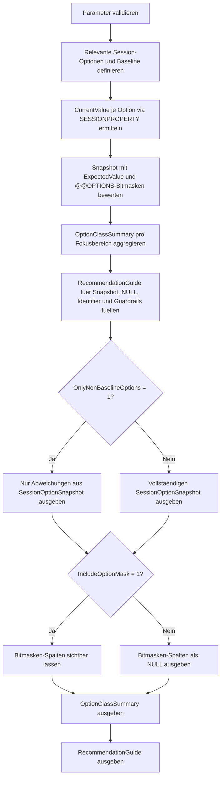

# SessionOptionSnapshot.sql

Dieses Skript erstellt eine Momentaufnahme zentraler Session-Optionen, die das Verhalten von `NULL`-Vergleichen, String-Verkettung, Identifier-Parsing und angrenzenden Diagnose-Guardrails beeinflussen. Es bewertet die aktuelle Session gegen eine konservative Baseline und macht Abweichungen fuer Repro, Review und Unterricht direkt sichtbar.

## Uebersicht

<!-- SQLDOC:SUMMARY_TABLE:BEGIN -->
| Feld | Wert |
|---|---|
| Script | [SessionOptionSnapshot.sql](SessionOptionSnapshot.sql) |
| Version | `1.0` |
| Typ | `diagnostic-query` |
| Kapitel | `17_ANSI_NULL & Co` |
| Sicherheit | `read-only-tempdb` |
| Zweck | Erfasst relevante SET-Optionen der aktuellen Session und markiert Abweichungen gegen eine sichere Baseline. |
<!-- SQLDOC:SUMMARY_TABLE:END -->

## Einordnung

Viele Unterschiede zwischen Demo, Anwendungssession, Agent-Job und manuellem Troubleshooting entstehen nicht durch den SQL-Text allein, sondern durch implizite Session-Optionen. Das Skript macht diese Ausgangslage explizit und hilft dabei, Repros fuer `ANSI_NULLS`, `QUOTED_IDENTIFIER` und verwandte Optionen sauber zu dokumentieren.

## Annahmen

- Die Baseline ist didaktisch und konservativ: `ANSI_NULLS`, `QUOTED_IDENTIFIER`, `ANSI_PADDING`, `ANSI_WARNINGS`, `ARITHABORT` und `CONCAT_NULL_YIELDS_NULL` sollen `ON` sein; `NUMERIC_ROUNDABORT` soll `OFF` sein.
- Das Skript liest nur die aktuelle Session und setzt keine Optionen aktiv um.
- `@@OPTIONS` wird als zweite Sicht neben `SESSIONPROPERTY(...)` gezeigt, um Session-Kontext und Repro-Hinweise kompakt abzuleiten.
- Der Fokus liegt auf Review und Diagnose, nicht auf produktiver DDL- oder Datenaenderung.

## Anwendungsfall

Die Abfrage eignet sich vor allem vor Demos, Fehlersuche, Code-Reviews oder Vergleichslasten zwischen verschiedenen Ausfuehrungskontexten. Sie zeigt schnell, ob eine Session noch auf einer sicheren Baseline laeuft oder ob bestimmte Optionen erklaeren koennen, warum sich `NULL`-Vergleiche, String-Verkettungen oder Objektdefinitionen anders verhalten als erwartet.

## Parameter

<!-- SQLDOC:PARAMETERS_TABLE:BEGIN -->
| Parameter | SQL-Typ | Pflicht | Beschreibung |
|---|---|---|---|
| `@OnlyNonBaselineOptions` | `BIT` | Nein | Zeigt bei `1` nur Optionen, die von der erwarteten Baseline abweichen. |
| `@IncludeOptionMask` | `BIT` | Nein | Gibt bei `1` zusaetzlich die `@@OPTIONS`-Bitmasken-Sicht aus. |
<!-- SQLDOC:PARAMETERS_TABLE:END -->

## Abhaengigkeiten

<!-- SQLDOC:DEPENDENCIES_LIST:BEGIN -->
- `@@OPTIONS`
- `SESSIONPROPERTY`
- `tempdb` fuer temporaere Tabellen
- `CASE`
- `GROUP BY`
<!-- SQLDOC:DEPENDENCIES_LIST:END -->

## Hinweise

- `SessionOptionSnapshot` bewertet jede relevante Option einzeln und markiert Baseline-Abweichungen direkt als Review-Signal.
- `OptionClassSummary` verdichtet die Momentaufnahme nach Themenbereichen wie `NULL semantics`, `Identifier behavior` und `Guardrails`.
- Der Leitfaden am Ende uebersetzt die technische Snapshot-Sicht in konkrete naechste Schritte fuer Repro und Review.

## Versionshistorie

<!-- SQLDOC:VERSION_HISTORY_TABLE:BEGIN -->
| Version | Datum | User | Beschreibung |
|---|---|---|---|
| `1.0` | `2026-04-19` | `ER` | Erstversion der Session-Momentaufnahme fuer NULL- und Identifier-relevante SET-Optionen |
<!-- SQLDOC:VERSION_HISTORY_TABLE:END -->

## Ablauf

<!-- SQLDOC:MERMAID:BEGIN -->

<!-- SQLDOC:MERMAID:END -->

## SQL-Code

<!-- SQLDOC:SQL_CODE:BEGIN -->
```sql
/*
BEGIN:SQL-HEADER v1
---
sql_header: v1
script_name: "SessionOptionSnapshot.sql"
script_version: "1.0"
script_type: "diagnostic-query"
chapter: "17_ANSI_NULL & Co"

purpose: >
  Erfasst die aktuelle SQL-Server-Session fuer wichtige SET-Optionen rund um
  NULL-Semantik, Identifier-Verhalten und angrenzende Guardrails. Das Skript
  vergleicht die Momentaufnahme mit einer konservativen Team-Baseline und
  leitet daraus Diagnose- und Review-Hinweise ab.

parameters:
  - name: "@OnlyNonBaselineOptions"
    sql_type: "BIT"
    direction: "IN"
    required: false
    description: "1 = nur Optionen ausgeben, die nicht der erwarteten Baseline entsprechen"
  - name: "@IncludeOptionMask"
    sql_type: "BIT"
    direction: "IN"
    required: false
    description: "1 = zusaetzlich die @@OPTIONS-Bitmasken-Sicht in der Ausgabe zeigen"

result_sets:
  - name: "SessionOptionSnapshot"
    description: "Zeigt die aktuelle Session-Auspraegung pro relevanter SET-Option"
  - name: "OptionClassSummary"
    description: "Verdichtet die Momentaufnahme pro Fokusbereich und Abweichungsstatus"
  - name: "RecommendationGuide"
    description: "Leitet konkrete Schritte fuer Review, Repro und Session-Hygiene ab"

dependencies:
  - "@@OPTIONS"
  - "SESSIONPROPERTY"
  - "tempdb temporary tables"
  - "CASE"
  - "GROUP BY"

safety:
  level: "read-only-tempdb"
  writes_data: false

documentation:
  markdown_file: "T-SQL/17_ANSI_NULL & Co/SQLScripts/SessionOptionSnapshot.md"
  sync_blocks:
    - "SUMMARY_TABLE"
    - "PARAMETERS_TABLE"
    - "DEPENDENCIES_LIST"
    - "VERSION_HISTORY_TABLE"
    - "SQL_CODE"
  mermaid:
    mode: "ai-agent-from-sql"
    source: "script-body"

main_responsible:
  name: "Erhard Rainer"
  initials: "ER"

version_history:
  - version: "1.0"
    date: "2026-04-19"
    user: "ER"
    description: "Erstversion der Session-Momentaufnahme fuer NULL- und Identifier-relevante SET-Optionen"

notes:
  - "Die Umsetzung liest nur die aktuelle Session und modelliert eine konservative Baseline fuer Unterricht und Review"
  - "Im Fokus stehen ANSI_NULLS, QUOTED_IDENTIFIER und angrenzende Optionen, die das Verhalten von Abfragen und DDL sichtbar beeinflussen"
---
END:SQL-HEADER v1
*/

SET NOCOUNT ON;

-- 1. Parameter vorbereiten
DECLARE @OnlyNonBaselineOptions BIT = 0;
DECLARE @IncludeOptionMask BIT = 1;

IF @OnlyNonBaselineOptions NOT IN (0, 1)
BEGIN
    THROW 50000, '@OnlyNonBaselineOptions muss 0 oder 1 sein.', 1;
END;

IF @IncludeOptionMask NOT IN (0, 1)
BEGIN
    THROW 50001, '@IncludeOptionMask muss 0 oder 1 sein.', 1;
END;

DROP TABLE IF EXISTS #RelevantSessionOptions;
DROP TABLE IF EXISTS #SessionOptionSnapshot;
DROP TABLE IF EXISTS #OptionClassSummary;
DROP TABLE IF EXISTS #RecommendationGuide;

-- 2. Relevante Session-Optionen und Baseline beschreiben
CREATE TABLE #RelevantSessionOptions
(
    OptionOrder            TINYINT       NOT NULL,
    OptionName             VARCHAR(40)   NOT NULL,
    OptionGroup            VARCHAR(30)   NOT NULL,
    ExpectedValue          BIT           NOT NULL,
    OptionBitMask          INT           NOT NULL,
    WhyItMatters           VARCHAR(220)  NOT NULL,
    ReviewFocus            VARCHAR(220)  NOT NULL
);

INSERT INTO #RelevantSessionOptions
(
    OptionOrder,
    OptionName,
    OptionGroup,
    ExpectedValue,
    OptionBitMask,
    WhyItMatters,
    ReviewFocus
)
VALUES
    (
        1,
        'ANSI_NULLS',
        'NULL semantics',
        1,
        32,
        'Steuert Vergleichsverhalten mit NULL und beeinflusst die Lesbarkeit von Legacy-Filterlogik.',
        'Bei OFF gezielt WHERE-, JOIN- und Parametervergleiche auf implizite Legacy-Annahmen pruefen.'
    ),
    (
        2,
        'QUOTED_IDENTIFIER',
        'Identifier behavior',
        1,
        256,
        'Beeinflusst, wie doppelte Anfuehrungszeichen in Objektdefinitionen und Abfragen interpretiert werden.',
        'Bei OFF DDL, View-Definitionen und Deployment-Templates gegen Teamstandard abgleichen.'
    ),
    (
        3,
        'ANSI_PADDING',
        'String storage',
        1,
        16,
        'Bestimmt den Umgang mit Leerzeichen in char- und varchar-nahen Definitionen.',
        'Bei OFF die Entstehung aelterer Tabellen oder Spalten aus Legacy-Skripten beruecksichtigen.'
    ),
    (
        4,
        'ANSI_WARNINGS',
        'Guardrails',
        1,
        8,
        'Macht wichtige Warnungen und Fehlerfaelle bei Aggregaten und Konvertierungen sichtbar.',
        'Bei OFF Repro-Skripte und Imports auf unterdrueckte Warnsignale oder stilles Verhalten pruefen.'
    ),
    (
        5,
        'ARITHABORT',
        'Guardrails',
        1,
        64,
        'Beeinflusst Abbruchverhalten bei arithmetischen Fehlern und kann Query-Plan-Differenzen sichtbar machen.',
        'Bei OFF Session-Kontext, Troubleshooting und reproduzierbare Performance-Vergleiche dokumentieren.'
    ),
    (
        6,
        'CONCAT_NULL_YIELDS_NULL',
        'NULL semantics',
        1,
        4096,
        'Steuert, ob String-Verkettungen mit NULL zu NULL oder zu implizit gekuerzten Zeichenfolgen fuehren.',
        'Bei OFF Verkettungslogik, Exportspalten und Legacy-Formatierung explizit nachziehen.'
    ),
    (
        7,
        'NUMERIC_ROUNDABORT',
        'Numeric safety',
        0,
        8192,
        'Kann numerische Operationen bei Rundungsverlust aggressiver abbrechen und Baselines stoeren.',
        'Bei ON Repro-Kontext dokumentieren und Fachcode auf unbeabsichtigte Rundungsabbrueche pruefen.'
    );

-- 3. Aktuelle Session-Optionen auslesen und bewerten
CREATE TABLE #SessionOptionSnapshot
(
    OptionOrder            TINYINT       NOT NULL,
    OptionName             VARCHAR(40)   NOT NULL,
    OptionGroup            VARCHAR(30)   NOT NULL,
    CurrentValue           BIT           NOT NULL,
    ExpectedValue          BIT           NOT NULL,
    OptionState            VARCHAR(10)   NOT NULL,
    BaselineStatus         VARCHAR(15)   NOT NULL,
    OptionBitMask          INT           NOT NULL,
    OptionBitEnabled       BIT           NOT NULL,
    WhyItMatters           VARCHAR(220)  NOT NULL,
    ReviewFocus            VARCHAR(220)  NOT NULL
);

INSERT INTO #SessionOptionSnapshot
(
    OptionOrder,
    OptionName,
    OptionGroup,
    CurrentValue,
    ExpectedValue,
    OptionState,
    BaselineStatus,
    OptionBitMask,
    OptionBitEnabled,
    WhyItMatters,
    ReviewFocus
)
SELECT
    rso.OptionOrder,
    rso.OptionName,
    rso.OptionGroup,
    current_state.CurrentValue,
    rso.ExpectedValue,
    CASE current_state.CurrentValue
        WHEN 1 THEN 'ON'
        ELSE 'OFF'
    END AS OptionState,
    CASE
        WHEN current_state.CurrentValue = rso.ExpectedValue THEN 'baseline'
        ELSE 'review'
    END AS BaselineStatus,
    rso.OptionBitMask,
    CASE
        WHEN (@@OPTIONS & rso.OptionBitMask) = rso.OptionBitMask THEN 1
        ELSE 0
    END AS OptionBitEnabled,
    rso.WhyItMatters,
    rso.ReviewFocus
FROM #RelevantSessionOptions AS rso
CROSS APPLY
(
    SELECT
        CurrentValue =
            CASE rso.OptionName
                WHEN 'ANSI_NULLS' THEN CAST(SESSIONPROPERTY('ANSI_NULLS') AS BIT)
                WHEN 'QUOTED_IDENTIFIER' THEN CAST(SESSIONPROPERTY('QUOTED_IDENTIFIER') AS BIT)
                WHEN 'ANSI_PADDING' THEN CAST(SESSIONPROPERTY('ANSI_PADDING') AS BIT)
                WHEN 'ANSI_WARNINGS' THEN CAST(SESSIONPROPERTY('ANSI_WARNINGS') AS BIT)
                WHEN 'ARITHABORT' THEN CAST(SESSIONPROPERTY('ARITHABORT') AS BIT)
                WHEN 'CONCAT_NULL_YIELDS_NULL' THEN CAST(SESSIONPROPERTY('CONCAT_NULL_YIELDS_NULL') AS BIT)
                WHEN 'NUMERIC_ROUNDABORT' THEN CAST(SESSIONPROPERTY('NUMERIC_ROUNDABORT') AS BIT)
            END
) AS current_state;

-- 4. Verdichtung pro Fokusbereich vorbereiten
CREATE TABLE #OptionClassSummary
(
    OptionGroup            VARCHAR(30)   NOT NULL,
    TotalOptions           TINYINT       NOT NULL,
    BaselineOptions        TINYINT       NOT NULL,
    ReviewOptions          TINYINT       NOT NULL,
    SnapshotAssessment     VARCHAR(120)  NOT NULL
);

INSERT INTO #OptionClassSummary
(
    OptionGroup,
    TotalOptions,
    BaselineOptions,
    ReviewOptions,
    SnapshotAssessment
)
SELECT
    sos.OptionGroup,
    COUNT(*) AS TotalOptions,
    SUM(CASE WHEN sos.BaselineStatus = 'baseline' THEN 1 ELSE 0 END) AS BaselineOptions,
    SUM(CASE WHEN sos.BaselineStatus = 'review' THEN 1 ELSE 0 END) AS ReviewOptions,
    CASE
        WHEN SUM(CASE WHEN sos.BaselineStatus = 'review' THEN 1 ELSE 0 END) = 0 THEN 'Baseline fuer diesen Fokusbereich erfuellt'
        WHEN sos.OptionGroup = 'NULL semantics' THEN 'NULL-sensitive Logik nur mit expliziten Vergleichen und Verkettungsregeln reviewen'
        WHEN sos.OptionGroup = 'Identifier behavior' THEN 'DDL- und Script-Kontext fuer quoted identifiers gezielt absichern'
        WHEN sos.OptionGroup = 'Guardrails' THEN 'Warn- und Fehlerverhalten fuer reproduzierbare Diagnosen dokumentieren'
        ELSE 'Abweichungen dokumentieren und vor Fachtests bewusst reproduzieren'
    END AS SnapshotAssessment
FROM #SessionOptionSnapshot AS sos
GROUP BY
    sos.OptionGroup;

-- 5. Diagnose- und Review-Leitfaden formulieren
CREATE TABLE #RecommendationGuide
(
    StepNo                 TINYINT       NOT NULL,
    FocusArea              VARCHAR(50)   NOT NULL,
    Recommendation         VARCHAR(220)  NOT NULL,
    WhyItHelps             VARCHAR(220)  NOT NULL
);

INSERT INTO #RecommendationGuide
(
    StepNo,
    FocusArea,
    Recommendation,
    WhyItHelps
)
VALUES
    (
        1,
        'Snapshot',
        'Session-Momentaufnahme vor Repro, Demo oder Review zusammen mit @@OPTIONS dokumentieren.',
        'So bleiben Unterschiede zwischen SSMS, Agent, Anwendungssession oder Deployment-Fenster nachvollziehbar.'
    ),
    (
        2,
        'NULL semantics',
        'Bei Abweichungen in ANSI_NULLS oder CONCAT_NULL_YIELDS_NULL Filter- und Verkettungslogik explizit mit IS NULL, IS NOT NULL oder COALESCE absichern.',
        'Damit haengt fachliches Verhalten weniger von stillen Session-Vorgaben und Legacy-Semantik ab.'
    ),
    (
        3,
        'Identifier behavior',
        'Bei QUOTED_IDENTIFIER OFF Definitionen, Views und Deployment-Skripte mit ON reproduzieren und auf Identifier-Nutzung pruefen.',
        'So wird sichtbar, ob Objektdefinitionen oder Imports auf alte Parsing-Regeln angewiesen sind.'
    ),
    (
        4,
        'Guardrails',
        'Abweichungen in ANSI_WARNINGS, ARITHABORT oder NUMERIC_ROUNDABORT in Testfaellen bewusst festhalten.',
        'Diese Optionen koennen Fehlerbilder und Ausfuehrungsplaene beeinflussen und erschweren sonst die Fehlersuche.'
    );

-- 6. Resultsets ausgeben
SELECT
    sos.OptionOrder,
    sos.OptionName,
    sos.OptionGroup,
    sos.OptionState,
    CASE sos.ExpectedValue
        WHEN 1 THEN 'ON'
        ELSE 'OFF'
    END AS ExpectedState,
    sos.BaselineStatus,
    CASE
        WHEN @IncludeOptionMask = 1 THEN sos.OptionBitMask
        ELSE NULL
    END AS OptionBitMask,
    CASE
        WHEN @IncludeOptionMask = 1 THEN sos.OptionBitEnabled
        ELSE NULL
    END AS OptionBitEnabled,
    sos.WhyItMatters,
    sos.ReviewFocus
FROM #SessionOptionSnapshot AS sos
WHERE
    @OnlyNonBaselineOptions = 0
    OR sos.BaselineStatus = 'review'
ORDER BY
    sos.OptionOrder;

SELECT
    ocs.OptionGroup,
    ocs.TotalOptions,
    ocs.BaselineOptions,
    ocs.ReviewOptions,
    ocs.SnapshotAssessment
FROM #OptionClassSummary AS ocs
ORDER BY
    CASE ocs.OptionGroup
        WHEN 'NULL semantics' THEN 1
        WHEN 'Identifier behavior' THEN 2
        WHEN 'Guardrails' THEN 3
        ELSE 4
    END;

SELECT
    rg.StepNo,
    rg.FocusArea,
    rg.Recommendation,
    rg.WhyItHelps
FROM #RecommendationGuide AS rg
ORDER BY
    rg.StepNo;
```
<!-- SQLDOC:SQL_CODE:END -->
