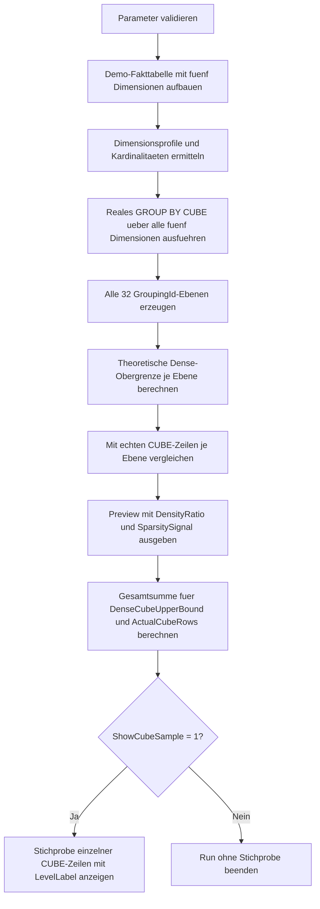

# CubeCrossJoinExplosionPreview.sql

Dieses Skript zeigt an einer kleinen Umsatz-Fakttabelle, wie schnell die Anzahl moeglicher Gruppen in `GROUP BY CUBE(...)` waechst. Es stellt eine theoretisch dichte Kreuzprodukt-Annahme den tatsaechlich vorhandenen CUBE-Zeilen gegenueber und macht dadurch Sparsity im Ergebnis sichtbar.

## Uebersicht

<!-- SQLDOC:SUMMARY_TABLE:BEGIN -->
| Feld | Wert |
|---|---|
| Script | [CubeCrossJoinExplosionPreview.sql](CubeCrossJoinExplosionPreview.sql) |
| Version | `1.0` |
| Typ | `didactic-lab` |
| Kapitel | `18_Cube_Rollup` |
| Sicherheit | `read-only-tempdb` |
| Zweck | Macht die Groessenwirkung vieler Dimensionen in CUBE-Abfragen sichtbar. |
<!-- SQLDOC:SUMMARY_TABLE:END -->

## Einordnung

Der Fokus liegt nicht auf Performance-Messung im Execution Plan, sondern auf einer didaktischen Vorschau: Wie viele Gruppierungsebenen existieren bei fuenf Dimensionen, wie gross waere ein dichter CUBE theoretisch, und wie viele Zeilen entstehen in einem sparsamen Datensatz wirklich?

## Annahmen

- Es handelt sich um eine didaktische Erstversion mit tempdb-basierten Demo-Daten.
- Das Skript verwendet genau fuenf Dimensionen: `RegionCode`, `ProductGroup`, `SalesChannel`, `FiscalQuarter` und `CustomerSegment`.
- Die Faktentabelle ist absichtlich nicht dicht besetzt, damit der Unterschied zwischen dichter Obergrenze und realem CUBE-Ergebnis sichtbar bleibt.
- Die Vorschau quantifiziert Kombinationsgroessen ueber Kardinalitaeten und `GROUPING_ID()`, nicht ueber produktive Lasttests.

## Anwendungsfall

Das Skript eignet sich fuer Unterricht und Review-Situationen, in denen erklaert werden soll, warum `CUBE` bei vielen Dimensionen schnell sehr viele Ebenen und potenzielle Gruppen erzeugt. Besonders nuetzlich ist es vor Diskussionen ueber Alternativen wie `GROUPING SETS` oder uebereine gezieltere Auswahl von Aggregationsebenen.

## Parameter

<!-- SQLDOC:PARAMETERS_TABLE:BEGIN -->
| Parameter | SQL-Typ | Pflicht | Beschreibung |
|---|---|---|---|
| `@ShowCubeSample` | `BIT` | Nein | Gibt bei `1` eine kleine Stichprobe echter CUBE-Zeilen mit Ebenenlabel aus. |
| `@ShowOnlyLargestLevels` | `BIT` | Nein | Beschraenkt die Vorschau bei `1` auf Ebenen mit mindestens vier Detaildimensionen. |
<!-- SQLDOC:PARAMETERS_TABLE:END -->

## Abhaengigkeiten

<!-- SQLDOC:DEPENDENCIES_LIST:BEGIN -->
- `tempdb` fuer Demo-Fakttabelle und Zwischenergebnisse
- `GROUP BY CUBE`
- `GROUPING_ID`
- rekursive CTE fuer die 32 Gruppierungsebenen
- rein lokaler Demo-Datensatz ohne produktive Objekte
<!-- SQLDOC:DEPENDENCIES_LIST:END -->

## Hinweise

- `TheoreticalDenseRows` beschreibt die Obergrenze, wenn jede Kombination der aktiven Dimensionsmitglieder auch wirklich in den Faktdaten vorkommt.
- `ActualCubeRows` zaehlt dagegen nur die in der Demo-Faktentabelle tatsaechlich erzeugten Gruppen.
- `DensityRatio` macht sichtbar, ob eine Ebene fast dicht ist oder nur einen kleinen Teil der moeglichen Kreuzprodukt-Kombinationen nutzt.
- Die optionale Stichprobe hilft beim Lesen von `GROUPING_ID()` und bei der Unterscheidung zwischen Detail-, Subtotal- und Grand-Total-Zeilen.

## Versionshistorie

<!-- SQLDOC:VERSION_HISTORY_TABLE:BEGIN -->
| Version | Datum | User | Beschreibung |
|---|---|---|---|
| `1.0` | `2026-04-19` | `ER` | Erstversion der didaktischen Vorschau fuer CUBE-Ebenenexplosion |
<!-- SQLDOC:VERSION_HISTORY_TABLE:END -->

## Ablauf

<!-- SQLDOC:MERMAID:BEGIN -->

<!-- SQLDOC:MERMAID:END -->

## SQL-Code

<!-- SQLDOC:SQL_CODE:BEGIN -->
```sql`r`n/*
BEGIN:SQL-HEADER v1
---
sql_header: v1
script_name: "CubeCrossJoinExplosionPreview.sql"
script_version: "1.0"
script_type: "didactic-lab"
chapter: "18_Cube_Rollup"

purpose: >
  Macht die Groessenwirkung vieler Dimensionen in CUBE-Abfragen sichtbar,
  indem eine kleine Demo-Fakttabelle sowohl theoretische Obergrenzen als auch
  tatsaechlich erzeugte CUBE-Zeilen gegenueberstellt.

parameters:
  - name: "@ShowCubeSample"
    sql_type: "BIT"
    direction: "IN"
    required: false
    description: "1 = eine kleine Auswahl echter CUBE-Zeilen anzeigen"
  - name: "@ShowOnlyLargestLevels"
    sql_type: "BIT"
    direction: "IN"
    required: false
    description: "1 = nur die groessten Gruppierungsebenen in der Vorschau zeigen"

result_sets:
  - name: "DimensionProfile"
    description: "Kardinalitaeten der verwendeten Dimensionen und die potenzielle Dichte des CUBE"
  - name: "CubeExplosionPreview"
    description: "Vergleich zwischen theoretischer Obergrenze und tatsaechlichen CUBE-Zeilen je Ebene"
  - name: "CubeSummary"
    description: "Gesamtzusammenfassung zur Kombinationszahl und Sparsity"
  - name: "CubeSample"
    description: "Optionale Stichprobe einzelner CUBE-Zeilen mit Ebenenlabel"

dependencies:
  - "tempdb temporary tables"
  - "GROUP BY CUBE"
  - "GROUPING_ID"
  - "recursive CTE"
  - "dynamic SQL-free demo dataset"

safety:
  level: "read-only-tempdb"
  writes_data: false

documentation:
  markdown_file: "T-SQL/18_Cube_Rollup/SQLScripts/CubeCrossJoinExplosionPreview.md"
  sync_blocks:
    - "SUMMARY_TABLE"
    - "PARAMETERS_TABLE"
    - "DEPENDENCIES_LIST"
    - "VERSION_HISTORY_TABLE"
    - "SQL_CODE"
  mermaid:
    mode: "ai-agent-from-sql"
    source: "script-body"

main_responsible:
  name: "Erhard Rainer"
  initials: "ER"

version_history:
  - version: "1.0"
    date: "2026-04-19"
    user: "ER"
    description: "Erstversion der didaktischen Vorschau fuer CUBE-Ebenenexplosion"

notes:
  - "Die Faktendaten sind absichtlich sparsam besetzt, damit der Unterschied zwischen dichter Kreuzprodukt-Annahme und realem Ergebnis sichtbar wird"
  - "Die Vorschau verwendet genau fuenf Dimensionen und erzeugt damit 32 Gruppierungsebenen"
---
END:SQL-HEADER v1
*/

SET NOCOUNT ON;

DECLARE @ShowCubeSample BIT = 1;
DECLARE @ShowOnlyLargestLevels BIT = 0;

IF @ShowCubeSample NOT IN (0, 1)
BEGIN
    THROW 50000, '@ShowCubeSample muss 0 oder 1 sein.', 1;
END;

IF @ShowOnlyLargestLevels NOT IN (0, 1)
BEGIN
    THROW 50001, '@ShowOnlyLargestLevels muss 0 oder 1 sein.', 1;
END;

DROP TABLE IF EXISTS #CubeFact;
DROP TABLE IF EXISTS #DimensionProfile;
DROP TABLE IF EXISTS #CubeResult;

CREATE TABLE #CubeFact
(
    RegionCode       VARCHAR(20)   NOT NULL,
    ProductGroup     VARCHAR(30)   NOT NULL,
    SalesChannel     VARCHAR(20)   NOT NULL,
    FiscalQuarter    VARCHAR(10)   NOT NULL,
    CustomerSegment  VARCHAR(20)   NOT NULL,
    RevenueAmount    DECIMAL(12,2) NOT NULL
);

INSERT INTO #CubeFact
(
    RegionCode,
    ProductGroup,
    SalesChannel,
    FiscalQuarter,
    CustomerSegment,
    RevenueAmount
)
VALUES
    ('North', 'Hardware', 'Store',  '2026-Q1', 'SMB',        12500.00),
    ('North', 'Hardware', 'Store',  '2026-Q1', 'Enterprise', 18200.00),
    ('North', 'Hardware', 'Online', '2026-Q2', 'SMB',         9100.00),
    ('North', 'Services', 'Online', '2026-Q2', 'Enterprise', 13800.00),
    ('North', 'Training', 'Partner','2026-Q3', 'Education',   7600.00),
    ('South', 'Hardware', 'Store',  '2026-Q1', 'Enterprise', 15400.00),
    ('South', 'Services', 'Online', '2026-Q2', 'Enterprise', 16700.00),
    ('South', 'Services', 'Partner','2026-Q3', 'Public',     11950.00),
    ('South', 'Training', 'Partner','2026-Q4', 'Education',   8450.00),
    ('West',  'Hardware', 'Online', '2026-Q1', 'SMB',        14300.00),
    ('West',  'Hardware', 'Online', '2026-Q2', 'Enterprise', 12150.00),
    ('West',  'Services', 'Store',  '2026-Q3', 'Public',      9800.00),
    ('West',  'Training', 'Partner','2026-Q4', 'Education',   7050.00),
    ('Central','Services','Store',  '2026-Q2', 'SMB',        11200.00),
    ('Central','Hardware','Partner','2026-Q4', 'Public',      9300.00),
    ('Central','Training','Online', '2026-Q4', 'Education',   6900.00);

CREATE TABLE #DimensionProfile
(
    DimensionOrder   INT          NOT NULL,
    DimensionName    VARCHAR(40)  NOT NULL,
    DistinctMembers  INT          NOT NULL
);

INSERT INTO #DimensionProfile
(
    DimensionOrder,
    DimensionName,
    DistinctMembers
)
SELECT 1, 'RegionCode', COUNT(DISTINCT RegionCode) FROM #CubeFact
UNION ALL
SELECT 2, 'ProductGroup', COUNT(DISTINCT ProductGroup) FROM #CubeFact
UNION ALL
SELECT 3, 'SalesChannel', COUNT(DISTINCT SalesChannel) FROM #CubeFact
UNION ALL
SELECT 4, 'FiscalQuarter', COUNT(DISTINCT FiscalQuarter) FROM #CubeFact
UNION ALL
SELECT 5, 'CustomerSegment', COUNT(DISTINCT CustomerSegment) FROM #CubeFact;

SELECT
    dp.DimensionOrder,
    dp.DimensionName,
    dp.DistinctMembers,
    POWER(CAST(2 AS BIGINT), (SELECT COUNT(*) FROM #DimensionProfile)) AS CubeLevels,
    (SELECT COUNT(*) FROM #CubeFact) AS FactRows
FROM #DimensionProfile AS dp
ORDER BY
    dp.DimensionOrder;

CREATE TABLE #CubeResult
(
    RegionCode            VARCHAR(20)   NULL,
    ProductGroup          VARCHAR(30)   NULL,
    SalesChannel          VARCHAR(20)   NULL,
    FiscalQuarter         VARCHAR(10)   NULL,
    CustomerSegment       VARCHAR(20)   NULL,
    GroupingId            INT           NOT NULL,
    AggregatedDimensions  INT           NOT NULL,
    RevenueAmount         DECIMAL(12,2) NOT NULL
);

INSERT INTO #CubeResult
(
    RegionCode,
    ProductGroup,
    SalesChannel,
    FiscalQuarter,
    CustomerSegment,
    GroupingId,
    AggregatedDimensions,
    RevenueAmount
)
SELECT
    cf.RegionCode,
    cf.ProductGroup,
    cf.SalesChannel,
    cf.FiscalQuarter,
    cf.CustomerSegment,
    GROUPING_ID(
        cf.RegionCode,
        cf.ProductGroup,
        cf.SalesChannel,
        cf.FiscalQuarter,
        cf.CustomerSegment
    ) AS GroupingId,
    GROUPING(cf.RegionCode)
    + GROUPING(cf.ProductGroup)
    + GROUPING(cf.SalesChannel)
    + GROUPING(cf.FiscalQuarter)
    + GROUPING(cf.CustomerSegment) AS AggregatedDimensions,
    SUM(cf.RevenueAmount) AS RevenueAmount
FROM #CubeFact AS cf
GROUP BY CUBE
(
    cf.RegionCode,
    cf.ProductGroup,
    cf.SalesChannel,
    cf.FiscalQuarter,
    cf.CustomerSegment
);

;WITH DimensionBits AS
(
    SELECT 1 AS DimensionOrder, 'RegionCode' AS DimensionName, CAST(16 AS INT) AS GroupingBit
    UNION ALL
    SELECT 2, 'ProductGroup', 8
    UNION ALL
    SELECT 3, 'SalesChannel', 4
    UNION ALL
    SELECT 4, 'FiscalQuarter', 2
    UNION ALL
    SELECT 5, 'CustomerSegment', 1
),
GroupingLevels AS
(
    SELECT
        0 AS GroupingId
    UNION ALL
    SELECT
        gl.GroupingId + 1
    FROM GroupingLevels AS gl
    WHERE gl.GroupingId < 31
),
TheoreticalLevels AS
(
    SELECT
        gl.GroupingId,
        5 - SUM(CASE WHEN (gl.GroupingId & db.GroupingBit) = db.GroupingBit THEN 1 ELSE 0 END) AS ActiveDimensions,
        ISNULL(
            STRING_AGG(
                CASE
                    WHEN (gl.GroupingId & db.GroupingBit) = db.GroupingBit THEN NULL
                    ELSE db.DimensionName
                END,
                ', '
            ) WITHIN GROUP (ORDER BY db.DimensionOrder),
            '(grand total)'
        ) AS DetailDimensions,
        ISNULL(
            STRING_AGG(
                CASE
                    WHEN (gl.GroupingId & db.GroupingBit) = db.GroupingBit THEN db.DimensionName
                    ELSE NULL
                END,
                ', '
            ) WITHIN GROUP (ORDER BY db.DimensionOrder),
            '(none)'
        ) AS AggregatedDimensions,
        CAST(
            EXP(
                SUM(
                    CASE
                        WHEN (gl.GroupingId & db.GroupingBit) = db.GroupingBit THEN 0.0
                        ELSE LOG(CONVERT(FLOAT, dp.DistinctMembers))
                    END
                )
            ) AS BIGINT
        ) AS TheoreticalDenseRows
    FROM GroupingLevels AS gl
    INNER JOIN DimensionBits AS db
        ON 1 = 1
    INNER JOIN #DimensionProfile AS dp
        ON dp.DimensionOrder = db.DimensionOrder
    GROUP BY
        gl.GroupingId
),
ActualLevels AS
(
    SELECT
        cr.GroupingId,
        COUNT(*) AS ActualCubeRows,
        CAST(SUM(cr.RevenueAmount) AS DECIMAL(18,2)) AS TotalRevenueAtLevel
    FROM #CubeResult AS cr
    GROUP BY
        cr.GroupingId
)
SELECT
    tl.GroupingId,
    tl.ActiveDimensions,
    tl.DetailDimensions,
    tl.AggregatedDimensions,
    tl.TheoreticalDenseRows,
    ISNULL(al.ActualCubeRows, 0) AS ActualCubeRows,
    ISNULL(al.TotalRevenueAtLevel, 0.00) AS TotalRevenueAtLevel,
    CAST(
        ISNULL(al.ActualCubeRows, 0) * 1.0
        / NULLIF(tl.TheoreticalDenseRows, 0) AS DECIMAL(9,4)
    ) AS DensityRatio,
    CASE
        WHEN ISNULL(al.ActualCubeRows, 0) = 0 THEN 'missing_in_sparse_data'
        WHEN ISNULL(al.ActualCubeRows, 0) = tl.TheoreticalDenseRows THEN 'dense_level'
        ELSE 'sparse_level'
    END AS SparsitySignal
FROM TheoreticalLevels AS tl
LEFT JOIN ActualLevels AS al
    ON al.GroupingId = tl.GroupingId
WHERE @ShowOnlyLargestLevels = 0
   OR tl.ActiveDimensions >= 4
ORDER BY
    tl.TheoreticalDenseRows DESC,
    tl.GroupingId ASC
OPTION (MAXRECURSION 32);

;WITH DimensionBits AS
(
    SELECT 1 AS DimensionOrder, CAST(16 AS INT) AS GroupingBit
    UNION ALL
    SELECT 2, 8
    UNION ALL
    SELECT 3, 4
    UNION ALL
    SELECT 4, 2
    UNION ALL
    SELECT 5, 1
),
GroupingLevels AS
(
    SELECT 0 AS GroupingId
    UNION ALL
    SELECT GroupingId + 1
    FROM GroupingLevels
    WHERE GroupingId < 31
),
DenseLevels AS
(
    SELECT
        gl.GroupingId,
        CAST(
            EXP(
                SUM(
                    CASE
                        WHEN (gl.GroupingId & db.GroupingBit) = db.GroupingBit THEN 0.0
                        ELSE LOG(CONVERT(FLOAT, dp.DistinctMembers))
                    END
                )
            ) AS BIGINT
        ) AS DenseRows
    FROM GroupingLevels AS gl
    INNER JOIN DimensionBits AS db
        ON 1 = 1
    INNER JOIN #DimensionProfile AS dp
        ON dp.DimensionOrder = db.DimensionOrder
    GROUP BY
        gl.GroupingId
)
SELECT
    (SELECT COUNT(*) FROM #DimensionProfile) AS DimensionCount,
    (SELECT COUNT(*) FROM #CubeFact) AS FactRows,
    (SELECT COUNT(*) FROM #CubeResult) AS ActualCubeRows,
    SUM(dl.DenseRows) AS DenseCubeUpperBound,
    SUM(dl.DenseRows) - (SELECT COUNT(*) FROM #CubeResult) AS MissingSparseRows,
    CAST((SELECT COUNT(*) FROM #CubeResult) * 1.0 / NULLIF(SUM(dl.DenseRows), 0) AS DECIMAL(9,4)) AS OverallDensityRatio,
    MAX(CASE WHEN dl.GroupingId = 0 THEN dl.DenseRows END) AS DenseDetailUpperBound,
    MAX(CASE WHEN dl.GroupingId = 31 THEN dl.DenseRows END) AS DenseGrandTotalRows
FROM DenseLevels AS dl
OPTION (MAXRECURSION 32);

IF @ShowCubeSample = 1
BEGIN
    SELECT TOP (20)
        CASE WHEN cr.RegionCode IS NULL THEN '(all)' ELSE cr.RegionCode END AS RegionCode,
        CASE WHEN cr.ProductGroup IS NULL THEN '(all)' ELSE cr.ProductGroup END AS ProductGroup,
        CASE WHEN cr.SalesChannel IS NULL THEN '(all)' ELSE cr.SalesChannel END AS SalesChannel,
        CASE WHEN cr.FiscalQuarter IS NULL THEN '(all)' ELSE cr.FiscalQuarter END AS FiscalQuarter,
        CASE WHEN cr.CustomerSegment IS NULL THEN '(all)' ELSE cr.CustomerSegment END AS CustomerSegment,
        cr.GroupingId,
        cr.AggregatedDimensions,
        cr.RevenueAmount,
        CASE
            WHEN cr.GroupingId = 31 THEN 'grand_total'
            WHEN cr.AggregatedDimensions = 0 THEN 'detail_level'
            ELSE 'subtotal_level'
        END AS LevelLabel
    FROM #CubeResult AS cr
    ORDER BY
        cr.AggregatedDimensions DESC,
        cr.GroupingId ASC,
        cr.RevenueAmount DESC;
END;
`r`n```
<!-- SQLDOC:SQL_CODE:END -->

