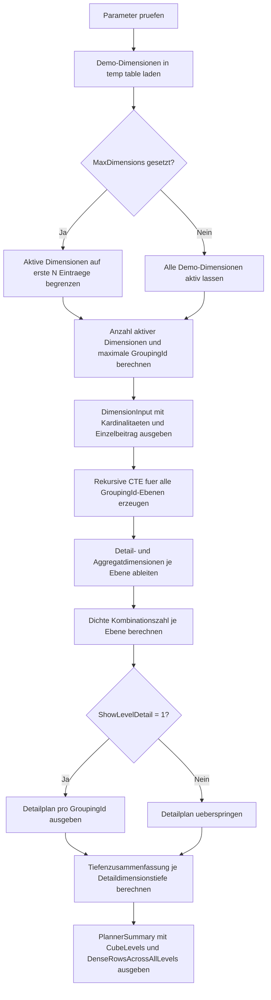

# CubeDimensionCountPlanner.sql

Dieses Skript plant fuer eine kleine Demo-Dimensionsliste, wie viele Gruppierungsebenen und dichte Aggregationskombinationen ein `GROUP BY CUBE(...)` theoretisch erzeugen kann. Der Fokus liegt auf einer didaktischen Obergrenze fuer Reporting- und Modellierungsentscheidungen, nicht auf einem produktiven Lasttest.

## Uebersicht

<!-- SQLDOC:SUMMARY_TABLE:BEGIN -->
| Feld | Wert |
|---|---|
| Script | [CubeDimensionCountPlanner.sql](CubeDimensionCountPlanner.sql) |
| Version | `1.0` |
| Typ | `didactic-lab` |
| Kapitel | `18_Cube_Rollup` |
| Sicherheit | `read-only-tempdb` |
| Zweck | Plant die zu erwartende Anzahl an Aggregationskombinationen in einem Cube. |
<!-- SQLDOC:SUMMARY_TABLE:END -->

## Einordnung

Die Planung geht von einer dichten Kreuzprodukt-Annahme aus: Wenn fuer eine Ebene noch drei Dimensionen aktiv sind, wird so gerechnet, als koennte jede Kombination aller Mitglieder dieser drei Dimensionen auftreten. Dadurch wird sichtbar, warum `CUBE` schon bei wenigen Dimensionen schnell sehr viele Ergebniszeilen annehmen kann.

## Annahmen

- Es handelt sich um eine didaktische Erstversion mit lokalen Demo-Dimensionen statt produktiver Quelltabellen.
- Die Demo startet mit bis zu sechs Dimensionen und ihren angenommenen Kardinalitaeten.
- `DenseCombinationCount` beschreibt eine theoretische Obergrenze je Ebene und nicht die tatsaechliche Sparsity eines realen Faktendatensatzes.
- Mit `@MaxDimensions` kann die Planung bewusst auf die ersten N Dimensionen reduziert werden, um den Wachstumseffekt schrittweise zu erklaeren.

## Anwendungsfall

Das Skript eignet sich fuer Unterricht, Architektur-Reviews und Vorabplanung von Aggregationsabfragen. Es hilft dabei, die Zahl der moeglichen Ebenen in `CUBE` gegenueber handverlesenen `GROUPING SETS` abzuwiegen und die Kosten hoher Dimensionenzahlen frueh zu kommunizieren.

## Parameter

<!-- SQLDOC:PARAMETERS_TABLE:BEGIN -->
| Parameter | SQL-Typ | Pflicht | Beschreibung |
|---|---|---|---|
| `@MaxDimensions` | `TINYINT` | Nein | Begrenzt die Planung auf die ersten N Demo-Dimensionen. |
| `@ShowLevelDetail` | `BIT` | Nein | Gibt bei `1` den Detailplan pro `GroupingId` aus. |
<!-- SQLDOC:PARAMETERS_TABLE:END -->

## Abhaengigkeiten

<!-- SQLDOC:DEPENDENCIES_LIST:BEGIN -->
- `tempdb` fuer die lokale Demo-Dimensionsliste
- `GROUPING_ID`-Semantik zur Interpretation der Ebenenbits
- rekursive CTE fuer die Erzeugung aller `GroupingId`-Werte
- `STRING_AGG` fuer lesbare Dimensionslisten
- `POWER` und logarithmische Produktbildung fuer dichte Kombinationszahlen
<!-- SQLDOC:DEPENDENCIES_LIST:END -->

## Hinweise

- `DenseContributionAcrossCube` zeigt, wie oft eine einzelne Dimension an der theoretischen Gesamtzahl aller Cube-Ebenen mitwirkt.
- Der Detailplan listet fuer jede `GroupingId`, welche Dimensionen noch detailiert bleiben und welche bereits aggregiert sind.
- Die Tiefenzusammenfassung gruppiert alle Ebenen mit gleich vielen verbleibenden Detaildimensionen.
- Die Gesamtsicht liefert eine schnelle Obergrenze fuer die Diskussion, ob `CUBE` noch didaktisch oder fachlich vertretbar ist.

## Versionshistorie

<!-- SQLDOC:VERSION_HISTORY_TABLE:BEGIN -->
| Version | Datum | User | Beschreibung |
|---|---|---|---|
| `1.0` | `2026-04-19` | `ER` | Erstversion fuer die didaktische Planung von CUBE-Kombinationszahlen |
<!-- SQLDOC:VERSION_HISTORY_TABLE:END -->

## Ablauf

<!-- SQLDOC:MERMAID:BEGIN -->

<!-- SQLDOC:MERMAID:END -->

## SQL-Code

<!-- SQLDOC:SQL_CODE:BEGIN -->
```sql
/*
BEGIN:SQL-HEADER v1
---
sql_header: v1
script_name: "CubeDimensionCountPlanner.sql"
script_version: "1.0"
script_type: "didactic-lab"
chapter: "18_Cube_Rollup"

purpose: >
  Plant fuer eine kleine Demo-Dimensionsliste die zu erwartende Anzahl von
  Gruppierungsebenen und dichten Aggregationskombinationen, die ein
  GROUP BY CUBE ueber diese Dimensionen erzeugen kann.

parameters:
  - name: "@MaxDimensions"
    sql_type: "TINYINT"
    direction: "IN"
    required: false
    description: "Begrenzt die Planung auf die ersten N Demo-Dimensionen"
  - name: "@ShowLevelDetail"
    sql_type: "BIT"
    direction: "IN"
    required: false
    description: "1 = Detailplan pro GroupingId ausgeben, 0 = nur Zusammenfassungen"

result_sets:
  - name: "DimensionInput"
    description: "Aktive Demo-Dimensionen mit Kardinalitaeten und Einzelbeitrag"
  - name: "CubeCombinationPlan"
    description: "Dichter Kombinationsplan je GroupingId und Aggregationsebene"
  - name: "LevelSummary"
    description: "Summierte dichte Zeilenzahlen je Anzahl verbleibender Detaildimensionen"
  - name: "PlannerSummary"
    description: "Gesamtsicht auf Ebenenzahl, dichte Obergrenze und groesste Detailebene"

dependencies:
  - "tempdb temporary tables"
  - "GROUPING_ID semantics"
  - "recursive CTE"
  - "STRING_AGG"
  - "POWER"

safety:
  level: "read-only-tempdb"
  writes_data: false

documentation:
  markdown_file: "T-SQL/18_Cube_Rollup/SQLScripts/CubeDimensionCountPlanner.md"
  sync_blocks:
    - "SUMMARY_TABLE"
    - "PARAMETERS_TABLE"
    - "DEPENDENCIES_LIST"
    - "VERSION_HISTORY_TABLE"
    - "SQL_CODE"
  mermaid:
    mode: "ai-agent-from-sql"
    source: "script-body"

main_responsible:
  name: "Erhard Rainer"
  initials: "ER"

version_history:
  - version: "1.0"
    date: "2026-04-19"
    user: "ER"
    description: "Erstversion fuer die didaktische Planung von CUBE-Kombinationszahlen"

notes:
  - "Die Planung geht von einer dichten Kreuzprodukt-Annahme je verbleibender Detaildimension aus"
  - "Die Demo verwendet bewusst nur lokale Temp-Objekte und keine produktiven Tabellen"
---
END:SQL-HEADER v1
*/

SET NOCOUNT ON;

DECLARE @MaxDimensions TINYINT = NULL;
DECLARE @ShowLevelDetail BIT = 1;

IF @MaxDimensions IS NOT NULL AND (@MaxDimensions < 1 OR @MaxDimensions > 8)
BEGIN
    THROW 50010, '@MaxDimensions muss zwischen 1 und 8 liegen oder NULL sein.', 1;
END;

IF @ShowLevelDetail NOT IN (0, 1)
BEGIN
    THROW 50011, '@ShowLevelDetail muss 0 oder 1 sein.', 1;
END;

DROP TABLE IF EXISTS #DimensionInput;

CREATE TABLE #DimensionInput
(
    DimensionOrder  TINYINT      NOT NULL PRIMARY KEY,
    DimensionName   VARCHAR(40)  NOT NULL,
    MemberCount     INT          NOT NULL
);

INSERT INTO #DimensionInput
(
    DimensionOrder,
    DimensionName,
    MemberCount
)
VALUES
    (1, 'Region',         4),
    (2, 'ProductGroup',   5),
    (3, 'SalesChannel',   3),
    (4, 'FiscalQuarter',  4),
    (5, 'CustomerSegment',6),
    (6, 'PromotionType',  3);

IF @MaxDimensions IS NOT NULL
BEGIN
    DELETE FROM #DimensionInput
    WHERE DimensionOrder > @MaxDimensions;
END;

IF (SELECT COUNT(*) FROM #DimensionInput) = 0
BEGIN
    THROW 50012, 'Es muss mindestens eine aktive Dimension vorhanden sein.', 1;
END;

DECLARE @DimensionCount INT =
(
    SELECT COUNT(*)
    FROM #DimensionInput
);

IF @DimensionCount > 8
BEGIN
    THROW 50013, 'Die didaktische Planung ist auf hoechstens 8 Dimensionen begrenzt.', 1;
END;

DECLARE @MaxGroupingId INT = POWER(CAST(2 AS INT), @DimensionCount) - 1;

SELECT
    di.DimensionOrder,
    di.DimensionName,
    di.MemberCount,
    CAST(POWER(CAST(2 AS BIGINT), @DimensionCount - 1) * di.MemberCount AS BIGINT) AS DenseContributionAcrossCube,
    @DimensionCount AS ActiveDimensions,
    CAST(POWER(CAST(2 AS BIGINT), @DimensionCount) AS BIGINT) AS CubeLevels
FROM #DimensionInput AS di
ORDER BY
    di.DimensionOrder;

;WITH GroupingLevels AS
(
    SELECT 0 AS GroupingId
    UNION ALL
    SELECT gl.GroupingId + 1
    FROM GroupingLevels AS gl
    WHERE gl.GroupingId < @MaxGroupingId
),
DimensionBits AS
(
    SELECT
        di.DimensionOrder,
        di.DimensionName,
        di.MemberCount,
        CAST(POWER(CAST(2 AS BIGINT), @DimensionCount - di.DimensionOrder) AS INT) AS GroupingBit
    FROM #DimensionInput AS di
),
CombinationPlan AS
(
    SELECT
        gl.GroupingId,
        @DimensionCount
        - SUM(CASE WHEN (gl.GroupingId & db.GroupingBit) = db.GroupingBit THEN 1 ELSE 0 END) AS DetailDimensions,
        ISNULL(
            STRING_AGG(
                CASE
                    WHEN (gl.GroupingId & db.GroupingBit) = db.GroupingBit THEN NULL
                    ELSE db.DimensionName
                END,
                ', '
            ) WITHIN GROUP (ORDER BY db.DimensionOrder),
            '(grand total)'
        ) AS DetailDimensionList,
        ISNULL(
            STRING_AGG(
                CASE
                    WHEN (gl.GroupingId & db.GroupingBit) = db.GroupingBit THEN db.DimensionName
                    ELSE NULL
                END,
                ', '
            ) WITHIN GROUP (ORDER BY db.DimensionOrder),
            '(none)'
        ) AS AggregatedDimensionList,
        CAST(
            EXP(
                SUM(
                    CASE
                        WHEN (gl.GroupingId & db.GroupingBit) = db.GroupingBit THEN 0.0
                        ELSE LOG(CONVERT(FLOAT, db.MemberCount))
                    END
                )
            ) AS BIGINT
        ) AS DenseCombinationCount
    FROM GroupingLevels AS gl
    CROSS JOIN DimensionBits AS db
    GROUP BY
        gl.GroupingId
)
SELECT
    cp.GroupingId,
    cp.DetailDimensions,
    cp.DetailDimensionList,
    cp.AggregatedDimensionList,
    cp.DenseCombinationCount,
    SUM(cp.DenseCombinationCount) OVER () AS DenseRowsAcrossAllLevels,
    CAST(
        cp.DenseCombinationCount * 1.0
        / NULLIF(SUM(cp.DenseCombinationCount) OVER (), 0) AS DECIMAL(9,4)
    ) AS ShareOfDenseRows
FROM CombinationPlan AS cp
WHERE @ShowLevelDetail = 1
ORDER BY
    cp.DenseCombinationCount DESC,
    cp.GroupingId ASC
OPTION (MAXRECURSION 256);

;WITH GroupingLevels AS
(
    SELECT 0 AS GroupingId
    UNION ALL
    SELECT gl.GroupingId + 1
    FROM GroupingLevels AS gl
    WHERE gl.GroupingId < @MaxGroupingId
),
DimensionBits AS
(
    SELECT
        di.DimensionOrder,
        di.DimensionName,
        di.MemberCount,
        CAST(POWER(CAST(2 AS BIGINT), @DimensionCount - di.DimensionOrder) AS INT) AS GroupingBit
    FROM #DimensionInput AS di
),
CombinationPlan AS
(
    SELECT
        gl.GroupingId,
        @DimensionCount
        - SUM(CASE WHEN (gl.GroupingId & db.GroupingBit) = db.GroupingBit THEN 1 ELSE 0 END) AS DetailDimensions,
        CAST(
            EXP(
                SUM(
                    CASE
                        WHEN (gl.GroupingId & db.GroupingBit) = db.GroupingBit THEN 0.0
                        ELSE LOG(CONVERT(FLOAT, db.MemberCount))
                    END
                )
            ) AS BIGINT
        ) AS DenseCombinationCount
    FROM GroupingLevels AS gl
    CROSS JOIN DimensionBits AS db
    GROUP BY
        gl.GroupingId
)
SELECT
    cp.DetailDimensions,
    COUNT(*) AS LevelsAtThisDepth,
    MIN(cp.DenseCombinationCount) AS MinDenseRows,
    MAX(cp.DenseCombinationCount) AS MaxDenseRows,
    SUM(cp.DenseCombinationCount) AS DenseRowsAtThisDepth
FROM CombinationPlan AS cp
GROUP BY
    cp.DetailDimensions
ORDER BY
    cp.DetailDimensions DESC;

;WITH GroupingLevels AS
(
    SELECT 0 AS GroupingId
    UNION ALL
    SELECT gl.GroupingId + 1
    FROM GroupingLevels AS gl
    WHERE gl.GroupingId < @MaxGroupingId
),
DimensionBits AS
(
    SELECT
        di.DimensionOrder,
        di.MemberCount,
        CAST(POWER(CAST(2 AS BIGINT), @DimensionCount - di.DimensionOrder) AS INT) AS GroupingBit
    FROM #DimensionInput AS di
),
CombinationPlan AS
(
    SELECT
        gl.GroupingId,
        @DimensionCount
        - SUM(CASE WHEN (gl.GroupingId & db.GroupingBit) = db.GroupingBit THEN 1 ELSE 0 END) AS DetailDimensions,
        CAST(
            EXP(
                SUM(
                    CASE
                        WHEN (gl.GroupingId & db.GroupingBit) = db.GroupingBit THEN 0.0
                        ELSE LOG(CONVERT(FLOAT, db.MemberCount))
                    END
                )
            ) AS BIGINT
        ) AS DenseCombinationCount
    FROM GroupingLevels AS gl
    CROSS JOIN DimensionBits AS db
    GROUP BY
        gl.GroupingId
)
SELECT
    @DimensionCount AS ActiveDimensions,
    CAST(POWER(CAST(2 AS BIGINT), @DimensionCount) AS BIGINT) AS CubeLevels,
    SUM(cp.DenseCombinationCount) AS DenseRowsAcrossAllLevels,
    MAX(cp.DenseCombinationCount) AS LargestSingleLevel,
    MIN(cp.DenseCombinationCount) AS SmallestSingleLevel,
    SUM(CASE WHEN cp.DetailDimensions = 0 THEN 1 ELSE 0 END) AS GrandTotalLevels,
    SUM(CASE WHEN cp.DetailDimensions = @DimensionCount THEN 1 ELSE 0 END) AS FullDetailLevels
FROM CombinationPlan AS cp
OPTION (MAXRECURSION 256);
```
<!-- SQLDOC:SQL_CODE:END -->
