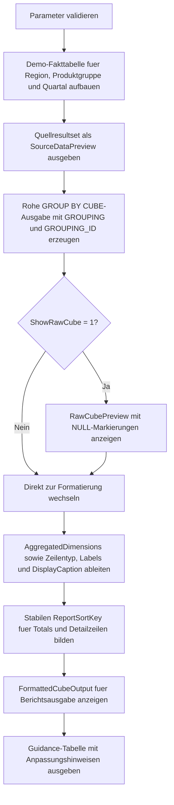

# CubeOutputFormattingTemplate.sql

Dieses Skript liefert eine didaktische Vorlage dafuer, rohe `GROUP BY CUBE(...)`-Ergebnisse in eine lesbare Report-Ausgabe zu ueberfuehren. Statt `NULL`-Werte direkt an Anwender weiterzugeben, erzeugt die Vorlage sprechende Labels, Zeilentypen und eine stabile Sortierlogik fuer Detailzeilen, Subtotals und Grand Totals.

## Uebersicht

<!-- SQLDOC:SUMMARY_TABLE:BEGIN -->
| Feld | Wert |
|---|---|
| Script | [CubeOutputFormattingTemplate.sql](CubeOutputFormattingTemplate.sql) |
| Version | `1.0` |
| Typ | `template` |
| Kapitel | `18_Cube_Rollup` |
| Sicherheit | `read-only-tempdb` |
| Zweck | Vorlage fuer lesbare Cube-Ausgaben in Reports. |
<!-- SQLDOC:SUMMARY_TABLE:END -->

## Einordnung

Der Schwerpunkt liegt auf der Ausgabeform und nicht auf der mathematischen Groesse des CUBE. Die SQL-Datei zeigt einen moeglichen Zwischenstand fuer Reporting: zuerst entsteht eine rohe CUBE-Menge, danach werden Zeilentypen, Sammelbeschriftungen und Sortierhilfen abgeleitet, die sich spaeter in SSRS, Power BI, Exporten oder selbstgebauten Report-Views weiterverwenden lassen.

## Annahmen

- Es handelt sich um ein didaktisches Template mit einer kleinen tempdb-basierten Umsatzsicht.
- Das Beispiel verwendet drei Dimensionen: `RegionCode`, `ProductGroup` und `FiscalQuarter`.
- Die Caption-Logik ist bewusst generisch gehalten und kann fuer reale Fachbegriffe oder Hierarchien erweitert werden.
- `@GrandTotalLabel` zeigt, wie eine Berichtsausgabe sprachlich an Zielgruppen angepasst werden kann, ohne die eigentliche CUBE-Logik zu veraendern.

## Anwendungsfall

Das Skript eignet sich fuer Unterricht, Reviews und erste Report-Prototypen, wenn `CUBE`-Ergebnisse zwar technisch korrekt vorliegen, aber noch in eine lesbare Form ueberfuehrt werden muessen. Besonders hilfreich ist es bei der Diskussion, welche Sammelbezeichnungen, Sortierregeln und Zeilentypen ein Bericht benoetigt, damit Totals und Subtotals nicht wie ungefilterte Datenbankwerte wirken.

## Parameter

<!-- SQLDOC:PARAMETERS_TABLE:BEGIN -->
| Parameter | SQL-Typ | Pflicht | Beschreibung |
|---|---|---|---|
| `@ShowRawCube` | `BIT` | Nein | Gibt bei `1` zusaetzlich die rohe CUBE-Ausgabe mit `GROUPING`-Markierungen aus. |
| `@UseIndentedLabels` | `BIT` | Nein | Rueckt bei `1` nicht-grand-total Zeilen fuer reportartige Darstellungen leicht ein. |
| `@GrandTotalLabel` | `VARCHAR(40)` | Nein | Legt die Bezeichnung fuer die Grand-Total-Zeile fest. |
<!-- SQLDOC:PARAMETERS_TABLE:END -->

## Abhaengigkeiten

<!-- SQLDOC:DEPENDENCIES_LIST:BEGIN -->
- `tempdb` fuer Demo-Faktdaten und Zwischentabellen
- `GROUP BY CUBE`
- `GROUPING`
- `GROUPING_ID`
- `CASE`
<!-- SQLDOC:DEPENDENCIES_LIST:END -->

## Hinweise

- Die Vorlage trennt bewusst rohe Aggregation (`#CubeRaw`) und lesbare Report-Sicht (`#FormattedCube`).
- `DisplayCaption` dient als kompakter Text fuer Tabellen, Exporte oder Matrixberichte.
- `AggregatedDimensions` zeigt an, wie viele der drei CUBE-Dimensionen in einer Zeile bereits aufgerollt wurden.
- `ReportSortKey` ist kein sichtbares Fachfeld, sondern eine technische Hilfe fuer stabile Berichtssortierung.
- Fuer produktive Szenarien laesst sich die gleiche Struktur mit echten Dimensionstabellen oder sprachabhaengigen Labels ergaenzen.

## Versionshistorie

<!-- SQLDOC:VERSION_HISTORY_TABLE:BEGIN -->
| Version | Datum | User | Beschreibung |
|---|---|---|---|
| `1.0` | `2026-04-19` | `ER` | Erstversion des Templates fuer lesbare CUBE-Ausgaben in Reports |
<!-- SQLDOC:VERSION_HISTORY_TABLE:END -->

## Ablauf

<!-- SQLDOC:MERMAID:BEGIN -->

<!-- SQLDOC:MERMAID:END -->

## SQL-Code

<!-- SQLDOC:SQL_CODE:BEGIN -->
```sql
/*
BEGIN:SQL-HEADER v1
---
sql_header: v1
script_name: "CubeOutputFormattingTemplate.sql"
script_version: "1.0"
script_type: "template"
chapter: "18_Cube_Rollup"

purpose: >
  Liefert eine didaktische Vorlage fuer lesbare CUBE-Ausgaben in Reports,
  indem rohe Subtotal-Zeilen mit sprechenden Labels, Sortierlogik und
  Ausgabe-Hinweisen fuer eine kleine Demo-Umsatzsicht aufbereitet werden.

parameters:
  - name: "@ShowRawCube"
    sql_type: "BIT"
    direction: "IN"
    required: false
    description: "1 = zunaechst die rohe CUBE-Ausgabe mit NULL-Markierungen anzeigen"
  - name: "@UseIndentedLabels"
    sql_type: "BIT"
    direction: "IN"
    required: false
    description: "1 = Detailzeilen und Subtotals fuer Reports leicht eingerueckt darstellen"
  - name: "@GrandTotalLabel"
    sql_type: "VARCHAR(40)"
    direction: "IN"
    required: false
    description: "Bezeichnung fuer die Grand-Total-Zeile in der formatierten Ausgabe"

result_sets:
  - name: "SourceDataPreview"
    description: "Didaktische Faktensicht fuer Region, Produktgruppe und Quartal"
  - name: "RawCubePreview"
    description: "Optionale rohe CUBE-Zeilen mit Grouping-Merkmalen"
  - name: "FormattedCubeOutput"
    description: "Lesbar formatierte Report-Sicht mit Labels, Zeilentypen und Sortierschluessel"
  - name: "FormattingGuidance"
    description: "Knappe Hinweise, wie das Template fuer reale Reports angepasst werden kann"

dependencies:
  - "tempdb temporary tables"
  - "GROUP BY CUBE"
  - "GROUPING"
  - "GROUPING_ID"
  - "CASE"

safety:
  level: "read-only-tempdb"
  writes_data: false

documentation:
  markdown_file: "T-SQL/18_Cube_Rollup/SQLScripts/CubeOutputFormattingTemplate.md"
  sync_blocks:
    - "SUMMARY_TABLE"
    - "PARAMETERS_TABLE"
    - "DEPENDENCIES_LIST"
    - "VERSION_HISTORY_TABLE"
    - "SQL_CODE"
  mermaid:
    mode: "ai-agent-from-sql"
    source: "script-body"

main_responsible:
  name: "Erhard Rainer"
  initials: "ER"

version_history:
  - version: "1.0"
    date: "2026-04-19"
    user: "ER"
    description: "Erstversion des Templates fuer lesbare CUBE-Ausgaben in Reports"

notes:
  - "Das Template nutzt eine kleine Demo-Faktentabelle und schreibt nicht in produktive Objekte"
  - "Die Formatierung orientiert sich an typischen Report-Anforderungen fuer Detailzeilen, Subtotals und Grand Totals"
---
END:SQL-HEADER v1
*/

SET NOCOUNT ON;

DECLARE @ShowRawCube BIT = 0;
DECLARE @UseIndentedLabels BIT = 1;
DECLARE @GrandTotalLabel VARCHAR(40) = 'Grand Total';

IF @ShowRawCube NOT IN (0, 1)
BEGIN
    THROW 50020, '@ShowRawCube muss 0 oder 1 sein.', 1;
END;

IF @UseIndentedLabels NOT IN (0, 1)
BEGIN
    THROW 50021, '@UseIndentedLabels muss 0 oder 1 sein.', 1;
END;

IF NULLIF(LTRIM(RTRIM(@GrandTotalLabel)), '') IS NULL
BEGIN
    THROW 50022, '@GrandTotalLabel darf nicht leer sein.', 1;
END;

DROP TABLE IF EXISTS #SalesFact;
DROP TABLE IF EXISTS #CubeRaw;
DROP TABLE IF EXISTS #FormattedCube;
DROP TABLE IF EXISTS #FormattingGuidance;

CREATE TABLE #SalesFact
(
    RegionCode      VARCHAR(20)   NOT NULL,
    ProductGroup    VARCHAR(30)   NOT NULL,
    FiscalQuarter   VARCHAR(10)   NOT NULL,
    RevenueAmount   DECIMAL(12,2) NOT NULL
);

INSERT INTO #SalesFact
(
    RegionCode,
    ProductGroup,
    FiscalQuarter,
    RevenueAmount
)
VALUES
    ('North',  'Hardware', '2026-Q1', 12500.00),
    ('North',  'Hardware', '2026-Q2', 11850.00),
    ('North',  'Services', '2026-Q1',  9700.00),
    ('North',  'Services', '2026-Q2', 10300.00),
    ('South',  'Hardware', '2026-Q1', 13200.00),
    ('South',  'Hardware', '2026-Q2', 14050.00),
    ('South',  'Training', '2026-Q2',  6900.00),
    ('West',   'Hardware', '2026-Q1', 11100.00),
    ('West',   'Services', '2026-Q2',  8400.00),
    ('West',   'Training', '2026-Q3',  7600.00),
    ('Central','Hardware', '2026-Q1',  9800.00),
    ('Central','Services', '2026-Q3',  9150.00);

SELECT
    sf.RegionCode,
    sf.ProductGroup,
    sf.FiscalQuarter,
    sf.RevenueAmount
FROM #SalesFact AS sf
ORDER BY
    sf.RegionCode,
    sf.ProductGroup,
    sf.FiscalQuarter;

CREATE TABLE #CubeRaw
(
    RegionCode             VARCHAR(20)   NULL,
    ProductGroup           VARCHAR(30)   NULL,
    FiscalQuarter          VARCHAR(10)   NULL,
    RevenueAmount          DECIMAL(12,2) NOT NULL,
    GroupingId             INT           NOT NULL,
    IsRegionAggregated     BIT           NOT NULL,
    IsProductAggregated    BIT           NOT NULL,
    IsQuarterAggregated    BIT           NOT NULL,
    AggregatedDimensions   TINYINT       NOT NULL
);

INSERT INTO #CubeRaw
(
    RegionCode,
    ProductGroup,
    FiscalQuarter,
    RevenueAmount,
    GroupingId,
    IsRegionAggregated,
    IsProductAggregated,
    IsQuarterAggregated,
    AggregatedDimensions
)
SELECT
    sf.RegionCode,
    sf.ProductGroup,
    sf.FiscalQuarter,
    SUM(sf.RevenueAmount) AS RevenueAmount,
    GROUPING_ID
    (
        sf.RegionCode,
        sf.ProductGroup,
        sf.FiscalQuarter
    ) AS GroupingId,
    GROUPING(sf.RegionCode) AS IsRegionAggregated,
    GROUPING(sf.ProductGroup) AS IsProductAggregated,
    GROUPING(sf.FiscalQuarter) AS IsQuarterAggregated,
    GROUPING(sf.RegionCode)
    + GROUPING(sf.ProductGroup)
    + GROUPING(sf.FiscalQuarter) AS AggregatedDimensions
FROM #SalesFact AS sf
GROUP BY CUBE
(
    sf.RegionCode,
    sf.ProductGroup,
    sf.FiscalQuarter
);

IF @ShowRawCube = 1
BEGIN
    SELECT
        cr.RegionCode,
        cr.ProductGroup,
        cr.FiscalQuarter,
        cr.RevenueAmount,
        cr.GroupingId,
        cr.IsRegionAggregated,
        cr.IsProductAggregated,
        cr.IsQuarterAggregated,
        cr.AggregatedDimensions
    FROM #CubeRaw AS cr
    ORDER BY
        cr.GroupingId,
        cr.RegionCode,
        cr.ProductGroup,
        cr.FiscalQuarter;
END;

CREATE TABLE #FormattedCube
(
    RowType              VARCHAR(20)   NOT NULL,
    ReportLevel          TINYINT       NOT NULL,
    DisplayCaption       VARCHAR(200)  NOT NULL,
    RegionLabel          VARCHAR(40)   NOT NULL,
    ProductGroupLabel    VARCHAR(50)   NOT NULL,
    FiscalQuarterLabel   VARCHAR(30)   NOT NULL,
    RevenueAmount        DECIMAL(12,2) NOT NULL,
    GroupingId           INT           NOT NULL,
    ReportSortKey        VARCHAR(40)   NOT NULL
);

INSERT INTO #FormattedCube
(
    RowType,
    ReportLevel,
    DisplayCaption,
    RegionLabel,
    ProductGroupLabel,
    FiscalQuarterLabel,
    RevenueAmount,
    GroupingId,
    ReportSortKey
)
SELECT
    CASE
        WHEN cr.AggregatedDimensions = 3 THEN 'grand_total'
        WHEN cr.AggregatedDimensions > 0 THEN 'subtotal'
        ELSE 'detail'
    END AS RowType,
    CASE
        WHEN cr.AggregatedDimensions = 0 THEN 0
        WHEN cr.AggregatedDimensions < 3 THEN 1
        ELSE 2
    END AS ReportLevel,
    CASE
        WHEN cr.AggregatedDimensions = 3 THEN @GrandTotalLabel
        WHEN cr.AggregatedDimensions > 0 THEN CONCAT(
            'Subtotal fuer ',
            CASE WHEN cr.IsRegionAggregated = 0 THEN CONCAT('Region ', cr.RegionCode) ELSE '' END,
            CASE WHEN cr.IsRegionAggregated = 0 AND cr.IsProductAggregated = 0 THEN ' / ' ELSE '' END,
            CASE WHEN cr.IsProductAggregated = 0 THEN CONCAT('Produktgruppe ', cr.ProductGroup) ELSE '' END,
            CASE
                WHEN (cr.IsRegionAggregated = 0 OR cr.IsProductAggregated = 0) AND cr.IsQuarterAggregated = 0 THEN ' / '
                ELSE ''
            END,
            CASE WHEN cr.IsQuarterAggregated = 0 THEN CONCAT('Quartal ', cr.FiscalQuarter) ELSE '' END
        )
        ELSE CONCAT('Detail ', cr.RegionCode, ' / ', cr.ProductGroup, ' / ', cr.FiscalQuarter)
    END AS DisplayCaption,
    CASE
        WHEN cr.IsRegionAggregated = 1 THEN '(alle Regionen)'
        WHEN @UseIndentedLabels = 1 AND cr.GroupingId <> 0 THEN CONCAT('  ', cr.RegionCode)
        ELSE cr.RegionCode
    END AS RegionLabel,
    CASE
        WHEN cr.IsProductAggregated = 1 THEN '(alle Produktgruppen)'
        WHEN @UseIndentedLabels = 1 AND cr.GroupingId <> 0 THEN CONCAT('  ', cr.ProductGroup)
        ELSE cr.ProductGroup
    END AS ProductGroupLabel,
    CASE
        WHEN cr.IsQuarterAggregated = 1 THEN '(alle Quartale)'
        WHEN @UseIndentedLabels = 1 AND cr.GroupingId <> 0 THEN CONCAT('  ', cr.FiscalQuarter)
        ELSE cr.FiscalQuarter
    END AS FiscalQuarterLabel,
    cr.RevenueAmount,
    cr.GroupingId,
    CONCAT(
        CASE
            WHEN cr.AggregatedDimensions = 0 THEN '0'
            WHEN cr.AggregatedDimensions < 3 THEN '1'
            ELSE '2'
        END,
        '-',
        COALESCE(cr.RegionCode, 'ZZZ'),
        '-',
        COALESCE(cr.ProductGroup, 'ZZZ'),
        '-',
        COALESCE(cr.FiscalQuarter, 'ZZZ'),
        '-',
        RIGHT(CONCAT('00', cr.GroupingId), 2)
    ) AS ReportSortKey
FROM #CubeRaw AS cr;

SELECT
    fc.RowType,
    fc.ReportLevel,
    fc.DisplayCaption,
    fc.RegionLabel,
    fc.ProductGroupLabel,
    fc.FiscalQuarterLabel,
    fc.RevenueAmount,
    fc.GroupingId,
    fc.ReportSortKey
FROM #FormattedCube AS fc
ORDER BY
    fc.ReportSortKey;

CREATE TABLE #FormattingGuidance
(
    StepNumber        INT           NOT NULL,
    GuidanceFocus     VARCHAR(80)   NOT NULL,
    Recommendation    VARCHAR(260)  NOT NULL
);

INSERT INTO #FormattingGuidance
(
    StepNumber,
    GuidanceFocus,
    Recommendation
)
VALUES
    (1, 'Labels', 'Ersetze NULL-Werte aus CUBE systematisch durch lesbare Sammelbezeichnungen wie (alle Regionen).'),
    (2, 'Row typing', 'Nutze GROUPING() oder GROUPING_ID(), um Detailzeilen, Subtotals und Grand Totals getrennt zu kennzeichnen.'),
    (3, 'Sorting', 'Leite einen stabilen Sortierschluessel ab, damit Grand Total, Subtotals und Detailzeilen im Report konsistent erscheinen.'),
    (4, 'Layout', 'Passe die Caption-Logik oder Einrueckung je Berichtskanal an, statt rohe NULL-Werte an Anwender weiterzugeben.');

SELECT
    fg.StepNumber,
    fg.GuidanceFocus,
    fg.Recommendation
FROM #FormattingGuidance AS fg
ORDER BY
    fg.StepNumber;
```
<!-- SQLDOC:SQL_CODE:END -->
