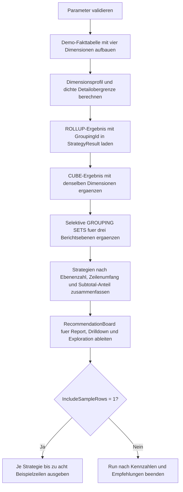

# CubeToRollupCostCompare.sql

Dieses Skript vergleicht fuer eine kleine Umsatzdemo den Ergebnisumfang von `ROLLUP`, `CUBE` und gezielten `GROUPING SETS`. Die Auswertung fokussiert auf didaktische Kostenindikatoren wie Ebenenzahl, Ergebniszeilen und den Anteil zusaetzlicher Subtotals.

## Uebersicht

<!-- SQLDOC:SUMMARY_TABLE:BEGIN -->
| Feld | Wert |
|---|---|
| Script | [CubeToRollupCostCompare.sql](CubeToRollupCostCompare.sql) |
| Version | `1.0` |
| Typ | `didactic-lab` |
| Kapitel | `18_Cube_Rollup` |
| Sicherheit | `read-only-tempdb` |
| Zweck | Vergleicht Ergebnisumfang und Kostenhinweise von `ROLLUP`, `CUBE` und `GROUPING SETS`. |
<!-- SQLDOC:SUMMARY_TABLE:END -->

## Einordnung

Der Vergleich misst keine produktive Serverlaufzeit. Stattdessen zeigt die Demo, wie unterschiedlich breit das Resultset wird, wenn dieselben Faktzeilen einmal hierarchisch mit `ROLLUP`, einmal vollstaendig mit `CUBE` und einmal gezielt mit `GROUPING SETS` aggregiert werden.

## Annahmen

- Es handelt sich um eine didaktische Erstversion mit tempdb-basierten Demo-Daten.
- Die Faktensicht nutzt vier Dimensionen: `RegionCode`, `ProductGroup`, `SalesChannel` und `FiscalQuarter`.
- `GROUPING SETS` bildet absichtlich nur drei fachlich plausible Berichtsebenen plus Grand Total ab.
- `CostSignal` ist ein Lernindikator auf Basis der erzeugten Ergebniszeilen, keine produktive Laufzeitmessung.

## Anwendungsfall

Das Skript eignet sich fuer Unterricht, Architektur-Reviews und Reporting-Diskussionen, wenn entschieden werden soll, ob ein kompletter `CUBE` wirklich noetig ist oder ob ein `ROLLUP`-Pfad oder gezielte `GROUPING SETS` den gleichen Bericht mit weniger Ergebnisballast liefern.

## Parameter

<!-- SQLDOC:PARAMETERS_TABLE:BEGIN -->
| Parameter | SQL-Typ | Pflicht | Beschreibung |
|---|---|---|---|
| `@IncludeSampleRows` | `BIT` | Nein | Gibt bei `1` Beispielzeilen je Aggregationsstrategie aus. |
| `@MinimumRowsForWarning` | `INT` | Nein | Legt den Schwellwert fuer Warnhinweise auf hohes Ergebnisvolumen fest. |
<!-- SQLDOC:PARAMETERS_TABLE:END -->

## Abhaengigkeiten

<!-- SQLDOC:DEPENDENCIES_LIST:BEGIN -->
- `tempdb` fuer Demo-Fakttabelle und Zwischenergebnisse
- `GROUP BY ROLLUP`
- `GROUP BY CUBE`
- `GROUPING SETS`
- `GROUPING_ID`
- `COUNT(DISTINCT ...)`
<!-- SQLDOC:DEPENDENCIES_LIST:END -->

## Hinweise

- `CoverageVsFactRows` setzt die erzeugten Aggregationszeilen ins Verhaeltnis zur Anzahl der Faktzeilen.
- `RowsPerGroupingLevel` zeigt, wie breit die einzelnen Ebenen im Mittel ausfallen.
- `GROUPING SETS` ist hier bewusst selektiv definiert, damit der Unterschied zu `ROLLUP` und `CUBE` klar sichtbar bleibt.
- Das Empfehlungsboard uebersetzt die technischen Kennzahlen in typische Einsatzfaelle fuer Berichte und Exploration.

## Versionshistorie

<!-- SQLDOC:VERSION_HISTORY_TABLE:BEGIN -->
| Version | Datum | User | Beschreibung |
|---|---|---|---|
| `1.0` | `2026-04-19` | `ER` | Erstversion des didaktischen Vergleichs fuer ROLLUP, CUBE und GROUPING SETS |
<!-- SQLDOC:VERSION_HISTORY_TABLE:END -->

## Ablauf

<!-- SQLDOC:MERMAID:BEGIN -->

<!-- SQLDOC:MERMAID:END -->

## SQL-Code

<!-- SQLDOC:SQL_CODE:BEGIN -->
```sql
/*
BEGIN:SQL-HEADER v1
---
sql_header: v1
script_name: "CubeToRollupCostCompare.sql"
script_version: "1.0"
script_type: "didactic-lab"
chapter: "18_Cube_Rollup"

purpose: >
  Vergleicht fuer eine kleine Umsatzdemo den Ergebnisumfang von ROLLUP, CUBE
  und gezielten GROUPING SETS. Das Skript zeigt, wie viele Gruppierungsebenen
  und Ergebniszeilen jede Strategie erzeugt und welche Variante fuer eine
  kompakte Reporting-Absicht meist die geringere Last andeutet.

parameters:
  - name: "@IncludeSampleRows"
    sql_type: "BIT"
    direction: "IN"
    required: false
    description: "1 = Beispielzeilen je Aggregationsstrategie ausgeben"
  - name: "@MinimumRowsForWarning"
    sql_type: "INT"
    direction: "IN"
    required: false
    description: "Schwellwert fuer Warnhinweise auf hohes Ergebnisvolumen"

result_sets:
  - name: "SourceProfile"
    description: "Profil der Demo-Dimensionen und dichte Obergrenze der Detailkombinationen"
  - name: "AggregationStrategyCompare"
    description: "Vergleicht Ebenenzahl, Ergebniszeilen und Verdichtungsgrad von ROLLUP, CUBE und GROUPING SETS"
  - name: "RecommendationBoard"
    description: "Leitet didaktische Empfehlungen aus Umfang und Fokus der Aggregationsstrategie ab"
  - name: "SampleRows"
    description: "Optionale Beispielzeilen mit Gruppierungstiefe und Strategy-Label"

dependencies:
  - "tempdb temporary tables"
  - "GROUP BY ROLLUP"
  - "GROUP BY CUBE"
  - "GROUPING SETS"
  - "GROUPING_ID"
  - "COUNT(DISTINCT ...)"

safety:
  level: "read-only-tempdb"
  writes_data: false

documentation:
  markdown_file: "T-SQL/18_Cube_Rollup/SQLScripts/CubeToRollupCostCompare.md"
  sync_blocks:
    - "SUMMARY_TABLE"
    - "PARAMETERS_TABLE"
    - "DEPENDENCIES_LIST"
    - "VERSION_HISTORY_TABLE"
    - "SQL_CODE"
  mermaid:
    mode: "ai-agent-from-sql"
    source: "script-body"

main_responsible:
  name: "Erhard Rainer"
  initials: "ER"

version_history:
  - version: "1.0"
    date: "2026-04-19"
    user: "ER"
    description: "Erstversion des didaktischen Vergleichs fuer ROLLUP, CUBE und GROUPING SETS"

notes:
  - "Die Demo verwendet eine kleine Faktensicht mit vier Dimensionen und lokalen Temp-Objekten"
  - "GROUPING SETS bildet bewusst nur drei fachlich gezielte Ebenen ab, um die Kosten eines selektiven Designs zu zeigen"
---
END:SQL-HEADER v1
*/

SET NOCOUNT ON;

DECLARE @IncludeSampleRows BIT = 1;
DECLARE @MinimumRowsForWarning INT = 18;

IF @IncludeSampleRows NOT IN (0, 1)
BEGIN
    THROW 50040, '@IncludeSampleRows muss 0 oder 1 sein.', 1;
END;

IF @MinimumRowsForWarning < 1
BEGIN
    THROW 50041, '@MinimumRowsForWarning muss groesser als 0 sein.', 1;
END;

DROP TABLE IF EXISTS #SalesFact;
DROP TABLE IF EXISTS #DimensionProfile;
DROP TABLE IF EXISTS #StrategyResult;
DROP TABLE IF EXISTS #StrategySummary;
DROP TABLE IF EXISTS #RecommendationBoard;

CREATE TABLE #SalesFact
(
    RegionCode      VARCHAR(20)   NOT NULL,
    ProductGroup    VARCHAR(30)   NOT NULL,
    SalesChannel    VARCHAR(20)   NOT NULL,
    FiscalQuarter   VARCHAR(10)   NOT NULL,
    RevenueAmount   DECIMAL(12,2) NOT NULL
);

INSERT INTO #SalesFact
(
    RegionCode,
    ProductGroup,
    SalesChannel,
    FiscalQuarter,
    RevenueAmount
)
VALUES
    ('North',   'Hardware', 'Store',   '2026-Q1', 12600.00),
    ('North',   'Hardware', 'Online',  '2026-Q2',  9400.00),
    ('North',   'Services', 'Partner', '2026-Q3', 11800.00),
    ('South',   'Hardware', 'Store',   '2026-Q1', 13750.00),
    ('South',   'Training', 'Partner', '2026-Q4',  7350.00),
    ('West',    'Services', 'Online',  '2026-Q2', 10100.00),
    ('West',    'Services', 'Store',   '2026-Q3',  9800.00),
    ('West',    'Training', 'Partner', '2026-Q4',  6900.00),
    ('Central', 'Hardware', 'Partner', '2026-Q4',  8700.00),
    ('Central', 'Services', 'Store',   '2026-Q2', 11250.00),
    ('Central', 'Training', 'Online',  '2026-Q4',  6400.00),
    ('South',   'Services', 'Online',  '2026-Q2', 12100.00);

CREATE TABLE #DimensionProfile
(
    DimensionOrder   TINYINT      NOT NULL,
    DimensionName    VARCHAR(40)  NOT NULL,
    DistinctMembers  INT          NOT NULL
);

INSERT INTO #DimensionProfile
(
    DimensionOrder,
    DimensionName,
    DistinctMembers
)
SELECT 1, 'RegionCode', COUNT(DISTINCT sf.RegionCode) FROM #SalesFact AS sf
UNION ALL
SELECT 2, 'ProductGroup', COUNT(DISTINCT sf.ProductGroup) FROM #SalesFact AS sf
UNION ALL
SELECT 3, 'SalesChannel', COUNT(DISTINCT sf.SalesChannel) FROM #SalesFact AS sf
UNION ALL
SELECT 4, 'FiscalQuarter', COUNT(DISTINCT sf.FiscalQuarter) FROM #SalesFact AS sf;

;WITH DenseSummary AS
(
    SELECT
        CAST(EXP(SUM(LOG(CONVERT(FLOAT, dp.DistinctMembers)))) AS BIGINT) AS DenseDetailUpperBound
    FROM #DimensionProfile AS dp
)
SELECT
    dp.DimensionOrder,
    dp.DimensionName,
    dp.DistinctMembers,
    (SELECT COUNT(*) FROM #SalesFact) AS FactRows,
    ds.DenseDetailUpperBound,
    CAST(
        (SELECT COUNT(*) FROM #SalesFact) * 1.0
        / NULLIF(ds.DenseDetailUpperBound, 0) AS DECIMAL(9,4)
    ) AS OccupancyRatio
FROM #DimensionProfile AS dp
CROSS JOIN DenseSummary AS ds
ORDER BY
    dp.DimensionOrder;

CREATE TABLE #StrategyResult
(
    StrategyName          VARCHAR(30)   NOT NULL,
    StrategyLabel         VARCHAR(120)  NOT NULL,
    RegionCode            VARCHAR(20)   NULL,
    ProductGroup          VARCHAR(30)   NULL,
    SalesChannel          VARCHAR(20)   NULL,
    FiscalQuarter         VARCHAR(10)   NULL,
    RevenueAmount         DECIMAL(12,2) NOT NULL,
    GroupingId            INT           NOT NULL,
    AggregatedDimensions  TINYINT       NOT NULL
);

INSERT INTO #StrategyResult
(
    StrategyName,
    StrategyLabel,
    RegionCode,
    ProductGroup,
    SalesChannel,
    FiscalQuarter,
    RevenueAmount,
    GroupingId,
    AggregatedDimensions
)
SELECT
    'ROLLUP',
    'ROLLUP (Region, Product, Channel, Quarter)',
    sf.RegionCode,
    sf.ProductGroup,
    sf.SalesChannel,
    sf.FiscalQuarter,
    SUM(sf.RevenueAmount) AS RevenueAmount,
    GROUPING_ID
    (
        sf.RegionCode,
        sf.ProductGroup,
        sf.SalesChannel,
        sf.FiscalQuarter
    ) AS GroupingId,
    GROUPING(sf.RegionCode)
    + GROUPING(sf.ProductGroup)
    + GROUPING(sf.SalesChannel)
    + GROUPING(sf.FiscalQuarter) AS AggregatedDimensions
FROM #SalesFact AS sf
GROUP BY ROLLUP
(
    sf.RegionCode,
    sf.ProductGroup,
    sf.SalesChannel,
    sf.FiscalQuarter
);

INSERT INTO #StrategyResult
(
    StrategyName,
    StrategyLabel,
    RegionCode,
    ProductGroup,
    SalesChannel,
    FiscalQuarter,
    RevenueAmount,
    GroupingId,
    AggregatedDimensions
)
SELECT
    'CUBE',
    'CUBE (Region, Product, Channel, Quarter)',
    sf.RegionCode,
    sf.ProductGroup,
    sf.SalesChannel,
    sf.FiscalQuarter,
    SUM(sf.RevenueAmount) AS RevenueAmount,
    GROUPING_ID
    (
        sf.RegionCode,
        sf.ProductGroup,
        sf.SalesChannel,
        sf.FiscalQuarter
    ) AS GroupingId,
    GROUPING(sf.RegionCode)
    + GROUPING(sf.ProductGroup)
    + GROUPING(sf.SalesChannel)
    + GROUPING(sf.FiscalQuarter) AS AggregatedDimensions
FROM #SalesFact AS sf
GROUP BY CUBE
(
    sf.RegionCode,
    sf.ProductGroup,
    sf.SalesChannel,
    sf.FiscalQuarter
);

INSERT INTO #StrategyResult
(
    StrategyName,
    StrategyLabel,
    RegionCode,
    ProductGroup,
    SalesChannel,
    FiscalQuarter,
    RevenueAmount,
    GroupingId,
    AggregatedDimensions
)
SELECT
    'GROUPING SETS',
    'GROUPING SETS detail + region-product + channel-quarter + grand total',
    gs.RegionCode,
    gs.ProductGroup,
    gs.SalesChannel,
    gs.FiscalQuarter,
    SUM(gs.RevenueAmount) AS RevenueAmount,
    GROUPING_ID
    (
        gs.RegionCode,
        gs.ProductGroup,
        gs.SalesChannel,
        gs.FiscalQuarter
    ) AS GroupingId,
    GROUPING(gs.RegionCode)
    + GROUPING(gs.ProductGroup)
    + GROUPING(gs.SalesChannel)
    + GROUPING(gs.FiscalQuarter) AS AggregatedDimensions
FROM #SalesFact AS gs
GROUP BY GROUPING SETS
(
    (
        gs.RegionCode,
        gs.ProductGroup,
        gs.SalesChannel,
        gs.FiscalQuarter
    ),
    (
        gs.RegionCode,
        gs.ProductGroup
    ),
    (
        gs.SalesChannel,
        gs.FiscalQuarter
    ),
    ()
);

CREATE TABLE #StrategySummary
(
    StrategyName                VARCHAR(30)   NOT NULL,
    StrategyLabel               VARCHAR(120)  NOT NULL,
    GroupingLevels              INT           NOT NULL,
    TotalRowsProduced           INT           NOT NULL,
    DetailRows                  INT           NOT NULL,
    SubtotalRows                INT           NOT NULL,
    GrandTotalRows              INT           NOT NULL,
    MaxAggregatedDimensions     TINYINT       NOT NULL,
    CoverageVsFactRows          DECIMAL(9,4)  NOT NULL,
    RowsPerGroupingLevel        DECIMAL(9,4)  NOT NULL,
    SuggestedUseCase            VARCHAR(220)  NOT NULL,
    CostSignal                  VARCHAR(30)   NOT NULL,
    Interpretation              VARCHAR(280)  NOT NULL
);

INSERT INTO #StrategySummary
(
    StrategyName,
    StrategyLabel,
    GroupingLevels,
    TotalRowsProduced,
    DetailRows,
    SubtotalRows,
    GrandTotalRows,
    MaxAggregatedDimensions,
    CoverageVsFactRows,
    RowsPerGroupingLevel,
    SuggestedUseCase,
    CostSignal,
    Interpretation
)
SELECT
    sr.StrategyName,
    MIN(sr.StrategyLabel) AS StrategyLabel,
    COUNT(DISTINCT sr.GroupingId) AS GroupingLevels,
    COUNT(*) AS TotalRowsProduced,
    SUM(CASE WHEN sr.AggregatedDimensions = 0 THEN 1 ELSE 0 END) AS DetailRows,
    SUM(CASE WHEN sr.AggregatedDimensions BETWEEN 1 AND 3 THEN 1 ELSE 0 END) AS SubtotalRows,
    SUM(CASE WHEN sr.AggregatedDimensions = 4 THEN 1 ELSE 0 END) AS GrandTotalRows,
    MAX(sr.AggregatedDimensions) AS MaxAggregatedDimensions,
    CAST(COUNT(*) * 1.0 / NULLIF((SELECT COUNT(*) FROM #SalesFact), 0) AS DECIMAL(9,4)) AS CoverageVsFactRows,
    CAST(COUNT(*) * 1.0 / NULLIF(COUNT(DISTINCT sr.GroupingId), 0) AS DECIMAL(9,4)) AS RowsPerGroupingLevel,
    CASE sr.StrategyName
        WHEN 'ROLLUP' THEN 'Hierarchische Drilldown-Pfade mit natuerlicher Reihenfolge'
        WHEN 'CUBE' THEN 'Vollstaendige Exploration aller Dimensionskombinationen'
        ELSE 'Gezielte Berichtsebenen mit bewusst begrenztem Ergebnisumfang'
    END AS SuggestedUseCase,
    CASE
        WHEN COUNT(*) >= @MinimumRowsForWarning THEN 'warning'
        WHEN COUNT(*) >= (@MinimumRowsForWarning / 2.0) THEN 'review'
        ELSE 'lean'
    END AS CostSignal,
    CASE sr.StrategyName
        WHEN 'ROLLUP' THEN 'ROLLUP folgt einem festen Hierarchiepfad. Dadurch entstehen weniger Ebenen als beim CUBE, aber mehr als bei einer bewusst kuratierten Auswahl.'
        WHEN 'CUBE' THEN 'CUBE deckt jede Dimensionskombination ab. Das maximiert Analysefreiheit, vergroessert aber Ergebnisumfang und potenziellen Rechenaufwand am staerksten.'
        ELSE 'Gezielte GROUPING SETS liefern nur die fachlich benoetigten Ebenen und vermeiden zusaetzliche Subtotals ohne erkennbaren Berichtsnutzen.'
    END AS Interpretation
FROM #StrategyResult AS sr
GROUP BY
    sr.StrategyName;

SELECT
    ss.StrategyName,
    ss.StrategyLabel,
    ss.GroupingLevels,
    ss.TotalRowsProduced,
    ss.DetailRows,
    ss.SubtotalRows,
    ss.GrandTotalRows,
    ss.MaxAggregatedDimensions,
    ss.CoverageVsFactRows,
    ss.RowsPerGroupingLevel,
    ss.CostSignal,
    ss.SuggestedUseCase,
    ss.Interpretation
FROM #StrategySummary AS ss
ORDER BY
    CASE ss.StrategyName
        WHEN 'GROUPING SETS' THEN 1
        WHEN 'ROLLUP' THEN 2
        ELSE 3
    END;

CREATE TABLE #RecommendationBoard
(
    PriorityRank       TINYINT       NOT NULL,
    DecisionFocus      VARCHAR(80)   NOT NULL,
    PreferredStrategy  VARCHAR(30)   NOT NULL,
    WhyPreferIt        VARCHAR(260)  NOT NULL,
    EscalateWhen       VARCHAR(220)  NOT NULL
);

INSERT INTO #RecommendationBoard
(
    PriorityRank,
    DecisionFocus,
    PreferredStrategy,
    WhyPreferIt,
    EscalateWhen
)
VALUES
    (1, 'Kompakter Standardreport', 'GROUPING SETS', 'Begrenzt das Ergebnis auf explizit benoetigte Ebenen und reduziert zusaetzliche Subtotals.', 'Wenn spaeter weitere Sichten wirklich benoetigt werden und separat benannt werden koennen.'),
    (2, 'Hierarchische Navigation', 'ROLLUP', 'Passt gut zu natuerlichen Drilldown-Pfaden von links nach rechts in der Dimensionsliste.', 'Wenn Querschnitte ausserhalb der Hierarchie haeufig analysiert werden muessen.'),
    (3, 'Freie Explorationsanalyse', 'CUBE', 'Liefert die groesste Kombinationsabdeckung fuer Ad-hoc-Analysen ueber alle Dimensionen.', 'Wenn Ergebnisumfang, Sparsity oder Laufzeit wichtiger sind als Vollstaendigkeit.');

SELECT
    rb.PriorityRank,
    rb.DecisionFocus,
    rb.PreferredStrategy,
    rb.WhyPreferIt,
    rb.EscalateWhen,
    ss.TotalRowsProduced,
    ss.GroupingLevels,
    ss.CostSignal
FROM #RecommendationBoard AS rb
INNER JOIN #StrategySummary AS ss
    ON ss.StrategyName = rb.PreferredStrategy
ORDER BY
    rb.PriorityRank;

IF @IncludeSampleRows = 1
BEGIN
    ;WITH RankedSamples AS
    (
        SELECT
            sr.StrategyName,
            sr.StrategyLabel,
            sr.RegionCode,
            sr.ProductGroup,
            sr.SalesChannel,
            sr.FiscalQuarter,
            sr.RevenueAmount,
            sr.GroupingId,
            sr.AggregatedDimensions,
            ROW_NUMBER() OVER
            (
                PARTITION BY sr.StrategyName
                ORDER BY
                    sr.AggregatedDimensions DESC,
                    sr.GroupingId ASC,
                    sr.RevenueAmount DESC
            ) AS SampleRank
        FROM #StrategyResult AS sr
    )
    SELECT
        rs.StrategyName,
        rs.StrategyLabel,
        CASE WHEN rs.RegionCode IS NULL THEN '(all regions)' ELSE rs.RegionCode END AS RegionCode,
        CASE WHEN rs.ProductGroup IS NULL THEN '(all product groups)' ELSE rs.ProductGroup END AS ProductGroup,
        CASE WHEN rs.SalesChannel IS NULL THEN '(all channels)' ELSE rs.SalesChannel END AS SalesChannel,
        CASE WHEN rs.FiscalQuarter IS NULL THEN '(all quarters)' ELSE rs.FiscalQuarter END AS FiscalQuarter,
        rs.RevenueAmount,
        rs.GroupingId,
        rs.AggregatedDimensions,
        CASE
            WHEN rs.AggregatedDimensions = 0 THEN 'detail'
            WHEN rs.AggregatedDimensions = 4 THEN 'grand_total'
            ELSE 'subtotal'
        END AS LevelRole
    FROM RankedSamples AS rs
    WHERE rs.SampleRank <= 8
    ORDER BY
        CASE rs.StrategyName
            WHEN 'ROLLUP' THEN 1
            WHEN 'CUBE' THEN 2
            ELSE 3
        END,
        rs.SampleRank;
END;
```
<!-- SQLDOC:SQL_CODE:END -->
