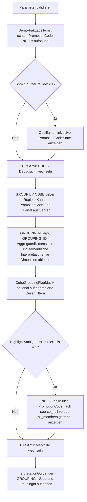

# GroupingFlagsDebugView.sql

Dieses Skript macht `GROUPING()`-Marker in einer etwas komplexeren `CUBE`-Ausgabe lesbar. Der Kernpunkt ist die Trennung zwischen echten Quelldaten-`NULL`s und jenen `NULL`s, die nur deshalb erscheinen, weil `CUBE` eine ALL-Ebene fuer eine Dimension bildet.

## Uebersicht

<!-- SQLDOC:SUMMARY_TABLE:BEGIN -->
| Feld | Wert |
|---|---|
| Script | [GroupingFlagsDebugView.sql](GroupingFlagsDebugView.sql) |
| Version | `1.0` |
| Typ | `didactic-lab` |
| Kapitel | `18_Cube_Rollup` |
| Sicherheit | `read-only-tempdb` |
| Zweck | Macht `GROUPING()`-Marker und `NULL`-Bedeutungen in CUBE-Ergebnissen transparent. |
<!-- SQLDOC:SUMMARY_TABLE:END -->

## Einordnung

`GROUPING()` wird oft erst dann wirklich wichtig, wenn im Ausgangsdatensatz bereits fachliche `NULL`-Werte vorkommen. Genau dann reicht ein Blick auf die sichtbaren Spaltenwerte nicht mehr aus, weil `CUBE` fuer aggregierte Ebenen ebenfalls `NULL` in den Dimensionsspalten zeigt. Die Debug-Sicht liefert deshalb pro Dimension sowohl den Flag als auch eine semantische Interpretation.

## Annahmen

- Es handelt sich um eine didaktische Erstversion mit tempdb-basierten Demo-Fakten.
- `PromotionCode` enthaelt absichtlich einige echte Quelldaten-`NULL`s, damit der Unterschied zu aggregierten ALL-Ebenen sichtbar bleibt.
- Die Debug-Ausgabe priorisiert Lesbarkeit und Erklaerbarkeit ueber minimale Spaltenanzahl.
- `GroupingId` wird als technische Bitmaske erklaert, ohne eine produktive Berichtskonvention vorauszusetzen.

## Anwendungsfall

Das Skript eignet sich fuer Unterricht, Reviews und Fehlersuche, wenn Totals oder Subtotals in `CUBE`-Resultsets schwer von fachlichen `NULL`-Werten zu unterscheiden sind. Es ist besonders nuetzlich vor dem Bau von Report-Labels, `CASE`-Logik oder Exportformaten, die Aggregationsebenen explizit kennzeichnen muessen.

## Parameter

<!-- SQLDOC:PARAMETERS_TABLE:BEGIN -->
| Parameter | SQL-Typ | Pflicht | Beschreibung |
|---|---|---|---|
| `@ShowSourcePreview` | `BIT` | Nein | Gibt bei `1` die Demo-Fakttabelle inklusive echter `NULL`-Werte vor dem CUBE aus. |
| `@ShowOnlyAggregatedRows` | `BIT` | Nein | Filtert bei `1` die Debug-Sicht auf Zeilen mit mindestens einer aggregierten Dimension. |
| `@HighlightAmbiguousSourceNulls` | `BIT` | Nein | Zeigt bei `1` eine Zusatzsicht fuer `NULL`-Faelle in `PromotionCode`. |
<!-- SQLDOC:PARAMETERS_TABLE:END -->

## Abhaengigkeiten

<!-- SQLDOC:DEPENDENCIES_LIST:BEGIN -->
- `tempdb` fuer Demo-Fakten und Debug-Zwischentabellen
- `GROUP BY CUBE`
- `GROUPING`
- `GROUPING_ID`
- `CASE`
<!-- SQLDOC:DEPENDENCIES_LIST:END -->

## Hinweise

- `PromotionInterpretation` zeigt den didaktisch wichtigsten Grenzfall: `source_null` versus `all_members`.
- `AggregatedDimensions` ist eine kompakte Kennzahl fuer Detailzeile, Subtotal oder Grand Total.
- `DebugCaption` komprimiert `GroupingId` und die effektive Auspraegung jeder Dimension in eine lesbare Kontrollspalte.
- Die Zusatzsicht `AmbiguousNullReview` konzentriert sich bewusst auf eine Dimension mit echten `NULL`-Werten, weil dort Missverstaendnisse im Alltag besonders haeufig sind.

## Versionshistorie

<!-- SQLDOC:VERSION_HISTORY_TABLE:BEGIN -->
| Version | Datum | User | Beschreibung |
|---|---|---|---|
| `1.0` | `2026-04-19` | `ER` | Erstversion der Debug-Sicht fuer `GROUPING()`-Marker und Null-Interpretation |
<!-- SQLDOC:VERSION_HISTORY_TABLE:END -->

## Ablauf

<!-- SQLDOC:MERMAID:BEGIN -->

<!-- SQLDOC:MERMAID:END -->

## SQL-Code

<!-- SQLDOC:SQL_CODE:BEGIN -->
```sql
/*
BEGIN:SQL-HEADER v1
---
sql_header: v1
script_name: "GroupingFlagsDebugView.sql"
script_version: "1.0"
script_type: "didactic-lab"
chapter: "18_Cube_Rollup"

purpose: >
  Macht GROUPING()-Marker in komplexeren CUBE-Ergebnissen transparent,
  indem echte Quelldaten-NULLs von aggregationsbedingten ALL-Ebenen getrennt
  sichtbar gemacht und mit lesbaren Debug-Spalten erklaert werden.

parameters:
  - name: "@ShowSourcePreview"
    sql_type: "BIT"
    direction: "IN"
    required: false
    description: "1 = die Demo-Fakttabelle vor der CUBE-Auswertung anzeigen"
  - name: "@ShowOnlyAggregatedRows"
    sql_type: "BIT"
    direction: "IN"
    required: false
    description: "1 = im Debug-Resultset nur Zeilen mit mindestens einer aggregierten Dimension zeigen"
  - name: "@HighlightAmbiguousSourceNulls"
    sql_type: "BIT"
    direction: "IN"
    required: false
    description: "1 = zusaetzliche Auswertung fuer echte Quelldaten-NULLs in nicht aggregierten Zeilen einblenden"

result_sets:
  - name: "SourceFactPreview"
    description: "Optionale Vorschau auf die Demo-Fakten inklusive echter NULL-Werte"
  - name: "CubeGroupingFlagMatrix"
    description: "CUBE-Debugsicht mit GROUPING-Flags, GROUPING_ID und Null-Interpretation je Dimension"
  - name: "AmbiguousNullReview"
    description: "Zeigt Zeilen, in denen echte Quelldaten-NULLs ohne GROUPING-Marker auftreten"
  - name: "InterpretationGuide"
    description: "Merkhilfe fuer die Lesart von GROUPING() und GROUPING_ID in Reports"

dependencies:
  - "tempdb temporary tables"
  - "GROUP BY CUBE"
  - "GROUPING"
  - "GROUPING_ID"
  - "CASE"

safety:
  level: "read-only-tempdb"
  writes_data: false

documentation:
  markdown_file: "T-SQL/18_Cube_Rollup/SQLScripts/GroupingFlagsDebugView.md"
  sync_blocks:
    - "SUMMARY_TABLE"
    - "PARAMETERS_TABLE"
    - "DEPENDENCIES_LIST"
    - "VERSION_HISTORY_TABLE"
    - "SQL_CODE"
  mermaid:
    mode: "ai-agent-from-sql"
    source: "script-body"

main_responsible:
  name: "Erhard Rainer"
  initials: "ER"

version_history:
  - version: "1.0"
    date: "2026-04-19"
    user: "ER"
    description: "Erstversion der Debug-Sicht fuer GROUPING()-Marker und Null-Interpretation"

notes:
  - "Die Demo-Daten enthalten bewusst echte NULL-Werte in PromotionCode, damit GROUPING()-Marker gegen fachliche NULLs abgegrenzt werden koennen"
  - "Die Auswertung bleibt rein didaktisch und schreibt nur in temporaere Objekte"
---
END:SQL-HEADER v1
*/

SET NOCOUNT ON;

DECLARE @ShowSourcePreview BIT = 1;
DECLARE @ShowOnlyAggregatedRows BIT = 0;
DECLARE @HighlightAmbiguousSourceNulls BIT = 1;

IF @ShowSourcePreview NOT IN (0, 1)
BEGIN
    THROW 50040, '@ShowSourcePreview muss 0 oder 1 sein.', 1;
END;

IF @ShowOnlyAggregatedRows NOT IN (0, 1)
BEGIN
    THROW 50041, '@ShowOnlyAggregatedRows muss 0 oder 1 sein.', 1;
END;

IF @HighlightAmbiguousSourceNulls NOT IN (0, 1)
BEGIN
    THROW 50042, '@HighlightAmbiguousSourceNulls muss 0 oder 1 sein.', 1;
END;

DROP TABLE IF EXISTS #SalesFact;
DROP TABLE IF EXISTS #CubeDebug;
DROP TABLE IF EXISTS #InterpretationGuide;

CREATE TABLE #SalesFact
(
    RegionCode       VARCHAR(20)   NOT NULL,
    SalesChannel     VARCHAR(20)   NOT NULL,
    PromotionCode    VARCHAR(20)   NULL,
    FiscalQuarter    VARCHAR(10)   NOT NULL,
    RevenueAmount    DECIMAL(12,2) NOT NULL
);

INSERT INTO #SalesFact
(
    RegionCode,
    SalesChannel,
    PromotionCode,
    FiscalQuarter,
    RevenueAmount
)
VALUES
    ('North',   'Online',  'SPRING',   '2026-Q1', 14800.00),
    ('North',   'Online',  NULL,       '2026-Q2',  9200.00),
    ('North',   'Store',   'STORE10',  '2026-Q2', 10150.00),
    ('South',   'Store',   NULL,       '2026-Q1', 13250.00),
    ('South',   'Partner', 'BUNDLE',   '2026-Q2', 11700.00),
    ('West',    'Online',  'SPRING',   '2026-Q1',  9950.00),
    ('West',    'Partner', NULL,       '2026-Q3',  8450.00),
    ('Central', 'Store',   'CLEARANCE','2026-Q3',  9050.00),
    ('Central', 'Online',  NULL,       '2026-Q4',  8800.00),
    ('Central', 'Partner', 'BUNDLE',   '2026-Q4',  9600.00);

IF @ShowSourcePreview = 1
BEGIN
    SELECT
        sf.RegionCode,
        sf.SalesChannel,
        sf.PromotionCode,
        CASE
            WHEN sf.PromotionCode IS NULL THEN 'source_null'
            ELSE 'source_value'
        END AS PromotionCodeState,
        sf.FiscalQuarter,
        sf.RevenueAmount
    FROM #SalesFact AS sf
    ORDER BY
        sf.RegionCode,
        sf.SalesChannel,
        sf.FiscalQuarter,
        sf.PromotionCode;
END;

CREATE TABLE #CubeDebug
(
    RegionCode                    VARCHAR(20)   NULL,
    SalesChannel                  VARCHAR(20)   NULL,
    PromotionCode                 VARCHAR(20)   NULL,
    FiscalQuarter                 VARCHAR(10)   NULL,
    RevenueAmount                 DECIMAL(12,2) NOT NULL,
    GroupingId                    INT           NOT NULL,
    AggregatedDimensions          TINYINT       NOT NULL,
    RegionGroupingFlag            BIT           NOT NULL,
    SalesChannelGroupingFlag      BIT           NOT NULL,
    PromotionGroupingFlag         BIT           NOT NULL,
    QuarterGroupingFlag           BIT           NOT NULL,
    RegionInterpretation          VARCHAR(30)   NOT NULL,
    SalesChannelInterpretation    VARCHAR(30)   NOT NULL,
    PromotionInterpretation       VARCHAR(30)   NOT NULL,
    QuarterInterpretation         VARCHAR(30)   NOT NULL,
    LevelLabel                    VARCHAR(40)   NOT NULL,
    DebugCaption                  VARCHAR(220)  NOT NULL
);

INSERT INTO #CubeDebug
(
    RegionCode,
    SalesChannel,
    PromotionCode,
    FiscalQuarter,
    RevenueAmount,
    GroupingId,
    AggregatedDimensions,
    RegionGroupingFlag,
    SalesChannelGroupingFlag,
    PromotionGroupingFlag,
    QuarterGroupingFlag,
    RegionInterpretation,
    SalesChannelInterpretation,
    PromotionInterpretation,
    QuarterInterpretation,
    LevelLabel,
    DebugCaption
)
SELECT
    sf.RegionCode,
    sf.SalesChannel,
    sf.PromotionCode,
    sf.FiscalQuarter,
    SUM(sf.RevenueAmount) AS RevenueAmount,
    GROUPING_ID
    (
        sf.RegionCode,
        sf.SalesChannel,
        sf.PromotionCode,
        sf.FiscalQuarter
    ) AS GroupingId,
    GROUPING(sf.RegionCode)
    + GROUPING(sf.SalesChannel)
    + GROUPING(sf.PromotionCode)
    + GROUPING(sf.FiscalQuarter) AS AggregatedDimensions,
    GROUPING(sf.RegionCode) AS RegionGroupingFlag,
    GROUPING(sf.SalesChannel) AS SalesChannelGroupingFlag,
    GROUPING(sf.PromotionCode) AS PromotionGroupingFlag,
    GROUPING(sf.FiscalQuarter) AS QuarterGroupingFlag,
    CASE
        WHEN GROUPING(sf.RegionCode) = 1 THEN 'all_members'
        WHEN sf.RegionCode IS NULL THEN 'source_null'
        ELSE 'detail_value'
    END AS RegionInterpretation,
    CASE
        WHEN GROUPING(sf.SalesChannel) = 1 THEN 'all_members'
        WHEN sf.SalesChannel IS NULL THEN 'source_null'
        ELSE 'detail_value'
    END AS SalesChannelInterpretation,
    CASE
        WHEN GROUPING(sf.PromotionCode) = 1 THEN 'all_members'
        WHEN sf.PromotionCode IS NULL THEN 'source_null'
        ELSE 'detail_value'
    END AS PromotionInterpretation,
    CASE
        WHEN GROUPING(sf.FiscalQuarter) = 1 THEN 'all_members'
        WHEN sf.FiscalQuarter IS NULL THEN 'source_null'
        ELSE 'detail_value'
    END AS QuarterInterpretation,
    CASE
        WHEN GROUPING(sf.RegionCode)
           + GROUPING(sf.SalesChannel)
           + GROUPING(sf.PromotionCode)
           + GROUPING(sf.FiscalQuarter) = 0 THEN 'detail_row'
        WHEN GROUPING(sf.RegionCode)
           + GROUPING(sf.SalesChannel)
           + GROUPING(sf.PromotionCode)
           + GROUPING(sf.FiscalQuarter) = 4 THEN 'grand_total'
        ELSE 'subtotal_row'
    END AS LevelLabel,
    CONCAT(
        'gid=',
        GROUPING_ID
        (
            sf.RegionCode,
            sf.SalesChannel,
            sf.PromotionCode,
            sf.FiscalQuarter
        ),
        ' | R:',
        CASE WHEN GROUPING(sf.RegionCode) = 1 THEN 'ALL' ELSE COALESCE(sf.RegionCode, 'NULL') END,
        ' | C:',
        CASE WHEN GROUPING(sf.SalesChannel) = 1 THEN 'ALL' ELSE COALESCE(sf.SalesChannel, 'NULL') END,
        ' | P:',
        CASE WHEN GROUPING(sf.PromotionCode) = 1 THEN 'ALL' ELSE COALESCE(sf.PromotionCode, 'NULL') END,
        ' | Q:',
        CASE WHEN GROUPING(sf.FiscalQuarter) = 1 THEN 'ALL' ELSE COALESCE(sf.FiscalQuarter, 'NULL') END
    ) AS DebugCaption
FROM #SalesFact AS sf
GROUP BY CUBE
(
    sf.RegionCode,
    sf.SalesChannel,
    sf.PromotionCode,
    sf.FiscalQuarter
);

SELECT
    cd.RegionCode,
    cd.SalesChannel,
    cd.PromotionCode,
    cd.FiscalQuarter,
    cd.RevenueAmount,
    cd.GroupingId,
    cd.AggregatedDimensions,
    cd.RegionGroupingFlag,
    cd.SalesChannelGroupingFlag,
    cd.PromotionGroupingFlag,
    cd.QuarterGroupingFlag,
    cd.RegionInterpretation,
    cd.SalesChannelInterpretation,
    cd.PromotionInterpretation,
    cd.QuarterInterpretation,
    cd.LevelLabel,
    cd.DebugCaption
FROM #CubeDebug AS cd
WHERE @ShowOnlyAggregatedRows = 0
   OR cd.AggregatedDimensions > 0
ORDER BY
    cd.AggregatedDimensions DESC,
    cd.GroupingId ASC,
    cd.RegionCode,
    cd.SalesChannel,
    cd.PromotionCode,
    cd.FiscalQuarter;

IF @HighlightAmbiguousSourceNulls = 1
BEGIN
    SELECT
        cd.RegionCode,
        cd.SalesChannel,
        cd.PromotionCode,
        cd.FiscalQuarter,
        cd.RevenueAmount,
        cd.GroupingId,
        cd.PromotionGroupingFlag,
        cd.PromotionInterpretation,
        CASE
            WHEN cd.PromotionGroupingFlag = 0 AND cd.PromotionCode IS NULL THEN 'echte Quelldaten-NULL'
            WHEN cd.PromotionGroupingFlag = 1 THEN 'aggregierte ALL-Ebene'
            ELSE 'regulaerer Detailwert'
        END AS PromotionNullMeaning,
        cd.DebugCaption
    FROM #CubeDebug AS cd
    WHERE cd.PromotionCode IS NULL
    ORDER BY
        cd.PromotionGroupingFlag,
        cd.GroupingId,
        cd.RegionCode,
        cd.SalesChannel,
        cd.FiscalQuarter;
END;

CREATE TABLE #InterpretationGuide
(
    RuleNumber        INT            NOT NULL,
    DebugPattern      VARCHAR(80)    NOT NULL,
    Interpretation    VARCHAR(220)   NOT NULL
);

INSERT INTO #InterpretationGuide
(
    RuleNumber,
    DebugPattern,
    Interpretation
)
VALUES
    (1, 'GROUPING(column) = 1', 'Die Dimension wurde fuer diese Zeile aggregiert; ein sichtbares NULL steht fuer ALL members.'),
    (2, 'GROUPING(column) = 0 AND value IS NULL', 'Das NULL stammt aus den Quelldaten und darf nicht als Subtotal missverstanden werden.'),
    (3, 'GroupingId', 'Die Bitmaske zeigt gesammelt, welche Dimensionen aggregiert wurden; hoehere Werte bedeuten nicht automatisch tiefere Fachprioritaet.'),
    (4, 'AggregatedDimensions', 'Die Summe der GROUPING-Flags ist eine schnelle Kennzahl fuer Detailzeile, Subtotal oder Grand Total.');

SELECT
    ig.RuleNumber,
    ig.DebugPattern,
    ig.Interpretation
FROM #InterpretationGuide AS ig
ORDER BY
    ig.RuleNumber;
```
<!-- SQLDOC:SQL_CODE:END -->
