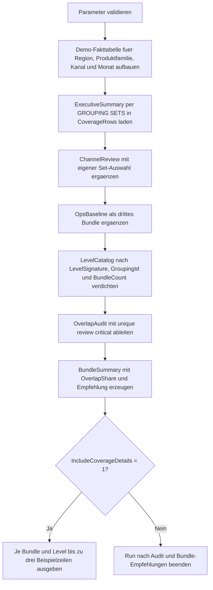

# GroupingSetOverlapAudit.sql

Dieses Skript prueft mehrere `GROUPING SETS`-Bundles auf doppelt abgedeckte Gruppierungsstufen. Die Demo zeigt, welche Ebenen in verschiedenen Reportpaketen mehrfach vorkommen und wo sich ein gemeinsames Basismodul oder eine bereinigte Set-Auswahl anbietet.

## Uebersicht

<!-- SQLDOC:SUMMARY_TABLE:BEGIN -->
| Feld | Wert |
|---|---|
| Script | [GroupingSetOverlapAudit.sql](GroupingSetOverlapAudit.sql) |
| Version | `1.0` |
| Typ | `didactic-lab` |
| Kapitel | `18_Cube_Rollup` |
| Sicherheit | `read-only-tempdb` |
| Zweck | Auditiert `GROUPING SETS`-Bundles auf doppelt abgedeckte Gruppierungsstufen. |
<!-- SQLDOC:SUMMARY_TABLE:END -->

## Einordnung

Mehrfachabdeckung entsteht nicht nur durch doppelte SQL-Zeilen, sondern oft schon dadurch, dass verschiedene Reports dieselbe Aggregationsebene enthalten. Das Audit betrachtet deshalb nicht einzelne Ergebniszeilen als Fehler, sondern die wiederholte Aufnahme identischer Gruppierungsstufen in mehreren Bundle-Definitionen.

## Annahmen

- Es handelt sich um eine didaktische Erstversion mit tempdb-basierten Demo-Daten.
- Die Demo verwendet drei bewusst aehnliche Bundles: `ExecutiveSummary`, `ChannelReview` und `OpsBaseline`.
- Eine Gruppierungsstufe gilt als identisch, wenn dieselbe `GROUPING()`-Bitkombination fuer Region, Produktfamilie, Kanal und Monat entsteht.
- `OverlapStatus` und `BundleAssessment` sind Lernindikatoren fuer Wartbarkeit, keine produktive Governance-Regel.

## Anwendungsfall

Das Skript eignet sich fuer Review-Sessions, wenn Teams viele `GROUPING SETS`-Reports pflegen und unklar ist, ob neue Sets wirklich neue Berichtsebenen liefern oder nur bestehende Ebenen erneut definieren. Es hilft auch bei der Entscheidung, welche Ebenen in ein gemeinsames Reporting-Basismodul ausgelagert werden koennen.

## Parameter

<!-- SQLDOC:PARAMETERS_TABLE:BEGIN -->
| Parameter | SQL-Typ | Pflicht | Beschreibung |
|---|---|---|---|
| `@IncludeCoverageDetails` | `BIT` | Nein | Gibt bei `1` Beispielzeilen je Bundle und Gruppierungsstufe aus. |
| `@WarnOverlapThreshold` | `INT` | Nein | Markiert ein Bundle ab dieser Zahl mehrfach abgedeckter Ebenen als `overlap-heavy`. |
<!-- SQLDOC:PARAMETERS_TABLE:END -->

## Abhaengigkeiten

<!-- SQLDOC:DEPENDENCIES_LIST:BEGIN -->
- `tempdb` fuer Demo-Fakten und Zwischentabellen
- `GROUPING SETS`
- `GROUPING`
- `GROUPING_ID`
- `STRING_AGG`
- `ROW_NUMBER`
<!-- SQLDOC:DEPENDENCIES_LIST:END -->

## Hinweise

- `LevelSignature` kodiert die `GROUPING()`-Bits in der Form `R?-P?-C?-M?` und macht identische Ebenen zwischen Bundles direkt vergleichbar.
- `BundleCount` zaehlt, in wie vielen Bundle-Definitionen dieselbe Gruppierungsstufe vorkommt.
- `ResultRowsAcrossSets` zeigt, wie viele konkrete Aggregationszeilen diese Ebene ueber alle Bundles hinweg erzeugt.
- Die optionale Detailausgabe ist absichtlich auf drei Beispielzeilen pro Bundle und Ebene begrenzt, damit das Audit lesbar bleibt.

## Versionshistorie

<!-- SQLDOC:VERSION_HISTORY_TABLE:BEGIN -->
| Version | Datum | User | Beschreibung |
|---|---|---|---|
| `1.0` | `2026-04-19` | `ER` | Erstversion des didaktischen Audits fuer doppelt abgedeckte `GROUPING SETS`-Ebenen |
<!-- SQLDOC:VERSION_HISTORY_TABLE:END -->

## Ablauf

<!-- SQLDOC:MERMAID:BEGIN -->

<!-- SQLDOC:MERMAID:END -->

## SQL-Code

<!-- SQLDOC:SQL_CODE:BEGIN -->
```sql
/*
BEGIN:SQL-HEADER v1
---
sql_header: v1
script_name: "GroupingSetOverlapAudit.sql"
script_version: "1.0"
script_type: "didactic-lab"
chapter: "18_Cube_Rollup"

purpose: >
  Prueft mehrere GROUPING-SETS-Bundles auf doppelt abgedeckte
  Gruppierungsstufen. Die Demo zeigt, welche Ebenen in verschiedenen
  Report-Definitionen mehrfach vorkommen und wo eine Konsolidierung der
  Sets moeglich ist.

parameters:
  - name: "@IncludeCoverageDetails"
    sql_type: "BIT"
    direction: "IN"
    required: false
    description: "1 = zusaetzlich die einzelnen Bundle-Zeilen je Gruppierungsstufe ausgeben"
  - name: "@WarnOverlapThreshold"
    sql_type: "INT"
    direction: "IN"
    required: false
    description: "Ab wie vielen mehrfach abgedeckten Ebenen ein Bundle als overlap-heavy markiert wird"

result_sets:
  - name: "SourceFactPreview"
    description: "Demo-Fakten fuer Region, Produktfamilie, Kanal und Monat"
  - name: "GroupingLevelCatalog"
    description: "Katalog aller in den Bundles vorkommenden Gruppierungsstufen mit lesbarer Signatur"
  - name: "OverlapAudit"
    description: "Zeigt pro Gruppierungsstufe, welche Bundles dieselbe Ebene abdecken"
  - name: "BundleRecommendation"
    description: "Leitet kompakte Hinweise zur Bereinigung ueberlappender Report-Bundles ab"
  - name: "CoverageDetails"
    description: "Optionale Detailzeilen aller Aggregationsergebnisse je Bundle und Gruppierungsstufe"

dependencies:
  - "tempdb temporary tables"
  - "GROUPING SETS"
  - "GROUPING"
  - "GROUPING_ID"
  - "STRING_AGG"
  - "ROW_NUMBER"

safety:
  level: "read-only-tempdb"
  writes_data: false

documentation:
  markdown_file: "T-SQL/18_Cube_Rollup/SQLScripts/GroupingSetOverlapAudit.md"
  sync_blocks:
    - "SUMMARY_TABLE"
    - "PARAMETERS_TABLE"
    - "DEPENDENCIES_LIST"
    - "VERSION_HISTORY_TABLE"
    - "SQL_CODE"
  mermaid:
    mode: "ai-agent-from-sql"
    source: "script-body"

main_responsible:
  name: "Erhard Rainer"
  initials: "ER"

version_history:
  - version: "1.0"
    date: "2026-04-19"
    user: "ER"
    description: "Erstversion des didaktischen Audits fuer doppelt abgedeckte GROUPING-SETS-Ebenen"

notes:
  - "Die Demo verwendet drei bewusst aehnliche Report-Bundles, um Overlaps sichtbar zu machen"
  - "Mehrfachabdeckung meint identische Gruppierungsstufen, nicht doppelte Faktzeilen"
---
END:SQL-HEADER v1
*/

SET NOCOUNT ON;

DECLARE @IncludeCoverageDetails BIT = 1;
DECLARE @WarnOverlapThreshold INT = 2;

IF @IncludeCoverageDetails NOT IN (0, 1)
BEGIN
    THROW 50070, '@IncludeCoverageDetails muss 0 oder 1 sein.', 1;
END;

IF @WarnOverlapThreshold < 1
BEGIN
    THROW 50071, '@WarnOverlapThreshold muss groesser als 0 sein.', 1;
END;

DROP TABLE IF EXISTS #SalesFact;
DROP TABLE IF EXISTS #CoverageRows;
DROP TABLE IF EXISTS #LevelCatalog;
DROP TABLE IF EXISTS #OverlapAudit;
DROP TABLE IF EXISTS #BundleSummary;

CREATE TABLE #SalesFact
(
    RegionCode       VARCHAR(20)   NOT NULL,
    ProductFamily    VARCHAR(30)   NOT NULL,
    SalesChannel     VARCHAR(20)   NOT NULL,
    SalesMonth       CHAR(7)       NOT NULL,
    RevenueAmount    DECIMAL(12,2) NOT NULL
);

INSERT INTO #SalesFact
(
    RegionCode,
    ProductFamily,
    SalesChannel,
    SalesMonth,
    RevenueAmount
)
VALUES
    ('North',   'Hardware', 'Online',  '2026-01', 12800.00),
    ('North',   'Hardware', 'Retail',  '2026-02',  9750.00),
    ('North',   'Services', 'Partner', '2026-02', 11100.00),
    ('South',   'Hardware', 'Retail',  '2026-01', 13450.00),
    ('South',   'Services', 'Online',  '2026-03', 10220.00),
    ('South',   'Training', 'Partner', '2026-03',  6980.00),
    ('West',    'Hardware', 'Online',  '2026-01',  8940.00),
    ('West',    'Services', 'Retail',  '2026-02', 12080.00),
    ('West',    'Training', 'Partner', '2026-03',  7450.00),
    ('Central', 'Hardware', 'Partner', '2026-01',  8380.00),
    ('Central', 'Services', 'Online',  '2026-02', 10940.00),
    ('Central', 'Training', 'Retail',  '2026-03',  6825.00);

SELECT
    sf.RegionCode,
    sf.ProductFamily,
    sf.SalesChannel,
    sf.SalesMonth,
    sf.RevenueAmount
FROM #SalesFact AS sf
ORDER BY
    sf.RegionCode,
    sf.ProductFamily,
    sf.SalesChannel,
    sf.SalesMonth;

CREATE TABLE #CoverageRows
(
    BundleName             VARCHAR(40)   NOT NULL,
    BundlePurpose          VARCHAR(140)  NOT NULL,
    RegionCode             VARCHAR(20)   NULL,
    ProductFamily          VARCHAR(30)   NULL,
    SalesChannel           VARCHAR(20)   NULL,
    SalesMonth             CHAR(7)       NULL,
    RevenueAmount          DECIMAL(12,2) NOT NULL,
    GroupingId             INT           NOT NULL,
    AggregatedDimensions   TINYINT       NOT NULL,
    LevelSignature         VARCHAR(120)  NOT NULL,
    LevelLabel             VARCHAR(160)  NOT NULL
);

INSERT INTO #CoverageRows
(
    BundleName,
    BundlePurpose,
    RegionCode,
    ProductFamily,
    SalesChannel,
    SalesMonth,
    RevenueAmount,
    GroupingId,
    AggregatedDimensions,
    LevelSignature,
    LevelLabel
)
SELECT
    'ExecutiveSummary' AS BundleName,
    'Monatsreport mit Fokus auf Management-Sichten' AS BundlePurpose,
    sf.RegionCode,
    sf.ProductFamily,
    sf.SalesChannel,
    sf.SalesMonth,
    SUM(sf.RevenueAmount) AS RevenueAmount,
    GROUPING_ID
    (
        sf.RegionCode,
        sf.ProductFamily,
        sf.SalesChannel,
        sf.SalesMonth
    ) AS GroupingId,
    GROUPING(sf.RegionCode)
    + GROUPING(sf.ProductFamily)
    + GROUPING(sf.SalesChannel)
    + GROUPING(sf.SalesMonth) AS AggregatedDimensions,
    CONCAT(
        'R', GROUPING(sf.RegionCode),
        '-P', GROUPING(sf.ProductFamily),
        '-C', GROUPING(sf.SalesChannel),
        '-M', GROUPING(sf.SalesMonth)
    ) AS LevelSignature,
    CASE
        WHEN GROUPING_ID
        (
            sf.RegionCode,
            sf.ProductFamily,
            sf.SalesChannel,
            sf.SalesMonth
        ) = 15 THEN 'grand total'
        ELSE STUFF(
            CONCAT(
                CASE WHEN GROUPING(sf.RegionCode) = 0 THEN ', Region' ELSE '' END,
                CASE WHEN GROUPING(sf.ProductFamily) = 0 THEN ', Produktfamilie' ELSE '' END,
                CASE WHEN GROUPING(sf.SalesChannel) = 0 THEN ', Kanal' ELSE '' END,
                CASE WHEN GROUPING(sf.SalesMonth) = 0 THEN ', Monat' ELSE '' END
            ),
            1,
            2,
            ''
        )
    END AS LevelLabel
FROM #SalesFact AS sf
GROUP BY GROUPING SETS
(
    (
        sf.RegionCode,
        sf.ProductFamily,
        sf.SalesMonth
    ),
    (
        sf.RegionCode,
        sf.ProductFamily
    ),
    (
        sf.RegionCode,
        sf.SalesMonth
    ),
    ()
);

INSERT INTO #CoverageRows
(
    BundleName,
    BundlePurpose,
    RegionCode,
    ProductFamily,
    SalesChannel,
    SalesMonth,
    RevenueAmount,
    GroupingId,
    AggregatedDimensions,
    LevelSignature,
    LevelLabel
)
SELECT
    'ChannelReview' AS BundleName,
    'Review fuer Kanal- und Monatsauswertungen' AS BundlePurpose,
    sf.RegionCode,
    sf.ProductFamily,
    sf.SalesChannel,
    sf.SalesMonth,
    SUM(sf.RevenueAmount) AS RevenueAmount,
    GROUPING_ID
    (
        sf.RegionCode,
        sf.ProductFamily,
        sf.SalesChannel,
        sf.SalesMonth
    ) AS GroupingId,
    GROUPING(sf.RegionCode)
    + GROUPING(sf.ProductFamily)
    + GROUPING(sf.SalesChannel)
    + GROUPING(sf.SalesMonth) AS AggregatedDimensions,
    CONCAT(
        'R', GROUPING(sf.RegionCode),
        '-P', GROUPING(sf.ProductFamily),
        '-C', GROUPING(sf.SalesChannel),
        '-M', GROUPING(sf.SalesMonth)
    ) AS LevelSignature,
    CASE
        WHEN GROUPING_ID
        (
            sf.RegionCode,
            sf.ProductFamily,
            sf.SalesChannel,
            sf.SalesMonth
        ) = 15 THEN 'grand total'
        ELSE STUFF(
            CONCAT(
                CASE WHEN GROUPING(sf.RegionCode) = 0 THEN ', Region' ELSE '' END,
                CASE WHEN GROUPING(sf.ProductFamily) = 0 THEN ', Produktfamilie' ELSE '' END,
                CASE WHEN GROUPING(sf.SalesChannel) = 0 THEN ', Kanal' ELSE '' END,
                CASE WHEN GROUPING(sf.SalesMonth) = 0 THEN ', Monat' ELSE '' END
            ),
            1,
            2,
            ''
        )
    END AS LevelLabel
FROM #SalesFact AS sf
GROUP BY GROUPING SETS
(
    (
        sf.RegionCode,
        sf.ProductFamily
    ),
    (
        sf.RegionCode,
        sf.SalesChannel,
        sf.SalesMonth
    ),
    (
        sf.RegionCode,
        sf.SalesMonth
    ),
    ()
);

INSERT INTO #CoverageRows
(
    BundleName,
    BundlePurpose,
    RegionCode,
    ProductFamily,
    SalesChannel,
    SalesMonth,
    RevenueAmount,
    GroupingId,
    AggregatedDimensions,
    LevelSignature,
    LevelLabel
)
SELECT
    'OpsBaseline' AS BundleName,
    'Operatives Basispaket fuer Produkt-, Kanal- und Monatskontrolle' AS BundlePurpose,
    sf.RegionCode,
    sf.ProductFamily,
    sf.SalesChannel,
    sf.SalesMonth,
    SUM(sf.RevenueAmount) AS RevenueAmount,
    GROUPING_ID
    (
        sf.RegionCode,
        sf.ProductFamily,
        sf.SalesChannel,
        sf.SalesMonth
    ) AS GroupingId,
    GROUPING(sf.RegionCode)
    + GROUPING(sf.ProductFamily)
    + GROUPING(sf.SalesChannel)
    + GROUPING(sf.SalesMonth) AS AggregatedDimensions,
    CONCAT(
        'R', GROUPING(sf.RegionCode),
        '-P', GROUPING(sf.ProductFamily),
        '-C', GROUPING(sf.SalesChannel),
        '-M', GROUPING(sf.SalesMonth)
    ) AS LevelSignature,
    CASE
        WHEN GROUPING_ID
        (
            sf.RegionCode,
            sf.ProductFamily,
            sf.SalesChannel,
            sf.SalesMonth
        ) = 15 THEN 'grand total'
        ELSE STUFF(
            CONCAT(
                CASE WHEN GROUPING(sf.RegionCode) = 0 THEN ', Region' ELSE '' END,
                CASE WHEN GROUPING(sf.ProductFamily) = 0 THEN ', Produktfamilie' ELSE '' END,
                CASE WHEN GROUPING(sf.SalesChannel) = 0 THEN ', Kanal' ELSE '' END,
                CASE WHEN GROUPING(sf.SalesMonth) = 0 THEN ', Monat' ELSE '' END
            ),
            1,
            2,
            ''
        )
    END AS LevelLabel
FROM #SalesFact AS sf
GROUP BY GROUPING SETS
(
    (
        sf.RegionCode,
        sf.ProductFamily,
        sf.SalesChannel
    ),
    (
        sf.RegionCode,
        sf.ProductFamily
    ),
    (
        sf.RegionCode,
        sf.SalesMonth
    ),
    ()
);

CREATE TABLE #LevelCatalog
(
    LevelSignature         VARCHAR(120)  NOT NULL,
    GroupingId             INT           NOT NULL,
    AggregatedDimensions   TINYINT       NOT NULL,
    LevelLabel             VARCHAR(160)  NOT NULL,
    BundleCount            INT           NOT NULL,
    Bundles                VARCHAR(400)  NOT NULL,
    ResultRowsAcrossSets   INT           NOT NULL
);

INSERT INTO #LevelCatalog
(
    LevelSignature,
    GroupingId,
    AggregatedDimensions,
    LevelLabel,
    BundleCount,
    Bundles,
    ResultRowsAcrossSets
)
SELECT
    cr.LevelSignature,
    MIN(cr.GroupingId) AS GroupingId,
    MIN(cr.AggregatedDimensions) AS AggregatedDimensions,
    MIN(cr.LevelLabel) AS LevelLabel,
    COUNT(DISTINCT cr.BundleName) AS BundleCount,
    STRING_AGG(cr.BundleName, ', ') AS Bundles,
    COUNT(*) AS ResultRowsAcrossSets
FROM #CoverageRows AS cr
GROUP BY
    cr.LevelSignature;

SELECT
    lc.LevelSignature,
    lc.GroupingId,
    lc.AggregatedDimensions,
    lc.LevelLabel,
    lc.BundleCount,
    lc.Bundles,
    lc.ResultRowsAcrossSets
FROM #LevelCatalog AS lc
ORDER BY
    lc.BundleCount DESC,
    lc.AggregatedDimensions ASC,
    lc.LevelSignature;

CREATE TABLE #OverlapAudit
(
    LevelSignature            VARCHAR(120)  NOT NULL,
    LevelLabel                VARCHAR(160)  NOT NULL,
    GroupingId                INT           NOT NULL,
    BundleCount               INT           NOT NULL,
    Bundles                   VARCHAR(400)  NOT NULL,
    ResultRowsAcrossSets      INT           NOT NULL,
    OverlapStatus             VARCHAR(20)   NOT NULL,
    ConsolidationHint         VARCHAR(220)  NOT NULL
);

INSERT INTO #OverlapAudit
(
    LevelSignature,
    LevelLabel,
    GroupingId,
    BundleCount,
    Bundles,
    ResultRowsAcrossSets,
    OverlapStatus,
    ConsolidationHint
)
SELECT
    lc.LevelSignature,
    lc.LevelLabel,
    lc.GroupingId,
    lc.BundleCount,
    lc.Bundles,
    lc.ResultRowsAcrossSets,
    CASE
        WHEN lc.BundleCount >= 3 THEN 'critical'
        WHEN lc.BundleCount = 2 THEN 'review'
        ELSE 'unique'
    END AS OverlapStatus,
    CASE
        WHEN lc.BundleCount >= 3 THEN 'Diese Ebene steckt in fast jedem Bundle und eignet sich fuer ein gemeinsames Basismodul.'
        WHEN lc.BundleCount = 2 THEN 'Pruefen, ob eines der beiden Bundles die Ebene vom anderen uebernehmen kann.'
        ELSE 'Keine doppelte Abdeckung innerhalb der Demo-Bundles.'
    END AS ConsolidationHint
FROM #LevelCatalog AS lc;

SELECT
    oa.LevelSignature,
    oa.LevelLabel,
    oa.GroupingId,
    oa.BundleCount,
    oa.Bundles,
    oa.ResultRowsAcrossSets,
    oa.OverlapStatus,
    oa.ConsolidationHint
FROM #OverlapAudit AS oa
ORDER BY
    oa.BundleCount DESC,
    oa.GroupingId ASC,
    oa.LevelSignature;

CREATE TABLE #BundleSummary
(
    BundleName              VARCHAR(40)   NOT NULL,
    BundlePurpose           VARCHAR(140)  NOT NULL,
    DistinctLevels          INT           NOT NULL,
    SharedLevels            INT           NOT NULL,
    UniqueLevels            INT           NOT NULL,
    ProducedRows            INT           NOT NULL,
    OverlapShare            DECIMAL(9,4)  NOT NULL,
    BundleAssessment        VARCHAR(20)   NOT NULL,
    Recommendation          VARCHAR(260)  NOT NULL
);

INSERT INTO #BundleSummary
(
    BundleName,
    BundlePurpose,
    DistinctLevels,
    SharedLevels,
    UniqueLevels,
    ProducedRows,
    OverlapShare,
    BundleAssessment,
    Recommendation
)
SELECT
    cr.BundleName,
    MIN(cr.BundlePurpose) AS BundlePurpose,
    COUNT(DISTINCT cr.LevelSignature) AS DistinctLevels,
    COUNT(DISTINCT CASE WHEN oa.BundleCount > 1 THEN cr.LevelSignature END) AS SharedLevels,
    COUNT(DISTINCT CASE WHEN oa.BundleCount = 1 THEN cr.LevelSignature END) AS UniqueLevels,
    COUNT(*) AS ProducedRows,
    CAST(
        COUNT(DISTINCT CASE WHEN oa.BundleCount > 1 THEN cr.LevelSignature END) * 1.0
        / NULLIF(COUNT(DISTINCT cr.LevelSignature), 0) AS DECIMAL(9,4)
    ) AS OverlapShare,
    CASE
        WHEN COUNT(DISTINCT CASE WHEN oa.BundleCount > 1 THEN cr.LevelSignature END) >= @WarnOverlapThreshold THEN 'overlap-heavy'
        WHEN COUNT(DISTINCT CASE WHEN oa.BundleCount > 1 THEN cr.LevelSignature END) > 0 THEN 'mixed'
        ELSE 'lean'
    END AS BundleAssessment,
    CASE
        WHEN COUNT(DISTINCT CASE WHEN oa.BundleCount > 1 THEN cr.LevelSignature END) >= @WarnOverlapThreshold
            THEN 'Bundle enthaelt mehrere bereits anderswo definierte Ebenen. Kandidat fuer Basismodul plus gezielte Ergaenzungen.'
        WHEN COUNT(DISTINCT CASE WHEN oa.BundleCount > 1 THEN cr.LevelSignature END) > 0
            THEN 'Ein Teil der Ebenen ueberlappt. Vor Erweiterungen zuerst Namens- und Ownership-Regeln klaeren.'
        ELSE 'Bundle deckt in dieser Demo vorwiegend eigene Ebenen ab.'
    END AS Recommendation
FROM #CoverageRows AS cr
INNER JOIN #OverlapAudit AS oa
    ON oa.LevelSignature = cr.LevelSignature
GROUP BY
    cr.BundleName;

SELECT
    bs.BundleName,
    bs.BundlePurpose,
    bs.DistinctLevels,
    bs.SharedLevels,
    bs.UniqueLevels,
    bs.ProducedRows,
    bs.OverlapShare,
    bs.BundleAssessment,
    bs.Recommendation
FROM #BundleSummary AS bs
ORDER BY
    bs.OverlapShare DESC,
    bs.BundleName;

IF @IncludeCoverageDetails = 1
BEGIN
    ;WITH RankedCoverage AS
    (
        SELECT
            cr.BundleName,
            cr.BundlePurpose,
            cr.LevelSignature,
            cr.LevelLabel,
            cr.RegionCode,
            cr.ProductFamily,
            cr.SalesChannel,
            cr.SalesMonth,
            cr.RevenueAmount,
            cr.GroupingId,
            cr.AggregatedDimensions,
            ROW_NUMBER() OVER
            (
                PARTITION BY cr.BundleName, cr.LevelSignature
                ORDER BY
                    cr.RevenueAmount DESC,
                    cr.RegionCode,
                    cr.ProductFamily,
                    cr.SalesChannel,
                    cr.SalesMonth
            ) AS SampleRank
        FROM #CoverageRows AS cr
    )
    SELECT
        rc.BundleName,
        rc.LevelSignature,
        rc.LevelLabel,
        CASE WHEN rc.RegionCode IS NULL THEN '(all regions)' ELSE rc.RegionCode END AS RegionCode,
        CASE WHEN rc.ProductFamily IS NULL THEN '(all product families)' ELSE rc.ProductFamily END AS ProductFamily,
        CASE WHEN rc.SalesChannel IS NULL THEN '(all channels)' ELSE rc.SalesChannel END AS SalesChannel,
        CASE WHEN rc.SalesMonth IS NULL THEN '(all months)' ELSE rc.SalesMonth END AS SalesMonth,
        rc.RevenueAmount,
        rc.GroupingId,
        rc.AggregatedDimensions
    FROM RankedCoverage AS rc
    WHERE rc.SampleRank <= 3
    ORDER BY
        rc.BundleName,
        rc.LevelSignature,
        rc.SampleRank;
END;
```
<!-- SQLDOC:SQL_CODE:END -->
