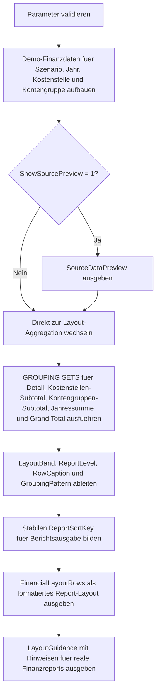

# GroupingSetsFinancialLayout.sql

Dieses Skript liefert eine didaktische Vorlage fuer Finanzreports mit mehreren Aggregationsstufen auf Basis von `GROUPING SETS`. Statt einen vollstaendigen `CUBE` zu erzeugen, baut es bewusst nur die Berichtsebenen auf, die fuer Detailzeilen, Kostenstellen-Subtotals, Kontengruppen-Subtotals, Jahressummen und Grand Total benoetigt werden.

## Uebersicht

<!-- SQLDOC:SUMMARY_TABLE:BEGIN -->
| Feld | Wert |
|---|---|
| Script | [GroupingSetsFinancialLayout.sql](GroupingSetsFinancialLayout.sql) |
| Version | `1.0` |
| Typ | `template` |
| Kapitel | `18_Cube_Rollup` |
| Sicherheit | `read-only-tempdb` |
| Zweck | Layout-Vorlage fuer Finanzreports mit mehreren Aggregationsstufen. |
<!-- SQLDOC:SUMMARY_TABLE:END -->

## Einordnung

Finanzreports brauchen haeufig nicht jede theoretisch moegliche Aggregation, sondern eine klar kuratierte Reihenfolge aus Detailzeilen und Summenebenen. Das Skript demonstriert deshalb, wie `GROUPING SETS` eine gut lesbare Berichtsausgabe erzeugen koennen, ohne die unnoetige Vollausdehnung eines `CUBE` mitzuschleppen.

## Annahmen

- Es handelt sich um eine didaktische Erstversion mit tempdb-basierten Demo-Finanzdaten.
- Die Faktzeilen unterscheiden die Dimensionen `ScenarioName`, `FiscalYear`, `CostCenter` und `AccountGroup`.
- Die Aggregationsstufen sind bewusst auf typische Finanzreport-Ebenen beschraenkt.
- `@UseCompactCaptions` erlaubt kuerzere Zeilenbeschriftungen, ohne die fachliche Gruppierungslogik zu aendern.

## Anwendungsfall

Das Skript eignet sich fuer Unterricht, Review-Sessions und Report-Prototypen, wenn ein Finanzlayout mit mehreren Summenebenen geplant wird. Besonders hilfreich ist es fuer Diskussionen darueber, welche Summen als Kostenstellen- oder Kontengruppen-Subtotal sichtbar sein sollen und wie Grand Totals sprachlich sauber benannt werden.

## Parameter

<!-- SQLDOC:PARAMETERS_TABLE:BEGIN -->
| Parameter | SQL-Typ | Pflicht | Beschreibung |
|---|---|---|---|
| `@ShowSourcePreview` | `BIT` | Nein | Gibt bei `1` die Demo-Finanzdaten vor der Aggregation aus. |
| `@UseCompactCaptions` | `BIT` | Nein | Verwendet bei `1` kuerzere Zeilenbeschriftungen fuer kompakte Reports. |
| `@GrandTotalLabel` | `VARCHAR(60)` | Nein | Legt die Beschriftung fuer die voll aggregierte Gesamtzeile fest. |
<!-- SQLDOC:PARAMETERS_TABLE:END -->

## Abhaengigkeiten

<!-- SQLDOC:DEPENDENCIES_LIST:BEGIN -->
- `tempdb` fuer Demo-Finanzdaten und Zwischentabellen
- `GROUPING SETS`
- `GROUPING`
- `CASE`
- `CONCAT`
<!-- SQLDOC:DEPENDENCIES_LIST:END -->

## Hinweise

- Das Layout nutzt absichtlich nur eine kleine, kuratierte Menge an Gruppierungsebenen.
- `GroupingPattern` zeigt, welche Dimensionen je Zeile aggregiert wurden.
- `ReportSortKey` ist eine technische Hilfe fuer eine stabile Berichtssortierung.
- Die gleiche Struktur laesst sich spaeter auf weitere Finanzdimensionen wie Mandant, Periode oder Kontonummer erweitern.

## Versionshistorie

<!-- SQLDOC:VERSION_HISTORY_TABLE:BEGIN -->
| Version | Datum | User | Beschreibung |
|---|---|---|---|
| `1.0` | `2026-04-19` | `ER` | Erstversion der Layout-Vorlage fuer Finanzreports mit GROUPING SETS |
<!-- SQLDOC:VERSION_HISTORY_TABLE:END -->

## Ablauf

<!-- SQLDOC:MERMAID:BEGIN -->

<!-- SQLDOC:MERMAID:END -->

## SQL-Code

<!-- SQLDOC:SQL_CODE:BEGIN -->
```sql
/*
BEGIN:SQL-HEADER v1
---
sql_header: v1
script_name: "GroupingSetsFinancialLayout.sql"
script_version: "1.0"
script_type: "template"
chapter: "18_Cube_Rollup"

purpose: >
  Liefert eine didaktische Layout-Vorlage fuer Finanzreports mit mehreren
  Aggregationsstufen, indem vorbereitete GROUPING SETS fuer Detailzeilen,
  Kostenstellen-Subtotals, Kontengruppen-Subtotals, Jahressummen und Grand
  Total in eine lesbare Berichtsausgabe ueberfuehrt werden.

parameters:
  - name: "@ShowSourcePreview"
    sql_type: "BIT"
    direction: "IN"
    required: false
    description: "1 = die Demo-Finanzdaten vor der Aggregation anzeigen"
  - name: "@UseCompactCaptions"
    sql_type: "BIT"
    direction: "IN"
    required: false
    description: "1 = kuerzere Zeilenbeschriftungen fuer kompakte Report-Ausgaben verwenden"
  - name: "@GrandTotalLabel"
    sql_type: "VARCHAR(60)"
    direction: "IN"
    required: false
    description: "Beschriftung fuer die voll aggregierte Gesamtzeile"

result_sets:
  - name: "SourceDataPreview"
    description: "Optionale Vorschau auf die Demo-Finanzdaten fuer Szenario, Jahr, Kostenstelle und Kontengruppe"
  - name: "FinancialLayoutRows"
    description: "Formatiertes Finanzreport-Layout mit GROUPING SETS, Layoutbloecken und Sortierschluessel"
  - name: "LayoutGuidance"
    description: "Didaktische Hinweise fuer die Uebernahme des Layoutmusters in reale Reports"

dependencies:
  - "tempdb temporary tables"
  - "GROUPING SETS"
  - "GROUPING"
  - "CASE"
  - "CONCAT"

safety:
  level: "read-only-tempdb"
  writes_data: false

documentation:
  markdown_file: "T-SQL/18_Cube_Rollup/SQLScripts/GroupingSetsFinancialLayout.md"
  sync_blocks:
    - "SUMMARY_TABLE"
    - "PARAMETERS_TABLE"
    - "DEPENDENCIES_LIST"
    - "VERSION_HISTORY_TABLE"
    - "SQL_CODE"
  mermaid:
    mode: "ai-agent-from-sql"
    source: "script-body"

main_responsible:
  name: "Erhard Rainer"
  initials: "ER"

version_history:
  - version: "1.0"
    date: "2026-04-19"
    user: "ER"
    description: "Erstversion der Layout-Vorlage fuer Finanzreports mit GROUPING SETS"

notes:
  - "Die Demo-Daten bleiben bewusst klein und liegen nur in temporaeren Tabellen"
  - "Das Layout zeigt eine kuratierte Menge an Aggregationsstufen statt eines vollstaendigen CUBE"
---
END:SQL-HEADER v1
*/

SET NOCOUNT ON;

DECLARE @ShowSourcePreview BIT = 1;
DECLARE @UseCompactCaptions BIT = 0;
DECLARE @GrandTotalLabel VARCHAR(60) = 'Gesamt ueber alle Jahre, Szenarien und Bereiche';

IF @ShowSourcePreview NOT IN (0, 1)
BEGIN
    THROW 50070, '@ShowSourcePreview muss 0 oder 1 sein.', 1;
END;

IF @UseCompactCaptions NOT IN (0, 1)
BEGIN
    THROW 50071, '@UseCompactCaptions muss 0 oder 1 sein.', 1;
END;

IF NULLIF(LTRIM(RTRIM(@GrandTotalLabel)), '') IS NULL
BEGIN
    THROW 50072, '@GrandTotalLabel darf nicht leer sein.', 1;
END;

DROP TABLE IF EXISTS #FinanceFact;
DROP TABLE IF EXISTS #FinancialLayoutRows;
DROP TABLE IF EXISTS #LayoutGuidance;

CREATE TABLE #FinanceFact
(
    ScenarioName    VARCHAR(20)   NOT NULL,
    FiscalYear      INT           NOT NULL,
    CostCenter      VARCHAR(20)   NOT NULL,
    AccountGroup    VARCHAR(30)   NOT NULL,
    Amount          DECIMAL(14,2) NOT NULL
);

INSERT INTO #FinanceFact
(
    ScenarioName,
    FiscalYear,
    CostCenter,
    AccountGroup,
    Amount
)
VALUES
    ('Actual', 2025, 'CC-100', 'Revenue',   185000.00),
    ('Actual', 2025, 'CC-100', 'Personnel', -72000.00),
    ('Actual', 2025, 'CC-100', 'Marketing', -18500.00),
    ('Actual', 2025, 'CC-200', 'Revenue',   161500.00),
    ('Actual', 2025, 'CC-200', 'Personnel', -64800.00),
    ('Actual', 2025, 'CC-200', 'Operations',-22400.00),
    ('Budget', 2025, 'CC-100', 'Revenue',   190000.00),
    ('Budget', 2025, 'CC-100', 'Personnel', -70000.00),
    ('Budget', 2025, 'CC-100', 'Marketing', -17000.00),
    ('Budget', 2025, 'CC-200', 'Revenue',   158000.00),
    ('Budget', 2025, 'CC-200', 'Personnel', -66000.00),
    ('Budget', 2025, 'CC-200', 'Operations',-21000.00),
    ('Actual', 2026, 'CC-100', 'Revenue',   196500.00),
    ('Actual', 2026, 'CC-100', 'Personnel', -74500.00),
    ('Actual', 2026, 'CC-100', 'Marketing', -20100.00),
    ('Actual', 2026, 'CC-200', 'Revenue',   168200.00),
    ('Actual', 2026, 'CC-200', 'Personnel', -68100.00),
    ('Actual', 2026, 'CC-200', 'Operations',-23700.00),
    ('Budget', 2026, 'CC-100', 'Revenue',   198000.00),
    ('Budget', 2026, 'CC-100', 'Personnel', -73000.00),
    ('Budget', 2026, 'CC-100', 'Marketing', -19500.00),
    ('Budget', 2026, 'CC-200', 'Revenue',   170000.00),
    ('Budget', 2026, 'CC-200', 'Personnel', -67500.00),
    ('Budget', 2026, 'CC-200', 'Operations',-23000.00);

IF @ShowSourcePreview = 1
BEGIN
    SELECT
        ff.ScenarioName,
        ff.FiscalYear,
        ff.CostCenter,
        ff.AccountGroup,
        ff.Amount
    FROM #FinanceFact AS ff
    ORDER BY
        ff.FiscalYear,
        ff.ScenarioName,
        ff.CostCenter,
        ff.AccountGroup;
END;

CREATE TABLE #FinancialLayoutRows
(
    LayoutBand          VARCHAR(24)   NOT NULL,
    ReportLevel         TINYINT       NOT NULL,
    ScenarioLabel       VARCHAR(30)   NOT NULL,
    FiscalYearLabel     VARCHAR(20)   NOT NULL,
    CostCenterLabel     VARCHAR(30)   NOT NULL,
    AccountGroupLabel   VARCHAR(40)   NOT NULL,
    RowCaption          VARCHAR(220)  NOT NULL,
    Amount              DECIMAL(14,2) NOT NULL,
    GroupingPattern     VARCHAR(60)   NOT NULL,
    ReportSortKey       VARCHAR(80)   NOT NULL
);

INSERT INTO #FinancialLayoutRows
(
    LayoutBand,
    ReportLevel,
    ScenarioLabel,
    FiscalYearLabel,
    CostCenterLabel,
    AccountGroupLabel,
    RowCaption,
    Amount,
    GroupingPattern,
    ReportSortKey
)
SELECT
    CASE
        WHEN GROUPING(ff.ScenarioName) = 1
         AND GROUPING(ff.FiscalYear) = 1
         AND GROUPING(ff.CostCenter) = 1
         AND GROUPING(ff.AccountGroup) = 1 THEN 'grand_total'
        WHEN GROUPING(ff.CostCenter) = 1
         AND GROUPING(ff.AccountGroup) = 1 THEN 'year_total'
        WHEN GROUPING(ff.CostCenter) = 1 THEN 'account_subtotal'
        WHEN GROUPING(ff.AccountGroup) = 1 THEN 'costcenter_subtotal'
        ELSE 'detail'
    END AS LayoutBand,
    CASE
        WHEN GROUPING(ff.ScenarioName) = 1
         AND GROUPING(ff.FiscalYear) = 1
         AND GROUPING(ff.CostCenter) = 1
         AND GROUPING(ff.AccountGroup) = 1 THEN 4
        WHEN GROUPING(ff.CostCenter) = 1
         AND GROUPING(ff.AccountGroup) = 1 THEN 3
        WHEN GROUPING(ff.CostCenter) = 1
          OR GROUPING(ff.AccountGroup) = 1 THEN 2
        ELSE 1
    END AS ReportLevel,
    CASE
        WHEN GROUPING(ff.ScenarioName) = 1 THEN '(alle Szenarien)'
        ELSE ff.ScenarioName
    END AS ScenarioLabel,
    CASE
        WHEN GROUPING(ff.FiscalYear) = 1 THEN '(alle Jahre)'
        ELSE CONCAT('FY', ff.FiscalYear)
    END AS FiscalYearLabel,
    CASE
        WHEN GROUPING(ff.CostCenter) = 1 THEN '(alle Kostenstellen)'
        ELSE ff.CostCenter
    END AS CostCenterLabel,
    CASE
        WHEN GROUPING(ff.AccountGroup) = 1 THEN '(alle Kontengruppen)'
        ELSE ff.AccountGroup
    END AS AccountGroupLabel,
    CASE
        WHEN GROUPING(ff.ScenarioName) = 1
         AND GROUPING(ff.FiscalYear) = 1
         AND GROUPING(ff.CostCenter) = 1
         AND GROUPING(ff.AccountGroup) = 1 THEN @GrandTotalLabel
        WHEN GROUPING(ff.CostCenter) = 1
         AND GROUPING(ff.AccountGroup) = 1 THEN
            CASE
                WHEN @UseCompactCaptions = 1 THEN CONCAT(ff.ScenarioName, ' FY', ff.FiscalYear, ' Gesamt')
                ELSE CONCAT('Jahressumme fuer Szenario ', ff.ScenarioName, ' im Jahr ', ff.FiscalYear)
            END
        WHEN GROUPING(ff.CostCenter) = 1 THEN
            CASE
                WHEN @UseCompactCaptions = 1 THEN CONCAT(ff.ScenarioName, ' FY', ff.FiscalYear, ' / ', ff.AccountGroup, ' subtotal')
                ELSE CONCAT('Kontengruppen-Subtotal ', ff.AccountGroup, ' fuer Szenario ', ff.ScenarioName, ' im Jahr ', ff.FiscalYear)
            END
        WHEN GROUPING(ff.AccountGroup) = 1 THEN
            CASE
                WHEN @UseCompactCaptions = 1 THEN CONCAT(ff.ScenarioName, ' FY', ff.FiscalYear, ' / ', ff.CostCenter, ' subtotal')
                ELSE CONCAT('Kostenstellen-Subtotal ', ff.CostCenter, ' fuer Szenario ', ff.ScenarioName, ' im Jahr ', ff.FiscalYear)
            END
        ELSE
            CASE
                WHEN @UseCompactCaptions = 1 THEN CONCAT(ff.ScenarioName, ' FY', ff.FiscalYear, ' / ', ff.CostCenter, ' / ', ff.AccountGroup)
                ELSE CONCAT('Detailzeile ', ff.ScenarioName, ', FY', ff.FiscalYear, ', Kostenstelle ', ff.CostCenter, ', Kontengruppe ', ff.AccountGroup)
            END
    END AS RowCaption,
    SUM(ff.Amount) AS Amount,
    CONCAT(
        'S', GROUPING(ff.ScenarioName),
        '-Y', GROUPING(ff.FiscalYear),
        '-C', GROUPING(ff.CostCenter),
        '-A', GROUPING(ff.AccountGroup)
    ) AS GroupingPattern,
    CONCAT(
        CASE
            WHEN GROUPING(ff.ScenarioName) = 1
             AND GROUPING(ff.FiscalYear) = 1
             AND GROUPING(ff.CostCenter) = 1
             AND GROUPING(ff.AccountGroup) = 1 THEN '5'
            WHEN GROUPING(ff.CostCenter) = 1
             AND GROUPING(ff.AccountGroup) = 1 THEN '4'
            WHEN GROUPING(ff.CostCenter) = 1 THEN '3'
            WHEN GROUPING(ff.AccountGroup) = 1 THEN '2'
            ELSE '1'
        END,
        '-',
        COALESCE(CONVERT(VARCHAR(4), ff.FiscalYear), '9999'),
        '-',
        COALESCE(ff.ScenarioName, 'ZZZ'),
        '-',
        COALESCE(ff.CostCenter, 'ZZZ'),
        '-',
        COALESCE(ff.AccountGroup, 'ZZZ')
    ) AS ReportSortKey
FROM #FinanceFact AS ff
GROUP BY GROUPING SETS
(
    (ff.ScenarioName, ff.FiscalYear, ff.CostCenter, ff.AccountGroup),
    (ff.ScenarioName, ff.FiscalYear, ff.CostCenter),
    (ff.ScenarioName, ff.FiscalYear, ff.AccountGroup),
    (ff.ScenarioName, ff.FiscalYear),
    ()
);

SELECT
    flr.LayoutBand,
    flr.ReportLevel,
    flr.ScenarioLabel,
    flr.FiscalYearLabel,
    flr.CostCenterLabel,
    flr.AccountGroupLabel,
    flr.RowCaption,
    flr.Amount,
    flr.GroupingPattern,
    flr.ReportSortKey
FROM #FinancialLayoutRows AS flr
ORDER BY
    flr.ReportSortKey;

CREATE TABLE #LayoutGuidance
(
    StepNumber        INT           NOT NULL,
    FocusArea         VARCHAR(80)   NOT NULL,
    Recommendation    VARCHAR(260)  NOT NULL
);

INSERT INTO #LayoutGuidance
(
    StepNumber,
    FocusArea,
    Recommendation
)
VALUES
    (1, 'Grouping design', 'Waehle nur die Aggregationsstufen, die im Finanzbericht wirklich gelesen oder abgestimmt werden muessen.'),
    (2, 'Captions', 'Nutze getrennte Beschriftungen fuer Detailzeilen, Kostenstellen-Subtotals, Kontengruppen-Subtotals und Jahressummen.'),
    (3, 'Sorting', 'Leite einen stabilen Sortierschluessel ab, damit Detailzeilen und Summen in Exporten konsistent angeordnet bleiben.'),
    (4, 'Adaptation', 'Ersetze Demo-Dimensionen spaeter durch echte Kontenplaene, Hierarchien oder Mandantenfelder, ohne das GROUPING-SETS-Muster zu aendern.');

SELECT
    lg.StepNumber,
    lg.FocusArea,
    lg.Recommendation
FROM #LayoutGuidance AS lg
ORDER BY
    lg.StepNumber;
```
<!-- SQLDOC:SQL_CODE:END -->
