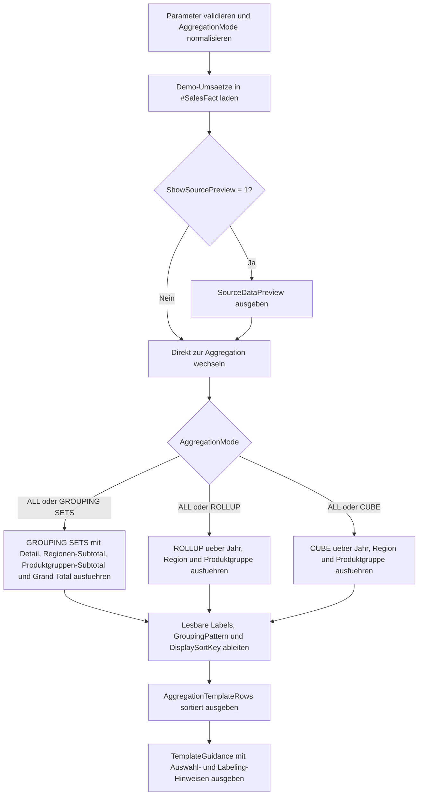

# GroupingSetsTemplate.sql

Dieses Skript ist eine didaktische Vorlage fuer `GROUPING SETS`, `ROLLUP` und `CUBE`. Es bereitet dieselben Demo-Umsaetze auf drei Arten auf und zeigt dabei, wie lesbare Ebenenlabels, `GROUPING()` und `GROUPING_ID()` gemeinsam fuer saubere Reporting-Ausgaben genutzt werden koennen.

## Uebersicht

<!-- SQLDOC:SUMMARY_TABLE:BEGIN -->
| Feld | Wert |
|---|---|
| Script | [GroupingSetsTemplate.sql](GroupingSetsTemplate.sql) |
| Version | `1.0` |
| Typ | `template` |
| Kapitel | `18_Cube_Rollup` |
| Sicherheit | `read-only-tempdb` |
| Zweck | Vergleichbare Vorlage fuer GROUPING SETS, ROLLUP und CUBE mit lesbarer Ergebniskennzeichnung. |
<!-- SQLDOC:SUMMARY_TABLE:END -->

## Einordnung

Das Skript trennt bewusst drei typische Einsatzmuster erweiterter Aggregationen. `GROUPING SETS` zeigt eine kuratierte Auswahl sinnvoller Berichtsebenen, `ROLLUP` bildet eine hierarchische Summenkette, und `CUBE` macht die komplette Kombinationsmatrix sichtbar. Die Ausgabe bleibt absichtlich klein genug, um die Unterschiede im Unterricht direkt nebeneinander zu diskutieren.

## Annahmen

- Es handelt sich um eine didaktische Erstversion mit kleinen Demo-Umsaetzen in tempdb-basierten Tabellen.
- Die Dimensionen `CalendarYear`, `SalesRegion` und `ProductGroup` genuegen, um Detailzeilen, Teilaggregate und Grand Total nachvollziehbar zu zeigen.
- `@AggregationMode = 'ALL'` ist als Vergleichsmodus fuer Schulung und Review gedacht.
- Die Beschriftung priorisiert Lesbarkeit und Debuggability vor maximal kompakter Darstellung.

## Anwendungsfall

Die Vorlage eignet sich fuer Trainings, Pair-Reviews und Report-Prototypen, wenn entschieden werden soll, ob eine Aufgabe besser mit `GROUPING SETS`, `ROLLUP` oder `CUBE` geloest wird. Gleichzeitig dient sie als Muster dafuer, wie rohe `NULL`-Werte aus erweiterten Gruppierungen in sprechende Report-Texte ueberfuehrt werden koennen.

## Parameter

<!-- SQLDOC:PARAMETERS_TABLE:BEGIN -->
| Parameter | SQL-Typ | Pflicht | Beschreibung |
|---|---|---|---|
| `@ShowSourcePreview` | `BIT` | Nein | Gibt bei `1` die Demo-Umsaetze vor der Aggregation aus. |
| `@AggregationMode` | `VARCHAR(20)` | Nein | Akzeptiert `ALL`, `GROUPING SETS`, `ROLLUP` oder `CUBE`. |
| `@UseCompactLabels` | `BIT` | Nein | Verwendet bei `1` kuerzere Zeilenlabels fuer kompaktere Report-Ausgaben. |
| `@GrandTotalLabel` | `VARCHAR(60)` | Nein | Legt die Beschriftung fuer die voll aggregierte Gesamtzeile fest. |
<!-- SQLDOC:PARAMETERS_TABLE:END -->

## Abhaengigkeiten

<!-- SQLDOC:DEPENDENCIES_LIST:BEGIN -->
- `tempdb` fuer Demo-Umsaetze und Zwischentabellen
- `GROUPING SETS`
- `ROLLUP`
- `CUBE`
- `GROUPING`
- `GROUPING_ID`
- `CASE`
- `CONCAT`
<!-- SQLDOC:DEPENDENCIES_LIST:END -->

## Hinweise

- `DisplaySortKey` sorgt dafuer, dass die drei Modi stabil und lesbar ausgegeben werden.
- `GroupingPattern` zeigt je Zeile, welche Dimensionen aggregiert wurden.
- `RowLabel`, `YearLabel`, `RegionLabel` und `ProductGroupLabel` trennen technische Gruppierungslogik von spaeteren Report-Texten.
- Die gleiche Struktur laesst sich spaeter auf Fachdimensionen wie Kunde, Kanal oder Produktfamilie uebertragen.

## Versionshistorie

<!-- SQLDOC:VERSION_HISTORY_TABLE:BEGIN -->
| Version | Datum | User | Beschreibung |
|---|---|---|---|
| `1.0` | `2026-04-19` | `ER` | Erstversion der Template-Vorlage fuer GROUPING SETS, ROLLUP und CUBE |
<!-- SQLDOC:VERSION_HISTORY_TABLE:END -->

## Ablauf

<!-- SQLDOC:MERMAID:BEGIN -->

<!-- SQLDOC:MERMAID:END -->

## SQL-Code

<!-- SQLDOC:SQL_CODE:BEGIN -->
```sql
/*
BEGIN:SQL-HEADER v1
---
sql_header: v1
script_name: "GroupingSetsTemplate.sql"
script_version: "1.0"
script_type: "template"
chapter: "18_Cube_Rollup"

purpose: >
  Stellt eine didaktische Vorlage fuer GROUPING SETS, ROLLUP und CUBE bereit,
  indem dieselben Demo-Umsaetze ueber drei Aggregationsmodi ausgewertet und mit
  gut lesbaren Ebenenlabels, GROUPING-Flags und stabiler Sortierung
  gegenuebergestellt werden.

parameters:
  - name: "@ShowSourcePreview"
    sql_type: "BIT"
    direction: "IN"
    required: false
    description: "1 = die Demo-Umsaetze vor der Aggregation anzeigen"
  - name: "@AggregationMode"
    sql_type: "VARCHAR(20)"
    direction: "IN"
    required: false
    description: "ALL, GROUPING SETS, ROLLUP oder CUBE zur Auswahl des Aggregationsmusters"
  - name: "@UseCompactLabels"
    sql_type: "BIT"
    direction: "IN"
    required: false
    description: "1 = kuerzere Zeilenlabels fuer kompakte Report-Layouts verwenden"
  - name: "@GrandTotalLabel"
    sql_type: "VARCHAR(60)"
    direction: "IN"
    required: false
    description: "Beschriftung fuer die voll aggregierte Gesamtzeile"

result_sets:
  - name: "SourceDataPreview"
    description: "Optionale Vorschau auf die Demo-Umsaetze fuer Jahr, Region und Produktgruppe"
  - name: "AggregationTemplateRows"
    description: "Vergleichbare Ausgabe fuer GROUPING SETS, ROLLUP und CUBE mit Labels und Gruppierungskennzeichen"
  - name: "TemplateGuidance"
    description: "Hinweise, wann welches Aggregationsmuster in realen Reports sinnvoll ist"

dependencies:
  - "tempdb temporary tables"
  - "GROUPING SETS"
  - "ROLLUP"
  - "CUBE"
  - "GROUPING"
  - "GROUPING_ID"
  - "CASE"
  - "CONCAT"

safety:
  level: "read-only-tempdb"
  writes_data: false

documentation:
  markdown_file: "T-SQL/18_Cube_Rollup/SQLScripts/GroupingSetsTemplate.md"
  sync_blocks:
    - "SUMMARY_TABLE"
    - "PARAMETERS_TABLE"
    - "DEPENDENCIES_LIST"
    - "VERSION_HISTORY_TABLE"
    - "SQL_CODE"
  mermaid:
    mode: "ai-agent-from-sql"
    source: "script-body"

main_responsible:
  name: "Erhard Rainer"
  initials: "ER"

version_history:
  - version: "1.0"
    date: "2026-04-19"
    user: "ER"
    description: "Erstversion der Template-Vorlage fuer GROUPING SETS, ROLLUP und CUBE"

notes:
  - "Die Demo-Daten bleiben klein und werden nur in temporaeren Tabellen gehalten"
  - "Die Ausgabe priorisiert Lesbarkeit und Vergleichbarkeit gegenueber maximaler Vollstaendigkeit"
---
END:SQL-HEADER v1
*/

SET NOCOUNT ON;

DECLARE @ShowSourcePreview BIT = 1;
DECLARE @AggregationMode VARCHAR(20) = 'ALL';
DECLARE @UseCompactLabels BIT = 0;
DECLARE @GrandTotalLabel VARCHAR(60) = 'Gesamt ueber alle Jahre, Regionen und Produktgruppen';

SET @AggregationMode = UPPER(LTRIM(RTRIM(@AggregationMode)));

IF @ShowSourcePreview NOT IN (0, 1)
BEGIN
    THROW 50080, '@ShowSourcePreview muss 0 oder 1 sein.', 1;
END;

IF @UseCompactLabels NOT IN (0, 1)
BEGIN
    THROW 50081, '@UseCompactLabels muss 0 oder 1 sein.', 1;
END;

IF @AggregationMode NOT IN ('ALL', 'GROUPING SETS', 'ROLLUP', 'CUBE')
BEGIN
    THROW 50082, '@AggregationMode muss ALL, GROUPING SETS, ROLLUP oder CUBE sein.', 1;
END;

IF NULLIF(LTRIM(RTRIM(@GrandTotalLabel)), '') IS NULL
BEGIN
    THROW 50083, '@GrandTotalLabel darf nicht leer sein.', 1;
END;

DROP TABLE IF EXISTS #SalesFact;
DROP TABLE IF EXISTS #AggregationTemplateRows;
DROP TABLE IF EXISTS #TemplateGuidance;

CREATE TABLE #SalesFact
(
    CalendarYear    INT             NOT NULL,
    SalesRegion     VARCHAR(20)     NOT NULL,
    ProductGroup    VARCHAR(30)     NOT NULL,
    NetAmount       DECIMAL(14,2)   NOT NULL
);

INSERT INTO #SalesFact
(
    CalendarYear,
    SalesRegion,
    ProductGroup,
    NetAmount
)
VALUES
    (2025, 'North',   'Hardware', 18200.00),
    (2025, 'North',   'Services', 13600.00),
    (2025, 'South',   'Hardware', 16550.00),
    (2025, 'South',   'Services', 12140.00),
    (2025, 'West',    'Hardware', 14990.00),
    (2025, 'West',    'Training',  8240.00),
    (2026, 'North',   'Hardware', 19450.00),
    (2026, 'North',   'Services', 14280.00),
    (2026, 'South',   'Hardware', 17320.00),
    (2026, 'South',   'Training',  9150.00),
    (2026, 'West',    'Services', 12930.00),
    (2026, 'Central', 'Hardware', 15860.00);

IF @ShowSourcePreview = 1
BEGIN
    SELECT
        sf.CalendarYear,
        sf.SalesRegion,
        sf.ProductGroup,
        sf.NetAmount
    FROM #SalesFact AS sf
    ORDER BY
        sf.CalendarYear,
        sf.SalesRegion,
        sf.ProductGroup;
END;

CREATE TABLE #AggregationTemplateRows
(
    AggregationMode          VARCHAR(20)     NOT NULL,
    CalendarYear             INT             NULL,
    SalesRegion              VARCHAR(20)     NULL,
    ProductGroup             VARCHAR(30)     NULL,
    NetAmount                DECIMAL(14,2)   NOT NULL,
    GroupingId               INT             NOT NULL,
    AggregatedDimensions     TINYINT         NOT NULL,
    LevelKind                VARCHAR(24)     NOT NULL,
    RowLabel                 VARCHAR(220)    NOT NULL,
    YearLabel                VARCHAR(30)     NOT NULL,
    RegionLabel              VARCHAR(40)     NOT NULL,
    ProductGroupLabel        VARCHAR(50)     NOT NULL,
    GroupingPattern          VARCHAR(40)     NOT NULL,
    RecommendedUse           VARCHAR(200)    NOT NULL,
    DisplaySortKey           VARCHAR(100)    NOT NULL
);

IF @AggregationMode IN ('ALL', 'GROUPING SETS')
BEGIN
    INSERT INTO #AggregationTemplateRows
    (
        AggregationMode,
        CalendarYear,
        SalesRegion,
        ProductGroup,
        NetAmount,
        GroupingId,
        AggregatedDimensions,
        LevelKind,
        RowLabel,
        YearLabel,
        RegionLabel,
        ProductGroupLabel,
        GroupingPattern,
        RecommendedUse,
        DisplaySortKey
    )
    SELECT
        'GROUPING SETS' AS AggregationMode,
        sf.CalendarYear,
        sf.SalesRegion,
        sf.ProductGroup,
        SUM(sf.NetAmount) AS NetAmount,
        GROUPING_ID(sf.CalendarYear, sf.SalesRegion, sf.ProductGroup) AS GroupingId,
        GROUPING(sf.CalendarYear) + GROUPING(sf.SalesRegion) + GROUPING(sf.ProductGroup) AS AggregatedDimensions,
        CASE
            WHEN GROUPING(sf.CalendarYear) + GROUPING(sf.SalesRegion) + GROUPING(sf.ProductGroup) = 0 THEN 'detail'
            WHEN GROUPING(sf.CalendarYear) + GROUPING(sf.SalesRegion) + GROUPING(sf.ProductGroup) = 3 THEN 'grand_total'
            ELSE 'targeted_subtotal'
        END AS LevelKind,
        CASE
            WHEN GROUPING(sf.CalendarYear) = 1
             AND GROUPING(sf.SalesRegion) = 1
             AND GROUPING(sf.ProductGroup) = 1 THEN @GrandTotalLabel
            WHEN @UseCompactLabels = 1 THEN CONCAT(
                'GS | ',
                CASE WHEN GROUPING(sf.CalendarYear) = 0 THEN CONCAT('Y', sf.CalendarYear) ELSE 'all years' END,
                ' | ',
                CASE WHEN GROUPING(sf.SalesRegion) = 0 THEN sf.SalesRegion ELSE 'all regions' END,
                ' | ',
                CASE WHEN GROUPING(sf.ProductGroup) = 0 THEN sf.ProductGroup ELSE 'all groups' END
            )
            WHEN GROUPING(sf.ProductGroup) = 1 THEN CONCAT(
                'Gezieltes Regionen-Subtotal fuer Jahr ',
                sf.CalendarYear,
                ' und Region ',
                sf.SalesRegion
            )
            WHEN GROUPING(sf.SalesRegion) = 1 THEN CONCAT(
                'Gezieltes Produktgruppen-Subtotal fuer Jahr ',
                sf.CalendarYear,
                ' und Produktgruppe ',
                sf.ProductGroup
            )
            ELSE CONCAT(
                'Detailzeile fuer Jahr ',
                sf.CalendarYear,
                ', Region ',
                sf.SalesRegion,
                ' und Produktgruppe ',
                sf.ProductGroup
            )
        END AS RowLabel,
        CASE
            WHEN GROUPING(sf.CalendarYear) = 1 THEN '(alle Jahre)'
            ELSE CONCAT('FY', sf.CalendarYear)
        END AS YearLabel,
        CASE
            WHEN GROUPING(sf.SalesRegion) = 1 THEN '(alle Regionen)'
            ELSE sf.SalesRegion
        END AS RegionLabel,
        CASE
            WHEN GROUPING(sf.ProductGroup) = 1 THEN '(alle Produktgruppen)'
            ELSE sf.ProductGroup
        END AS ProductGroupLabel,
        CONCAT(
            'Y', GROUPING(sf.CalendarYear),
            '-R', GROUPING(sf.SalesRegion),
            '-P', GROUPING(sf.ProductGroup)
        ) AS GroupingPattern,
        'Gezielte Berichtsebenen ohne unnoetige Kreuzkombinationen.' AS RecommendedUse,
        CONCAT(
            '1-',
            CASE
                WHEN GROUPING(sf.CalendarYear) = 1
                 AND GROUPING(sf.SalesRegion) = 1
                 AND GROUPING(sf.ProductGroup) = 1 THEN '4'
                WHEN GROUPING(sf.ProductGroup) = 1 THEN '2'
                WHEN GROUPING(sf.SalesRegion) = 1 THEN '3'
                ELSE '1'
            END,
            '-',
            COALESCE(CONVERT(VARCHAR(4), sf.CalendarYear), '9999'),
            '-',
            COALESCE(sf.SalesRegion, 'ZZZ'),
            '-',
            COALESCE(sf.ProductGroup, 'ZZZ')
        ) AS DisplaySortKey
    FROM #SalesFact AS sf
    GROUP BY GROUPING SETS
    (
        (sf.CalendarYear, sf.SalesRegion, sf.ProductGroup),
        (sf.CalendarYear, sf.SalesRegion),
        (sf.CalendarYear, sf.ProductGroup),
        ()
    );
END;

IF @AggregationMode IN ('ALL', 'ROLLUP')
BEGIN
    INSERT INTO #AggregationTemplateRows
    (
        AggregationMode,
        CalendarYear,
        SalesRegion,
        ProductGroup,
        NetAmount,
        GroupingId,
        AggregatedDimensions,
        LevelKind,
        RowLabel,
        YearLabel,
        RegionLabel,
        ProductGroupLabel,
        GroupingPattern,
        RecommendedUse,
        DisplaySortKey
    )
    SELECT
        'ROLLUP' AS AggregationMode,
        sf.CalendarYear,
        sf.SalesRegion,
        sf.ProductGroup,
        SUM(sf.NetAmount) AS NetAmount,
        GROUPING_ID(sf.CalendarYear, sf.SalesRegion, sf.ProductGroup) AS GroupingId,
        GROUPING(sf.CalendarYear) + GROUPING(sf.SalesRegion) + GROUPING(sf.ProductGroup) AS AggregatedDimensions,
        CASE
            WHEN GROUPING(sf.CalendarYear) + GROUPING(sf.SalesRegion) + GROUPING(sf.ProductGroup) = 0 THEN 'detail'
            WHEN GROUPING(sf.CalendarYear) + GROUPING(sf.SalesRegion) + GROUPING(sf.ProductGroup) = 3 THEN 'grand_total'
            ELSE 'hierarchical_subtotal'
        END AS LevelKind,
        CASE
            WHEN GROUPING(sf.CalendarYear) = 1
             AND GROUPING(sf.SalesRegion) = 1
             AND GROUPING(sf.ProductGroup) = 1 THEN @GrandTotalLabel
            WHEN @UseCompactLabels = 1 THEN CONCAT(
                'ROLLUP | ',
                CASE WHEN GROUPING(sf.CalendarYear) = 0 THEN CONCAT('Y', sf.CalendarYear) ELSE 'all years' END,
                ' | ',
                CASE WHEN GROUPING(sf.SalesRegion) = 0 THEN sf.SalesRegion ELSE 'all regions' END,
                ' | ',
                CASE WHEN GROUPING(sf.ProductGroup) = 0 THEN sf.ProductGroup ELSE 'all groups' END
            )
            WHEN GROUPING(sf.ProductGroup) = 1
             AND GROUPING(sf.SalesRegion) = 0 THEN CONCAT(
                'Hierarchisches Regionen-Subtotal fuer Jahr ',
                sf.CalendarYear,
                ' und Region ',
                sf.SalesRegion
            )
            WHEN GROUPING(sf.SalesRegion) = 1
             AND GROUPING(sf.CalendarYear) = 0 THEN CONCAT(
                'Hierarchische Jahressumme fuer Jahr ',
                sf.CalendarYear
            )
            ELSE CONCAT(
                'Detailzeile fuer Jahr ',
                sf.CalendarYear,
                ', Region ',
                sf.SalesRegion,
                ' und Produktgruppe ',
                sf.ProductGroup
            )
        END AS RowLabel,
        CASE
            WHEN GROUPING(sf.CalendarYear) = 1 THEN '(alle Jahre)'
            ELSE CONCAT('FY', sf.CalendarYear)
        END AS YearLabel,
        CASE
            WHEN GROUPING(sf.SalesRegion) = 1 THEN '(alle Regionen)'
            ELSE sf.SalesRegion
        END AS RegionLabel,
        CASE
            WHEN GROUPING(sf.ProductGroup) = 1 THEN '(alle Produktgruppen)'
            ELSE sf.ProductGroup
        END AS ProductGroupLabel,
        CONCAT(
            'Y', GROUPING(sf.CalendarYear),
            '-R', GROUPING(sf.SalesRegion),
            '-P', GROUPING(sf.ProductGroup)
        ) AS GroupingPattern,
        'Hierarchische Drill-down- oder Zeitdimensionen mit natuerlicher Summenkette.' AS RecommendedUse,
        CONCAT(
            '2-',
            CASE
                WHEN GROUPING(sf.CalendarYear) = 1
                 AND GROUPING(sf.SalesRegion) = 1
                 AND GROUPING(sf.ProductGroup) = 1 THEN '4'
                WHEN GROUPING(sf.SalesRegion) = 1 THEN '3'
                WHEN GROUPING(sf.ProductGroup) = 1 THEN '2'
                ELSE '1'
            END,
            '-',
            COALESCE(CONVERT(VARCHAR(4), sf.CalendarYear), '9999'),
            '-',
            COALESCE(sf.SalesRegion, 'ZZZ'),
            '-',
            COALESCE(sf.ProductGroup, 'ZZZ')
        ) AS DisplaySortKey
    FROM #SalesFact AS sf
    GROUP BY ROLLUP
    (
        sf.CalendarYear,
        sf.SalesRegion,
        sf.ProductGroup
    );
END;

IF @AggregationMode IN ('ALL', 'CUBE')
BEGIN
    INSERT INTO #AggregationTemplateRows
    (
        AggregationMode,
        CalendarYear,
        SalesRegion,
        ProductGroup,
        NetAmount,
        GroupingId,
        AggregatedDimensions,
        LevelKind,
        RowLabel,
        YearLabel,
        RegionLabel,
        ProductGroupLabel,
        GroupingPattern,
        RecommendedUse,
        DisplaySortKey
    )
    SELECT
        'CUBE' AS AggregationMode,
        sf.CalendarYear,
        sf.SalesRegion,
        sf.ProductGroup,
        SUM(sf.NetAmount) AS NetAmount,
        GROUPING_ID(sf.CalendarYear, sf.SalesRegion, sf.ProductGroup) AS GroupingId,
        GROUPING(sf.CalendarYear) + GROUPING(sf.SalesRegion) + GROUPING(sf.ProductGroup) AS AggregatedDimensions,
        CASE
            WHEN GROUPING(sf.CalendarYear) + GROUPING(sf.SalesRegion) + GROUPING(sf.ProductGroup) = 0 THEN 'detail'
            WHEN GROUPING(sf.CalendarYear) + GROUPING(sf.SalesRegion) + GROUPING(sf.ProductGroup) = 3 THEN 'grand_total'
            ELSE 'cross_subtotal'
        END AS LevelKind,
        CASE
            WHEN GROUPING(sf.CalendarYear) = 1
             AND GROUPING(sf.SalesRegion) = 1
             AND GROUPING(sf.ProductGroup) = 1 THEN @GrandTotalLabel
            WHEN @UseCompactLabels = 1 THEN CONCAT(
                'CUBE | ',
                CASE WHEN GROUPING(sf.CalendarYear) = 0 THEN CONCAT('Y', sf.CalendarYear) ELSE 'all years' END,
                ' | ',
                CASE WHEN GROUPING(sf.SalesRegion) = 0 THEN sf.SalesRegion ELSE 'all regions' END,
                ' | ',
                CASE WHEN GROUPING(sf.ProductGroup) = 0 THEN sf.ProductGroup ELSE 'all groups' END
            )
            ELSE CONCAT(
                'CUBE-Ebene fuer ',
                CASE WHEN GROUPING(sf.CalendarYear) = 0 THEN CONCAT('Jahr ', sf.CalendarYear) ELSE 'alle Jahre' END,
                ', ',
                CASE WHEN GROUPING(sf.SalesRegion) = 0 THEN CONCAT('Region ', sf.SalesRegion) ELSE 'alle Regionen' END,
                ' und ',
                CASE WHEN GROUPING(sf.ProductGroup) = 0 THEN CONCAT('Produktgruppe ', sf.ProductGroup) ELSE 'alle Produktgruppen' END
            )
        END AS RowLabel,
        CASE
            WHEN GROUPING(sf.CalendarYear) = 1 THEN '(alle Jahre)'
            ELSE CONCAT('FY', sf.CalendarYear)
        END AS YearLabel,
        CASE
            WHEN GROUPING(sf.SalesRegion) = 1 THEN '(alle Regionen)'
            ELSE sf.SalesRegion
        END AS RegionLabel,
        CASE
            WHEN GROUPING(sf.ProductGroup) = 1 THEN '(alle Produktgruppen)'
            ELSE sf.ProductGroup
        END AS ProductGroupLabel,
        CONCAT(
            'Y', GROUPING(sf.CalendarYear),
            '-R', GROUPING(sf.SalesRegion),
            '-P', GROUPING(sf.ProductGroup)
        ) AS GroupingPattern,
        'Vollstaendige Kombinationsmatrix fuer Exploration, Tests oder Metadiskussionen.' AS RecommendedUse,
        CONCAT(
            '3-',
            CAST(GROUPING(sf.CalendarYear) + GROUPING(sf.SalesRegion) + GROUPING(sf.ProductGroup) AS VARCHAR(1)),
            '-',
            GROUPING_ID(sf.CalendarYear, sf.SalesRegion, sf.ProductGroup),
            '-',
            COALESCE(CONVERT(VARCHAR(4), sf.CalendarYear), '9999'),
            '-',
            COALESCE(sf.SalesRegion, 'ZZZ'),
            '-',
            COALESCE(sf.ProductGroup, 'ZZZ')
        ) AS DisplaySortKey
    FROM #SalesFact AS sf
    GROUP BY CUBE
    (
        sf.CalendarYear,
        sf.SalesRegion,
        sf.ProductGroup
    );
END;

SELECT
    atr.AggregationMode,
    atr.CalendarYear,
    atr.SalesRegion,
    atr.ProductGroup,
    atr.NetAmount,
    atr.GroupingId,
    atr.AggregatedDimensions,
    atr.LevelKind,
    atr.RowLabel,
    atr.YearLabel,
    atr.RegionLabel,
    atr.ProductGroupLabel,
    atr.GroupingPattern,
    atr.RecommendedUse
FROM #AggregationTemplateRows AS atr
ORDER BY
    atr.DisplaySortKey;

CREATE TABLE #TemplateGuidance
(
    StepNumber        INT             NOT NULL,
    FocusArea         VARCHAR(80)     NOT NULL,
    Recommendation    VARCHAR(260)    NOT NULL
);

INSERT INTO #TemplateGuidance
(
    StepNumber,
    FocusArea,
    Recommendation
)
VALUES
    (1, 'Mode selection', 'Nutze GROUPING SETS fuer bewusst kuratierte Berichtsebenen, ROLLUP fuer Hierarchien und CUBE nur fuer echte Kombinationsanalysen.'),
    (2, 'Readable labels', 'Ersetze aggregierte NULL-Werte durch sprechende Labels wie alle Regionen oder eine explizite Grand-Total-Bezeichnung.'),
    (3, 'Debugging', 'GROUPING() und GROUPING_ID() helfen beim Testen, Sortieren und Beschriften der erzeugten Ebenen.'),
    (4, 'Adaptation', 'Ersetze die Demo-Dimensionen spaeter durch Fachdimensionen wie Jahr, Kunde und Produktfamilie, ohne das Beschriftungsmuster zu verlieren.');

SELECT
    tg.StepNumber,
    tg.FocusArea,
    tg.Recommendation
FROM #TemplateGuidance AS tg
ORDER BY
    tg.StepNumber;
```
<!-- SQLDOC:SQL_CODE:END -->
