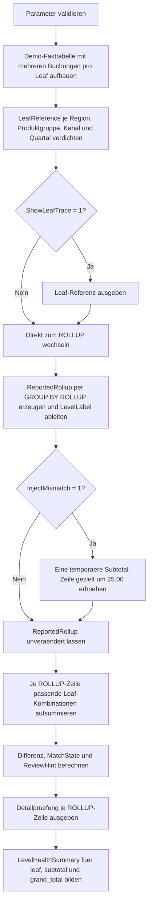

# RollupLeafVsTotalCheck.sql

Dieses Skript prueft didaktisch, ob `ROLLUP`-Totals aus denselben Leaf-Kombinationen sauber rekonstruiert werden koennen. Es eignet sich als Kontrollmuster fuer Reports, in denen Subtotals oder Grand Totals aus einer detailnahen Faktensicht abgeleitet werden.

## Uebersicht

<!-- SQLDOC:SUMMARY_TABLE:BEGIN -->
| Feld | Wert |
|---|---|
| Script | [RollupLeafVsTotalCheck.sql](RollupLeafVsTotalCheck.sql) |
| Version | `1.0` |
| Typ | `didactic-lab` |
| Kapitel | `18_Cube_Rollup` |
| Sicherheit | `read-only-tempdb` |
| Zweck | Vergleicht Leaf-Level-Summen mit `ROLLUP`-Total-Zeilen und markiert Abweichungen. |
<!-- SQLDOC:SUMMARY_TABLE:END -->

## Einordnung

Die eigentliche fachliche Frage lautet hier nicht nur, welche Totals `ROLLUP` erzeugt, sondern ob diese Totals auch nachtraeglich aus den feinsten vorhandenen Kombinationen nachvollzogen werden koennen. Das ist besonders nuetzlich, wenn ein vorgelagertes Report- oder ETL-System aggregierte Zeilen liefert und deren Konsistenz gegen die Detailbasis geprueft werden soll.

## Annahmen

- Die Umsetzung bleibt didaktisch und arbeitet nur mit lokalen Temp-Tabellen.
- Die Demo-Daten enthalten mehrere Buchungen pro Leaf-Kombination, damit die Verdichtung sichtbar wird.
- `@InjectMismatch = 1` veraendert ausschliesslich eine temporaere Ergebniszeile, um einen Fehlerfall kontrolliert zu demonstrieren.
- Die Pruefung interpretiert `NULL` in den `ROLLUP`-Zeilen als aggregierte Ebene und nicht als fachlichen Quelldatenwert.

## Anwendungsfall

Das Muster eignet sich fuer Schulung, Review und Fehlersuche, wenn voraggregierte Berichtszeilen gegen eine Detailbasis abgesichert werden sollen. Besonders hilfreich ist es fuer Abnahmen von Subtotal-Logik, Regressionstests rund um `ROLLUP` und den Vergleich zwischen gespeicherten Totals und neu berechneten Leaf-Summen.

## Parameter

<!-- SQLDOC:PARAMETERS_TABLE:BEGIN -->
| Parameter | SQL-Typ | Pflicht | Beschreibung |
|---|---|---|---|
| `@ToleranceAmount` | `DECIMAL(18,4)` | Nein | Erlaubte Abweichung zwischen gemeldeter `ROLLUP`-Zeile und rekonstruierter Leaf-Summe. |
| `@InjectMismatch` | `BIT` | Nein | Erzeugt bei `1` gezielt eine Demo-Abweichung in einer Subtotal-Zeile. |
| `@ShowLeafTrace` | `BIT` | Nein | Gibt bei `1` die verdichtete Leaf-Referenz vor der Pruefung aus. |
<!-- SQLDOC:PARAMETERS_TABLE:END -->

## Abhaengigkeiten

<!-- SQLDOC:DEPENDENCIES_LIST:BEGIN -->
- `tempdb` fuer Demo-Fakttabelle und Pruefresultate
- `GROUP BY ROLLUP`
- `GROUPING_ID`
- `CASE`
- `UPDATE` auf eine temporaere Ergebnistabelle fuer den optionalen Demo-Fehlerfall
<!-- SQLDOC:DEPENDENCIES_LIST:END -->

## Hinweise

- `LeafReference` bildet die Soll-Basis fuer alle spaeteren Vergleiche.
- `ReportedRollupPreview` zeigt die tatsaechlich geprueften `ROLLUP`-Zeilen einschliesslich optionaler Demo-Abweichung.
- `RollupConsistencyCheck` vergleicht jede Ebene gegen die Summe aller passenden Leaf-Kombinationen.
- `LevelHealthSummary` verdichtet die Ergebnisse pro Ebenentyp auf einen schnellen Kontrollblick.

## Versionshistorie

<!-- SQLDOC:VERSION_HISTORY_TABLE:BEGIN -->
| Version | Datum | User | Beschreibung |
|---|---|---|---|
| `1.0` | `2026-04-19` | `ER` | Erstversion fuer den Abgleich von Leaf-Level-Summen gegen `ROLLUP`-Totalzeilen |
<!-- SQLDOC:VERSION_HISTORY_TABLE:END -->

## Ablauf

<!-- SQLDOC:MERMAID:BEGIN -->

<!-- SQLDOC:MERMAID:END -->

## SQL-Code

<!-- SQLDOC:SQL_CODE:BEGIN -->
```sql
/*
BEGIN:SQL-HEADER v1
---
sql_header: v1
script_name: "RollupLeafVsTotalCheck.sql"
script_version: "1.0"
script_type: "didactic-lab"
chapter: "18_Cube_Rollup"

purpose: >
  Vergleicht Leaf-Level-Summen mit den durch ROLLUP erzeugten Total-Zeilen
  und prueft, ob jede aggregierte Ebene exakt aus den Detailzeilen
  nachvollzogen werden kann.

parameters:
  - name: "@ToleranceAmount"
    sql_type: "DECIMAL(18,4)"
    direction: "IN"
    required: false
    description: "Erlaubte Abweichung zwischen erwarteter Leaf-Summe und gemeldeter Total-Zeile"
  - name: "@InjectMismatch"
    sql_type: "BIT"
    direction: "IN"
    required: false
    description: "1 = eine Demo-Abweichung in einer Subtotal-Zeile erzeugen, um den Check sichtbar zu machen"
  - name: "@ShowLeafTrace"
    sql_type: "BIT"
    direction: "IN"
    required: false
    description: "1 = Leaf-Referenzdaten vor der eigentlichen Pruefung ausgeben"

result_sets:
  - name: "SourceFactPreview"
    description: "Demo-Umsatzdaten auf Buchungszeilenebene"
  - name: "LeafReference"
    description: "Auf Leaf-Level verdichtete Referenz fuer spaetere Soll-Ist-Vergleiche"
  - name: "ReportedRollupPreview"
    description: "ROLLUP-Ergebnis mit Level-Label, GroupingId und optional injizierter Demo-Abweichung"
  - name: "RollupConsistencyCheck"
    description: "Vergleicht je ROLLUP-Zeile den gemeldeten Wert mit der aus Leaf-Zeilen rekonstruierten Summe"
  - name: "LevelHealthSummary"
    description: "Zusammenfassung der Pruefergebnisse je Aggregationsebene"

dependencies:
  - "tempdb temporary tables"
  - "GROUP BY ROLLUP"
  - "GROUPING_ID"
  - "CASE"
  - "UPDATE against temporary table"

safety:
  level: "read-only-tempdb"
  writes_data: false

documentation:
  markdown_file: "T-SQL/18_Cube_Rollup/SQLScripts/RollupLeafVsTotalCheck.md"
  sync_blocks:
    - "SUMMARY_TABLE"
    - "PARAMETERS_TABLE"
    - "DEPENDENCIES_LIST"
    - "VERSION_HISTORY_TABLE"
    - "SQL_CODE"
  mermaid:
    mode: "ai-agent-from-sql"
    source: "script-body"

main_responsible:
  name: "Erhard Rainer"
  initials: "ER"

version_history:
  - version: "1.0"
    date: "2026-04-19"
    user: "ER"
    description: "Erstversion fuer den Abgleich von Leaf-Level-Summen gegen ROLLUP-Totalzeilen"

notes:
  - "Die Demo-Daten enthalten pro Leaf mehrere Buchungen, damit die Rekonstruktion aus Detailzeilen sichtbar wird"
  - "Eine optionale Demo-Abweichung wird nur in einer temporaeren Ergebnistabelle erzeugt"
---
END:SQL-HEADER v1
*/

SET NOCOUNT ON;

DECLARE @ToleranceAmount DECIMAL(18,4) = 0.01;
DECLARE @InjectMismatch BIT = 0;
DECLARE @ShowLeafTrace BIT = 1;

IF @ToleranceAmount < 0
BEGIN
    THROW 50050, '@ToleranceAmount darf nicht negativ sein.', 1;
END;

IF @InjectMismatch NOT IN (0, 1)
BEGIN
    THROW 50051, '@InjectMismatch muss 0 oder 1 sein.', 1;
END;

IF @ShowLeafTrace NOT IN (0, 1)
BEGIN
    THROW 50052, '@ShowLeafTrace muss 0 oder 1 sein.', 1;
END;

DROP TABLE IF EXISTS #SalesFact;
DROP TABLE IF EXISTS #LeafReference;
DROP TABLE IF EXISTS #ReportedRollup;
DROP TABLE IF EXISTS #RollupConsistency;
DROP TABLE IF EXISTS #LevelHealthSummary;

CREATE TABLE #SalesFact
(
    RegionCode      VARCHAR(20)   NOT NULL,
    ProductGroup    VARCHAR(30)   NOT NULL,
    SalesChannel    VARCHAR(20)   NOT NULL,
    FiscalQuarter   VARCHAR(10)   NOT NULL,
    RevenueAmount   DECIMAL(18,2) NOT NULL
);

INSERT INTO #SalesFact
(
    RegionCode,
    ProductGroup,
    SalesChannel,
    FiscalQuarter,
    RevenueAmount
)
VALUES
    ('North',   'Hardware', 'Store',   '2026-Q1',  8400.00),
    ('North',   'Hardware', 'Store',   '2026-Q1',  4200.00),
    ('North',   'Hardware', 'Online',  '2026-Q2',  5100.00),
    ('North',   'Services', 'Online',  '2026-Q2',  6100.00),
    ('North',   'Services', 'Partner', '2026-Q3',  4300.00),
    ('South',   'Hardware', 'Store',   '2026-Q1',  7800.00),
    ('South',   'Hardware', 'Store',   '2026-Q1',  3600.00),
    ('South',   'Services', 'Partner', '2026-Q3',  5900.00),
    ('South',   'Training', 'Partner', '2026-Q4',  4400.00),
    ('West',    'Hardware', 'Online',  '2026-Q1',  7200.00),
    ('West',    'Services', 'Store',   '2026-Q3',  6600.00),
    ('West',    'Training', 'Online',  '2026-Q4',  3100.00),
    ('Central', 'Hardware', 'Partner', '2026-Q4',  4700.00),
    ('Central', 'Services', 'Store',   '2026-Q2',  5400.00),
    ('Central', 'Services', 'Store',   '2026-Q2',  1900.00),
    ('Central', 'Training', 'Online',  '2026-Q4',  2800.00);

SELECT
    sf.RegionCode,
    sf.ProductGroup,
    sf.SalesChannel,
    sf.FiscalQuarter,
    sf.RevenueAmount
FROM #SalesFact AS sf
ORDER BY
    sf.RegionCode,
    sf.ProductGroup,
    sf.SalesChannel,
    sf.FiscalQuarter,
    sf.RevenueAmount DESC;

CREATE TABLE #LeafReference
(
    RegionCode      VARCHAR(20)   NOT NULL,
    ProductGroup    VARCHAR(30)   NOT NULL,
    SalesChannel    VARCHAR(20)   NOT NULL,
    FiscalQuarter   VARCHAR(10)   NOT NULL,
    BookingRows     INT           NOT NULL,
    LeafAmount      DECIMAL(18,2) NOT NULL
);

INSERT INTO #LeafReference
(
    RegionCode,
    ProductGroup,
    SalesChannel,
    FiscalQuarter,
    BookingRows,
    LeafAmount
)
SELECT
    sf.RegionCode,
    sf.ProductGroup,
    sf.SalesChannel,
    sf.FiscalQuarter,
    COUNT(*) AS BookingRows,
    SUM(sf.RevenueAmount) AS LeafAmount
FROM #SalesFact AS sf
GROUP BY
    sf.RegionCode,
    sf.ProductGroup,
    sf.SalesChannel,
    sf.FiscalQuarter;

IF @ShowLeafTrace = 1
BEGIN
    SELECT
        lr.RegionCode,
        lr.ProductGroup,
        lr.SalesChannel,
        lr.FiscalQuarter,
        lr.BookingRows,
        lr.LeafAmount
    FROM #LeafReference AS lr
    ORDER BY
        lr.RegionCode,
        lr.ProductGroup,
        lr.SalesChannel,
        lr.FiscalQuarter;
END;

CREATE TABLE #ReportedRollup
(
    RegionCode             VARCHAR(20)   NULL,
    ProductGroup           VARCHAR(30)   NULL,
    SalesChannel           VARCHAR(20)   NULL,
    FiscalQuarter          VARCHAR(10)   NULL,
    ReportedAmount         DECIMAL(18,2) NOT NULL,
    GroupingId             INT           NOT NULL,
    AggregatedDimensions   TINYINT       NOT NULL,
    LevelLabel             VARCHAR(40)   NOT NULL,
    ScopeLabel             VARCHAR(200)  NOT NULL
);

INSERT INTO #ReportedRollup
(
    RegionCode,
    ProductGroup,
    SalesChannel,
    FiscalQuarter,
    ReportedAmount,
    GroupingId,
    AggregatedDimensions,
    LevelLabel,
    ScopeLabel
)
SELECT
    sf.RegionCode,
    sf.ProductGroup,
    sf.SalesChannel,
    sf.FiscalQuarter,
    SUM(sf.RevenueAmount) AS ReportedAmount,
    GROUPING_ID
    (
        sf.RegionCode,
        sf.ProductGroup,
        sf.SalesChannel,
        sf.FiscalQuarter
    ) AS GroupingId,
    GROUPING(sf.RegionCode)
    + GROUPING(sf.ProductGroup)
    + GROUPING(sf.SalesChannel)
    + GROUPING(sf.FiscalQuarter) AS AggregatedDimensions,
    CASE
        WHEN GROUPING(sf.RegionCode)
           + GROUPING(sf.ProductGroup)
           + GROUPING(sf.SalesChannel)
           + GROUPING(sf.FiscalQuarter) = 0 THEN 'leaf'
        WHEN GROUPING(sf.RegionCode)
           + GROUPING(sf.ProductGroup)
           + GROUPING(sf.SalesChannel)
           + GROUPING(sf.FiscalQuarter) = 4 THEN 'grand_total'
        ELSE 'subtotal'
    END AS LevelLabel,
    CONCAT(
        CASE WHEN GROUPING(sf.RegionCode) = 1 THEN '(all regions)' ELSE sf.RegionCode END,
        ' | ',
        CASE WHEN GROUPING(sf.ProductGroup) = 1 THEN '(all product groups)' ELSE sf.ProductGroup END,
        ' | ',
        CASE WHEN GROUPING(sf.SalesChannel) = 1 THEN '(all channels)' ELSE sf.SalesChannel END,
        ' | ',
        CASE WHEN GROUPING(sf.FiscalQuarter) = 1 THEN '(all quarters)' ELSE sf.FiscalQuarter END
    ) AS ScopeLabel
FROM #SalesFact AS sf
GROUP BY ROLLUP
(
    sf.RegionCode,
    sf.ProductGroup,
    sf.SalesChannel,
    sf.FiscalQuarter
);

IF @InjectMismatch = 1
BEGIN
    UPDATE rr
    SET rr.ReportedAmount = rr.ReportedAmount + 25.00
    FROM #ReportedRollup AS rr
    WHERE rr.RegionCode = 'North'
      AND rr.ProductGroup = 'Hardware'
      AND rr.SalesChannel IS NULL
      AND rr.FiscalQuarter IS NULL;
END;

SELECT
    rr.RegionCode,
    rr.ProductGroup,
    rr.SalesChannel,
    rr.FiscalQuarter,
    rr.ReportedAmount,
    rr.GroupingId,
    rr.AggregatedDimensions,
    rr.LevelLabel,
    rr.ScopeLabel
FROM #ReportedRollup AS rr
ORDER BY
    rr.AggregatedDimensions DESC,
    rr.GroupingId ASC,
    rr.RegionCode,
    rr.ProductGroup,
    rr.SalesChannel,
    rr.FiscalQuarter;

CREATE TABLE #RollupConsistency
(
    RegionCode             VARCHAR(20)   NULL,
    ProductGroup           VARCHAR(30)   NULL,
    SalesChannel           VARCHAR(20)   NULL,
    FiscalQuarter          VARCHAR(10)   NULL,
    GroupingId             INT           NOT NULL,
    AggregatedDimensions   TINYINT       NOT NULL,
    LevelLabel             VARCHAR(40)   NOT NULL,
    ScopeLabel             VARCHAR(200)  NOT NULL,
    CoveredLeafRows        INT           NOT NULL,
    ReportedAmount         DECIMAL(18,2) NOT NULL,
    ExpectedLeafAmount     DECIMAL(18,2) NOT NULL,
    DifferenceAmount       DECIMAL(18,2) NOT NULL,
    MatchState             VARCHAR(20)   NOT NULL,
    ReviewHint             VARCHAR(220)  NOT NULL
);

INSERT INTO #RollupConsistency
(
    RegionCode,
    ProductGroup,
    SalesChannel,
    FiscalQuarter,
    GroupingId,
    AggregatedDimensions,
    LevelLabel,
    ScopeLabel,
    CoveredLeafRows,
    ReportedAmount,
    ExpectedLeafAmount,
    DifferenceAmount,
    MatchState,
    ReviewHint
)
SELECT
    rr.RegionCode,
    rr.ProductGroup,
    rr.SalesChannel,
    rr.FiscalQuarter,
    rr.GroupingId,
    rr.AggregatedDimensions,
    rr.LevelLabel,
    rr.ScopeLabel,
    COUNT(*) AS CoveredLeafRows,
    rr.ReportedAmount,
    SUM(lr.LeafAmount) AS ExpectedLeafAmount,
    CAST(rr.ReportedAmount - SUM(lr.LeafAmount) AS DECIMAL(18,2)) AS DifferenceAmount,
    CASE
        WHEN ABS(rr.ReportedAmount - SUM(lr.LeafAmount)) <= @ToleranceAmount THEN 'match'
        ELSE 'mismatch'
    END AS MatchState,
    CASE
        WHEN ABS(rr.ReportedAmount - SUM(lr.LeafAmount)) <= @ToleranceAmount THEN 'Leaf-Summe und ROLLUP-Zeile stimmen innerhalb der Toleranz ueberein.'
        WHEN rr.LevelLabel = 'grand_total' THEN 'Grand Total weicht von der Summe aller Leaf-Zeilen ab.'
        WHEN rr.LevelLabel = 'subtotal' THEN 'Die Subtotal-Zeile passt nicht zu den darunterliegenden Leaf-Kombinationen.'
        ELSE 'Eine Leaf-Zeile sollte exakt ihrer eigenen Referenzsumme entsprechen.'
    END AS ReviewHint
FROM #ReportedRollup AS rr
INNER JOIN #LeafReference AS lr
    ON (rr.RegionCode IS NULL OR lr.RegionCode = rr.RegionCode)
   AND (rr.ProductGroup IS NULL OR lr.ProductGroup = rr.ProductGroup)
   AND (rr.SalesChannel IS NULL OR lr.SalesChannel = rr.SalesChannel)
   AND (rr.FiscalQuarter IS NULL OR lr.FiscalQuarter = rr.FiscalQuarter)
GROUP BY
    rr.RegionCode,
    rr.ProductGroup,
    rr.SalesChannel,
    rr.FiscalQuarter,
    rr.GroupingId,
    rr.AggregatedDimensions,
    rr.LevelLabel,
    rr.ScopeLabel,
    rr.ReportedAmount;

SELECT
    rc.RegionCode,
    rc.ProductGroup,
    rc.SalesChannel,
    rc.FiscalQuarter,
    rc.GroupingId,
    rc.AggregatedDimensions,
    rc.LevelLabel,
    rc.ScopeLabel,
    rc.CoveredLeafRows,
    rc.ReportedAmount,
    rc.ExpectedLeafAmount,
    rc.DifferenceAmount,
    rc.MatchState,
    rc.ReviewHint
FROM #RollupConsistency AS rc
ORDER BY
    CASE rc.MatchState
        WHEN 'mismatch' THEN 0
        ELSE 1
    END,
    rc.AggregatedDimensions DESC,
    rc.GroupingId ASC,
    rc.RegionCode,
    rc.ProductGroup,
    rc.SalesChannel,
    rc.FiscalQuarter;

CREATE TABLE #LevelHealthSummary
(
    LevelLabel          VARCHAR(40)   NOT NULL,
    RowsChecked         INT           NOT NULL,
    MatchingRows        INT           NOT NULL,
    MismatchingRows     INT           NOT NULL,
    MaximumDifference   DECIMAL(18,2) NOT NULL,
    StatusCaption       VARCHAR(160)  NOT NULL
);

INSERT INTO #LevelHealthSummary
(
    LevelLabel,
    RowsChecked,
    MatchingRows,
    MismatchingRows,
    MaximumDifference,
    StatusCaption
)
SELECT
    rc.LevelLabel,
    COUNT(*) AS RowsChecked,
    SUM(CASE WHEN rc.MatchState = 'match' THEN 1 ELSE 0 END) AS MatchingRows,
    SUM(CASE WHEN rc.MatchState = 'mismatch' THEN 1 ELSE 0 END) AS MismatchingRows,
    MAX(ABS(rc.DifferenceAmount)) AS MaximumDifference,
    CASE
        WHEN SUM(CASE WHEN rc.MatchState = 'mismatch' THEN 1 ELSE 0 END) = 0 THEN 'Alle geprueften Zeilen dieser Ebene stimmen mit den Leaf-Summen ueberein.'
        ELSE 'Mindestens eine Zeile dieser Ebene sollte fachlich oder technisch nachgeprueft werden.'
    END AS StatusCaption
FROM #RollupConsistency AS rc
GROUP BY
    rc.LevelLabel;

SELECT
    lhs.LevelLabel,
    lhs.RowsChecked,
    lhs.MatchingRows,
    lhs.MismatchingRows,
    lhs.MaximumDifference,
    lhs.StatusCaption
FROM #LevelHealthSummary AS lhs
ORDER BY
    CASE lhs.LevelLabel
        WHEN 'leaf' THEN 1
        WHEN 'subtotal' THEN 2
        ELSE 3
    END;
```
<!-- SQLDOC:SQL_CODE:END -->
